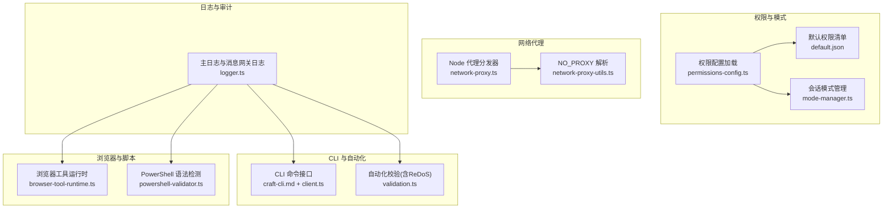
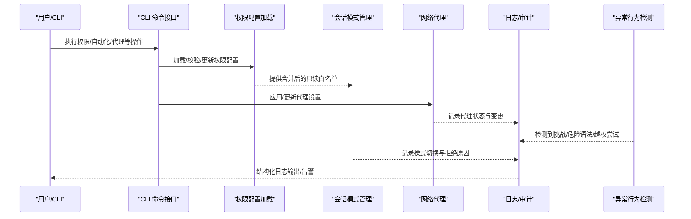
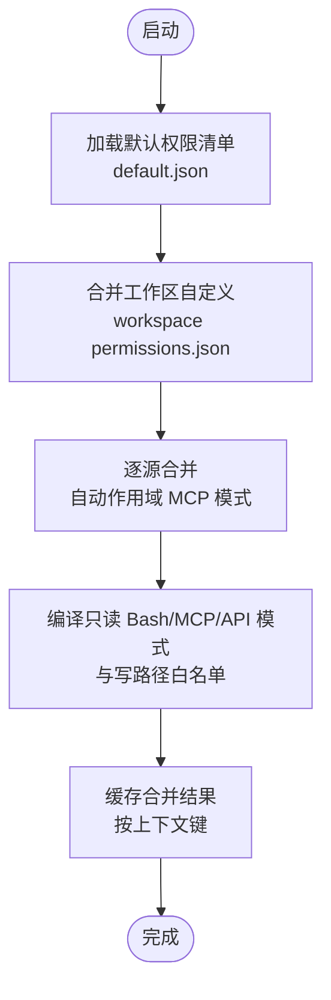
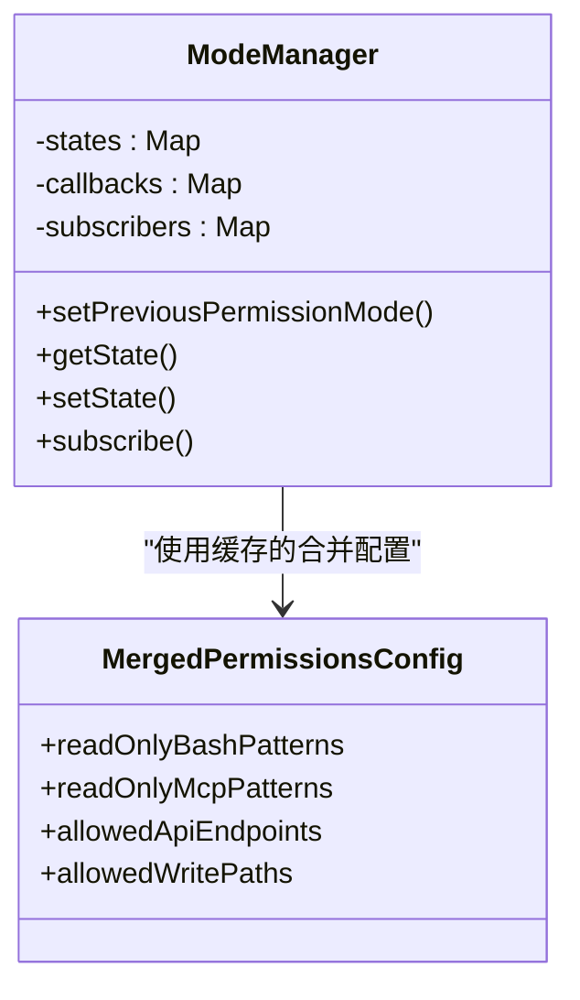
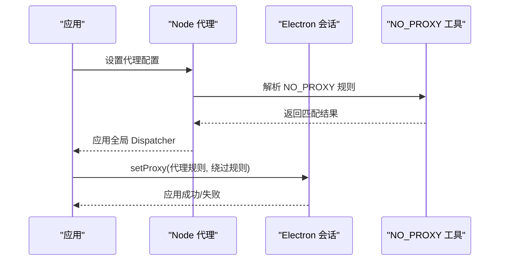
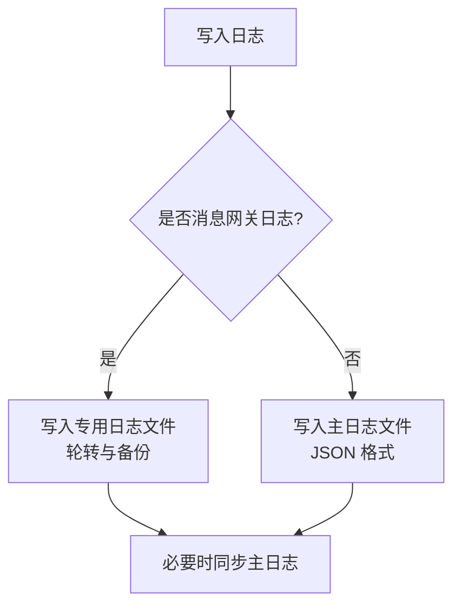
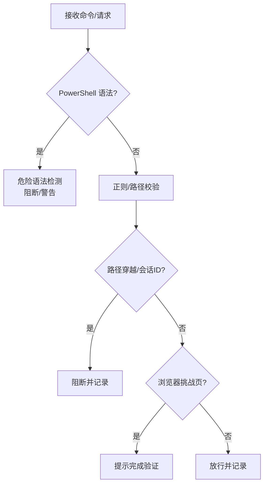
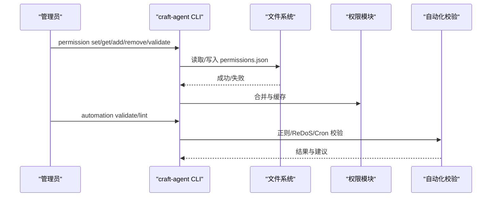
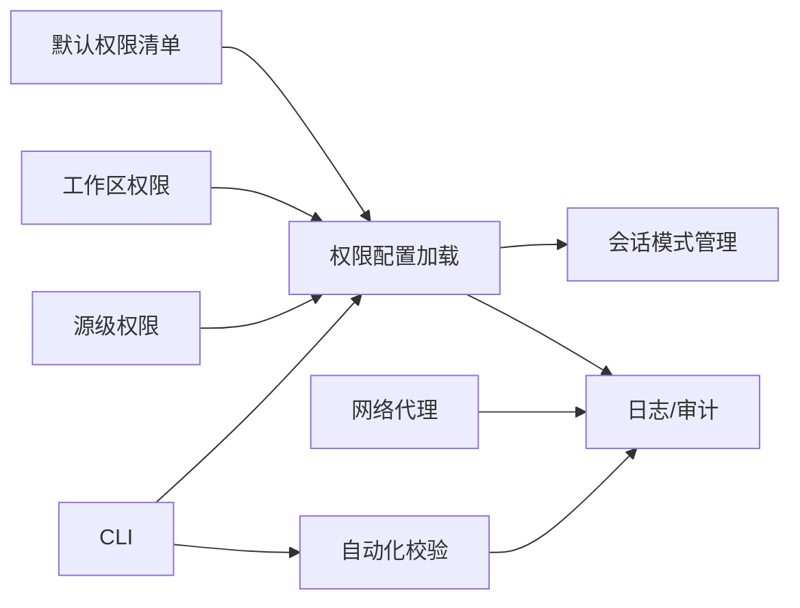

# 安全策略

<cite>
**本文引用的文件**
- [apps/electron/resources/docs/permissions.md](file://apps/electron/resources/docs/permissions.md)
- [apps/electron/resources/permissions/default.json](file://apps/electron/resources/permissions/default.json)
- [apps/electron/src/main/network-proxy.ts](file://apps/electron/src/main/network-proxy.ts)
- [apps/electron/src/main/network-proxy-utils.ts](file://apps/electron/src/main/network-proxy-utils.ts)
- [apps/electron/src/main/logger.ts](file://apps/electron/src/main/logger.ts)
- [apps/electron/resources/config-defaults.json](file://apps/electron/resources/config-defaults.json)
- [apps/cli/src/client.ts](file://apps/cli/src/client.ts)
- [apps/cli/src/commands.test.ts](file://apps/cli/src/commands.test.ts)
- [apps/cli/src/run.test.ts](file://apps/cli/src/run.test.ts)
- [apps/electron/resources/docs/craft-cli.md](file://apps/electron/resources/docs/craft-cli.md)
- [packages/shared/src/agent/permissions-config.ts](file://packages/shared/src/agent/permissions-config.ts)
- [packages/shared/src/agent/mode-manager.ts](file://packages/shared/src/agent/mode-manager.ts)
- [packages/shared/src/agent/errors.ts](file://packages/shared/src/agent/errors.ts)
- [packages/shared/src/agent/browser-tool-runtime.ts](file://packages/shared/src/agent/browser-tool-runtime.ts)
- [packages/shared/src/agent/powershell-validator.ts](file://packages/shared/src/agent/powershell-validator.ts)
- [packages/shared/src/automations/validation.ts](file://packages/shared/src/automations/validation.ts)
- [packages/shared/tests/session-validation.test.ts](file://packages/shared/tests/session-validation.test.ts)
- [packages/shared/tests/mode-manager.test.ts](file://packages/shared/tests/mode-manager.test.ts)
- [packages/shared/src/utils/__tests__/binary-detection-base64.test.ts](file://packages/shared/src/utils/__tests__/binary-detection-base64.test.ts)
- [SECURITY.md](file://SECURITY.md)
</cite>

## 目录
1. [引言](#引言)
2. [项目结构](#项目结构)
3. [核心组件](#核心组件)
4. [架构总览](#架构总览)
5. [详细组件分析](#详细组件分析)
6. [依赖关系分析](#依赖关系分析)
7. [性能考量](#性能考量)
8. [故障排查指南](#故障排查指南)
9. [结论](#结论)
10. [附录](#附录)

## 引言
本文件面向企业安全与合规工程师，系统化阐述本项目的系统级安全策略与实施机制，覆盖网络代理安全、文件访问控制、进程隔离策略、权限缓存与合并、安全审计日志、异常行为检测与告警、以及可落地的安全配置模板与基线建议。文档以代码为依据，辅以可视化图示，帮助读者快速理解并部署符合企业安全基线的配置。

## 项目结构
围绕安全策略的关键目录与文件如下：
- 权限与模式：权限配置加载与合并、会话模式管理、命令白名单与路径限制
- 网络代理：Node/undici 与 Electron 会话代理统一配置与 NO_PROXY 规则
- 日志与审计：结构化日志输出、消息网关专用日志、日志轮转与敏感信息归一化
- CLI 与自动化：安全的 CLI 命令接口、自动化规则校验（含 ReDoS 防护）
- 浏览器工具与 PowerShell：挑战页面识别与阻断、PowerShell 危险语法检测
- 安全策略文档与默认配置：权限配置指南、默认权限清单、工作区默认安全模式

图表来源
- [packages/shared/src/agent/permissions-config.ts:65-215](file://packages/shared/src/agent/permissions-config.ts#L65-L215)
- [packages/shared/src/agent/mode-manager.ts:224-266](file://packages/shared/src/agent/mode-manager.ts#L224-L266)
- [apps/electron/resources/permissions/default.json:1-950](file://apps/electron/resources/permissions/default.json#L1-L950)
- [apps/electron/src/main/network-proxy.ts:1-175](file://apps/electron/src/main/network-proxy.ts#L1-L175)
- [apps/electron/src/main/network-proxy-utils.ts:1-107](file://apps/electron/src/main/network-proxy-utils.ts#L1-L107)
- [apps/electron/src/main/logger.ts:1-218](file://apps/electron/src/main/logger.ts#L1-L218)
- [apps/electron/resources/docs/craft-cli.md:1-396](file://apps/electron/resources/docs/craft-cli.md#L1-L396)
- [packages/shared/src/automations/validation.ts:64-124](file://packages/shared/src/automations/validation.ts#L64-L124)
- [packages/shared/src/agent/browser-tool-runtime.ts:817-850](file://packages/shared/src/agent/browser-tool-runtime.ts#L817-L850)
- [packages/shared/src/agent/powershell-validator.ts:740-786](file://packages/shared/src/agent/powershell-validator.ts#L740-L786)

章节来源
- [apps/electron/resources/docs/permissions.md:1-339](file://apps/electron/resources/docs/permissions.md#L1-L339)
- [apps/electron/resources/permissions/default.json:1-950](file://apps/electron/resources/permissions/default.json#L1-L950)
- [apps/electron/resources/config-defaults.json:1-24](file://apps/electron/resources/config-defaults.json#L1-L24)

## 核心组件
- 权限配置与合并：从默认清单加载、叠加工作区与源级自定义配置，支持自动作用域 MCP 模式，构建只读 Bash/MCP/API 白名单与写路径白名单。
- 会话模式管理：每会话独立的状态机，支持安全（ask/safe）与执行（allow-all）模式切换，并持久化过渡上下文。
- 网络代理：统一 Node/undici 与 Electron 会话代理，支持按协议路由与 NO_PROXY 规则绕过，确保出站流量受控。
- 日志与审计：结构化 JSON 日志、消息网关专用日志、日志轮转与错误对象归一化，便于合规审计与问题定位。
- 异常行为检测：浏览器挑战页识别、PowerShell 危险语法检测、ReDoS 正则校验、路径穿越防护、会话 ID 校验与清理。
- CLI 与自动化：通过 CLI 管理权限与配置；自动化规则在加载阶段进行正则复杂度与危险模式检测，避免灾难性回溯与越权。

章节来源
- [packages/shared/src/agent/permissions-config.ts:65-215](file://packages/shared/src/agent/permissions-config.ts#L65-L215)
- [packages/shared/src/agent/mode-manager.ts:224-266](file://packages/shared/src/agent/mode-manager.ts#L224-L266)
- [apps/electron/src/main/network-proxy.ts:1-175](file://apps/electron/src/main/network-proxy.ts#L1-L175)
- [apps/electron/src/main/logger.ts:1-218](file://apps/electron/src/main/logger.ts#L1-L218)
- [packages/shared/src/automations/validation.ts:64-124](file://packages/shared/src/automations/validation.ts#L64-L124)
- [packages/shared/src/agent/browser-tool-runtime.ts:817-850](file://packages/shared/src/agent/browser-tool-runtime.ts#L817-L850)
- [packages/shared/src/agent/powershell-validator.ts:740-786](file://packages/shared/src/agent/powershell-validator.ts#L740-L786)

## 架构总览
下图展示安全策略在系统中的关键交互：权限配置加载与合并、网络代理配置、日志记录、异常行为检测与 CLI/自动化安全校验。

图表来源
- [apps/electron/resources/docs/craft-cli.md:250-308](file://apps/electron/resources/docs/craft-cli.md#L250-L308)
- [packages/shared/src/agent/permissions-config.ts:668-727](file://packages/shared/src/agent/permissions-config.ts#L668-L727)
- [apps/electron/src/main/network-proxy.ts:152-174](file://apps/electron/src/main/network-proxy.ts#L152-L174)
- [apps/electron/src/main/logger.ts:141-175](file://apps/electron/src/main/logger.ts#L141-L175)
- [packages/shared/src/agent/browser-tool-runtime.ts:817-850](file://packages/shared/src/agent/browser-tool-runtime.ts#L817-L850)
- [packages/shared/src/agent/powershell-validator.ts:740-786](file://packages/shared/src/agent/powershell-validator.ts#L740-L786)

## 详细组件分析

### 组件A：权限配置与合并（Explore 模式）
- 默认权限清单来自应用内嵌资源，包含大量只读 Bash/MCP/API 模式与允许写入路径白名单。
- 合并策略：工作区全局规则 + 源级自动作用域规则 + 应用默认规则，规则累加不收紧。
- 自动作用域：源级 MCP 模式在运行时自动前缀为“mcp__<slug>__”，避免跨源误放通。
- 缓存与版本迁移：首次安装或默认清单版本更新时复制/迁移，保留用户自定义项。

图表来源
- [apps/electron/resources/permissions/default.json:1-950](file://apps/electron/resources/permissions/default.json#L1-L950)
- [packages/shared/src/agent/permissions-config.ts:668-727](file://packages/shared/src/agent/permissions-config.ts#L668-L727)
- [apps/electron/resources/docs/permissions.md:18-31](file://apps/electron/resources/docs/permissions.md#L18-L31)

章节来源
- [apps/electron/resources/docs/permissions.md:32-178](file://apps/electron/resources/docs/permissions.md#L32-L178)
- [apps/electron/resources/permissions/default.json:1-950](file://apps/electron/resources/permissions/default.json#L1-L950)
- [packages/shared/src/agent/permissions-config.ts:65-215](file://packages/shared/src/agent/permissions-config.ts#L65-L215)

### 组件B：会话模式管理与权限缓存
- 每会话独立状态，初始默认“ask”，支持“safe”与“allow-all”切换。
- 持久化过渡上下文，保证重启后仍可恢复模式变更历史。
- 权限缓存：基于上下文键（工作区根、活动源列表）缓存合并后的权限配置，减少重复计算。

图表来源
- [packages/shared/src/agent/mode-manager.ts:224-266](file://packages/shared/src/agent/mode-manager.ts#L224-L266)
- [packages/shared/src/agent/permissions-config.ts:668-727](file://packages/shared/src/agent/permissions-config.ts#L668-L727)

章节来源
- [packages/shared/src/agent/mode-manager.ts:224-266](file://packages/shared/src/agent/mode-manager.ts#L224-L266)
- [packages/shared/src/agent/permissions-config.ts:668-727](file://packages/shared/src/agent/permissions-config.ts#L668-L727)

### 组件C：网络代理安全（Node/undici 与 Electron）
- Node 侧：自定义 Dispatcher 将 HTTP/HTTPS 请求路由至对应 ProxyAgent 或直连，尊重 NO_PROXY 规则。
- Electron 侧：对默认会话与浏览器面板分区会话设置固定服务器代理与绕过规则。
- NO_PROXY 解析：支持通配符、子域名后缀、IPv6、端口限定等格式。

图表来源
- [apps/electron/src/main/network-proxy.ts:1-175](file://apps/electron/src/main/network-proxy.ts#L1-L175)
- [apps/electron/src/main/network-proxy-utils.ts:1-107](file://apps/electron/src/main/network-proxy-utils.ts#L1-L107)

章节来源
- [apps/electron/src/main/network-proxy.ts:1-175](file://apps/electron/src/main/network-proxy.ts#L1-L175)
- [apps/electron/src/main/network-proxy-utils.ts:1-107](file://apps/electron/src/main/network-proxy-utils.ts#L1-L107)

### 组件D：安全审计日志与消息网关日志
- 主日志：根据调试模式启用文件与控制台传输，统一 JSON 输出格式，支持错误对象归一化。
- 消息网关日志：独立文件路径与轮转策略，结构化字段包含时间戳、级别、作用域、上下文与元数据。
- 日志轮转：超过阈值自动备份旧日志，失败时降级记录到主日志。

图表来源
- [apps/electron/src/main/logger.ts:141-175](file://apps/electron/src/main/logger.ts#L141-L175)
- [apps/electron/src/main/logger.ts:88-104](file://apps/electron/src/main/logger.ts#L88-L104)

章节来源
- [apps/electron/src/main/logger.ts:1-218](file://apps/electron/src/main/logger.ts#L1-L218)

### 组件E：异常行为检测与阻断
- 浏览器挑战页检测：当可交互节点数量极低且出现典型风控信号时，提示用户完成人机验证。
- PowerShell 危险语法检测：阻断子表达式、方法调用等潜在执行风险。
- ReDoS 正则校验：限制长度、拒绝嵌套量词与重复分支等高风险模式。
- 路径穿越与会话 ID 校验：严格清洗输入，防止目录遍历与非法标识。

图表来源
- [packages/shared/src/agent/browser-tool-runtime.ts:817-850](file://packages/shared/src/agent/browser-tool-runtime.ts#L817-L850)
- [packages/shared/src/agent/powershell-validator.ts:740-786](file://packages/shared/src/agent/powershell-validator.ts#L740-L786)
- [packages/shared/src/automations/validation.ts:64-124](file://packages/shared/src/automations/validation.ts#L64-L124)
- [packages/shared/tests/session-validation.test.ts:98-135](file://packages/shared/tests/session-validation.test.ts#L98-L135)

章节来源
- [packages/shared/src/agent/browser-tool-runtime.ts:817-850](file://packages/shared/src/agent/browser-tool-runtime.ts#L817-L850)
- [packages/shared/src/agent/powershell-validator.ts:740-786](file://packages/shared/src/agent/powershell-validator.ts#L740-L786)
- [packages/shared/src/automations/validation.ts:64-124](file://packages/shared/src/automations/validation.ts#L64-L124)
- [packages/shared/tests/session-validation.test.ts:98-135](file://packages/shared/tests/session-validation.test.ts#L98-L135)

### 组件F：CLI 与自动化安全配置
- CLI：提供权限、源、技能、自动化、主题等实体的增删改查与校验命令，推荐通过 CLI 管理权限而非直接编辑 JSON。
- 自动化：加载阶段进行正则复杂度与 ReDoS 检测、Cron 表达式校验、权限模式警告（allow-all）。

图表来源
- [apps/electron/resources/docs/craft-cli.md:250-308](file://apps/electron/resources/docs/craft-cli.md#L250-L308)
- [packages/shared/src/automations/validation.ts:64-124](file://packages/shared/src/automations/validation.ts#L64-L124)
- [packages/shared/src/agent/permissions-config.ts:668-727](file://packages/shared/src/agent/permissions-config.ts#L668-L727)

章节来源
- [apps/electron/resources/docs/craft-cli.md:1-396](file://apps/electron/resources/docs/craft-cli.md#L1-L396)
- [packages/shared/src/automations/validation.ts:64-124](file://packages/shared/src/automations/validation.ts#L64-L124)

## 依赖关系分析
- 权限模块依赖默认清单与工作区/源级自定义配置，向上游提供只读白名单与写路径白名单。
- 会话模式管理依赖权限模块提供的合并配置，决定工具执行许可与拒绝原因。
- 网络代理模块独立于权限，但其 NO_PROXY 规则影响出站访问范围。
- 日志模块被各子系统调用，形成统一审计入口。
- CLI 与自动化模块依赖权限与日志模块，保障配置与规则的可审计性。

图表来源
- [apps/electron/resources/permissions/default.json:1-950](file://apps/electron/resources/permissions/default.json#L1-L950)
- [packages/shared/src/agent/permissions-config.ts:668-727](file://packages/shared/src/agent/permissions-config.ts#L668-L727)
- [packages/shared/src/agent/mode-manager.ts:224-266](file://packages/shared/src/agent/mode-manager.ts#L224-L266)
- [apps/electron/src/main/network-proxy.ts:1-175](file://apps/electron/src/main/network-proxy.ts#L1-L175)
- [apps/electron/src/main/logger.ts:1-218](file://apps/electron/src/main/logger.ts#L1-L218)
- [apps/electron/resources/docs/craft-cli.md:250-308](file://apps/electron/resources/docs/craft-cli.md#L250-L308)
- [packages/shared/src/automations/validation.ts:64-124](file://packages/shared/src/automations/validation.ts#L64-L124)

章节来源
- [packages/shared/src/agent/permissions-config.ts:668-727](file://packages/shared/src/agent/permissions-config.ts#L668-L727)
- [packages/shared/src/agent/mode-manager.ts:224-266](file://packages/shared/src/agent/mode-manager.ts#L224-L266)
- [apps/electron/src/main/network-proxy.ts:1-175](file://apps/electron/src/main/network-proxy.ts#L1-L175)
- [apps/electron/src/main/logger.ts:1-218](file://apps/electron/src/main/logger.ts#L1-L218)
- [apps/electron/resources/docs/craft-cli.md:250-308](file://apps/electron/resources/docs/craft-cli.md#L250-L308)
- [packages/shared/src/automations/validation.ts:64-124](file://packages/shared/src/automations/validation.ts#L64-L124)

## 性能考量
- 权限合并与缓存：通过上下文键缓存合并结果，避免重复解析与拼接，默认清单版本更新时增量合并，降低 I/O 与 CPU 开销。
- 代理分发器：按协议选择代理或直连，NO_PROXY 匹配采用预解析规则集，命中后直接走直连 Agent，减少不必要的代理握手。
- 日志轮转：固定大小轮转，避免单文件过大导致写入延迟与磁盘压力。
- 正则与 AST 校验：在加载阶段集中执行，避免运行期重复开销；对危险模式采用短路拒绝策略。

## 故障排查指南
- 代理无法生效
  - 检查代理设置是否已持久化并应用；确认 NO_PROXY 规则是否正确解析。
  - 参考：[网络代理配置流程:152-174](file://apps/electron/src/main/network-proxy.ts#L152-L174)，[NO_PROXY 规则解析:32-106](file://apps/electron/src/main/network-proxy-utils.ts#L32-L106)
- 权限未按预期生效
  - 使用 CLI 验证权限文件；核对工作区/源级规则合并顺序与自动作用域。
  - 参考：[权限合并逻辑:668-727](file://packages/shared/src/agent/permissions-config.ts#L668-L727)，[权限 CLI 命令:250-308](file://apps/electron/resources/docs/craft-cli.md#L250-L308)
- 日志缺失或过大
  - 确认调试模式与传输开关；检查消息网关日志轮转是否成功。
  - 参考：[日志配置与轮转:38-104](file://apps/electron/src/main/logger.ts#L38-L104)
- 自动化规则加载失败
  - 检查正则复杂度与 ReDoS 检测结果；确认 Cron 表达式合法性。
  - 参考：[自动化校验:64-124](file://packages/shared/src/automations/validation.ts#L64-L124)
- 浏览器挑战页频繁触发
  - 检查目标站点的风控信号与可交互节点数量；必要时调整代理或绕过规则。
  - 参考：[浏览器挑战检测:817-850](file://packages/shared/src/agent/browser-tool-runtime.ts#L817-L850)
- PowerShell 命令被阻断
  - 检查是否存在子表达式或危险方法调用；调整为安全形式或提升权限模式。
  - 参考：[PowerShell 危险语法检测:740-786](file://packages/shared/src/agent/powershell-validator.ts#L740-L786)

章节来源
- [apps/electron/src/main/network-proxy.ts:152-174](file://apps/electron/src/main/network-proxy.ts#L152-L174)
- [apps/electron/src/main/network-proxy-utils.ts:32-106](file://apps/electron/src/main/network-proxy-utils.ts#L32-L106)
- [packages/shared/src/agent/permissions-config.ts:668-727](file://packages/shared/src/agent/permissions-config.ts#L668-L727)
- [apps/electron/resources/docs/craft-cli.md:250-308](file://apps/electron/resources/docs/craft-cli.md#L250-L308)
- [apps/electron/src/main/logger.ts:38-104](file://apps/electron/src/main/logger.ts#L38-L104)
- [packages/shared/src/automations/validation.ts:64-124](file://packages/shared/src/automations/validation.ts#L64-L124)
- [packages/shared/src/agent/browser-tool-runtime.ts:817-850](file://packages/shared/src/agent/browser-tool-runtime.ts#L817-L850)
- [packages/shared/src/agent/powershell-validator.ts:740-786](file://packages/shared/src/agent/powershell-validator.ts#L740-L786)

## 结论
本项目通过“默认最小权限 + 可审计的 CLI 管理 + 运行期异常检测”的组合，构建了企业级安全基线。权限配置的自动作用域与缓存、网络代理的 NO_PROXY 细粒度控制、结构化日志与轮转、以及自动化规则的 ReDoS 防护，共同构成了可落地、可扩展、可合规的安全体系。建议在生产环境中启用安全模式、定期审查权限与自动化规则、并结合日志审计进行持续监控。

## 附录

### 安全配置模板与默认权限设置
- 默认权限清单位置与版本：[默认权限清单:1-3](file://apps/electron/resources/permissions/default.json#L1-L3)
- 工作区默认安全模式与可循环模式：[工作区默认配置:15-22](file://apps/electron/resources/config-defaults.json#L15-L22)
- Explore 模式权限规则与最佳实践：[权限配置指南:1-339](file://apps/electron/resources/docs/permissions.md#L1-L339)

章节来源
- [apps/electron/resources/permissions/default.json:1-950](file://apps/electron/resources/permissions/default.json#L1-L950)
- [apps/electron/resources/config-defaults.json:15-22](file://apps/electron/resources/config-defaults.json#L15-L22)
- [apps/electron/resources/docs/permissions.md:1-339](file://apps/electron/resources/docs/permissions.md#L1-L339)

### 自定义安全规则与威胁检测实现指南
- 使用 CLI 管理权限：[craft-agent permission 命令:250-308](file://apps/electron/resources/docs/craft-cli.md#L250-L308)
- 自动化规则安全校验：[自动化校验:64-124](file://packages/shared/src/automations/validation.ts#L64-L124)
- PowerShell 危险语法检测：[PowerShell 校验:740-786](file://packages/shared/src/agent/powershell-validator.ts#L740-L786)
- 浏览器挑战页检测：[浏览器工具运行时:817-850](file://packages/shared/src/agent/browser-tool-runtime.ts#L817-L850)

章节来源
- [apps/electron/resources/docs/craft-cli.md:250-308](file://apps/electron/resources/docs/craft-cli.md#L250-L308)
- [packages/shared/src/automations/validation.ts:64-124](file://packages/shared/src/automations/validation.ts#L64-L124)
- [packages/shared/src/agent/powershell-validator.ts:740-786](file://packages/shared/src/agent/powershell-validator.ts#L740-L786)
- [packages/shared/src/agent/browser-tool-runtime.ts:817-850](file://packages/shared/src/agent/browser-tool-runtime.ts#L817-L850)

### 合规性检查与漏洞报告
- 漏洞报告渠道与流程：[安全政策:1-59](file://SECURITY.md#L1-L59)
- 支持版本与更新策略：同上

章节来源
- [SECURITY.md:1-59](file://SECURITY.md#L1-L59)