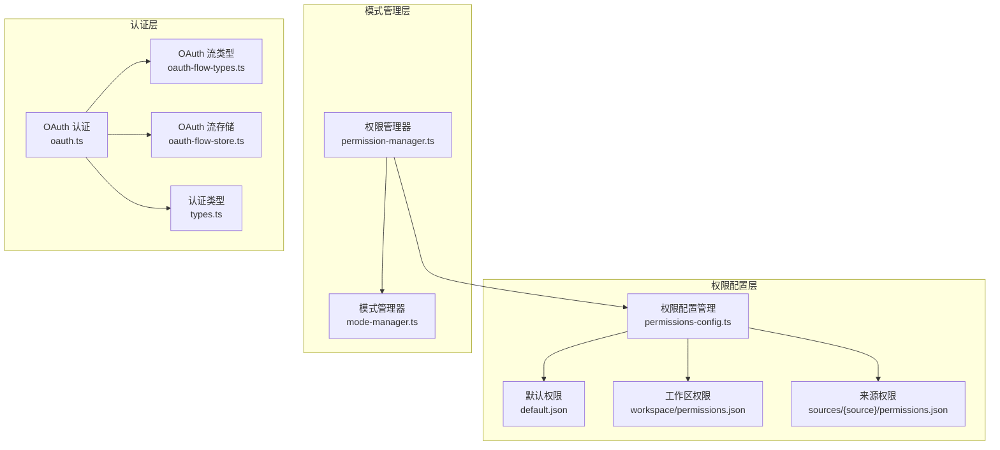
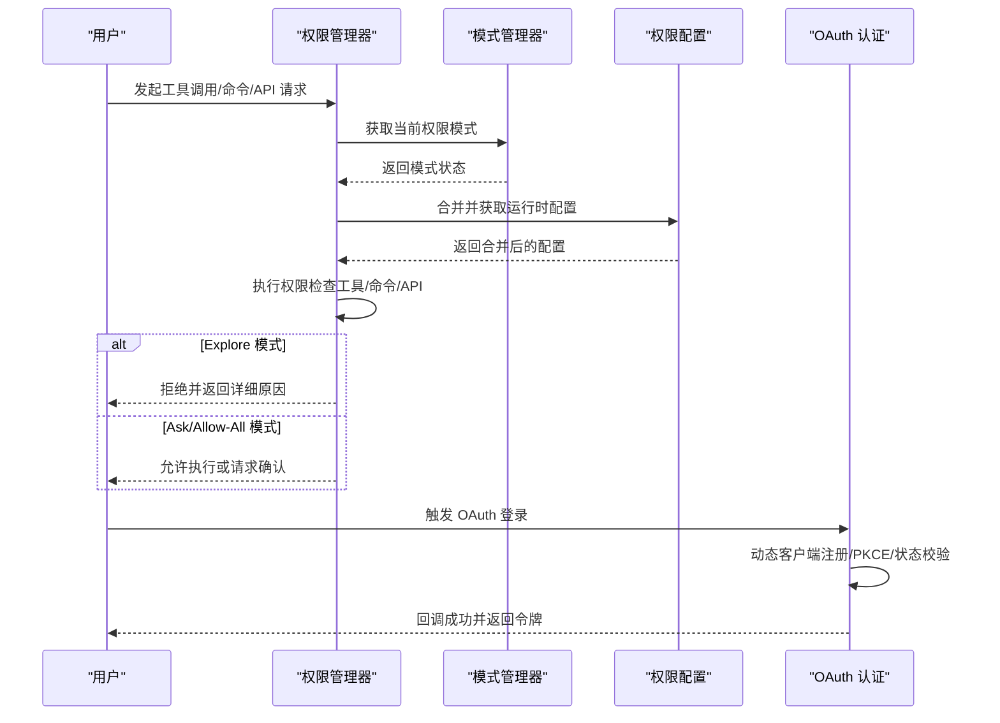
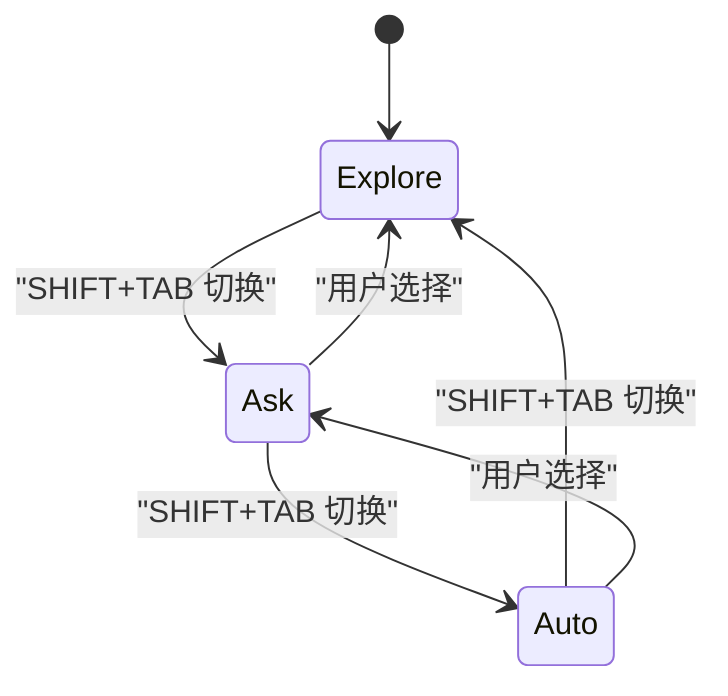
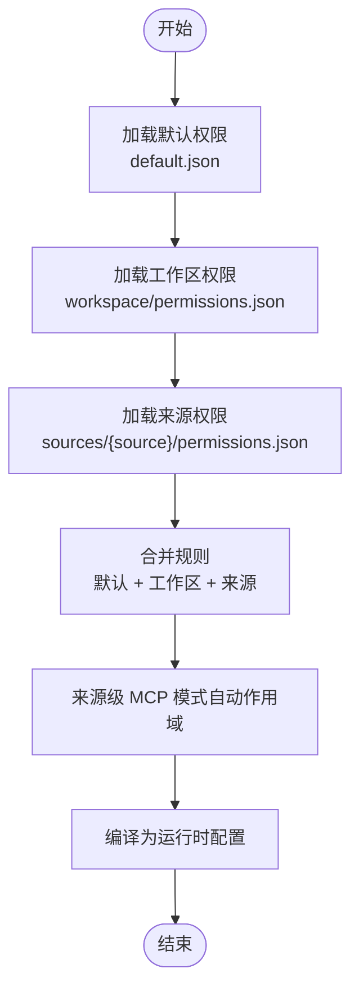
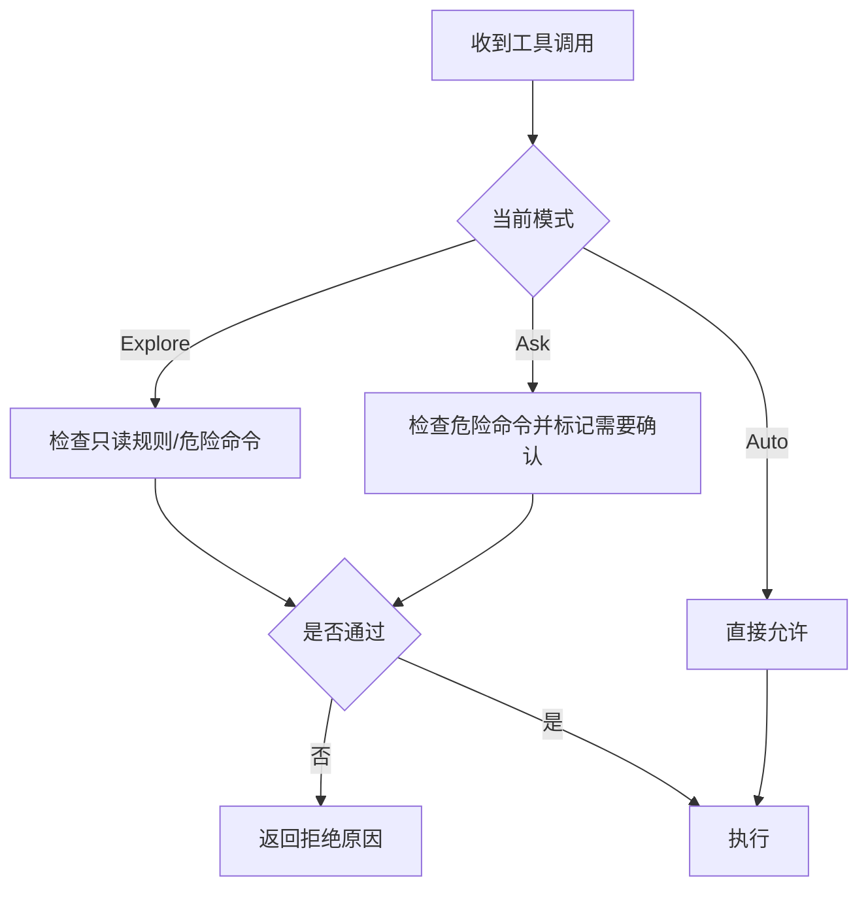
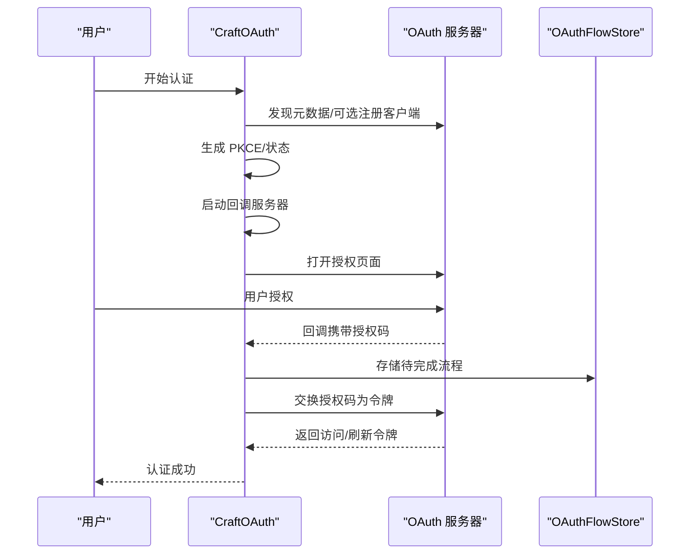
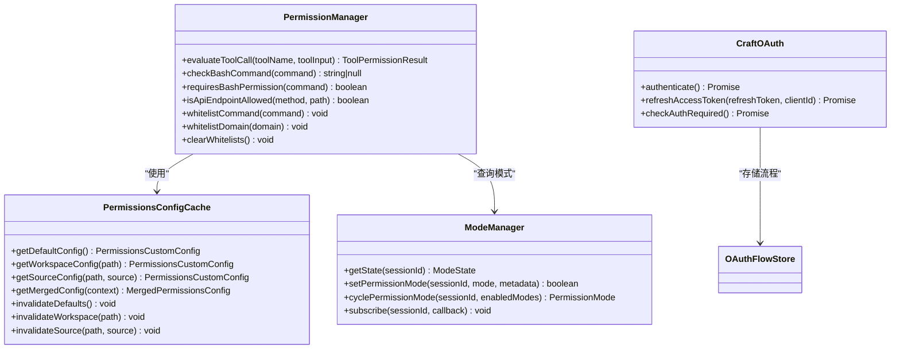

# 权限控制系统

<cite>
**本文档引用的文件**
- [权限配置指南](file://apps/electron/resources/docs/permissions.md)
- [默认权限配置](file://apps/electron/resources/permissions/default.json)
- [权限管理器](file://packages/shared/src/agent/core/permission-manager.ts)
- [权限配置管理](file://packages/shared/src/agent/permissions-config.ts)
- [模式管理器](file://packages/shared/src/agent/mode-manager.ts)
- [OAuth 认证](file://packages/shared/src/auth/oauth.ts)
- [OAuth 流类型](file://packages/shared/src/auth/oauth-flow-types.ts)
- [OAuth 流存储](file://packages/shared/src/auth/oauth-flow-store.ts)
- [认证类型定义](file://packages/shared/src/auth/types.ts)
- [认证验证工具](file://apps/electron/src/renderer/utils/auth-validation.ts)
</cite>

## 目录
1. [简介](#简介)
2. [项目结构](#项目结构)
3. [核心组件](#核心组件)
4. [架构总览](#架构总览)
5. [详细组件分析](#详细组件分析)
6. [依赖关系分析](#依赖关系分析)
7. [性能考虑](#性能考虑)
8. [故障排除指南](#故障排除指南)
9. [结论](#结论)
10. [附录](#附录)

## 简介
本文件为权限控制系统的详细技术文档，面向需要定制安全策略或集成企业认证系统的开发者。系统采用三层权限模式（Explore、Ask、Auto），结合细粒度的权限规则、OAuth 认证与令牌刷新、权限缓存与验证中间件、以及安全审计日志等机制，确保在探索、交互与执行各阶段的安全可控。

## 项目结构
权限控制系统主要由以下模块构成：
- 权限配置与规则：通过 JSON 文件定义允许/阻止的工具、命令与路径，并支持工作区与来源级的叠加规则。
- 模式管理：维护每个会话的权限模式状态，支持模式切换与持久化。
- 权限评估：统一入口对工具调用、Bash 命令、API 请求进行检查。
- 认证与授权：支持 OAuth 动态客户端注册、PKCE、令牌刷新与回调处理。
- 缓存与中间件：内存缓存合并后的权限配置，按需失效；在工具执行前进行权限验证。
- 审计与日志：记录权限决策与模式变更，便于审计与排障。

**图表来源**
- [权限配置管理:568-727](file://packages/shared/src/agent/permissions-config.ts#L568-L727)
- [权限管理器:68-176](file://packages/shared/src/agent/core/permission-manager.ts#L68-L176)
- [模式管理器:230-376](file://packages/shared/src/agent/mode-manager.ts#L230-L376)
- [OAuth 认证:43-302](file://packages/shared/src/auth/oauth.ts#L43-L302)
- [OAuth 流类型:11-26](file://packages/shared/src/auth/oauth-flow-types.ts#L11-L26)
- [OAuth 流存储:39-91](file://packages/shared/src/auth/oauth-flow-store.ts#L39-L91)

**章节来源**
- [权限配置管理:568-727](file://packages/shared/src/agent/permissions-config.ts#L568-L727)
- [权限管理器:68-176](file://packages/shared/src/agent/core/permission-manager.ts#L68-L176)
- [模式管理器:230-376](file://packages/shared/src/agent/mode-manager.ts#L230-L376)
- [OAuth 认证:43-302](file://packages/shared/src/auth/oauth.ts#L43-L302)
- [OAuth 流类型:11-26](file://packages/shared/src/auth/oauth-flow-types.ts#L11-L26)
- [OAuth 流存储:39-91](file://packages/shared/src/auth/oauth-flow-store.ts#L39-L91)

## 核心组件
- 权限配置管理（PermissionsConfig）
  - 负责加载默认、工作区与来源级权限配置，合并并编译为运行时配置。
  - 提供缓存机制与失效策略，确保配置变更后及时生效。
  - 支持权限文件的读取、保存与校验。
- 权限管理器（PermissionManager）
  - 统一入口进行工具调用、Bash 命令与 API 请求的权限检查。
  - 支持危险命令白名单（会话级）、域名白名单与权限模式切换。
  - 输出详细的拒绝原因与帮助信息。
- 模式管理器（ModeManager）
  - 维护每个会话的权限模式状态（Explore/Ask/Allow-All），支持循环切换与订阅通知。
  - 提供路径匹配、写入路径白名单与危险字符/替换检测。
- OAuth 认证（CraftOAuth）
  - 实现 OAuth 授权码流程，支持动态客户端注册、PKCE、状态校验与令牌刷新。
  - 提供准备与交换两个阶段，避免敏感信息泄露。
- OAuth 流存储（OAuthFlowStore）
  - 在服务器端以内存方式存储待完成的 OAuth 流程，带过期清理与 TTL 控制。

**章节来源**
- [权限配置管理:568-727](file://packages/shared/src/agent/permissions-config.ts#L568-L727)
- [权限管理器:68-176](file://packages/shared/src/agent/core/permission-manager.ts#L68-L176)
- [模式管理器:230-376](file://packages/shared/src/agent/mode-manager.ts#L230-L376)
- [OAuth 认证:43-302](file://packages/shared/src/auth/oauth.ts#L43-L302)
- [OAuth 流存储:39-91](file://packages/shared/src/auth/oauth-flow-store.ts#L39-L91)

## 架构总览
系统采用分层设计：配置层负责规则定义与合并，管理层负责状态与逻辑，认证层负责外部授权，中间件在执行前进行权限验证。

**图表来源**
- [权限管理器:128-176](file://packages/shared/src/agent/core/permission-manager.ts#L128-L176)
- [模式管理器:384-435](file://packages/shared/src/agent/mode-manager.ts#L384-L435)
- [权限配置管理:668-727](file://packages/shared/src/agent/permissions-config.ts#L668-L727)
- [OAuth 认证:213-302](file://packages/shared/src/auth/oauth.ts#L213-L302)

## 详细组件分析

### 三层权限模式设计与实现
- Explore（探索/只读）模式
  - 默认阻断写操作、编辑类工具与具有写语义的 MCP 工具。
  - 允许安全的只读 Bash 命令、API GET 请求与部分浏览器工具。
  - 支持“计划”机制：生成实现计划，经用户确认后退出 Explore 模式。
- Ask（询问）模式
  - 对危险命令与写操作要求用户确认，支持“永远允许”会话级白名单。
- Auto（自动/允许全部）模式
  - 跳过所有权限检查，适用于受控环境或调试场景。

**图表来源**
- [模式管理器:414-435](file://packages/shared/src/agent/mode-manager.ts#L414-L435)

**章节来源**
- [模式管理器:384-435](file://packages/shared/src/agent/mode-manager.ts#L384-L435)
- [权限配置指南:11-225](file://apps/electron/resources/docs/permissions.md#L11-L225)

### 权限规则与继承
- 规则来源与优先级
  - 默认规则（来自应用级 default.json）
  - 工作区规则（workspace/permissions.json）
  - 来源规则（sources/{source}/permissions.json）
  - 规则叠加：仅能放宽，不能收紧。
- MCP 模式自动作用域
  - 来源级 permissions.json 中的 MCP 模式会被自动作用于该来源，避免跨来源误放行。
- Bash 模式与 API 细粒度控制
  - Bash 模式支持注释保留，用于错误提示。
  - API 端点规则支持方法与路径正则匹配。

**图表来源**
- [权限配置管理:668-727](file://packages/shared/src/agent/permissions-config.ts#L668-L727)

**章节来源**
- [权限配置管理:668-727](file://packages/shared/src/agent/permissions-config.ts#L668-L727)
- [默认权限配置:1-950](file://apps/electron/resources/permissions/default.json#L1-L950)
- [权限配置指南:18-31](file://apps/electron/resources/docs/permissions.md#L18-L31)

### 权限评估与中间件
- 工具调用评估
  - 基于当前模式与合并后的配置，判断是否允许。
  - 对需要权限的调用返回“需要确认”的结果。
- Bash 命令检查
  - 检测危险控制字符、命令/进程替换、重定向与管道组合中的不安全部分。
  - 提供“相关模式”与“不匹配分析”，帮助用户理解被拒绝的原因。
- API 端点检查
  - GET 请求默认允许；其他方法需满足允许列表规则。

**图表来源**
- [权限管理器:128-176](file://packages/shared/src/agent/core/permission-manager.ts#L128-L176)
- [模式管理器:529-627](file://packages/shared/src/agent/mode-manager.ts#L529-L627)

**章节来源**
- [权限管理器:128-207](file://packages/shared/src/agent/core/permission-manager.ts#L128-L207)
- [模式管理器:529-627](file://packages/shared/src/agent/mode-manager.ts#L529-L627)

### OAuth 认证流程与令牌刷新
- 动态客户端注册与 PKCE
  - 自动发现 OAuth 元数据，必要时动态注册客户端。
  - 使用 PKCE 防止授权码拦截，状态参数防止 CSRF。
- 回调服务器与超时处理
  - 本地回调服务器监听指定端口范围，接收授权码并校验状态。
  - 5 分钟超时保护，超时后清理资源。
- 令牌刷新与存储
  - 支持 refresh_token 刷新 access_token，默认过期时间按 RFC 6749 处理。
  - OAuthFlowStore 以内存存储待完成流程，带 TTL 清理。

**图表来源**
- [OAuth 认证:213-302](file://packages/shared/src/auth/oauth.ts#L213-L302)
- [OAuth 流存储:39-91](file://packages/shared/src/auth/oauth-flow-store.ts#L39-L91)

**章节来源**
- [OAuth 认证:43-302](file://packages/shared/src/auth/oauth.ts#L43-L302)
- [OAuth 流存储:39-91](file://packages/shared/src/auth/oauth-flow-store.ts#L39-L91)
- [OAuth 流类型:11-26](file://packages/shared/src/auth/oauth-flow-types.ts#L11-L26)

### 权限缓存策略与失效
- 内存缓存
  - 默认、工作区与来源级配置分别缓存，避免重复解析。
  - 合并后的运行时配置也缓存，键为“工作区根路径 + 活跃来源列表”。
- 失效策略
  - 当默认权限文件变化时，清空所有合并缓存。
  - 工作区或来源权限文件变化时，仅清空对应工作区或包含该来源的缓存。
- 配置同步与迁移
  - 应用启动时同步默认权限到用户目录，自动修复损坏文件并迁移新增模式。

**章节来源**
- [权限配置管理:568-727](file://packages/shared/src/agent/permissions-config.ts#L568-L727)

### 权限验证中间件与安全审计
- 中间件职责
  - 在工具执行前统一调用权限管理器进行检查。
  - 对 Explore 模式输出详细拒绝原因，对 Ask 模式标记需要确认。
- 安全审计
  - 记录权限模式变更、工具调用拒绝与 Bash 命令拒绝事件，包含会话 ID、原因与输入摘要。
  - 模式状态包含变更来源（用户/系统/自动化）与版本号，便于追踪。

**章节来源**
- [权限管理器:141-176](file://packages/shared/src/agent/core/permission-manager.ts#L141-L176)
- [模式管理器:274-312](file://packages/shared/src/agent/mode-manager.ts#L274-L312)

### 自定义权限规则与批量管理
- 自定义规则
  - 使用 craft-agent permission 命令行工具进行 CRUD 操作，避免直接编辑 JSON。
  - 支持 MCP 模式、API 端点、Bash 模式、写路径与命令提示等字段。
- 批量权限管理
  - 通过工作区与来源级 permissions.json 进行批量规则下发。
  - 支持注释与示例，便于团队协作与审计。
- 权限迁移
  - 默认权限文件包含版本号，启动时自动迁移新增模式，保留用户自定义。

**章节来源**
- [权限配置指南:5-7](file://apps/electron/resources/docs/permissions.md#L5-L7)
- [权限配置管理:64-124](file://packages/shared/src/agent/permissions-config.ts#L64-L124)

## 依赖关系分析

**图表来源**
- [权限管理器:68-391](file://packages/shared/src/agent/core/permission-manager.ts#L68-L391)
- [权限配置管理:574-677](file://packages/shared/src/agent/permissions-config.ts#L574-L677)
- [模式管理器:230-376](file://packages/shared/src/agent/mode-manager.ts#L230-L376)
- [OAuth 认证:43-445](file://packages/shared/src/auth/oauth.ts#L43-L445)

**章节来源**
- [权限管理器:68-391](file://packages/shared/src/agent/core/permission-manager.ts#L68-L391)
- [权限配置管理:574-677](file://packages/shared/src/agent/permissions-config.ts#L574-L677)
- [模式管理器:230-376](file://packages/shared/src/agent/mode-manager.ts#L230-L376)
- [OAuth 认证:43-445](file://packages/shared/src/auth/oauth.ts#L43-L445)

## 性能考虑
- 缓存优化
  - 权限配置缓存按工作区与来源维度组织，减少重复解析与编译。
  - 合并配置缓存键包含活跃来源列表，避免错误命中。
- I/O 与磁盘访问
  - 默认权限文件仅在启动时同步与迁移，日常运行通过内存缓存。
  - 权限文件变更通过监听器触发精确失效，避免全量重建。
- 模式切换与订阅
  - 模式状态变更通过回调与订阅通知，避免全局广播带来的开销。
- OAuth 回调
  - 本地回调服务器端口范围固定，避免频繁端口探测；超时清理防止资源泄漏。

[本节为通用指导，无需特定文件分析]

## 故障排除指南
- 权限被拒绝
  - 查看拒绝原因与相关模式，确认是否可通过自定义规则放宽。
  - Explore 模式下可使用“计划”机制，在用户确认后进入 Ask/Auto 模式。
- Bash 命令被阻止
  - 检查是否包含危险字符/替换或重定向；尝试改用只读替代方案。
  - 使用 blockedCommandHints 获取针对性建议。
- OAuth 登录失败
  - 确认回调服务器已启动且端口可用；检查状态参数与授权码有效性。
  - 若服务器要求客户端注册，确认动态注册是否成功或回退到默认客户端。
- 令牌过期
  - 使用 refresh_token 刷新 access_token；若刷新失败，重新发起认证流程。
- 权限配置未生效
  - 检查配置文件语法与正则表达式；确认缓存是否已失效并重建。

**章节来源**
- [权限管理器:141-176](file://packages/shared/src/agent/core/permission-manager.ts#L141-L176)
- [OAuth 认证:316-432](file://packages/shared/src/auth/oauth.ts#L316-L432)
- [OAuth 流存储:39-91](file://packages/shared/src/auth/oauth-flow-store.ts#L39-L91)

## 结论
该权限控制系统通过三层模式、细粒度规则、动态认证与缓存机制，提供了从探索到执行的完整安全闭环。其可扩展的配置体系与严格的审计日志，使其能够满足企业级安全需求与合规要求。开发者可通过 CLI 工具与 JSON 配置快速定制策略，并在需要时集成企业认证系统。

[本节为总结性内容，无需特定文件分析]

## 附录

### 快速参考：权限模式切换
- Explore → Ask → Auto 循环切换（例如通过快捷键）。
- 每次切换记录变更来源与版本号，便于审计。

**章节来源**
- [模式管理器:414-435](file://packages/shared/src/agent/mode-manager.ts#L414-L435)

### 快速参考：OAuth 凭据与刷新
- 使用 PKCE 与状态参数增强安全性。
- 令牌过期时间按 RFC 6749 默认处理，支持 refresh_token 刷新。
- OAuthFlowStore 提供待完成流程的内存存储与 TTL 清理。

**章节来源**
- [OAuth 认证:43-302](file://packages/shared/src/auth/oauth.ts#L43-L302)
- [OAuth 流存储:39-91](file://packages/shared/src/auth/oauth-flow-store.ts#L39-L91)