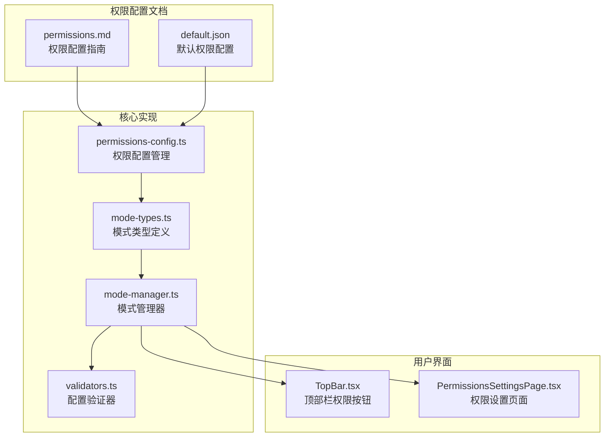
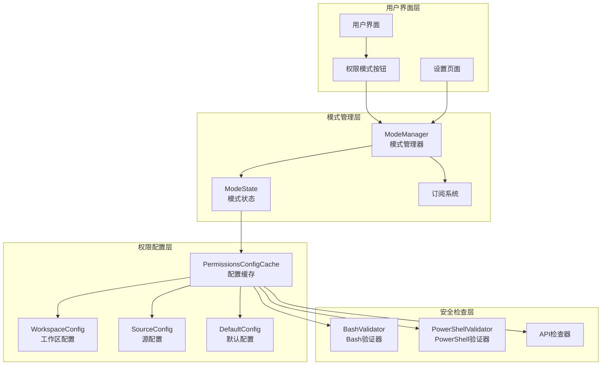
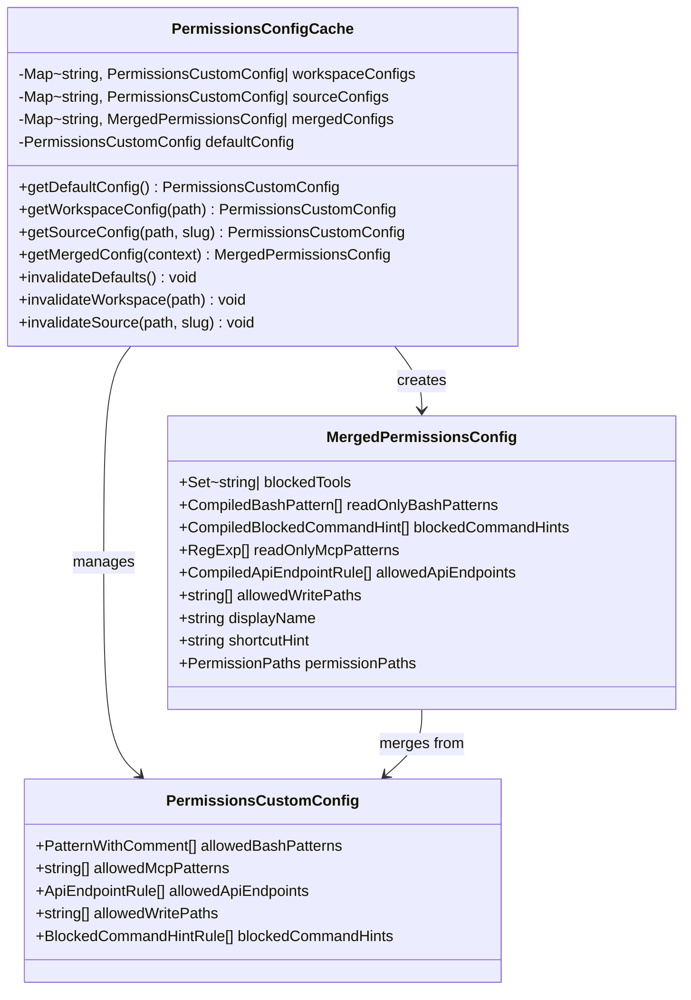
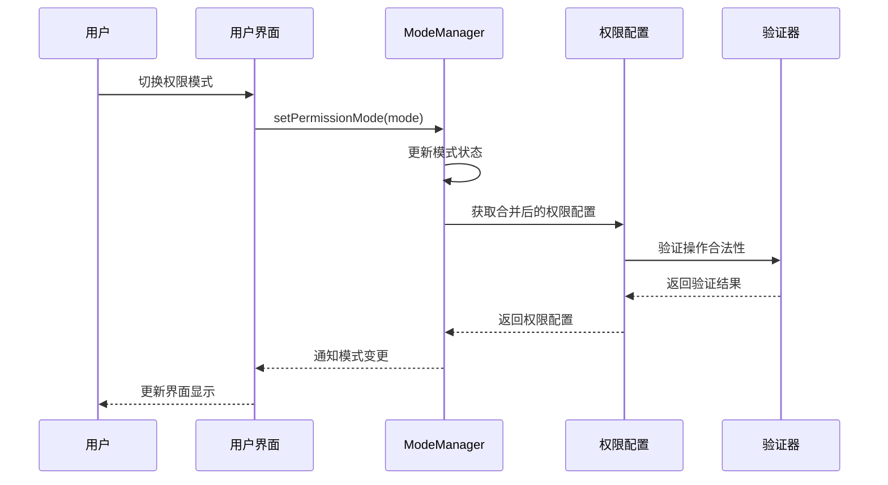
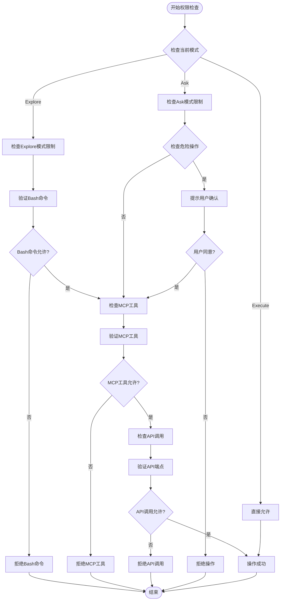
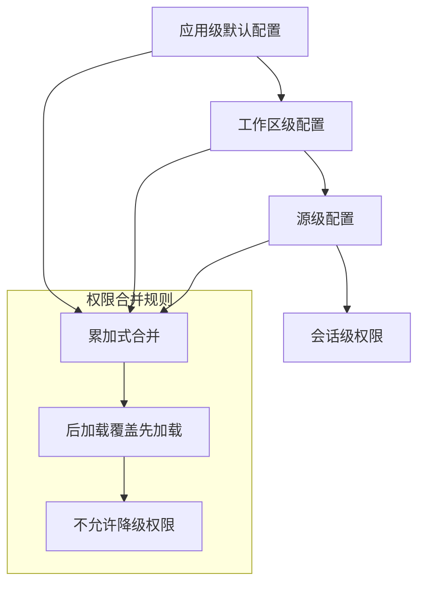
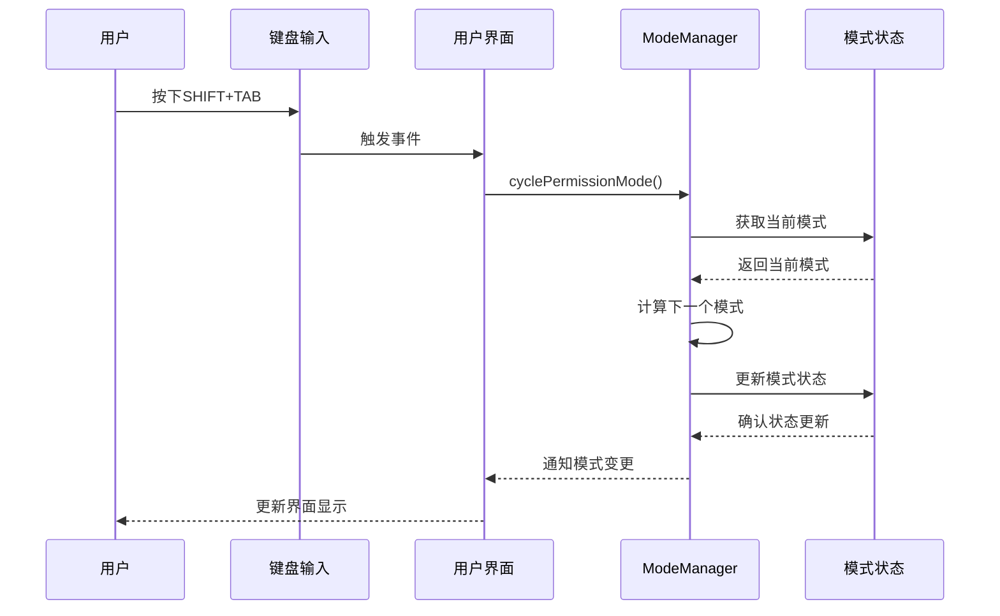
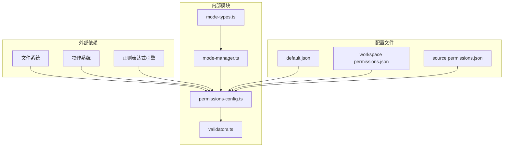

# 权限模式系统

<cite>
**本文档引用的文件**
- [permissions.md](file://apps/electron/resources/docs/permissions.md)
- [default.json](file://apps/electron/resources/permissions/default.json)
- [permissions-config.ts](file://packages/shared/src/agent/permissions-config.ts)
- [mode-types.ts](file://packages/shared/src/agent/mode-types.ts)
- [mode-manager.ts](file://packages/shared/src/agent/mode-manager.ts)
- [validators.ts](file://packages/shared/src/config/validators.ts)
</cite>

## 目录
1. [简介](#简介)
2. [项目结构](#项目结构)
3. [核心组件](#核心组件)
4. [架构概览](#架构概览)
5. [详细组件分析](#详细组件分析)
6. [依赖关系分析](#依赖关系分析)
7. [性能考虑](#性能考虑)
8. [故障排除指南](#故障排除指南)
9. [结论](#结论)

## 简介

权限模式系统是Craft Agents中一个关键的安全控制机制，采用三层权限模式设计：Explore（探索）、Ask（询问）和Auto（自动）。该系统通过分层权限控制确保在不同操作场景下提供适当的安全保障。

系统的核心设计理念是"最小权限原则"和"渐进式授权"。Explore模式提供完全只读访问，Ask模式在执行危险操作前要求用户确认，Auto模式允许完全自主执行。这种设计既保证了安全性，又提供了灵活的操作体验。

## 项目结构

权限模式系统主要分布在以下位置：

**图表来源**
- [permissions.md:1-339](file://apps/electron/resources/docs/permissions.md#L1-L339)
- [default.json:1-950](file://apps/electron/resources/permissions/default.json#L1-L950)
- [permissions-config.ts:1-935](file://packages/shared/src/agent/permissions-config.ts#L1-L935)
- [mode-types.ts:1-341](file://packages/shared/src/agent/mode-types.ts#L1-L341)

**章节来源**
- [permissions.md:1-339](file://apps/electron/resources/docs/permissions.md#L1-L339)
- [default.json:1-950](file://apps/electron/resources/permissions/default.json#L1-L950)

## 核心组件

### 三层权限模式

系统定义了三种核心权限模式：

| 模式 | 内部键 | 描述 | 主要特征 |
|------|--------|------|----------|
| Explore | safe | 探索模式（只读） | 完全只读，阻止所有写操作，不提示 |
| Ask | ask | 询问模式 | 危险操作前提示，其他操作自由 |
| Execute | allow-all | 执行模式（自动） | 全面执行，无提示 |

### 权限配置层次

系统采用三级权限配置层次结构：

1. **应用级默认配置**：`~/.craft-agent/permissions/default.json`
2. **工作区级配置**：`workspaceRoot/permissions.json`
3. **源级配置**：`workspaceRoot/sources/{source}/permissions.json`

每级配置都是累加式的，后加载的配置只能扩展权限，不能减少权限。

**章节来源**
- [mode-types.ts:24-52](file://packages/shared/src/agent/mode-types.ts#L24-L52)
- [permissions-config.ts:7-12](file://packages/shared/src/agent/permissions-config.ts#L7-L12)

## 架构概览

**图表来源**
- [mode-manager.ts:230-376](file://packages/shared/src/agent/mode-manager.ts#L230-L376)
- [permissions-config.ts:574-934](file://packages/shared/src/agent/permissions-config.ts#L574-L934)

## 详细组件分析

### 权限配置管理系统

权限配置管理系统负责管理三层权限配置并进行合并处理：

**图表来源**
- [permissions-config.ts:574-934](file://packages/shared/src/agent/permissions-config.ts#L574-L934)
- [mode-types.ts:236-270](file://packages/shared/src/agent/mode-types.ts#L236-L270)

### 模式管理器

模式管理器负责每个会话的权限模式状态管理：

**图表来源**
- [mode-manager.ts:274-312](file://packages/shared/src/agent/mode-manager.ts#L274-L312)
- [mode-manager.ts:414-435](file://packages/shared/src/agent/mode-manager.ts#L414-L435)

### 权限检查流程

**图表来源**
- [mode-manager.ts:529-800](file://packages/shared/src/agent/mode-manager.ts#L529-L800)
- [permissions-config.ts:546-564](file://packages/shared/src/agent/permissions-config.ts#L546-L564)

**章节来源**
- [permissions-config.ts:574-934](file://packages/shared/src/agent/permissions-config.ts#L574-L934)
- [mode-manager.ts:230-523](file://packages/shared/src/agent/mode-manager.ts#L230-L523)

### 权限继承规则

系统实现了严格的权限继承规则：

**图表来源**
- [permissions.md:251-258](file://apps/electron/resources/docs/permissions.md#L251-L258)
- [permissions-config.ts:668-727](file://packages/shared/src/agent/permissions-config.ts#L668-L727)

**章节来源**
- [permissions.md:251-258](file://apps/electron/resources/docs/permissions.md#L251-L258)

### 权限模式切换机制

系统支持多种权限模式切换方式：

1. **键盘快捷键**：SHIFT+TAB循环切换
2. **用户界面**：顶部栏权限按钮
3. **程序化切换**：通过API接口

**图表来源**
- [mode-manager.ts:414-435](file://packages/shared/src/agent/mode-manager.ts#L414-L435)

**章节来源**
- [mode-manager.ts:414-435](file://packages/shared/src/agent/mode-manager.ts#L414-L435)

## 依赖关系分析

**图表来源**
- [permissions-config.ts:14-24](file://packages/shared/src/agent/permissions-config.ts#L14-L24)
- [mode-manager.ts:15-22](file://packages/shared/src/agent/mode-manager.ts#L15-L22)

**章节来源**
- [permissions-config.ts:14-24](file://packages/shared/src/agent/permissions-config.ts#L14-L24)
- [mode-manager.ts:15-22](file://packages/shared/src/agent/mode-manager.ts#L15-L22)

## 性能考虑

权限模式系统在设计时充分考虑了性能优化：

1. **配置缓存**：使用内存缓存避免重复解析配置文件
2. **懒加载**：仅在需要时加载和解析配置文件
3. **增量更新**：文件变更时仅失效相关缓存项
4. **正则表达式优化**：编译后的正则表达式复用

系统采用LRU缓存策略管理权限配置，确保在大量会话并发时仍能保持高性能。

## 故障排除指南

### 常见问题及解决方案

1. **权限配置无效**
   - 检查配置文件语法是否正确
   - 验证正则表达式格式
   - 确认文件路径正确

2. **模式切换不生效**
   - 检查会话ID是否正确
   - 确认权限配置文件权限
   - 验证配置缓存是否更新

3. **权限继承异常**
   - 检查配置文件加载顺序
   - 验证权限合并逻辑
   - 确认配置优先级

**章节来源**
- [validators.ts:1401-1444](file://packages/shared/src/config/validators.ts#L1401-L1444)

### 调试工具

系统提供了完整的调试功能：

- 模式状态诊断：获取详细的模式切换历史
- 权限检查日志：记录每次权限验证的详细信息
- 配置验证：实时验证配置文件的有效性

## 结论

权限模式系统通过精心设计的三层权限模型、严格的权限继承规则和高效的实现机制，为Craft Agents提供了强大而灵活的安全控制框架。系统不仅确保了操作的安全性，还为用户提供了流畅的使用体验。

该系统的核心优势在于：
- 渐进式授权设计，平衡了安全性和可用性
- 分层配置管理，支持细粒度的权限控制
- 高性能实现，支持大规模并发使用
- 完善的错误处理和调试功能

未来可以进一步优化的方向包括：增强权限审计功能、提供更丰富的权限模板、支持动态权限调整等。