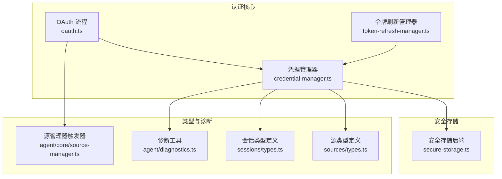
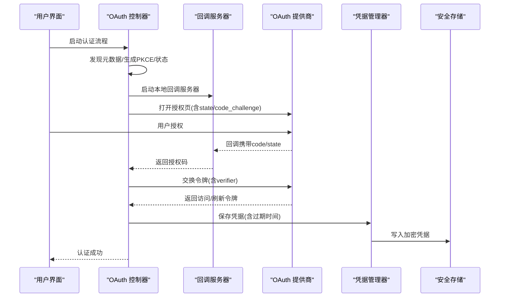
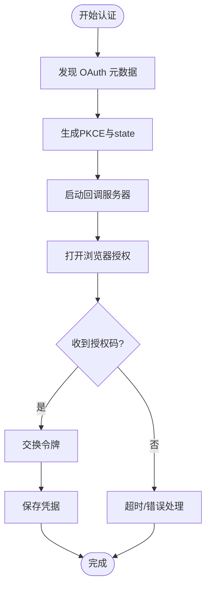
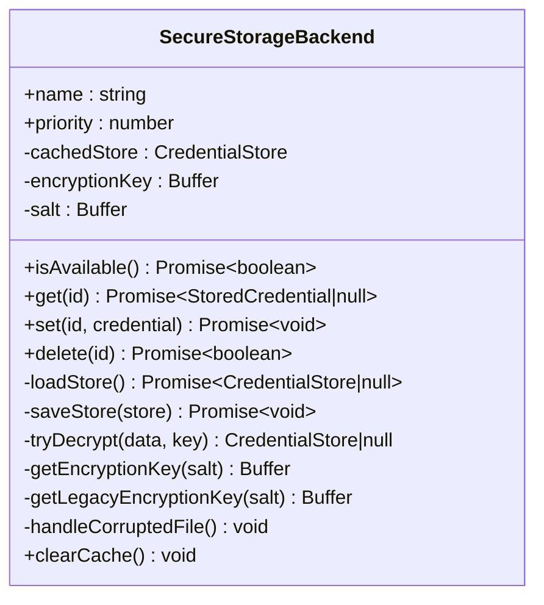
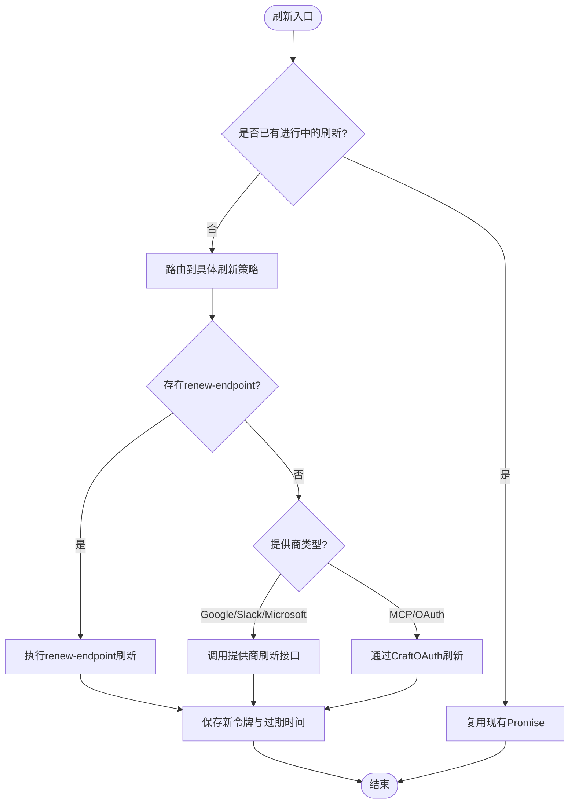
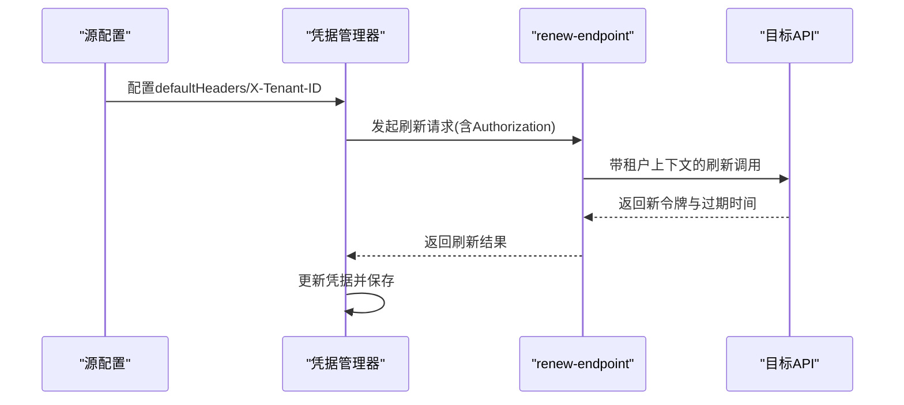
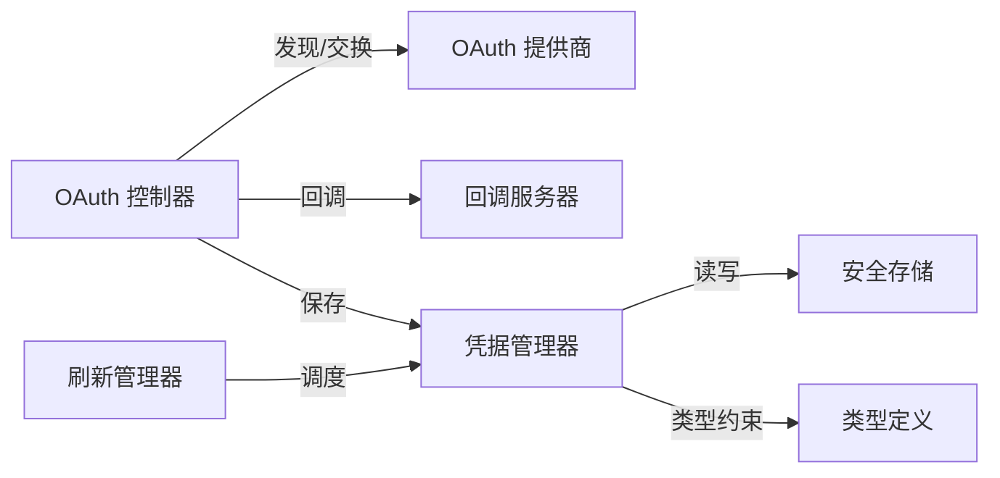

# 认证系统

<cite>
**本文档引用的文件**
- [oauth.ts](file://packages/shared/src/auth/oauth.ts)
- [credential-manager.ts](file://packages/shared/src/sources/credential-manager.ts)
- [secure-storage.ts](file://packages/shared/src/credentials/backends/secure-storage.ts)
- [token-refresh-manager.ts](file://packages/shared/src/sources/token-refresh-manager.ts)
- [types.ts](file://packages/shared/src/sinks/types.ts)
- [types.ts](file://packages/shared/src/sessions/types.ts)
- [source-manager.ts](file://packages/shared/src/agent/core/source-manager.ts)
- [diagnostics.ts](file://packages/shared/src/agent/diagnostics.ts)
- [credential-manager-renew.test.ts](file://packages/shared/src/sources/__tests__/credential-manager-renew.test.ts)
</cite>

## 目录
1. [简介](#简介)
2. [项目结构](#项目结构)
3. [核心组件](#核心组件)
4. [架构总览](#架构总览)
5. [详细组件分析](#详细组件分析)
6. [依赖关系分析](#依赖关系分析)
7. [性能考量](#性能考量)
8. [故障排查指南](#故障排查指南)
9. [结论](#结论)
10. [附录](#附录)

## 简介
本认证系统为跨应用（桌面端 Electron、WebUI、CLI）提供统一的 OAuth 认证与令牌管理能力，覆盖授权码获取、令牌交换、回调处理、令牌刷新、过期处理、错误重试、凭据加密存储与密钥管理等关键环节。系统支持多种认证提供商（Google、Slack、Microsoft、通用 OAuth、MCP OAuth），并提供企业级特性如多租户认证、单点登录（SSO）配置、以及安全存储策略。

## 项目结构
认证相关代码主要分布在以下模块：
- 认证核心：OAuth 流程与令牌管理
- 凭据管理：凭据加载、保存、刷新与迁移
- 安全存储：基于 AES-256-GCM 的本地加密存储
- 刷新管理：令牌刷新编排与速率限制
- 类型定义：认证相关数据模型与配置接口

**图表来源**
- [oauth.ts:43-446](file://packages/shared/src/auth/oauth.ts#L43-L446)
- [credential-manager.ts:800-1240](file://packages/shared/src/sources/credential-manager.ts#L800-L1240)
- [secure-storage.ts:111-358](file://packages/shared/src/credentials/backends/secure-storage.ts#L111-L358)
- [token-refresh-manager.ts:1-206](file://packages/shared/src/sources/token-refresh-manager.ts#L1-L206)
- [types.ts:375-396](file://packages/shared/src/sinks/types.ts#L375-L396)
- [types.ts](file://packages/shared/src/sessions/types.ts)
- [source-manager.ts:362-387](file://packages/shared/src/agent/core/source-manager.ts#L362-L387)
- [diagnostics.ts:440-459](file://packages/shared/src/agent/diagnostics.ts#L440-L459)

**章节来源**
- [oauth.ts:1-987](file://packages/shared/src/auth/oauth.ts#L1-L987)
- [credential-manager.ts:800-1356](file://packages/shared/src/sources/credential-manager.ts#L800-L1356)
- [secure-storage.ts:111-358](file://packages/shared/src/credentials/backends/secure-storage.ts#L111-L358)
- [token-refresh-manager.ts:1-206](file://packages/shared/src/sources/token-refresh-manager.ts#L1-L206)
- [types.ts:375-396](file://packages/shared/src/sinks/types.ts#L375-L396)
- [types.ts](file://packages/shared/src/sessions/types.ts)
- [source-manager.ts:362-387](file://packages/shared/src/agent/core/source-manager.ts#L362-L387)
- [diagnostics.ts:440-459](file://packages/shared/src/agent/diagnostics.ts#L440-L459)

## 核心组件
- OAuth 流程控制器：负责发现 OAuth 元数据、生成 PKCE、启动回调服务器、注册客户端、发起授权、交换令牌、刷新令牌。
- 凭据管理器：负责加载/保存凭据、路由不同提供商的刷新策略、调用 renew-endpoint 进行非 OAuth 刷新、标记需要重新认证。
- 安全存储后端：提供基于硬件稳定标识的 AES-256-GCM 加密存储，支持盐值与迭代参数，兼容旧版迁移。
- 令牌刷新管理器：封装刷新编排、并发去重、速率限制与冷却策略，处理失败回退与状态标记。
- 类型与触发：定义源与会话的认证类型、刷新策略、以及 UI 触发入口。

**章节来源**
- [oauth.ts:43-446](file://packages/shared/src/auth/oauth.ts#L43-L446)
- [credential-manager.ts:880-1240](file://packages/shared/src/sources/credential-manager.ts#L880-L1240)
- [secure-storage.ts:111-358](file://packages/shared/src/credentials/backends/secure-storage.ts#L111-L358)
- [token-refresh-manager.ts:1-206](file://packages/shared/src/sources/token-refresh-manager.ts#L1-L206)
- [types.ts:375-396](file://packages/shared/src/sinks/types.ts#L375-L396)

## 架构总览
认证系统采用“发现-授权-交换-存储-刷新”的闭环设计，结合安全存储与刷新管理器，确保令牌生命周期的自动化与安全性。

**图表来源**
- [oauth.ts:213-302](file://packages/shared/src/auth/oauth.ts#L213-L302)
- [credential-manager.ts:518-541](file://packages/shared/src/sources/credential-manager.ts#L518-L541)
- [secure-storage.ts:132-152](file://packages/shared/src/credentials/backends/secure-storage.ts#L132-L152)

**章节来源**
- [oauth.ts:213-302](file://packages/shared/src/auth/oauth.ts#L213-L302)
- [credential-manager.ts:518-541](file://packages/shared/src/sources/credential-manager.ts#L518-L541)
- [secure-storage.ts:132-152](file://packages/shared/src/credentials/backends/secure-storage.ts#L132-L152)

## 详细组件分析

### OAuth 认证流程实现
- 授权码获取：通过发现 OAuth 元数据构建授权 URL，使用 PKCE 与 state 防护 CSRF，启动本地回调服务器接收授权码。
- 令牌交换：使用 code_verifier 与授权码向令牌端点交换访问/刷新令牌，并设置默认过期时间。
- 回调处理：严格校验 state 与错误参数，返回成功/失败页面并清理服务器。
- 动态客户端注册：在支持的提供商上动态注册客户端，否则回退到默认客户端 ID。
- 元数据发现：支持 RFC 9728 资源元数据与标准 OAuth 端点发现，带超时与 SSRF 保护。

**图表来源**
- [oauth.ts:213-302](file://packages/shared/src/auth/oauth.ts#L213-L302)
- [oauth.ts:316-432](file://packages/shared/src/auth/oauth.ts#L316-L432)

**章节来源**
- [oauth.ts:56-97](file://packages/shared/src/auth/oauth.ts#L56-L97)
- [oauth.ts:99-146](file://packages/shared/src/auth/oauth.ts#L99-L146)
- [oauth.ts:316-432](file://packages/shared/src/auth/oauth.ts#L316-L432)
- [oauth.ts:650-774](file://packages/shared/src/auth/oauth.ts#L650-L774)

### 凭据加密存储机制与密钥管理
- 存储格式：文件头包含魔数、标志位与盐值，正文为 AES-256-GCM 密文（IV + 认证标签 + 密文）。
- 密钥派生：基于硬件稳定标识生成稳定机器 ID，结合 PBKDF2 与随机盐值派生加密密钥；兼容旧版（主机名+用户名+家目录）迁移。
- 权限控制：凭据文件以仅属主可读写权限写入，避免被其他用户读取。
- 缓存与失效：内存缓存已解密的凭据存储，支持清理缓存强制刷新。

**图表来源**
- [secure-storage.ts:111-358](file://packages/shared/src/credentials/backends/secure-storage.ts#L111-L358)

**章节来源**
- [secure-storage.ts:196-248](file://packages/shared/src/credentials/backends/secure-storage.ts#L196-L248)
- [secure-storage.ts:269-305](file://packages/shared/src/credentials/backends/secure-storage.ts#L269-L305)
- [secure-storage.ts:307-336](file://packages/shared/src/credentials/backends/secure-storage.ts#L307-L336)

### 令牌刷新机制、过期处理与错误重试
- 并发去重：同一源的刷新请求进行去重，避免并发刷新导致的令牌轮换失效。
- 多策略刷新：
  - API renew-endpoint：使用当前访问令牌作为授权，按配置替换模板字段，自动提取新令牌与过期时间。
  - Google/Slack/Microsoft：调用各自刷新接口，更新访问令牌与可能的刷新令牌。
  - MCP OAuth：通过 CraftOAuth 实例刷新，支持动态元数据发现与客户端注册。
- 错误处理：刷新失败时记录诊断信息、标记需要重新认证、可选冷却策略。
- 过期处理：若响应未包含过期字段，使用配置的后备 TTL 设置过期时间。

**图表来源**
- [credential-manager.ts:880-959](file://packages/shared/src/sources/credential-manager.ts#L880-L959)
- [credential-manager.ts:965-1044](file://packages/shared/src/sources/credential-manager.ts#L965-L1044)
- [credential-manager.ts:1049-1131](file://packages/shared/src/sources/credential-manager.ts#L1049-L1131)
- [credential-manager.ts:1195-1239](file://packages/shared/src/sources/credential-manager.ts#L1195-L1239)

**章节来源**
- [credential-manager.ts:880-959](file://packages/shared/src/sources/credential-manager.ts#L880-L959)
- [credential-manager.ts:965-1044](file://packages/shared/src/sources/credential-manager.ts#L965-L1044)
- [credential-manager.ts:1049-1131](file://packages/shared/src/sources/credential-manager.ts#L1049-L1131)
- [credential-manager.ts:1195-1239](file://packages/shared/src/sources/credential-manager.ts#L1195-L1239)
- [token-refresh-manager.ts:18-186](file://packages/shared/src/sources/token-refresh-manager.ts#L18-L186)

### 自定义认证提供商集成与多租户配置
- 自定义 OAuth：通过配置 api.oauth 指定 tokenUrl、clientId/clientSecret，支持静态配置与自动发现。
- 多租户认证：在 renew-endpoint 中注入租户标识（如 X-Tenant-ID），并在请求头/请求体中替换令牌占位符。
- 单点登录（SSO）：通过 MCP OAuth 与动态客户端注册实现 SSO 场景下的统一认证入口。

**图表来源**
- [credential-manager.ts:982-991](file://packages/shared/src/sources/credential-manager.ts#L982-L991)
- [credential-manager.ts:1000-1034](file://packages/shared/src/sources/credential-manager.ts#L1000-L1034)
- [types.ts:375-396](file://packages/shared/src/sinks/types.ts#L375-L396)

**章节来源**
- [credential-manager.ts:965-1044](file://packages/shared/src/sources/credential-manager.ts#L965-L1044)
- [types.ts:375-396](file://packages/shared/src/sinks/types.ts#L375-L396)

### UI 触发与会话上下文
- 源触发器：根据源类型与提供商选择对应的 OAuth 触发器（如 source_google_oauth_trigger）。
- 会话上下文：OAuth 回调页支持 deeplink 返回到会话上下文，确保用户体验连贯。

**章节来源**
- [source-manager.ts:362-387](file://packages/shared/src/agent/core/source-manager.ts#L362-L387)
- [oauth.ts:386-387](file://packages/shared/src/auth/oauth.ts#L386-L387)

## 依赖关系分析
- 组件耦合：OAuth 控制器与凭据管理器松耦合，通过标准化的 OAuthTokens 与存储接口交互。
- 外部依赖：HTTP 请求用于元数据发现与令牌交换；本地 HTTP 服务器用于回调；文件系统用于安全存储。
- 循环依赖：未见直接循环依赖；刷新管理器通过接口依赖凭据管理器，避免反向依赖。

**图表来源**
- [oauth.ts:213-302](file://packages/shared/src/auth/oauth.ts#L213-L302)
- [credential-manager.ts:880-1240](file://packages/shared/src/sources/credential-manager.ts#L880-L1240)
- [secure-storage.ts:111-358](file://packages/shared/src/credentials/backends/secure-storage.ts#L111-L358)
- [token-refresh-manager.ts:1-206](file://packages/shared/src/sources/token-refresh-manager.ts#L1-L206)

**章节来源**
- [oauth.ts:213-302](file://packages/shared/src/auth/oauth.ts#L213-L302)
- [credential-manager.ts:880-1240](file://packages/shared/src/sources/credential-manager.ts#L880-L1240)
- [secure-storage.ts:111-358](file://packages/shared/src/credentials/backends/secure-storage.ts#L111-L358)
- [token-refresh-manager.ts:1-206](file://packages/shared/src/sources/token-refresh-manager.ts#L1-L206)

## 性能考量
- 并发刷新去重：避免多个 API 调用同时触发刷新，减少令牌轮换风险与网络开销。
- 速率限制：失败后进入冷却期，降低对提供商的冲击并提升恢复概率。
- I/O 优化：AES-GCM 使用一次性 IV，写入时严格权限控制，减少磁盘争用与安全风险。
- 超时与重试：元数据发现与令牌交换均设置超时，回调服务器具备超时清理机制。

## 故障排查指南
- 回调失败：检查本地端口占用范围、防火墙设置、浏览器拦截；确认 state 匹配与错误参数。
- 刷新失败：查看刷新日志与诊断信息，确认提供商返回状态码与错误消息；必要时标记需要重新认证。
- 存储损坏：安全存储检测到损坏文件会删除并提示重新输入凭据；检查文件权限与磁盘空间。
- 多租户问题：核对 renew-endpoint 的默认头部与令牌占位符替换逻辑，确保租户标识正确注入。

**章节来源**
- [oauth.ts:327-330](file://packages/shared/src/auth/oauth.ts#L327-L330)
- [oauth.ts:355-366](file://packages/shared/src/auth/oauth.ts#L355-L366)
- [secure-storage.ts:338-350](file://packages/shared/src/credentials/backends/secure-storage.ts#L338-L350)
- [diagnostics.ts:440-459](file://packages/shared/src/agent/diagnostics.ts#L440-L459)
- [credential-manager-renew.test.ts:179-187](file://packages/shared/src/sources/__tests__/credential-manager-renew.test.ts#L179-L187)

## 结论
该认证系统通过标准化的 OAuth 流程、安全的本地存储与完善的刷新机制，为企业级集成提供了高可用、可扩展的认证方案。其多提供商适配、多租户与 SSO 支持，使其能够满足复杂的企业与第三方服务对接需求。

## 附录
- 配置要点：在源配置中启用 OAuth 或 renew-endpoint，设置提供商特定参数与默认头部；对于 MCP OAuth，确保元数据可达且支持动态客户端注册。
- 最佳实践：优先使用 PKCE 与 state；为 renew-endpoint 提供后备 TTL；定期检查刷新日志与诊断信息；对敏感凭据进行最小化暴露。