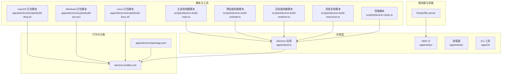
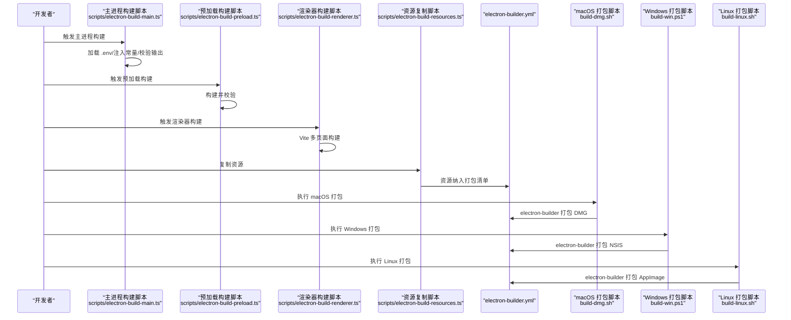
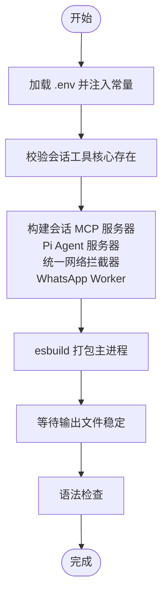
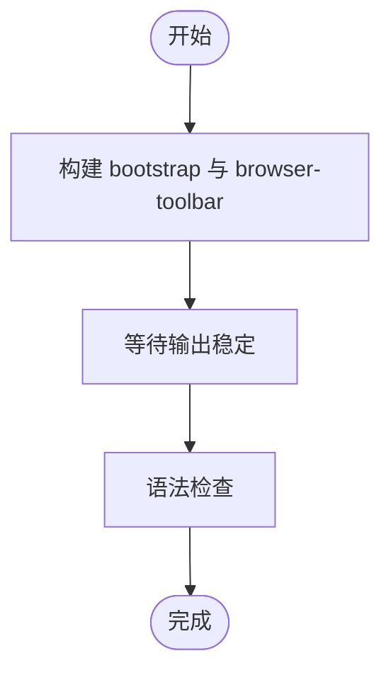
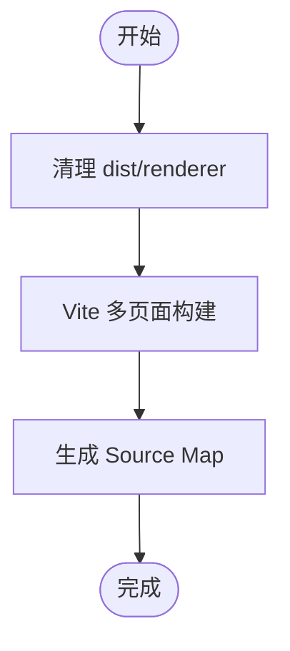
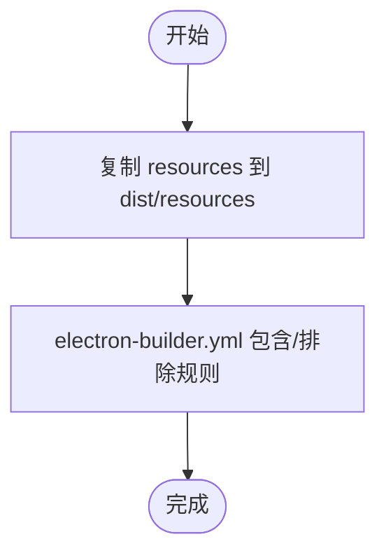
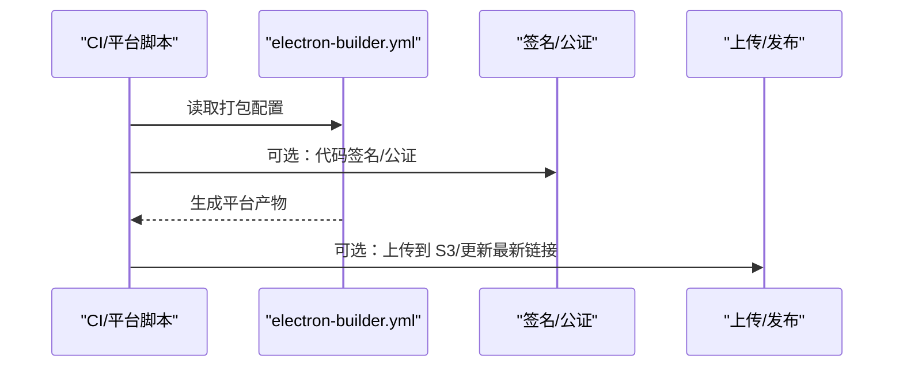
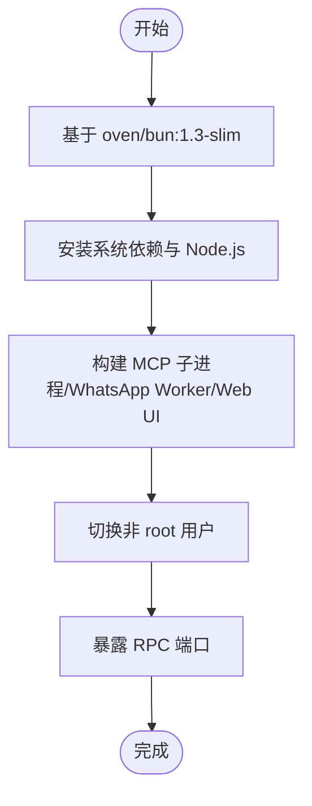
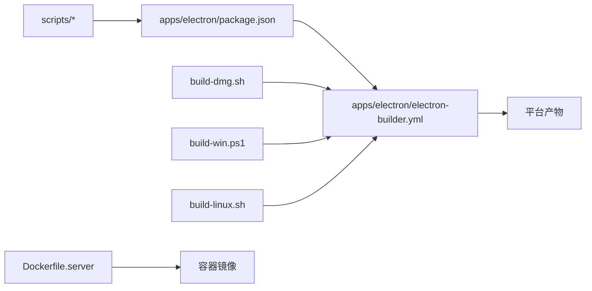

# 构建和部署

<cite>
**本文引用的文件**
- [apps/electron/electron-builder.yml](file://apps/electron/electron-builder.yml)
- [scripts/electron-build-main.ts](file://scripts/electron-build-main.ts)
- [scripts/electron-build-preload.ts](file://scripts/electron-build-preload.ts)
- [scripts/electron-build-renderer.ts](file://scripts/electron-build-renderer.ts)
- [scripts/electron-build-resources.ts](file://scripts/electron-build-resources.ts)
- [scripts/electron-clean.ts](file://scripts/electron-clean.ts)
- [apps/electron/package.json](file://apps/electron/package.json)
- [apps/electron/vite.config.ts](file://apps/electron/vite.config.ts)
- [apps/electron/scripts/build-dmg.sh](file://apps/electron/scripts/build-dmg.sh)
- [apps/electron/scripts/build-win.ps1](file://apps/electron/scripts/build-win.ps1)
- [apps/electron/scripts/build-linux.sh](file://apps/electron/scripts/build-linux.sh)
- [Dockerfile.server](file://Dockerfile.server)
</cite>

## 目录
1. [简介](#简介)
2. [项目结构](#项目结构)
3. [核心组件](#核心组件)
4. [架构总览](#架构总览)
5. [详细组件分析](#详细组件分析)
6. [依赖关系分析](#依赖关系分析)
7. [性能考量](#性能考量)
8. [故障排除指南](#故障排除指南)
9. [结论](#结论)
10. [附录](#附录)

## 简介
本文件面向需要自动化构建与部署的 DevOps 团队与高级开发者，系统性阐述本项目的构建与部署体系：包括构建脚本架构、资源打包策略、代码分割与优化、应用打包流程、平台特定配置与签名验证机制、自动发布与版本管理、回滚策略、容器化部署（Docker）、CI/CD 集成建议以及环境配置管理。文档以“可操作、可落地”为原则，既提供高层视图也给出关键实现细节的来源路径。

## 项目结构
本仓库采用 Monorepo 结构，构建与部署相关的关键位置如下：
- 应用层
  - 桌面应用（Electron）：apps/electron
  - Web UI：apps/webui
  - 查看器：apps/viewer
  - 命令行工具：apps/cli
- 脚本与工具
  - 平台构建脚本：apps/electron/scripts/*
  - 通用构建脚本：scripts/*
- 服务器与容器
  - Dockerfile.server：Docker 容器化服务端
- 打包与分发
  - electron-builder.yml：跨平台打包配置
  - 各平台产物命名与签名、更新源等在该文件中集中定义

图表来源
- [apps/electron/electron-builder.yml](file://apps/electron/electron-builder.yml)
- [scripts/electron-build-main.ts](file://scripts/electron-build-main.ts)
- [scripts/electron-build-preload.ts](file://scripts/electron-build-preload.ts)
- [scripts/electron-build-renderer.ts](file://scripts/electron-build-renderer.ts)
- [scripts/electron-build-resources.ts](file://scripts/electron-build-resources.ts)
- [scripts/electron-clean.ts](file://scripts/electron-clean.ts)
- [apps/electron/scripts/build-dmg.sh](file://apps/electron/scripts/build-dmg.sh)
- [apps/electron/scripts/build-win.ps1](file://apps/electron/scripts/build-win.ps1)
- [apps/electron/scripts/build-linux.sh](file://apps/electron/scripts/build-linux.sh)
- [apps/electron/package.json](file://apps/electron/package.json)
- [Dockerfile.server](file://Dockerfile.server)

章节来源
- [apps/electron/electron-builder.yml](file://apps/electron/electron-builder.yml)
- [apps/electron/package.json](file://apps/electron/package.json)

## 核心组件
- 主进程构建与校验
  - 使用 esbuild 对主进程入口进行打包，并通过 Node 的语法检查确保输出有效；支持从 .env 注入运行时常量（如 OAuth、Sentry 等），并进行文件稳定等待与二次校验。
- 预加载构建
  - 分别构建 bootstrap 与 browser-toolbar 两个预加载入口，统一走 esbuild，完成后进行稳定性与语法校验。
- 渲染器构建
  - 使用 Vite 进行多页面构建（主界面、Playground、浏览器工具栏等），开启 Source Map 便于调试；通过别名与去重避免多副本 React 引起的冲突。
- 资源复制与打包
  - 将 resources 下的图标、文档、主题、权限、工具图标、Python 工具脚本等复制到 dist/resources；electron-builder.yml 中声明 dist/**/* 与额外资源，确保打包完整。
- 平台打包脚本
  - macOS：下载指定版本的 Bun 二进制，校验哈希，复制 SDK 与拦截器，调用 electron-builder 打包 DMG，并支持可选上传至 S3。
  - Windows：下载指定版本的 Bun 二进制，处理文件锁与 EBUSY 问题，复制 SDK 与拦截器，使用 electron-builder 打包 NSIS 安装器。
  - Linux：下载指定版本的 Bun 二进制，复制 SDK 与拦截器，打包 AppImage。
- 服务器容器化
  - Dockerfile.server 基于 oven/bun:1.3-slim，安装系统依赖与 Node.js，构建 MCP 子进程、WhatsApp Worker、Web UI，并以非 root 用户运行，暴露 RPC 端口。

章节来源
- [scripts/electron-build-main.ts](file://scripts/electron-build-main.ts)
- [scripts/electron-build-preload.ts](file://scripts/electron-build-preload.ts)
- [scripts/electron-build-renderer.ts](file://scripts/electron-build-renderer.ts)
- [apps/electron/vite.config.ts](file://apps/electron/vite.config.ts)
- [scripts/electron-build-resources.ts](file://scripts/electron-build-resources.ts)
- [apps/electron/scripts/build-dmg.sh](file://apps/electron/scripts/build-dmg.sh)
- [apps/electron/scripts/build-win.ps1](file://apps/electron/scripts/build-win.ps1)
- [apps/electron/scripts/build-linux.sh](file://apps/electron/scripts/build-linux.sh)
- [Dockerfile.server](file://Dockerfile.server)

## 架构总览
下图展示从源码到最终产物的构建与打包链路，涵盖主进程、预加载、渲染器、资源、平台打包与上传。

图表来源
- [scripts/electron-build-main.ts](file://scripts/electron-build-main.ts)
- [scripts/electron-build-preload.ts](file://scripts/electron-build-preload.ts)
- [scripts/electron-build-renderer.ts](file://scripts/electron-build-renderer.ts)
- [scripts/electron-build-resources.ts](file://scripts/electron-build-resources.ts)
- [apps/electron/electron-builder.yml](file://apps/electron/electron-builder.yml)
- [apps/electron/scripts/build-dmg.sh](file://apps/electron/scripts/build-dmg.sh)
- [apps/electron/scripts/build-win.ps1](file://apps/electron/scripts/build-win.ps1)
- [apps/electron/scripts/build-linux.sh](file://apps/electron/scripts/build-linux.sh)

## 详细组件分析

### 主进程构建与校验（scripts/electron-build-main.ts）
- 功能要点
  - 从 .env 注入构建期常量（OAuth、Sentry 等），避免硬编码。
  - 先构建会话 MCP 服务器、Pi Agent 服务器、统一网络拦截器与 WhatsApp Worker，再构建主进程。
  - 使用 esbuild 打包主进程，替换第三方 polyfill 别名以兼容 Node 全局。
  - 输出后等待文件稳定并执行语法检查，确保产物可用。
- 关键实现路径
  - [主进程构建与校验逻辑](file://scripts/electron-build-main.ts)
  - [Vite 别名与去重设置](file://apps/electron/vite.config.ts)

图表来源
- [scripts/electron-build-main.ts](file://scripts/electron-build-main.ts)

章节来源
- [scripts/electron-build-main.ts](file://scripts/electron-build-main.ts)
- [apps/electron/vite.config.ts](file://apps/electron/vite.config.ts)

### 预加载构建（scripts/electron-build-preload.ts）
- 功能要点
  - 并行构建 bootstrap 与 browser-toolbar 两个预加载入口。
  - 统一进行稳定性检测与语法校验，保证预加载模块质量。
- 关键实现路径
  - [预加载构建与校验](file://scripts/electron-build-preload.ts)

图表来源
- [scripts/electron-build-preload.ts](file://scripts/electron-build-preload.ts)

章节来源
- [scripts/electron-build-preload.ts](file://scripts/electron-build-preload.ts)

### 渲染器构建（scripts/electron-build-renderer.ts 与 apps/electron/vite.config.ts）
- 功能要点
  - 清理旧的渲染器构建目录，调用 Vite 构建多页面应用。
  - 开启 Source Map 便于调试；通过别名与去重避免多副本 React 冲突。
  - 优化依赖预构建，提升开发体验。
- 关键实现路径
  - [渲染器构建脚本](file://scripts/electron-build-renderer.ts)
  - [Vite 配置与多页面输入](file://apps/electron/vite.config.ts)

图表来源
- [scripts/electron-build-renderer.ts](file://scripts/electron-build-renderer.ts)
- [apps/electron/vite.config.ts](file://apps/electron/vite.config.ts)

章节来源
- [scripts/electron-build-renderer.ts](file://scripts/electron-build-renderer.ts)
- [apps/electron/vite.config.ts](file://apps/electron/vite.config.ts)

### 资源复制与打包（scripts/electron-build-resources.ts 与 electron-builder.yml）
- 功能要点
  - 将 resources 目录整体复制到 dist/resources，确保图标、文档、主题、权限、工具图标、Python 脚本等随应用分发。
  - electron-builder.yml 中通过 files 与 extraResources 明确包含与排除规则，避免 node_modules 自动排除带来的问题。
- 关键实现路径
  - [资源复制脚本](file://scripts/electron-build-resources.ts)
  - [打包清单与平台过滤](file://apps/electron/electron-builder.yml)

图表来源
- [scripts/electron-build-resources.ts](file://scripts/electron-build-resources.ts)
- [apps/electron/electron-builder.yml](file://apps/electron/electron-builder.yml)

章节来源
- [scripts/electron-build-resources.ts](file://scripts/electron-build-resources.ts)
- [apps/electron/electron-builder.yml](file://apps/electron/electron-builder.yml)

### 平台打包与签名（build-dmg.sh、build-win.ps1、build-linux.sh 与 electron-builder.yml）
- 功能要点
  - macOS：下载并校验指定版本的 Bun 二进制，复制 SDK 与拦截器，调用 electron-builder 打包 DMG；支持可选代码签名与公证。
  - Windows：处理文件锁与 EBUSY 问题，复制 SDK 与拦截器，使用 electron-builder 打包 NSIS 安装器；内置重试与进程清理。
  - Linux：下载并校验指定版本的 Bun 二进制，复制 SDK 与拦截器，打包 AppImage。
  - electron-builder.yml：集中定义产物命名、目标平台、签名、公证、自动更新源、asar 禁用、平台特定资源与过滤规则。
- 关键实现路径
  - [macOS 打包脚本](file://apps/electron/scripts/build-dmg.sh)
  - [Windows 打包脚本](file://apps/electron/scripts/build-win.ps1)
  - [Linux 打包脚本](file://apps/electron/scripts/build-linux.sh)
  - [打包配置](file://apps/electron/electron-builder.yml)

图表来源
- [apps/electron/scripts/build-dmg.sh](file://apps/electron/scripts/build-dmg.sh)
- [apps/electron/scripts/build-win.ps1](file://apps/electron/scripts/build-win.ps1)
- [apps/electron/scripts/build-linux.sh](file://apps/electron/scripts/build-linux.sh)
- [apps/electron/electron-builder.yml](file://apps/electron/electron-builder.yml)

章节来源
- [apps/electron/scripts/build-dmg.sh](file://apps/electron/scripts/build-dmg.sh)
- [apps/electron/scripts/build-win.ps1](file://apps/electron/scripts/build-win.ps1)
- [apps/electron/scripts/build-linux.sh](file://apps/electron/scripts/build-linux.sh)
- [apps/electron/electron-builder.yml](file://apps/electron/electron-builder.yml)

### 服务器容器化与运行（Dockerfile.server）
- 功能要点
  - 基于 oven/bun:1.3-slim，安装系统依赖与 Node.js（用于 WhatsApp Worker 的 CJS 依赖）。
  - 构建 MCP 子进程、WhatsApp Worker、Web UI；以非 root 用户运行，暴露 RPC 端口。
  - 提供环境变量示例（令牌、TLS 证书与密钥、工作目录挂载等）。
- 关键实现路径
  - [Dockerfile.server](file://Dockerfile.server)

图表来源
- [Dockerfile.server](file://Dockerfile.server)

章节来源
- [Dockerfile.server](file://Dockerfile.server)

## 依赖关系分析
- 构建脚本与应用层
  - scripts/* 负责构建主进程、预加载、渲染器与资源；apps/electron/package.json 提供 npm 脚本入口，统一调用这些脚本。
- 打包与平台脚本
  - apps/electron/scripts/* 在各平台独立执行，最终均调用 electron-builder.yml 完成打包。
- 打包配置
  - apps/electron/electron-builder.yml 是跨平台打包的单一真相来源，集中定义产物命名、签名、公证、自动更新源、asar 策略、平台特定资源与过滤规则。
- 容器化
  - Dockerfile.server 将构建产物与运行时环境整合，提供稳定的服务器镜像。

图表来源
- [apps/electron/package.json](file://apps/electron/package.json)
- [apps/electron/electron-builder.yml](file://apps/electron/electron-builder.yml)
- [apps/electron/scripts/build-dmg.sh](file://apps/electron/scripts/build-dmg.sh)
- [apps/electron/scripts/build-win.ps1](file://apps/electron/scripts/build-win.ps1)
- [apps/electron/scripts/build-linux.sh](file://apps/electron/scripts/build-linux.sh)
- [Dockerfile.server](file://Dockerfile.server)

章节来源
- [apps/electron/package.json](file://apps/electron/package.json)
- [apps/electron/electron-builder.yml](file://apps/electron/electron-builder.yml)

## 性能考量
- 构建性能
  - 使用 esbuild 与 Vite 进行快速打包；Vite 通过优化依赖预构建与别名去重减少重复模块。
  - 主进程构建前先构建子服务器与拦截器，避免重复编译。
- 产物体积与启动速度
  - electron-builder.yml 禁用 ASAR，避免解压开销与启动延迟。
  - 平台脚本下载固定版本的 Bun 二进制并校验哈希，确保可复现且减少网络波动影响。
- 资源与网络
  - 将 SDK、MCP 子进程、拦截器、Python 工具脚本等作为打包资源，减少运行时动态下载成本。
- 容器性能
  - Dockerfile.server 在构建阶段预构建 Web UI，运行时以非 root 用户降低安全风险；通过环境变量控制 TLS 与工作目录，便于生产部署。

章节来源
- [apps/electron/vite.config.ts](file://apps/electron/vite.config.ts)
- [apps/electron/electron-builder.yml](file://apps/electron/electron-builder.yml)
- [apps/electron/scripts/build-dmg.sh](file://apps/electron/scripts/build-dmg.sh)
- [apps/electron/scripts/build-win.ps1](file://apps/electron/scripts/build-win.ps1)
- [apps/electron/scripts/build-linux.sh](file://apps/electron/scripts/build-linux.sh)
- [Dockerfile.server](file://Dockerfile.server)

## 故障排除指南
- Windows 打包失败（EBUSY/文件锁定）
  - 现象：electron-builder 报错或打包中断。
  - 处理：脚本内置重试与进程清理；确保无残留 node/npm/electron 进程占用；必要时手动结束相关进程后重试。
  - 参考路径：[Windows 打包脚本](file://apps/electron/scripts/build-win.ps1)
- macOS 打包缺少签名/公证
  - 现象：DMG 无法双击打开或被系统阻止。
  - 处理：设置签名身份与 Apple 凭据；脚本支持自动发现签名身份与启用公证。
  - 参考路径：[macOS 打包脚本](file://apps/electron/scripts/build-dmg.sh)
- Linux AppImage 产物命名不一致
  - 现象：electron-builder 输出架构名与期望不符。
  - 处理：脚本会将输出重命名为标准命名（如 Craft-Agents-x64.AppImage）。
  - 参考路径：[Linux 打包脚本](file://apps/electron/scripts/build-linux.sh)
- 渲染器构建失败或缺少入口
  - 现象：dist/renderer 缺少 index.html 或构建报错。
  - 处理：确认 Vite 多页面输入配置正确；清理旧构建后重试。
  - 参考路径：[渲染器构建脚本](file://scripts/electron-build-renderer.ts)、[Vite 配置](file://apps/electron/vite.config.ts)
- 资源未被打包
  - 现象：应用缺少图标、文档、主题等资源。
  - 处理：确认资源复制脚本已执行；检查 electron-builder.yml 的 files 与 extraResources 配置。
  - 参考路径：[资源复制脚本](file://scripts/electron-build-resources.ts)、[打包配置](file://apps/electron/electron-builder.yml)
- 容器运行权限问题
  - 现象：挂载目录权限异常或无法写入。
  - 处理：使用 --user $(id -u):$(id -g) 与正确的 HOME/CRAFT_* 环境变量。
  - 参考路径：[Dockerfile.server](file://Dockerfile.server)

章节来源
- [apps/electron/scripts/build-win.ps1](file://apps/electron/scripts/build-win.ps1)
- [apps/electron/scripts/build-dmg.sh](file://apps/electron/scripts/build-dmg.sh)
- [apps/electron/scripts/build-linux.sh](file://apps/electron/scripts/build-linux.sh)
- [scripts/electron-build-renderer.ts](file://scripts/electron-build-renderer.ts)
- [apps/electron/vite.config.ts](file://apps/electron/vite.config.ts)
- [scripts/electron-build-resources.ts](file://scripts/electron-build-resources.ts)
- [apps/electron/electron-builder.yml](file://apps/electron/electron-builder.yml)
- [Dockerfile.server](file://Dockerfile.server)

## 结论
本项目的构建与部署体系以“可复现、可扩展、可维护”为目标：通过统一的构建脚本与平台打包脚本，结合 electron-builder.yml 的集中配置，实现了跨平台的一致产物；通过资源复制与平台特定二进制的内嵌，提升了运行时的可靠性；通过 Dockerfile.server 提供了标准化的服务器容器化方案。配合 CI/CD 流水线与版本管理策略，可实现自动化发布与回滚。

## 附录
- 版本管理与回滚建议
  - 使用语义化版本（SemVer），在 electron-builder.yml 的 publish.url 中维护更新清单；在 CI 中生成版本号并写入 manifest.json，便于回滚与一致性校验。
- 自动发布流程建议
  - 在 CI 中按平台触发 build-dmg.sh/build-win.ps1/build-linux.sh，成功后上传到 S3 并更新 latest 清单；服务器侧通过 Dockerfile.server 的环境变量控制 RPC 端口与 TLS。
- 环境配置管理
  - .env 与 CI 密钥分离；主进程构建脚本支持从 .env 注入常量；平台脚本支持从 .env 读取签名与上传凭据。