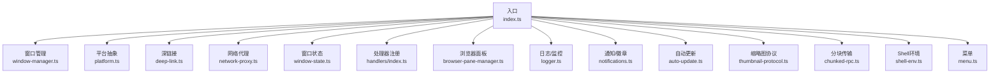
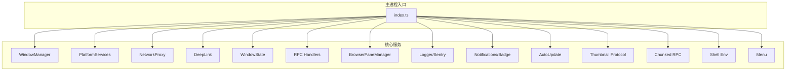
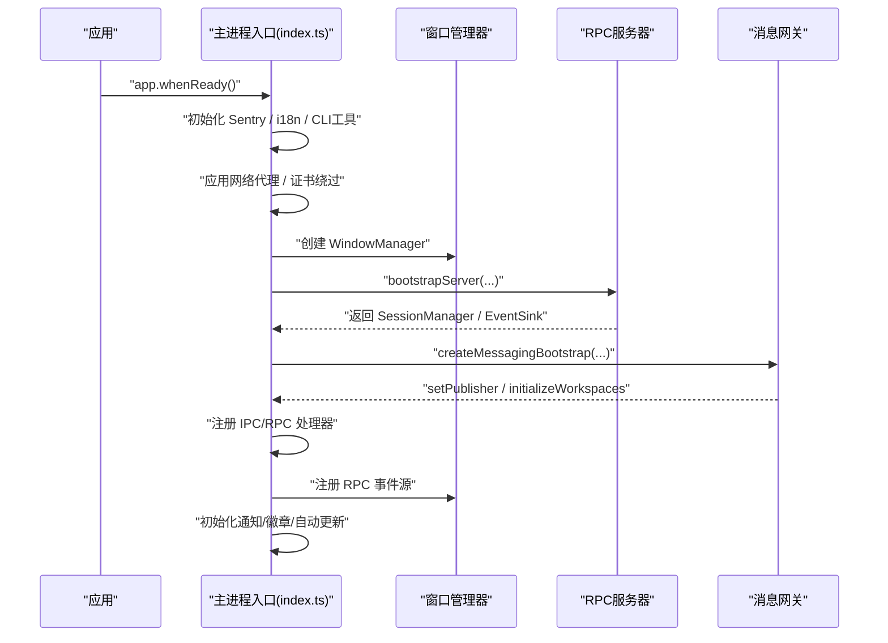
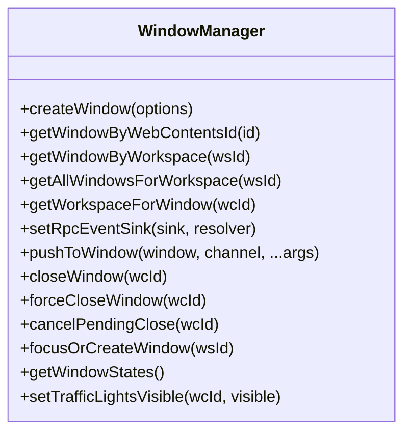
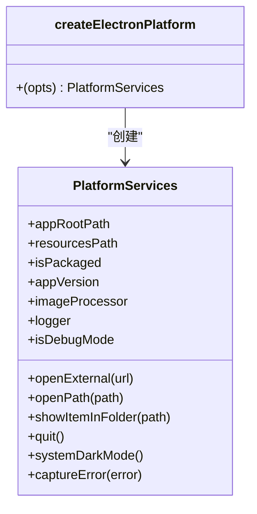
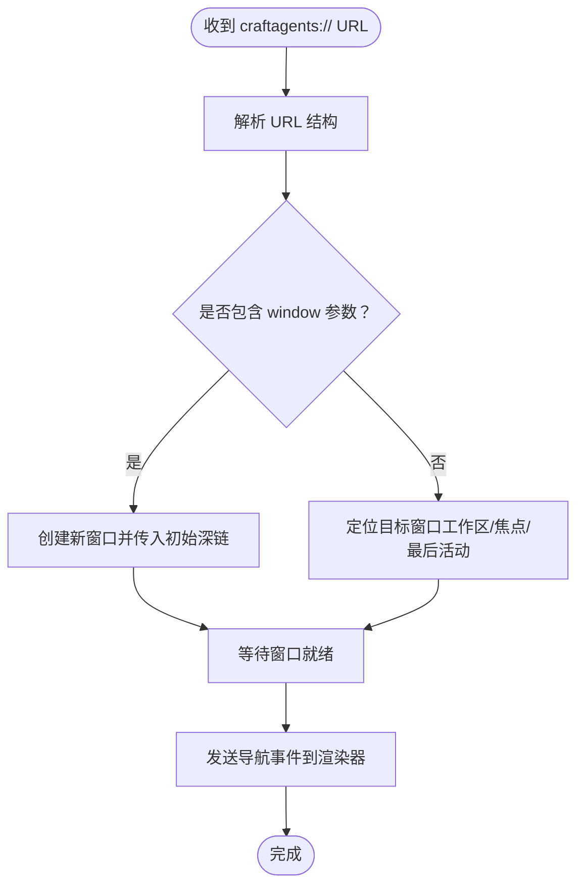
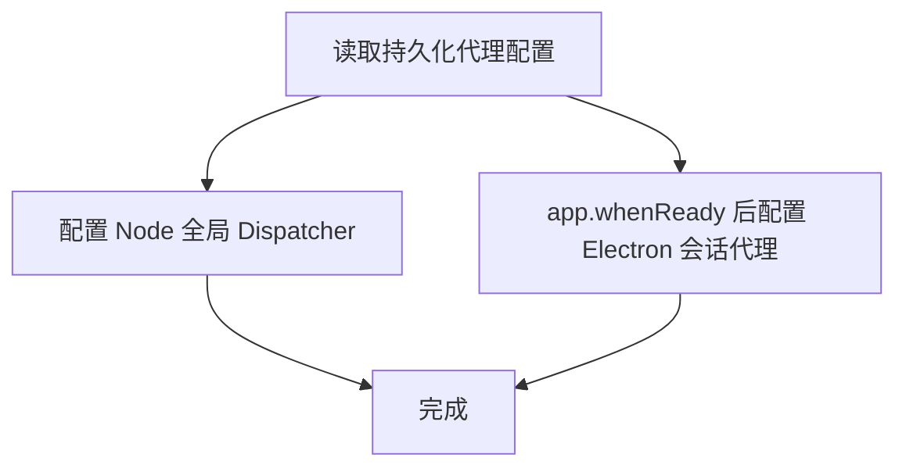
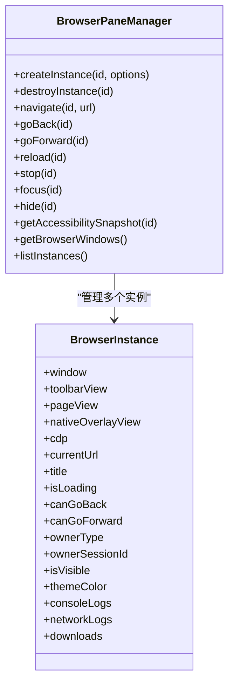
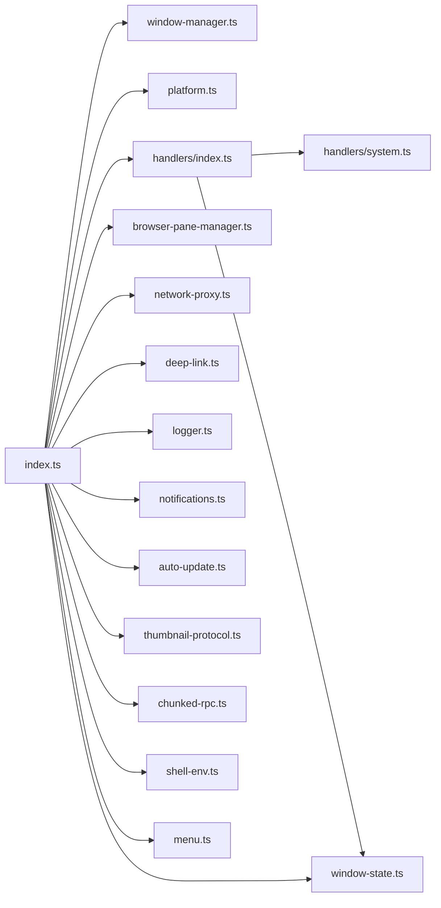

# Electron 主进程开发

<cite>
**本文引用的文件**
- [apps/electron/src/main/index.ts](file://apps/electron/src/main/index.ts)
- [apps/electron/src/main/window-manager.ts](file://apps/electron/src/main/window-manager.ts)
- [apps/electron/src/main/platform.ts](file://apps/electron/src/main/platform.ts)
- [apps/electron/src/main/deep-link.ts](file://apps/electron/src/main/deep-link.ts)
- [apps/electron/src/main/network-proxy.ts](file://apps/electron/src/main/network-proxy.ts)
- [apps/electron/src/main/window-state.ts](file://apps/electron/src/main/window-state.ts)
- [apps/electron/src/main/handlers/index.ts](file://apps/electron/src/main/handlers/index.ts)
- [apps/electron/src/main/browser-pane-manager.ts](file://apps/electron/src/main/browser-pane-manager.ts)
- [apps/electron/src/main/logger.ts](file://apps/electron/src/main/logger.ts)
- [apps/electron/src/main/notifications.ts](file://apps/electron/src/main/notifications.ts)
- [apps/electron/src/main/auto-update.ts](file://apps/electron/src/main/auto-update.ts)
- [apps/electron/src/main/thumbnail-protocol.ts](file://apps/electron/src/main/thumbnail-protocol.ts)
- [apps/electron/src/main/chunked-rpc.ts](file://apps/electron/src/main/chunked-rpc.ts)
- [apps/electron/src/main/shell-env.ts](file://apps/electron/src/main/shell-env.ts)
- [apps/electron/src/main/handlers/system.ts](file://apps/electron/src/main/handlers/system.ts)
- [apps/electron/src/main/handlers/workspace.ts](file://apps/electron/src/main/handlers/workspace.ts)
- [apps/electron/src/main/menu.ts](file://apps/electron/src/main/menu.ts)
</cite>

## 更新摘要
**所做更改**
- 增强了自动更新功能的错误处理和状态管理
- 改进了窗口管理系统的生命周期和错误处理机制
- 优化了应用启动流程和初始化顺序
- 新增了结构化日志记录和专用日志通道
- 增强了错误监控和调试能力

## 目录
1. [简介](#简介)
2. [项目结构](#项目结构)
3. [核心组件](#核心组件)
4. [架构总览](#架构总览)
5. [详细组件分析](#详细组件分析)
6. [依赖关系分析](#依赖关系分析)
7. [性能考量](#性能考量)
8. [故障排查指南](#故障排查指南)
9. [结论](#结论)
10. [附录](#附录)

## 简介
本文件面向需要扩展 Electron 主进程功能的开发者，系统性阐述主进程架构设计、应用生命周期管理、窗口管理系统、IPC 通信机制、平台服务抽象、错误监控集成（Sentry）、窗口状态持久化、深链接处理、证书验证、网络代理配置、浏览器面板管理、通知与徽章、自动更新、缩略图协议、大包分块传输、Shell 环境加载等主题。文档提供模块化组织、依赖注入模式、事件处理最佳实践，并给出调试技巧与常见问题排查路径。

## 项目结构
主进程代码集中在 apps/electron/src/main 下，采用"按职责分层 + 按功能聚合"的组织方式：
- 入口与生命周期：index.ts 负责应用初始化、协议注册、代理设置、证书绕过、深链处理、窗口恢复、服务注入、Sentry 初始化等。
- 窗口管理：window-manager.ts 提供窗口生命周期、导航拦截、关闭拦截、焦点广播、状态持久化接口。
- 平台抽象：platform.ts 将 Electron API 抽象为可注入的 PlatformServices，便于测试与跨平台适配。
- 深链接：deep-link.ts 解析 craftagents:// URL，路由到目标工作区或会话。
- 网络代理：network-proxy.ts 配置 Node/undici 与 Electron 会话代理，支持 NO_PROXY 规则。
- 窗口状态：window-state.ts 负责窗口边界、聚焦模式、URL 的保存与加载。
- 处理器注册：handlers/index.ts 统一注册核心与 GUI RPC 处理器。
- 浏览器面板：browser-pane-manager.ts 管理无框架 BrowserWindow + BrowserView 的浏览器实例，支持 CDP、截图、日志、下载等。
- 日志与监控：logger.ts 提供多通道日志；auto-update.ts 集成 electron-updater；thumbnail-protocol.ts 注册自定义协议；chunked-rpc.ts 支持大包分块传输。
- 通知与徽章：notifications.ts 管理原生通知与 Dock/任务栏徽章。
- 菜单：menu.ts 构建 macOS 原生菜单并桥接 RPC 事件。
- Shell 环境：shell-env.ts 在 macOS 上加载用户完整 shell 环境变量。

**图表来源**
- [apps/electron/src/main/index.ts:1-1325](file://apps/electron/src/main/index.ts#L1-L1325)
- [apps/electron/src/main/window-manager.ts:1-760](file://apps/electron/src/main/window-manager.ts#L1-L760)
- [apps/electron/src/main/platform.ts:1-73](file://apps/electron/src/main/platform.ts#L1-L73)
- [apps/electron/src/main/deep-link.ts:1-343](file://apps/electron/src/main/deep-link.ts#L1-L343)
- [apps/electron/src/main/network-proxy.ts:1-175](file://apps/electron/src/main/network-proxy.ts#L1-L175)
- [apps/electron/src/main/window-state.ts:1-91](file://apps/electron/src/main/window-state.ts#L1-L91)
- [apps/electron/src/main/handlers/index.ts:1-23](file://apps/electron/src/main/handlers/index.ts#L1-L23)
- [apps/electron/src/main/browser-pane-manager.ts:1-800](file://apps/electron/src/main/browser-pane-manager.ts#L1-L800)
- [apps/electron/src/main/logger.ts:1-285](file://apps/electron/src/main/logger.ts#L1-L285)
- [apps/electron/src/main/notifications.ts:1-296](file://apps/electron/src/main/notifications.ts#L1-L296)
- [apps/electron/src/main/auto-update.ts:1-516](file://apps/electron/src/main/auto-update.ts#L1-L516)
- [apps/electron/src/main/thumbnail-protocol.ts:1-200](file://apps/electron/src/main/thumbnail-protocol.ts#L1-L200)
- [apps/electron/src/main/chunked-rpc.ts:1-145](file://apps/electron/src/main/chunked-rpc.ts#L1-L145)
- [apps/electron/src/main/shell-env.ts:1-110](file://apps/electron/src/main/shell-env.ts#L1-L110)
- [apps/electron/src/main/menu.ts:1-295](file://apps/electron/src/main/menu.ts#L1-L295)

**章节来源**
- [apps/electron/src/main/index.ts:1-1325](file://apps/electron/src/main/index.ts#L1-L1325)

## 核心组件
- 应用入口与生命周期：负责 Sentry 初始化、i18n、CLI 工具打包、网络代理、证书绕过、深链接注册、窗口恢复、平台注入、RPC 服务器启动、消息网关、通知服务、自动更新、缩略图协议、日志初始化等。
- 窗口管理器：统一管理 BrowserWindow 生命周期、导航拦截、关闭拦截、焦点广播、状态持久化、多实例聚焦策略。
- 平台服务抽象：将 Electron API 抽象为 PlatformServices，便于在不同运行时注入。
- 深链接解析与路由：解析 craftagents:// URL，支持工作区定向、视图导航、动作执行、新窗口模式。
- 网络代理：同时配置 Node/undici 与 Electron 会话代理，支持 NO_PROXY 规则。
- 窗口状态持久化：保存窗口边界、聚焦模式、URL，支持跨启动恢复。
- RPC 处理器注册：统一注册核心与 GUI 处理器，支持条件注册（headless）。
- 浏览器面板管理：无框架窗口 + 多 BrowserView，支持 CDP、截图、日志、下载、主题色提取、空状态页。
- 日志与监控：结构化日志、独立消息网关日志、Sentry 错误上报与敏感信息脱敏。
- 通知与徽章：原生通知、Dock 徽章绘制、任务栏覆盖图标、实例徽章。
- 自动更新：electron-updater 集成，支持检查、下载、安装、进度广播、版本忽略。
- 缩略图协议：自定义 thumbnail:// 协议，跨平台生成缩略图并缓存。
- 分块传输：大包通过分块 RPC 传输，支持重试与校验。
- Shell 环境：在 macOS 上加载用户完整 shell 环境变量。
- 菜单：macOS 原生菜单构建与 RPC 事件桥接。

**章节来源**
- [apps/electron/src/main/index.ts:1-1325](file://apps/electron/src/main/index.ts#L1-L1325)
- [apps/electron/src/main/window-manager.ts:1-760](file://apps/electron/src/main/window-manager.ts#L1-L760)
- [apps/electron/src/main/platform.ts:1-73](file://apps/electron/src/main/platform.ts#L1-L73)
- [apps/electron/src/main/deep-link.ts:1-343](file://apps/electron/src/main/deep-link.ts#L1-L343)
- [apps/electron/src/main/network-proxy.ts:1-175](file://apps/electron/src/main/network-proxy.ts#L1-L175)
- [apps/electron/src/main/window-state.ts:1-91](file://apps/electron/src/main/window-state.ts#L1-L91)
- [apps/electron/src/main/handlers/index.ts:1-23](file://apps/electron/src/main/handlers/index.ts#L1-L23)
- [apps/electron/src/main/browser-pane-manager.ts:1-800](file://apps/electron/src/main/browser-pane-manager.ts#L1-L800)
- [apps/electron/src/main/logger.ts:1-285](file://apps/electron/src/main/logger.ts#L1-L285)
- [apps/electron/src/main/notifications.ts:1-296](file://apps/electron/src/main/notifications.ts#L1-L296)
- [apps/electron/src/main/auto-update.ts:1-516](file://apps/electron/src/main/auto-update.ts#L1-L516)
- [apps/electron/src/main/thumbnail-protocol.ts:1-200](file://apps/electron/src/main/thumbnail-protocol.ts#L1-L200)
- [apps/electron/src/main/chunked-rpc.ts:1-145](file://apps/electron/src/main/chunked-rpc.ts#L1-L145)
- [apps/electron/src/main/shell-env.ts:1-110](file://apps/electron/src/main/shell-env.ts#L1-L110)
- [apps/electron/src/main/menu.ts:1-295](file://apps/electron/src/main/menu.ts#L1-L295)

## 架构总览
主进程采用"入口集中初始化 + 模块化职责分离 + 依赖注入 + RPC 事件驱动"的架构模式。入口负责全局初始化与服务装配，各模块通过接口解耦，通过 WindowManager、PlatformServices、EventSink 等注入点协作。

**图表来源**
- [apps/electron/src/main/index.ts:1-1325](file://apps/electron/src/main/index.ts#L1-L1325)
- [apps/electron/src/main/window-manager.ts:1-760](file://apps/electron/src/main/window-manager.ts#L1-L760)
- [apps/electron/src/main/platform.ts:1-73](file://apps/electron/src/main/platform.ts#L1-L73)
- [apps/electron/src/main/network-proxy.ts:1-175](file://apps/electron/src/main/network-proxy.ts#L1-L175)
- [apps/electron/src/main/deep-link.ts:1-343](file://apps/electron/src/main/deep-link.ts#L1-L343)
- [apps/electron/src/main/window-state.ts:1-91](file://apps/electron/src/main/window-state.ts#L1-L91)
- [apps/electron/src/main/handlers/index.ts:1-23](file://apps/electron/src/main/handlers/index.ts#L1-L23)
- [apps/electron/src/main/browser-pane-manager.ts:1-800](file://apps/electron/src/main/browser-pane-manager.ts#L1-L800)
- [apps/electron/src/main/logger.ts:1-285](file://apps/electron/src/main/logger.ts#L1-L285)
- [apps/electron/src/main/notifications.ts:1-296](file://apps/electron/src/main/notifications.ts#L1-L296)
- [apps/electron/src/main/auto-update.ts:1-516](file://apps/electron/src/main/auto-update.ts#L1-L516)
- [apps/electron/src/main/thumbnail-protocol.ts:1-200](file://apps/electron/src/main/thumbnail-protocol.ts#L1-L200)
- [apps/electron/src/main/chunked-rpc.ts:1-145](file://apps/electron/src/main/chunked-rpc.ts#L1-L145)
- [apps/electron/src/main/shell-env.ts:1-110](file://apps/electron/src/main/shell-env.ts#L1-L110)
- [apps/electron/src/main/menu.ts:1-295](file://apps/electron/src/main/menu.ts#L1-L295)

## 详细组件分析

### 应用入口与生命周期（index.ts）
- Sentry 初始化：在生产构建中启用，DSN 由构建期常量注入；对请求头与面包屑中的敏感数据进行脱敏。
- i18n 初始化：菜单、对话框等使用国际化。
- CLI 工具打包：根据平台选择内置 uv 二进制与脚本目录，注入资源根路径、命令入口、文档路径、版本号、PATH 前缀。
- 平台注册：注册 Pi 模型解析器、默认应用名、自定义协议（craftagents）。
- 网络代理：早期应用 Node 级代理设置；app.whenReady 后重新应用 Electron 会话代理。
- 证书绕过：针对 CRAFT_SERVER_URL 指定的服务器 Origin，拦截 certificate-error 事件并允许连接。
- 缩略图协议：在 app.whenReady 前注册 thumbnail:// 方案。
- 深链接：注册 open-url 与 second-instance 处理，支持 macOS 与 Windows/Linux 的多实例场景。
- 窗口创建：加载窗口状态，若无工作区则创建默认工作区；支持从保存状态恢复窗口。
- 服务器与消息网关：创建 SessionManager、BrowserPaneManager、PlatformServices，注入模型刷新、运行时钩子、事件推送、消息网关注册与扇出事件源。
- IPC 与 RPC：注册窗口本地查询、传输状态桥接、对话框调用、工作区移除、跨服务器 RPC、会话迁移等。
- 自动更新：检查更新、事件广播、安装流程。
- 通知服务：初始化通知服务与徽章图标。
- 日志：初始化 electron-log。

**更新** 改进了应用启动流程，增加了更完善的错误处理和初始化顺序优化。

**图表来源**
- [apps/electron/src/main/index.ts:1-1325](file://apps/electron/src/main/index.ts#L1-L1325)

**章节来源**
- [apps/electron/src/main/index.ts:1-1325](file://apps/electron/src/main/index.ts#L1-L1325)

### 窗口管理系统（window-manager.ts）
- 窗口创建：支持聚焦模式（小窗无侧边栏）、平台特定窗口选项（macOS 隐藏标题栏、Windows 透明材质）、预加载脚本、外部链接打开策略。
- 导航拦截：仅允许 file:// 与开发服务器地址，其他外部链接交由系统浏览器打开。
- 关闭拦截：区分窗口按钮、键盘快捷键、渲染器确认，支持回退超时强制关闭。
- 状态持久化：保存窗口边界、聚焦模式、当前 URL，支持跨启动恢复。
- RPC 事件推送：优先通过 RPC 推送，失败回退至 webContents.send。
- 多实例聚焦：提供聚焦或创建窗口的方法，支持最后活动窗口回退。

**更新** 增强了窗口生命周期管理和错误处理机制，改进了窗口状态持久化和多实例管理。

**图表来源**
- [apps/electron/src/main/window-manager.ts:1-760](file://apps/electron/src/main/window-manager.ts#L1-L760)

**章节来源**
- [apps/electron/src/main/window-manager.ts:1-760](file://apps/electron/src/main/window-manager.ts#L1-L760)

### 平台服务抽象（platform.ts）
- 将 Electron API 抽象为 PlatformServices，包括应用路径、资源路径、打包状态、版本、外部打开、系统深色模式、图像处理、日志、错误捕获等。
- 通过工厂函数注入到 bootstrapServer，避免直接耦合 Electron。

**图表来源**
- [apps/electron/src/main/platform.ts:1-73](file://apps/electron/src/main/platform.ts#L1-L73)

**章节来源**
- [apps/electron/src/main/platform.ts:1-73](file://apps/electron/src/main/platform.ts#L1-L73)

### 深链接处理（deep-link.ts）
- URL 解析：支持复合视图（allSessions、flagged、state、sources、settings、skills）、动作（new-chat、resume-sdk-session、delete-session、flag-session、unflag-session）、工作区定向、窗口模式（focused/full）、右侧边栏参数。
- 打开新窗口：当 URL 包含 window=focused/full 时，创建新窗口并传入初始深链。
- 定位目标窗口：优先使用工作区定向，否则使用焦点窗口或最后活动窗口。
- 渲染器导航：等待窗口就绪后，通过 RPC 发送导航事件。

**图表来源**
- [apps/electron/src/main/deep-link.ts:1-343](file://apps/electron/src/main/deep-link.ts#L1-L343)

**章节来源**
- [apps/electron/src/main/deep-link.ts:1-343](file://apps/electron/src/main/deep-link.ts#L1-L343)

### 网络代理配置（network-proxy.ts）
- Node/undici：自定义 Dispatcher，按协议路由到 httpProxy/httpsProxy 或直连，支持 NO_PROXY 规则。
- Electron 会话：在 app.ready 后为 default 与浏览器面板分区会话设置代理，支持固定服务器规则与 bypass 规则。
- 动态更新：提供更新配置并立即应用的接口。

**图表来源**
- [apps/electron/src/main/network-proxy.ts:1-175](file://apps/electron/src/main/network-proxy.ts#L1-L175)

**章节来源**
- [apps/electron/src/main/network-proxy.ts:1-175](file://apps/electron/src/main/network-proxy.ts#L1-L175)

### 窗口状态持久化（window-state.ts）
- 数据结构：保存窗口类型、工作区 ID、边界、聚焦模式、URL。
- 存储位置：用户主目录下的 .craft-agent/window-state.json。
- 加载/保存/清理：提供格式校验与错误处理。

**章节来源**
- [apps/electron/src/main/window-state.ts:1-91](file://apps/electron/src/main/window-state.ts#L1-L91)

### RPC 处理器注册（handlers/index.ts）
- 统一注册核心与 GUI 处理器，支持 headless 条件注册。
- GUI 处理器：系统、工作区、浏览器、设置等。

**章节来源**
- [apps/electron/src/main/handlers/index.ts:1-23](file://apps/electron/src/main/handlers/index.ts#L1-L23)

### 浏览器面板管理（browser-pane-manager.ts）
- 实例模型：每个实例对应一个无框架 BrowserWindow，包含工具栏、页面、原生叠加层三个 BrowserView。
- 会话与权限：基于分区会话，初始化权限与观察者。
- 导航与控制：支持导航、前进/后退、重载、停止、聚焦/隐藏、坐标点击、可访问性快照、截图、日志、下载、主题色提取、空状态页、深链触发等。
- 事件与回调：状态变更、移除、交互回调，以及与 WindowManager 的联动。

**图表来源**
- [apps/electron/src/main/browser-pane-manager.ts:1-800](file://apps/electron/src/main/browser-pane-manager.ts#L1-L800)

**章节来源**
- [apps/electron/src/main/browser-pane-manager.ts:1-800](file://apps/electron/src/main/browser-pane-manager.ts#L1-L800)

### 日志与错误监控（logger.ts + Sentry 集成）
- 结构化日志记录基础设施：提供多通道日志输出，支持开发模式下的文件与控制台输出，生产模式下的精简输出。
- 独立消息网关日志：为消息网关提供独立的日志通道，支持独立轮转和管理。
- 敏感信息脱敏：在请求头、面包屑和日志内容中对敏感键值进行脱敏处理，保护用户隐私。
- Sentry 集成：在应用入口处初始化 Sentry，配置环境标识、版本信息、错误过滤器等，确保错误监控的有效性。
- 错误监控增强：改进了错误捕获机制，提供更详细的上下文信息和堆栈跟踪。

**更新** 新增了结构化日志记录基础设施，改进了错误监控和日志功能，增强了敏感信息脱敏和错误上下文收集。

**章节来源**
- [apps/electron/src/main/logger.ts:1-285](file://apps/electron/src/main/logger.ts#L1-L285)
- [apps/electron/src/main/index.ts:1-1325](file://apps/electron/src/main/index.ts#L1-L1325)

### 通知与徽章（notifications.ts）
- 原生通知：平台支持时显示，点击后聚焦窗口并导航到会话。
- 徽章：macOS Canvas 绘制 Dock 图标覆盖、Windows 任务栏覆盖、Linux setBadgeCount。
- 事件路由：优先单客户端目标，否则广播到工作区。

**章节来源**
- [apps/electron/src/main/notifications.ts:1-296](file://apps/electron/src/main/notifications.ts#L1-L296)

### 自动更新（auto-update.ts）
- 使用 electron-updater：macOS 原子替换、Windows 静默安装、Linux AppImage 替换。
- 状态机：检查中、可用、下载中、已准备、安装中、错误。
- 进度广播：下载进度与更新可用事件通过 RPC 广播。
- 启动检查：尊重用户忽略版本，支持立即检查与自动下载。

**更新** 增强了自动更新功能的状态管理、错误处理和日志记录，改进了更新安装流程和恢复机制。

**章节来源**
- [apps/electron/src/main/auto-update.ts:1-516](file://apps/electron/src/main/auto-update.ts#L1-L516)

### 缩略图协议（thumbnail-protocol.ts）
- 注册 thumbnail:// 方案，支持 Fetch API、CORS、流式响应。
- 生成策略：macOS/Windows 使用 OS 缩略图 API，Linux 使用 Skia 引擎；缓存 LRU，按 mtime 失效。
- URL 格式：thumbnail://thumb/<绝对路径编码>。

**章节来源**
- [apps/electron/src/main/thumbnail-protocol.ts:1-200](file://apps/electron/src/main/thumbnail-protocol.ts#L1-L200)

### 分块 RPC（chunked-rpc.ts）
- 大包传输：将大对象序列化为 JSON，按 2MB 块 base64 编码，逐块发送并重试，最后提交。
- 校验：SHA256 校验，失败自动中止。
- 适用：跨服务器会话迁移、远程导入等场景。

**章节来源**
- [apps/electron/src/main/chunked-rpc.ts:1-145](file://apps/electron/src/main/chunked-rpc.ts#L1-L145)

### Shell 环境加载（shell-env.ts）
- macOS GUI 启动时环境最小，通过登录 shell 输出 env 并合并到 process.env。
- 跳过 VITE_* 变量，防止打包应用尝试连接本地开发服务器。
- 失败回退：添加常见路径前缀。

**章节来源**
- [apps/electron/src/main/shell-env.ts:1-110](file://apps/electron/src/main/shell-env.ts#L1-L110)

### 菜单（menu.ts）
- macOS 原生菜单：关于、更新、设置、隐藏、退出等。
- 事件桥接：将菜单项映射为 RPC 广播事件，通过 EventSink 与 ClientResolver 发送到渲染器。
- 动态更新：根据更新状态动态重建菜单项。

**章节来源**
- [apps/electron/src/main/menu.ts:1-295](file://apps/electron/src/main/menu.ts#L1-L295)

### RPC 处理器（handlers/system.ts, handlers/workspace.ts）
- 系统处理器：主题偏好、版本信息、Home 目录、调试日志、Git 分支检测、Git Bash 路径检测/浏览/设置、URL 打开（内部深链处理）、文件打开/展示。
- 工作区处理器：远程连接测试、打开工作区、在新窗口打开会话、窗口关闭/确认/取消、交通灯可见性。

**章节来源**
- [apps/electron/src/main/handlers/system.ts:1-441](file://apps/electron/src/main/handlers/system.ts#L1-L441)
- [apps/electron/src/main/handlers/workspace.ts:1-137](file://apps/electron/src/main/handlers/workspace.ts#L1-L137)

## 依赖关系分析
- 入口对各模块的依赖：通过构造函数与注入点解耦，避免循环依赖。
- WindowManager 对 RPC 事件源的依赖：setRpcEventSink 在服务器创建后注入，确保事件推送一致性。
- PlatformServices 对 Electron API 的抽象：所有平台能力通过接口暴露，便于替换实现。
- RPC 处理器对 WindowManager 的依赖：窗口操作类处理器依赖 WindowManager。
- 消息网关与 RPC 服务器：通过 setPublisher 与 wrapSink 形成扇出事件源。

**图表来源**
- [apps/electron/src/main/index.ts:1-1325](file://apps/electron/src/main/index.ts#L1-L1325)
- [apps/electron/src/main/window-manager.ts:1-760](file://apps/electron/src/main/window-manager.ts#L1-L760)
- [apps/electron/src/main/platform.ts:1-73](file://apps/electron/src/main/platform.ts#L1-L73)
- [apps/electron/src/main/handlers/index.ts:1-23](file://apps/electron/src/main/handlers/index.ts#L1-L23)
- [apps/electron/src/main/handlers/system.ts:1-441](file://apps/electron/src/main/handlers/system.ts#L1-L441)
- [apps/electron/src/main/handlers/workspace.ts:1-137](file://apps/electron/src/main/handlers/workspace.ts#L1-L137)
- [apps/electron/src/main/browser-pane-manager.ts:1-800](file://apps/electron/src/main/browser-pane-manager.ts#L1-L800)
- [apps/electron/src/main/network-proxy.ts:1-175](file://apps/electron/src/main/network-proxy.ts#L1-L175)
- [apps/electron/src/main/deep-link.ts:1-343](file://apps/electron/src/main/deep-link.ts#L1-L343)
- [apps/electron/src/main/window-state.ts:1-91](file://apps/electron/src/main/window-state.ts#L1-L91)
- [apps/electron/src/main/logger.ts:1-285](file://apps/electron/src/main/logger.ts#L1-L285)
- [apps/electron/src/main/notifications.ts:1-296](file://apps/electron/src/main/notifications.ts#L1-L296)
- [apps/electron/src/main/auto-update.ts:1-516](file://apps/electron/src/main/auto-update.ts#L1-L516)
- [apps/electron/src/main/thumbnail-protocol.ts:1-200](file://apps/electron/src/main/thumbnail-protocol.ts#L1-L200)
- [apps/electron/src/main/chunked-rpc.ts:1-145](file://apps/electron/src/main/chunked-rpc.ts#L1-L145)
- [apps/electron/src/main/shell-env.ts:1-110](file://apps/electron/src/main/shell-env.ts#L1-L110)
- [apps/electron/src/main/menu.ts:1-295](file://apps/electron/src/main/menu.ts#L1-L295)

**章节来源**
- [apps/electron/src/main/index.ts:1-1325](file://apps/electron/src/main/index.ts#L1-L1325)

## 性能考量
- 窗口启动优化：ready-to-show 延迟显示，减少白屏时间；开发模式失败重试加载 Vite 服务。
- 网络代理：Node 级 Dispatcher 按协议路由，NO_PROXY 规则减少不必要的代理跳转。
- 缩略图缓存：LRU + mtime 失效，限制最大条目数，避免内存膨胀。
- 分块传输：2MB 块大小平衡往返次数与代理限制，支持重试。
- 日志轮转：消息网关日志独立轮转，避免主日志过大影响性能。
- 图像处理：resize 与格式转换在 nativeImage 上执行，避免额外中间文件。
- 结构化日志：通过结构化日志记录基础设施，提高日志查询和分析效率。

## 故障排查指南
- 深链接无法打开：检查协议注册、macOS open-url 事件、Windows/Linux 第二实例事件、window-manager 状态。
- 代理不生效：确认持久化配置、Node 级与 Electron 级代理分别应用时机、NO_PROXY 规则。
- 证书错误：确认 CRAFT_SERVER_URL 正确、URL 规范化（wss→https），仅对指定 Origin 绕过。
- 窗口状态异常：检查 window-state.json 格式、工作区 ID 有效性、URL 解析与恢复逻辑。
- RPC 大包失败：检查分块传输阈值、重试次数、校验失败后的 ABORT。
- 自动更新卡住：查看 electron-updater 内部状态与缓存目录，确认 ready 状态与下载文件存在。
- 通知/徽章无效：确认平台支持、事件路由到单客户端、macOS Canvas 绘制、Windows 任务栏覆盖。
- Shell 环境缺失：macOS GUI 启动时未加载完整 PATH，需检查 shell-env 加载与回退路径。
- 日志记录问题：检查结构化日志配置、敏感信息脱敏规则、Sentry 集成状态。

**更新** 新增了自动更新相关的故障排查指南，包括更新状态检查和错误恢复机制。

**章节来源**
- [apps/electron/src/main/deep-link.ts:1-343](file://apps/electron/src/main/deep-link.ts#L1-L343)
- [apps/electron/src/main/network-proxy.ts:1-175](file://apps/electron/src/main/network-proxy.ts#L1-L175)
- [apps/electron/src/main/window-state.ts:1-91](file://apps/electron/src/main/window-state.ts#L1-L91)
- [apps/electron/src/main/chunked-rpc.ts:1-145](file://apps/electron/src/main/chunked-rpc.ts#L1-L145)
- [apps/electron/src/main/auto-update.ts:1-516](file://apps/electron/src/main/auto-update.ts#L1-L516)
- [apps/electron/src/main/notifications.ts:1-296](file://apps/electron/src/main/notifications.ts#L1-L296)
- [apps/electron/src/main/shell-env.ts:1-110](file://apps/electron/src/main/shell-env.ts#L1-L110)
- [apps/electron/src/main/logger.ts:1-285](file://apps/electron/src/main/logger.ts#L1-L285)

## 结论
该主进程以模块化与依赖注入为核心，结合 RPC 事件驱动与平台抽象，实现了稳定、可扩展的桌面应用主进程。通过完善的日志与监控、代理与证书配置、深链接与窗口管理、通知与徽章、自动更新与缩略图协议、分块传输与 Shell 环境加载，满足复杂业务场景需求。新增的结构化日志记录基础设施进一步提升了系统的可观测性和调试效率。建议在扩展新功能时遵循现有模块边界与注入模式，保持低耦合高内聚。

## 附录
- 最佳实践
  - 使用 WindowManager 的 RPC 事件源推送，避免直接 webContents.send。
  - 通过 PlatformServices 抽象平台差异，便于测试与替换。
  - 深链接解析与导航分离，支持新窗口模式与工作区定向。
  - 网络代理配置分阶段应用，先 Node 后 Electron。
  - 敏感信息在 Sentry 与日志中脱敏。
  - 大包传输使用分块 RPC 并设置重试与校验。
  - 利用结构化日志记录基础设施进行统一的日志管理和分析。
- 调试技巧
  - 开发模式下启用 electron-log 控制台输出与文件输出。
  - 使用 --debug 启动参数开启调试模式。
  - 利用 RPC 通道 __transport:status 与 __dialog:* 桥接能力观察底层状态。
  - 在 macOS 上通过 shell-env 加载完整 PATH，避免工具不可用。
  - 通过结构化日志快速定位问题，利用敏感信息脱敏保护隐私数据。