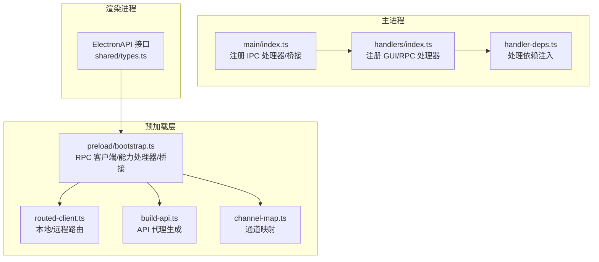
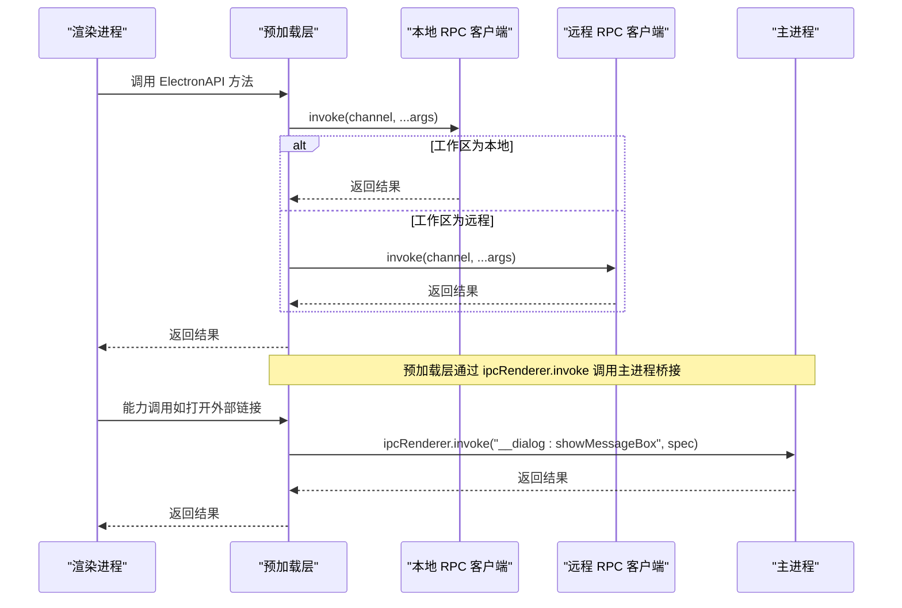
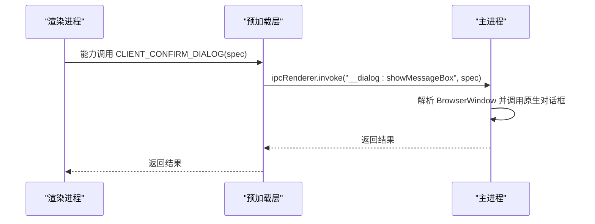
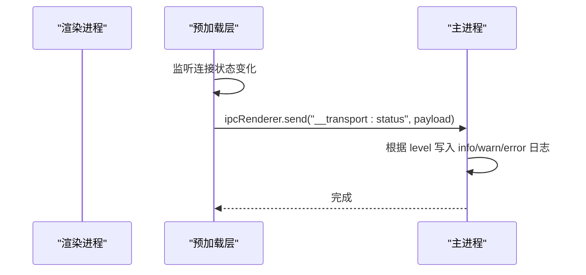
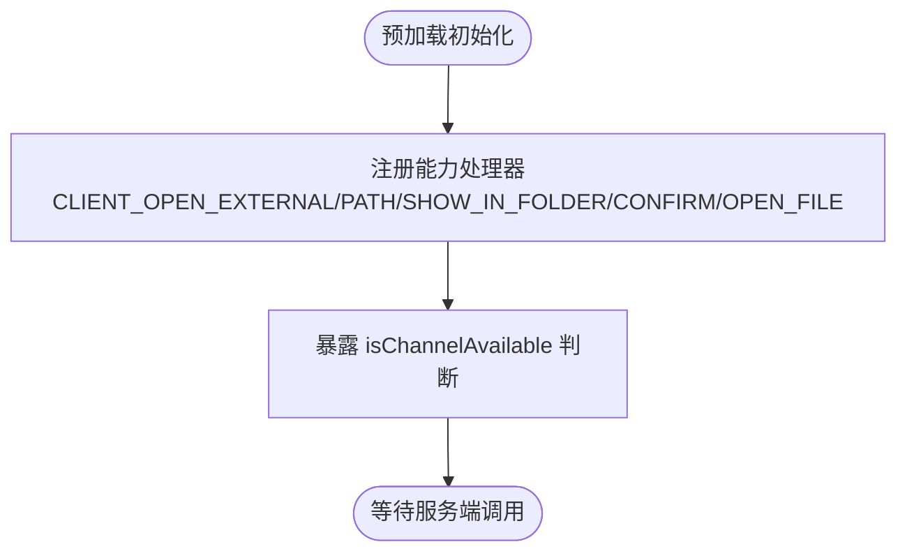
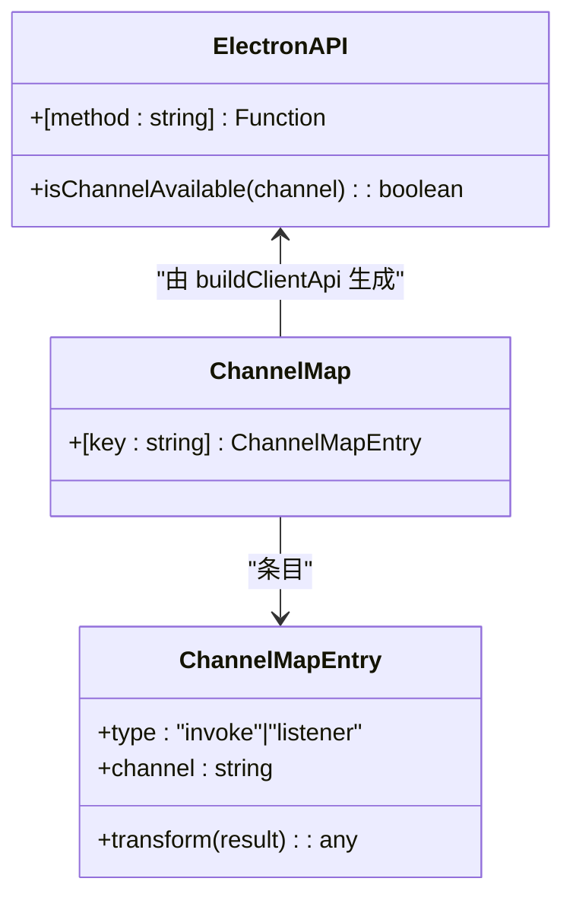
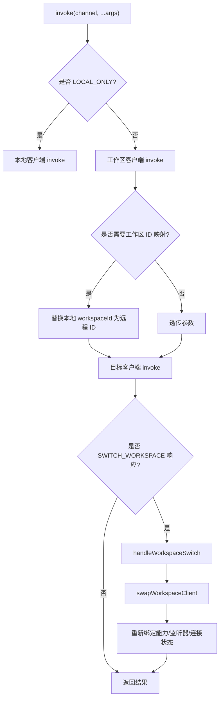
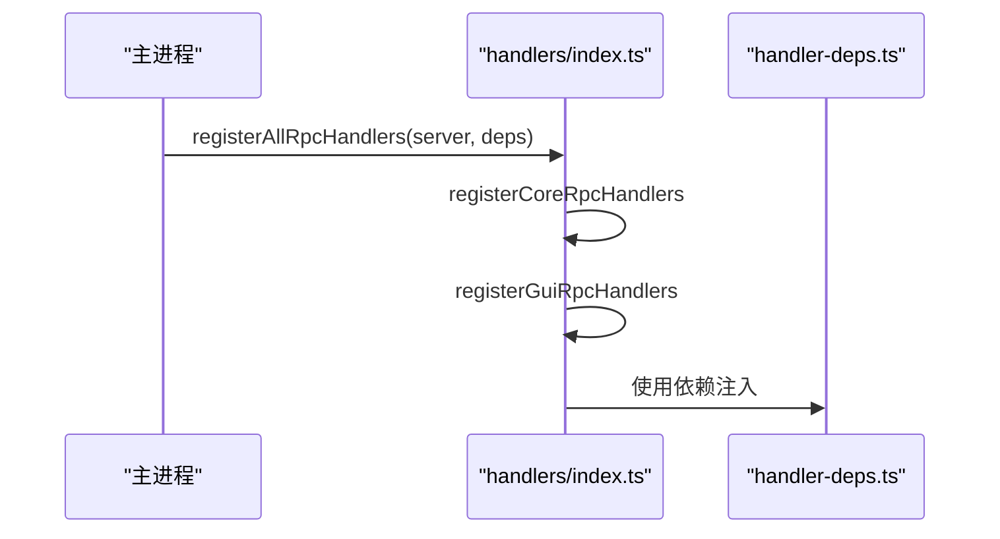
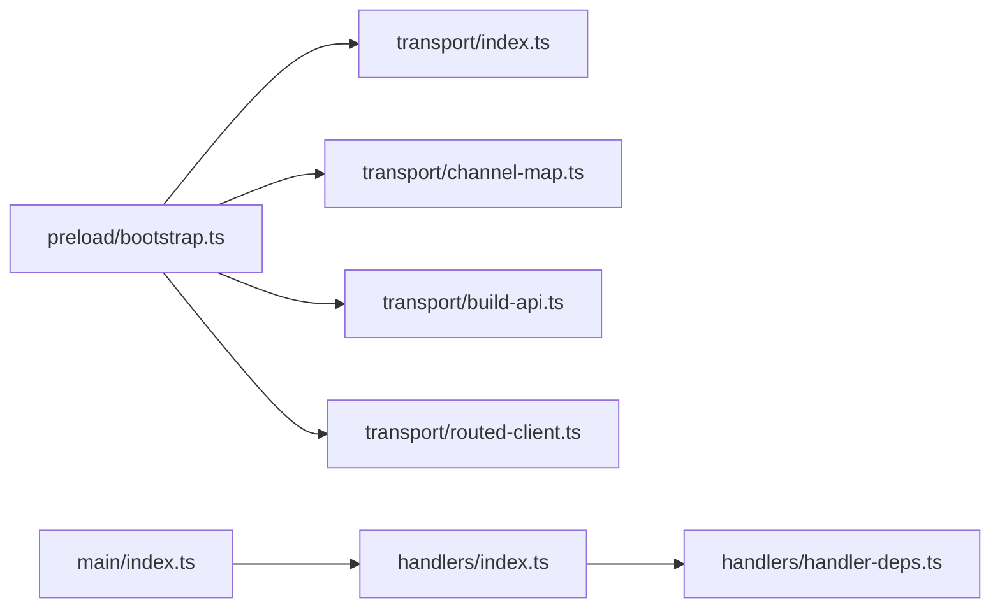

# IPC 通信机制

<cite>
**本文引用的文件**
- [apps/electron/src/main/index.ts](file://apps/electron/src/main/index.ts)
- [apps/electron/src/preload/bootstrap.ts](file://apps/electron/src/preload/bootstrap.ts)
- [apps/electron/src/transport/index.ts](file://apps/electron/src/transport/index.ts)
- [apps/electron/src/transport/channel-map.ts](file://apps/electron/src/transport/channel-map.ts)
- [apps/electron/src/transport/build-api.ts](file://apps/electron/src/transport/build-api.ts)
- [apps/electron/src/transport/client.ts](file://apps/electron/src/transport/client.ts)
- [apps/electron/src/transport/routed-client.ts](file://apps/electron/src/transport/routed-client.ts)
- [apps/electron/src/transport/server.ts](file://apps/electron/src/transport/server.ts)
- [apps/electron/src/main/handlers/index.ts](file://apps/electron/src/main/handlers/index.ts)
- [apps/electron/src/main/handlers/handler-deps.ts](file://apps/electron/src/main/handlers/handler-deps.ts)
- [apps/electron/src/shared/types.ts](file://apps/electron/src/shared/types.ts)
</cite>

## 目录
1. [简介](#简介)
2. [项目结构](#项目结构)
3. [核心组件](#核心组件)
4. [架构总览](#架构总览)
5. [详细组件分析](#详细组件分析)
6. [依赖关系分析](#依赖关系分析)
7. [性能考虑](#性能考虑)
8. [故障排查指南](#故障排查指南)
9. [结论](#结论)
10. [附录](#附录)

## 简介
本文件系统性阐述该 Electron 应用的 IPC 通信机制，重点覆盖主进程与渲染进程之间的通信架构、消息传递模式、数据序列化机制，以及 ipcMain 与 ipcRenderer 的使用方式。文档还详细说明了异步调用模式、同步通信限制，并给出对话框桥接、传输状态桥接、能力检测桥接的具体实现。最后提供 IPC 通道命名规范、错误处理策略与性能优化建议，帮助开发者实现可靠的进程间通信与高效调试。

## 项目结构
该应用采用“主进程 + 预加载层 + 渲染进程”的三层架构：
- 主进程负责系统级能力（对话框、窗口管理、服务器启动等），并通过 RPC 通道向渲染进程暴露功能。
- 预加载层在安全上下文中构建 RPC 客户端，注册能力处理器，桥接传输状态与系统警告，并通过 contextBridge 暴露受控 API。
- 渲染进程通过类型安全的 ElectronAPI 调用 RPC 通道，实现跨工作区、远程服务器的统一访问。

**图表来源**
- [apps/electron/src/main/index.ts:361-705](file://apps/electron/src/main/index.ts#L361-L705)
- [apps/electron/src/preload/bootstrap.ts:1-439](file://apps/electron/src/preload/bootstrap.ts#L1-L439)
- [apps/electron/src/transport/routed-client.ts:1-256](file://apps/electron/src/transport/routed-client.ts#L1-L256)
- [apps/electron/src/transport/build-api.ts:1-66](file://apps/electron/src/transport/build-api.ts#L1-L66)
- [apps/electron/src/transport/channel-map.ts:1-421](file://apps/electron/src/transport/channel-map.ts#L1-L421)
- [apps/electron/src/shared/types.ts:216-704](file://apps/electron/src/shared/types.ts#L216-L704)

**章节来源**
- [apps/electron/src/main/index.ts:361-705](file://apps/electron/src/main/index.ts#L361-L705)
- [apps/electron/src/preload/bootstrap.ts:1-439](file://apps/electron/src/preload/bootstrap.ts#L1-L439)
- [apps/electron/src/transport/routed-client.ts:1-256](file://apps/electron/src/transport/routed-client.ts#L1-L256)
- [apps/electron/src/transport/build-api.ts:1-66](file://apps/electron/src/transport/build-api.ts#L1-L66)
- [apps/electron/src/transport/channel-map.ts:1-421](file://apps/electron/src/transport/channel-map.ts#L1-L421)
- [apps/electron/src/shared/types.ts:216-704](file://apps/electron/src/shared/types.ts#L216-L704)

## 核心组件
- 主进程桥接与处理器
  - 通过 ipcMain.on/ipcMain.handle 注册桥接通道，如获取 webContentsId、工作区 ID、传输状态上报、对话框调用等。
  - 启动本地 RPC 服务器并注册核心与 GUI 处理器，支持客户端连接与事件分发。
- 预加载层 RPC 客户端
  - 构建 WsRpcClient 或 RoutedClient，注册能力处理器（如打开外部链接、打开路径、确认对话框、文件对话框）。
  - 将通道映射转换为可调用的 ElectronAPI，暴露给渲染进程。
- 渲染进程接口
  - 通过 ElectronAPI 类型接口进行强类型调用，涵盖会话、工作区、文件、主题、通知、自动化、消息网关等全量功能。

**章节来源**
- [apps/electron/src/main/index.ts:471-530](file://apps/electron/src/main/index.ts#L471-L530)
- [apps/electron/src/main/index.ts:514-530](file://apps/electron/src/main/index.ts#L514-L530)
- [apps/electron/src/preload/bootstrap.ts:55-154](file://apps/electron/src/preload/bootstrap.ts#L55-L154)
- [apps/electron/src/preload/bootstrap.ts:160-177](file://apps/electron/src/preload/bootstrap.ts#L160-L177)
- [apps/electron/src/shared/types.ts:216-704](file://apps/electron/src/shared/types.ts#L216-L704)

## 架构总览
该 IPC 架构以 WebSocket RPC 为核心，结合本地与远程两种模式：
- 本地模式：预加载层创建本地 WsRpcClient 连接嵌入式服务器；当工作区切换到远程时，RoutedClient 动态切换到远程客户端，同时保持监听器与能力处理器的透明迁移。
- 远程模式（Thin Client）：直接连接远端服务器，所有通道走远程。
- 预加载层负责能力检测与系统警告桥接，渲染进程通过统一的 ElectronAPI 访问功能。

**图表来源**
- [apps/electron/src/preload/bootstrap.ts:160-177](file://apps/electron/src/preload/bootstrap.ts#L160-L177)
- [apps/electron/src/preload/bootstrap.ts:208-244](file://apps/electron/src/preload/bootstrap.ts#L208-L244)
- [apps/electron/src/main/index.ts:514-530](file://apps/electron/src/main/index.ts#L514-L530)

**章节来源**
- [apps/electron/src/preload/bootstrap.ts:1-439](file://apps/electron/src/preload/bootstrap.ts#L1-L439)
- [apps/electron/src/main/index.ts:471-530](file://apps/electron/src/main/index.ts#L471-L530)

## 详细组件分析

### 组件一：对话框桥接
- 主进程桥接
  - 通过 ipcMain.handle 注册 "__dialog:showMessageBox" 与 "__dialog:showOpenDialog"，在调用时解析当前 webContents 并调用原生对话框。
- 预加载层能力处理器
  - 在预加载层注册 CLIENT_CONFIRM_DIALOG 与 CLIENT_OPEN_FILE_DIALOG 能力，调用 ipcRenderer.invoke 触发主进程桥接。
- 渲染进程调用
  - 通过 ElectronAPI 的能力调用（如 performOAuth 内部流程）间接使用对话框能力。

**图表来源**
- [apps/electron/src/preload/bootstrap.ts:171-177](file://apps/electron/src/preload/bootstrap.ts#L171-L177)
- [apps/electron/src/main/index.ts:516-530](file://apps/electron/src/main/index.ts#L516-L530)

**章节来源**
- [apps/electron/src/preload/bootstrap.ts:160-177](file://apps/electron/src/preload/bootstrap.ts#L160-L177)
- [apps/electron/src/main/index.ts:514-530](file://apps/electron/src/main/index.ts#L514-L530)

### 组件二：传输状态桥接
- 预加载层监听 RoutedClient 的连接状态变化，将状态通过 ipcRenderer.send 发送到主进程。
- 主进程将状态写入日志，便于终端与主进程日志可见性。

**图表来源**
- [apps/electron/src/preload/bootstrap.ts:208-244](file://apps/electron/src/preload/bootstrap.ts#L208-L244)
- [apps/electron/src/main/index.ts:481-512](file://apps/electron/src/main/index.ts#L481-L512)

**章节来源**
- [apps/electron/src/preload/bootstrap.ts:208-244](file://apps/electron/src/preload/bootstrap.ts#L208-L244)
- [apps/electron/src/main/index.ts:479-512](file://apps/electron/src/main/index.ts#L479-L512)

### 组件三：能力检测桥接
- 预加载层在初始化时注册本地客户端能力（如打开外部链接、打开路径、显示文件夹、确认对话框、文件对话框），允许主进程或远程服务器调用。
- 通过 isChannelAvailable 判断通道可用性，避免在不支持的环境中调用。

**图表来源**
- [apps/electron/src/preload/bootstrap.ts:160-177](file://apps/electron/src/preload/bootstrap.ts#L160-L177)
- [apps/electron/src/preload/bootstrap.ts:60-154](file://apps/electron/src/preload/bootstrap.ts#L60-L154)

**章节来源**
- [apps/electron/src/preload/bootstrap.ts:160-177](file://apps/electron/src/preload/bootstrap.ts#L160-L177)
- [apps/electron/src/preload/bootstrap.ts:60-154](file://apps/electron/src/preload/bootstrap.ts#L60-L154)

### 组件四：通道命名规范与映射
- 通道映射集中定义于 channel-map.ts，键为 ElectronAPI 方法名，值为通道描述（invoke/listener），并支持 transform。
- 通过 buildClientApi 将映射转换为可调用的 ElectronAPI，支持点号分隔的命名空间（如 browserPane.create）。

**图表来源**
- [apps/electron/src/transport/build-api.ts:15-65](file://apps/electron/src/transport/build-api.ts#L15-L65)
- [apps/electron/src/transport/channel-map.ts:19-421](file://apps/electron/src/transport/channel-map.ts#L19-L421)
- [apps/electron/src/shared/types.ts:216-704](file://apps/electron/src/shared/types.ts#L216-L704)

**章节来源**
- [apps/electron/src/transport/channel-map.ts:1-421](file://apps/electron/src/transport/channel-map.ts#L1-L421)
- [apps/electron/src/transport/build-api.ts:1-66](file://apps/electron/src/transport/build-api.ts#L1-L66)
- [apps/electron/src/shared/types.ts:216-704](file://apps/electron/src/shared/types.ts#L216-L704)

### 组件五：RoutedClient 路由与工作区切换
- RoutedClient 包装本地与工作区客户端，根据通道属性决定路由：
  - LOCAL_ONLY 通道始终走本地客户端。
  - REMOTE_ELIGIBLE 通道走工作区客户端。
- 支持工作区切换时的能力处理器与监听器透明迁移，确保远程连接建立后触发“过期重连”事件以刷新会话。

**图表来源**
- [apps/electron/src/transport/routed-client.ts:95-123](file://apps/electron/src/transport/routed-client.ts#L95-L123)
- [apps/electron/src/transport/routed-client.ts:184-244](file://apps/electron/src/transport/routed-client.ts#L184-L244)

**章节来源**
- [apps/electron/src/transport/routed-client.ts:1-256](file://apps/electron/src/transport/routed-client.ts#L1-L256)

### 组件六：主进程处理器注册与依赖注入
- 主进程在启动时注册核心与 GUI 处理器，依赖注入包括 SessionManager、WindowManager、BrowserPaneManager、OAuthFlowStore 等。
- 通过 registerAllRpcHandlers 与 registerCoreRpcHandlers 组合，确保本地与远程场景一致的功能面。

**图表来源**
- [apps/electron/src/main/index.ts:74-84](file://apps/electron/src/main/index.ts#L74-L84)
- [apps/electron/src/main/handlers/index.ts:19-22](file://apps/electron/src/main/handlers/index.ts#L19-L22)
- [apps/electron/src/main/handlers/handler-deps.ts:13-18](file://apps/electron/src/main/handlers/handler-deps.ts#L13-L18)

**章节来源**
- [apps/electron/src/main/handlers/index.ts:1-23](file://apps/electron/src/main/handlers/index.ts#L1-L23)
- [apps/electron/src/main/handlers/handler-deps.ts:1-19](file://apps/electron/src/main/handlers/handler-deps.ts#L1-L19)
- [apps/electron/src/main/index.ts:74-84](file://apps/electron/src/main/index.ts#L74-L84)

## 依赖关系分析
- 预加载层依赖
  - transport/index.ts 导出 WsRpcClient/WsRpcServer、buildClientApi、CHANNEL_MAP。
  - channel-map.ts 提供通道映射，build-api.ts 生成 ElectronAPI。
  - routed-client.ts 实现本地/远程路由与工作区切换。
- 主进程依赖
  - handlers/index.ts 注册核心与 GUI 处理器，handler-deps.ts 提供依赖注入。
  - main/index.ts 注册 IPC 桥接与系统能力。

**图表来源**
- [apps/electron/src/transport/index.ts:1-6](file://apps/electron/src/transport/index.ts#L1-L6)
- [apps/electron/src/preload/bootstrap.ts:1-439](file://apps/electron/src/preload/bootstrap.ts#L1-L439)
- [apps/electron/src/main/index.ts:361-705](file://apps/electron/src/main/index.ts#L361-L705)

**章节来源**
- [apps/electron/src/transport/index.ts:1-6](file://apps/electron/src/transport/index.ts#L1-L6)
- [apps/electron/src/preload/bootstrap.ts:1-439](file://apps/electron/src/preload/bootstrap.ts#L1-L439)
- [apps/electron/src/main/index.ts:361-705](file://apps/electron/src/main/index.ts#L361-L705)

## 性能考虑
- 连接复用与自动重连
  - 预加载层使用 WsRpcClient 并开启 autoReconnect，减少频繁断开带来的抖动。
- 通道路由优化
  - RoutedClient 将 LOCAL_ONLY 通道路由至本地，降低远程往返延迟。
- 批量与分块传输
  - 对大对象传输采用分块 RPC（如会话迁移），避免单次消息过大导致阻塞。
- 日志与可观测性
  - 通过传输状态桥接将连接状态同步到主进程日志，便于定位网络与认证问题。

[本节为通用指导，无需具体文件分析]

## 故障排查指南
- 无法连接远程服务器
  - 检查预加载层对非本地 ws:// 的拒绝策略与 TLS 配置。
  - 查看传输状态桥接的日志输出，确认错误码与原因。
- 对话框无响应
  - 确认主进程桥接通道已注册，且调用时能解析到有效的 BrowserWindow。
- 工作区切换异常
  - 关注 RoutedClient 的工作区切换逻辑，确保能力处理器与监听器正确迁移。
- 通道不可用
  - 使用 isChannelAvailable 判断通道可用性，避免在不支持的环境中调用。

**章节来源**
- [apps/electron/src/preload/bootstrap.ts:68-80](file://apps/electron/src/preload/bootstrap.ts#L68-L80)
- [apps/electron/src/preload/bootstrap.ts:208-244](file://apps/electron/src/preload/bootstrap.ts#L208-L244)
- [apps/electron/src/main/index.ts:514-530](file://apps/electron/src/main/index.ts#L514-L530)
- [apps/electron/src/transport/routed-client.ts:184-244](file://apps/electron/src/transport/routed-client.ts#L184-L244)

## 结论
该 IPC 体系以 WebSocket RPC 为核心，结合本地/远程路由与能力处理器，实现了稳定、可扩展的主/渲染进程通信。通过严格的通道映射与类型接口，确保调用的安全与一致性；通过传输状态桥接与系统能力桥接，提升可观测性与易用性。遵循本文的命名规范、错误处理策略与性能建议，可有效支撑复杂场景下的进程间通信需求。

[本节为总结，无需具体文件分析]

## 附录

### IPC 通道命名规范
- 命名采用“模块.动作”的层级形式，如 sessions.GET、window.OPEN_WORKSPACE、messaging.WA_START_CONNECT。
- 通过 channel-map.ts 统一维护，buildClientApi 自动映射为 ElectronAPI 方法。
- 点号分隔的方法名在 ElectronAPI 中以命名空间对象暴露（如 browserPane.create）。

**章节来源**
- [apps/electron/src/transport/channel-map.ts:19-421](file://apps/electron/src/transport/channel-map.ts#L19-L421)
- [apps/electron/src/transport/build-api.ts:44-59](file://apps/electron/src/transport/build-api.ts#L44-L59)

### 异步调用模式与同步限制
- 异步调用
  - 通过 ElectronAPI.invoke(...) 与 client.invoke(...) 实现异步 RPC 调用。
- 同步限制
  - 预加载层通过 ipcRenderer.sendSync 获取 webContentsId、工作区 ID、WS 端口与令牌等，仅限启动阶段使用，避免阻塞渲染线程。

**章节来源**
- [apps/electron/src/preload/bootstrap.ts:55-100](file://apps/electron/src/preload/bootstrap.ts#L55-L100)
- [apps/electron/src/main/index.ts:471-477](file://apps/electron/src/main/index.ts#L471-L477)

### 错误处理策略
- 连接错误分类
  - TransportConnectionErrorKind 包含 auth、protocol、timeout、network、server、unknown 等类别，用于区分错误来源。
- 状态上报
  - 通过传输状态桥接将 lastError/lastClose 等信息上报到主进程日志，便于诊断。
- 能力调用降级
  - 当通道不可用时，使用 isChannelAvailable 进行条件判断，避免抛错影响主流程。

**章节来源**
- [apps/electron/src/shared/types.ts:140-169](file://apps/electron/src/shared/types.ts#L140-L169)
- [apps/electron/src/preload/bootstrap.ts:208-244](file://apps/electron/src/preload/bootstrap.ts#L208-L244)
- [apps/electron/src/preload/bootstrap.ts:61-64](file://apps/electron/src/preload/bootstrap.ts#L61-L64)