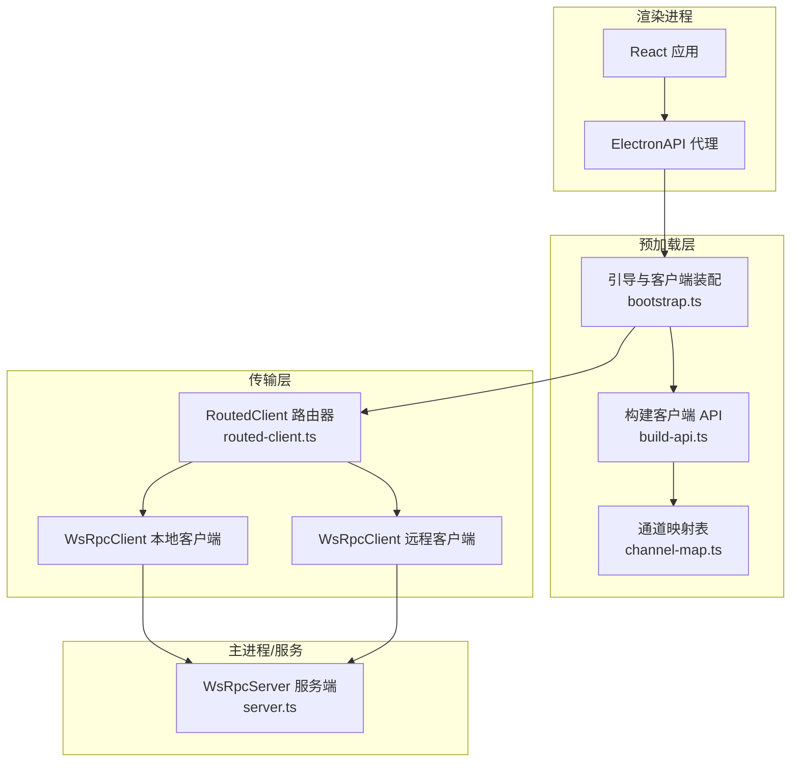
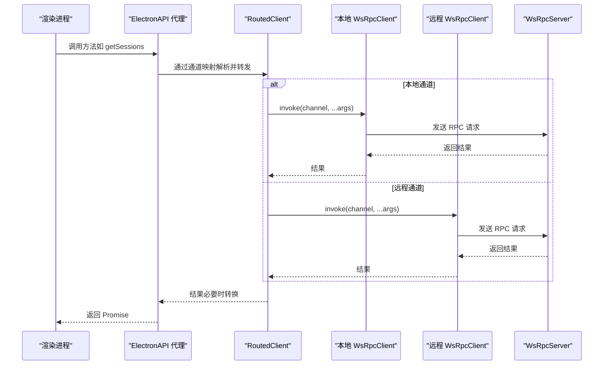
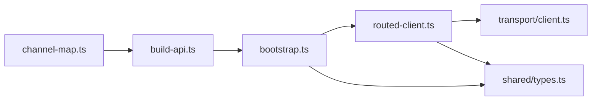

# RPC 通道管理

<cite>
**本文引用的文件**
- [apps/electron/src/transport/index.ts](file://apps/electron/src/transport/index.ts)
- [apps/electron/src/transport/channel-map.ts](file://apps/electron/src/transport/channel-map.ts)
- [apps/electron/src/transport/build-api.ts](file://apps/electron/src/transport/build-api.ts)
- [apps/electron/src/transport/client.ts](file://apps/electron/src/transport/client.ts)
- [apps/electron/src/transport/server.ts](file://apps/electron/src/transport/server.ts)
- [apps/electron/src/transport/routed-client.ts](file://apps/electron/src/transport/routed-client.ts)
- [apps/electron/src/preload/bootstrap.ts](file://apps/electron/src/preload/bootstrap.ts)
- [apps/electron/src/shared/types.ts](file://apps/electron/src/shared/types.ts)
</cite>

## 目录
1. [简介](#简介)
2. [项目结构](#项目结构)
3. [核心组件](#核心组件)
4. [架构总览](#架构总览)
5. [详细组件分析](#详细组件分析)
6. [依赖关系分析](#依赖关系分析)
7. [性能考量](#性能考量)
8. [故障排查指南](#故障排查指南)
9. [结论](#结论)
10. [附录](#附录)

## 简介
本文件系统性阐述主进程中的 RPC 通道管理，包括通道注册、路由机制、客户端标识与映射、参数校验、错误传播策略、客户端 ID 映射、资源清理与连接生命周期管理，并提供可直接定位到源码路径的示例，帮助高级开发者扩展 RPC 功能或实现自定义通道。

## 项目结构
RPC 通道管理位于 Electron 应用的传输层（transport），通过“通道映射 + 客户端代理 + 路由器”的方式，将渲染进程的 API 调用安全地分发到本地或远程服务器，同时保证在工作区切换时的透明重连与监听恢复。



图表来源
- [apps/electron/src/preload/bootstrap.ts:55-154](file://apps/electron/src/preload/bootstrap.ts#L55-L154)
- [apps/electron/src/transport/build-api.ts:25-65](file://apps/electron/src/transport/build-api.ts#L25-L65)
- [apps/electron/src/transport/channel-map.ts:19-420](file://apps/electron/src/transport/channel-map.ts#L19-L420)
- [apps/electron/src/transport/routed-client.ts:40-255](file://apps/electron/src/transport/routed-client.ts#L40-L255)
- [apps/electron/src/transport/server.ts:1-1](file://apps/electron/src/transport/server.ts#L1-L1)

章节来源
- [apps/electron/src/transport/index.ts:1-6](file://apps/electron/src/transport/index.ts#L1-L6)
- [apps/electron/src/transport/channel-map.ts:1-421](file://apps/electron/src/transport/channel-map.ts#L1-L421)
- [apps/electron/src/transport/build-api.ts:1-66](file://apps/electron/src/transport/build-api.ts#L1-L66)
- [apps/electron/src/transport/client.ts:1-18](file://apps/electron/src/transport/client.ts#L1-L18)
- [apps/electron/src/transport/server.ts:1-2](file://apps/electron/src/transport/server.ts#L1-L2)
- [apps/electron/src/transport/routed-client.ts:1-256](file://apps/electron/src/transport/routed-client.ts#L1-L256)
- [apps/electron/src/preload/bootstrap.ts:1-439](file://apps/electron/src/preload/bootstrap.ts#L1-L439)
- [apps/electron/src/shared/types.ts:1-800](file://apps/electron/src/shared/types.ts#L1-L800)

## 核心组件
- 通道映射表（ChannelMap）：集中声明所有 RPC 方法到通道名的映射，支持“监听型”和“调用型”，并允许对返回值进行转换。
- 客户端 API 构建器（buildClientApi）：根据通道映射生成类型安全的 ElectronAPI 代理，自动处理嵌套命名空间与监听回调。
- 路由客户端（RoutedClient）：在本地与远程工作区之间透明切换，维护 REMOTE_ELIGIBLE 监听器与能力处理器的重订阅，处理工作区切换后的客户端替换与连接状态转发。
- 预加载引导（bootstrap）：根据运行模式（本地/远程）创建 WsRpcClient 或 RoutedClient，注入能力处理器，暴露传输状态 API，并完成 ElectronAPI 的桥接。

章节来源
- [apps/electron/src/transport/channel-map.ts:19-420](file://apps/electron/src/transport/channel-map.ts#L19-L420)
- [apps/electron/src/transport/build-api.ts:25-65](file://apps/electron/src/transport/build-api.ts#L25-L65)
- [apps/electron/src/transport/routed-client.ts:40-255](file://apps/electron/src/transport/routed-client.ts#L40-L255)
- [apps/electron/src/preload/bootstrap.ts:55-154](file://apps/electron/src/preload/bootstrap.ts#L55-L154)

## 架构总览
RPC 通道管理采用“单源通道映射 + 双客户端路由 + 预加载桥接”的设计，确保：
- 渲染层以统一接口调用，无需关心通道细节；
- 本地/远程透明切换，监听与能力自动恢复；
- 工作区切换时的客户端替换与连接状态透传；
- 通道可用性检查与错误传播策略一致化。



图表来源
- [apps/electron/src/transport/routed-client.ts:95-123](file://apps/electron/src/transport/routed-client.ts#L95-L123)
- [apps/electron/src/transport/build-api.ts:33-42](file://apps/electron/src/transport/build-api.ts#L33-L42)
- [apps/electron/src/transport/channel-map.ts:19-420](file://apps/electron/src/transport/channel-map.ts#L19-L420)
- [apps/electron/src/transport/server.ts:1-1](file://apps/electron/src/transport/server.ts#L1-L1)

## 详细组件分析

### 通道映射与命名规范
- 通道映射表集中定义了所有 RPC 方法与其对应的通道名，覆盖会话、工作区、窗口、文件、主题、系统、更新、设置、技能、标签、通知、浏览器窗格、LLM 连接、自动化、资源、消息网关等模块。
- 命名规范：
  - 使用统一枚举（RPC_CHANNELS）作为键，确保一致性；
  - 支持点号分隔的嵌套命名空间（如 browserPane.create），构建器会自动拆分为嵌套对象；
  - 监听型通道使用 listener 描述，调用型通道使用 invoke 描述，并可选 transform 对结果进行转换。
- 参数验证与错误传播：
  - 通道映射不负责参数校验；参数校验与错误传播在具体处理器中实现；
  - 错误通过 RPC 层统一包装并上抛至调用方。

章节来源
- [apps/electron/src/transport/channel-map.ts:19-420](file://apps/electron/src/transport/channel-map.ts#L19-L420)
- [apps/electron/src/transport/build-api.ts:15-19](file://apps/electron/src/transport/build-api.ts#L15-L19)

### 客户端 API 构建器
- 将通道映射转换为类型安全的 ElectronAPI 代理：
  - 监听型：注册 on(channel, callback)，返回取消函数；
  - 调用型：封装 invoke 并支持 transform；
  - 嵌套命名空间：将 "ns.method" 自动挂载到 ns.method；
  - 通道可用性检查：暴露 isChannelAvailable 供 GUI 判断。
- 该构建器是“单源通道映射”的运行时分发中心。

章节来源
- [apps/electron/src/transport/build-api.ts:25-65](file://apps/electron/src/transport/build-api.ts#L25-L65)

### 路由客户端（RoutedClient）
- 角色与职责：
  - 维护两个 WsRpcClient：localClient（始终指向嵌入式本地服务器）与 workspaceClient（当前工作区所属的服务器）；
  - 本地通道（LOCAL_ONLY）固定走 localClient；其余通道走 workspaceClient；
  - 在工作区切换时，透明替换 workspaceClient，并重订阅 REMOTE_ELIGIBLE 监听器与能力处理器；
  - 处理 SWITCH_WORKSPACE 响应，触发工作区切换流程。
- 客户端 ID 映射：
  - 当工作区为远程时，RPC 调用参数中的本地 workspaceId 会被翻译为远程服务器识别的 remoteId，确保处理器能正确解析；
  - 提供 setWorkspaceMapping/clearWorkspaceMapping 管理映射。
- 连接生命周期与状态：
  - 代理 workspaceClient 的连接状态变化，向所有订阅者广播；
  - 在新客户端连接成功后，触发一次“陈旧重连”事件，驱动应用刷新因无监听而错过的变更；
  - 提供 reconnectNow 主动重连；
  - 旧客户端在安全时机销毁，避免资源泄漏。
- 资源清理：
  - 取消监听器与能力处理器；
  - 在切换时销毁不再使用的旧客户端；
  - 连接状态监听器在注销时移除。

```mermaid
classDiagram
class RoutedClient {
-workspaceClient : WsRpcClient
-remoteListeners : Map~string, Set~
-capabilities : Map~string, handler~
-connectionStateListeners : Set
-clientFactory : WorkspaceClientFactory
-workspaceIdMapping : {localId, remoteId}
+invoke(channel, ...args) Promise~any~
+on(channel, callback) () => void
+handleCapability(channel, handler) void
+isChannelAvailable(channel) boolean
+getConnectionState() TransportConnectionState
+onConnectionStateChanged(cb) () => void
+reconnectNow() void
+setWorkspaceMapping(localId, remoteId) void
+clearWorkspaceMapping() void
-handleWorkspaceSwitch(result) void
-swapWorkspaceClient(newClient) void
-bindConnectionState() void
}
class WsRpcClient {
+invoke(channel, ...args) Promise~any~
+on(channel, callback) () => void
+handleCapability(channel, handler) void
+isChannelAvailable(channel) boolean
+getConnectionState() TransportConnectionState
+onConnectionStateChanged(cb) () => void
+reconnectNow() void
+destroy() void
}
RoutedClient --> WsRpcClient : "委托/路由"
```

图表来源
- [apps/electron/src/transport/routed-client.ts:40-255](file://apps/electron/src/transport/routed-client.ts#L40-L255)

章节来源
- [apps/electron/src/transport/routed-client.ts:40-255](file://apps/electron/src/transport/routed-client.ts#L40-L255)

### 预加载引导（bootstrap）
- 模式选择：
  - 本地模式：创建 localClient 与 routedClient，按需创建 initialWorkspaceClient（本地或远程）；
  - 远程模式（Thin-client）：直接创建单一 WsRpcClient 连接到远程服务器；
  - 环境变量 CRAFT_SERVER_URL 强制启用远程模式，且对非本地的 ws:// 进行安全限制。
- 能力处理器注册：
  - 注册客户端侧可被服务器调用的能力（如打开外部链接、打开路径、显示文件夹、确认对话框、打开文件对话框）。
- 传输状态日志：
  - 订阅连接状态变化，将远程连接状态输出到主进程日志，便于诊断。
- ElectronAPI 暴露：
  - 通过 buildClientApi 生成 API；
  - 暴露 getTransportConnectionState/onTransportConnectionStateChanged/reconnectTransport；
  - 暴露 performOAuth、startClaudeOAuth、startChatGptOAuth 等复杂流程的客户端实现。

章节来源
- [apps/electron/src/preload/bootstrap.ts:55-154](file://apps/electron/src/preload/bootstrap.ts#L55-L154)
- [apps/electron/src/preload/bootstrap.ts:160-177](file://apps/electron/src/preload/bootstrap.ts#L160-L177)
- [apps/electron/src/preload/bootstrap.ts:208-244](file://apps/electron/src/preload/bootstrap.ts#L208-L244)
- [apps/electron/src/preload/bootstrap.ts:258-402](file://apps/electron/src/preload/bootstrap.ts#L258-L402)

### 类型与协议
- ElectronAPI 接口定义了所有 RPC 方法签名，涵盖会话、工作区、窗口、文件、主题、系统、更新、设置、技能、标签、通知、浏览器窗格、LLM 连接、自动化、资源、消息网关等；
- 传输状态类型（TransportConnectionState/Status/Error/CloseInfo）统一错误传播与状态展示；
- 协议层导出 RPC_CHANNELS 与 isLocalOnly 等工具，用于通道分类与路由决策。

章节来源
- [apps/electron/src/shared/types.ts:170-704](file://apps/electron/src/shared/types.ts#L170-L704)
- [apps/electron/src/shared/types.ts:130-169](file://apps/electron/src/shared/types.ts#L130-L169)

## 依赖关系分析
- 通道映射依赖 RPC_CHANNELS 与 ChannelMapEntry 类型；
- 客户端 API 构建器依赖 RpcClient 与 ChannelMap；
- RoutedClient 依赖 WsRpcClient、RemoteServerConfig、isLocalOnly；
- 预加载引导依赖 RoutedClient/WsRpcClient、buildClientApi、CHANNEL_MAP、LOCAL_CLIENT_CAPABILITIES；
- ElectronAPI 类型来自 shared/types，贯穿渲染层与传输层。



图表来源
- [apps/electron/src/transport/channel-map.ts:1-421](file://apps/electron/src/transport/channel-map.ts#L1-L421)
- [apps/electron/src/transport/build-api.ts:1-66](file://apps/electron/src/transport/build-api.ts#L1-L66)
- [apps/electron/src/preload/bootstrap.ts:1-439](file://apps/electron/src/preload/bootstrap.ts#L1-L439)
- [apps/electron/src/transport/routed-client.ts:1-256](file://apps/electron/src/transport/routed-client.ts#L1-L256)
- [apps/electron/src/transport/client.ts:1-18](file://apps/electron/src/transport/client.ts#L1-L18)
- [apps/electron/src/shared/types.ts:1-800](file://apps/electron/src/shared/types.ts#L1-L800)

章节来源
- [apps/electron/src/transport/index.ts:1-6](file://apps/electron/src/transport/index.ts#L1-L6)
- [apps/electron/src/transport/channel-map.ts:1-421](file://apps/electron/src/transport/channel-map.ts#L1-L421)
- [apps/electron/src/transport/build-api.ts:1-66](file://apps/electron/src/transport/build-api.ts#L1-L66)
- [apps/electron/src/transport/client.ts:1-18](file://apps/electron/src/transport/client.ts#L1-L18)
- [apps/electron/src/transport/server.ts:1-2](file://apps/electron/src/transport/server.ts#L1-L2)
- [apps/electron/src/transport/routed-client.ts:1-256](file://apps/electron/src/transport/routed-client.ts#L1-L256)
- [apps/electron/src/preload/bootstrap.ts:1-439](file://apps/electron/src/preload/bootstrap.ts#L1-L439)
- [apps/electron/src/shared/types.ts:1-800](file://apps/electron/src/shared/types.ts#L1-L800)

## 性能考量
- 本地通道直连本地服务器，延迟极低；远程通道通过网络，建议在 UI 层做必要的节流与缓存；
- RoutedClient 在工作区切换时采用“先建立新连接再断开旧连接”的策略，减少停顿；
- 连接状态监听与日志输出仅在远程模式下生效，避免本地模式的额外开销；
- 通道可用性检查 isChannelAvailable 可用于 UI 快速降级，避免无效请求。

## 故障排查指南
- 连接失败与错误分类：
  - TransportConnectionErrorKind 包含 auth/protocol/timeout/network/server/unknown 等，可用于 UI 提示与日志分级；
  - lastError/lastClose 提供详细原因与关闭码，配合 onTransportConnectionStateChanged 观察状态变化。
- 远程连接日志：
  - 预加载层在远程模式下将连接状态同步到主进程日志，便于定位网络与证书问题；
  - 非本地 ws:// 会被拒绝，防止明文传输令牌。
- 监听与能力处理异常：
  - RoutedClient 在转发连接状态时对监听回调异常进行保护，避免影响整体传输；
  - 客户端能力处理器（如打开外部链接）异常应独立捕获并返回错误信息。

章节来源
- [apps/electron/src/shared/types.ts:140-169](file://apps/electron/src/shared/types.ts#L140-L169)
- [apps/electron/src/preload/bootstrap.ts:208-244](file://apps/electron/src/preload/bootstrap.ts#L208-L244)
- [apps/electron/src/preload/bootstrap.ts:71-77](file://apps/electron/src/preload/bootstrap.ts#L71-L77)
- [apps/electron/src/transport/routed-client.ts:246-254](file://apps/electron/src/transport/routed-client.ts#L246-L254)

## 结论
本 RPC 通道管理体系以“通道映射 + 客户端代理 + 路由器”为核心，实现了：
- 统一的通道命名与类型安全；
- 本地/远程透明路由与工作区切换；
- 监听与能力的自动恢复；
- 连接状态与错误传播的一致化；
- 资源清理与生命周期管理的规范化。

对于扩展 RPC 功能或实现自定义通道，建议遵循现有通道映射与路由策略，确保新通道具备明确的分类（本地/远程）、清晰的命名、完善的错误处理与必要的参数校验。

## 附录

### 通道注册与使用示例（路径指引）
- 新增通道映射条目：在通道映射表中添加新的键值对，参考现有条目格式与命名规范。
  - 示例路径：[apps/electron/src/transport/channel-map.ts:19-420](file://apps/electron/src/transport/channel-map.ts#L19-L420)
- 构建客户端 API 代理：通过 buildClientApi 注入通道映射与可用性检查函数。
  - 示例路径：[apps/electron/src/transport/build-api.ts:25-65](file://apps/electron/src/transport/build-api.ts#L25-L65)
- 在预加载中装配客户端：根据运行模式创建 WsRpcClient 或 RoutedClient，并注册能力处理器。
  - 示例路径：[apps/electron/src/preload/bootstrap.ts:55-154](file://apps/electron/src/preload/bootstrap.ts#L55-L154)
  - 示例路径：[apps/electron/src/preload/bootstrap.ts:160-177](file://apps/electron/src/preload/bootstrap.ts#L160-L177)

### 客户端断开与重连处理（路径指引）
- 订阅连接状态变化并记录日志：用于诊断远程连接问题。
  - 示例路径：[apps/electron/src/preload/bootstrap.ts:208-244](file://apps/electron/src/preload/bootstrap.ts#L208-L244)
- 主动重连：调用 reconnectNow 触发立即重连。
  - 示例路径：[apps/electron/src/transport/routed-client.ts:176-178](file://apps/electron/src/transport/routed-client.ts#L176-L178)
- 连接状态代理：将 workspaceClient 的状态广播给所有订阅者。
  - 示例路径：[apps/electron/src/transport/routed-client.ts:246-254](file://apps/electron/src/transport/routed-client.ts#L246-L254)

### 通道间通信协调（路径指引）
- 本地通道与远程通道分流：根据 isLocalOnly 决定目标客户端。
  - 示例路径：[apps/electron/src/transport/routed-client.ts:95-98](file://apps/electron/src/transport/routed-client.ts#L95-L98)
- 监听器与能力处理器的重订阅：在工作区切换时保持服务连续性。
  - 示例路径：[apps/electron/src/transport/routed-client.ts:209-217](file://apps/electron/src/transport/routed-client.ts#L209-L217)
- 客户端 ID 映射：在远程工作区场景下将本地 workspaceId 翻译为远程 ID。
  - 示例路径：[apps/electron/src/transport/routed-client.ts:99-113](file://apps/electron/src/transport/routed-client.ts#L99-L113)