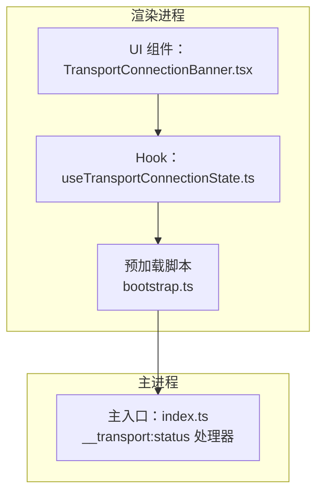
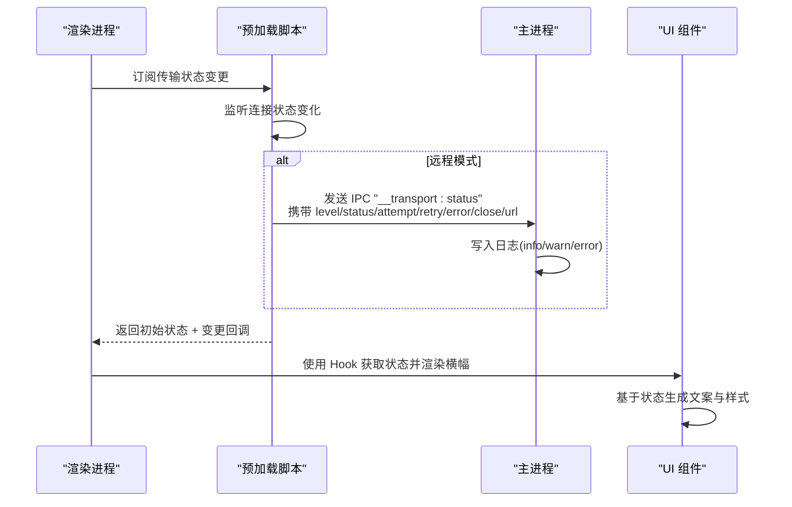
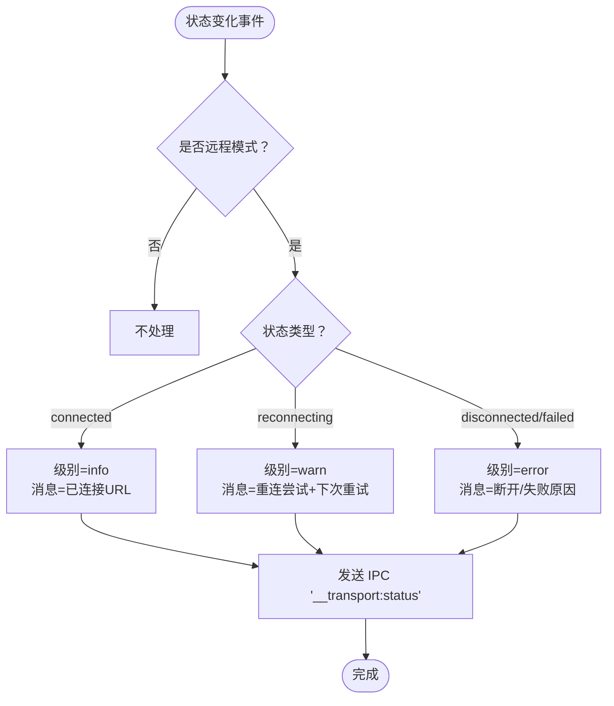
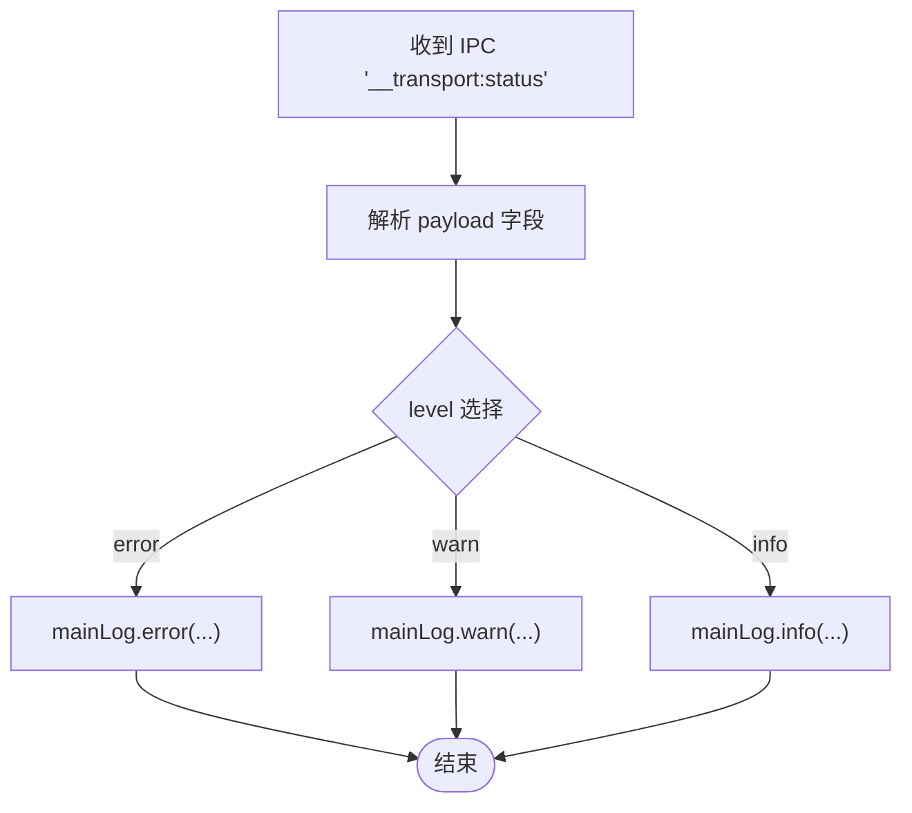
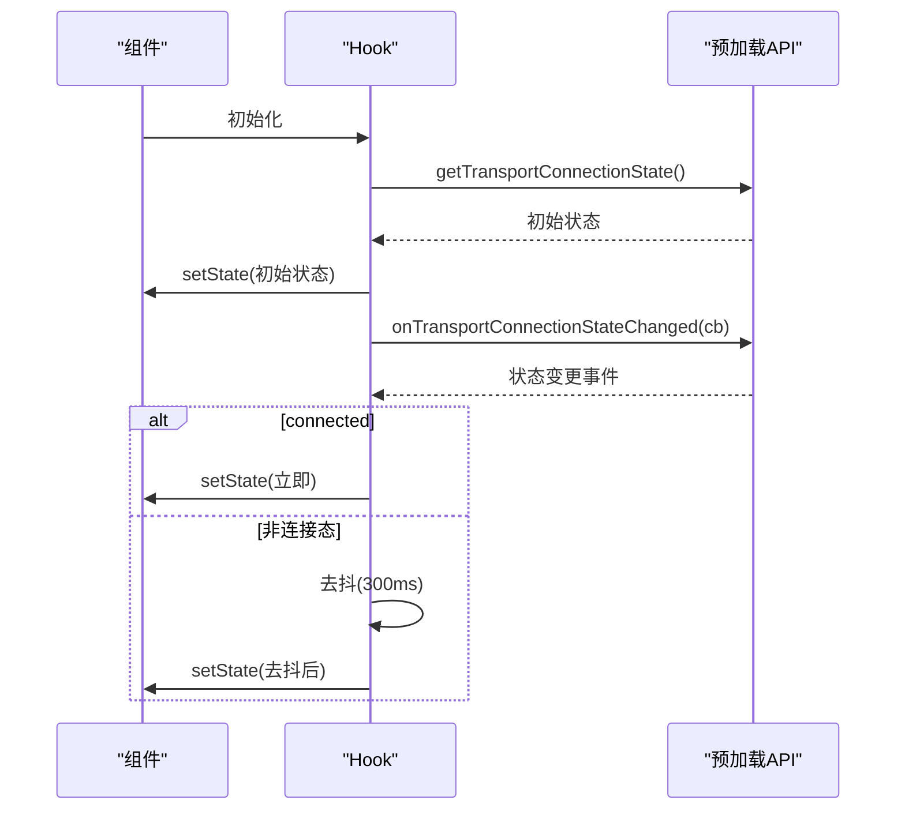
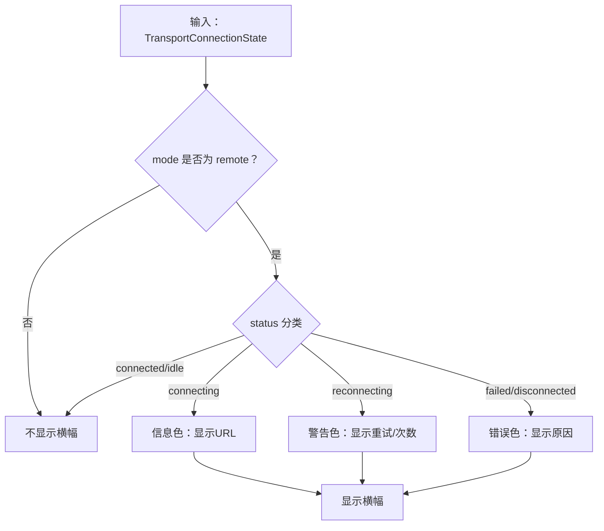
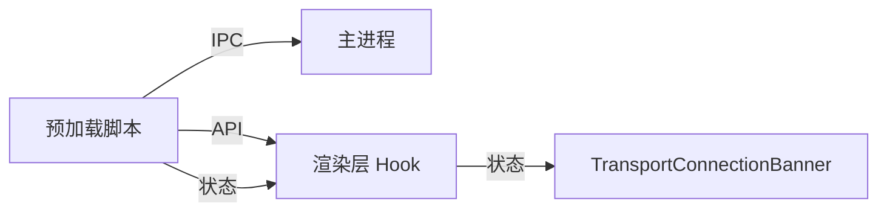

# 传输状态桥接

<cite>
**本文引用的文件**
- [apps/electron/src/main/index.ts](file://apps/electron/src/main/index.ts)
- [apps/electron/src/preload/bootstrap.ts](file://apps/electron/src/preload/bootstrap.ts)
- [apps/electron/src/renderer/hooks/useTransportConnectionState.ts](file://apps/electron/src/renderer/hooks/useTransportConnectionState.ts)
- [apps/electron/src/renderer/components/app-shell/TransportConnectionBanner.tsx](file://apps/electron/src/renderer/components/app-shell/TransportConnectionBanner.tsx)
- [apps/electron/src/__tests__/transport.test.ts](file://apps/electron/src/__tests__/transport.test.ts)
- [packages/shared/src/protocol/types.ts](file://packages/shared/src/protocol/types.ts)
</cite>

## 目录
1. [简介](#简介)
2. [项目结构](#项目结构)
3. [核心组件](#核心组件)
4. [架构总览](#架构总览)
5. [详细组件分析](#详细组件分析)
6. [依赖关系分析](#依赖关系分析)
7. [性能考量](#性能考量)
8. [故障排查指南](#故障排查指南)
9. [结论](#结论)
10. [附录](#附录)

## 简介
本文件系统性阐述“传输状态桥接”能力：如何在渲染进程通过预加载脚本监听远程 WebSocket 连接状态变化，并将状态级别（info/warn/error）、重试信息、错误详情等上报至主进程；主进程据此写入日志并驱动 UI 展示。文档覆盖日志策略、状态传播路径、性能影响与优化建议，并提供渲染侧监听与主侧处理的代码示例路径，帮助开发者快速实现网络连接状态监控与故障诊断。

## 项目结构
围绕传输状态桥接的关键模块分布如下：
- 预加载层：在渲染进程侧订阅传输状态变更，按模式区分是否上报，并格式化消息。
- 主进程层：接收预加载上报，按级别输出到日志系统。
- 渲染层 Hook：从预加载暴露的 API 获取初始状态并订阅变更，带去抖动以避免闪烁。
- UI 组件：根据状态生成横幅文案与样式，支持重试操作。
- 协议与测试：共享协议定义与传输层测试，验证握手、可靠投递、重连与错误分类。

图表来源
- [apps/electron/src/preload/bootstrap.ts:206-244](file://apps/electron/src/preload/bootstrap.ts#L206-L244)
- [apps/electron/src/main/index.ts:479-512](file://apps/electron/src/main/index.ts#L479-L512)
- [apps/electron/src/renderer/hooks/useTransportConnectionState.ts:12-66](file://apps/electron/src/renderer/hooks/useTransportConnectionState.ts#L12-L66)
- [apps/electron/src/renderer/components/app-shell/TransportConnectionBanner.tsx:82-113](file://apps/electron/src/renderer/components/app-shell/TransportConnectionBanner.tsx#L82-L113)

章节来源
- [apps/electron/src/preload/bootstrap.ts:206-244](file://apps/electron/src/preload/bootstrap.ts#L206-L244)
- [apps/electron/src/main/index.ts:479-512](file://apps/electron/src/main/index.ts#L479-L512)
- [apps/electron/src/renderer/hooks/useTransportConnectionState.ts:12-66](file://apps/electron/src/renderer/hooks/useTransportConnectionState.ts#L12-L66)
- [apps/electron/src/renderer/components/app-shell/TransportConnectionBanner.tsx:82-113](file://apps/electron/src/renderer/components/app-shell/TransportConnectionBanner.tsx#L82-L113)

## 核心组件
- 预加载状态上报器
  - 在连接状态变化时，仅对远程模式进行上报；根据状态选择 info/warn/error 级别，并携带重试间隔、错误对象、关闭码等上下文。
  - 示例路径：[apps/electron/src/preload/bootstrap.ts:206-244](file://apps/electron/src/preload/bootstrap.ts#L206-L244)
- 主进程日志接收器
  - 注册 IPC 处理器接收传输状态；按级别写入主日志，便于终端与日志文件可见。
  - 示例路径：[apps/electron/src/main/index.ts:479-512](file://apps/electron/src/main/index.ts#L479-L512)
- 渲染层状态 Hook
  - 从预加载 API 读取初始状态并订阅变更；对非连接态采用去抖动，避免快速切换导致的横幅闪烁。
  - 示例路径：[apps/electron/src/renderer/hooks/useTransportConnectionState.ts:12-66](file://apps/electron/src/renderer/hooks/useTransportConnectionState.ts#L12-L66)
- UI 横幅组件
  - 根据状态生成标题、描述、是否显示重试按钮与色调；依据 lastError.kind 或 lastClose.code 提供用户可理解的原因提示。
  - 示例路径：[apps/electron/src/renderer/components/app-shell/TransportConnectionBanner.tsx:18-80](file://apps/electron/src/renderer/components/app-shell/TransportConnectionBanner.tsx#L18-L80)

章节来源
- [apps/electron/src/preload/bootstrap.ts:206-244](file://apps/electron/src/preload/bootstrap.ts#L206-L244)
- [apps/electron/src/main/index.ts:479-512](file://apps/electron/src/main/index.ts#L479-L512)
- [apps/electron/src/renderer/hooks/useTransportConnectionState.ts:12-66](file://apps/electron/src/renderer/hooks/useTransportConnectionState.ts#L12-L66)
- [apps/electron/src/renderer/components/app-shell/TransportConnectionBanner.tsx:18-80](file://apps/electron/src/renderer/components/app-shell/TransportConnectionBanner.tsx#L18-L80)

## 架构总览
传输状态桥接的端到端流程如下：

图表来源
- [apps/electron/src/preload/bootstrap.ts:206-244](file://apps/electron/src/preload/bootstrap.ts#L206-L244)
- [apps/electron/src/main/index.ts:479-512](file://apps/electron/src/main/index.ts#L479-L512)
- [apps/electron/src/renderer/hooks/useTransportConnectionState.ts:12-66](file://apps/electron/src/renderer/hooks/useTransportConnectionState.ts#L12-L66)
- [apps/electron/src/renderer/components/app-shell/TransportConnectionBanner.tsx:18-80](file://apps/electron/src/renderer/components/app-shell/TransportConnectionBanner.tsx#L18-L80)

## 详细组件分析

### 预加载状态上报器
- 触发条件：当传输客户端连接状态变化且模式为远程时触发上报。
- 上报内容：
  - 级别：info/warn/error
  - 状态：connected/reconnecting/disconnected/failed 等
  - 重试：当前尝试次数与下次重试时间（毫秒）
  - 错误：lastError 对象（含 kind/message/data）
  - 关闭：lastClose 对象（含 code/reason）
  - 地址：当前连接 URL
- 日志行为：同时在控制台输出并在 IPC 中上报，确保日志可见性。

图表来源
- [apps/electron/src/preload/bootstrap.ts:206-244](file://apps/electron/src/preload/bootstrap.ts#L206-L244)

章节来源
- [apps/electron/src/preload/bootstrap.ts:206-244](file://apps/electron/src/preload/bootstrap.ts#L206-L244)

### 主进程日志接收器
- 注册处理器：监听 IPC "__transport:status"，解析 payload 并按级别写入主日志。
- 上下文保留：将状态、尝试次数、下次重试、错误、关闭信息、URL 一并记录，便于定位问题。
- 作用：使远程连接问题在终端与日志文件中可见，提升可观测性。

图表来源
- [apps/electron/src/main/index.ts:479-512](file://apps/electron/src/main/index.ts#L479-L512)

章节来源
- [apps/electron/src/main/index.ts:479-512](file://apps/electron/src/main/index.ts#L479-L512)

### 渲染层状态 Hook
- 初始状态：异步调用预加载暴露的 API 获取初始连接状态。
- 订阅变更：注册连接状态变更回调，使用去抖动策略处理非连接态的快速波动。
- 去抖参数：DEBOUNCE_MS=300ms，避免单次重连周期内的频繁闪烁。
- 连接态直出：connected 状态立即更新，不进行去抖。

图表来源
- [apps/electron/src/renderer/hooks/useTransportConnectionState.ts:12-66](file://apps/electron/src/renderer/hooks/useTransportConnectionState.ts#L12-L66)

章节来源
- [apps/electron/src/renderer/hooks/useTransportConnectionState.ts:12-66](file://apps/electron/src/renderer/hooks/useTransportConnectionState.ts#L12-L66)

### UI 横幅组件
- 条件显示：仅在远程模式且状态既非 connected 也非 idle 时显示。
- 文案与样式：
  - connecting：信息色，显示目标 URL。
  - reconnecting：警告色，显示重试次数、下次重试时间或“正在重试”。
  - failed/disconnected：错误色，显示认证/协议/超时/网络/WS 关闭等具体原因。
- 交互：显示“重试”按钮，调用传入的 onRetry 回调。

图表来源
- [apps/electron/src/renderer/components/app-shell/TransportConnectionBanner.tsx:6-80](file://apps/electron/src/renderer/components/app-shell/TransportConnectionBanner.tsx#L6-L80)

章节来源
- [apps/electron/src/renderer/components/app-shell/TransportConnectionBanner.tsx:6-80](file://apps/electron/src/renderer/components/app-shell/TransportConnectionBanner.tsx#L6-L80)

### 协议与测试要点（支撑能力）
- 协议字段：MessageEnvelope 与 WireError 定义了握手、请求/响应、事件、错误、序列号确认等字段，保障状态与错误的结构化传递。
- 测试覆盖：传输层测试涵盖握手、RPC 请求/响应、推送事件、可靠投递（缓冲区大小、TTL、stale 标记）、认证、连接状态与错误分类等，确保重连与状态传播稳定。

章节来源
- [packages/shared/src/protocol/types.ts:20-69](file://packages/shared/src/protocol/types.ts#L20-L69)
- [packages/shared/src/protocol/types.ts:115-127](file://packages/shared/src/protocol/types.ts#L115-L127)
- [apps/electron/src/__tests__/transport.test.ts:30-52](file://apps/electron/src/__tests__/transport.test.ts#L30-L52)
- [apps/electron/src/__tests__/transport.test.ts:601-662](file://apps/electron/src/__tests__/transport.test.ts#L601-L662)

## 依赖关系分析
- 预加载依赖传输客户端的连接状态 API，仅在远程模式下触发上报。
- 主进程依赖预加载的 IPC 通道，按级别写入日志。
- 渲染层 Hook 依赖预加载暴露的 API，用于读取初始状态与订阅变更。
- UI 组件依赖 Hook 返回的状态，生成横幅文案与样式。

图表来源
- [apps/electron/src/preload/bootstrap.ts:206-244](file://apps/electron/src/preload/bootstrap.ts#L206-L244)
- [apps/electron/src/main/index.ts:479-512](file://apps/electron/src/main/index.ts#L479-L512)
- [apps/electron/src/renderer/hooks/useTransportConnectionState.ts:12-66](file://apps/electron/src/renderer/hooks/useTransportConnectionState.ts#L12-L66)
- [apps/electron/src/renderer/components/app-shell/TransportConnectionBanner.tsx:82-113](file://apps/electron/src/renderer/components/app-shell/TransportConnectionBanner.tsx#L82-L113)

章节来源
- [apps/electron/src/preload/bootstrap.ts:206-244](file://apps/electron/src/preload/bootstrap.ts#L206-L244)
- [apps/electron/src/main/index.ts:479-512](file://apps/electron/src/main/index.ts#L479-L512)
- [apps/electron/src/renderer/hooks/useTransportConnectionState.ts:12-66](file://apps/electron/src/renderer/hooks/useTransportConnectionState.ts#L12-L66)
- [apps/electron/src/renderer/components/app-shell/TransportConnectionBanner.tsx:82-113](file://apps/electron/src/renderer/components/app-shell/TransportConnectionBanner.tsx#L82-L113)

## 性能考量
- 去抖动策略：非连接态采用 300ms 去抖，降低 UI 抖动与渲染压力，同时保留连接态的即时反馈。
- 日志级别：仅在远程模式上报，避免本地回环连接产生噪声。
- 缓冲与重放：可靠投递依赖环形缓冲区与 TTL，结合序列号确认，减少重复事件与内存占用。
- 重连退避：测试覆盖自动重连场景，确保在高并发或瞬时失败时保持稳定性。

章节来源
- [apps/electron/src/renderer/hooks/useTransportConnectionState.ts:10](file://apps/electron/src/renderer/hooks/useTransportConnectionState.ts#L10)
- [apps/electron/src/preload/bootstrap.ts:206-244](file://apps/electron/src/preload/bootstrap.ts#L206-L244)
- [packages/shared/src/protocol/types.ts:115-127](file://packages/shared/src/protocol/types.ts#L115-L127)
- [apps/electron/src/__tests__/transport.test.ts:365-532](file://apps/electron/src/__tests__/transport.test.ts#L365-L532)

## 故障排查指南
- 如何在渲染侧监听传输状态变化
  - 使用 Hook 读取初始状态并订阅变更，注意仅在远程模式显示横幅。
  - 示例路径：[apps/electron/src/renderer/hooks/useTransportConnectionState.ts:12-66](file://apps/electron/src/renderer/hooks/useTransportConnectionState.ts#L12-L66)
- 如何在主进程处理状态更新
  - 主进程已内置处理器，按 info/warn/error 写入日志；如需扩展，可在处理器内增加业务逻辑。
  - 示例路径：[apps/electron/src/main/index.ts:479-512](file://apps/electron/src/main/index.ts#L479-L512)
- 常见问题定位
  - 认证失败：lastError.kind 为 auth，检查令牌有效性与服务器校验逻辑。
  - 协议不匹配：lastError.kind 为 protocol，检查协议版本与握手字段。
  - 超时/网络异常：lastError.kind 为 timeout/network，检查网络连通性与代理设置。
  - WS 关闭：lastClose.code/reason 提供具体关闭原因，结合 URL 定位服务端行为。
- 重连机制监控
  - 通过状态中的 attempt 与 nextRetryInMs 判断当前重连阶段；若出现 stale 标记，需全量刷新状态。
  - 示例路径：[apps/electron/src/__tests__/transport.test.ts:455-489](file://apps/electron/src/__tests__/transport.test.ts#L455-L489)

章节来源
- [apps/electron/src/renderer/hooks/useTransportConnectionState.ts:12-66](file://apps/electron/src/renderer/hooks/useTransportConnectionState.ts#L12-L66)
- [apps/electron/src/main/index.ts:479-512](file://apps/electron/src/main/index.ts#L479-L512)
- [apps/electron/src/renderer/components/app-shell/TransportConnectionBanner.tsx:64-80](file://apps/electron/src/renderer/components/app-shell/TransportConnectionBanner.tsx#L64-L80)
- [apps/electron/src/__tests__/transport.test.ts:455-489](file://apps/electron/src/__tests__/transport.test.ts#L455-L489)

## 结论
传输状态桥接通过预加载脚本、主进程日志与渲染层 UI 的协同，实现了远程 WebSocket 连接状态的可观测与用户可见化。其设计兼顾性能（去抖动、远程模式限定）与可靠性（可靠投递、错误分类），并提供了清晰的故障排查路径。开发者可基于本文提供的示例路径快速集成与扩展。

## 附录
- 代码示例路径（不含具体代码内容）
  - 渲染侧监听与去抖动：[apps/electron/src/renderer/hooks/useTransportConnectionState.ts:12-66](file://apps/electron/src/renderer/hooks/useTransportConnectionState.ts#L12-L66)
  - 预加载上报逻辑（远程模式、级别与上下文）：[apps/electron/src/preload/bootstrap.ts:206-244](file://apps/electron/src/preload/bootstrap.ts#L206-L244)
  - 主进程日志接收与写入：[apps/electron/src/main/index.ts:479-512](file://apps/electron/src/main/index.ts#L479-L512)
  - UI 横幅文案与样式映射：[apps/electron/src/renderer/components/app-shell/TransportConnectionBanner.tsx:18-80](file://apps/electron/src/renderer/components/app-shell/TransportConnectionBanner.tsx#L18-L80)
  - 协议与可靠投递常量：[packages/shared/src/protocol/types.ts:115-127](file://packages/shared/src/protocol/types.ts#L115-L127)
  - 传输层测试（握手、RPC、推送、可靠投递、认证、连接状态）：[apps/electron/src/__tests__/transport.test.ts:99-740](file://apps/electron/src/__tests__/transport.test.ts#L99-L740)