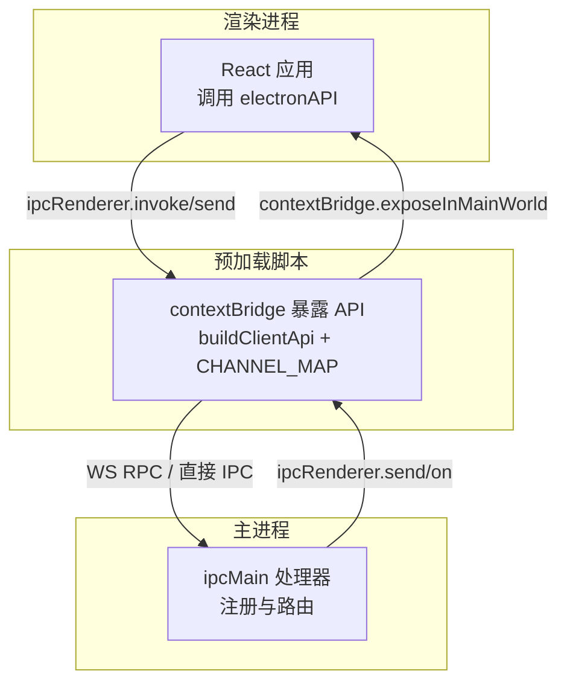
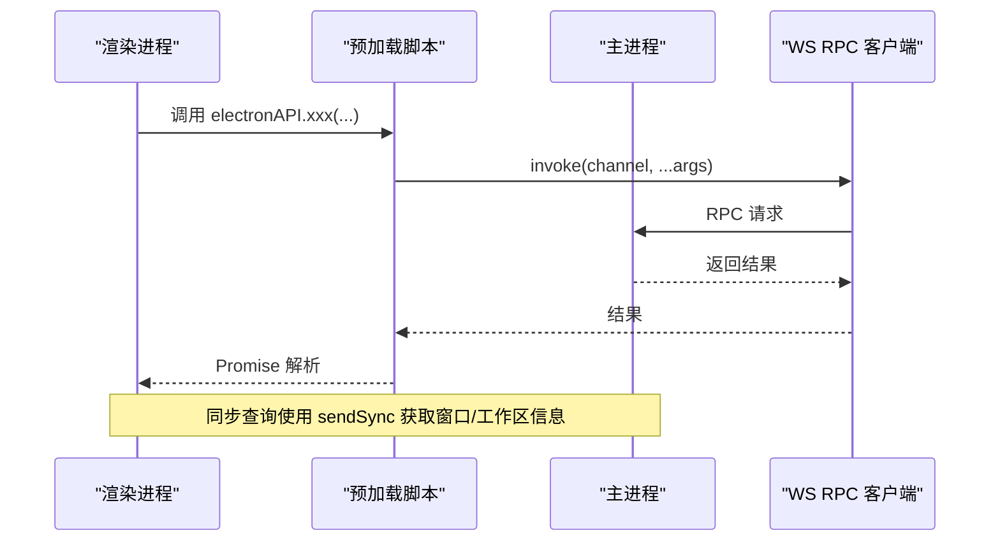
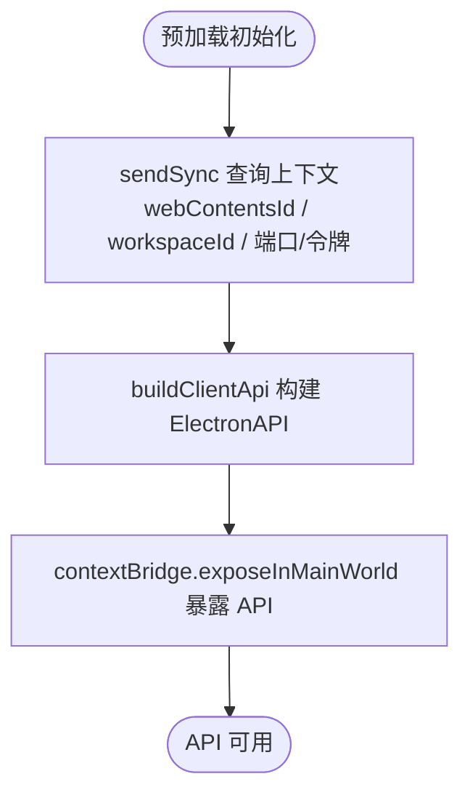
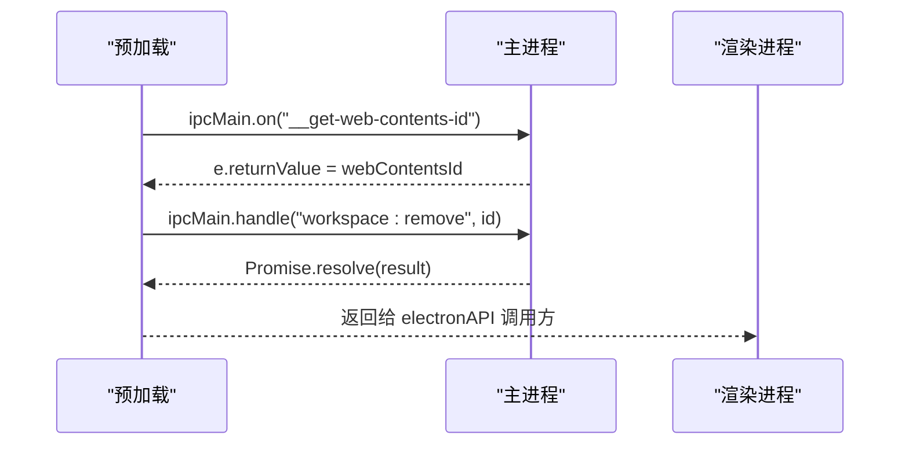
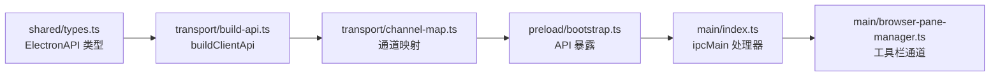

# 基础 IPC 通信模式

<cite>
**本文引用的文件**
- [apps/electron/src/preload/bootstrap.ts](file://apps/electron/src/preload/bootstrap.ts)
- [apps/electron/src/preload/browser-toolbar.ts](file://apps/electron/src/preload/browser-toolbar.ts)
- [apps/electron/src/main/index.ts](file://apps/electron/src/main/index.ts)
- [apps/electron/src/main/browser-pane-manager.ts](file://apps/electron/src/main/browser-pane-manager.ts)
- [apps/electron/src/shared/types.ts](file://apps/electron/src/shared/types.ts)
- [apps/electron/src/shared/__tests__/ipc-channels.test.ts](file://apps/electron/src/shared/__tests__/ipc-channels.test.ts)
- [apps/electron/src/transport/build-api.ts](file://apps/electron/src/transport/build-api.ts)
- [apps/electron/src/transport/channel-map.ts](file://apps/electron/src/transport/channel-map.ts)
- [apps/electron/src/transport/routed-client.ts](file://apps/electron/src/transport/routed-client.ts)
- [apps/electron/src/transport/index.ts](file://apps/electron/src/transport/index.ts)
</cite>

## 目录
1. [简介](#简介)
2. [项目结构](#项目结构)
3. [核心组件](#核心组件)
4. [架构总览](#架构总览)
5. [详细组件分析](#详细组件分析)
6. [依赖关系分析](#依赖关系分析)
7. [性能考量](#性能考量)
8. [故障排查指南](#故障排查指南)
9. [结论](#结论)
10. [附录](#附录)

## 简介
本文件面向需要理解 Electron IPC 基础概念的开发者，系统性讲解应用中的 IPC 通信模式与实现方式。内容覆盖：
- ipcMain 与 ipcRenderer 的基本使用方法
- 消息传递模式：同步调用（sendSync）与异步调用（invoke/send）
- 数据序列化机制与参数传递规则
- 通道命名规范与返回值处理策略
- 在预加载脚本中安全地暴露 API
- 在渲染进程中正确调用这些 API

## 项目结构
本项目的 IPC 体系由“主进程处理器 + 预加载桥接层 + 渲染进程 API”三层组成：
- 主进程通过 ipcMain 注册处理器，承载业务逻辑与系统能力
- 预加载脚本通过 contextBridge 将受控 API 暴露给渲染进程
- 渲染进程通过 ipcRenderer 或封装后的 ElectronAPI 调用主进程能力

图示来源
- [apps/electron/src/preload/bootstrap.ts:183-438](file://apps/electron/src/preload/bootstrap.ts#L183-L438)
- [apps/electron/src/main/index.ts:471-529](file://apps/electron/src/main/index.ts#L471-L529)

章节来源
- [apps/electron/src/preload/bootstrap.ts:1-439](file://apps/electron/src/preload/bootstrap.ts#L1-L439)
- [apps/electron/src/main/index.ts:1-800](file://apps/electron/src/main/index.ts#L1-L800)

## 核心组件
- 预加载 API 构建器：将 CHANNEL_MAP 映射为可调用的 ElectronAPI，统一处理 invoke、监听器与嵌套命名空间
- 通道映射表：定义 ElectronAPI 方法名到 RPC 通道的单源映射
- 主进程处理器：集中注册 ipcMain.handle/on，提供窗口信息、对话框、工作区切换等能力
- 运输层客户端：封装 WS RPC 客户端与路由逻辑，支持本地/远程透明切换

章节来源
- [apps/electron/src/transport/build-api.ts:25-65](file://apps/electron/src/transport/build-api.ts#L25-L65)
- [apps/electron/src/transport/channel-map.ts:19-420](file://apps/electron/src/transport/channel-map.ts#L19-L420)
- [apps/electron/src/main/index.ts:471-529](file://apps/electron/src/main/index.ts#L471-L529)
- [apps/electron/src/transport/routed-client.ts:40-200](file://apps/electron/src/transport/routed-client.ts#L40-L200)

## 架构总览
下图展示了从渲染进程发起调用到主进程响应的完整链路，包括同步查询与异步调用两种路径。

图示来源
- [apps/electron/src/preload/bootstrap.ts:55-100](file://apps/electron/src/preload/bootstrap.ts#L55-L100)
- [apps/electron/src/main/index.ts:471-477](file://apps/electron/src/main/index.ts#L471-L477)

## 详细组件分析

### 预加载脚本中的 API 暴露与调用
- 使用 contextBridge.exposeInMainWorld 将构建好的 ElectronAPI 暴露至全局命名空间
- 通过 buildClientApi + CHANNEL_MAP 将方法名映射到具体 RPC 通道
- 对于需要主进程能力的场景，预加载脚本内部通过 ipcRenderer.invoke 调用主进程专用通道
- 提供传输连接状态监听与重连控制，便于 UI 层感知网络状况

图示来源
- [apps/electron/src/preload/bootstrap.ts:55-183](file://apps/electron/src/preload/bootstrap.ts#L55-L183)
- [apps/electron/src/transport/build-api.ts:25-65](file://apps/electron/src/transport/build-api.ts#L25-L65)

章节来源
- [apps/electron/src/preload/bootstrap.ts:1-439](file://apps/electron/src/preload/bootstrap.ts#L1-L439)
- [apps/electron/src/transport/build-api.ts:1-66](file://apps/electron/src/transport/build-api.ts#L1-L66)

### 主进程处理器注册与调用
- 通过 ipcMain.on 注册同步查询通道（如获取 webContentsId、当前工作区 ID、传输状态桥接）
- 通过 ipcMain.handle 注册异步调用通道（如对话框、工作区移除、跨服务器 RPC、会话迁移）
- 浏览器工具栏窗口使用独立通道集，通过 ipcMain.handle 实现导航、菜单几何等控制

图示来源
- [apps/electron/src/main/index.ts:471-529](file://apps/electron/src/main/index.ts#L471-L529)
- [apps/electron/src/main/index.ts:745-749](file://apps/electron/src/main/index.ts#L745-L749)

章节来源
- [apps/electron/src/main/index.ts:471-529](file://apps/electron/src/main/index.ts#L471-L529)
- [apps/electron/src/main/browser-pane-manager.ts:2233-2292](file://apps/electron/src/main/browser-pane-manager.ts#L2233-L2292)

### 通道命名规范与参数传递规则
- 通道采用分层命名：前缀（功能域）+ 冒号 + 动作，例如 sessions:xxx、messaging:xxx、window:xxx
- 参数传递遵循 RPC 通道约定，确保可序列化的数据结构；复杂对象需保持结构稳定
- 监听器通道以事件语义命名，避免携带业务状态
- 本地通道与远程通道区分：本地通道仅在本地服务生效，远程可路由通道可在本地或远程服务器间透明转发

章节来源
- [apps/electron/src/shared/__tests__/ipc-channels.test.ts:13-326](file://apps/electron/src/shared/__tests__/ipc-channels.test.ts#L13-L326)
- [apps/electron/src/transport/channel-map.ts:19-420](file://apps/electron/src/transport/channel-map.ts#L19-L420)

### 同步调用与异步调用对比
- 同步调用（sendSync）
  - 典型用途：快速获取窗口上下文信息（webContentsId、当前工作区 ID、本地 WS 端口/令牌）
  - 特点：阻塞当前线程，返回值直接写入 e.returnValue
  - 适用场景：启动阶段的轻量查询，不涉及 IO 或长耗时操作
- 异步调用（invoke）
  - 典型用途：执行业务逻辑（删除工作区、跨服务器 RPC、会话迁移）、触发系统对话框
  - 特点：返回 Promise，主线程异步处理，避免阻塞 UI
  - 适用场景：所有非即时查询类操作

章节来源
- [apps/electron/src/preload/bootstrap.ts:55-100](file://apps/electron/src/preload/bootstrap.ts#L55-L100)
- [apps/electron/src/main/index.ts:471-529](file://apps/electron/src/main/index.ts#L471-L529)

### 数据序列化与返回值处理
- 预加载脚本内部通过 ipcRenderer.invoke 与主进程交互，返回值经 Promise 解析后传递给渲染进程
- 对于需要主进程能力的场景（如对话框），预加载脚本再通过 ipcRenderer.invoke 调用主进程专用通道并返回结果
- 传输层客户端负责将 invoke 请求路由到本地或远程服务器，并在返回时进行必要的参数转换

章节来源
- [apps/electron/src/preload/browser-toolbar.ts:28-53](file://apps/electron/src/preload/browser-toolbar.ts#L28-L53)
- [apps/electron/src/transport/routed-client.ts:95-123](file://apps/electron/src/transport/routed-client.ts#L95-L123)

### 预加载脚本中的安全暴露实践
- 仅通过 contextBridge.exposeInMainWorld 暴露经过类型约束的 ElectronAPI
- 通道映射与可用性检查由 buildClientApi 统一管理，避免直接暴露底层 IPC 细节
- 对于需要主进程权限的操作（如对话框），通过预加载脚本封装后再暴露给渲染进程

章节来源
- [apps/electron/src/preload/bootstrap.ts:183-438](file://apps/electron/src/preload/bootstrap.ts#L183-L438)
- [apps/electron/src/transport/build-api.ts:25-65](file://apps/electron/src/transport/build-api.ts#L25-L65)

### 渲染进程调用示例（步骤说明）
- 在渲染进程中访问全局暴露的 electronAPI
- 调用对应方法（如获取会话列表、发送消息、打开文件对话框等）
- 处理 Promise 返回值或订阅事件回调
- 对于需要主进程能力的调用，预加载脚本会自动转发到主进程并返回结果

章节来源
- [apps/electron/src/shared/types.ts:216-704](file://apps/electron/src/shared/types.ts#L216-L704)
- [apps/electron/src/transport/channel-map.ts:19-420](file://apps/electron/src/transport/channel-map.ts#L19-L420)

## 依赖关系分析
- 预加载脚本依赖 transport 层提供的客户端与通道映射
- 主进程处理器依赖 WindowManager、BrowserPaneManager 等模块完成具体业务
- ElectronAPI 类型定义贯穿预加载与主进程，保证调用契约一致

图示来源
- [apps/electron/src/shared/types.ts:216-704](file://apps/electron/src/shared/types.ts#L216-L704)
- [apps/electron/src/transport/build-api.ts:25-65](file://apps/electron/src/transport/build-api.ts#L25-L65)
- [apps/electron/src/transport/channel-map.ts:19-420](file://apps/electron/src/transport/channel-map.ts#L19-L420)
- [apps/electron/src/preload/bootstrap.ts:183-438](file://apps/electron/src/preload/bootstrap.ts#L183-L438)
- [apps/electron/src/main/index.ts:471-529](file://apps/electron/src/main/index.ts#L471-L529)
- [apps/electron/src/main/browser-pane-manager.ts:2233-2292](file://apps/electron/src/main/browser-pane-manager.ts#L2233-L2292)

章节来源
- [apps/electron/src/transport/index.ts:1-6](file://apps/electron/src/transport/index.ts#L1-L6)

## 性能考量
- 避免在预加载阶段进行大量阻塞式操作，优先使用异步调用
- 对于频繁的事件监听，注意及时注销回调，防止内存泄漏
- 传输层客户端支持本地/远程透明切换，合理利用路由减少不必要的网络往返

## 故障排查指南
- 通道不可用：通过 electronAPI.isChannelAvailable 检查通道是否已注册
- 传输异常：预加载脚本会将远端连接状态上报主进程日志，关注错误级别与重试间隔
- 工具栏窗口无响应：确认实例 ID 与通道匹配，检查主进程工具栏处理器是否注册

章节来源
- [apps/electron/src/preload/bootstrap.ts:208-244](file://apps/electron/src/preload/bootstrap.ts#L208-L244)
- [apps/electron/src/main/browser-pane-manager.ts:2233-2292](file://apps/electron/src/main/browser-pane-manager.ts#L2233-L2292)

## 结论
本项目通过“预加载 API 构建器 + 通道映射 + 主进程处理器”的分层设计，实现了清晰、可维护且安全的 IPC 通信模式。开发者应遵循通道命名规范与参数传递规则，优先使用异步调用处理业务逻辑，并在预加载脚本中严格限制暴露面，确保渲染进程只能通过受控接口与主进程交互。

## 附录
- 通道清单与稳定性测试：通过自动生成的通道清单与断言，确保通道名称与数量稳定
- 工具栏窗口通道：独立的浏览器工具栏通道集合，用于窗口级导航与状态更新

章节来源
- [apps/electron/src/shared/__tests__/ipc-channels.test.ts:1-368](file://apps/electron/src/shared/__tests__/ipc-channels.test.ts#L1-L368)
- [apps/electron/src/preload/browser-toolbar.ts:11-23](file://apps/electron/src/preload/browser-toolbar.ts#L11-L23)