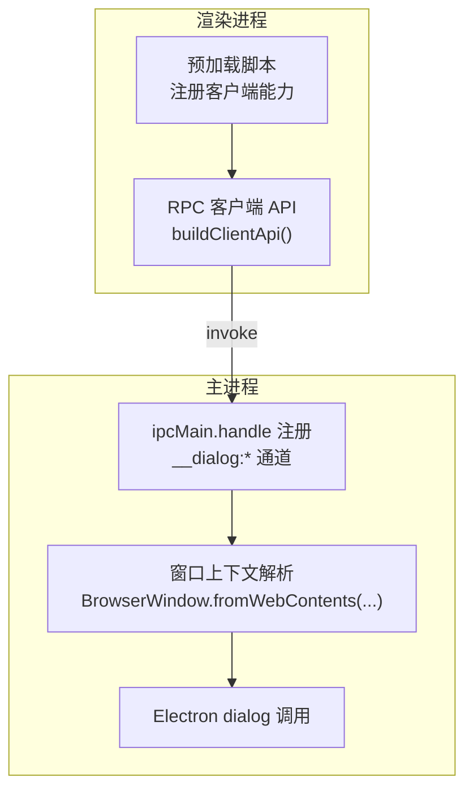
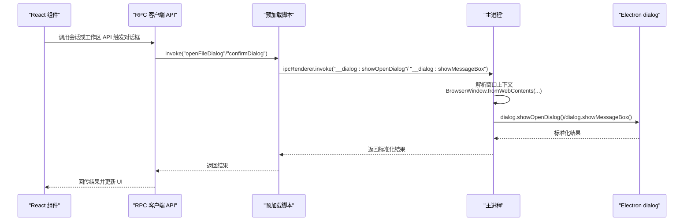
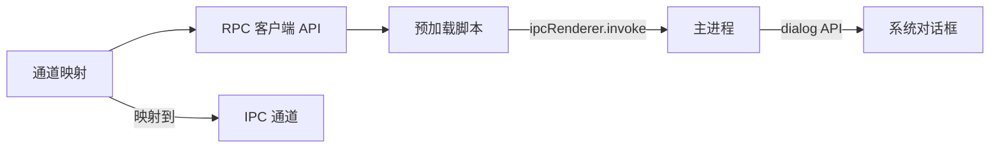

# 对话框桥接

<cite>
**本文引用的文件**
- [apps/electron/src/preload/bootstrap.ts](file://apps/electron/src/preload/bootstrap.ts)
- [apps/electron/src/main/index.ts](file://apps/electron/src/main/index.ts)
- [apps/electron/src/transport/channel-map.ts](file://apps/electron/src/transport/channel-map.ts)
- [packages/shared/src/protocol/routing.ts](file://packages/shared/src/protocol/routing.ts)
- [packages/ui/src/context/PlatformContext.tsx](file://packages/ui/src/context/PlatformContext.tsx)
</cite>

## 目录
1. [简介](#简介)
2. [项目结构](#项目结构)
3. [核心组件](#核心组件)
4. [架构总览](#架构总览)
5. [详细组件分析](#详细组件分析)
6. [依赖关系分析](#依赖关系分析)
7. [性能考量](#性能考量)
8. [故障排查指南](#故障排查指南)
9. [结论](#结论)
10. [附录](#附录)

## 简介
本技术文档聚焦于“对话框桥接”能力：在渲染进程中通过预加载脚本以统一的 RPC 接口调用主进程的原生对话框 API，具体覆盖以下能力：
- 通过统一的客户端能力接口触发“消息提示框”（showMessageBox）与“打开文件对话框”（showOpenDialog）
- 主进程根据当前 WebContents 获取对应 BrowserWindow，并调用 Electron 原生 dialog 模块
- 返回值标准化：消息框返回响应索引；文件对话框返回取消状态与文件路径数组
- 多窗口环境下自动选择合适的窗口上下文，确保对话框在正确的父级窗口上弹出
- 错误处理策略与用户取消行为的处理方式
- 在 React 组件中的使用范式与边界情况处理建议

该能力是跨平台桌面应用中常见的“渲染层请求、主进程执行”的 IPC 模式，结合了 RPC 通道映射与预加载脚本的桥接设计。

## 项目结构
对话框桥接涉及三个层面：
- 预加载脚本（渲染进程侧）：注册客户端能力处理器，转发到主进程 IPC 通道
- 主进程：注册 ipcMain.handle，解析窗口上下文并调用 Electron dialog
- 通道映射与路由：将方法名映射到具体的 IPC 通道，供 RPC 客户端调用

图表来源
- [apps/electron/src/preload/bootstrap.ts:171-177](file://apps/electron/src/preload/bootstrap.ts#L171-L177)
- [apps/electron/src/main/index.ts:514-529](file://apps/electron/src/main/index.ts#L514-L529)

章节来源
- [apps/electron/src/preload/bootstrap.ts:171-177](file://apps/electron/src/preload/bootstrap.ts#L171-L177)
- [apps/electron/src/main/index.ts:514-529](file://apps/electron/src/main/index.ts#L514-L529)
- [apps/electron/src/transport/channel-map.ts:76-78](file://apps/electron/src/transport/channel-map.ts#L76-L78)

## 核心组件
- 预加载脚本中的客户端能力处理器：将“确认对话框”和“打开文件对话框”的调用转发到主进程的 __dialog 通道
- 主进程的 ipcMain.handle 实现：从事件源解析窗口上下文，调用 Electron dialog.showMessageBox 或 dialog.showOpenDialog，并标准化返回值
- 通道映射：RPC 方法名与 IPC 通道的映射关系，确保调用链路一致

章节来源
- [apps/electron/src/preload/bootstrap.ts:171-177](file://apps/electron/src/preload/bootstrap.ts#L171-L177)
- [apps/electron/src/main/index.ts:514-529](file://apps/electron/src/main/index.ts#L514-L529)
- [apps/electron/src/transport/channel-map.ts:76-78](file://apps/electron/src/transport/channel-map.ts#L76-L78)

## 架构总览
对话框桥接的调用序列如下：

图表来源
- [apps/electron/src/preload/bootstrap.ts:171-177](file://apps/electron/src/preload/bootstrap.ts#L171-L177)
- [apps/electron/src/main/index.ts:514-529](file://apps/electron/src/main/index.ts#L514-L529)

## 详细组件分析

### 预加载脚本中的对话框能力处理器
- 客户端能力注册位置：预加载脚本中为“确认对话框”和“打开文件对话框”分别注册了客户端能力处理器，内部通过 ipcRenderer.invoke 转发到主进程通道
- 作用：将 RPC 层的统一调用转化为 IPC 调用，隐藏主进程 API 的差异性

章节来源
- [apps/electron/src/preload/bootstrap.ts:171-177](file://apps/electron/src/preload/bootstrap.ts#L171-L177)

### 主进程对话框实现与窗口上下文解析
- 通道注册：主进程通过 ipcMain.handle 注册 __dialog:showMessageBox 与 __dialog:showOpenDialog
- 窗口上下文解析：优先从事件源的 WebContents 获取对应 BrowserWindow；若无焦点窗口则取当前聚焦窗口；若仍不可用，则取第一个窗口
- 返回值标准化：
  - showMessageBox：返回响应索引
  - showOpenDialog：返回取消标志与文件路径数组

章节来源
- [apps/electron/src/main/index.ts:514-529](file://apps/electron/src/main/index.ts#L514-L529)

### 通道映射与 RPC 调用链
- 文件对话框与确认对话框在通道映射中分别对应 file.OPEN_DIALOG 与 dialog.OPEN_FOLDER（注意：此处为文件对话框通道，确认对话框在共享协议中另有定义）
- 通道映射确保 RPC 客户端以统一的方法名进行调用，底层自动映射到对应的 IPC 通道

章节来源
- [apps/electron/src/transport/channel-map.ts:76-78](file://apps/electron/src/transport/channel-map.ts#L76-L78)
- [packages/shared/src/protocol/routing.ts:42-50](file://packages/shared/src/protocol/routing.ts#L42-L50)

### showMessageBox 参数与返回值规范
- 参数：由预加载脚本直接透传 spec 至主进程，再由主进程传递给 Electron dialog.showMessageBox
- 返回值：标准化为响应索引，便于上层逻辑判断用户选择

章节来源
- [apps/electron/src/preload/bootstrap.ts:171](file://apps/electron/src/preload/bootstrap.ts#L171)
- [apps/electron/src/main/index.ts:516-521](file://apps/electron/src/main/index.ts#L516-L521)

### showOpenDialog 参数与返回值规范
- 参数：由预加载脚本直接透传 spec 至主进程，再由主进程传递给 Electron dialog.showOpenDialog
- 返回值：标准化为取消标志与文件路径数组，便于上层逻辑区分用户取消与成功选择

章节来源
- [apps/electron/src/preload/bootstrap.ts:175](file://apps/electron/src/preload/bootstrap.ts#L175)
- [apps/electron/src/main/index.ts:523-529](file://apps/electron/src/main/index.ts#L523-L529)

### 多窗口环境下的焦点管理
- 窗口上下文解析顺序：WebContents → 聚焦窗口 → 第一个窗口
- 该策略确保对话框始终依附于一个有效的 BrowserWindow，避免在多窗口场景下出现对话框“漂浮”或无父窗口的问题

章节来源
- [apps/electron/src/main/index.ts:517-519](file://apps/electron/src/main/index.ts#L517-L519)

### 错误处理策略
- 窗口解析失败兜底：当无法从事件源定位窗口时，依次尝试聚焦窗口与首个窗口
- 用户取消行为：文件对话框返回取消标志；消息框返回响应索引，上层可根据索引判断用户选择
- 未捕获异常：主进程调用 dialog API 的异常会在调用栈上传播，建议在上层组件中进行 try/catch 包裹并提供降级提示

章节来源
- [apps/electron/src/main/index.ts:517-519](file://apps/electron/src/main/index.ts#L517-L519)
- [apps/electron/src/main/index.ts:523-529](file://apps/electron/src/main/index.ts#L523-L529)

### 在 React 组件中的使用范式
- 使用平台抽象：通过平台上下文或 RPC 客户端暴露的方法触发对话框
- 边界情况处理建议：
  - 文件对话框：检查返回的取消标志与路径数组长度，为空表示用户取消或未选择任何文件
  - 消息对话框：根据返回的响应索引判断用户选择（如确定/取消/否等），并在 UI 中给出明确反馈
  - 多窗口：确保在正确的会话或窗口上下文中触发对话框，避免跨窗口交互导致的困惑

章节来源
- [packages/ui/src/context/PlatformContext.tsx:125-183](file://packages/ui/src/context/PlatformContext.tsx#L125-L183)

## 依赖关系分析
- 预加载脚本依赖 Electron 的 ipcRenderer 与 contextBridge，负责将 RPC 能力暴露到渲染进程
- 主进程依赖 Electron 的 ipcMain 与 dialog 模块，负责实际的系统对话框调用
- 通道映射将高层 RPC 方法名与底层 IPC 通道解耦，提升可维护性

图表来源
- [apps/electron/src/preload/bootstrap.ts:171-177](file://apps/electron/src/preload/bootstrap.ts#L171-L177)
- [apps/electron/src/main/index.ts:514-529](file://apps/electron/src/main/index.ts#L514-L529)
- [apps/electron/src/transport/channel-map.ts:76-78](file://apps/electron/src/transport/channel-map.ts#L76-L78)

章节来源
- [apps/electron/src/preload/bootstrap.ts:171-177](file://apps/electron/src/preload/bootstrap.ts#L171-L177)
- [apps/electron/src/main/index.ts:514-529](file://apps/electron/src/main/index.ts#L514-L529)
- [apps/electron/src/transport/channel-map.ts:76-78](file://apps/electron/src/transport/channel-map.ts#L76-L78)

## 性能考量
- IPC 调用开销：对话框调用属于轻量同步 IPC，通常毫秒级延迟，对整体性能影响可忽略
- 窗口解析成本：主进程解析窗口上下文为 O(n) 查找，n 为已打开窗口数量；在常规使用场景下可接受
- 建议：避免在高频循环中频繁触发对话框；必要时合并提示信息或使用批量确认

## 故障排查指南
- 对话框不弹出
  - 检查是否正确注册了客户端能力处理器与 ipcMain.handle
  - 确认窗口上下文解析是否成功（事件源是否存在）
- 用户取消未生效
  - 文件对话框需检查取消标志与路径数组
  - 消息对话框需根据响应索引判断用户选择
- 多窗口场景下对话框无父窗口
  - 确保事件源有效；若无焦点窗口，系统会回退到首个窗口，但可能不符合预期
- 异常处理
  - 在上层组件中包裹 try/catch 并提供降级提示，避免崩溃传播

章节来源
- [apps/electron/src/main/index.ts:514-529](file://apps/electron/src/main/index.ts#L514-L529)

## 结论
对话框桥接通过预加载脚本与主进程的协作，实现了渲染层统一调用、主进程安全执行的架构模式。其关键优势在于：
- 统一的 RPC 接口屏蔽了平台差异
- 自动化的窗口上下文解析保证了对话框在正确的父窗口上弹出
- 标准化的返回值简化了上层业务逻辑
- 易于扩展：新增对话框类型只需在预加载与主进程两端补充相应处理即可

## 附录
- 共享协议中的对话框相关通道定义参考：文件对话框与文件夹对话框通道
- 平台上下文与 React 组件集成的最佳实践：通过平台抽象或 RPC 客户端暴露的方法触发对话框，并在 UI 中明确处理取消与选择分支

章节来源
- [packages/shared/src/protocol/routing.ts:42-50](file://packages/shared/src/protocol/routing.ts#L42-L50)
- [packages/ui/src/context/PlatformContext.tsx:125-183](file://packages/ui/src/context/PlatformContext.tsx#L125-L183)