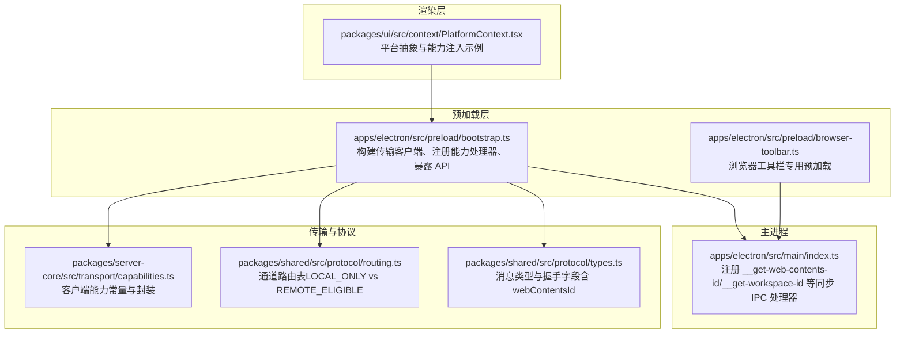
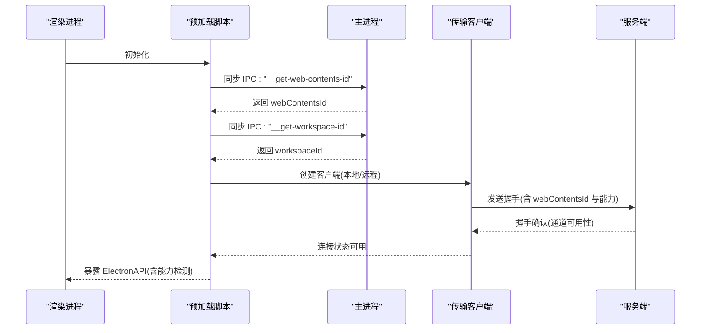
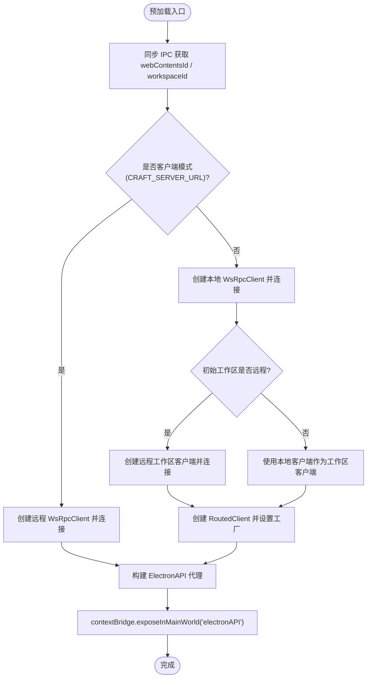
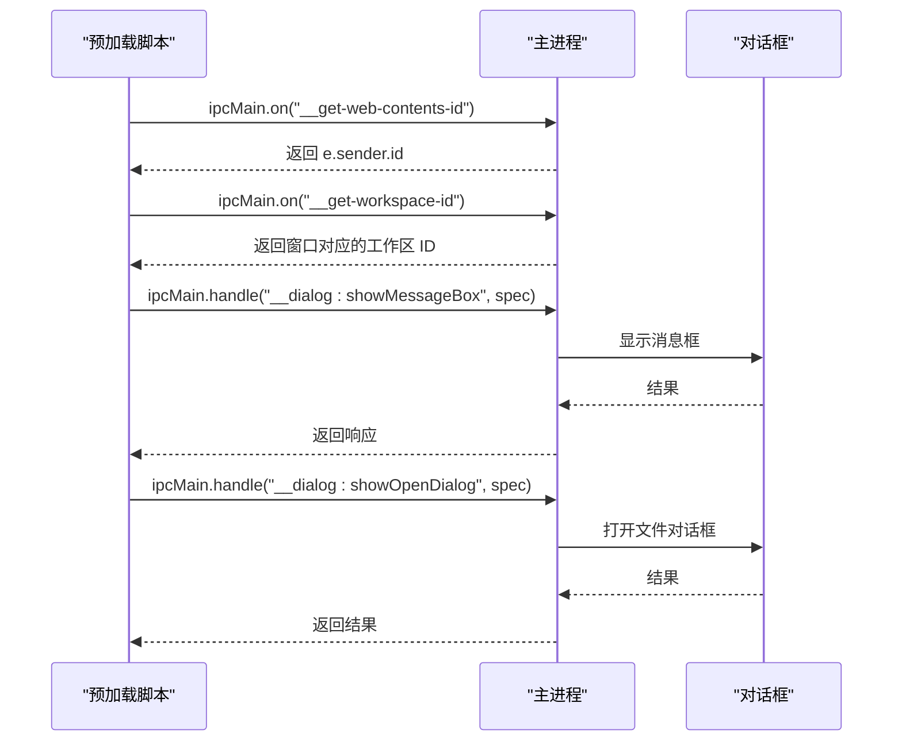
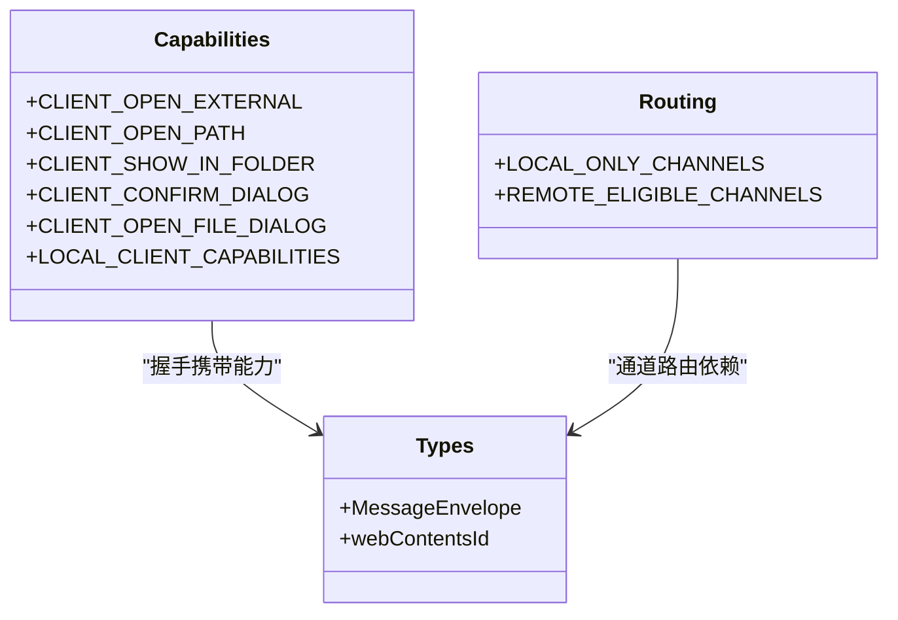
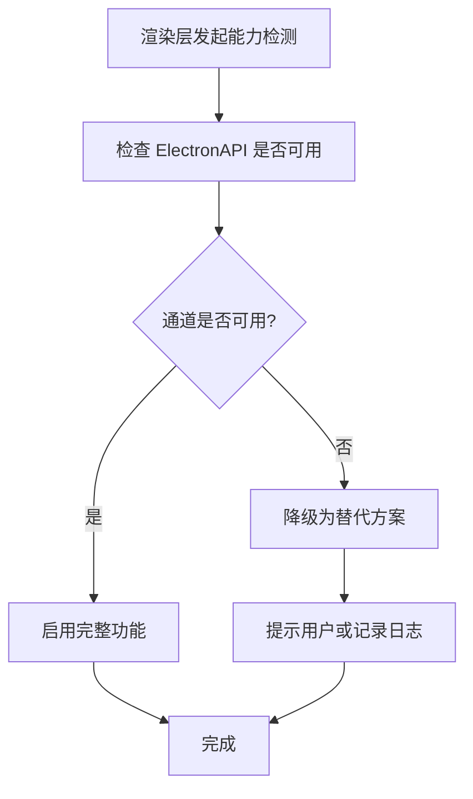
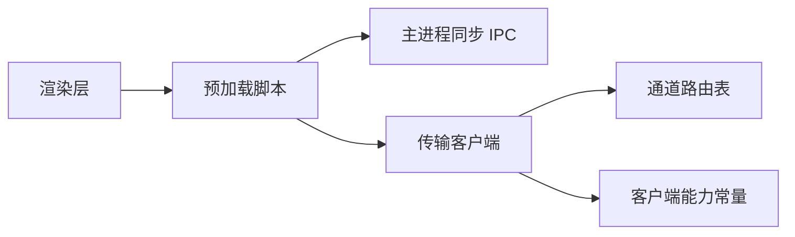

# 能力检测桥接

<cite>
**本文引用的文件**
- [apps/electron/src/preload/bootstrap.ts](file://apps/electron/src/preload/bootstrap.ts)
- [apps/electron/src/main/index.ts](file://apps/electron/src/main/index.ts)
- [packages/server-core/src/transport/capabilities.ts](file://packages/server-core/src/transport/capabilities.ts)
- [packages/shared/src/protocol/routing.ts](file://packages/shared/src/protocol/routing.ts)
- [packages/shared/src/protocol/types.ts](file://packages/shared/src/protocol/types.ts)
- [apps/electron/src/preload/browser-toolbar.ts](file://apps/electron/src/preload/browser-toolbar.ts)
- [packages/ui/src/context/PlatformContext.tsx](file://packages/ui/src/context/PlatformContext.tsx)
</cite>

## 目录
1. [简介](#简介)
2. [项目结构](#项目结构)
3. [核心组件](#核心组件)
4. [架构总览](#架构总览)
5. [详细组件分析](#详细组件分析)
6. [依赖关系分析](#依赖关系分析)
7. [性能考量](#性能考量)
8. [故障排查指南](#故障排查指南)
9. [结论](#结论)
10. [附录：能力检测与降级实践](#附录能力检测与降级实践)

## 简介
本文件围绕“能力检测桥接”主题，系统阐述 Electron 预加载脚本如何在渲染进程中暴露并检测 Electron 特定能力，重点覆盖以下内容：
- 如何通过同步 IPC 获取窗口本地信息（webContentsId、工作区 ID），并将其注入到传输层握手与路由中
- 能力检测的实现原理与安全边界
- 平台特定功能检测与 API 可用性验证
- 降级策略与跨平台兼容性
- 完整的使用示例路径，展示如何在渲染进程中进行能力检测并据此调整功能行为

## 项目结构
该能力检测桥接贯穿预加载层、主进程 IPC 桥接、传输层与协议路由表，形成“从窗口本地信息到能力可用性”的闭环。

**图表来源**
- [apps/electron/src/preload/bootstrap.ts:1-439](file://apps/electron/src/preload/bootstrap.ts#L1-L439)
- [apps/electron/src/main/index.ts:471-529](file://apps/electron/src/main/index.ts#L471-L529)
- [packages/server-core/src/transport/capabilities.ts:1-131](file://packages/server-core/src/transport/capabilities.ts#L1-L131)
- [packages/shared/src/protocol/routing.ts:1-216](file://packages/shared/src/protocol/routing.ts#L1-L216)
- [packages/shared/src/protocol/types.ts:1-44](file://packages/shared/src/protocol/types.ts#L1-L44)
- [apps/electron/src/preload/browser-toolbar.ts:1-54](file://apps/electron/src/preload/browser-toolbar.ts#L1-L54)
- [packages/ui/src/context/PlatformContext.tsx:1-160](file://packages/ui/src/context/PlatformContext.tsx#L1-L160)

**章节来源**
- [apps/electron/src/preload/bootstrap.ts:1-439](file://apps/electron/src/preload/bootstrap.ts#L1-L439)
- [apps/electron/src/main/index.ts:471-529](file://apps/electron/src/main/index.ts#L471-L529)
- [packages/server-core/src/transport/capabilities.ts:1-131](file://packages/server-core/src/transport/capabilities.ts#L1-L131)
- [packages/shared/src/protocol/routing.ts:1-216](file://packages/shared/src/protocol/routing.ts#L1-L216)
- [packages/shared/src/protocol/types.ts:1-44](file://packages/shared/src/protocol/types.ts#L1-L44)
- [apps/electron/src/preload/browser-toolbar.ts:1-54](file://apps/electron/src/preload/browser-toolbar.ts#L1-L54)
- [packages/ui/src/context/PlatformContext.tsx:1-160](file://packages/ui/src/context/PlatformContext.tsx#L1-L160)

## 核心组件
- 预加载桥接（能力暴露与传输初始化）
  - 在预加载阶段通过同步 IPC 获取窗口本地信息（webContentsId、工作区 ID），并据此建立本地或远程传输客户端
  - 注册能力处理器，允许服务端在握手时声明可调用的客户端动作
  - 构建统一的 ElectronAPI 代理，向渲染层暴露能力检测与传输状态接口
- 主进程 IPC 桥接（窗口本地信息提供者）
  - 提供同步 IPC 处理器以返回当前窗口的 webContentsId 与所属工作区 ID
  - 提供对话框等仅主进程可用能力的桥接
- 传输与协议（能力路由与通道分类）
  - 定义客户端能力常量与封装函数
  - 基于通道路由表区分 LOCAL_ONLY 与 REMOTE_ELIGIBLE，确保能力边界清晰
  - 握手消息携带 webContentsId，用于服务端识别调用来源窗口

**章节来源**
- [apps/electron/src/preload/bootstrap.ts:55-154](file://apps/electron/src/preload/bootstrap.ts#L55-L154)
- [apps/electron/src/main/index.ts:471-529](file://apps/electron/src/main/index.ts#L471-L529)
- [packages/server-core/src/transport/capabilities.ts:24-31](file://packages/server-core/src/transport/capabilities.ts#L24-L31)
- [packages/shared/src/protocol/routing.ts:17-211](file://packages/shared/src/protocol/routing.ts#L17-L211)
- [packages/shared/src/protocol/types.ts:42-44](file://packages/shared/src/protocol/types.ts#L42-L44)

## 架构总览
能力检测桥接的关键流程如下：
- 渲染进程启动后，预加载脚本通过同步 IPC 向主进程请求窗口本地信息（webContentsId、工作区 ID）
- 预加载脚本基于这些信息选择连接模式（本地/远程），并建立传输客户端
- 传输客户端在握手时携带 webContentsId 与能力列表，服务端据此判断通道可用性与路由策略
- 渲染层通过 ElectronAPI 的能力检测方法判断某通道是否可用，从而决定功能启用或降级

**图表来源**
- [apps/electron/src/preload/bootstrap.ts:55-154](file://apps/electron/src/preload/bootstrap.ts#L55-L154)
- [apps/electron/src/main/index.ts:471-477](file://apps/electron/src/main/index.ts#L471-L477)
- [packages/shared/src/protocol/types.ts:42-44](file://packages/shared/src/protocol/types.ts#L42-L44)

## 详细组件分析

### 组件一：预加载桥接（能力暴露与传输初始化）
- 同步 IPC 获取窗口本地信息
  - 通过同步 IPC 请求 webContentsId 与工作区 ID，确保在传输握手前完成
- 连接模式选择
  - 客户端模式：直接连接远程服务器
  - 正常模式：本地嵌入式服务器 + 工作区路由（本地/远程透明切换）
- 能力注册与回调
  - 注册客户端能力处理器（打开外部链接、打开文件、显示文件、确认对话框、文件对话框）
- API 暴露
  - 暴露运行环境标识、传输状态查询与重连控制、OAuth 流程等

**图表来源**
- [apps/electron/src/preload/bootstrap.ts:55-154](file://apps/electron/src/preload/bootstrap.ts#L55-L154)

**章节来源**
- [apps/electron/src/preload/bootstrap.ts:55-154](file://apps/electron/src/preload/bootstrap.ts#L55-L154)

### 组件二：主进程 IPC 桥接（窗口本地信息提供者）
- 同步处理器
  - 提供 "__get-web-contents-id" 与 "__get-workspace-id" 的同步 IPC 处理器
- 对话框桥接
  - 提供 "__dialog:showMessageBox" 与 "__dialog:showOpenDialog" 的主进程对话框能力
- 传输诊断桥接
  - 接收预加载上报的远程连接状态，写入主进程日志

**图表来源**
- [apps/electron/src/main/index.ts:471-529](file://apps/electron/src/main/index.ts#L471-L529)

**章节来源**
- [apps/electron/src/main/index.ts:471-529](file://apps/electron/src/main/index.ts#L471-L529)

### 组件三：传输与协议（能力路由与通道分类）
- 客户端能力常量
  - 定义客户端可执行的动作（打开外部链接、打开文件、显示文件、确认对话框、文件对话框）
- 通道路由表
  - 将通道分为 LOCAL_ONLY（始终在本地执行）与 REMOTE_ELIGIBLE（由工作区归属决定）
- 握手字段
  - 消息类型中包含 webContentsId 字段，用于服务端识别调用来源窗口

**图表来源**
- [packages/server-core/src/transport/capabilities.ts:24-31](file://packages/server-core/src/transport/capabilities.ts#L24-L31)
- [packages/shared/src/protocol/routing.ts:17-211](file://packages/shared/src/protocol/routing.ts#L17-L211)
- [packages/shared/src/protocol/types.ts:42-44](file://packages/shared/src/protocol/types.ts#L42-L44)

**章节来源**
- [packages/server-core/src/transport/capabilities.ts:1-131](file://packages/server-core/src/transport/capabilities.ts#L1-L131)
- [packages/shared/src/protocol/routing.ts:1-216](file://packages/shared/src/protocol/routing.ts#L1-L216)
- [packages/shared/src/protocol/types.ts:1-44](file://packages/shared/src/protocol/types.ts#L1-L44)

### 组件四：渲染层能力检测与降级（示例）
- 平台抽象
  - 通过 PlatformContext 提供平台无关的 API 抽象，渲染层按需调用
- 能力检测思路
  - 使用预加载暴露的 isChannelAvailable 或等价能力检测方法判断通道可用性
  - 若不可用则降级为替代方案（如内联预览、下载、提示等）

**图表来源**
- [packages/ui/src/context/PlatformContext.tsx:125-160](file://packages/ui/src/context/PlatformContext.tsx#L125-L160)
- [apps/electron/src/preload/bootstrap.ts:183-186](file://apps/electron/src/preload/bootstrap.ts#L183-L186)

**章节来源**
- [packages/ui/src/context/PlatformContext.tsx:1-160](file://packages/ui/src/context/PlatformContext.tsx#L1-L160)
- [apps/electron/src/preload/bootstrap.ts:183-186](file://apps/electron/src/preload/bootstrap.ts#L183-L186)

## 依赖关系分析
- 预加载对主进程的依赖
  - 通过同步 IPC 获取窗口本地信息，保证传输层握手的正确性
- 传输层对协议与能力的依赖
  - 通道路由表决定 LOCAL_ONLY 与 REMOTE_ELIGIBLE 的行为
  - 能力常量定义了服务端可调用的客户端动作集合
- 渲染层对预加载的依赖
  - 通过 ElectronAPI 访问能力检测与传输状态

**图表来源**
- [apps/electron/src/preload/bootstrap.ts:55-154](file://apps/electron/src/preload/bootstrap.ts#L55-L154)
- [apps/electron/src/main/index.ts:471-529](file://apps/electron/src/main/index.ts#L471-L529)
- [packages/shared/src/protocol/routing.ts:17-211](file://packages/shared/src/protocol/routing.ts#L17-L211)
- [packages/server-core/src/transport/capabilities.ts:24-31](file://packages/server-core/src/transport/capabilities.ts#L24-L31)

**章节来源**
- [apps/electron/src/preload/bootstrap.ts:55-154](file://apps/electron/src/preload/bootstrap.ts#L55-L154)
- [apps/electron/src/main/index.ts:471-529](file://apps/electron/src/main/index.ts#L471-L529)
- [packages/shared/src/protocol/routing.ts:17-211](file://packages/shared/src/protocol/routing.ts#L17-L211)
- [packages/server-core/src/transport/capabilities.ts:24-31](file://packages/server-core/src/transport/capabilities.ts#L24-L31)

## 性能考量
- 同步 IPC 的使用
  - 预加载阶段使用同步 IPC 获取窗口本地信息，避免握手前的异步等待，减少首帧延迟
- 传输连接建立
  - 本地模式下，预加载在握手前完成本地客户端连接；远程模式下，预加载直接连接远程服务器
- 远程连接状态日志
  - 预加载将远程连接状态上报至主进程，便于在终端与日志中快速定位问题

**章节来源**
- [apps/electron/src/preload/bootstrap.ts:55-154](file://apps/electron/src/preload/bootstrap.ts#L55-L154)
- [apps/electron/src/preload/bootstrap.ts:208-244](file://apps/electron/src/preload/bootstrap.ts#L208-L244)
- [apps/electron/src/main/index.ts:471-529](file://apps/electron/src/main/index.ts#L471-L529)

## 故障排查指南
- 无法获取窗口本地信息
  - 检查主进程是否已注册 "__get-web-contents-id" 与 "__get-workspace-id" 的同步处理器
  - 确认预加载脚本在渲染进程初始化早期调用同步 IPC
- 远程连接失败或证书错误
  - 检查 CRAFT_SERVER_URL 协议（非本地必须使用 wss://）
  - 确认主进程对自签名证书的处理逻辑
- 能力调用失败
  - 检查服务端是否在握手时正确声明客户端能力
  - 确认通道属于 LOCAL_ONLY 且当前工作区为本地，或属于 REMOTE_ELIGIBLE 且目标工作区为远程

**章节来源**
- [apps/electron/src/main/index.ts:471-529](file://apps/electron/src/main/index.ts#L471-L529)
- [packages/server-core/src/transport/capabilities.ts:24-31](file://packages/server-core/src/transport/capabilities.ts#L24-L31)
- [packages/shared/src/protocol/routing.ts:17-211](file://packages/shared/src/protocol/routing.ts#L17-L211)

## 结论
该能力检测桥接通过“窗口本地信息 + 传输能力 + 通道路由”的组合，实现了在渲染层对 Electron 特定功能的可靠检测与跨平台兼容。其关键优势在于：
- 以同步 IPC 快速获取窗口上下文，降低握手延迟
- 以能力常量与路由表明确安全边界，避免误用本地能力
- 以降级策略保障在远程模式或受限环境下的可用性

## 附录：能力检测与降级实践
- 在渲染层进行能力检测的步骤
  - 通过 ElectronAPI 查询通道可用性（例如使用预加载暴露的 isChannelAvailable 包装）
  - 根据检测结果启用完整功能或降级为替代方案（如内联预览、下载、提示）
- 平台抽象与能力注入示例
  - 使用 PlatformContext 将平台特定动作注入到组件中，渲染层按需调用
- 示例路径参考
  - 能力检测与 API 暴露：[apps/electron/src/preload/bootstrap.ts:183-186](file://apps/electron/src/preload/bootstrap.ts#L183-L186)
  - 平台抽象与能力注入：[packages/ui/src/context/PlatformContext.tsx:125-160](file://packages/ui/src/context/PlatformContext.tsx#L125-L160)

**章节来源**
- [apps/electron/src/preload/bootstrap.ts:183-186](file://apps/electron/src/preload/bootstrap.ts#L183-L186)
- [packages/ui/src/context/PlatformContext.tsx:125-160](file://packages/ui/src/context/PlatformContext.tsx#L125-L160)