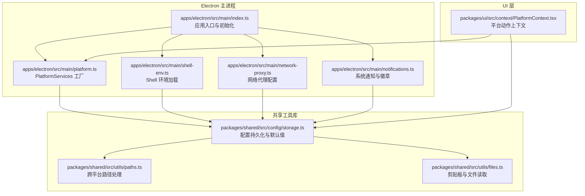
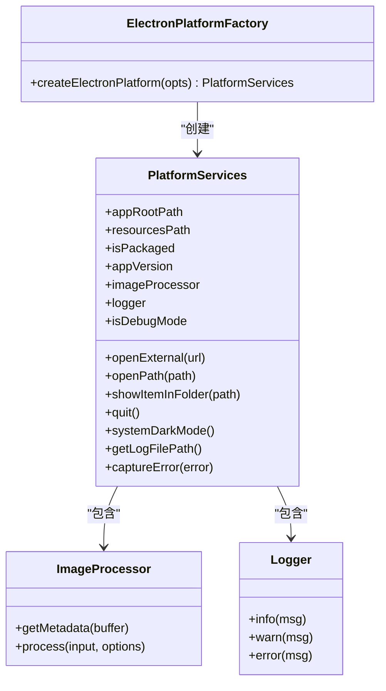
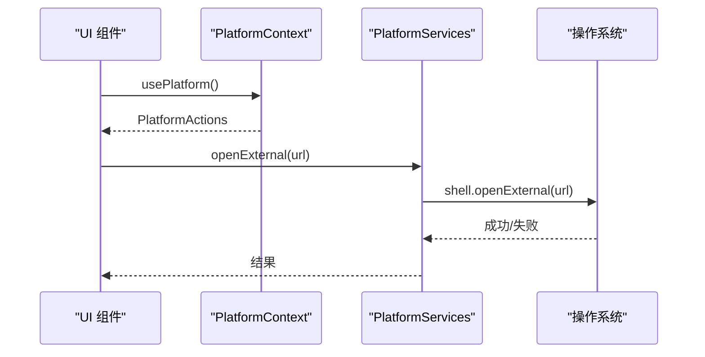
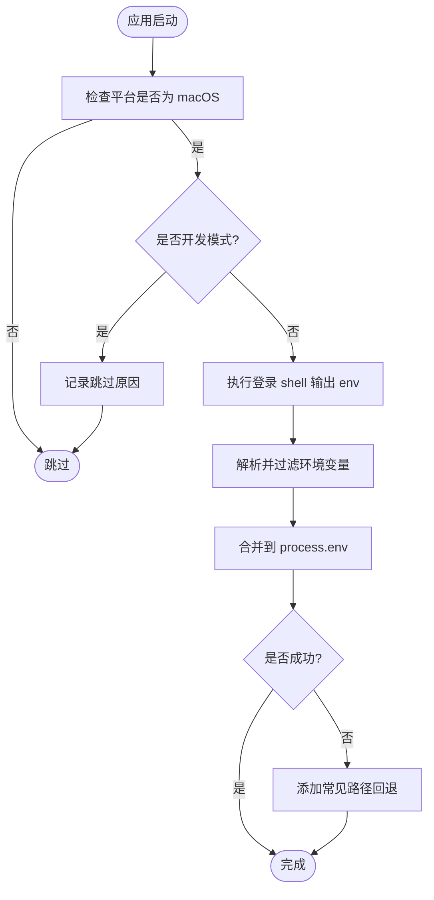
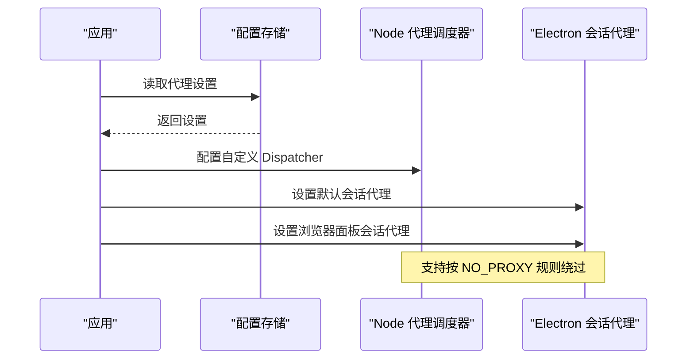
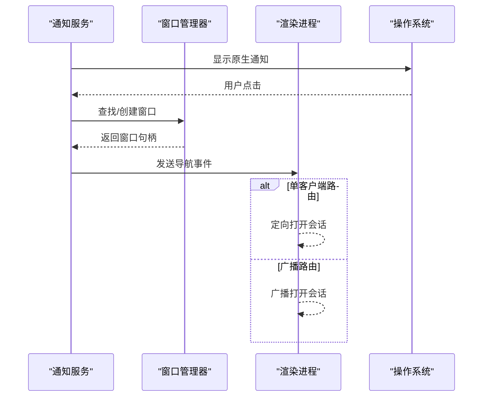
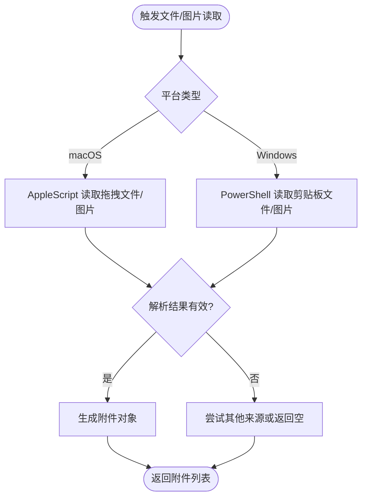
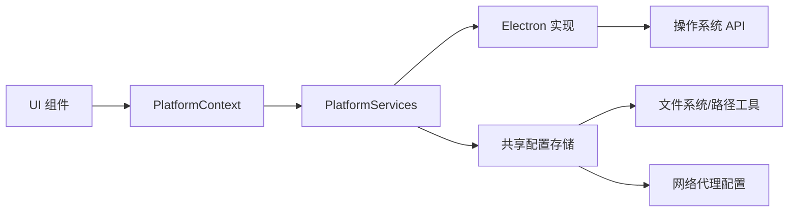

# 平台服务集成

<cite>
**本文引用的文件**
- [apps/electron/src/main/platform.ts](file://apps/electron/src/main/platform.ts)
- [apps/electron/src/runtime/platform.ts](file://apps/electron/src/runtime/platform.ts)
- [apps/electron/src/main/shell-env.ts](file://apps/electron/src/main/shell-env.ts)
- [apps/electron/src/main/network-proxy.ts](file://apps/electron/src/main/network-proxy.ts)
- [apps/electron/src/main/notifications.ts](file://apps/electron/src/main/notifications.ts)
- [packages/ui/src/context/PlatformContext.tsx](file://packages/ui/src/context/PlatformContext.tsx)
- [packages/shared/src/config/storage.ts](file://packages/shared/src/config/storage.ts)
- [packages/shared/src/utils/paths.ts](file://packages/shared/src/utils/paths.ts)
- [packages/shared/src/utils/files.ts](file://packages/shared/src/utils/files.ts)
- [apps/electron/src/main/index.ts](file://apps/electron/src/main/index.ts)
</cite>

## 目录
1. [简介](#简介)
2. [项目结构](#项目结构)
3. [核心组件](#核心组件)
4. [架构总览](#架构总览)
5. [详细组件分析](#详细组件分析)
6. [依赖关系分析](#依赖关系分析)
7. [性能考量](#性能考量)
8. [故障排查指南](#故障排查指南)
9. [结论](#结论)
10. [附录](#附录)

## 简介
本文件面向需要扩展平台功能或处理平台特定问题的开发者，系统化阐述平台服务集成的设计与实现，涵盖以下主题：
- PlatformServices 接口的设计理念与抽象层实现
- 跨平台兼容性策略：Shell 环境变量加载、网络代理配置、系统通知与徽章、文件系统访问
- 平台特定能力：macOS Dock 徽章绘制、Windows 任务栏覆盖图标等
- 扩展方法与最佳实践：如何新增平台适配器、处理平台差异、保障可维护性

## 项目结构
该仓库采用多包（monorepo）组织方式，平台服务集成主要分布在 Electron 主进程与共享工具库中：
- Electron 主进程：负责平台服务的具体实现（应用信息、系统交互、通知、代理、环境加载）
- 共享工具库：提供跨平台路径处理、文件读取、配置持久化等通用能力
- UI 层：通过上下文注入平台动作接口，实现 UI 在不同宿主环境下的行为一致性

**图表来源**
- [apps/electron/src/main/index.ts:1-200](file://apps/electron/src/main/index.ts#L1-L200)
- [apps/electron/src/main/platform.ts:1-73](file://apps/electron/src/main/platform.ts#L1-L73)
- [apps/electron/src/main/shell-env.ts:1-110](file://apps/electron/src/main/shell-env.ts#L1-L110)
- [apps/electron/src/main/network-proxy.ts:1-175](file://apps/electron/src/main/network-proxy.ts#L1-L175)
- [apps/electron/src/main/notifications.ts:1-296](file://apps/electron/src/main/notifications.ts#L1-L296)
- [packages/ui/src/context/PlatformContext.tsx:1-183](file://packages/ui/src/context/PlatformContext.tsx#L1-L183)
- [packages/shared/src/config/storage.ts:1-800](file://packages/shared/src/config/storage.ts#L1-L800)
- [packages/shared/src/utils/paths.ts:124-160](file://packages/shared/src/utils/paths.ts#L124-L160)
- [packages/shared/src/utils/files.ts:509-835](file://packages/shared/src/utils/files.ts#L509-L835)

**章节来源**
- [apps/electron/src/main/index.ts:1-200](file://apps/electron/src/main/index.ts#L1-L200)
- [apps/electron/src/main/platform.ts:1-73](file://apps/electron/src/main/platform.ts#L1-L73)
- [apps/electron/src/main/shell-env.ts:1-110](file://apps/electron/src/main/shell-env.ts#L1-L110)
- [apps/electron/src/main/network-proxy.ts:1-175](file://apps/electron/src/main/network-proxy.ts#L1-L175)
- [apps/electron/src/main/notifications.ts:1-296](file://apps/electron/src/main/notifications.ts#L1-L296)
- [packages/ui/src/context/PlatformContext.tsx:1-183](file://packages/ui/src/context/PlatformContext.tsx#L1-L183)
- [packages/shared/src/config/storage.ts:1-800](file://packages/shared/src/config/storage.ts#L1-L800)
- [packages/shared/src/utils/paths.ts:124-160](file://packages/shared/src/utils/paths.ts#L124-L160)
- [packages/shared/src/utils/files.ts:509-835](file://packages/shared/src/utils/files.ts#L509-L835)

## 核心组件
- PlatformServices 抽象层：统一暴露应用根路径、资源路径、打包状态、版本、外部打开、文件定位、系统深色模式、图像处理、日志、调试模式、错误捕获等能力。Electron 实现通过工厂函数注入真实 Electron API。
- Shell 环境加载：在 macOS 上从登录 shell 注入完整 PATH 与环境变量，失败时回退常见路径，确保工具链可用。
- 网络代理：同时配置 Node.js 全局 undici 调度器与 Electron 会话代理，支持按 NO_PROXY 规则绕过代理。
- 系统通知与徽章：跨平台显示原生通知；macOS 使用 Dock 图标叠加徽章；Windows 使用任务栏覆盖图标；Linux 使用桌面计数。
- 文件系统访问：提供跨平台路径规范化、目录前缀判断、相对路径剥离；在 macOS/Windows 剪贴板读取图片与文件附件。

**章节来源**
- [apps/electron/src/main/platform.ts:21-72](file://apps/electron/src/main/platform.ts#L21-L72)
- [apps/electron/src/main/shell-env.ts:28-109](file://apps/electron/src/main/shell-env.ts#L28-L109)
- [apps/electron/src/main/network-proxy.ts:24-104](file://apps/electron/src/main/network-proxy.ts#L24-L104)
- [apps/electron/src/main/notifications.ts:54-296](file://apps/electron/src/main/notifications.ts#L54-L296)
- [packages/shared/src/utils/paths.ts:124-160](file://packages/shared/src/utils/paths.ts#L124-L160)
- [packages/shared/src/utils/files.ts:509-835](file://packages/shared/src/utils/files.ts#L509-L835)

## 架构总览
平台服务以“抽象接口 + 宿主实现”的方式解耦 UI 与系统能力，Electron 主进程提供具体实现并通过上下文注入到渲染层。

**图表来源**
- [apps/electron/src/main/platform.ts:21-72](file://apps/electron/src/main/platform.ts#L21-L72)
- [apps/electron/src/runtime/platform.ts:1-8](file://apps/electron/src/runtime/platform.ts#L1-L8)

**章节来源**
- [apps/electron/src/main/platform.ts:21-72](file://apps/electron/src/main/platform.ts#L21-L72)
- [apps/electron/src/runtime/platform.ts:1-8](file://apps/electron/src/runtime/platform.ts#L1-L8)

## 详细组件分析

### PlatformServices 抽象与实现
- 设计理念
  - 将平台相关能力收敛到单一接口，便于替换与测试
  - 通过工厂函数注入 Electron API，避免 UI 直接依赖原生模块
- 关键职责
  - 应用元数据：根路径、资源路径、打包状态、版本号
  - 系统交互：打开外部链接、打开文件、在资源管理器中定位
  - 图像处理：尺寸调整、格式转换、元数据读取
  - 日志与错误：统一日志门面与错误捕获钩子
  - 运行时特性：深色模式检测、调试模式、日志文件路径
- 扩展建议
  - 新增平台适配器时，保持接口一致，仅实现所需能力
  - 对可选能力使用可选方法签名，UI 侧通过存在性检查调用

**图表来源**
- [packages/ui/src/context/PlatformContext.tsx:179-181](file://packages/ui/src/context/PlatformContext.tsx#L179-L181)
- [apps/electron/src/main/platform.ts:29-33](file://apps/electron/src/main/platform.ts#L29-L33)

**章节来源**
- [apps/electron/src/main/platform.ts:21-72](file://apps/electron/src/main/platform.ts#L21-L72)
- [packages/ui/src/context/PlatformContext.tsx:19-116](file://packages/ui/src/context/PlatformContext.tsx#L19-L116)

### Shell 环境变量加载
- 背景与挑战
  - macOS GUI 应用继承 minimal launchd 环境，PATH 可能不包含用户工具链
- 解决方案
  - 启动早期执行登录 shell，解析输出的环境变量并合并到进程环境
  - 过滤开发期变量（如 VITE_*），避免污染打包应用
  - 失败时回退常见路径，保证基础工具可用
- 最佳实践
  - 在应用启动早期调用，优先于任何可能依赖 PATH 的初始化逻辑
  - 记录 PATH 条目数量与关键路径，便于诊断

**图表来源**
- [apps/electron/src/main/shell-env.ts:28-109](file://apps/electron/src/main/shell-env.ts#L28-L109)

**章节来源**
- [apps/electron/src/main/shell-env.ts:28-109](file://apps/electron/src/main/shell-env.ts#L28-L109)

### 网络代理配置
- 目标
  - 同时生效于 Node.js 与 Electron，支持按 NO_PROXY 规则绕过
- 实现要点
  - 自定义 undici Dispatcher：根据协议选择 http/https 代理或直连
  - Electron 会话代理：对默认会话与浏览器面板会话分别设置
  - 配置持久化：通过共享存储读写代理设置，并在运行时即时应用
- 注意事项
  - 代理切换时需关闭旧调度器，避免连接泄漏
  - NO_PROXY 规则解析与逗号分隔拆分

**图表来源**
- [apps/electron/src/main/network-proxy.ts:81-166](file://apps/electron/src/main/network-proxy.ts#L81-L166)
- [packages/shared/src/config/storage.ts:83](file://packages/shared/src/config/storage.ts#L83)

**章节来源**
- [apps/electron/src/main/network-proxy.ts:24-166](file://apps/electron/src/main/network-proxy.ts#L24-L166)
- [packages/shared/src/config/storage.ts:83](file://packages/shared/src/config/storage.ts#L83)

### 系统通知与徽章
- 通知
  - 支持跨平台原生通知，点击后聚焦窗口并导航到对应会话
  - 通过事件通道定向发送至单客户端或工作区所有窗口
- 徽章
  - macOS：在 Dock 图标上绘制叠加数字徽章（通过渲染进程绘制后回传）
  - Windows：任务栏覆盖图标叠加徽章
  - Linux：使用桌面计数（Unity/KDE）
- 实例徽章（开发多实例）
  - macOS 支持在 Dock 显示文本徽章区分实例

**图表来源**
- [apps/electron/src/main/notifications.ts:54-125](file://apps/electron/src/main/notifications.ts#L54-L125)

**章节来源**
- [apps/electron/src/main/notifications.ts:54-296](file://apps/electron/src/main/notifications.ts#L54-L296)

### 文件系统访问与剪贴板
- 路径处理
  - 规范化路径分隔符、大小写归一化（Windows）、前缀匹配与相对化
- 剪贴板与文件
  - macOS：通过 AppleScript 读取拖拽文件与图片，必要时写临时文件再读取
  - Windows：通过 PowerShell 读取剪贴板中的文件与图片
- 安全与权限
  - 模式管理与路径合法性校验，防止符号链接逃逸与越界访问

**图表来源**
- [packages/shared/src/utils/files.ts:509-835](file://packages/shared/src/utils/files.ts#L509-L835)

**章节来源**
- [packages/shared/src/utils/paths.ts:124-160](file://packages/shared/src/utils/paths.ts#L124-L160)
- [packages/shared/src/utils/files.ts:509-835](file://packages/shared/src/utils/files.ts#L509-L835)

### 平台特定功能：macOS Dock 与 Windows 系统集成
- macOS
  - Dock 图标叠加徽章：通过渲染进程 Canvas 绘制后回传主进程更新 Dock 图标
  - 实例徽章：开发多实例时显示文本徽章
  - Traffic Lights 可见性控制（可选）
- Windows
  - 任务栏覆盖图标叠加徽章
  - 清理覆盖图标（清零徽章时）

**章节来源**
- [apps/electron/src/main/notifications.ts:172-253](file://apps/electron/src/main/notifications.ts#L172-L253)
- [packages/ui/src/context/PlatformContext.tsx:113-115](file://packages/ui/src/context/PlatformContext.tsx#L113-L115)

## 依赖关系分析
- UI 与平台服务
  - UI 通过 PlatformContext 获取 PlatformActions，不直接依赖 Electron
  - 平台动作可选，UI 必须进行存在性检查
- 主进程与共享库
  - 主进程依赖共享配置与工具库，确保路径、文件、代理、通知等能力的一致性
- 代理与配置
  - 代理配置由共享存储提供，主进程在运行时应用

**图表来源**
- [packages/ui/src/context/PlatformContext.tsx:179-181](file://packages/ui/src/context/PlatformContext.tsx#L179-L181)
- [apps/electron/src/main/platform.ts:21-72](file://apps/electron/src/main/platform.ts#L21-L72)
- [packages/shared/src/config/storage.ts:1-800](file://packages/shared/src/config/storage.ts#L1-L800)

**章节来源**
- [packages/ui/src/context/PlatformContext.tsx:179-181](file://packages/ui/src/context/PlatformContext.tsx#L179-L181)
- [apps/electron/src/main/platform.ts:21-72](file://apps/electron/src/main/platform.ts#L21-L72)
- [packages/shared/src/config/storage.ts:1-800](file://packages/shared/src/config/storage.ts#L1-L800)

## 性能考量
- 代理切换
  - 切换代理时应关闭旧调度器，避免未正确释放导致的内存与连接泄漏
- Shell 环境加载
  - 登录 shell 执行有超时限制，失败时快速回退，避免阻塞启动
- 通知与徽章
  - 徽章绘制通过渲染进程完成，减少主进程图形操作开销
  - 清零徽章时批量清理任务栏覆盖图标，降低多次 IPC 调用成本

[本节为通用指导，无需列出章节来源]

## 故障排查指南
- Shell 环境加载失败
  - 现象：PATH 不包含期望工具
  - 排查：确认非开发模式、SHELL 环境变量、登录 shell 输出解析、回退路径合并
  - 参考
    - [apps/electron/src/main/shell-env.ts:86-108](file://apps/electron/src/main/shell-env.ts#L86-L108)
- 代理未生效
  - 现象：请求未走代理或被 NO_PROXY 绕过
  - 排查：确认设置已持久化、Node 调度器已替换、Electron 会话代理已设置、NO_PROXY 规则正确
  - 参考
    - [apps/electron/src/main/network-proxy.ts:152-166](file://apps/electron/src/main/network-proxy.ts#L152-L166)
    - [packages/shared/src/config/storage.ts:83](file://packages/shared/src/config/storage.ts#L83)
- 通知点击无响应
  - 现象：点击通知无法聚焦窗口或导航
  - 排查：确认窗口管理器已初始化、事件通道可用、客户端解析器正确
  - 参考
    - [apps/electron/src/main/notifications.ts:31-44](file://apps/electron/src/main/notifications.ts#L31-L44)
    - [apps/electron/src/main/notifications.ts:86-125](file://apps/electron/src/main/notifications.ts#L86-L125)
- 剪贴板读取为空
  - 现象：拖拽文件或截图无结果
  - 排查：确认平台分支、脚本执行权限、临时文件写入与清理
  - 参考
    - [packages/shared/src/utils/files.ts:509-835](file://packages/shared/src/utils/files.ts#L509-L835)

**章节来源**
- [apps/electron/src/main/shell-env.ts:86-108](file://apps/electron/src/main/shell-env.ts#L86-L108)
- [apps/electron/src/main/network-proxy.ts:152-166](file://apps/electron/src/main/network-proxy.ts#L152-L166)
- [packages/shared/src/config/storage.ts:83](file://packages/shared/src/config/storage.ts#L83)
- [apps/electron/src/main/notifications.ts:31-44](file://apps/electron/src/main/notifications.ts#L31-L44)
- [apps/electron/src/main/notifications.ts:86-125](file://apps/electron/src/main/notifications.ts#L86-L125)
- [packages/shared/src/utils/files.ts:509-835](file://packages/shared/src/utils/files.ts#L509-L835)

## 结论
本平台服务集成为跨平台应用提供了统一抽象与稳定实现：
- 通过 PlatformServices 将系统能力封装，UI 与平台解耦
- 在 macOS/Windows/Linux 上分别优化通知与徽章体验
- 提供可靠的 Shell 环境加载与网络代理配置，保障工具链与联网稳定性
- 通过可选动作与存在性检查，确保 UI 在不同宿主环境下的健壮性

## 附录

### 平台服务扩展方法与最佳实践
- 新增平台适配器
  - 定义最小化 PlatformServices 子集，仅实现当前平台所需能力
  - 通过工厂函数注入，保持 UI 侧不变
- 处理平台差异
  - 使用可选动作签名，UI 侧进行存在性检查后再调用
  - 对于不可用能力，提供降级行为（如内联模态）
- 配置与持久化
  - 代理、通知开关等配置通过共享存储读写，主进程运行时应用
- 安全与合规
  - Shell 环境加载过滤开发期变量，避免泄露
  - 文件系统访问进行路径合法性校验，防止越界

**章节来源**
- [packages/ui/src/context/PlatformContext.tsx:125-181](file://packages/ui/src/context/PlatformContext.tsx#L125-L181)
- [apps/electron/src/main/platform.ts:21-72](file://apps/electron/src/main/platform.ts#L21-L72)
- [packages/shared/src/config/storage.ts:1-800](file://packages/shared/src/config/storage.ts#L1-L800)