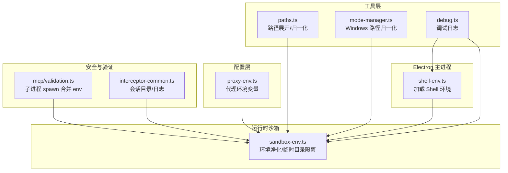
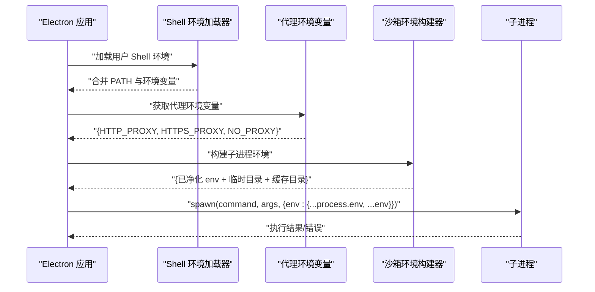
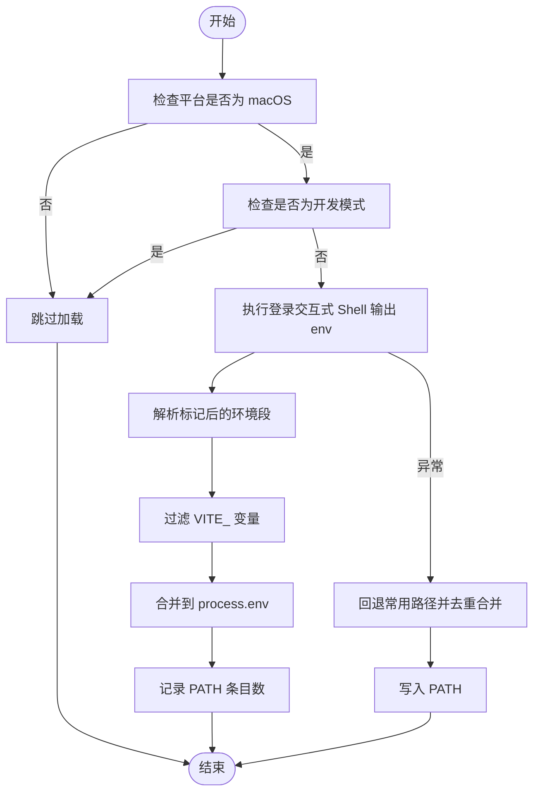
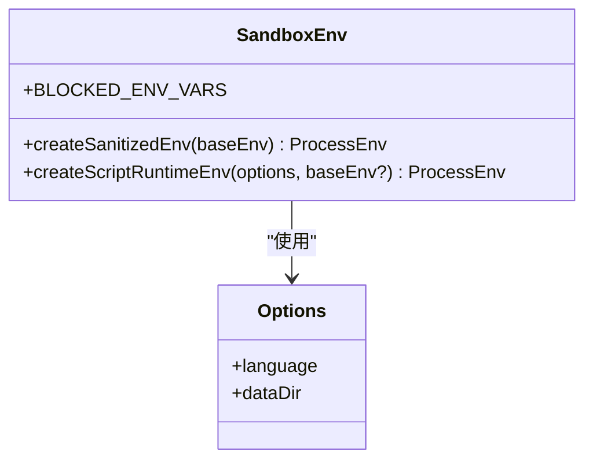
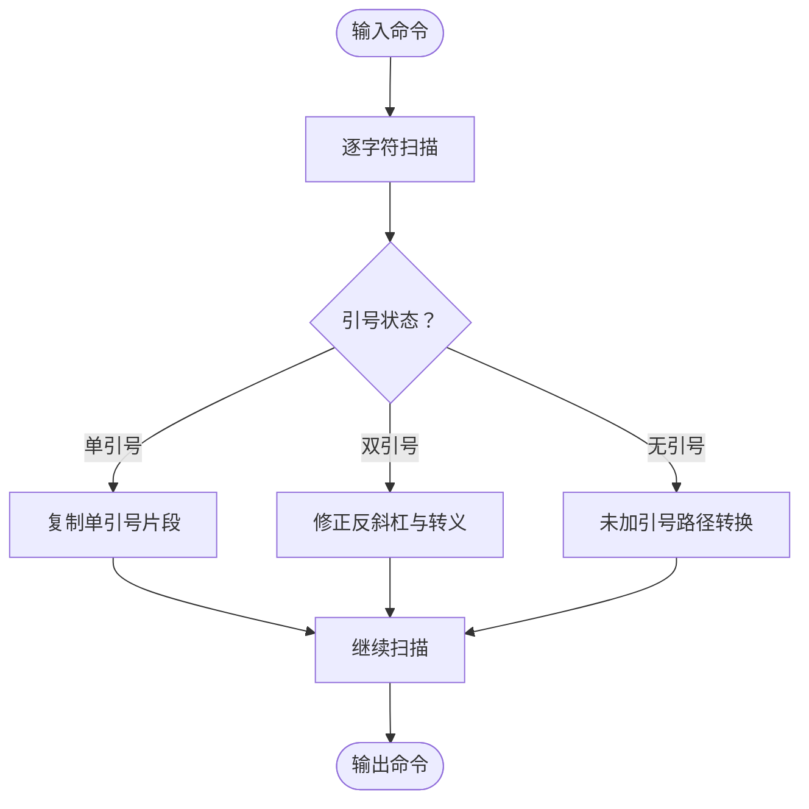
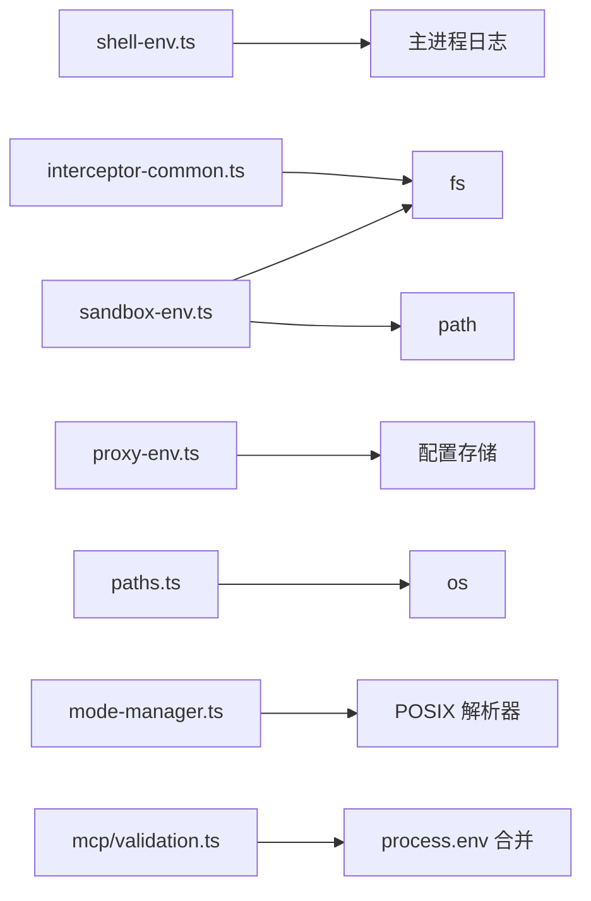

# 环境配置管理

<cite>
**本文引用的文件**
- [apps/electron/src/main/shell-env.ts](file://apps/electron/src/main/shell-env.ts)
- [packages/session-tools-core/src/runtime/sandbox-env.ts](file://packages/session-tools-core/src/runtime/sandbox-env.ts)
- [packages/shared/src/config/proxy-env.ts](file://packages/shared/src/config/proxy-env.ts)
- [packages/shared/src/utils/paths.ts](file://packages/shared/src/utils/paths.ts)
- [packages/shared/src/agent/mode-manager.ts](file://packages/shared/src/agent/mode-manager.ts)
- [packages/shared/src/utils/cli-icon-resolver.ts](file://packages/shared/src/utils/cli-icon-resolver.ts)
- [packages/shared/src/utils/debug.ts](file://packages/shared/src/utils/debug.ts)
- [packages/shared/src/mcp/validation.ts](file://packages/shared/src/mcp/validation.ts)
- [packages/shared/src/interceptor-common.ts](file://packages/shared/src/interceptor-common.ts)
- [packages/shared/src/agent/__tests__/spawn-session-tilde-expansion.test.ts](file://packages/shared/src/agent/__tests__/spawn-session-tilde-expansion.test.ts)
- [packages/shared/tests/mode-manager.test.ts](file://packages/shared/tests/mode-manager.test.ts)
</cite>

## 目录
1. [引言](#引言)
2. [项目结构](#项目结构)
3. [核心组件](#核心组件)
4. [架构总览](#架构总览)
5. [详细组件分析](#详细组件分析)
6. [依赖关系分析](#依赖关系分析)
7. [性能考量](#性能考量)
8. [故障排查指南](#故障排查指南)
9. [结论](#结论)
10. [附录](#附录)

## 引言
本文件系统性阐述本仓库中的“环境配置管理”能力，覆盖以下主题：
- Shell 环境变量加载机制与跨平台差异（macOS、Windows、Linux）
- PATH 合并与优先级策略
- 环境变量继承与安全过滤（敏感变量屏蔽）
- 平台特定路径与命令解析处理（Windows 路径在 Bash 解析器中的归一化）
- 动态更新与临时环境变量的创建与清理
- 环境变量调试方法、常见问题排查与性能优化建议

目标读者：需要处理复杂环境配置或解决环境相关问题的开发者。

## 项目结构
围绕环境配置的关键模块分布于以下位置：
- Electron 主进程：加载用户完整 Shell 环境，确保 PATH 等工具可用
- 运行时沙箱：对子进程进行环境变量净化与本地缓存隔离
- 配置层：代理设置转换为环境变量
- 工具层：路径展开、跨平台路径归一化、调试日志
- 安全层：命令解析与路径规范化，防止 Windows 路径在 Bash 中被错误解释

图表来源
- [apps/electron/src/main/shell-env.ts:1-110](file://apps/electron/src/main/shell-env.ts#L1-L110)
- [packages/session-tools-core/src/runtime/sandbox-env.ts:1-80](file://packages/session-tools-core/src/runtime/sandbox-env.ts#L1-L80)
- [packages/shared/src/config/proxy-env.ts:1-26](file://packages/shared/src/config/proxy-env.ts#L1-L26)
- [packages/shared/src/utils/paths.ts:1-129](file://packages/shared/src/utils/paths.ts#L1-L129)
- [packages/shared/src/agent/mode-manager.ts:972-1004](file://packages/shared/src/agent/mode-manager.ts#L972-L1004)
- [packages/shared/src/utils/debug.ts:1-166](file://packages/shared/src/utils/debug.ts#L1-L166)
- [packages/shared/src/mcp/validation.ts:269-312](file://packages/shared/src/mcp/validation.ts#L269-L312)
- [packages/shared/src/interceptor-common.ts:29-68](file://packages/shared/src/interceptor-common.ts#L29-L68)

章节来源
- [apps/electron/src/main/shell-env.ts:1-110](file://apps/electron/src/main/shell-env.ts#L1-L110)
- [packages/session-tools-core/src/runtime/sandbox-env.ts:1-80](file://packages/session-tools-core/src/runtime/sandbox-env.ts#L1-L80)
- [packages/shared/src/config/proxy-env.ts:1-26](file://packages/shared/src/config/proxy-env.ts#L1-L26)
- [packages/shared/src/utils/paths.ts:1-129](file://packages/shared/src/utils/paths.ts#L1-L129)
- [packages/shared/src/agent/mode-manager.ts:972-1004](file://packages/shared/src/agent/mode-manager.ts#L972-L1004)
- [packages/shared/src/utils/debug.ts:1-166](file://packages/shared/src/utils/debug.ts#L1-L166)
- [packages/shared/src/mcp/validation.ts:269-312](file://packages/shared/src/mcp/validation.ts#L269-L312)
- [packages/shared/src/interceptor-common.ts:29-68](file://packages/shared/src/interceptor-common.ts#L29-L68)

## 核心组件
- Shell 环境加载器：在 macOS 上通过登录交互式 Shell 获取完整环境，并合并到当前进程；失败时回退常用路径
- 沙箱环境构建器：移除敏感变量，重定向临时目录与语言运行时缓存目录至会话数据目录
- 代理环境变量生成器：根据存储的网络代理配置生成 HTTP/HTTPS/NO_PROXY 环境变量
- 路径工具：支持 ~、${HOME}、$HOME 的展开与跨平台路径归一化
- Windows 路径归一化：修复双引号内反斜杠转义与未加引号的驱动器路径在 Bash 解析器中的问题
- 调试与日志：统一的调试开关与输出路由，便于定位环境问题
- 子进程环境合并：spawn 时将全局 env 与传入 env 合并，避免丢失 PATH 或其他变量

章节来源
- [apps/electron/src/main/shell-env.ts:28-109](file://apps/electron/src/main/shell-env.ts#L28-L109)
- [packages/session-tools-core/src/runtime/sandbox-env.ts:13-79](file://packages/session-tools-core/src/runtime/sandbox-env.ts#L13-L79)
- [packages/shared/src/config/proxy-env.ts:7-25](file://packages/shared/src/config/proxy-env.ts#L7-L25)
- [packages/shared/src/utils/paths.ts:25-52](file://packages/shared/src/utils/paths.ts#L25-L52)
- [packages/shared/src/agent/mode-manager.ts:983-1004](file://packages/shared/src/agent/mode-manager.ts#L983-L1004)
- [packages/shared/src/utils/debug.ts:53-166](file://packages/shared/src/utils/debug.ts#L53-L166)
- [packages/shared/src/mcp/validation.ts:296-300](file://packages/shared/src/mcp/validation.ts#L296-L300)

## 架构总览
下图展示从应用启动到子进程执行的环境配置链路，包括 Shell 环境注入、代理变量注入、沙箱净化与 PATH 合并策略。

图表来源
- [apps/electron/src/main/shell-env.ts:28-109](file://apps/electron/src/main/shell-env.ts#L28-L109)
- [packages/shared/src/config/proxy-env.ts:7-25](file://packages/shared/src/config/proxy-env.ts#L7-L25)
- [packages/session-tools-core/src/runtime/sandbox-env.ts:30-79](file://packages/session-tools-core/src/runtime/sandbox-env.ts#L30-L79)
- [packages/shared/src/mcp/validation.ts:296-300](file://packages/shared/src/mcp/validation.ts#L296-L300)

## 详细组件分析

### 组件一：Shell 环境加载器（macOS 特性）
- 目标：在 macOS 图形界面启动时，补齐缺失的 PATH 与工具环境（如 Homebrew、nvm、pyenv 等）
- 行为：
  - 仅在 macOS 生效；开发模式跳过（已有终端环境）
  - 使用登录交互式 Shell 执行 env 命令，截取标记后的环境段
  - 过滤以 VITE_ 开头的变量（避免开发模式变量污染打包应用）
  - 记录 PATH 条目数量用于调试
  - 失败时回退常用路径并去重合并
- 关键点：
  - 通过显式传入 HOME、USER、SHELL、TMPDIR 等变量，保证 Shell 初始化稳定
  - 设置超时与错误降级，避免阻塞应用启动

图表来源
- [apps/electron/src/main/shell-env.ts:28-109](file://apps/electron/src/main/shell-env.ts#L28-L109)

章节来源
- [apps/electron/src/main/shell-env.ts:15-19](file://apps/electron/src/main/shell-env.ts#L15-L19)
- [apps/electron/src/main/shell-env.ts:28-109](file://apps/electron/src/main/shell-env.ts#L28-L109)

### 组件二：沙箱环境构建器（安全过滤与临时目录）
- 目标：防止凭据泄露，隔离缓存与临时目录，确保多会话一致性
- 行为：
  - 定义敏感变量白名单（如 API Key、Token），在子进程环境中删除
  - 创建会话数据目录下的临时目录并设置 TMP/TMPDIR/TEMP
  - 针对 Python/uv：重定向 UV_CACHE_DIR、XDG_CACHE_HOME、PYTHONPYCACHEPREFIX 到会话目录
- 关键点：
  - 与共享模块保持敏感变量列表同步
  - 通过深拷贝避免污染调用方环境

图表来源
- [packages/session-tools-core/src/runtime/sandbox-env.ts:13-79](file://packages/session-tools-core/src/runtime/sandbox-env.ts#L13-L79)

章节来源
- [packages/session-tools-core/src/runtime/sandbox-env.ts:13-79](file://packages/session-tools-core/src/runtime/sandbox-env.ts#L13-L79)

### 组件三：代理环境变量生成器
- 目标：将存储的代理配置转换为子进程可用的环境变量
- 行为：
  - 当代理启用时，生成 HTTP_PROXY/http_proxy、HTTPS_PROXY/https_proxy、NO_PROXY/no_proxy
  - 未启用或未配置时返回空对象
- 关键点：
  - 与子进程 spawn 合并逻辑配合，确保网络访问符合预期

章节来源
- [packages/shared/src/config/proxy-env.ts:7-25](file://packages/shared/src/config/proxy-env.ts#L7-L25)

### 组件四：路径工具（展开与归一化）
- 目标：支持 ~、${HOME}、$HOME 展开，以及跨平台路径比较
- 行为：
  - expandPath：展开 ~、${HOME}、$HOME，相对路径基于 cwd 或指定基础路径解析
  - toPortablePath：将家目录内的绝对路径转换为 ~ 形式
  - normalizePath：统一使用前向斜杠，便于跨平台比较
- 关键点：
  - 在工作目录解析与脚本输入中广泛使用，保障路径一致性

章节来源
- [packages/shared/src/utils/paths.ts:25-52](file://packages/shared/src/utils/paths.ts#L25-L52)
- [packages/shared/src/utils/paths.ts:66-91](file://packages/shared/src/utils/paths.ts#L66-L91)
- [packages/shared/src/utils/paths.ts:125-129](file://packages/shared/src/utils/paths.ts#L125-L129)

### 组件五：Windows 路径在 Bash 解析器中的归一化
- 目标：修复 Windows 路径在 Bash 解析器中的反斜杠处理问题
- 行为：
  - 单引号字符串原样保留
  - 双引号字符串中保留非特殊转义字符，修正 “\" → "/ 以闭合引号
  - 未加引号的驱动器路径转换为 C:/Users/... 形式
- 关键点：
  - 通过测试覆盖了多种边界情况（UNC、多路径、转义序列等）

图表来源
- [packages/shared/src/agent/mode-manager.ts:983-1004](file://packages/shared/src/agent/mode-manager.ts#L983-L1004)

章节来源
- [packages/shared/src/agent/mode-manager.ts:983-1004](file://packages/shared/src/agent/mode-manager.ts#L983-L1004)
- [packages/shared/tests/mode-manager.test.ts:2134-2403](file://packages/shared/tests/mode-manager.test.ts#L2134-L2403)

### 组件六：调试与日志（环境变量调试）
- 目标：在不同运行环境下统一输出调试信息，辅助定位环境问题
- 行为：
  - 支持通过环境变量开启调试
  - 自动识别 Electron 主/渲染/CLI 环境并选择合适的输出通道
  - 提供带作用域的日志函数
- 关键点：
  - 在 Shell 环境加载与沙箱构建处可插入调试语句，观察 PATH 与变量变化

章节来源
- [packages/shared/src/utils/debug.ts:53-166](file://packages/shared/src/utils/debug.ts#L53-L166)
- [apps/electron/src/main/shell-env.ts:82-85](file://apps/electron/src/main/shell-env.ts#L82-L85)

### 组件七：子进程环境合并（PATH 与 env 的最终合并）
- 目标：确保子进程拥有完整的 PATH 与必要的环境变量
- 行为：
  - spawn 时将传入 env 与 process.env 合并，后者作为默认值
  - 通过限制 stderr 输出长度避免内存膨胀
- 关键点：
  - 合并顺序意味着传入 env 可覆盖 process.env 中的同名变量

章节来源
- [packages/shared/src/mcp/validation.ts:296-300](file://packages/shared/src/mcp/validation.ts#L296-L300)
- [packages/shared/src/mcp/validation.ts:303-312](file://packages/shared/src/mcp/validation.ts#L303-L312)

## 依赖关系分析
- shell-env.ts 依赖 Node 的 child_process 执行 Shell，依赖主进程日志
- sandbox-env.ts 依赖 Node 的 fs 与 path，依赖共享的敏感变量列表
- proxy-env.ts 依赖配置存储模块，生成标准代理环境变量
- paths.ts 与 mode-manager.ts 分别服务于路径展开与命令解析
- mcp/validation.ts 体现最终的 env 合并策略
- interceptor-common.ts 提供会话目录与日志路径，影响缓存与临时目录布局

图表来源
- [apps/electron/src/main/shell-env.ts:12-13](file://apps/electron/src/main/shell-env.ts#L12-L13)
- [packages/session-tools-core/src/runtime/sandbox-env.ts:5-6](file://packages/session-tools-core/src/runtime/sandbox-env.ts#L5-L6)
- [packages/shared/src/config/proxy-env.ts:1](file://packages/shared/src/config/proxy-env.ts#L1)
- [packages/shared/src/utils/paths.ts:8-10](file://packages/shared/src/utils/paths.ts#L8-L10)
- [packages/shared/src/agent/mode-manager.ts:983-1004](file://packages/shared/src/agent/mode-manager.ts#L983-L1004)
- [packages/shared/src/mcp/validation.ts:296-300](file://packages/shared/src/mcp/validation.ts#L296-L300)
- [packages/shared/src/interceptor-common.ts:29-68](file://packages/shared/src/interceptor-common.ts#L29-L68)

章节来源
- [apps/electron/src/main/shell-env.ts:12-13](file://apps/electron/src/main/shell-env.ts#L12-L13)
- [packages/session-tools-core/src/runtime/sandbox-env.ts:5-6](file://packages/session-tools-core/src/runtime/sandbox-env.ts#L5-L6)
- [packages/shared/src/config/proxy-env.ts:1](file://packages/shared/src/config/proxy-env.ts#L1)
- [packages/shared/src/utils/paths.ts:8-10](file://packages/shared/src/utils/paths.ts#L8-L10)
- [packages/shared/src/agent/mode-manager.ts:983-1004](file://packages/shared/src/agent/mode-manager.ts#L983-L1004)
- [packages/shared/src/mcp/validation.ts:296-300](file://packages/shared/src/mcp/validation.ts#L296-L300)
- [packages/shared/src/interceptor-common.ts:29-68](file://packages/shared/src/interceptor-common.ts#L29-L68)

## 性能考量
- Shell 环境加载
  - 通过超时控制避免阻塞；失败回退常用路径并去重，减少重复条目带来的 PATH 匹配开销
- 沙箱环境构建
  - 仅在必要时创建临时目录与缓存目录，避免不必要的 IO
  - 对 Python/uv 的缓存重定向到会话目录，降低磁盘争用
- 子进程 spawn
  - 合并 env 时尽量只传入必要字段，避免传递大量冗余变量
  - 限制 stderr 截断长度，防止内存占用过高

[本节为通用指导，无需列出章节来源]

## 故障排查指南
- macOS 下 PATH 不完整
  - 现象：找不到 Homebrew、nvm、pyenv 等工具
  - 排查：确认应用在 macOS 上且非开发模式；查看日志中 PATH 条目数；若加载失败，检查回退逻辑是否生效
  - 参考
    - [apps/electron/src/main/shell-env.ts:28-109](file://apps/electron/src/main/shell-env.ts#L28-L109)
- Windows 路径在 Bash 中报错或行为异常
  - 现象：命令报 parse_error 或路径被错误解释
  - 排查：确认命令经过 Windows 路径归一化；检查双引号内反斜杠与尾部反斜杠处理
  - 参考
    - [packages/shared/src/agent/mode-manager.ts:983-1004](file://packages/shared/src/agent/mode-manager.ts#L983-L1004)
    - [packages/shared/tests/mode-manager.test.ts:2134-2403](file://packages/shared/tests/mode-manager.test.ts#L2134-L2403)
- 子进程无法访问网络
  - 现象：HTTP/HTTPS 请求失败
  - 排查：确认代理环境变量生成正确；检查合并后的 env 是否包含 HTTP_PROXY/HTTPS_PROXY
  - 参考
    - [packages/shared/src/config/proxy-env.ts:7-25](file://packages/shared/src/config/proxy-env.ts#L7-L25)
    - [packages/shared/src/mcp/validation.ts:296-300](file://packages/shared/src/mcp/validation.ts#L296-L300)
- 凭据泄露或环境变量泄漏
  - 现象：敏感变量出现在子进程环境
  - 排查：确认沙箱环境构建已移除敏感变量；核对 BLOCKED_ENV_VARS 列表
  - 参考
    - [packages/session-tools-core/src/runtime/sandbox-env.ts:13-36](file://packages/session-tools-core/src/runtime/sandbox-env.ts#L13-L36)
- 路径展开不一致
  - 现象：~、${HOME}、$HOME 展开结果与预期不符
  - 排查：使用路径工具进行展开与归一化；确认基础路径与平台分隔符
  - 参考
    - [packages/shared/src/utils/paths.ts:25-52](file://packages/shared/src/utils/paths.ts#L25-L52)
    - [packages/shared/src/utils/paths.ts:125-129](file://packages/shared/src/utils/paths.ts#L125-L129)
    - [packages/shared/src/agent/__tests__/spawn-session-tilde-expansion.test.ts:45-85](file://packages/shared/src/agent/__tests__/spawn-session-tilde-expansion.test.ts#L45-L85)
- 调试与日志
  - 方法：设置调试开关；在关键节点输出环境变量快照（如 PATH、TMPDIR、UV_CACHE_DIR 等）
  - 参考
    - [packages/shared/src/utils/debug.ts:53-166](file://packages/shared/src/utils/debug.ts#L53-L166)

章节来源
- [apps/electron/src/main/shell-env.ts:28-109](file://apps/electron/src/main/shell-env.ts#L28-L109)
- [packages/shared/src/agent/mode-manager.ts:983-1004](file://packages/shared/src/agent/mode-manager.ts#L983-L1004)
- [packages/shared/tests/mode-manager.test.ts:2134-2403](file://packages/shared/tests/mode-manager.test.ts#L2134-L2403)
- [packages/shared/src/config/proxy-env.ts:7-25](file://packages/shared/src/config/proxy-env.ts#L7-L25)
- [packages/shared/src/mcp/validation.ts:296-300](file://packages/shared/src/mcp/validation.ts#L296-L300)
- [packages/session-tools-core/src/runtime/sandbox-env.ts:13-36](file://packages/session-tools-core/src/runtime/sandbox-env.ts#L13-L36)
- [packages/shared/src/utils/paths.ts:25-52](file://packages/shared/src/utils/paths.ts#L25-L52)
- [packages/shared/src/utils/paths.ts:125-129](file://packages/shared/src/utils/paths.ts#L125-L129)
- [packages/shared/src/agent/__tests__/spawn-session-tilde-expansion.test.ts:45-85](file://packages/shared/src/agent/__tests__/spawn-session-tilde-expansion.test.ts#L45-L85)
- [packages/shared/src/utils/debug.ts:53-166](file://packages/shared/src/utils/debug.ts#L53-L166)

## 结论
本仓库通过“Shell 环境加载 + 沙箱净化 + 代理注入 + 路径归一化”的组合，实现了跨平台、安全、可调试的环境配置管理。其关键特性包括：
- macOS 上补齐 PATH 与工具环境，失败时回退常用路径
- 子进程环境安全过滤与缓存隔离
- 代理配置自动注入
- Windows 路径在 Bash 解析器中的稳健处理
- 统一的调试日志与可观测性

这些能力共同保障了复杂环境下的稳定性与安全性，适合在多平台、多会话、多工具链的场景中复用与扩展。

[本节为总结性内容，无需列出章节来源]

## 附录

### 平台特定差异与建议
- macOS
  - 通过登录交互式 Shell 加载完整环境；注意开发模式跳过加载
  - 回退常用路径时需考虑 Apple Silicon 与 Intel 的 Homebrew 路径差异
- Windows
  - 使用模式管理器对命令进行路径归一化；注意 UNC 与多路径场景
  - 子进程网络访问需确保代理变量正确合并
- Linux
  - 默认继承终端环境；如遇 PATH 不完整，可参考 macOS 的回退策略

[本节为通用指导，无需列出章节来源]

### 环境变量优先级与继承规则
- Shell 环境加载后合并到 process.env
- 子进程 spawn 时，传入 env 与 process.env 合并，后者作为默认值
- 沙箱构建阶段移除敏感变量，再注入临时目录与缓存目录
- 代理变量按需注入，不影响 PATH 的原始顺序

章节来源
- [apps/electron/src/main/shell-env.ts:66-77](file://apps/electron/src/main/shell-env.ts#L66-L77)
- [packages/shared/src/mcp/validation.ts:296-300](file://packages/shared/src/mcp/validation.ts#L296-L300)
- [packages/session-tools-core/src/runtime/sandbox-env.ts:30-79](file://packages/session-tools-core/src/runtime/sandbox-env.ts#L30-L79)
- [packages/shared/src/config/proxy-env.ts:7-25](file://packages/shared/src/config/proxy-env.ts#L7-L25)

### 动态更新与临时环境变量
- 动态更新
  - Shell 环境加载仅在应用启动早期执行一次；后续可通过传入 env 参数在子进程层面增量更新
- 临时环境变量
  - 通过沙箱构建设置 TMP/TMPDIR/TEMP 与语言运行时缓存目录，确保会话隔离
  - 日志与会话目录由拦截器公共模块统一管理

章节来源
- [packages/session-tools-core/src/runtime/sandbox-env.ts:50-79](file://packages/session-tools-core/src/runtime/sandbox-env.ts#L50-L79)
- [packages/shared/src/interceptor-common.ts:29-68](file://packages/shared/src/interceptor-common.ts#L29-L68)

### 调试方法与最佳实践
- 启用调试：设置调试开关；在 Shell 加载与沙箱构建处输出关键变量快照
- 关注指标：PATH 条目数、TMP/TMPDIR、UV_CACHE_DIR/XDG_CACHE_HOME 等
- 最佳实践：
  - 尽量在子进程层传入最小必要 env
  - 对 Windows 路径在进入 Bash 前先进行归一化
  - 对代理与网络相关变量进行显式校验

章节来源
- [packages/shared/src/utils/debug.ts:53-166](file://packages/shared/src/utils/debug.ts#L53-L166)
- [apps/electron/src/main/shell-env.ts:82-85](file://apps/electron/src/main/shell-env.ts#L82-L85)
- [packages/session-tools-core/src/runtime/sandbox-env.ts:60-76](file://packages/session-tools-core/src/runtime/sandbox-env.ts#L60-L76)