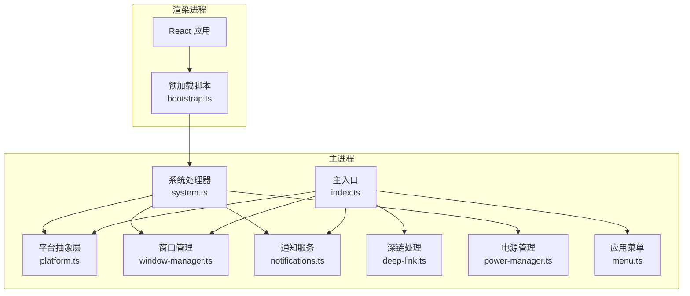
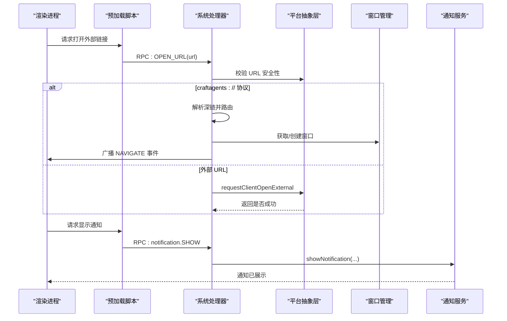
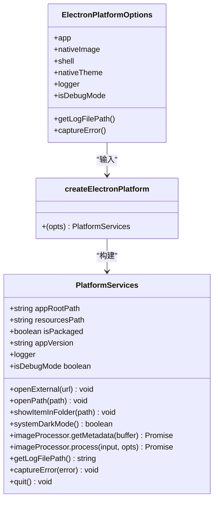
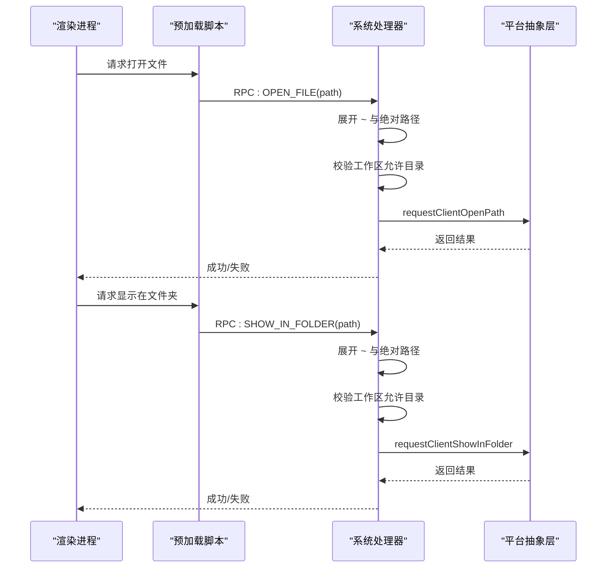
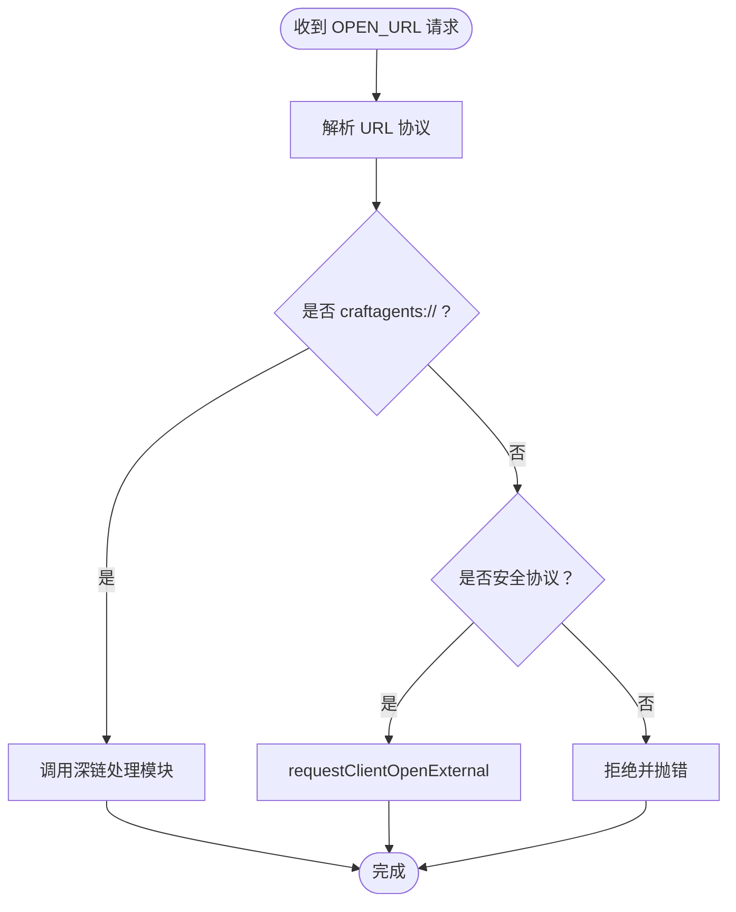
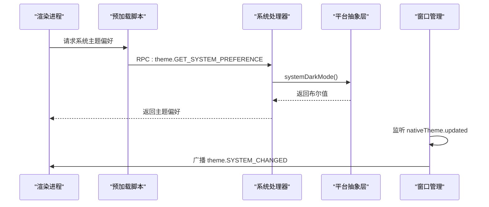
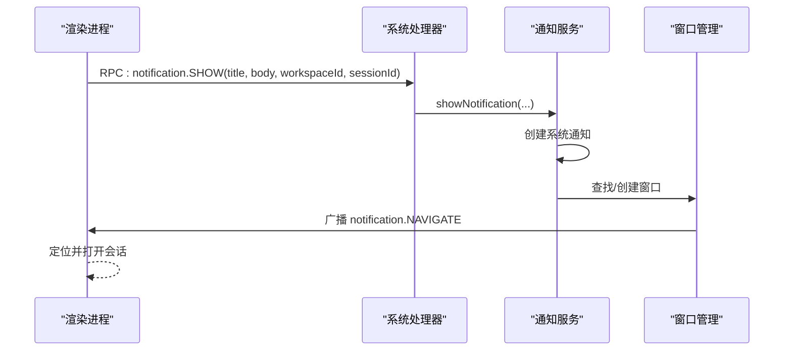
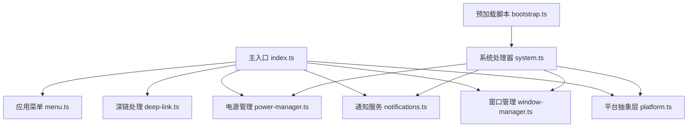

# 系统集成功能

<cite>
**本文档引用的文件**
- [apps/electron/src/main/platform.ts](file://apps/electron/src/main/platform.ts)
- [apps/electron/src/runtime/platform.ts](file://apps/electron/src/runtime/platform.ts)
- [apps/electron/src/main/system.ts](file://apps/electron/src/main/system.ts)
- [apps/electron/src/main/notifications.ts](file://apps/electron/src/main/notifications.ts)
- [apps/electron/src/main/deep-link.ts](file://apps/electron/src/main/deep-link.ts)
- [apps/electron/src/main/window-manager.ts](file://apps/electron/src/main/window-manager.ts)
- [apps/electron/src/main/power-manager.ts](file://apps/electron/src/main/power-manager.ts)
- [apps/electron/src/main/index.ts](file://apps/electron/src/main/index.ts)
- [apps/electron/src/preload/bootstrap.ts](file://apps/electron/src/preload/bootstrap.ts)
- [apps/electron/src/main/menu.ts](file://apps/electron/src/main/menu.ts)
- [apps/webui/src/shims/open.ts](file://apps/webui/src/shims/open.ts)
</cite>

## 目录
1. [简介](#简介)
2. [项目结构](#项目结构)
3. [核心组件](#核心组件)
4. [架构总览](#架构总览)
5. [详细组件分析](#详细组件分析)
6. [依赖关系分析](#依赖关系分析)
7. [性能考量](#性能考量)
8. [故障排查指南](#故障排查指南)
9. [结论](#结论)
10. [附录](#附录)

## 简介
本文件系统集成功能的技术文档，围绕平台抽象层设计、统一系统服务接口、跨平台兼容性策略展开，覆盖文件系统操作（打开文件、显示在文件夹中）、外部链接处理、系统主题检测、应用退出机制；同时涵盖 macOS Dock 集成与 Windows 系统集成、系统通知、快捷键注册与处理等。文档还提供扩展方法与自定义平台适配器的开发指南，帮助开发者快速扩展系统功能或处理平台特定问题。

## 项目结构
系统集成功能主要分布在 Electron 主进程与预加载脚本中，通过统一的 RPC 通道与渲染进程交互，形成“平台抽象层 → 主进程系统服务 → 渲染进程调用”的分层架构。关键目录与职责如下：
- 平台抽象层：定义统一的 PlatformServices 接口，屏蔽不同运行时差异
- 主进程系统服务：实现文件系统、外部链接、通知、窗口管理、电源管理等能力
- 预加载脚本：桥接主进程能力到渲染进程，暴露安全可控的客户端能力
- 菜单与快捷键：集中管理菜单项与快捷键广播，确保跨平台一致性

图表来源
- [apps/electron/src/main/index.ts:459-705](file://apps/electron/src/main/index.ts#L459-L705)
- [apps/electron/src/main/platform.ts:21-72](file://apps/electron/src/main/platform.ts#L21-L72)
- [apps/electron/src/main/system.ts:69-266](file://apps/electron/src/main/system.ts#L69-L266)
- [apps/electron/src/main/window-manager.ts:53-408](file://apps/electron/src/main/window-manager.ts#L53-L408)
- [apps/electron/src/main/notifications.ts:31-81](file://apps/electron/src/main/notifications.ts#L31-L81)
- [apps/electron/src/main/deep-link.ts:95-200](file://apps/electron/src/main/deep-link.ts#L95-L200)
- [apps/electron/src/main/power-manager.ts:25-80](file://apps/electron/src/main/power-manager.ts#L25-L80)
- [apps/electron/src/main/menu.ts:23-77](file://apps/electron/src/main/menu.ts#L23-L77)
- [apps/electron/src/preload/bootstrap.ts:55-154](file://apps/electron/src/preload/bootstrap.ts#L55-L154)

章节来源
- [apps/electron/src/main/index.ts:459-705](file://apps/electron/src/main/index.ts#L459-L705)
- [apps/electron/src/main/platform.ts:21-72](file://apps/electron/src/main/platform.ts#L21-L72)
- [apps/electron/src/main/system.ts:69-266](file://apps/electron/src/main/system.ts#L69-L266)
- [apps/electron/src/main/window-manager.ts:53-408](file://apps/electron/src/main/window-manager.ts#L53-L408)
- [apps/electron/src/main/notifications.ts:31-81](file://apps/electron/src/main/notifications.ts#L31-L81)
- [apps/electron/src/main/deep-link.ts:95-200](file://apps/electron/src/main/deep-link.ts#L95-L200)
- [apps/electron/src/main/power-manager.ts:25-80](file://apps/electron/src/main/power-manager.ts#L25-L80)
- [apps/electron/src/main/menu.ts:23-77](file://apps/electron/src/main/menu.ts#L23-L77)
- [apps/electron/src/preload/bootstrap.ts:55-154](file://apps/electron/src/preload/bootstrap.ts#L55-L154)

## 核心组件
- 平台抽象层（PlatformServices）
  - 统一提供应用根路径、资源路径、打包状态、版本信息、外部链接/文件系统操作、系统主题、图像处理、日志与错误捕获等能力
  - 在 Electron 中由 createElectronPlatform 构建，注入 Electron 原生模块与日志器
- 系统处理器（RPC Handlers）
  - 提供系统主题偏好查询、版本信息、用户主目录、调试模式判断、发布说明、Git 分支查询、Git Bash 检测与配置、调试日志转发、URL 打开、文件打开与显示在文件夹等能力
  - GUI 处理器提供自动更新、菜单动作、通知开关、徽章刷新与图标设置、窗口焦点状态等
- 通知服务
  - 跨平台通知与徽章：macOS 使用 Dock 图标覆盖绘制，Windows 使用任务栏覆盖图标，Linux 使用原生计数
  - 支持点击通知导航到指定会话
- 深链处理
  - 解析 craftagents:// 协议，支持复合视图路由、动作路由、工作区目标、窗口模式与右侧边栏参数
  - 支持多实例开发场景下的实例徽章
- 窗口管理
  - 跨平台窗口创建与恢复、透明效果（Windows 10/11）、外链拦截、主题变化广播、关闭拦截与回退销毁、键盘关闭意图识别
- 电源管理
  - 基于设置与会话活跃度阻止屏幕休眠
- 菜单与快捷键
  - macOS 原生菜单与 Windows/Linux 下的替代菜单，统一广播菜单事件到渲染进程
- 预加载桥接
  - 将主进程能力以受控方式暴露给渲染进程，包括打开外部链接、打开文件、显示在文件夹、确认对话框与文件选择对话框等

章节来源
- [apps/electron/src/runtime/platform.ts:1-8](file://apps/electron/src/runtime/platform.ts#L1-L8)
- [apps/electron/src/main/platform.ts:21-72](file://apps/electron/src/main/platform.ts#L21-L72)
- [apps/electron/src/main/system.ts:69-441](file://apps/electron/src/main/system.ts#L69-L441)
- [apps/electron/src/main/notifications.ts:31-296](file://apps/electron/src/main/notifications.ts#L31-L296)
- [apps/electron/src/main/deep-link.ts:95-343](file://apps/electron/src/main/deep-link.ts#L95-L343)
- [apps/electron/src/main/window-manager.ts:53-647](file://apps/electron/src/main/window-manager.ts#L53-L647)
- [apps/electron/src/main/power-manager.ts:25-109](file://apps/electron/src/main/power-manager.ts#L25-L109)
- [apps/electron/src/main/menu.ts:23-295](file://apps/electron/src/main/menu.ts#L23-L295)
- [apps/electron/src/preload/bootstrap.ts:160-177](file://apps/electron/src/preload/bootstrap.ts#L160-L177)

## 架构总览
系统集成功能采用“平台抽象层 + 主进程系统服务 + 预加载桥接”的分层设计，通过 RPC 通道实现渲染进程与主进程的解耦通信。深链协议、通知与窗口管理贯穿主进程生命周期，菜单与快捷键通过集中式广播确保一致体验。

图表来源
- [apps/electron/src/preload/bootstrap.ts:160-177](file://apps/electron/src/preload/bootstrap.ts#L160-L177)
- [apps/electron/src/main/system.ts:205-236](file://apps/electron/src/main/system.ts#L205-L236)
- [apps/electron/src/main/platform.ts:29-31](file://apps/electron/src/main/platform.ts#L29-L31)
- [apps/electron/src/main/notifications.ts:54-81](file://apps/electron/src/main/notifications.ts#L54-L81)
- [apps/electron/src/main/window-manager.ts:285-342](file://apps/electron/src/main/window-manager.ts#L285-L342)

## 详细组件分析

### 平台抽象层与系统服务
- 设计理念
  - 通过 PlatformServices 抽象出统一的系统能力接口，屏蔽 Electron、Web 等不同运行时差异
  - 主进程通过 createElectronPlatform 注入 Electron 原生能力（如 shell、nativeImage、nativeTheme），并在运行时可替换
- 关键能力
  - 应用元数据：根路径、资源路径、打包状态、版本号
  - 外部链接与文件系统：openExternal、openPath、showItemInFolder
  - 系统主题：systemDarkMode
  - 图像处理：metadata 查询与 resize/format 转换
  - 日志与错误捕获：logger、captureError
- 扩展点
  - 可通过替换 createElectronPlatform 的实现，适配其他运行时（如浏览器）

图表来源
- [apps/electron/src/main/platform.ts:10-72](file://apps/electron/src/main/platform.ts#L10-L72)
- [apps/electron/src/runtime/platform.ts:1-8](file://apps/electron/src/runtime/platform.ts#L1-L8)

章节来源
- [apps/electron/src/main/platform.ts:21-72](file://apps/electron/src/main/platform.ts#L21-L72)
- [apps/electron/src/runtime/platform.ts:1-8](file://apps/electron/src/runtime/platform.ts#L1-L8)

### 文件系统操作（打开文件、显示在文件夹中）
- 实现策略
  - 通过 RPC 通道调用系统处理器中的 OPEN_FILE 与 SHOW_IN_FOLDER
  - 处理器对路径进行安全展开与工作区限制校验，再委托平台能力执行
  - 平台能力最终通过 requestClientOpenPath 与 requestClientShowInFolder 与渲染进程能力协作完成
- 跨平台兼容
  - 路径解析统一使用 Node.js resolve，并结合用户主目录展开
  - 工作区白名单限制避免越权访问

图表来源
- [apps/electron/src/main/system.ts:238-265](file://apps/electron/src/main/system.ts#L238-L265)
- [apps/electron/src/preload/bootstrap.ts:162-169](file://apps/electron/src/preload/bootstrap.ts#L162-L169)

章节来源
- [apps/electron/src/main/system.ts:238-265](file://apps/electron/src/main/system.ts#L238-L265)
- [apps/electron/src/preload/bootstrap.ts:160-177](file://apps/electron/src/preload/bootstrap.ts#L160-L177)

### 外部链接处理
- 协议支持
  - craftagents:// 深链：由系统处理器解析并交由深链处理模块路由
  - 其他协议：通过 requestClientOpenExternal 与平台能力协作
- 安全性
  - 对非安全协议进行拒绝
  - 深链中的 craftagents:// 由主进程内部处理，避免二次外部跳转
- 跨平台行为
  - 外链统一通过 shell.openExternal 或客户端能力处理

图表来源
- [apps/electron/src/main/system.ts:205-236](file://apps/electron/src/main/system.ts#L205-L236)
- [apps/electron/src/main/deep-link.ts:95-200](file://apps/electron/src/main/deep-link.ts#L95-L200)

章节来源
- [apps/electron/src/main/system.ts:205-236](file://apps/electron/src/main/system.ts#L205-L236)
- [apps/electron/src/main/deep-link.ts:95-200](file://apps/electron/src/main/deep-link.ts#L95-L200)

### 系统主题检测
- 实现方式
  - 通过 RPC 查询系统主题偏好（暗色/亮色）
  - 主进程从平台抽象层读取 nativeTheme.shouldUseDarkColors
  - 窗口管理监听 nativeTheme.updated 事件并向渲染进程广播
- 跨平台表现
  - macOS/Windows/Linux 均可返回一致布尔值用于 UI 切换

图表来源
- [apps/electron/src/main/system.ts:72-75](file://apps/electron/src/main/system.ts#L72-L75)
- [apps/electron/src/main/window-manager.ts:305-309](file://apps/electron/src/main/window-manager.ts#L305-L309)

章节来源
- [apps/electron/src/main/system.ts:72-75](file://apps/electron/src/main/system.ts#L72-L75)
- [apps/electron/src/main/window-manager.ts:305-309](file://apps/electron/src/main/window-manager.ts#L305-L309)

### 应用退出机制
- 退出入口
  - GUI 处理器接收 menu.QUIT，调用平台抽象层的 quit 方法
- 行为特征
  - 通过 Electron app.quit 触发标准退出流程
  - 窗口管理在退出期间绕过关闭拦截，保证 Cmd+Q 等快捷键语义正确

章节来源
- [apps/electron/src/main/system.ts:299-301](file://apps/electron/src/main/system.ts#L299-L301)
- [apps/electron/src/main/window-manager.ts:461-463](file://apps/electron/src/main/window-manager.ts#L461-L463)

### macOS Dock 与 Windows 系统集成
- macOS Dock
  - 初始化 Dock 图标与徽章图标缓存
  - 通过 Canvas 在渲染进程绘制徽章并回传主进程设置到 Dock
  - 开发模式支持实例徽章（dock.setBadge）区分多实例
- Windows 系统集成
  - 任务栏覆盖图标用于徽章显示
  - 透明背景材料根据系统版本动态选择（Mica/Acrylic）

章节来源
- [apps/electron/src/main/index.ts:408-432](file://apps/electron/src/main/index.ts#L408-L432)
- [apps/electron/src/main/notifications.ts:131-253](file://apps/electron/src/main/notifications.ts#L131-L253)
- [apps/electron/src/main/window-manager.ts:18-34](file://apps/electron/src/main/window-manager.ts#L18-L34)

### 系统通知集成
- 功能特性
  - 跨平台通知：macOS 使用原生通知；Windows/Linux 使用系统通知 API
  - 点击通知导航到指定会话，支持单客户端定向或工作区广播
  - 徽章计数：macOS/Dock、Windows/任务栏覆盖、Linux/原生计数
- 流程
  - 渲染进程请求 showNotification
  - 主进程通过 RPC 广播 NAVIGATE 事件，定位窗口并打开对应会话

图表来源
- [apps/electron/src/main/system.ts:396-399](file://apps/electron/src/main/system.ts#L396-L399)
- [apps/electron/src/main/notifications.ts:54-125](file://apps/electron/src/main/notifications.ts#L54-L125)
- [apps/electron/src/main/window-manager.ts:285-342](file://apps/electron/src/main/window-manager.ts#L285-L342)

章节来源
- [apps/electron/src/main/system.ts:396-414](file://apps/electron/src/main/system.ts#L396-L414)
- [apps/electron/src/main/notifications.ts:54-125](file://apps/electron/src/main/notifications.ts#L54-L125)
- [apps/electron/src/main/window-manager.ts:285-342](file://apps/electron/src/main/window-manager.ts#L285-L342)

### 快捷键注册与处理
- 菜单与快捷键
  - macOS 原生菜单与 Windows/Linux 下的替代菜单，统一广播菜单事件
  - 快捷键由菜单模板定义，实际绑定由动作注册表负责
- 窗口级快捷键
  - 窗口管理监听键盘输入，识别 Cmd/Ctrl+W 关闭意图，区分关闭来源
- 预加载桥接
  - 通过本地能力（CLIENT_OPEN_EXTERNAL、CLIENT_OPEN_PATH、CLIENT_SHOW_IN_FOLDER 等）向渲染进程暴露安全操作

章节来源
- [apps/electron/src/main/menu.ts:46-295](file://apps/electron/src/main/menu.ts#L46-L295)
- [apps/electron/src/main/window-manager.ts:319-341](file://apps/electron/src/main/window-manager.ts#L319-L341)
- [apps/electron/src/preload/bootstrap.ts:160-177](file://apps/electron/src/preload/bootstrap.ts#L160-L177)

### 扩展方法与自定义平台适配器
- 自定义平台适配器
  - 实现 PlatformServices 接口，提供 openExternal、openPath、showItemInFolder、systemDarkMode、imageProcessor 等能力
  - 替换 createElectronPlatform 的工厂函数，注入新平台实现
- 新增系统处理器
  - 在系统处理器中注册新的 RPC 通道，实现业务逻辑并调用平台能力
  - 如需 GUI 交互，可在 GUI 处理器中补充菜单与通知相关通道
- 预加载桥接
  - 在预加载脚本中注册客户端能力（如打开外部链接、文件对话框等），确保渲染进程可安全调用

章节来源
- [apps/electron/src/runtime/platform.ts:1-8](file://apps/electron/src/runtime/platform.ts#L1-L8)
- [apps/electron/src/main/platform.ts:21-72](file://apps/electron/src/main/platform.ts#L21-L72)
- [apps/electron/src/main/system.ts:69-441](file://apps/electron/src/main/system.ts#L69-L441)
- [apps/electron/src/preload/bootstrap.ts:160-177](file://apps/electron/src/preload/bootstrap.ts#L160-L177)

## 依赖关系分析
系统集成功能的关键依赖关系如下：
- 主入口依赖平台抽象层、窗口管理、通知服务、深链处理、菜单与电源管理
- 系统处理器依赖平台抽象层与窗口管理，向外提供统一 RPC 接口
- 预加载脚本依赖系统处理器提供的能力，向渲染进程暴露安全接口
- 通知服务与窗口管理相互协作，实现通知点击导航与徽章更新

图表来源
- [apps/electron/src/main/index.ts:459-705](file://apps/electron/src/main/index.ts#L459-L705)
- [apps/electron/src/main/platform.ts:21-72](file://apps/electron/src/main/platform.ts#L21-L72)
- [apps/electron/src/main/system.ts:69-441](file://apps/electron/src/main/system.ts#L69-L441)
- [apps/electron/src/main/window-manager.ts:53-408](file://apps/electron/src/main/window-manager.ts#L53-L408)
- [apps/electron/src/main/notifications.ts:31-81](file://apps/electron/src/main/notifications.ts#L31-L81)
- [apps/electron/src/main/deep-link.ts:95-200](file://apps/electron/src/main/deep-link.ts#L95-L200)
- [apps/electron/src/main/power-manager.ts:25-80](file://apps/electron/src/main/power-manager.ts#L25-L80)
- [apps/electron/src/main/menu.ts:23-77](file://apps/electron/src/main/menu.ts#L23-L77)
- [apps/electron/src/preload/bootstrap.ts:55-154](file://apps/electron/src/preload/bootstrap.ts#L55-L154)

章节来源
- [apps/electron/src/main/index.ts:459-705](file://apps/electron/src/main/index.ts#L459-L705)
- [apps/electron/src/main/system.ts:69-441](file://apps/electron/src/main/system.ts#L69-L441)
- [apps/electron/src/preload/bootstrap.ts:55-154](file://apps/electron/src/preload/bootstrap.ts#L55-L154)

## 性能考量
- 启动与感知性能
  - 窗口使用 ready-to-show 延迟显示，减少白屏时间
  - 开发模式下失败重载与 Vite 服务器重试，提升启动稳定性
- RPC 通道优化
  - 通过 RoutedClient 在本地与远程服务器间路由，避免不必要的网络往返
  - 传输状态日志桥接到主进程，便于诊断连接问题
- 资源与内存
  - 通知与窗口关闭时清理定时器与事件监听，防止内存泄漏
  - 电源管理按需启动/停止 powerSaveBlocker，降低能耗

## 故障排查指南
- 深链无法处理
  - 检查协议注册与 app.whenReady 时机，确认 windowManager 初始化完成
  - 查看主进程日志中 deep-link 处理结果与错误信息
- 通知不显示或徽章异常
  - 确认平台通知支持状态与系统权限
  - 检查渲染进程绘制徽章后回传的数据 URL 是否有效
- 外链无法打开
  - 核对 URL 协议安全性检查与 requestClientOpenExternal 返回值
  - 在预加载桥接处确认客户端能力是否可用
- 窗口关闭拦截异常
  - 检查 Cmd/Ctrl+W 键盘意图识别与 pendingCloseTimeout 设置
  - 确认 isAppQuitting 标志位未误触发

章节来源
- [apps/electron/src/main/deep-link.ts:235-343](file://apps/electron/src/main/deep-link.ts#L235-L343)
- [apps/electron/src/main/notifications.ts:54-81](file://apps/electron/src/main/notifications.ts#L54-L81)
- [apps/electron/src/main/system.ts:205-236](file://apps/electron/src/main/system.ts#L205-L236)
- [apps/electron/src/main/window-manager.ts:343-381](file://apps/electron/src/main/window-manager.ts#L343-L381)

## 结论
本系统集成功能通过平台抽象层实现了统一的系统服务接口，配合主进程系统处理器与预加载桥接，提供了跨平台一致的文件系统操作、外部链接处理、系统主题检测、应用退出、通知与徽章、深链路由、窗口管理与电源管理等能力。其模块化设计便于扩展与维护，开发者可通过自定义平台适配器与新增系统处理器快速扩展功能。

## 附录
- 浏览器环境下的 open 包 shim
  - 在 WebUI 中使用 window.open 实现外部链接打开，保持与 Electron 环境的一致行为

章节来源
- [apps/webui/src/shims/open.ts:1-6](file://apps/webui/src/shims/open.ts#L1-L6)