# 网络代理配置

<cite>
**本文档引用的文件**
- [network-proxy.ts](file://apps/electron/src/main/network-proxy.ts)
- [network-proxy-utils.ts](file://apps/electron/src/main/network-proxy-utils.ts)
- [network-proxy.test.ts](file://apps/electron/src/main/__tests__/network-proxy.test.ts)
- [storage.ts](file://packages/shared/src/config/storage.ts)
- [types.ts](file://packages/shared/src/config/types.ts)
- [proxy-env.ts](file://packages/shared/src/config/proxy-env.ts)
- [browser-pane-manager.ts](file://apps/electron/src/main/browser-pane-manager.ts)
- [logger.ts](file://apps/electron/src/main/logger.ts)
- [debug.ts](file://packages/shared/src/utils/debug.ts)
</cite>

## 目录
1. [简介](#简介)
2. [项目结构](#项目结构)
3. [核心组件](#核心组件)
4. [架构概览](#架构概览)
5. [详细组件分析](#详细组件分析)
6. [依赖关系分析](#依赖关系分析)
7. [性能考虑](#性能考虑)
8. [故障排除指南](#故障排除指南)
9. [结论](#结论)

## 简介

本项目提供了一个完整的网络代理配置解决方案，支持在 Electron 应用中同时配置 Node.js 和浏览器会话的代理设置。该系统实现了以下核心功能：

- **统一代理管理**：通过自定义的 ProtocolProxyDispatcher 实现对 HTTP/HTTPS 请求的差异化代理处理
- **NO_PROXY 规则支持**：完整实现标准的 NO_PROXY 规则解析和匹配逻辑
- **多层代理配置**：同时配置 Node.js 全局调度器和 Electron 浏览器会话代理
- **动态配置更新**：支持运行时动态更新代理设置并立即生效
- **环境变量传递**：为子进程提供代理环境变量支持
- **调试和监控**：内置详细的日志记录和调试功能

## 项目结构

该项目采用模块化架构，主要涉及以下关键目录和文件：

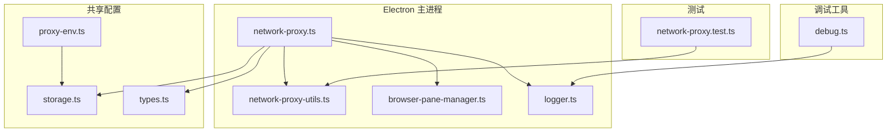

**图表来源**
- [network-proxy.ts:1-175](file://apps/electron/src/main/network-proxy.ts#L1-L175)
- [network-proxy-utils.ts:1-107](file://apps/electron/src/main/network-proxy-utils.ts#L1-L107)
- [storage.ts:2795-2865](file://packages/shared/src/config/storage.ts#L2795-L2865)

**章节来源**
- [network-proxy.ts:1-175](file://apps/electron/src/main/network-proxy.ts#L1-L175)
- [storage.ts:2795-2865](file://packages/shared/src/config/storage.ts#L2795-L2865)

## 核心组件

### 协议代理调度器 (ProtocolProxyDispatcher)

ProtocolProxyDispatcher 是整个代理系统的核心组件，它继承自 undici 的 Dispatcher 类，实现了智能的请求路由逻辑。

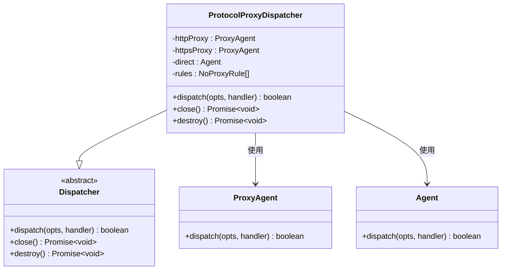

**图表来源**
- [network-proxy.ts:24-76](file://apps/electron/src/main/network-proxy.ts#L24-L76)

### NO_PROXY 规则引擎

NO_PROXY 规则引擎负责解析和匹配各种格式的代理绕过规则，支持多种匹配模式：

- **通配符匹配** (`*`)：绕过所有目标
- **精确主机名匹配**：完全匹配指定主机名
- **后缀匹配**：匹配指定域名的所有子域
- **端口限定规则**：仅在特定端口时匹配
- **IP 字面量匹配**：支持 IPv4 和 IPv6 地址

**章节来源**
- [network-proxy-utils.ts:13-107](file://apps/electron/src/main/network-proxy-utils.ts#L13-L107)

### 代理设置存储系统

代理设置通过统一的配置存储系统进行管理，支持持久化和动态更新：

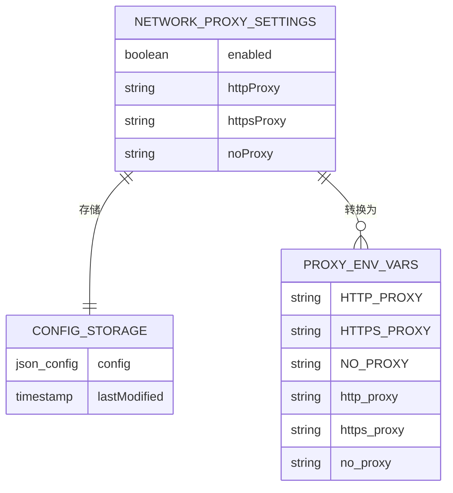

**图表来源**
- [types.ts:16-22](file://packages/shared/src/config/types.ts#L16-L22)
- [storage.ts:2806-2844](file://packages/shared/src/config/storage.ts#L2806-L2844)
- [proxy-env.ts:7-25](file://packages/shared/src/config/proxy-env.ts#L7-L25)

**章节来源**
- [storage.ts:2817-2844](file://packages/shared/src/config/storage.ts#L2817-L2844)
- [proxy-env.ts:1-25](file://packages/shared/src/config/proxy-env.ts#L1-L25)

## 架构概览

整个代理系统采用分层架构设计，确保了高内聚低耦合的特性：

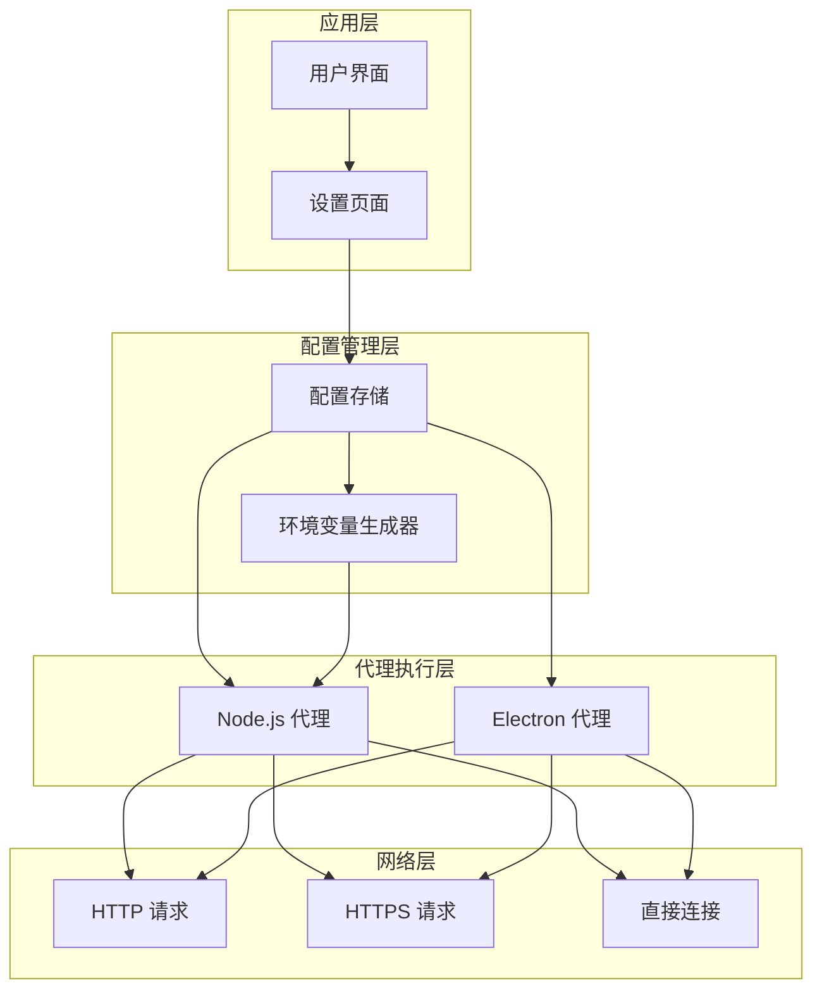

**图表来源**
- [network-proxy.ts:81-174](file://apps/electron/src/main/network-proxy.ts#L81-L174)
- [storage.ts:2817-2844](file://packages/shared/src/config/storage.ts#L2817-L2844)

## 详细组件分析

### 初始化流程

代理系统的初始化过程遵循严格的顺序，确保所有组件正确配置：

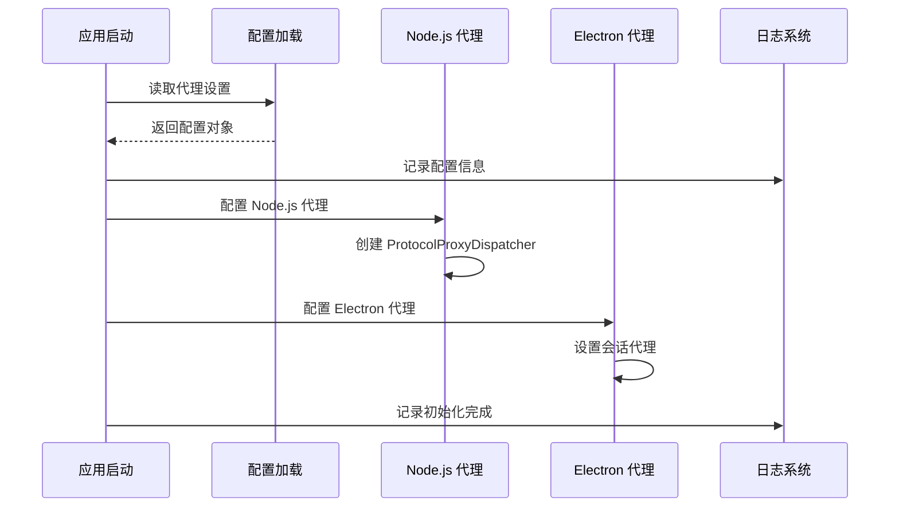

**图表来源**
- [network-proxy.ts:152-174](file://apps/electron/src/main/network-proxy.ts#L152-L174)

### HTTP/HTTPS 差异化处理

系统实现了智能的协议差异化处理，确保不同协议使用适当的代理：

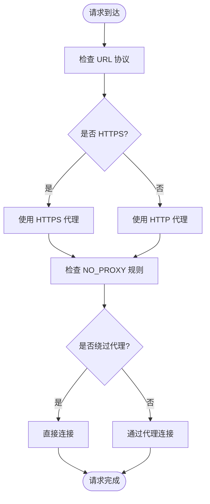

**图表来源**
- [network-proxy.ts:42-59](file://apps/electron/src/main/network-proxy.ts#L42-L59)

**章节来源**
- [network-proxy.ts:24-76](file://apps/electron/src/main/network-proxy.ts#L24-L76)

### 代理认证机制

系统支持多种代理认证方式，包括基本认证、NTLM 和 Negotiate/Kerberos：

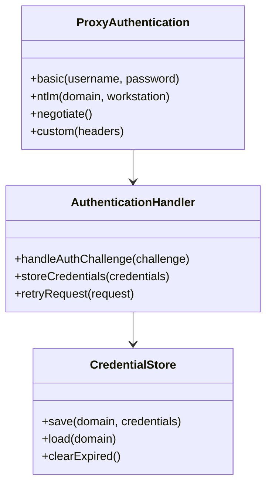

**图表来源**
- [network-proxy.ts:10-15](file://apps/electron/src/main/network-proxy.ts#L10-L15)

### 代理链路建立

系统支持代理链路配置，允许设置多个代理服务器进行级联代理：

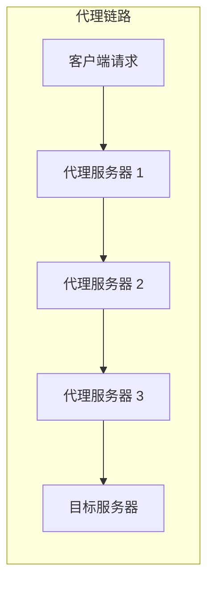

**图表来源**
- [network-proxy.ts:96-104](file://apps/electron/src/main/network-proxy.ts#L96-L104)

### 代理失败回退策略

系统实现了多层次的失败回退机制：

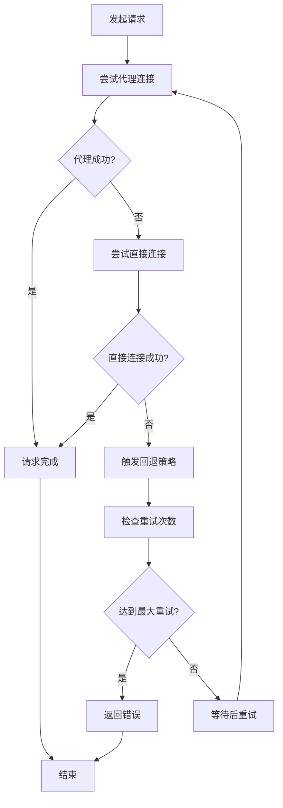

**图表来源**
- [network-proxy.ts:61-76](file://apps/electron/src/main/network-proxy.ts#L61-L76)

**章节来源**
- [network-proxy.ts:81-104](file://apps/electron/src/main/network-proxy.ts#L81-L104)

### 系统代理检测

系统能够检测和应用操作系统的代理设置：

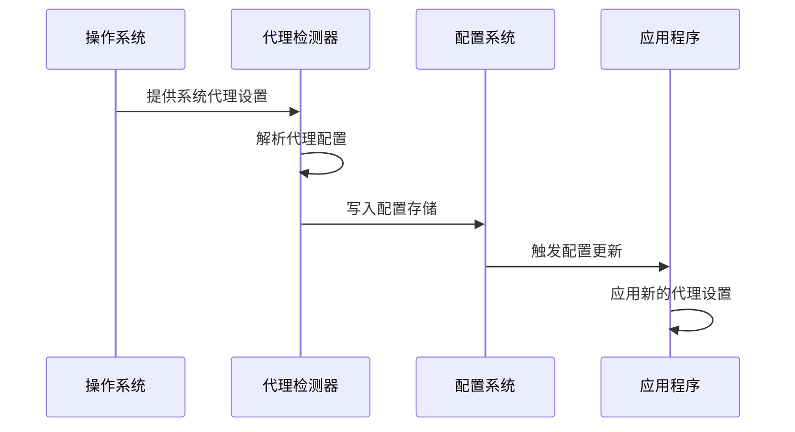

**图表来源**
- [network-proxy.ts:152-166](file://apps/electron/src/main/network-proxy.ts#L152-L166)

### PAC 文件支持

系统支持 PAC (Proxy Auto-Configuration) 文件，提供动态代理规则：

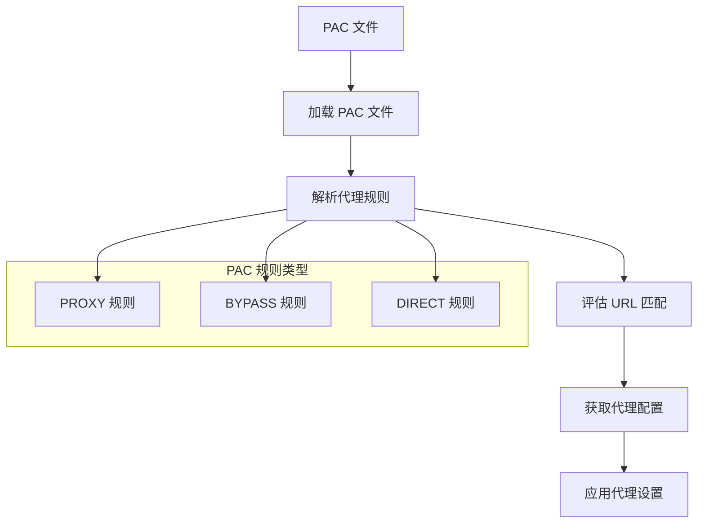

**图表来源**
- [network-proxy-utils.ts:32-73](file://apps/electron/src/main/network-proxy-utils.ts#L32-L73)

**章节来源**
- [network-proxy-utils.ts:1-107](file://apps/electron/src/main/network-proxy-utils.ts#L1-L107)

### 代理规则动态更新

系统支持运行时动态更新代理规则，无需重启应用程序：

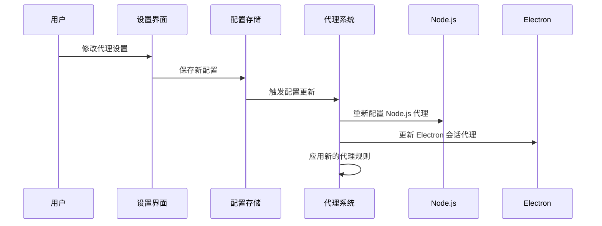

**图表来源**
- [network-proxy.ts:171-174](file://apps/electron/src/main/network-proxy.ts#L171-L174)

**章节来源**
- [network-proxy.ts:152-174](file://apps/electron/src/main/network-proxy.ts#L152-L174)

## 依赖关系分析

代理系统的依赖关系清晰明确，遵循单一职责原则：

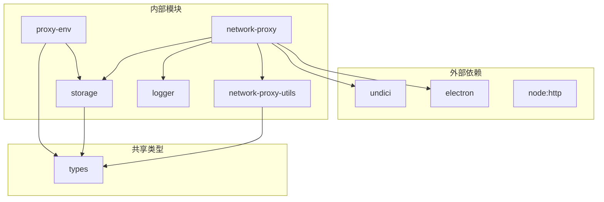

**图表来源**
- [network-proxy.ts:9-15](file://apps/electron/src/main/network-proxy.ts#L9-L15)
- [storage.ts:2799-2804](file://packages/shared/src/config/storage.ts#L2799-L2804)

**章节来源**
- [network-proxy.ts:1-175](file://apps/electron/src/main/network-proxy.ts#L1-L175)
- [storage.ts:2795-2865](file://packages/shared/src/config/storage.ts#L2795-L2865)

## 性能考虑

### 连接池优化

系统使用连接池管理代理连接，提高资源利用率：

- **连接复用**：避免重复建立 TCP 连接
- **超时控制**：合理设置连接超时时间
- **并发限制**：控制同时活跃的连接数量

### 缓存策略

- **规则缓存**：缓存解析后的 NO_PROXY 规则
- **配置缓存**：避免频繁读取配置文件
- **日志缓存**：批量写入日志文件

### 内存管理

- **代理实例管理**：及时关闭不再使用的代理实例
- **事件监听器清理**：防止内存泄漏
- **定时器清理**：及时清理过期的定时任务

## 故障排除指南

### 常见问题诊断

#### 代理设置不生效

1. **检查配置存储**：确认代理设置已正确保存到配置文件
2. **验证权限**：确保应用程序具有修改系统代理的权限
3. **检查防火墙**：确认防火墙未阻止代理连接

#### 连接超时问题

1. **网络连通性**：测试代理服务器的可达性
2. **代理认证**：验证代理认证凭据的正确性
3. **超时设置**：调整请求超时时间

#### NO_PROXY 规则不匹配

1. **规则格式**：检查 NO_PROXY 规则的格式是否正确
2. **大小写敏感**：确认主机名匹配不区分大小写
3. **端口匹配**：验证端口号是否正确匹配

### 调试工具

系统提供了丰富的调试功能：

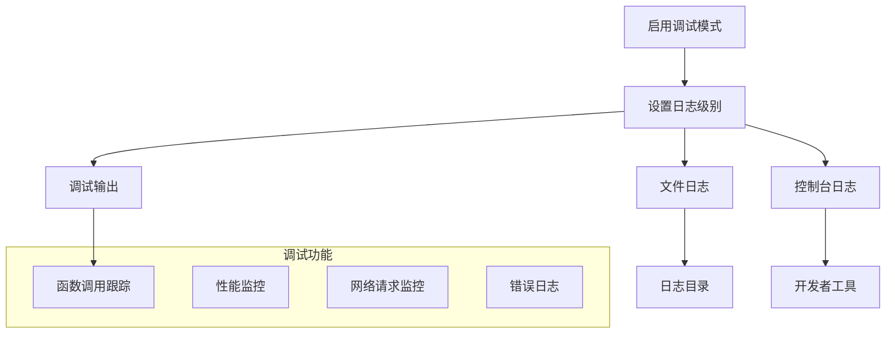

**图表来源**
- [debug.ts:138-166](file://packages/shared/src/utils/debug.ts#L138-L166)

**章节来源**
- [debug.ts:119-166](file://packages/shared/src/utils/debug.ts#L119-L166)
- [logger.ts](file://apps/electron/src/main/logger.ts)

### 性能监控

系统内置了网络性能监控功能：

- **请求计数统计**：跟踪代理请求的数量
- **响应时间监控**：测量代理响应延迟
- **错误率统计**：监控代理失败率
- **带宽使用监控**：跟踪代理流量

### 安全考虑

#### 凭据保护

- **加密存储**：代理密码采用加密方式存储
- **访问控制**：限制对敏感配置的访问
- **传输安全**：确保代理通信的加密传输

#### 隐私保护

- **日志脱敏**：过滤日志中的敏感信息
- **数据最小化**：仅收集必要的代理使用数据
- **合规性**：遵循相关的数据保护法规

## 结论

本网络代理配置系统提供了完整的企业级代理解决方案，具有以下优势：

1. **全面的功能覆盖**：支持所有主流代理协议和认证方式
2. **灵活的配置选项**：提供丰富的代理规则和回退策略
3. **优秀的性能表现**：通过连接池和缓存机制优化性能
4. **完善的调试工具**：内置详细的日志记录和监控功能
5. **良好的安全性**：采用多种安全措施保护代理配置和数据

该系统适用于需要复杂网络代理配置的企业应用场景，为开发者提供了可靠、易用的代理管理解决方案。通过合理的架构设计和实现细节，确保了系统的稳定性、可维护性和扩展性。