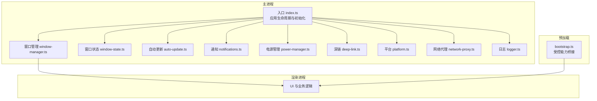
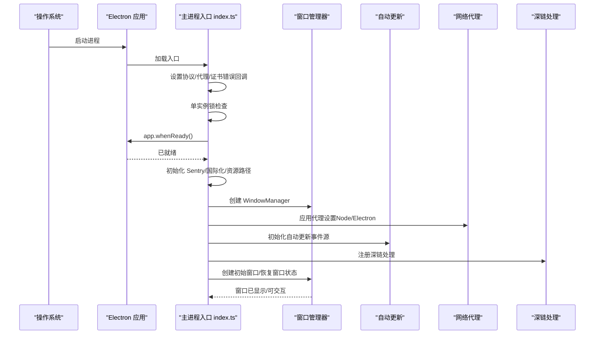
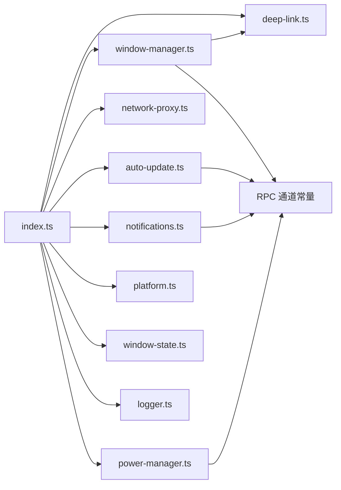

# 应用生命周期管理

<cite>
**本文引用的文件**
- [apps/electron/src/main/index.ts](file://apps/electron/src/main/index.ts)
- [apps/electron/src/main/auto-update.ts](file://apps/electron/src/main/auto-update.ts)
- [apps/electron/src/main/window-manager.ts](file://apps/electron/src/main/window-manager.ts)
- [apps/electron/src/main/window-state.ts](file://apps/electron/src/main/window-state.ts)
- [apps/electron/src/main/logger.ts](file://apps/electron/src/main/logger.ts)
- [apps/electron/src/main/notifications.ts](file://apps/electron/src/main/notifications.ts)
- [apps/electron/src/main/power-manager.ts](file://apps/electron/src/main/power-manager.ts)
- [apps/electron/src/main/deep-link.ts](file://apps/electron/src/main/deep-link.ts)
- [apps/electron/src/main/platform.ts](file://apps/electron/src/main/platform.ts)
- [apps/electron/src/main/chunked-rpc.ts](file://apps/electron/src/main/chunked-rpc.ts)
- [apps/electron/src/main/network-proxy.ts](file://apps/electron/src/main/network-proxy.ts)
- [apps/electron/package.json](file://apps/electron/package.json)
</cite>

## 目录
1. [简介](#简介)
2. [项目结构](#项目结构)
3. [核心组件](#核心组件)
4. [架构总览](#架构总览)
5. [详细组件分析](#详细组件分析)
6. [依赖关系分析](#依赖关系分析)
7. [性能考量](#性能考量)
8. [故障排除指南](#故障排除指南)
9. [结论](#结论)
10. [附录](#附录)

## 简介
本文件系统性梳理该 Electron 应用的生命周期管理，覆盖启动流程、初始化序列、资源加载顺序、应用准备阶段（app.whenReady）、单实例锁机制、窗口与会话管理、深链路由、自动更新集成、通知与徽章、电源管理、网络代理、崩溃与错误上报、性能监控与日志、以及退出与清理流程。文档同时提供生命周期钩子的使用方法、最佳实践与故障排除建议，帮助开发者快速理解并维护应用的启动与关闭流程。

## 项目结构
该 Electron 应用位于 apps/electron 目录，采用“主进程 + 渲染进程 + 预加载脚本”的标准分层组织。主进程入口负责应用生命周期、平台服务注入、服务器引导、RPC 注册、窗口管理、深链与通知等；渲染进程负责 UI 与业务逻辑；预加载脚本提供受限能力桥接。

图表来源
- [apps/electron/src/main/index.ts:361-705](file://apps/electron/src/main/index.ts#L361-L705)
- [apps/electron/src/main/window-manager.ts:104-408](file://apps/electron/src/main/window-manager.ts#L104-L408)
- [apps/electron/src/main/window-state.ts:38-76](file://apps/electron/src/main/window-state.ts#L38-L76)
- [apps/electron/src/main/auto-update.ts:112-221](file://apps/electron/src/main/auto-update.ts#L112-L221)
- [apps/electron/src/main/notifications.ts:31-44](file://apps/electron/src/main/notifications.ts#L31-L44)
- [apps/electron/src/main/power-manager.ts:25-79](file://apps/electron/src/main/power-manager.ts#L25-L79)
- [apps/electron/src/main/deep-link.ts:235-342](file://apps/electron/src/main/deep-link.ts#L235-L342)
- [apps/electron/src/main/platform.ts:21-72](file://apps/electron/src/main/platform.ts#L21-L72)
- [apps/electron/src/main/network-proxy.ts:152-174](file://apps/electron/src/main/network-proxy.ts#L152-L174)
- [apps/electron/src/main/logger.ts:38-68](file://apps/electron/src/main/logger.ts#L38-L68)

章节来源
- [apps/electron/src/main/index.ts:1-120](file://apps/electron/src/main/index.ts#L1-L120)
- [apps/electron/package.json:1-84](file://apps/electron/package.json#L1-L84)

## 核心组件
- 应用入口与生命周期：在入口文件中完成环境变量与工具链初始化、协议注册、代理设置、深链处理、单实例锁、app.whenReady 后的完整初始化序列，并在退出前进行资源清理。
- 窗口管理器：统一创建、聚焦、关闭窗口，支持深链导航、主题变化广播、键盘快捷键识别、关闭拦截与回退销毁。
- 窗口状态持久化：保存窗口边界、焦点模式与 URL，用于重启后恢复。
- 自动更新：基于 electron-updater 的检查、下载、安装与事件广播，支持跨平台行为与进度跟踪。
- 通知与徽章：原生通知、跨平台徽章绘制与实例徽章（macOS）。
- 电源管理：根据会话运行状态与用户设置阻止屏幕休眠。
- 深链处理：解析 craftagents:// URL 并路由到指定工作区或动作。
- 平台服务：将 Electron 能力抽象为可注入的 PlatformServices。
- 网络代理：统一 Node 与 Electron 会话代理配置，支持按规则绕过代理。
- 日志与错误上报：结构化日志、调试模式开关、Sentry 错误采集与脱敏。

章节来源
- [apps/electron/src/main/index.ts:361-705](file://apps/electron/src/main/index.ts#L361-L705)
- [apps/electron/src/main/window-manager.ts:53-647](file://apps/electron/src/main/window-manager.ts#L53-L647)
- [apps/electron/src/main/window-state.ts:27-76](file://apps/electron/src/main/window-state.ts#L27-L76)
- [apps/electron/src/main/auto-update.ts:56-126](file://apps/electron/src/main/auto-update.ts#L56-L126)
- [apps/electron/src/main/notifications.ts:18-44](file://apps/electron/src/main/notifications.ts#L18-L44)
- [apps/electron/src/main/power-manager.ts:12-79](file://apps/electron/src/main/power-manager.ts#L12-L79)
- [apps/electron/src/main/deep-link.ts:43-72](file://apps/electron/src/main/deep-link.ts#L43-L72)
- [apps/electron/src/main/platform.ts:21-72](file://apps/electron/src/main/platform.ts#L21-L72)
- [apps/electron/src/main/network-proxy.ts:152-174](file://apps/electron/src/main/network-proxy.ts#L152-L174)
- [apps/electron/src/main/logger.ts:11-36](file://apps/electron/src/main/logger.ts#L11-L36)

## 架构总览
下图展示应用启动到就绪的关键路径与模块交互：

图表来源
- [apps/electron/src/main/index.ts:210-306](file://apps/electron/src/main/index.ts#L210-L306)
- [apps/electron/src/main/index.ts:361-432](file://apps/electron/src/main/index.ts#L361-L432)
- [apps/electron/src/main/network-proxy.ts:152-174](file://apps/electron/src/main/network-proxy.ts#L152-L174)
- [apps/electron/src/main/auto-update.ts:81-126](file://apps/electron/src/main/auto-update.ts#L81-L126)
- [apps/electron/src/main/deep-link.ts:268-280](file://apps/electron/src/main/deep-link.ts#L268-L280)
- [apps/electron/src/main/window-manager.ts:104-408](file://apps/electron/src/main/window-manager.ts#L104-L408)

## 详细组件分析

### 启动流程与初始化序列
- 环境与工具链：优先加载 shell 环境，确保工具链可用；初始化 Sentry（生产构建启用，带敏感数据脱敏）与国际化。
- 资源与路径：设置打包/开发态资源根目录、CLI 工具路径、命令入口、文档与脚本路径等环境变量。
- 协议与代理：注册自定义协议（深链）、早期应用网络代理（Node 级），app.whenReady 后再次应用 Electron 会话代理。
- 证书校验：针对用户配置的远程服务器地址，对证书错误进行精确来源匹配与豁免。
- 协议注册：注册缩略图协议（thumbnail://）以支持侧边栏预览。
- 单实例锁：请求单实例锁，失败则直接退出；成功则监听 second-instance 事件以处理深链与窗口聚焦。
- 深链处理：macOS 使用 open-url，Linux/Windows 在 second-instance 中提取命令行参数中的深链。
- app.whenReady：在此之后执行完整初始化（窗口管理器、菜单、平台服务注入、RPC 服务器引导、消息网关、通知服务、浏览器面板管理器、窗口恢复与创建）。

章节来源
- [apps/electron/src/main/index.ts:1-120](file://apps/electron/src/main/index.ts#L1-L120)
- [apps/electron/src/main/index.ts:210-280](file://apps/electron/src/main/index.ts#L210-L280)
- [apps/electron/src/main/index.ts:282-306](file://apps/electron/src/main/index.ts#L282-L306)
- [apps/electron/src/main/index.ts:361-432](file://apps/electron/src/main/index.ts#L361-L432)

### 应用准备阶段（app.whenReady）
- 关键时机：在 app.whenReady 回调内执行所有需要 Electron 运行时可用的功能，包括窗口创建、菜单重建、RPC 服务器引导、消息网关初始化、通知服务、浏览器面板管理器、代理重新应用等。
- 服务器引导：通过共享的 bootstrapServer 创建 RPC 服务器，注入平台服务、会话管理器、处理器依赖、模型刷新服务、事件推送与清理资源等。
- 消息网关：在 createHandlerDeps 中构建消息网关句柄，随后在服务器启动后设置发布器、初始化本地工作区、组合扇出事件接收器。
- 客户端映射：建立 webContentsId 到客户端 ID 的映射，以便精准推送事件。

章节来源
- [apps/electron/src/main/index.ts:434-742](file://apps/electron/src/main/index.ts#L434-L742)

### 单实例锁机制
- 请求锁：调用 requestSingleInstanceLock 获取锁，失败则立即 app.quit。
- 第二实例处理：若收到 second-instance 事件，尝试从命令行参数中解析 craftagents:// URL，若存在则交由深链处理器；否则聚焦第一个窗口。
- 多实例开发：支持通过环境变量为不同实例设置不同的应用名称与 Dock 徽章数字。

章节来源
- [apps/electron/src/main/index.ts:282-306](file://apps/electron/src/main/index.ts#L282-L306)

### 应用退出处理与清理
- before-quit 钩子：标记 isAppQuitting，避免关闭拦截逻辑影响 Cmd+Q 行为；等待会话写入完成（必要时阻塞退出）；保存窗口状态；清理消息网关与会话文件监听；释放电源阻止器。
- 更新期间退出：若检测到更新进行中，让 electron-updater 处理退出流程，避免强制退出破坏安装程序。
- 退出路径：正常退出、更新退出、异常退出均需保证资源释放与状态持久化。

章节来源
- [apps/electron/src/main/index.ts:1101-1172](file://apps/electron/src/main/index.ts#L1101-L1172)
- [apps/electron/src/main/power-manager.ts:101-109](file://apps/electron/src/main/power-manager.ts#L101-L109)

### 窗口管理与状态持久化
- 窗口创建：根据平台特性设置窗口样式（macOS 隐藏标题栏、Windows 透明材质、Linux 原生框架），延迟显示以提升感知速度；加载 URL 时区分开发与生产态；失败重试与回退策略。
- 关闭拦截：区分 traffic-light、菜单与键盘快捷键触发的关闭；发送 CLOSE_REQUESTED 给渲染端，允许其先关闭模态或面板；超时回退销毁窗口。
- 状态持久化：保存窗口边界、焦点模式与完整 URL（查询参数与路由），重启时恢复窗口与当前页面。
- 事件广播：主题变化、焦点状态变更、键盘快捷键意图等通过 RPC 或 webContents 发送。

章节来源
- [apps/electron/src/main/window-manager.ts:104-408](file://apps/electron/src/main/window-manager.ts#L104-L408)
- [apps/electron/src/main/window-state.ts:38-76](file://apps/electron/src/main/window-state.ts#L38-L76)

### 自动更新集成
- 配置：启用自动下载与退出时安装；使用内部 logger 记录更新器日志；事件包括检查、可用、下载进度、已下载、错误等。
- 状态与广播：维护 UpdateInfo 结构，通过事件源向渲染端广播更新状态与进度。
- 文件缓存检测：在 electron-updater 内部状态不可靠时，回退到缓存目录文件检查，提高准确性。
- 安装：调用 quitAndInstall 执行平台特定安装流程（macOS 解压替换、Windows 静默安装、Linux 替换 AppImage）。

章节来源
- [apps/electron/src/main/auto-update.ts:112-221](file://apps/electron/src/main/auto-update.ts#L112-L221)
- [apps/electron/src/main/auto-update.ts:229-308](file://apps/electron/src/main/auto-update.ts#L229-L308)
- [apps/electron/src/main/auto-update.ts:316-361](file://apps/electron/src/main/auto-update.ts#L316-L361)
- [apps/electron/src/main/auto-update.ts:371-398](file://apps/electron/src/main/auto-update.ts#L371-L398)

### 通知与徽章
- 通知：当应用未聚焦时显示原生通知，点击后聚焦窗口并导航至对应会话。
- 徽章：跨平台更新徽章计数；macOS 使用 Canvas 绘制叠加图标；Windows 使用任务栏覆盖图标；Linux 使用 setBadgeCount。
- 实例徽章：多实例开发时在 Dock 显示实例号徽章。

章节来源
- [apps/electron/src/main/notifications.ts:31-44](file://apps/electron/src/main/notifications.ts#L31-L44)
- [apps/electron/src/main/notifications.ts:152-253](file://apps/electron/src/main/notifications.ts#L152-L253)
- [apps/electron/src/main/notifications.ts:279-295](file://apps/electron/src/main/notifications.ts#L279-L295)

### 电源管理
- 功能：根据“保持唤醒”设置与活动会话数量，使用 powerSaveBlocker 阻止屏幕休眠。
- 生命周期：初始化读取设置；会话开始/结束回调更新状态；退出清理。

章节来源
- [apps/electron/src/main/power-manager.ts:25-79](file://apps/electron/src/main/power-manager.ts#L25-L79)
- [apps/electron/src/main/power-manager.ts:101-109](file://apps/electron/src/main/power-manager.ts#L101-L109)

### 深链处理
- 解析：支持复合视图与动作两类格式，解析工作区、视图、动作与参数；支持 window=focused/full 与 sidebar 参数。
- 导航：根据目标工作区或当前窗口，等待渲染就绪后通过 RPC 发送 NAVIGATE 事件；支持新建窗口模式。
- 兼容：OAuth 回调等特殊 URL 交由其他处理器处理。

章节来源
- [apps/electron/src/main/deep-link.ts:95-200](file://apps/electron/src/main/deep-link.ts#L95-L200)
- [apps/electron/src/main/deep-link.ts:235-342](file://apps/electron/src/main/deep-link.ts#L235-L342)

### 平台服务注入
- 抽象：将 app、shell、nativeTheme、图像处理、日志、调试模式、错误捕获等封装为 PlatformServices，供 bootstrapServer 注入到各子系统。
- 图像处理：支持元数据读取与尺寸调整、格式转换（PNG/JPEG）。

章节来源
- [apps/electron/src/main/platform.ts:21-72](file://apps/electron/src/main/platform.ts#L21-L72)

### 网络代理
- Node 侧：通过自定义 Dispatcher 将 HTTP/HTTPS 分别路由到对应 ProxyAgent，尊重 NO_PROXY 规则。
- Electron 侧：在 app 就绪后为默认会话与浏览器面板分区会话设置代理。
- 配置：支持持久化读取与动态更新，应用即时生效。

章节来源
- [apps/electron/src/main/network-proxy.ts:24-104](file://apps/electron/src/main/network-proxy.ts#L24-L104)
- [apps/electron/src/main/network-proxy.ts:110-146](file://apps/electron/src/main/network-proxy.ts#L110-L146)
- [apps/electron/src/main/network-proxy.ts:152-174](file://apps/electron/src/main/network-proxy.ts#L152-L174)

### 大型负载传输（Chunked RPC）
- 场景：当 RPC 参数过大时，拆分为 base64 块，通过 transfer:start/chunk/commit 协议传输，支持每块最多重试。
- 用途：用于会话迁移等大包场景，保障代理与隧道稳定性。

章节来源
- [apps/electron/src/main/chunked-rpc.ts:63-144](file://apps/electron/src/main/chunked-rpc.ts#L63-L144)

### 性能监控与日志
- 日志：调试模式下输出到文件与控制台，结构化 JSON；生产模式禁用文件与控制台传输。
- 性能：在开发模式启用性能开关；Sentry 采集错误并脱敏敏感头与面包屑。
- 专用日志：消息网关日志独立文件，便于排查。

章节来源
- [apps/electron/src/main/logger.ts:38-68](file://apps/electron/src/main/logger.ts#L38-L68)
- [apps/electron/src/main/logger.ts:141-175](file://apps/electron/src/main/logger.ts#L141-L175)
- [apps/electron/src/main/index.ts:113-117](file://apps/electron/src/main/index.ts#L113-L117)

## 依赖关系分析

图表来源
- [apps/electron/src/main/index.ts:74-106](file://apps/electron/src/main/index.ts#L74-L106)
- [apps/electron/src/main/window-manager.ts:8-10](file://apps/electron/src/main/window-manager.ts#L8-L10)
- [apps/electron/src/main/auto-update.ts:29-30](file://apps/electron/src/main/auto-update.ts#L29-L30)
- [apps/electron/src/main/notifications.ts:14-16](file://apps/electron/src/main/notifications.ts#L14-L16)
- [apps/electron/src/main/power-manager.ts:9-10](file://apps/electron/src/main/power-manager.ts#L9-L10)

章节来源
- [apps/electron/src/main/index.ts:74-106](file://apps/electron/src/main/index.ts#L74-L106)

## 性能考量
- 启动优化：延迟显示窗口、避免在启动阶段进行昂贵操作；仅在 app.whenReady 后应用 Electron 级代理。
- 窗口体验：使用 ready-to-show 提升感知速度；失败重试与回退到默认页面避免白屏。
- 传输效率：大负载使用分块 RPC，减少单次消息大小与代理限制风险。
- 代理与证书：精确来源匹配证书错误，避免全局放宽导致的安全问题与连接失败。
- 日志与调试：仅在调试模式启用详细日志与控制台输出，避免生产环境开销。

## 故障排除指南
- 启动无窗口或白屏
  - 检查 did-fail-load 回退逻辑是否生效；确认开发模式下 Vite 服务可用。
  - 参考：[apps/electron/src/main/window-manager.ts:271-283](file://apps/electron/src/main/window-manager.ts#L271-L283)
- 深链无法打开或路由错误
  - 确认协议注册与 second-instance/open-url 处理；检查 URL 格式与 workspaceId。
  - 参考：[apps/electron/src/main/index.ts:268-280](file://apps/electron/src/main/index.ts#L268-L280)，[apps/electron/src/main/deep-link.ts:95-200](file://apps/electron/src/main/deep-link.ts#L95-L200)
- 更新无法安装或中断
  - 检查下载状态与缓存文件；确认 quitAndInstall 是否被调用且未被 force 退出打断。
  - 参考：[apps/electron/src/main/auto-update.ts:371-398](file://apps/electron/src/main/auto-update.ts#L371-L398)
- 通知不显示或徽章不更新
  - 检查平台支持与权限；macOS 需要 Canvas 绘制与 RPC 通道配合。
  - 参考：[apps/electron/src/main/notifications.ts:152-253](file://apps/electron/src/main/notifications.ts#L152-L253)
- 屏幕休眠导致会话中断
  - 确认“保持唤醒”设置与会话状态；查看 powerSaveBlocker 状态。
  - 参考：[apps/electron/src/main/power-manager.ts:37-70](file://apps/electron/src/main/power-manager.ts#L37-L70)
- 代理无效或绕过规则不生效
  - 检查 NO_PROXY 规则解析与 Electron 会话代理配置时机。
  - 参考：[apps/electron/src/main/network-proxy.ts:24-104](file://apps/electron/src/main/network-proxy.ts#L24-L104)

章节来源
- [apps/electron/src/main/window-manager.ts:271-283](file://apps/electron/src/main/window-manager.ts#L271-L283)
- [apps/electron/src/main/deep-link.ts:95-200](file://apps/electron/src/main/deep-link.ts#L95-L200)
- [apps/electron/src/main/auto-update.ts:371-398](file://apps/electron/src/main/auto-update.ts#L371-L398)
- [apps/electron/src/main/notifications.ts:152-253](file://apps/electron/src/main/notifications.ts#L152-L253)
- [apps/electron/src/main/power-manager.ts:37-70](file://apps/electron/src/main/power-manager.ts#L37-L70)
- [apps/electron/src/main/network-proxy.ts:24-104](file://apps/electron/src/main/network-proxy.ts#L24-L104)

## 结论
该应用通过清晰的生命周期划分与模块化设计，实现了稳定的启动、窗口与会话管理、深链与通知、自动更新、电源与代理、日志与错误上报等关键能力。遵循 app.whenReady 的初始化顺序、严格的单实例锁与深链处理、以及完善的退出清理流程，确保了用户体验与系统资源的合理利用。建议在后续迭代中持续关注代理规则、证书校验与大负载传输的健壮性，并完善自动化测试覆盖关键路径。

## 附录
- 生命周期钩子使用要点
  - app.whenReady：所有需要 Electron 运行时的功能在此回调中初始化。
  - before-quit：保存状态、清理资源、阻塞退出直至安全完成。
  - open-url/second-instance：处理深链，聚焦窗口或创建新窗口。
  - ready-to-show：延迟显示窗口，提升感知速度。
- 最佳实践
  - 将昂贵操作移出启动阶段，集中在 app.whenReady 之后。
  - 对外部证书错误进行精确来源匹配，避免全局放宽。
  - 使用分块 RPC 传输大负载，增强网络稳定性。
  - 在调试模式开启日志与性能监控，生产模式关闭冗余输出。
  - 退出前确保会话写入完成，避免数据丢失。