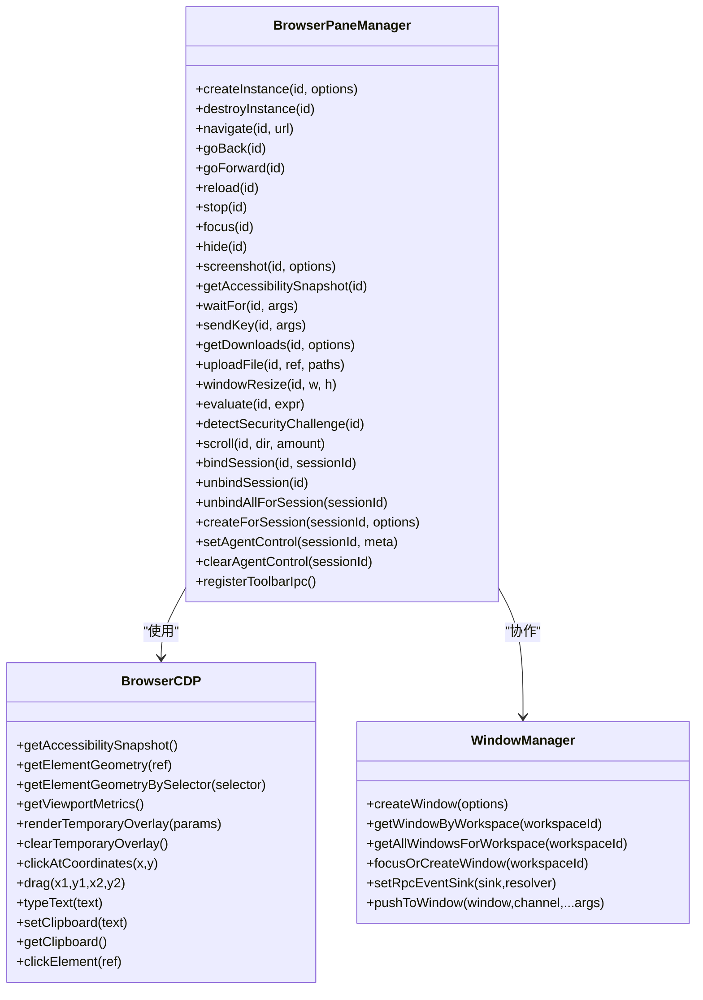
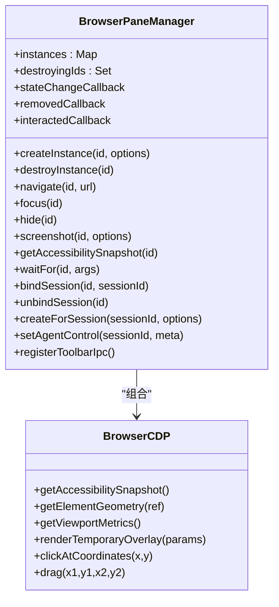
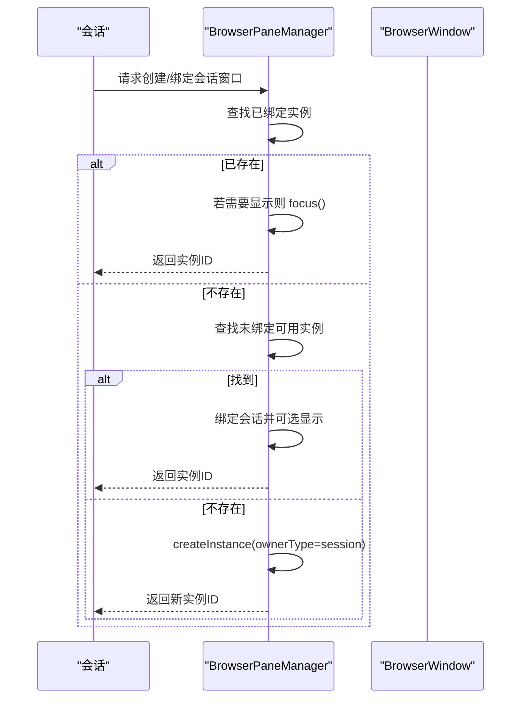
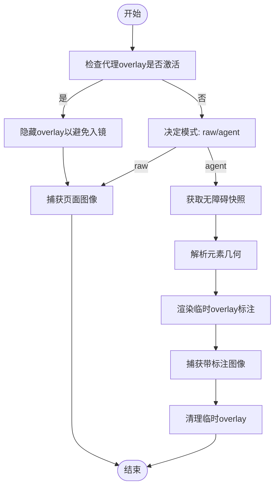
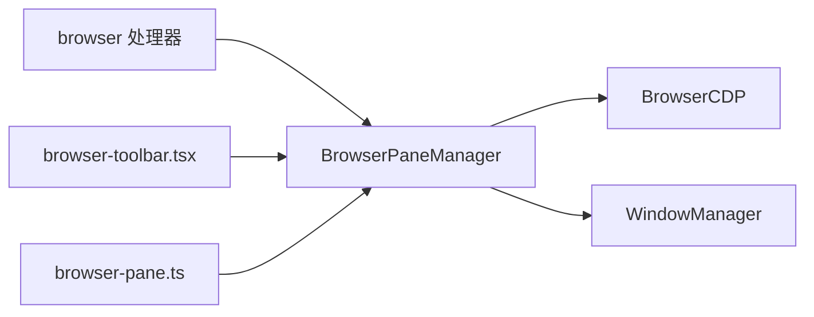

# 浏览器窗格管理

<cite>
**本文档引用的文件**
- [browser-pane-manager.ts](file://apps/electron/src/main/browser-pane-manager.ts)
- [browser-cdp.ts](file://apps/electron/src/main/browser-cdp.ts)
- [browser.ts](file://apps/electron/src/main/handlers/browser.ts)
- [window-manager.ts](file://apps/electron/src/main/window-manager.ts)
- [browser-toolbar.tsx](file://apps/electron/src/renderer/browser-toolbar.tsx)
- [browser-pane.ts](file://apps/electron/src/renderer/atoms/browser-pane.ts)
</cite>

## 目录
1. [简介](#简介)
2. [项目结构](#项目结构)
3. [核心组件](#核心组件)
4. [架构总览](#架构总览)
5. [详细组件分析](#详细组件分析)
6. [依赖关系分析](#依赖关系分析)
7. [性能考量](#性能考量)
8. [故障排查指南](#故障排查指南)
9. [结论](#结论)
10. [附录](#附录)

## 简介
本文件系统化阐述浏览器窗格管理系统的设计与实现，重点围绕 BrowserPaneManager 的架构与行为，覆盖多窗格窗口协调、窗格间通信协议、动态创建/销毁流程、生命周期管理、复杂浏览器集成场景（标签页管理、历史记录同步、书签共享）、配置选项与性能优化、以及与主窗口管理器的交互模式与多工作区扩展性。

## 项目结构
该系统采用主进程-渲染进程分层架构：
- 主进程负责浏览器实例生命周期、会话绑定、网络与下载日志、截图与无障碍快照、主题色提取与观察、弹窗管理等
- 渲染进程通过 Jotai 原子同步主进程状态，浏览器工具栏以 React 组件形式与主进程通过专用 IPC 通道通信
- 窗口管理器负责应用级主窗口的创建、聚焦、关闭与广播事件

```mermaid
graph TB
subgraph "主进程"
BPM["BrowserPaneManager<br/>浏览器窗格管理器"]
CDP["BrowserCDP<br/>DevTools 协议封装"]
WM["WindowManager<br/>窗口管理器"]
H["browser 处理器<br/>RPC 通道注册"]
end
subgraph "渲染进程"
RT["browser-toolbar.tsx<br/>浏览器工具栏"]
RA["browser-pane.ts<br/>Jotai 原子"]
end
H --> BPM
BPM --> CDP
BPM --> WM
RT <- --> BPM
RA <- --> BPM
```

图表来源
- [browser-pane-manager.ts:312-3157](file://apps/electron/src/main/browser-pane-manager.ts#L312-L3157)
- [browser-cdp.ts:93-1062](file://apps/electron/src/main/browser-cdp.ts#L93-L1062)
- [window-manager.ts:53-647](file://apps/electron/src/main/window-manager.ts#L53-L647)
- [browser.ts:26-184](file://apps/electron/src/main/handlers/browser.ts#L26-L184)
- [browser-toolbar.tsx:1-233](file://apps/electron/src/renderer/browser-toolbar.tsx#L1-L233)
- [browser-pane.ts:1-83](file://apps/electron/src/renderer/atoms/browser-pane.ts#L1-L83)

章节来源
- [browser-pane-manager.ts:1-3157](file://apps/electron/src/main/browser-pane-manager.ts#L1-L3157)
- [browser-cdp.ts:1-1062](file://apps/electron/src/main/browser-cdp.ts#L1-L1062)
- [window-manager.ts:1-647](file://apps/electron/src/main/window-manager.ts#L1-L647)
- [browser.ts:1-185](file://apps/electron/src/main/handlers/browser.ts#L1-L185)
- [browser-toolbar.tsx:1-233](file://apps/electron/src/renderer/browser-toolbar.tsx#L1-L233)
- [browser-pane.ts:1-83](file://apps/electron/src/renderer/atoms/browser-pane.ts#L1-L83)

## 核心组件
- BrowserPaneManager：主进程核心类，负责每个浏览器实例的创建、销毁、状态同步、会话绑定、截图、等待、键盘输入、下载、安全挑战检测、代理 overlay 等
- BrowserCDP：基于 Electron Debugger API 的 CDP 封装，提供无障碍快照、元素几何、临时 overlay、坐标点击/拖拽、剪贴板读写等
- WindowManager：应用级主窗口管理，负责窗口创建、聚焦、关闭、RPC 事件推送、工作区关联
- browser 处理器：注册 RPC 通道，桥接渲染进程与 BrowserPaneManager
- 浏览器工具栏（React）：渲染 UI 并通过专用 IPC 通道与主进程交互
- 浏览器原子（Jotai）：渲染进程侧状态同步与派发

章节来源
- [browser-pane-manager.ts:312-3157](file://apps/electron/src/main/browser-pane-manager.ts#L312-L3157)
- [browser-cdp.ts:93-1062](file://apps/electron/src/main/browser-cdp.ts#L93-L1062)
- [window-manager.ts:53-647](file://apps/electron/src/main/window-manager.ts#L53-L647)
- [browser.ts:26-184](file://apps/electron/src/main/handlers/browser.ts#L26-L184)
- [browser-toolbar.tsx:1-233](file://apps/electron/src/renderer/browser-toolbar.tsx#L1-L233)
- [browser-pane.ts:1-83](file://apps/electron/src/renderer/atoms/browser-pane.ts#L1-L83)

## 架构总览
BrowserPaneManager 以“每实例一原生窗口”的方式组织，使用 BrowserView 分层渲染（页面视图、工具栏视图、原生 overlay 视图），并通过 Electron Session 共享 Cookie/分区，支持 CDP 自动化与主题色观察。主进程通过 RPC 通道向渲染进程广播状态变更，渲染进程通过 Jotai 原子保持 UI 与状态一致。



图表来源
- [browser-pane-manager.ts:312-3157](file://apps/electron/src/main/browser-pane-manager.ts#L312-L3157)
- [browser-cdp.ts:93-1062](file://apps/electron/src/main/browser-cdp.ts#L93-L1062)
- [window-manager.ts:53-647](file://apps/electron/src/main/window-manager.ts#L53-L647)

## 详细组件分析

### BrowserPaneManager 设计与实现
- 实例模型与状态
  - 每个实例包含 BrowserWindow、页面 BrowserView、工具栏 BrowserView、原生 overlay BrowserView、CDP 客户端、主题色、网络/控制台/下载日志、代理 overlay 状态、可见性与交互锁等字段
  - 使用 Map 存储实例，Set 跟踪销毁中实例，避免竞态
- 生命周期管理
  - 创建：按分区创建会话、设置权限与观察者、构建窗口与三层 BrowserView、布局、安装监听、发出初始状态
  - 销毁：清理定时器、关闭弹窗、释放交互锁、销毁窗口、最终清理映射
  - 可见性：延迟显示直到工具栏就绪；隐藏时中断加载防止 compositor 断言
- 会话绑定与复用
  - 支持按会话创建/绑定/解绑，优先复用未绑定的空闲窗口，减少窗口碎片
  - 提供按会话清理代理 overlay 的能力
- 窗口与弹窗管理
  - 记录父实例到弹窗集合，拦截/清理弹窗，避免孤儿窗口
  - 重定向/失败加载日志化
- 主题色与观察
  - 首次导航与 SPA 导航后提取主题色，安装 MutationObserver/RAF 节流观察，避免闪烁
- 截图与注释
  - 支持 raw/agent 模式，自动降采样与格式编码；可叠加无障碍节点几何与元数据；失败时自动恢复可见性
- 等待与交互
  - 提供选择器/文本/URL/网络空闲等待；坐标点击/拖拽/键入；剪贴板读写
- 下载与日志
  - 自动保存路径、去重命名、进度更新、终端状态回调；限制日志长度
- 深链与空状态
  - 解析深链并交由窗口管理器处理；空状态页内触发路由启动
- RPC 与渲染同步
  - 注册工具栏 IPC；广播状态变更、移除与交互事件；渲染进程通过 Jotai 原子接收

章节来源
- [browser-pane-manager.ts:312-3157](file://apps/electron/src/main/browser-pane-manager.ts#L312-L3157)

#### 类关系图（代码级）


图表来源
- [browser-pane-manager.ts:312-3157](file://apps/electron/src/main/browser-pane-manager.ts#L312-L3157)
- [browser-cdp.ts:93-1062](file://apps/electron/src/main/browser-cdp.ts#L93-L1062)

### 会话绑定与复用流程


图表来源
- [browser-pane-manager.ts:1736-1762](file://apps/electron/src/main/browser-pane-manager.ts#L1736-L1762)

章节来源
- [browser-pane-manager.ts:1728-1762](file://apps/electron/src/main/browser-pane-manager.ts#L1728-L1762)

### 截图与注释流程


图表来源
- [browser-pane-manager.ts:1009-1148](file://apps/electron/src/main/browser-pane-manager.ts#L1009-L1148)
- [browser-cdp.ts:475-571](file://apps/electron/src/main/browser-cdp.ts#L475-L571)

章节来源
- [browser-pane-manager.ts:1009-1148](file://apps/electron/src/main/browser-pane-manager.ts#L1009-L1148)
- [browser-cdp.ts:475-571](file://apps/electron/src/main/browser-cdp.ts#L475-L571)

### 工具栏 IPC 交互
- 主进程注册工具栏 IPC 通道（导航、前进后退、刷新、停止、菜单几何、隐藏、销毁、状态更新、主题色）
- 渲染进程工具栏通过全局对象暴露 API，订阅状态与主题色，发送动作请求
- 主进程在 did-finish-load 后标记工具栏就绪，触发延迟显示

章节来源
- [browser-pane-manager.ts:2227-2295](file://apps/electron/src/main/browser-pane-manager.ts#L2227-L2295)
- [browser-toolbar.tsx:1-233](file://apps/electron/src/renderer/browser-toolbar.tsx#L1-L233)

### 渲染进程状态同步
- Jotai 原子维护实例映射、活跃实例、移除墓碑集
- 主进程 onStateChange/onRemoved/onInteracted 广播事件，渲染进程原子更新
- 用于 UI 列表、标签页切换、焦点对齐

章节来源
- [browser-pane.ts:1-83](file://apps/electron/src/renderer/atoms/browser-pane.ts#L1-L83)
- [browser.ts:170-183](file://apps/electron/src/main/handlers/browser.ts#L170-L183)

### 与主窗口管理器的交互
- BrowserPaneManager 通过 WindowManager 获取当前工作区、聚焦窗口、RPC 事件推送
- 深链处理委托给 WindowManager，利用 RPC 通道将导航指令推送到渲染进程
- 窗口关闭拦截与恢复逻辑避免误关，支持键盘快捷键识别

章节来源
- [browser-pane-manager.ts:614-627](file://apps/electron/src/main/browser-pane-manager.ts#L614-L627)
- [browser-pane-manager.ts:2077-2098](file://apps/electron/src/main/browser-pane-manager.ts#L2077-L2098)
- [window-manager.ts:53-647](file://apps/electron/src/main/window-manager.ts#L53-L647)

## 依赖关系分析
- BrowserPaneManager 依赖 BrowserCDP 进行自动化操作与截图注释
- 通过 RPC 通道与渲染进程交互，依赖 WindowManager 协助深链与窗口广播
- 渲染进程依赖 Jotai 原子与工具栏组件进行 UI 展示与用户交互



图表来源
- [browser-pane-manager.ts:312-3157](file://apps/electron/src/main/browser-pane-manager.ts#L312-L3157)
- [browser-cdp.ts:93-1062](file://apps/electron/src/main/browser-cdp.ts#L93-L1062)
- [window-manager.ts:53-647](file://apps/electron/src/main/window-manager.ts#L53-L647)
- [browser.ts:26-184](file://apps/electron/src/main/handlers/browser.ts#L26-L184)
- [browser-toolbar.tsx:1-233](file://apps/electron/src/renderer/browser-toolbar.tsx#L1-L233)
- [browser-pane.ts:1-83](file://apps/electron/src/renderer/atoms/browser-pane.ts#L1-L83)

章节来源
- [browser-pane-manager.ts:312-3157](file://apps/electron/src/main/browser-pane-manager.ts#L312-L3157)
- [browser-cdp.ts:93-1062](file://apps/electron/src/main/browser-cdp.ts#L93-L1062)
- [window-manager.ts:53-647](file://apps/electron/src/main/window-manager.ts#L53-L647)
- [browser.ts:26-184](file://apps/electron/src/main/handlers/browser.ts#L26-L184)
- [browser-toolbar.tsx:1-233](file://apps/electron/src/renderer/browser-toolbar.tsx#L1-L233)
- [browser-pane.ts:1-83](file://apps/electron/src/renderer/atoms/browser-pane.ts#L1-L83)

## 性能考量
- 截图恢复策略
  - 多次隐藏捕获尝试，必要时短暂显示窗口以完成绘制，随后立即隐藏
  - 设备像素比降采样，保证坐标一致性与输出质量
- 主题色观察节流
  - RAF + 最小间隔 + MutationObserver，避免频繁计算
- 网络活动统计
  - 基于 webRequest 计数与时间戳，提供网络空闲等待
- 日志截断
  - 控制台/网络/下载日志上限，避免内存膨胀
- 交互锁
  - 代理 overlay 激活时禁用用户输入，避免误触

章节来源
- [browser-pane-manager.ts:1242-1355](file://apps/electron/src/main/browser-pane-manager.ts#L1242-L1355)
- [browser-pane-manager.ts:2423-2544](file://apps/electron/src/main/browser-pane-manager.ts#L2423-L2544)
- [browser-pane-manager.ts:2680-2782](file://apps/electron/src/main/browser-pane-manager.ts#L2680-L2782)

## 故障排查指南
- 截图失败
  - 现象：捕获为空或“当前显示表面不可用”
  - 处理：先聚焦窗口，再重试；若仍失败，检查 overlay 是否被代理 overlay 挡住
- 工具栏加载失败
  - 现象：工具栏 UI 不可用
  - 处理：查看日志中的错误原因；确认开发服务器可用或打包资源存在
- 弹窗无法关闭
  - 现象：父窗口关闭后弹窗仍存在
  - 处理：确认父实例映射与弹窗集合；检查关闭事件是否正确清理
- 深链无法打开
  - 现象：深链被拦截或外部打开
  - 处理：确认 WindowManager 可用；检查 handleDeepLink 结果与回退逻辑

章节来源
- [browser-pane-manager.ts:1242-1355](file://apps/electron/src/main/browser-pane-manager.ts#L1242-L1355)
- [browser-pane-manager.ts:2138-2208](file://apps/electron/src/main/browser-pane-manager.ts#L2138-L2208)
- [browser-pane-manager.ts:2561-2640](file://apps/electron/src/main/browser-pane-manager.ts#L2561-L2640)
- [browser-pane-manager.ts:2077-2098](file://apps/electron/src/main/browser-pane-manager.ts#L2077-L2098)

## 结论
BrowserPaneManager 通过“原生窗口 + 多 BrowserView 分层 + 共享会话 + CDP 自动化”的架构，在保证隔离性的同时实现了高效的浏览器窗格管理。其会话绑定与复用策略、完善的生命周期与弹窗管理、强大的截图与注释能力、以及与主窗口管理器和渲染进程的协同，使其能够胜任复杂的浏览器集成场景，并具备良好的扩展性与稳定性。

## 附录

### 配置选项与参数说明
- 窗口尺寸与布局
  - 工具栏高度常量、窗口最小尺寸、内容区域尺寸计算
- 截图参数
  - 模式（raw/agent）、注释开关、格式（png/jpeg）、质量、目标区域（坐标/ref/selector）
- 等待参数
  - 选择器/文本/URL/网络空闲等待，超时与轮询间隔
- 下载参数
  - 动作（列表/等待）、数量限制、超时
- 主题色观察
  - 观察最小间隔、早期提取延迟、信号前缀与哨兵值
- 代理 overlay
  - 交互锁、遮罩样式、标签提示

章节来源
- [browser-pane-manager.ts:27-46](file://apps/electron/src/main/browser-pane-manager.ts#L27-L46)
- [browser-pane-manager.ts:177-300](file://apps/electron/src/main/browser-pane-manager.ts#L177-L300)
- [browser-pane-manager.ts:227-240](file://apps/electron/src/main/browser-pane-manager.ts#L227-L240)
- [browser-pane-manager.ts:259-263](file://apps/electron/src/main/browser-pane-manager.ts#L259-L263)
- [browser-pane-manager.ts:42-46](file://apps/electron/src/main/browser-pane-manager.ts#L42-L46)
- [browser-pane-manager.ts:1987-2003](file://apps/electron/src/main/browser-pane-manager.ts#L1987-L2003)