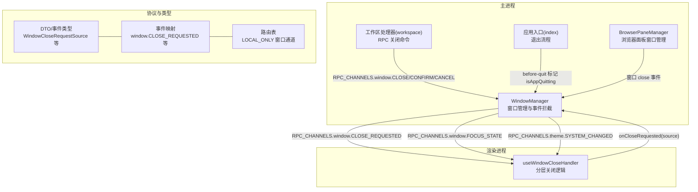
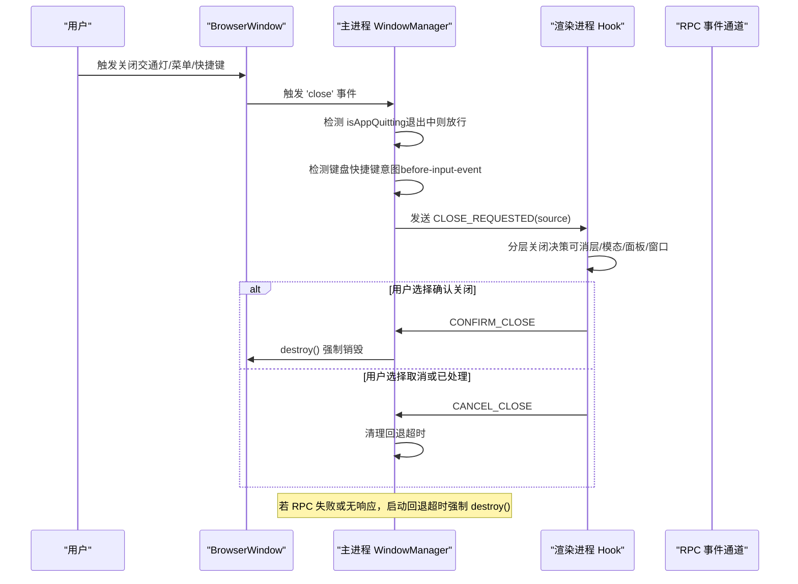
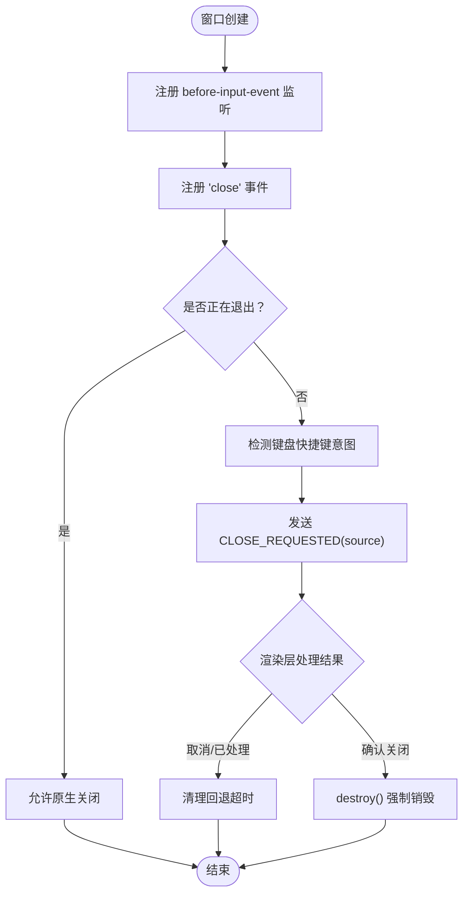
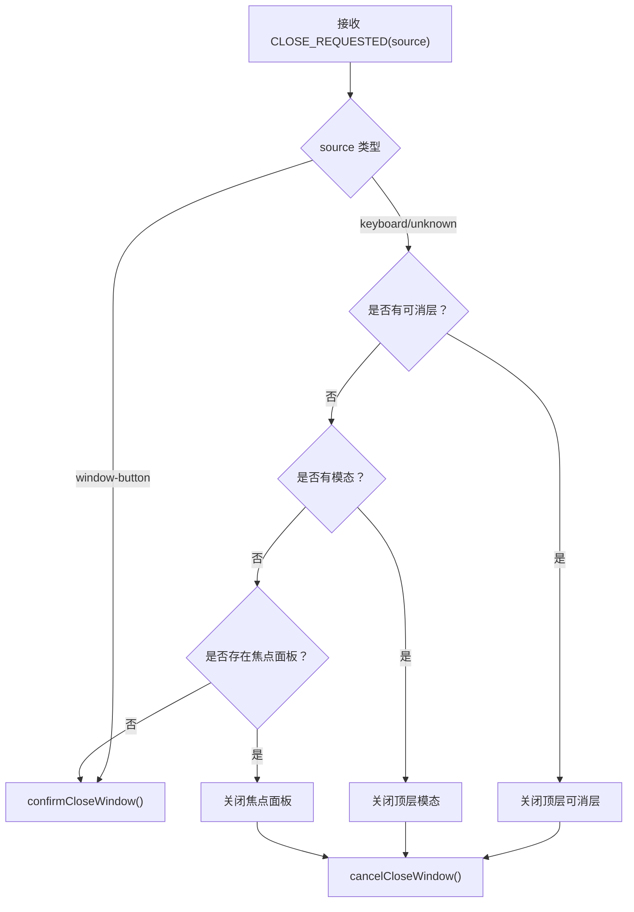
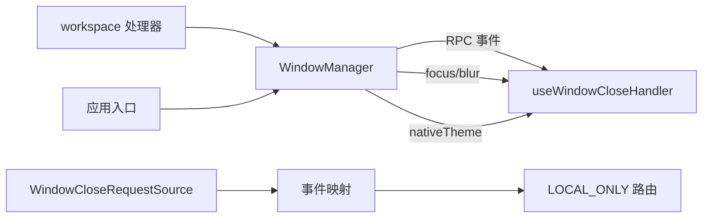

# 窗口事件处理

<cite>
**本文引用的文件**
- [apps/electron/src/main/window-manager.ts](file://apps/electron/src/main/window-manager.ts)
- [apps/electron/src/renderer/hooks/useWindowCloseHandler.ts](file://apps/electron/src/renderer/hooks/useWindowCloseHandler.ts)
- [apps/electron/src/main/index.ts](file://apps/electron/src/main/index.ts)
- [apps/electron/src/main/handlers/workspace.ts](file://apps/electron/src/main/handlers/workspace.ts)
- [apps/electron/src/main/browser-pane-manager.ts](file://apps/electron/src/main/browser-pane-manager.ts)
- [apps/electron/src/shared/types.ts](file://apps/electron/src/shared/types.ts)
- [packages/shared/src/protocol/dto.ts](file://packages/shared/src/protocol/dto.ts)
- [packages/shared/src/protocol/events.ts](file://packages/shared/src/protocol/events.ts)
- [packages/shared/src/protocol/routing.ts](file://packages/shared/src/protocol/routing.ts)
</cite>

## 目录
1. [简介](#简介)
2. [项目结构](#项目结构)
3. [核心组件](#核心组件)
4. [架构总览](#架构总览)
5. [详细组件分析](#详细组件分析)
6. [依赖关系分析](#依赖关系分析)
7. [性能考量](#性能考量)
8. [故障排查指南](#故障排查指南)
9. [结论](#结论)
10. [附录](#附录)

## 简介
本技术文档围绕窗口事件处理系统展开，重点解析主进程中的 WindowManager 对窗口生命周期、键盘快捷键拦截、关闭意图检测、焦点状态广播、主题变化通知等事件的处理机制；并阐述渲染进程如何通过自定义 Hook 实现“分层关闭”策略，以及主/渲染进程之间的 RPC 事件通道与回退机制。文档同时覆盖跨平台差异（macOS 交通灯按钮、Windows 透明材质、Linux 窗口管理器兼容性）及最佳实践建议。

## 项目结构
窗口事件处理主要分布在以下模块：
- 主进程窗口管理：WindowManager 负责窗口创建、关闭拦截、焦点与主题广播、键盘快捷键意图检测、回退超时等。
- 渲染进程关闭处理器：useWindowCloseHandler 基于来源信息执行分层关闭（模态框/可消层 → 面板 → 窗口）。
- 应用生命周期与退出流程：在退出前标记“正在退出”，绕过 Cmd+W 的分层拦截，确保 Cmd+Q 正常退出。
- 工作区/会话窗口控制：通过 RPC 通道触发关闭、确认关闭、取消关闭、设置交通灯可见性。
- 浏览器面板窗口：独立的 BrowserPaneManager 对其子窗口也有 close 拦截与隐藏策略。
- 类型与通道：统一的 RPC 通道与 DTO 定义保证主/渲染进程契约一致。

图表来源
- [apps/electron/src/main/window-manager.ts:344-404](file://apps/electron/src/main/window-manager.ts#L344-L404)
- [apps/electron/src/renderer/hooks/useWindowCloseHandler.ts:31-62](file://apps/electron/src/renderer/hooks/useWindowCloseHandler.ts#L31-L62)
- [apps/electron/src/main/index.ts:1102-1181](file://apps/electron/src/main/index.ts#L1102-L1181)
- [apps/electron/src/main/handlers/workspace.ts:113-135](file://apps/electron/src/main/handlers/workspace.ts#L113-L135)
- [apps/electron/src/main/browser-pane-manager.ts:2851-2865](file://apps/electron/src/main/browser-pane-manager.ts#L2851-L2865)
- [packages/shared/src/protocol/dto.ts:554-558](file://packages/shared/src/protocol/dto.ts#L554-L558)
- [packages/shared/src/protocol/events.ts:47-58](file://packages/shared/src/protocol/events.ts#L47-L58)
- [packages/shared/src/protocol/routing.ts:27-40](file://packages/shared/src/protocol/routing.ts#L27-L40)

章节来源
- [apps/electron/src/main/window-manager.ts:104-408](file://apps/electron/src/main/window-manager.ts#L104-L408)
- [apps/electron/src/renderer/hooks/useWindowCloseHandler.ts:24-66](file://apps/electron/src/renderer/hooks/useWindowCloseHandler.ts#L24-L66)
- [apps/electron/src/main/index.ts:1090-1181](file://apps/electron/src/main/index.ts#L1090-L1181)
- [apps/electron/src/main/handlers/workspace.ts:113-135](file://apps/electron/src/main/handlers/workspace.ts#L113-L135)
- [apps/electron/src/main/browser-pane-manager.ts:2846-2865](file://apps/electron/src/main/browser-pane-manager.ts#L2846-L2865)
- [apps/electron/src/shared/types.ts:210](file://apps/electron/src/shared/types.ts#L210)
- [packages/shared/src/protocol/dto.ts:554-558](file://packages/shared/src/protocol/dto.ts#L554-L558)
- [packages/shared/src/protocol/events.ts:47-58](file://packages/shared/src/protocol/events.ts#L47-L58)
- [packages/shared/src/protocol/routing.ts:27-40](file://packages/shared/src/protocol/routing.ts#L27-L40)

## 核心组件
- WindowManager
  - 负责窗口创建、关闭拦截、焦点状态广播、主题变化通知、键盘快捷键意图检测、回退超时与强制销毁。
  - 提供 RPC 事件推送（优先使用 RPC 事件通道，失败时回退到 webContents.send）。
- useWindowCloseHandler
  - 接收来自主进程的关闭请求，按来源区分行为：
    - window-button：直接确认关闭；
    - keyboard-shortcut：分层关闭（可消层 → 模态 → 焦点面板 → 窗口）；
    - unknown：同 keyboard-shortcut 的安全降级。
- 应用退出流程
  - before-quit 阶段将 isAppQuitting 设为 true，使后续窗口 close 事件绕过分层拦截，直接允许原生关闭（保证 Cmd+Q 行为）。
- 工作区/会话窗口控制
  - 通过 RPC 通道触发关闭、确认关闭、取消关闭、设置交通灯可见性。
- 浏览器面板窗口
  - 对其子窗口采用“显式销毁”与“拦截隐藏”的策略，避免误触导致的完全关闭。

章节来源
- [apps/electron/src/main/window-manager.ts:53-100](file://apps/electron/src/main/window-manager.ts#L53-L100)
- [apps/electron/src/renderer/hooks/useWindowCloseHandler.ts:24-66](file://apps/electron/src/renderer/hooks/useWindowCloseHandler.ts#L24-L66)
- [apps/electron/src/main/index.ts:1102-1181](file://apps/electron/src/main/index.ts#L1102-L1181)
- [apps/electron/src/main/handlers/workspace.ts:113-135](file://apps/electron/src/main/handlers/workspace.ts#L113-L135)
- [apps/electron/src/main/browser-pane-manager.ts:2851-2865](file://apps/electron/src/main/browser-pane-manager.ts#L2851-L2865)

## 架构总览
下图展示了从用户触发关闭到最终窗口是否被销毁的关键路径，包括键盘快捷键检测、来源识别、分层关闭决策、回退超时与强制销毁。

图表来源
- [apps/electron/src/main/window-manager.ts:344-381](file://apps/electron/src/main/window-manager.ts#L344-L381)
- [apps/electron/src/renderer/hooks/useWindowCloseHandler.ts:31-62](file://apps/electron/src/renderer/hooks/useWindowCloseHandler.ts#L31-L62)
- [apps/electron/src/main/handlers/workspace.ts:113-129](file://apps/electron/src/main/handlers/workspace.ts#L113-L129)

## 详细组件分析

### WindowManager：窗口事件与状态管理
- 键盘快捷键拦截与意图检测
  - 在窗口创建时注册 before-input-event 监听，识别 Cmd/Ctrl+W 并短时标记该 webContents 的“关闭意图”。
  - 在 close 事件中根据意图设置 source，并发送 CLOSE_REQUESTED 给渲染进程。
- 关闭拦截与回退超时
  - close 事件默认阻止原生关闭，等待渲染进程处理；若渲染进程未响应或 RPC 失败，则在 3 秒后强制 destroy()。
  - 支持 cancelPendingClose 取消回退超时，用于渲染进程已处理关闭的情况。
- 焦点状态与主题变化
  - 监听 focus/blur 事件，广播 RPC_CHANNELS.window.FOCUS_STATE。
  - 监听 nativeTheme.updated，广播 RPC_CHANNELS.theme.SYSTEM_CHANGED。
- RPC 事件推送与回退
  - pushToWindow 优先通过 RPC 事件通道发送；若尚未建立连接或 resolver 不可用，则回退到 webContents.send。
- 其他能力
  - setTrafficLightsVisible：仅 macOS 生效，用于在全屏覆盖时隐藏交通灯按钮。
  - setAppQuitting：在退出阶段绕过分层关闭拦截。

图表来源
- [apps/electron/src/main/window-manager.ts:319-381](file://apps/electron/src/main/window-manager.ts#L319-L381)
- [apps/electron/src/main/window-manager.ts:86-98](file://apps/electron/src/main/window-manager.ts#L86-L98)

章节来源
- [apps/electron/src/main/window-manager.ts:319-381](file://apps/electron/src/main/window-manager.ts#L319-L381)
- [apps/electron/src/main/window-manager.ts:305-317](file://apps/electron/src/main/window-manager.ts#L305-L317)
- [apps/electron/src/main/window-manager.ts:86-98](file://apps/electron/src/main/window-manager.ts#L86-L98)
- [apps/electron/src/main/window-manager.ts:632-645](file://apps/electron/src/main/window-manager.ts#L632-L645)

### 渲染进程 Hook：分层关闭策略
- 来源感知的关闭策略
  - window-button：直接 confirmCloseWindow。
  - keyboard-shortcut/unknown：按顺序尝试关闭顶层可消层、顶层模态、焦点面板，最后才 confirmCloseWindow。
- 与主进程的交互
  - 通过 window.electronAPI.onCloseRequested 接收请求；
  - 使用 window.electronAPI.confirmCloseWindow/cancelCloseWindow 与主进程同步状态。

图表来源
- [apps/electron/src/renderer/hooks/useWindowCloseHandler.ts:31-62](file://apps/electron/src/renderer/hooks/useWindowCloseHandler.ts#L31-L62)

章节来源
- [apps/electron/src/renderer/hooks/useWindowCloseHandler.ts:24-66](file://apps/electron/src/renderer/hooks/useWindowCloseHandler.ts#L24-L66)

### 应用退出流程：Cmd+Q 语义保障
- before-quit 阶段调用 windowManager.setAppQuitting(true)，使后续窗口 close 事件不再进入分层拦截，直接允许原生关闭。
- 这确保 Cmd+Q 的退出行为不受“关闭面板/模态”的拦截影响。

章节来源
- [apps/electron/src/main/index.ts:1102-1108](file://apps/electron/src/main/index.ts#L1102-L1108)
- [apps/electron/src/main/window-manager.ts:461-463](file://apps/electron/src/main/window-manager.ts#L461-L463)

### 工作区/会话窗口控制：RPC 通道
- RPC_CHANNELS.window.CLOSE：触发指定窗口关闭（可能被拦截）。
- RPC_CHANNELS.window.CONFIRM_CLOSE：确认关闭，绕过拦截直接销毁。
- RPC_CHANNELS.window.CANCEL_CLOSE：取消关闭，清理回退超时。
- RPC_CHANNELS.window.SET_TRAFFIC_LIGHTS：设置 macOS 交通灯可见性。

章节来源
- [apps/electron/src/main/handlers/workspace.ts:113-135](file://apps/electron/src/main/handlers/workspace.ts#L113-L135)
- [packages/shared/src/protocol/routing.ts:27-40](file://packages/shared/src/protocol/routing.ts#L27-L40)

### 浏览器面板窗口：隐藏与销毁策略
- 对其子窗口监听 'close' 事件，若非显式销毁且配置为“保持存活”，则拦截并执行 hide()，避免误关。
- 该策略与主窗口的“分层关闭”不同，更偏向“隐藏而非销毁”。

章节来源
- [apps/electron/src/main/browser-pane-manager.ts:2851-2865](file://apps/electron/src/main/browser-pane-manager.ts#L2851-L2865)

### 类型与事件契约
- WindowCloseRequestSource：'keyboard-shortcut' | 'window-button' | 'unknown'
- WindowCloseRequest：包含 source 字段
- RPC 事件映射：window.CLOSE_REQUESTED、window.FOCUS_STATE、theme.SYSTEM_CHANGED 等
- 路由表：window.* 通道属于 LOCAL_ONLY，确保本地窗口管理能力不被远程代理

章节来源
- [packages/shared/src/protocol/dto.ts:554-558](file://packages/shared/src/protocol/dto.ts#L554-L558)
- [packages/shared/src/protocol/events.ts:47-58](file://packages/shared/src/protocol/events.ts#L47-L58)
- [packages/shared/src/protocol/routing.ts:27-40](file://packages/shared/src/protocol/routing.ts#L27-L40)
- [apps/electron/src/shared/types.ts:210](file://apps/electron/src/shared/types.ts#L210)

## 依赖关系分析
- 主进程 WindowManager 依赖：
  - RPC 通道与路由表（LOCAL_ONLY），确保窗口管理通道本地化；
  - nativeTheme 与 BrowserWindow 生命周期事件；
  - 与渲染进程通过 RPC 事件通道通信。
- 渲染进程 Hook 依赖：
  - ElectronAPI 的 onCloseRequested、confirmCloseWindow、cancelCloseWindow；
  - 上下文中的模态与可消层注册表、面板栈状态。
- 应用入口与退出：
  - before-quit 设置 isAppQuitting，影响 WindowManager 的拦截策略。

图表来源
- [apps/electron/src/main/window-manager.ts:305-317](file://apps/electron/src/main/window-manager.ts#L305-L317)
- [apps/electron/src/renderer/hooks/useWindowCloseHandler.ts:31-62](file://apps/electron/src/renderer/hooks/useWindowCloseHandler.ts#L31-L62)
- [apps/electron/src/main/handlers/workspace.ts:113-135](file://apps/electron/src/main/handlers/workspace.ts#L113-L135)
- [apps/electron/src/main/index.ts:1102-1108](file://apps/electron/src/main/index.ts#L1102-L1108)
- [packages/shared/src/protocol/dto.ts:554-558](file://packages/shared/src/protocol/dto.ts#L554-L558)
- [packages/shared/src/protocol/events.ts:47-58](file://packages/shared/src/protocol/events.ts#L47-L58)
- [packages/shared/src/protocol/routing.ts:27-40](file://packages/shared/src/protocol/routing.ts#L27-L40)

章节来源
- [apps/electron/src/main/window-manager.ts:305-317](file://apps/electron/src/main/window-manager.ts#L305-L317)
- [apps/electron/src/renderer/hooks/useWindowCloseHandler.ts:31-62](file://apps/electron/src/renderer/hooks/useWindowCloseHandler.ts#L31-L62)
- [apps/electron/src/main/handlers/workspace.ts:113-135](file://apps/electron/src/main/handlers/workspace.ts#L113-L135)
- [apps/electron/src/main/index.ts:1102-1108](file://apps/electron/src/main/index.ts#L1102-L1108)
- [packages/shared/src/protocol/dto.ts:554-558](file://packages/shared/src/protocol/dto.ts#L554-L558)
- [packages/shared/src/protocol/events.ts:47-58](file://packages/shared/src/protocol/events.ts#L47-L58)
- [packages/shared/src/protocol/routing.ts:27-40](file://packages/shared/src/protocol/routing.ts#L27-L40)

## 性能考量
- 回退超时设计
  - 为应对 Hyprland/Wayland 等环境下的 IPC 不稳定，主进程在每次关闭请求时设置 3 秒回退超时；若渲染进程持续处理（如打开模态），应周期性调用 cancelCloseWindow 重置超时，避免误伤用户操作。
- 事件推送回退
  - pushToWindow 优先使用 RPC 事件通道；在握手完成前回退到 webContents.send，减少不必要的网络开销。
- 焦点与主题广播
  - 仅在状态变化时广播，避免频繁更新造成渲染压力。
- 窗口创建与恢复
  - 使用 ready-to-show 提前显示，减少白屏时间；失败加载时自动重试或回退到默认页面，提升鲁棒性。

章节来源
- [apps/electron/src/main/window-manager.ts:370-379](file://apps/electron/src/main/window-manager.ts#L370-L379)
- [apps/electron/src/main/window-manager.ts:86-98](file://apps/electron/src/main/window-manager.ts#L86-L98)
- [apps/electron/src/main/window-manager.ts:174-177](file://apps/electron/src/main/window-manager.ts#L174-L177)
- [apps/electron/src/main/window-manager.ts:270-283](file://apps/electron/src/main/window-manager.ts#L270-L283)

## 故障排查指南
- 关闭请求无响应
  - 检查渲染进程是否正确注册 onCloseRequested 并返回处理结果；
  - 确认 RPC 事件通道是否可用；必要时调用 cancelCloseWindow 重置回退超时。
- Cmd+W 无法关闭窗口
  - 确认 isAppQuitting 是否为 true（退出阶段）；
  - 检查键盘快捷键意图检测是否被正确清除（短时缓存，超时自动清理）。
- 主题切换未生效
  - 确认 nativeTheme.updated 事件是否触发；
  - 检查 RPC 事件通道是否正常，或回退到 webContents.send。
- macOS 交通灯按钮异常
  - setTrafficLightsVisible 仅在 macOS 生效；隐藏后再显示需重新设置位置。
- Linux 环境关闭行为异常
  - Wayland/Hyprland 等环境下 IPC 可能不稳定，回退超时会强制销毁；建议在渲染层尽快处理关闭请求并调用 cancelCloseWindow。

章节来源
- [apps/electron/src/main/window-manager.ts:344-381](file://apps/electron/src/main/window-manager.ts#L344-L381)
- [apps/electron/src/main/window-manager.ts:332-341](file://apps/electron/src/main/window-manager.ts#L332-L341)
- [apps/electron/src/main/window-manager.ts:305-317](file://apps/electron/src/main/window-manager.ts#L305-L317)
- [apps/electron/src/main/window-manager.ts:632-645](file://apps/electron/src/main/window-manager.ts#L632-L645)
- [apps/electron/src/main/index.ts:1102-1108](file://apps/electron/src/main/index.ts#L1102-L1108)

## 结论
本系统通过“意图检测 + 分层关闭 + 回退超时 + RPC 事件通道”的组合，在保证用户体验的同时兼顾了跨平台差异与健壮性。主进程 WindowManager 负责拦截与协调，渲染进程 Hook 负责策略执行，退出流程确保 Cmd+Q 的预期行为。建议在渲染层对高频关闭场景进行及时 cancel，避免不必要的回退超时；在跨平台部署时关注 Wayland/Hyprland 的 IPC 行为差异。

## 附录

### 跨平台差异与适配
- macOS
  - 交通灯按钮位置与可见性可通过 setTrafficLightsVisible 控制；
  - 焦点/标题栏样式与视觉效果针对 macOS 优化。
- Windows
  - 根据系统版本选择 Mica 或 Acrylic 透明材质；
  - 保留原生窗口框架以获得更好的用户体验。
- Linux
  - 使用原生窗口框架；
  - 注意在某些窗口管理器（如 Hyprland/Wayland）下 IPC 可能不稳定，需依赖回退超时机制。

章节来源
- [apps/electron/src/main/window-manager.ts:18-34](file://apps/electron/src/main/window-manager.ts#L18-L34)
- [apps/electron/src/main/window-manager.ts:144-164](file://apps/electron/src/main/window-manager.ts#L144-L164)