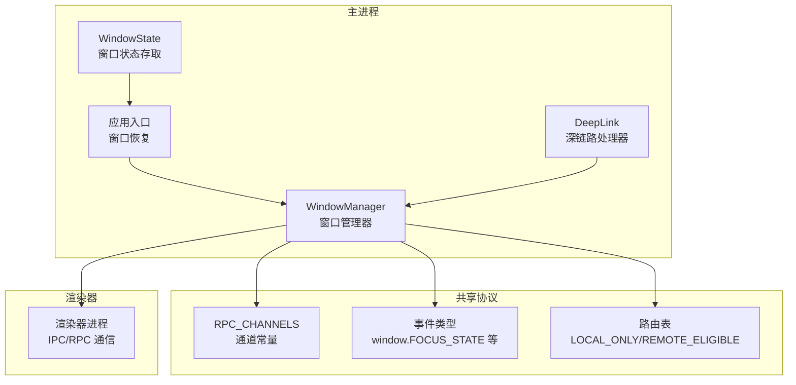
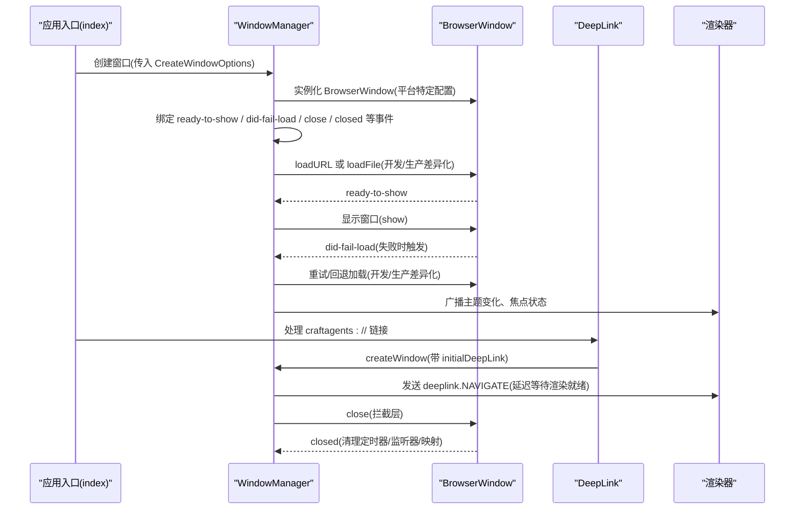
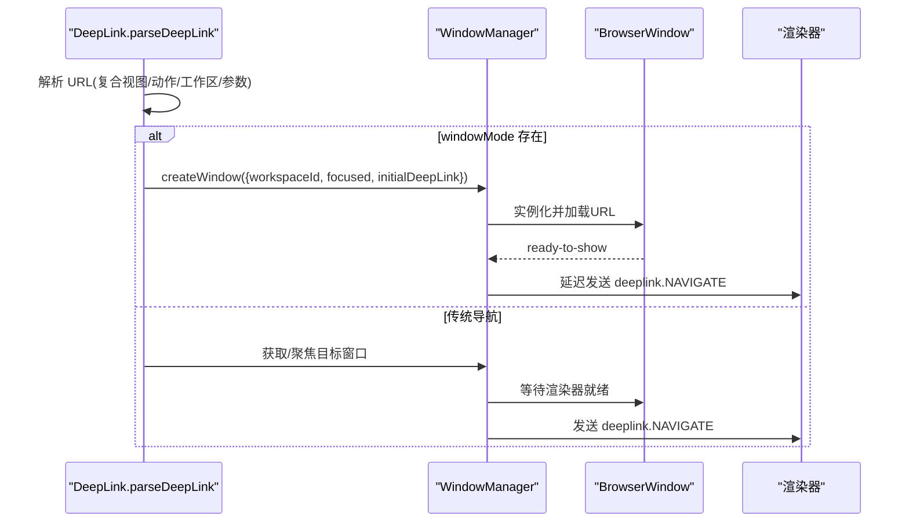
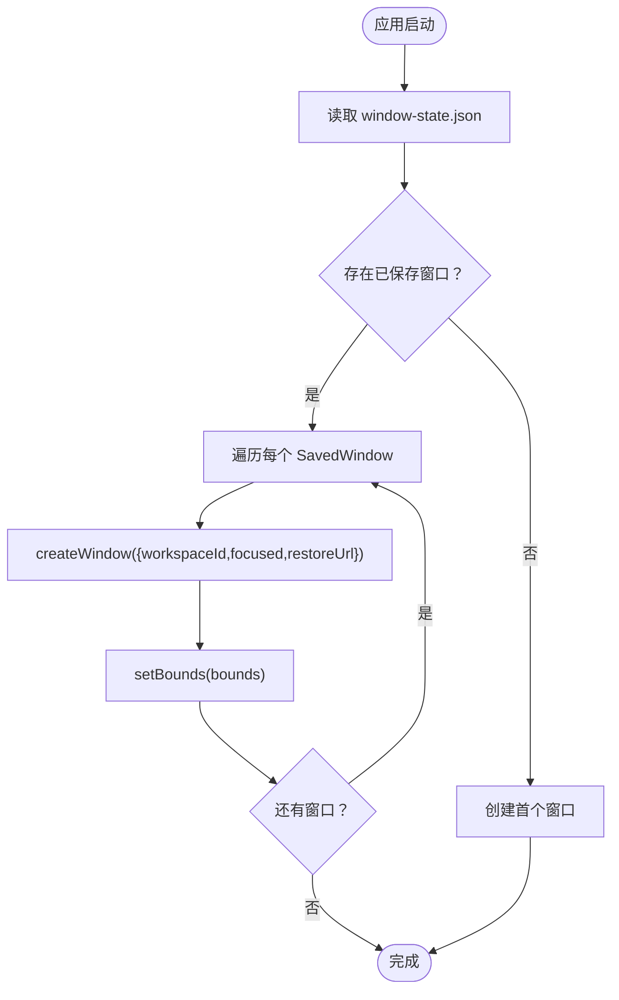
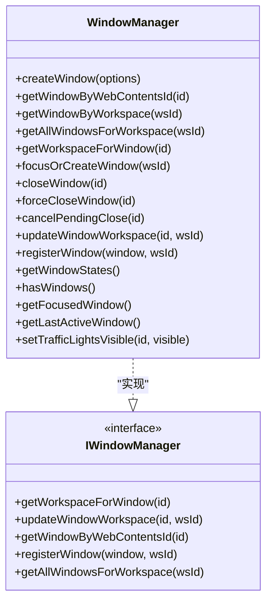

# 窗口创建与生命周期

<cite>
**本文引用的文件**
- [apps/electron/src/main/window-manager.ts](file://apps/electron/src/main/window-manager.ts)
- [apps/electron/src/main/deep-link.ts](file://apps/electron/src/main/deep-link.ts)
- [apps/electron/src/main/index.ts](file://apps/electron/src/main/index.ts)
- [apps/electron/src/main/window-state.ts](file://apps/electron/src/main/window-state.ts)
- [packages/server-core/src/handlers/window-manager-interface.ts](file://packages/server-core/src/handlers/window-manager-interface.ts)
- [packages/shared/src/protocol/channels.ts](file://packages/shared/src/protocol/channels.ts)
- [packages/shared/src/protocol/events.ts](file://packages/shared/src/protocol/events.ts)
- [packages/shared/src/protocol/routing.ts](file://packages/shared/src/protocol/routing.ts)
- [apps/electron/src/shared/types.ts](file://apps/electron/src/shared/types.ts)
</cite>

## 目录
1. [简介](#简介)
2. [项目结构](#项目结构)
3. [核心组件](#核心组件)
4. [架构总览](#架构总览)
5. [详细组件分析](#详细组件分析)
6. [依赖关系分析](#依赖关系分析)
7. [性能考量](#性能考量)
8. [故障排查指南](#故障排查指南)
9. [结论](#结论)
10. [附录](#附录)

## 简介
本文件围绕窗口创建与生命周期管理展开，系统性阐述 WindowManager.createWindow() 的完整实现流程，覆盖窗口参数配置、平台特定设置、窗口属性初始化、URL 加载、事件绑定与状态跟踪；并详解窗口生命周期事件处理机制（ready-to-show、did-fail-load、close、closed 等），以及窗口创建选项 CreateWindowOptions 的语义与使用场景。同时给出错误恢复策略（开发/生产环境差异）、窗口状态持久化与恢复、以及与深链路导航的集成。

## 项目结构
本项目采用多包结构，窗口管理相关的核心逻辑位于 Electron 主进程侧，渲染器通过 RPC 通道与主进程交互。关键文件分布如下：
- 主进程窗口管理：apps/electron/src/main/window-manager.ts
- 深链路解析与导航：apps/electron/src/main/deep-link.ts
- 应用入口与窗口恢复：apps/electron/src/main/index.ts
- 窗口状态持久化：apps/electron/src/main/window-state.ts
- 服务端窗口接口契约：packages/server-core/src/handlers/window-manager-interface.ts
- 协议通道与事件：packages/shared/src/protocol/channels.ts、packages/shared/src/protocol/events.ts、packages/shared/src/protocol/routing.ts
- ElectronAPI 类型与窗口事件：apps/electron/src/shared/types.ts

图表来源
- [apps/electron/src/main/window-manager.ts:104-408](file://apps/electron/src/main/window-manager.ts#L104-L408)
- [apps/electron/src/main/deep-link.ts:235-342](file://apps/electron/src/main/deep-link.ts#L235-L342)
- [apps/electron/src/main/index.ts:330-359](file://apps/electron/src/main/index.ts#L330-L359)
- [apps/electron/src/main/window-state.ts:38-76](file://apps/electron/src/main/window-state.ts#L38-L76)
- [packages/shared/src/protocol/channels.ts:66-79](file://packages/shared/src/protocol/channels.ts#L66-L79)
- [packages/shared/src/protocol/events.ts:47-58](file://packages/shared/src/protocol/events.ts#L47-L58)
- [packages/shared/src/protocol/routing.ts:17-40](file://packages/shared/src/protocol/routing.ts#L17-L40)

章节来源
- [apps/electron/src/main/window-manager.ts:104-408](file://apps/electron/src/main/window-manager.ts#L104-L408)
- [apps/electron/src/main/deep-link.ts:235-342](file://apps/electron/src/main/deep-link.ts#L235-L342)
- [apps/electron/src/main/index.ts:330-359](file://apps/electron/src/main/index.ts#L330-L359)
- [apps/electron/src/main/window-state.ts:38-76](file://apps/electron/src/main/window-state.ts#L38-L76)
- [packages/server-core/src/handlers/window-manager-interface.ts:8-23](file://packages/server-core/src/handlers/window-manager-interface.ts#L8-L23)
- [packages/shared/src/protocol/channels.ts:66-79](file://packages/shared/src/protocol/channels.ts#L66-L79)
- [packages/shared/src/protocol/events.ts:47-58](file://packages/shared/src/protocol/events.ts#L47-L58)
- [packages/shared/src/protocol/routing.ts:17-40](file://packages/shared/src/protocol/routing.ts#L17-L40)

## 核心组件
- WindowManager：负责窗口实例化、URL 加载、事件绑定、状态跟踪、关闭拦截与清理、焦点模式与工作区映射等。
- DeepLink：负责解析 craftagents:// 链接并驱动窗口导航或新建窗口。
- WindowState：负责窗口边界、聚焦模式与 URL 的保存与加载，支撑应用重启后的恢复。
- IWindowManager 接口：服务端处理器消费的最小窗口管理接口契约。
- RPC 通道与事件：统一的窗口事件通道（如 window.FOCUS_STATE、window.CLOSE_REQUESTED）与路由规则。

章节来源
- [apps/electron/src/main/window-manager.ts:53-646](file://apps/electron/src/main/window-manager.ts#L53-L646)
- [apps/electron/src/main/deep-link.ts:43-342](file://apps/electron/src/main/deep-link.ts#L43-L342)
- [apps/electron/src/main/window-state.ts:14-30](file://apps/electron/src/main/window-state.ts#L14-L30)
- [packages/server-core/src/handlers/window-manager-interface.ts:8-23](file://packages/server-core/src/handlers/window-manager-interface.ts#L8-L23)
- [packages/shared/src/protocol/channels.ts:66-79](file://packages/shared/src/protocol/channels.ts#L66-L79)
- [packages/shared/src/protocol/events.ts:47-58](file://packages/shared/src/protocol/events.ts#L47-L58)

## 架构总览
下图展示从应用启动到窗口创建、URL 加载、事件广播与关闭拦截的全链路：

图表来源
- [apps/electron/src/main/index.ts:330-359](file://apps/electron/src/main/index.ts#L330-L359)
- [apps/electron/src/main/window-manager.ts:104-408](file://apps/electron/src/main/window-manager.ts#L104-L408)
- [apps/electron/src/main/deep-link.ts:235-342](file://apps/electron/src/main/deep-link.ts#L235-L342)
- [packages/shared/src/protocol/events.ts:47-58](file://packages/shared/src/protocol/events.ts#L47-L58)

## 详细组件分析

### WindowManager.createWindow() 完整流程
- 输入参数与默认值
  - workspaceId：目标工作区标识，必填。
  - focused：是否以“专注模式”打开（窗口更小、无侧边栏）。
  - initialDeepLink：首次加载后要导航的深链路（不含 window 参数）。
  - restoreUrl：从上次会话恢复的完整 URL（保留路由与查询参数）。
- 平台特定设置
  - 图标路径：根据平台选择 .icns/.ico/.png，并在打包与开发环境下定位资源。
  - 窗口尺寸：focused=true 时使用较小尺寸。
  - macOS：隐藏标题栏、交通灯位置、vibrancy 效果。
  - Windows：根据系统版本选择 Mica 或 Acrylic 背景材质，保持原生框架。
  - Linux：保持原生框架。
  - webPreferences：启用上下文隔离、禁用 nodeIntegration、禁用 webviewTag。
- URL 加载策略
  - 若提供 restoreUrl：
    - 开发模式：替换基础 URL，保留 pathname/search，再 loadURL。
    - 生产模式：从 __dirname 下的 renderer/index.html 读取，提取查询参数。
  - 否则：构建查询参数 workspaceId（可选 focused），按开发/生产分别 loadURL 或 loadFile。
- 错误恢复与回退
  - 监听 did-fail-load：
    - 开发模式：最多重试 5 次，每次延时 1s，重定向到 Vite dev server。
    - 生产模式：回退到本地 renderer/index.html，携带 workspaceId。
- 事件绑定与状态跟踪
  - ready-to-show：显示窗口，提升感知速度。
  - will-navigate：仅允许 file://（打包）或 VITE_DEV_SERVER_URL（开发）内部导航，否则外部打开。
  - context-menu（开发）：右键菜单用于调试。
  - 主题变化：nativeTheme.updated -> 广播 RPC_CHANNELS.theme.SYSTEM_CHANGED。
  - 焦点变化：window.focus/blur -> 广播 RPC_CHANNELS.window.FOCUS_STATE。
  - 关闭拦截：
    - 记录键盘快捷键 Cmd/Ctrl+W 的意图，区分关闭来源。
    - 触发 close 时，阻止默认行为，向渲染器发送 window.CLOSE_REQUESTED。
    - 设置 3 秒降级超时，若 IPC 失败（Wayland/Hyprland 场景）强制 destroy。
  - closed：清理 pendingCloseTimeouts、keyboardCloseIntents、移除 nativeTheme 监听、删除映射。
- 返回值与后续
  - 返回 BrowserWindow 实例，供调用方继续操作（如 setBounds、focus）。

章节来源
- [apps/electron/src/main/window-manager.ts:104-408](file://apps/electron/src/main/window-manager.ts#L104-L408)

### 窗口创建选项 CreateWindowOptions 详解
- workspaceId
  - 作用：指定窗口所属的工作区，用于窗口与工作区的映射与广播。
  - 使用场景：首次打开、从深链路创建新窗口、从窗口状态恢复。
- focused
  - 作用：以专注模式打开窗口（较小尺寸、无侧边栏）。
  - 使用场景：深链路 windowMode=focused、从深链路创建新窗口。
- initialDeepLink
  - 作用：窗口 ready-to-show 后，解析并导航到该深链路。
  - 使用场景：外部 craftagents:// 链接直接触发导航。
- restoreUrl
  - 作用：从上次会话恢复完整 URL（含路由与查询参数）。
  - 使用场景：应用退出前保存 URL，重启时恢复窗口状态。

章节来源
- [apps/electron/src/main/window-manager.ts:42-51](file://apps/electron/src/main/window-manager.ts#L42-L51)
- [apps/electron/src/main/window-state.ts:14-25](file://apps/electron/src/main/window-state.ts#L14-L25)

### 生命周期事件处理机制
- ready-to-show
  - 行为：首次绘制完成即显示窗口，优化启动感知。
  - 影响：避免白屏，提升用户体验。
- did-fail-load
  - 行为：开发模式重试 Vite dev server；生产模式回退到本地页面。
  - 影响：增强容错能力，避免因磁盘路径或网络问题导致白屏。
- close
  - 行为：阻止默认关闭，区分关闭来源（窗口按钮/键盘快捷键），向渲染器发送 CLOSE_REQUESTED。
  - 降级：3 秒超时强制 destroy，适配部分非标准桌面环境。
- closed
  - 行为：清理定时器、键盘意图、主题监听、窗口映射。
  - 影响：防止内存泄漏，确保状态一致。

章节来源
- [apps/electron/src/main/window-manager.ts:174-404](file://apps/electron/src/main/window-manager.ts#L174-L404)
- [packages/shared/src/protocol/events.ts:47-58](file://packages/shared/src/protocol/events.ts#L47-L58)

### 深链路与窗口创建的集成
- 解析 craftagents:// URL，识别复合视图、动作、工作区目标、窗口模式与右侧栏参数。
- 若 windowMode=focused/full：创建新窗口，传入 workspaceId 与 initialDeepLink。
- 否则：定位现有窗口（按工作区或当前焦点），等待渲染器就绪后发送 deeplink.NAVIGATE。

图表来源
- [apps/electron/src/main/deep-link.ts:95-342](file://apps/electron/src/main/deep-link.ts#L95-L342)
- [apps/electron/src/main/window-manager.ts:285-303](file://apps/electron/src/main/window-manager.ts#L285-L303)

章节来源
- [apps/electron/src/main/deep-link.ts:95-342](file://apps/electron/src/main/deep-link.ts#L95-L342)

### 窗口状态持久化与恢复
- 保存：getWindowStates() 收集窗口边界、聚焦模式与 URL，写入 window-state.json。
- 加载：应用启动时读取 window-state.json，逐个 createWindow({ workspaceId, focused, restoreUrl })，并设置 bounds。
- 清理：clearWindowState() 将状态清空为数组为空。

图表来源
- [apps/electron/src/main/index.ts:330-359](file://apps/electron/src/main/index.ts#L330-L359)
- [apps/electron/src/main/window-state.ts:38-76](file://apps/electron/src/main/window-state.ts#L38-L76)
- [apps/electron/src/main/window-manager.ts:574-587](file://apps/electron/src/main/window-manager.ts#L574-L587)

章节来源
- [apps/electron/src/main/index.ts:330-359](file://apps/electron/src/main/index.ts#L330-L359)
- [apps/electron/src/main/window-state.ts:14-30](file://apps/electron/src/main/window-state.ts#L14-L30)

### 服务端窗口接口契约
- IWindowManager 提供最小可用接口：按 webContentsId 查询工作区、更新工作区、按 webContentsId 查找窗口、注册/反注册窗口、按工作区获取所有窗口。
- 该接口被 server-core 处理器消费，保证在不同运行模式（本地/远程）下窗口管理的一致性。

章节来源
- [packages/server-core/src/handlers/window-manager-interface.ts:8-23](file://packages/server-core/src/handlers/window-manager-interface.ts#L8-L23)

## 依赖关系分析
- 通道与事件
  - 窗口事件：window.FOCUS_STATE、window.CLOSE_REQUESTED 等。
  - 深链路事件：deeplink.NAVIGATE。
  - 路由规则：LOCAL_ONLY 通道由本地主进程处理，不跨服务器代理。
- 类关系（代码级）

图表来源
- [apps/electron/src/main/window-manager.ts:53-646](file://apps/electron/src/main/window-manager.ts#L53-L646)
- [packages/server-core/src/handlers/window-manager-interface.ts:8-23](file://packages/server-core/src/handlers/window-manager-interface.ts#L8-L23)

章节来源
- [packages/shared/src/protocol/channels.ts:66-79](file://packages/shared/src/protocol/channels.ts#L66-L79)
- [packages/shared/src/protocol/routing.ts:17-40](file://packages/shared/src/protocol/routing.ts#L17-L40)

## 性能考量
- 启动体验
  - show: false + ready-to-show 再显示，减少白屏时间。
  - did-fail-load 回退策略避免长时间卡顿。
- 资源加载
  - 生产模式避免直接加载过时 file:// 路径，改用 loadFile 并从查询参数重建 URL。
- 事件广播
  - 仅在渲染器就绪后发送深链路导航，避免 IPC 未就绪导致的丢消息。
- 关闭拦截
  - 3 秒降级超时避免阻塞用户操作，兼顾兼容性。

## 故障排查指南
- 窗口无法显示或白屏
  - 检查 did-fail-load 回退逻辑是否生效（开发/生产差异）。
  - 确认 restoreUrl 是否有效，必要时清理 window-state.json 重新生成。
- 关闭无效或无法关闭
  - 检查 CLOSE_REQUESTED 是否被渲染器消费；确认键盘快捷键 Cmd/Ctrl+W 的意图记录与清理。
  - 在 Wayland/X11 环境下观察 3 秒降级超时是否触发。
- 主题切换未生效
  - 确认 nativeTheme.updated 监听与 RPC 广播是否正常。
- 深链路导航失败
  - 检查 parseDeepLink 结果与 windowMode/focused 参数；确认渲染器已就绪后再发送 deeplink.NAVIGATE。

章节来源
- [apps/electron/src/main/window-manager.ts:266-303](file://apps/electron/src/main/window-manager.ts#L266-L303)
- [apps/electron/src/main/deep-link.ts:205-221](file://apps/electron/src/main/deep-link.ts#L205-L221)

## 结论
WindowManager.createWindow() 将平台特性、开发/生产差异、错误恢复与事件广播整合在一个统一的流程中，既保证了跨平台一致性，又提供了良好的用户体验与可维护性。结合深链路与窗口状态持久化，系统实现了从启动到导航再到恢复的闭环。

## 附录
- 关键通道与事件
  - window.FOCUS_STATE：窗口焦点状态广播。
  - window.CLOSE_REQUESTED：请求关闭（含来源信息）。
  - deeplink.NAVIGATE：深链路导航指令。
- 通道分类
  - LOCAL_ONLY：窗口管理、深链路、通知等本地通道。
  - REMOTE_ELIGIBLE：按工作区归属的远端通道。

章节来源
- [packages/shared/src/protocol/channels.ts:66-79](file://packages/shared/src/protocol/channels.ts#L66-L79)
- [packages/shared/src/protocol/events.ts:47-58](file://packages/shared/src/protocol/events.ts#L47-L58)
- [packages/shared/src/protocol/routing.ts:17-40](file://packages/shared/src/protocol/routing.ts#L17-L40)