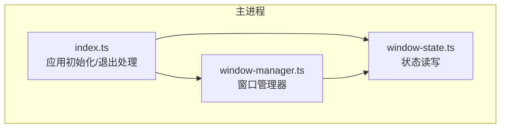
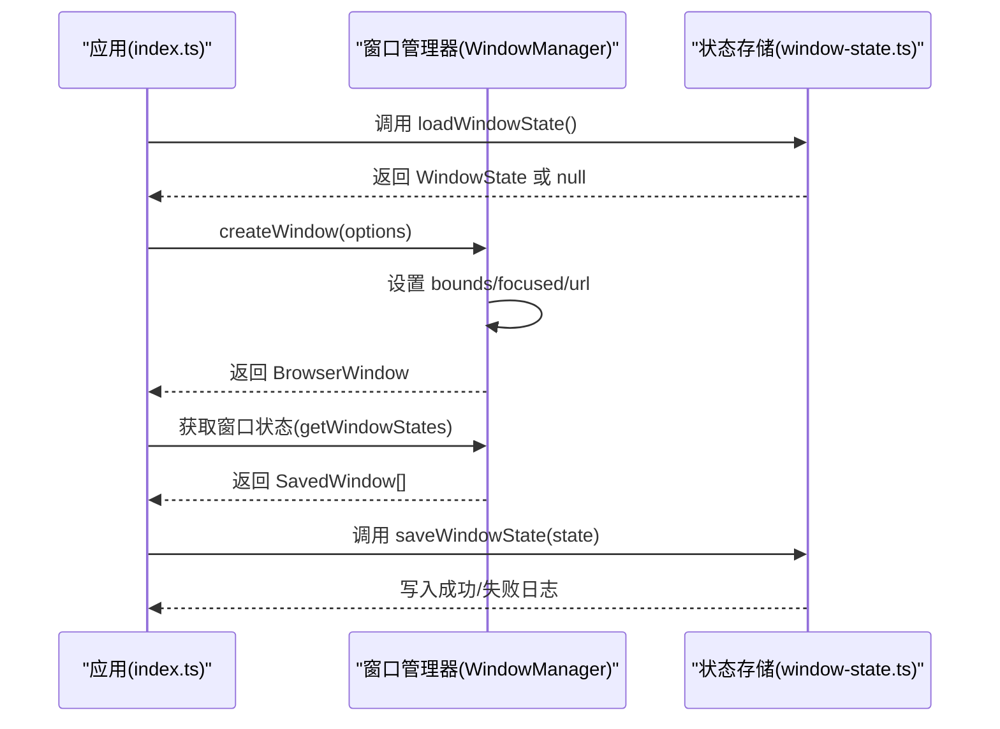
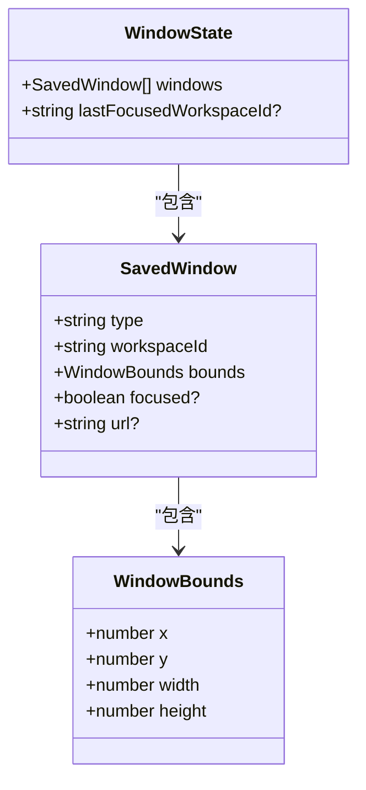
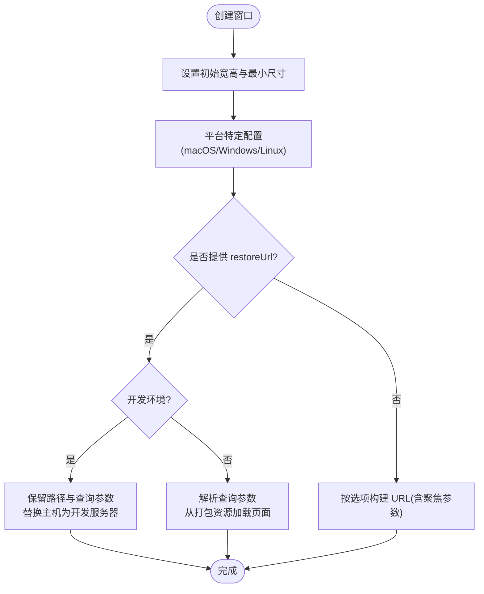
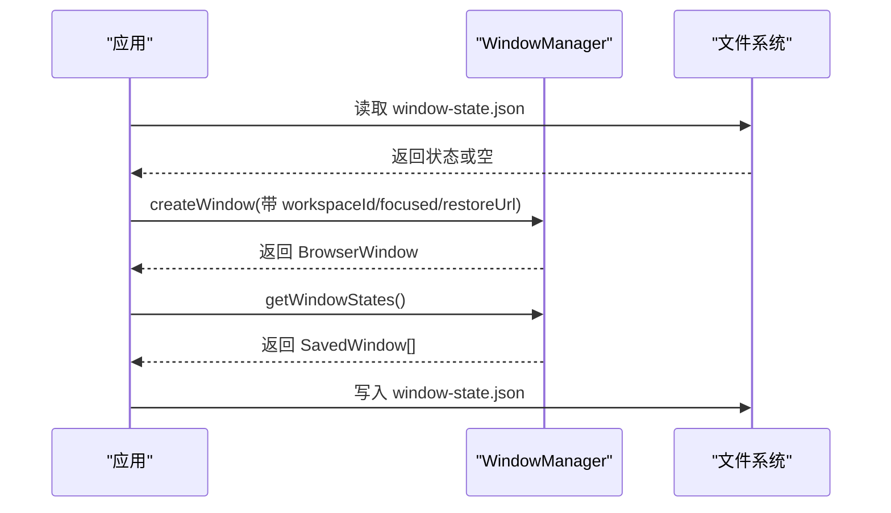
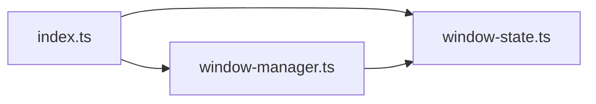

# 窗口状态管理

<cite>
**本文档引用的文件**
- [window-state.ts](file://apps/electron/src/main/window-state.ts)
- [window-manager.ts](file://apps/electron/src/main/window-manager.ts)
- [index.ts](file://apps/electron/src/main/index.ts)
</cite>

## 目录
1. [简介](#简介)
2. [项目结构](#项目结构)
3. [核心组件](#核心组件)
4. [架构总览](#架构总览)
5. [详细组件分析](#详细组件分析)
6. [依赖分析](#依赖分析)
7. [性能考虑](#性能考虑)
8. [故障排除指南](#故障排除指南)
9. [结论](#结论)

## 简介
本文件面向窗口状态管理系统，围绕以下目标展开：  
- 持久化与恢复机制：窗口边界信息（bounds）、聚焦状态（focused）、URL 状态（含查询参数）的保存与加载。  
- window-state.ts 与 WindowManager 的协作关系：状态采集、序列化、写入磁盘；以及启动时从磁盘读取并重建窗口。  
- SavedWindow 接口字段含义与序列化机制：类型标识、工作区、边界、聚焦、URL。  
- 配置选项：最小窗口尺寸限制、窗口位置记忆、多显示器支持要点。  
- 应用重启后的恢复流程：状态验证、默认值回退、异常处理策略。  
- 与其他系统设置的集成：主题变化通知、窗口焦点广播等。

## 项目结构
窗口状态管理相关代码主要分布在 Electron 主进程的三个文件中：
- window-state.ts：定义状态数据结构、读写磁盘的工具函数（保存、加载、清空）。  
- window-manager.ts：窗口生命周期管理、状态采集（getWindowStates）、URL 恢复逻辑、主题与焦点事件广播。  
- index.ts：应用初始化、退出前保存状态、启动时加载并恢复窗口。

图表来源
- [index.ts:308-359](file://apps/electron/src/main/index.ts#L308-L359)
- [window-manager.ts:53-647](file://apps/electron/src/main/window-manager.ts#L53-L647)
- [window-state.ts:1-91](file://apps/electron/src/main/window-state.ts#L1-L91)

章节来源
- [index.ts:308-359](file://apps/electron/src/main/index.ts#L308-L359)
- [window-manager.ts:53-647](file://apps/electron/src/main/window-manager.ts#L53-L647)
- [window-state.ts:1-91](file://apps/electron/src/main/window-state.ts#L1-L91)

## 核心组件
- 状态数据模型
  - WindowBounds：窗口边界（x, y, width, height）
  - SavedWindow：单个窗口的状态快照（type、workspaceId、bounds、focused、url）
  - WindowState：完整状态集合（windows[], lastFocusedWorkspaceId?）
- 状态读写
  - 保存：确保配置目录存在，写入 window-state.json
  - 加载：读取 JSON 并进行格式校验，返回 WindowState 或 null
  - 清空：将文件重写为空数组
- 窗口管理器
  - 创建窗口：设置最小尺寸、平台特性、URL 构建与恢复、主题与焦点事件广播
  - 状态采集：遍历已注册窗口，收集 bounds、focused、url
  - URL 恢复：区分开发/生产环境，解析查询参数并重建 URL

章节来源
- [window-state.ts:7-30](file://apps/electron/src/main/window-state.ts#L7-L30)
- [window-state.ts:35-91](file://apps/electron/src/main/window-state.ts#L35-L91)
- [window-manager.ts:127-172](file://apps/electron/src/main/window-manager.ts#L127-L172)
- [window-manager.ts:574-587](file://apps/electron/src/main/window-manager.ts#L574-L587)

## 架构总览
窗口状态管理的端到端流程如下：

图表来源
- [index.ts:308-359](file://apps/electron/src/main/index.ts#L308-L359)
- [index.ts:1102-1125](file://apps/electron/src/main/index.ts#L1102-L1125)
- [window-manager.ts:574-587](file://apps/electron/src/main/window-manager.ts#L574-L587)
- [window-state.ts:35-91](file://apps/electron/src/main/window-state.ts#L35-L91)

## 详细组件分析

### 组件一：状态数据结构与序列化（window-state.ts）
- 数据结构
  - WindowBounds：记录窗口位置与大小
  - SavedWindow：包含类型标识、工作区 ID、边界、可选聚焦状态、可选 URL（用于恢复路由与查询参数）
  - WindowState：窗口列表与最后聚焦的工作区 ID
- 序列化机制
  - 保存：将 WindowState 序列化为 JSON，写入用户目录下的配置文件
  - 加载：读取 JSON，进行格式校验（windows 必须为数组），返回有效状态或 null
  - 清空：将文件内容重置为空数组
- 错误处理
  - 目录不存在时自动创建
  - IO 异常记录错误日志，避免影响应用启动/退出

图表来源
- [window-state.ts:7-30](file://apps/electron/src/main/window-state.ts#L7-L30)

章节来源
- [window-state.ts:7-30](file://apps/electron/src/main/window-state.ts#L7-L30)
- [window-state.ts:35-91](file://apps/electron/src/main/window-state.ts#L35-L91)

### 组件二：窗口管理器（window-manager.ts）
- 窗口创建与配置
  - 最小尺寸：最小宽度 800，最小高度 600
  - 窗口尺寸：聚焦模式 900x700，普通模式 1400x900
  - 平台特性：macOS 隐藏标题栏与交通灯；Windows 使用原生框架与背景材质；Linux 原生框架
- URL 恢复与构建
  - 开发环境：保留路径与查询参数，替换主机为 VITE_DEV_SERVER_URL
  - 生产环境：解析查询参数并从当前打包资源加载页面，避免直接加载过时的 file:// 路径
- 状态采集
  - 通过 getWindowStates 收集每个窗口的 bounds、focused、url
- 系统集成
  - 主题变化：监听系统主题更新并向渲染进程广播
  - 焦点广播：窗口 focus/blur 事件向渲染进程发送焦点状态

图表来源
- [window-manager.ts:127-172](file://apps/electron/src/main/window-manager.ts#L127-L172)
- [window-manager.ts:220-264](file://apps/electron/src/main/window-manager.ts#L220-L264)

章节来源
- [window-manager.ts:127-172](file://apps/electron/src/main/window-manager.ts#L127-L172)
- [window-manager.ts:220-264](file://apps/electron/src/main/window-manager.ts#L220-L264)
- [window-manager.ts:574-587](file://apps/electron/src/main/window-manager.ts#L574-L587)

### 组件三：应用初始化与退出（index.ts）
- 启动时恢复
  - 加载保存的状态，过滤无效工作区 ID，逐个恢复窗口（含 bounds、focused、url）
  - 若无可用状态，则打开首个工作区
- 退出时保存
  - 获取所有窗口状态与最后聚焦的工作区 ID，写入状态文件
- 守护行为
  - macOS 激活事件：若无窗口则按最后聚焦工作区或首个工作区创建新窗口

图表来源
- [index.ts:308-359](file://apps/electron/src/main/index.ts#L308-L359)
- [index.ts:1102-1125](file://apps/electron/src/main/index.ts#L1102-L1125)

章节来源
- [index.ts:308-359](file://apps/electron/src/main/index.ts#L308-L359)
- [index.ts:1071-1087](file://apps/electron/src/main/index.ts#L1071-L1087)
- [index.ts:1102-1125](file://apps/electron/src/main/index.ts#L1102-L1125)

## 依赖分析
- 模块耦合
  - index.ts 依赖 window-manager.ts 提供的窗口状态采集与创建能力，并调用 window-state.ts 进行读写
  - window-manager.ts 依赖 window-state.ts 类型定义（SavedWindow）以参与状态恢复
- 外部依赖
  - Electron BrowserWindow API（创建、事件、bounds、URL）
  - 文件系统（读写配置目录与状态文件）

图表来源
- [index.ts:85-86](file://apps/electron/src/main/index.ts#L85-L86)
- [window-manager.ts](file://apps/electron/src/main/window-manager.ts#L7)

章节来源
- [index.ts:85-86](file://apps/electron/src/main/index.ts#L85-L86)
- [window-manager.ts](file://apps/electron/src/main/window-manager.ts#L7)

## 性能考虑
- 启动体验
  - 窗口创建时延迟显示（ready-to-show）以提升感知速度
  - 开发环境失败加载时有限次数重试，避免白屏
- 状态写入
  - 仅在退出阶段集中写入，减少频繁 IO
  - 目录不存在时一次性创建，避免重复 IO
- 资源占用
  - 退出前刷新会话写入，确保数据一致性后再退出

## 故障排除指南
- 状态文件损坏或格式不正确
  - 现象：加载返回 null，应用按默认策略创建窗口
  - 处理：清理或修复 window-state.json；确认 windows 字段为数组
- URL 恢复失败
  - 现象：开发环境 URL 解析失败时回退到默认 URL；生产环境解析失败时从打包资源加载
  - 处理：检查 saved.url 是否为合法 URL；确认打包资源路径存在
- 退出未保存状态
  - 现象：应用异常退出导致状态丢失
  - 处理：确保 before-quit 流程执行；检查日志中保存结果
- 多显示器/屏幕坐标异常
  - 现象：窗口边界超出当前屏幕范围
  - 处理：恢复时可结合平台 API 修正越界；必要时在后续版本引入显示器信息记录与适配

章节来源
- [window-state.ts:55-76](file://apps/electron/src/main/window-state.ts#L55-L76)
- [window-manager.ts:220-264](file://apps/electron/src/main/window-manager.ts#L220-L264)
- [index.ts:1102-1125](file://apps/electron/src/main/index.ts#L1102-L1125)

## 结论
窗口状态管理系统通过清晰的数据模型与严格的读写流程，实现了稳定的窗口边界、聚焦状态与 URL 的持久化与恢复。WindowManager 在创建与恢复过程中兼顾开发与生产差异，配合 index.ts 的启动/退出钩子，形成完整的生命周期闭环。未来可在多显示器支持与越界修正方面进一步增强，以提升跨设备场景的稳定性与用户体验。