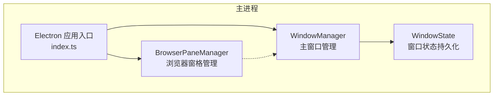
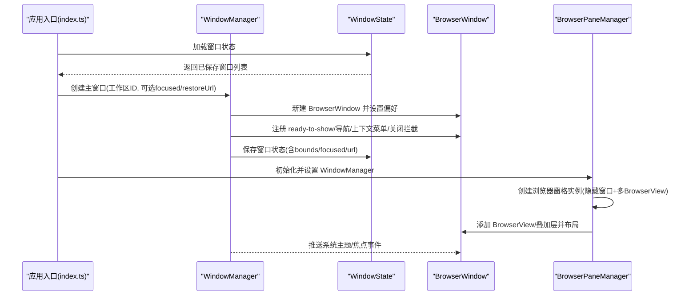
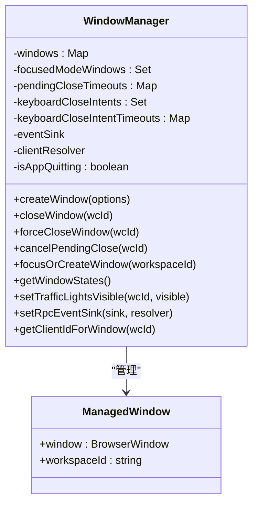
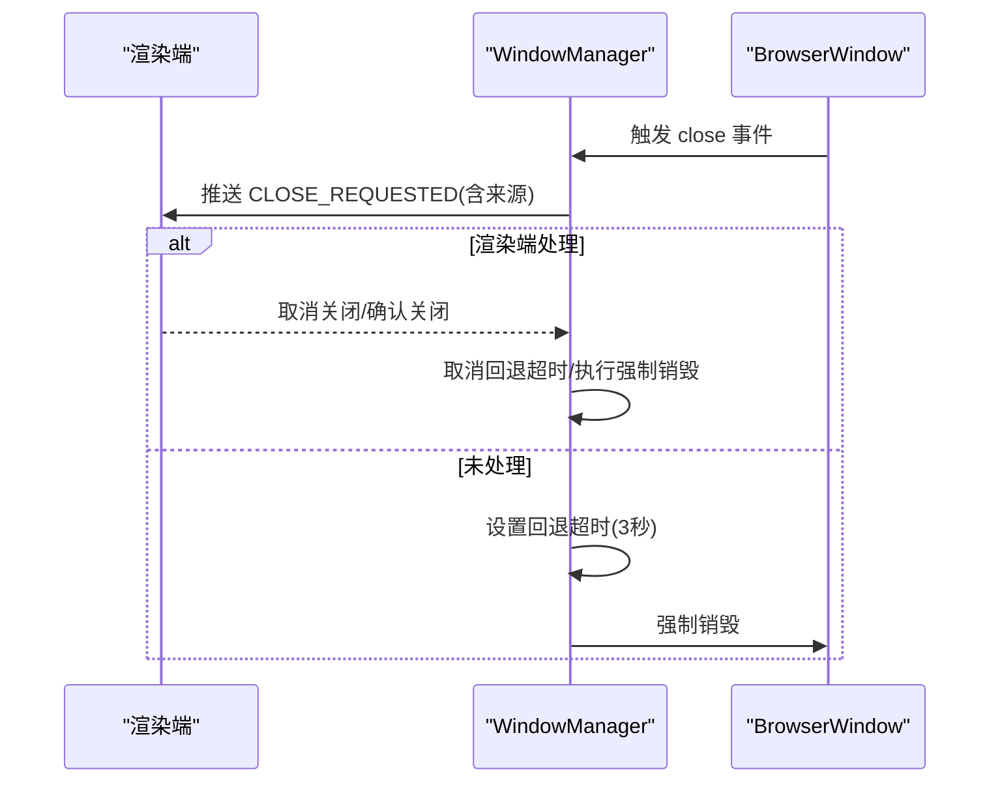
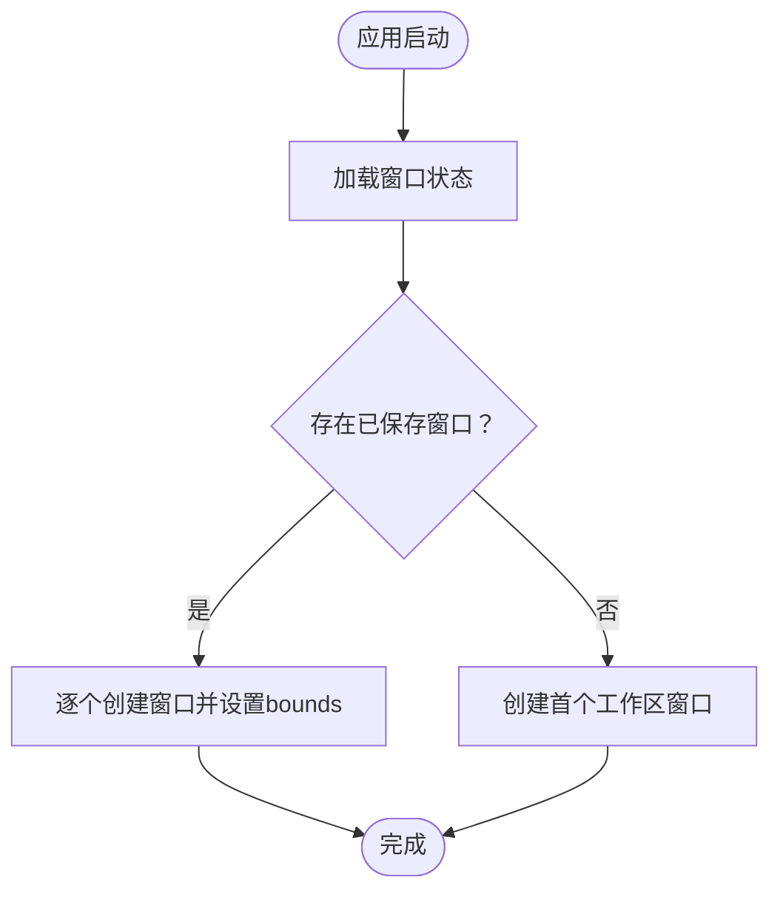
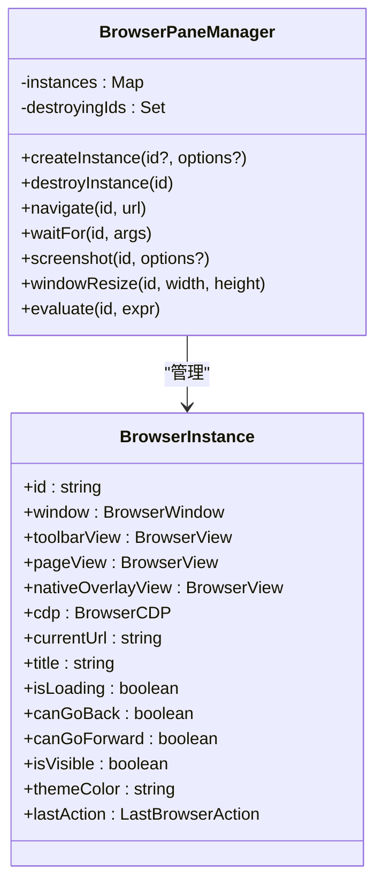
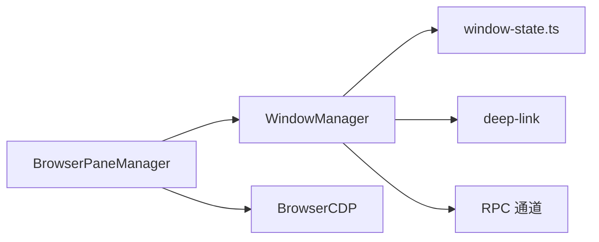

# 窗口管理系统

<cite>
**本文引用的文件**
- [apps/electron/src/main/window-manager.ts](file://apps/electron/src/main/window-manager.ts)
- [apps/electron/src/main/browser-pane-manager.ts](file://apps/electron/src/main/browser-pane-manager.ts)
- [apps/electron/src/main/window-state.ts](file://apps/electron/src/main/window-state.ts)
- [apps/electron/src/main/index.ts](file://apps/electron/src/main/index.ts)
</cite>

## 目录
1. [简介](#简介)
2. [项目结构](#项目结构)
3. [核心组件](#核心组件)
4. [架构总览](#架构总览)
5. [详细组件分析](#详细组件分析)
6. [依赖关系分析](#依赖关系分析)
7. [性能考量](#性能考量)
8. [故障排查指南](#故障排查指南)
9. [结论](#结论)
10. [附录](#附录)

## 简介
本文件为窗口管理系统的技术文档，聚焦于 WindowManager 的设计架构、窗口创建与销毁流程、多窗口协调机制，以及窗口状态管理（bounds、focused、url）、窗口持久化与恢复、窗口间通信等关键能力。同时覆盖浏览器窗格管理、窗口最小化/最大化处理、焦点管理、配置选项与自定义行为、事件监听最佳实践等内容，帮助开发者扩展窗口功能或解决相关问题。

## 项目结构
窗口管理相关代码主要位于 Electron 主进程目录中，核心文件包括：
- window-manager.ts：主窗口生命周期与状态管理
- browser-pane-manager.ts：浏览器窗格（无框窗口 + 多 BrowserView）管理
- window-state.ts：窗口状态持久化与恢复
- index.ts：应用入口，初始化窗口管理器并挂载相关服务

图表来源
- [apps/electron/src/main/window-manager.ts:53-647](file://apps/electron/src/main/window-manager.ts#L53-L647)
- [apps/electron/src/main/browser-pane-manager.ts:312-329](file://apps/electron/src/main/browser-pane-manager.ts#L312-L329)
- [apps/electron/src/main/window-state.ts:1-91](file://apps/electron/src/main/window-state.ts#L1-L91)
- [apps/electron/src/main/index.ts:436-456](file://apps/electron/src/main/index.ts#L436-L456)

章节来源
- [apps/electron/src/main/window-manager.ts:1-647](file://apps/electron/src/main/window-manager.ts#L1-L647)
- [apps/electron/src/main/browser-pane-manager.ts:1-3157](file://apps/electron/src/main/browser-pane-manager.ts#L1-L3157)
- [apps/electron/src/main/window-state.ts:1-91](file://apps/electron/src/main/window-state.ts#L1-L91)
- [apps/electron/src/main/index.ts:308-359](file://apps/electron/src/main/index.ts#L308-L359)

## 核心组件
- WindowManager：负责主窗口的创建、关闭拦截、焦点广播、键盘快捷键识别、RPC 事件推送、窗口状态持久化采集等。
- BrowserPaneManager：负责“无边框 + 多 BrowserView”的浏览器实例管理，支持导航、等待、截图、下载、CDP 控制等。
- WindowState：负责窗口状态的保存、加载与清理，包含 bounds、focused、url 等信息。
- 应用入口 index.ts：初始化 WindowManager、BrowserPaneManager，并在启动时从持久化状态恢复窗口。

章节来源
- [apps/electron/src/main/window-manager.ts:53-647](file://apps/electron/src/main/window-manager.ts#L53-L647)
- [apps/electron/src/main/browser-pane-manager.ts:312-329](file://apps/electron/src/main/browser-pane-manager.ts#L312-L329)
- [apps/electron/src/main/window-state.ts:14-30](file://apps/electron/src/main/window-state.ts#L14-L30)
- [apps/electron/src/main/index.ts:308-359](file://apps/electron/src/main/index.ts#L308-L359)

## 架构总览
下图展示了窗口管理系统的整体交互：应用启动时加载窗口状态并创建主窗口；主窗口通过 RPC 将系统主题变化、焦点状态等事件推送到渲染端；BrowserPaneManager 独立管理浏览器窗格实例，必要时与 WindowManager 协作（如空状态路由触发深链）。

图表来源
- [apps/electron/src/main/index.ts:308-359](file://apps/electron/src/main/index.ts#L308-L359)
- [apps/electron/src/main/window-manager.ts:104-408](file://apps/electron/src/main/window-manager.ts#L104-L408)
- [apps/electron/src/main/window-state.ts:35-76](file://apps/electron/src/main/window-state.ts#L35-L76)
- [apps/electron/src/main/browser-pane-manager.ts:347-504](file://apps/electron/src/main/browser-pane-manager.ts#L347-L504)

## 详细组件分析

### WindowManager 设计与实现
- 数据结构
  - 窗口映射：webContents.id → ManagedWindow（包含 BrowserWindow 与 workspaceId）
  - 聚焦模式集合：记录处于聚焦模式的窗口
  - 关闭拦截超时：为关闭拦截提供回退销毁机制
  - 键盘关闭意图：短时标记 Cmd/Ctrl+W，区分关闭来源
  - 应用退出标志：避免在退出流程中拦截关闭
- 关键方法
  - createWindow：根据选项创建窗口，设置图标、尺寸、平台特性、预加载脚本、开发/生产加载策略、失败重试与深链导航
  - closeWindow/forceCloseWindow/cancelPendingClose：分层关闭控制，支持取消与强制销毁
  - focusOrCreateWindow：按工作区聚焦或新建窗口
  - getWindowStates：采集窗口 bounds、focused、url 用于持久化
  - pushToWindow：优先通过 RPC 通道推送事件，回退到 webContents.send
  - setTrafficLightsVisible：macOS 下显示/隐藏交通灯按钮
- 事件与交互
  - ready-to-show：首次绘制后显示窗口，提升感知速度
  - will-navigate：限制外部导航，仅允许内部 URL
  - context-menu：开发环境右键菜单（Inspect/剪切板）
  - before-input-event：捕获 Cmd/Ctrl+W，标记键盘关闭意图
  - close：拦截关闭，发送 CLOSE_REQUESTED 到渲染端；3 秒回退超时强制销毁
  - closed：清理定时器、键盘意图、主题监听与映射
  - focus/blur：广播焦点状态到渲染端
  - did-fail-load：开发/生产环境下的回退加载策略

图表来源
- [apps/electron/src/main/window-manager.ts:37-647](file://apps/electron/src/main/window-manager.ts#L37-L647)

章节来源
- [apps/electron/src/main/window-manager.ts:53-647](file://apps/electron/src/main/window-manager.ts#L53-L647)

### 窗口创建与销毁流程
- 创建流程要点
  - 图标路径解析（跨平台），尺寸与最小尺寸设定，平台特定外观（macOS 隐藏标题栏、Windows 透明材质）
  - 预加载脚本注入，禁用 webviewTag，启用沙箱
  - 开发/生产环境加载策略：开发使用 Vite 服务器，生产从打包 HTML 读取查询参数
  - 深链导航：窗口 ready-to-show 后延迟推送 NAVIGATE 事件
  - 失败重试：did-fail-load 回退到默认页面
- 关闭流程要点
  - 拦截 close 事件，区分 Cmd/Ctrl+W 来源
  - 发送 CLOSE_REQUESTED 给渲染端；若渲染端未处理，3 秒后强制销毁
  - closed 清理：定时器、键盘意图、主题监听、映射表

图表来源
- [apps/electron/src/main/window-manager.ts:343-381](file://apps/electron/src/main/window-manager.ts#L343-L381)

章节来源
- [apps/electron/src/main/window-manager.ts:104-408](file://apps/electron/src/main/window-manager.ts#L104-L408)

### 多窗口协调机制
- 工作区维度管理
  - 通过 workspaceId 关联窗口，支持按工作区查找、更新、关闭
  - getAllWindowsForWorkspace：向同一工作区的所有窗口广播事件
- 焦点与最近活动窗口
  - getFocusedWindow/getLastActiveWindow：优先返回当前焦点窗口，否则返回任意可用窗口
- 与 BrowserPaneManager 的协作
  - 空状态路由触发深链时，从 WindowManager 解析当前工作区并构建深链
  - 确保浏览器窗格与主窗口上下文一致

章节来源
- [apps/electron/src/main/window-manager.ts:418-625](file://apps/electron/src/main/window-manager.ts#L418-L625)
- [apps/electron/src/main/browser-pane-manager.ts:614-641](file://apps/electron/src/main/browser-pane-manager.ts#L614-L641)

### 窗口状态管理（bounds、focused、url）
- 状态采集
  - getWindowStates：遍历所有窗口，收集 bounds、focused、url
- 状态存储
  - WindowBounds/SavedWindow/WindowState：定义持久化数据结构
  - saveWindowState/loadWindowState/clearWindowState：文件级读写
- 恢复逻辑
  - createInitialWindows：从持久化状态重建窗口，设置 bounds，可携带 restoreUrl
  - createWindow：当 restoreUrl 存在时，开发/生产分别适配 URL 基址与查询参数

图表来源
- [apps/electron/src/main/index.ts:308-359](file://apps/electron/src/main/index.ts#L308-L359)
- [apps/electron/src/main/window-state.ts:35-76](file://apps/electron/src/main/window-state.ts#L35-L76)
- [apps/electron/src/main/window-manager.ts:574-587](file://apps/electron/src/main/window-manager.ts#L574-L587)

章节来源
- [apps/electron/src/main/window-state.ts:14-91](file://apps/electron/src/main/window-state.ts#L14-L91)
- [apps/electron/src/main/index.ts:308-359](file://apps/electron/src/main/index.ts#L308-L359)

### 浏览器窗格管理
- 实例模型
  - 每个实例对应一个独立的 BrowserWindow，内含 BrowserView（页面）、BrowserView（工具栏）、BrowserView（原生叠加层）
  - 使用 CDP 进行自动化操作（点击、拖拽、输入、截图、等待网络空闲等）
- 生命周期
  - createInstance：初始化会话分区、添加视图、布局、注册监听、加载空状态页与工具栏页
  - destroyInstance：清理弹窗、代理锁定、overlay 状态、窗口销毁并最终收尾
- 导航与等待
  - navigate：自动补全 URL、带超时控制
  - waitFor：支持选择器、文本、URL 匹配、网络空闲
- 截图与标注
  - 支持 raw/agent 模式，可标注可达元素几何信息，带重试与救援显示策略

图表来源
- [apps/electron/src/main/browser-pane-manager.ts:312-329](file://apps/electron/src/main/browser-pane-manager.ts#L312-L329)
- [apps/electron/src/main/browser-pane-manager.ts:132-169](file://apps/electron/src/main/browser-pane-manager.ts#L132-L169)

章节来源
- [apps/electron/src/main/browser-pane-manager.ts:347-504](file://apps/electron/src/main/browser-pane-manager.ts#L347-L504)
- [apps/electron/src/main/browser-pane-manager.ts:685-743](file://apps/electron/src/main/browser-pane-manager.ts#L685-L743)
- [apps/electron/src/main/browser-pane-manager.ts:1459-1522](file://apps/electron/src/main/browser-pane-manager.ts#L1459-L1522)
- [apps/electron/src/main/browser-pane-manager.ts:1009-1148](file://apps/electron/src/main/browser-pane-manager.ts#L1009-L1148)

### 窗口最小化/最大化与焦点管理
- 最小化/还原：WindowManager 在聚焦现有窗口时检查最小化状态并恢复
- 焦点广播：窗口 focus/blur 事件通过 RPC 推送 FOCUS_STATE
- macOS 交通灯控制：setTrafficLightsVisible 动态显示/隐藏并恢复位置
- 获取焦点/最近活动窗口：getFocusedWindow/getLastActiveWindow 提供便捷访问

章节来源
- [apps/electron/src/main/window-manager.ts:558-625](file://apps/electron/src/main/window-manager.ts#L558-L625)
- [apps/electron/src/main/window-manager.ts:312-317](file://apps/electron/src/main/window-manager.ts#L312-L317)
- [apps/electron/src/main/window-manager.ts:632-645](file://apps/electron/src/main/window-manager.ts#L632-L645)

### 窗口间通信与事件推送
- RPC 事件推送：setRpcEventSink 注入事件通道与客户端解析器；pushToWindow 优先通过 RPC，失败回退到 webContents.send
- 系统主题：nativeTheme 更新事件广播给窗口
- 关闭拦截：close 事件统一由渲染端处理，支持键盘来源识别与回退销毁

章节来源
- [apps/electron/src/main/window-manager.ts:67-98](file://apps/electron/src/main/window-manager.ts#L67-L98)
- [apps/electron/src/main/window-manager.ts:305-317](file://apps/electron/src/main/window-manager.ts#L305-L317)
- [apps/electron/src/main/window-manager.ts:343-381](file://apps/electron/src/main/window-manager.ts#L343-L381)

### 窗口配置选项与自定义行为
- CreateWindowOptions
  - workspaceId：工作区标识
  - focused：聚焦模式（较小窗口，无侧边栏）
  - initialDeepLink：窗口加载后导航至的深链
  - restoreUrl：从持久化状态恢复时使用的完整 URL
- 平台特性
  - macOS：隐藏标题栏、交通灯位置、vibrancy
  - Windows：原生框架、按系统版本选择背景材质（Mica/Acrylic）
  - Linux：原生框架
- 预加载与安全
  - 禁用 webviewTag，启用沙箱，contextIsolation，preload 脚本注入

章节来源
- [apps/electron/src/main/window-manager.ts:42-51](file://apps/electron/src/main/window-manager.ts#L42-L51)
- [apps/electron/src/main/window-manager.ts:136-172](file://apps/electron/src/main/window-manager.ts#L136-L172)

### 窗口事件监听最佳实践
- 使用 ready-to-show 显示窗口，避免白屏
- 在 will-navigate 中严格校验内部 URL，防止外部导航
- before-input-event 捕获键盘关闭意图，区分 Cmd/Ctrl+W
- close 事件统一拦截，通过 CLOSE_REQUESTED 让渲染端决定是否关闭
- closed 事件中清理定时器与监听，避免内存泄漏
- focus/blur 事件用于广播焦点状态，便于渲染端切换 UI

章节来源
- [apps/electron/src/main/window-manager.ts:174-195](file://apps/electron/src/main/window-manager.ts#L174-L195)
- [apps/electron/src/main/window-manager.ts:319-341](file://apps/electron/src/main/window-manager.ts#L319-L341)
- [apps/electron/src/main/window-manager.ts:343-404](file://apps/electron/src/main/window-manager.ts#L343-L404)

## 依赖关系分析
- WindowManager 依赖
  - Electron BrowserWindow、shell、nativeTheme、Menu、app
  - window-state.ts：保存/加载窗口状态
  - deep-link：解析深链并导航
  - RPC 通道：通过 setRpcEventSink 注入事件推送
- BrowserPaneManager 依赖
  - Electron BrowserView、BrowserWindow、session、nativeTheme
  - BrowserCDP：进行 CDP 自动化
  - WindowManager：解析当前工作区以构建深链

图表来源
- [apps/electron/src/main/window-manager.ts:67-98](file://apps/electron/src/main/window-manager.ts#L67-L98)
- [apps/electron/src/main/window-manager.ts:288-302](file://apps/electron/src/main/window-manager.ts#L288-L302)
- [apps/electron/src/main/browser-pane-manager.ts:614-641](file://apps/electron/src/main/browser-pane-manager.ts#L614-L641)

章节来源
- [apps/electron/src/main/window-manager.ts:1-10](file://apps/electron/src/main/window-manager.ts#L1-L10)
- [apps/electron/src/main/browser-pane-manager.ts:1-25](file://apps/electron/src/main/browser-pane-manager.ts#L1-L25)

## 性能考量
- 启动体验
  - ready-to-show 延迟显示，减少白屏时间
  - did-fail-load 在开发模式下重试 Vite 服务器，提高稳定性
- 关闭拦截
  - CLOSE_REQUESTED + 回退超时，平衡用户体验与可靠性
- 截图与渲染
  - BrowserPaneManager 的截图采用隐藏捕获 + 救援显示策略，避免黑屏与崩溃
  - 网络空闲等待与重试，确保截图质量与一致性

[本节为通用指导，无需列出具体文件来源]

## 故障排查指南
- 窗口无法关闭
  - 检查渲染端是否处理 CLOSE_REQUESTED；若未处理，3 秒后强制销毁
  - 确认键盘关闭意图是否被正确清除
- 窗口恢复异常
  - 确认 window-state.json 是否存在有效格式；检查工作区 ID 是否仍有效
  - 生产环境 restoreUrl 会被解析为查询参数并重新构建 URL
- 深链导航无效
  - 确认 deep-link 解析成功且渲染端已注册相应监听
  - 确保 WindowManager 已初始化并注入 RPC 通道
- 截图失败
  - 检查是否因窗口不可见导致显示表面不可用；尝试先显示窗口再截图
  - 等待网络空闲后再截图，或调整等待参数

章节来源
- [apps/electron/src/main/window-manager.ts:343-381](file://apps/electron/src/main/window-manager.ts#L343-L381)
- [apps/electron/src/main/window-state.ts:55-76](file://apps/electron/src/main/window-state.ts#L55-L76)
- [apps/electron/src/main/browser-pane-manager.ts:1242-1355](file://apps/electron/src/main/browser-pane-manager.ts#L1242-L1355)

## 结论
WindowManager 通过严格的窗口生命周期管理、平台特性适配、RPC 事件推送与关闭拦截机制，提供了稳定可靠的主窗口体验；BrowserPaneManager 则以“无框 + 多 BrowserView”架构实现了强大的浏览器自动化能力。结合 WindowState 的持久化与恢复，系统能够在不同工作区之间保持一致的窗口行为与状态。开发者可基于现有接口扩展窗口功能、优化事件处理与错误恢复策略。

[本节为总结性内容，无需列出具体文件来源]

## 附录
- 关键接口与职责
  - WindowManager：窗口创建/关闭/聚焦/状态采集/事件推送
  - BrowserPaneManager：浏览器实例生命周期、导航、等待、截图、CDP 自动化
  - WindowState：窗口状态的保存/加载/清理
  - 应用入口：初始化与恢复窗口

章节来源
- [apps/electron/src/main/window-manager.ts:53-647](file://apps/electron/src/main/window-manager.ts#L53-L647)
- [apps/electron/src/main/browser-pane-manager.ts:312-329](file://apps/electron/src/main/browser-pane-manager.ts#L312-L329)
- [apps/electron/src/main/window-state.ts:14-91](file://apps/electron/src/main/window-state.ts#L14-L91)
- [apps/electron/src/main/index.ts:308-359](file://apps/electron/src/main/index.ts#L308-L359)