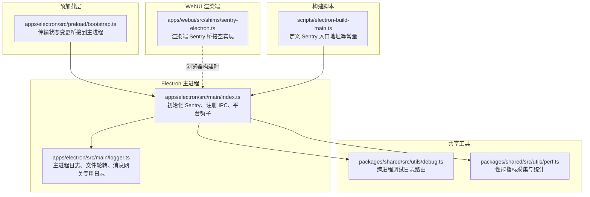
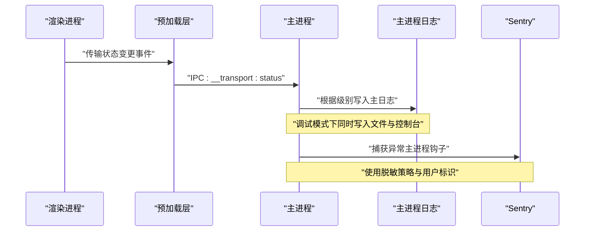
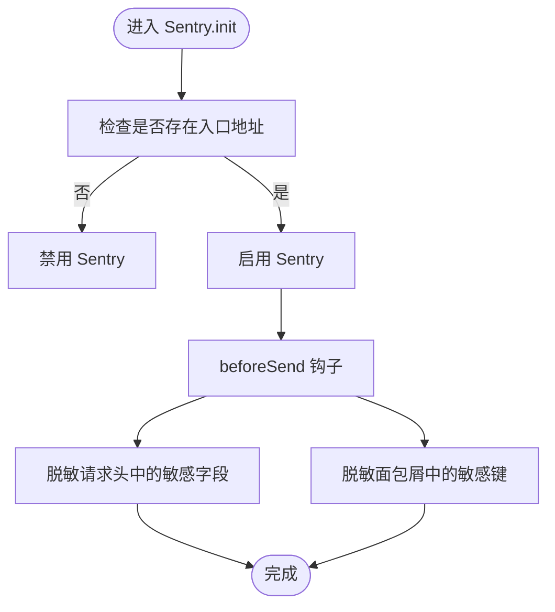
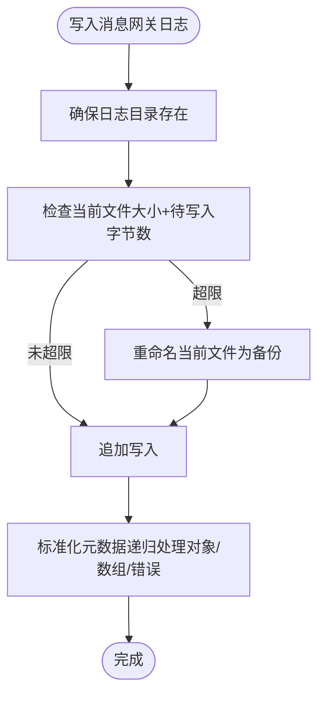
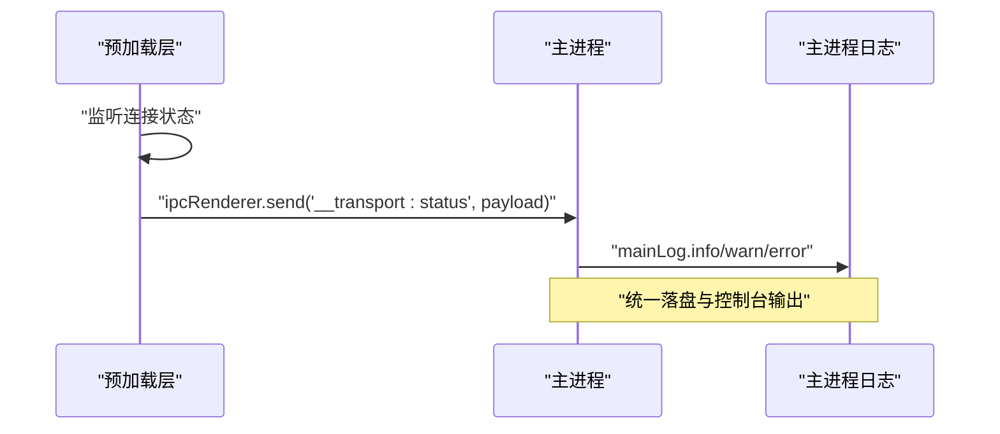
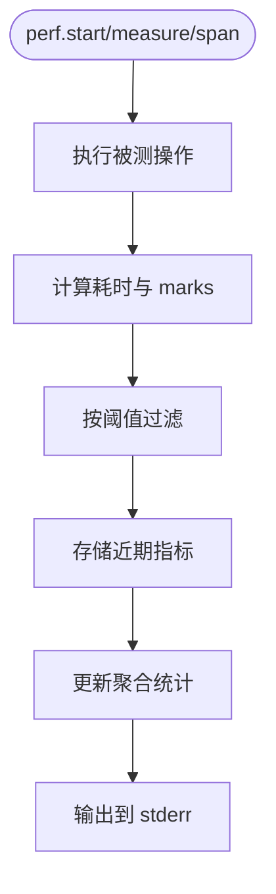
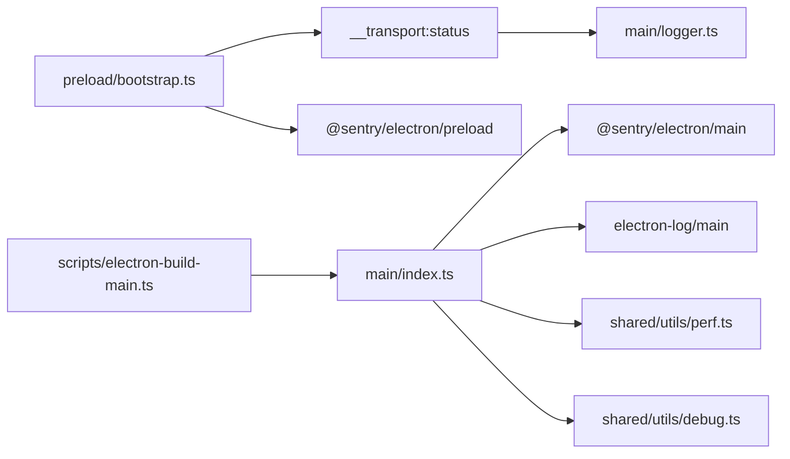

# 错误监控与日志

<cite>
**本文引用的文件**
- [apps/electron/src/main/index.ts](file://apps/electron/src/main/index.ts)
- [apps/electron/src/main/logger.ts](file://apps/electron/src/main/logger.ts)
- [apps/electron/src/preload/bootstrap.ts](file://apps/electron/src/preload/bootstrap.ts)
- [apps/webui/src/shims/sentry-electron.ts](file://apps/webui/src/shims/sentry-electron.ts)
- [packages/shared/src/utils/debug.ts](file://packages/shared/src/utils/debug.ts)
- [packages/shared/src/utils/perf.ts](file://packages/shared/src/utils/perf.ts)
- [packages/shared/src/agent/browser-tool-runtime.ts](file://packages/shared/src/agent/browser-tool-runtime.ts)
- [packages/shared/src/agent/claude-agent.ts](file://packages/shared/src/agent/claude-agent.ts)
- [packages/shared/src/interceptor-common.ts](file://packages/shared/src/interceptor-common.ts)
- [scripts/electron-build-main.ts](file://scripts/electron-build-main.ts)
</cite>

## 目录
1. [简介](#简介)
2. [项目结构](#项目结构)
3. [核心组件](#核心组件)
4. [架构总览](#架构总览)
5. [详细组件分析](#详细组件分析)
6. [依赖关系分析](#依赖关系分析)
7. [性能考量](#性能考量)
8. [故障排查指南](#故障排查指南)
9. [结论](#结论)
10. [附录](#附录)

## 简介
本技术文档聚焦于本项目的错误监控与日志体系，涵盖以下关键主题：
- Sentry 集成配置与启用条件、数据脱敏策略
- 主进程日志记录与文件轮转
- 渲染进程日志桥接与传输
- 敏感信息脱敏处理（请求头、面包屑、凭证）
- 日志文件管理与轮转策略
- 性能监控（轻量级）与统计输出
- 错误报告最佳实践、调试技巧与生产环境监控配置建议

## 项目结构
围绕错误监控与日志的关键目录与文件如下：
- Electron 主进程：初始化 Sentry、配置日志、桥接传输状态到主日志
- Electron 预加载层：桥接传输状态到主进程，触发主日志记录
- 共享工具：通用调试日志、性能监控
- WebUI 渲染端：Sentry 渲染器桥接（浏览器构建时为空实现）
- 构建脚本：定义 Sentry 入口地址等编译期常量

图表来源
- [apps/electron/src/main/index.ts:10-59](file://apps/electron/src/main/index.ts#L10-L59)
- [apps/electron/src/main/logger.ts:1-218](file://apps/electron/src/main/logger.ts#L1-L218)
- [apps/electron/src/preload/bootstrap.ts:19,208-244](file://apps/electron/src/preload/bootstrap.ts#L19,L208-L244)
- [packages/shared/src/utils/debug.ts:1-167](file://packages/shared/src/utils/debug.ts#L1-L167)
- [packages/shared/src/utils/perf.ts:1-418](file://packages/shared/src/utils/perf.ts#L1-L418)
- [apps/webui/src/shims/sentry-electron.ts:1-6](file://apps/webui/src/shims/sentry-electron.ts#L1-L6)
- [scripts/electron-build-main.ts:52-63](file://scripts/electron-build-main.ts#L52-L63)

章节来源
- [apps/electron/src/main/index.ts:10-59](file://apps/electron/src/main/index.ts#L10-L59)
- [apps/electron/src/main/logger.ts:1-218](file://apps/electron/src/main/logger.ts#L1-L218)
- [apps/electron/src/preload/bootstrap.ts:19,208-L244](file://apps/electron/src/preload/bootstrap.ts#L19,L208-L244)
- [packages/shared/src/utils/debug.ts:1-167](file://packages/shared/src/utils/debug.ts#L1-L167)
- [packages/shared/src/utils/perf.ts:1-418](file://packages/shared/src/utils/perf.ts#L1-L418)
- [apps/webui/src/shims/sentry-electron.ts:1-6](file://apps/webui/src/shims/sentry-electron.ts#L1-L6)
- [scripts/electron-build-main.ts:52-63](file://scripts/electron-build-main.ts#L52-L63)

## 核心组件
- Sentry 主进程集成与脱敏
  - 在主进程尽早初始化，按打包状态启用，并在开发/生产间切换环境标签
  - 使用 beforeSend 对请求头与面包屑中的敏感键进行脱敏
  - 设置匿名机器标识（哈希）用于用户追踪
- 主进程日志与文件轮转
  - 基于 electron-log 的多传输配置：文件与控制台
  - 调试模式下启用 JSON 文件格式与可读控制台格式
  - 生产模式关闭文件与控制台传输
  - 专用消息网关日志文件路径与 5MB 轮转
- 预加载层日志桥接
  - 将远程连接状态变化通过 IPC 发送到主进程，统一写入主日志
- 共享调试日志与性能监控
  - 自动识别运行环境并路由输出至控制台或 electron-log
  - 支持作用域化日志与安全对象序列化
  - 轻量性能计时与聚合统计，仅在调试或显式启用时输出
- WebUI 渲染端 Sentry 桥接
  - 浏览器构建时为无操作实现，避免在非 Electron 环境引入依赖

章节来源
- [apps/electron/src/main/index.ts:10-59](file://apps/electron/src/main/index.ts#L10-L59)
- [apps/electron/src/main/logger.ts:38-104](file://apps/electron/src/main/logger.ts#L38-L104)
- [apps/electron/src/preload/bootstrap.ts:208-244](file://apps/electron/src/preload/bootstrap.ts#L208-L244)
- [packages/shared/src/utils/debug.ts:104-166](file://packages/shared/src/utils/debug.ts#L104-L166)
- [packages/shared/src/utils/perf.ts:77-148](file://packages/shared/src/utils/perf.ts#L77-L148)
- [apps/webui/src/shims/sentry-electron.ts:1-6](file://apps/webui/src/shims/sentry-electron.ts#L1-L6)

## 架构总览
下图展示从渲染进程到主进程再到日志与错误监控的整体流程。

图表来源
- [apps/electron/src/preload/bootstrap.ts:208-244](file://apps/electron/src/preload/bootstrap.ts#L208-L244)
- [apps/electron/src/main/index.ts:481-512](file://apps/electron/src/main/index.ts#L481-L512)
- [apps/electron/src/main/logger.ts:38-68](file://apps/electron/src/main/logger.ts#L38-L68)
- [apps/electron/src/main/index.ts:20-59](file://apps/electron/src/main/index.ts#L20-L59)

## 详细组件分析

### Sentry 集成与脱敏策略
- 初始化位置与启用条件
  - 在主进程导入后尽早初始化，基于打包状态设置环境与 release 版本
  - 仅当存在入口地址时启用，避免开发环境噪音
- 脱敏规则
  - 请求头：对 authorization、cookie、x-api-key 等敏感字段进行脱敏
  - 面包屑：遍历 data 中的键，若包含 token、key、secret、password、credential、auth 等关键词则脱敏
- 用户标识
  - 基于主机名与用户主目录生成稳定哈希作为匿名用户 ID

图表来源
- [apps/electron/src/main/index.ts:20-59](file://apps/electron/src/main/index.ts#L20-L59)

章节来源
- [apps/electron/src/main/index.ts:20-59](file://apps/electron/src/main/index.ts#L20-L59)

### 主进程日志记录与文件轮转
- 传输配置
  - 调试模式：文件传输采用 JSON 格式，控制台传输采用可读格式；文件最大 5MB
  - 生产模式：关闭文件与控制台传输
- 专用消息网关日志
  - 写入用户主目录下的独立日志文件，路径稳定且跨构建版本一致
  - 单次写入前执行大小检查，超过阈值则备份旧文件，避免覆盖
  - 对错误写入失败进行降级记录（主日志警告），保证可观测性
- 日志路径查询
  - 提供获取当前主日志文件路径与消息网关日志路径的方法

图表来源
- [apps/electron/src/main/logger.ts:88-175](file://apps/electron/src/main/logger.ts#L88-L175)

章节来源
- [apps/electron/src/main/logger.ts:38-68](file://apps/electron/src/main/logger.ts#L38-L68)
- [apps/electron/src/main/logger.ts:88-175](file://apps/electron/src/main/logger.ts#L88-L175)
- [apps/electron/src/main/logger.ts:208-215](file://apps/electron/src/main/logger.ts#L208-L215)

### 渲染进程日志桥接
- 传输状态上报
  - 预加载层监听远程连接状态变化，将状态、错误、重试信息等通过 IPC 发送到主进程
  - 主进程根据级别将信息写入主日志，便于终端与 main.log 观察
- 作用与收益
  - 将原本仅可见于 DevTools 的网络/连接问题，同步到主进程日志，提升排障效率

图表来源
- [apps/electron/src/preload/bootstrap.ts:208-244](file://apps/electron/src/preload/bootstrap.ts#L208-L244)
- [apps/electron/src/main/index.ts:481-512](file://apps/electron/src/main/index.ts#L481-L512)

章节来源
- [apps/electron/src/preload/bootstrap.ts:208-244](file://apps/electron/src/preload/bootstrap.ts#L208-L244)
- [apps/electron/src/main/index.ts:481-512](file://apps/electron/src/main/index.ts#L481-L512)

### 敏感信息脱敏处理
- electron-log 输出脱敏
  - 在主进程输出到 electron-log 时，自动将敏感字段替换为占位符，降低泄露风险
- 共享调试日志安全序列化
  - 对对象进行安全字符串化，循环引用以特定标记替代，避免序列化异常
- 渲染端 Sentry 桥接
  - 浏览器构建时为无操作实现，避免在非 Electron 环境引入依赖

章节来源
- [apps/electron/src/main/logger.ts:106-111](file://apps/electron/src/main/logger.ts#L106-L111)
- [packages/shared/src/utils/debug.ts:68-84](file://packages/shared/src/utils/debug.ts#L68-L84)
- [apps/webui/src/shims/sentry-electron.ts:1-6](file://apps/webui/src/shims/sentry-electron.ts#L1-L6)

### 日志文件管理与轮转
- 主日志文件
  - 调试模式下启用文件传输，最大 5MB；生产模式关闭
  - 可查询当前日志文件路径，便于定位与收集
- 消息网关日志
  - 固定路径，单文件上限 5MB，超限自动备份
  - 写入失败会回退到主日志记录警告，保证可观测性

章节来源
- [apps/electron/src/main/logger.ts:38-68](file://apps/electron/src/main/logger.ts#L38-L68)
- [apps/electron/src/main/logger.ts:208-215](file://apps/electron/src/main/logger.ts#L208-L215)

### 性能监控（轻量级）
- 启用条件
  - 默认关闭；可通过调试模式或显式启用
- 计时方式
  - start/measure/measureSync/span 多种计时接口
  - 支持中间标记（marks）与元数据附加
- 统计输出
  - 近期指标与聚合统计（含 p50/p95）
  - 仅输出到 stderr，避免污染 stdout
- 使用建议
  - 在关键路径埋点，结合 marks 分解瓶颈
  - 通过最小阈值过滤噪声

图表来源
- [packages/shared/src/utils/perf.ts:193-231](file://packages/shared/src/utils/perf.ts#L193-L231)
- [packages/shared/src/utils/perf.ts:124-148](file://packages/shared/src/utils/perf.ts#L124-L148)

章节来源
- [packages/shared/src/utils/perf.ts:77-148](file://packages/shared/src/utils/perf.ts#L77-L148)
- [packages/shared/src/utils/perf.ts:193-301](file://packages/shared/src/utils/perf.ts#L193-L301)

### 错误报告与诊断辅助
- 传输状态桥接
  - 预加载层将连接失败、重试、关闭原因等信息上报主进程，统一记录
- API 错误捕获与映射
  - Claude 等代理在错误事件后尝试解析 SDK 调试日志，提取最近错误上下文
  - 共享模块提供弹出与清理最近一次 API 错误文件的能力，支持会话级与全局级
- 浏览器工具运行时
  - 对导航命令与转义字符进行解码，便于日志与错误上下文可读

章节来源
- [apps/electron/src/preload/bootstrap.ts:208-244](file://apps/electron/src/preload/bootstrap.ts#L208-L244)
- [packages/shared/src/agent/claude-agent.ts:2275-2336](file://packages/shared/src/agent/claude-agent.ts#L2275-L2336)
- [packages/shared/src/interceptor-common.ts:177-211](file://packages/shared/src/interceptor-common.ts#L177-L211)
- [packages/shared/src/agent/browser-tool-runtime.ts:352-359](file://packages/shared/src/agent/browser-tool-runtime.ts#L352-L359)

## 依赖关系分析
- 主进程依赖
  - @sentry/electron/main：错误监控
  - electron-log/main：日志传输
  - 平台服务注入：将捕获异常回调注入会话运行时钩子
- 预加载层依赖
  - @sentry/electron/preload：渲染端桥接
  - 通过 IPC 将传输状态同步到主进程
- 构建脚本
  - 定义 Sentry 入口地址等编译期常量，便于在不同环境注入

图表来源
- [apps/electron/src/main/index.ts:9,100-L101](file://apps/electron/src/main/index.ts#L9,L100-L101)
- [apps/electron/src/preload/bootstrap.ts:19](file://apps/electron/src/preload/bootstrap.ts#L19)
- [scripts/electron-build-main.ts:52-63](file://scripts/electron-build-main.ts#L52-L63)

章节来源
- [apps/electron/src/main/index.ts:9,100-L101](file://apps/electron/src/main/index.ts#L9,L100-L101)
- [apps/electron/src/preload/bootstrap.ts:19](file://apps/electron/src/preload/bootstrap.ts#L19)
- [scripts/electron-build-main.ts:52-63](file://scripts/electron-build-main.ts#L52-L63)

## 性能考量
- 性能计时默认关闭，仅在调试或显式启用时输出，避免生产环境开销
- 统计输出定向 stderr，不干扰 stdout
- 指标上限与百分位计算限制在有限窗口内，兼顾准确性与内存占用

## 故障排查指南
- 无法看到传输错误日志
  - 确认预加载层已监听连接状态并发送 IPC
  - 检查主进程是否正确接收并写入主日志
- 消息网关日志未生成或被覆盖
  - 检查专用日志路径是否存在权限问题
  - 确认文件大小未超过 5MB 导致备份
- Sentry 未上报或数据不完整
  - 确认入口地址已正确注入
  - 检查脱敏规则是否误删关键字段
  - 核对用户标识是否按预期生成
- 调试日志缺失
  - 确认调试模式已启用（主进程启动时会设置环境变量）
  - 检查共享调试工具的环境检测逻辑

章节来源
- [apps/electron/src/preload/bootstrap.ts:208-244](file://apps/electron/src/preload/bootstrap.ts#L208-L244)
- [apps/electron/src/main/logger.ts:88-175](file://apps/electron/src/main/logger.ts#L88-L175)
- [apps/electron/src/main/index.ts:20-59](file://apps/electron/src/main/index.ts#L20-L59)
- [packages/shared/src/utils/debug.ts:14-29](file://packages/shared/src/utils/debug.ts#L14-L29)

## 结论
本项目在 Electron 主进程侧实现了完善的错误监控与日志体系：Sentry 的早期初始化与脱敏策略确保了生产环境的安全与可控；主进程日志与专用消息网关日志配合文件轮转，提供了稳定的可观测性；预加载层将传输状态桥接至主进程，使网络问题可见于终端与日志文件；共享的调试与性能工具为开发与排障提供了便利。建议在生产环境中保持 Sentry 启用与脱敏策略不变，合理使用性能计时与日志轮转，持续优化错误映射与诊断辅助能力。

## 附录
- 最佳实践
  - 在主进程钩子中统一捕获异常并附加上下文标签（如错误来源、会话 ID）
  - 对外部调用与网络请求使用性能计时，标注关键 marks
  - 保持消息网关日志独立存放与轮转，便于跨版本排查
  - 在浏览器构建时使用渲染端 Sentry 桥接的空实现，避免依赖污染
- 生产环境监控配置建议
  - 明确区分开发与生产环境标签，避免混淆
  - 保留必要的面包屑与上下文，但严格遵循脱敏策略
  - 定期审查日志轮转与保留策略，平衡磁盘占用与可追溯性