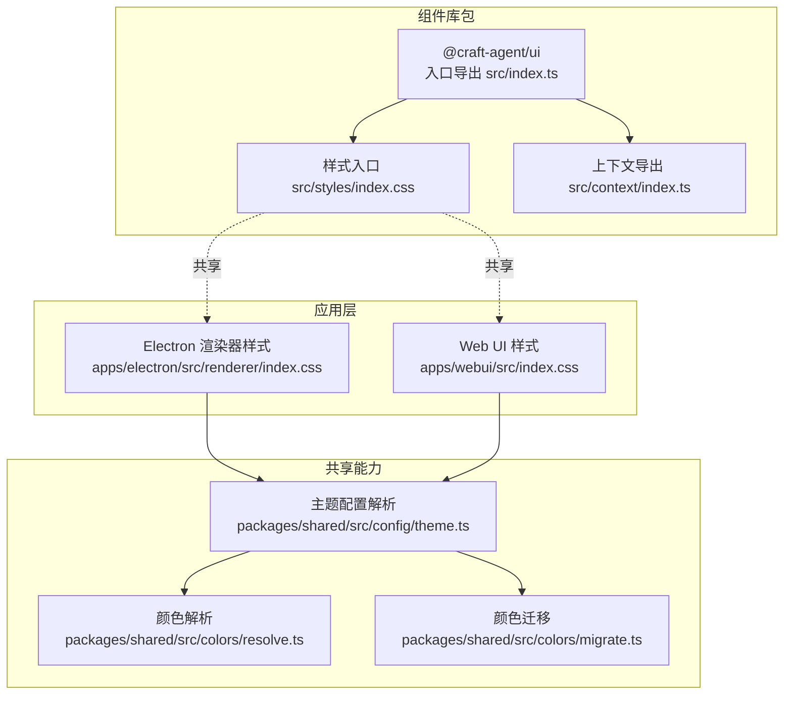
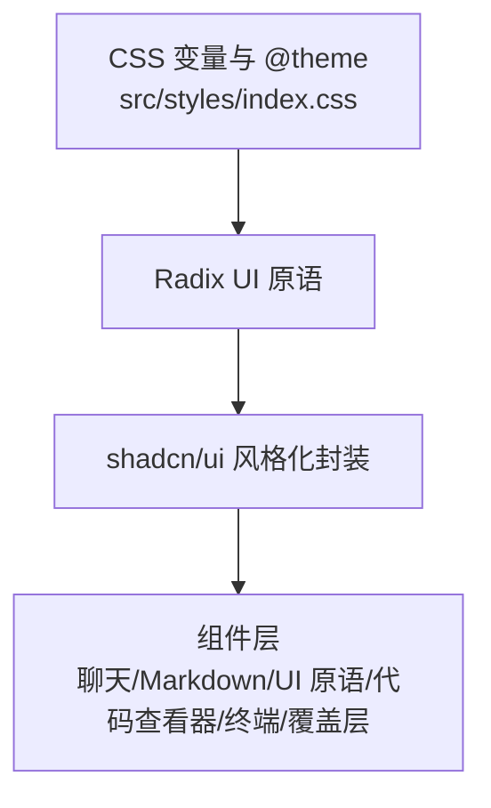
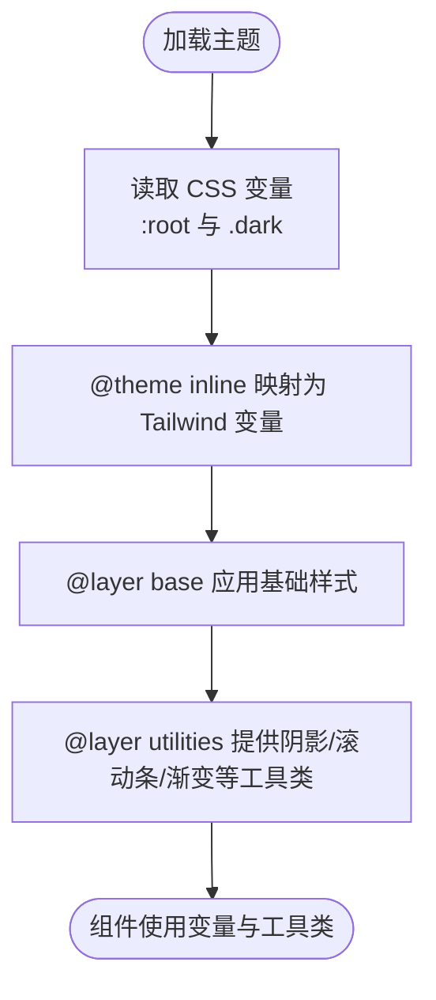
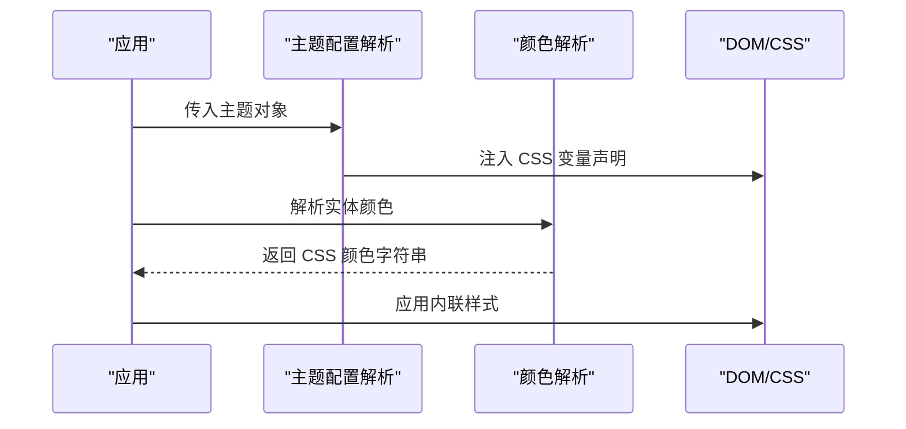
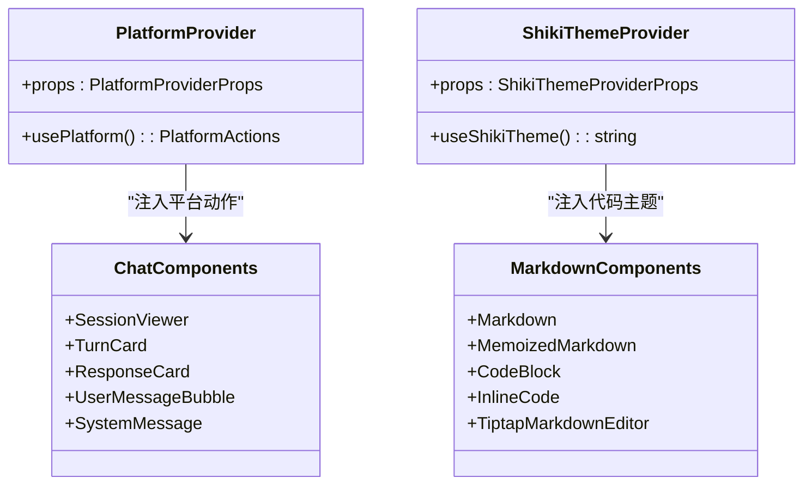
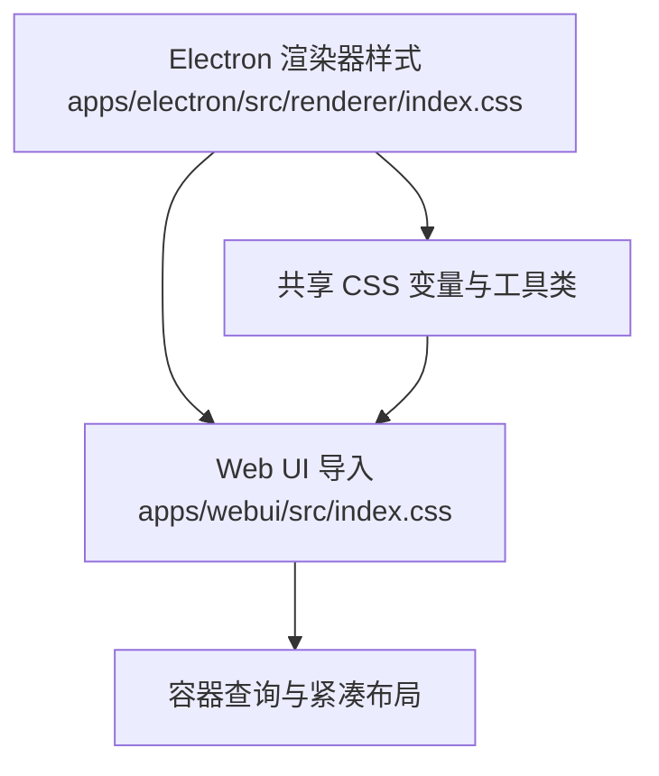
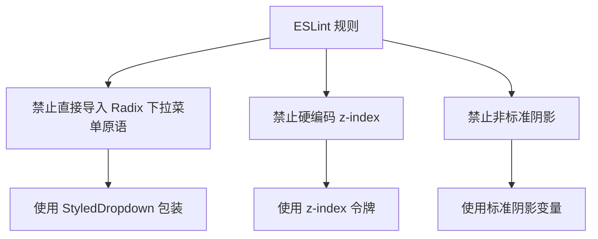
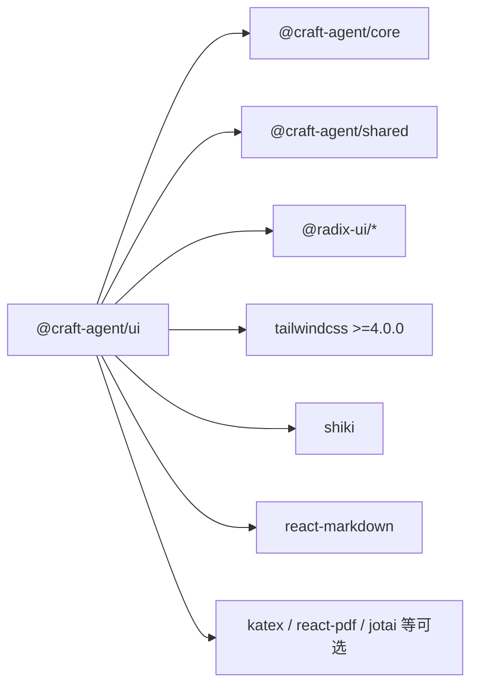

# UI 组件库开发

<cite>
**本文档引用的文件**
- [packages/ui/package.json](file://packages/ui/package.json)
- [packages/ui/src/index.ts](file://packages/ui/src/index.ts)
- [packages/ui/src/styles/index.css](file://packages/ui/src/styles/index.css)
- [packages/ui/tsconfig.json](file://packages/ui/tsconfig.json)
- [packages/ui/src/context/index.ts](file://packages/ui/src/context/index.ts)
- [apps/electron/src/renderer/index.css](file://apps/electron/src/renderer/index.css)
- [apps/webui/src/index.css](file://apps/webui/src/index.css)
- [packages/shared/src/config/theme.ts](file://packages/shared/src/config/theme.ts)
- [packages/shared/src/colors/migrate.ts](file://packages/shared/src/colors/migrate.ts)
- [packages/shared/src/colors/resolve.ts](file://packages/shared/src/colors/resolve.ts)
- [packages/ui/eslint.config.mjs](file://packages/ui/eslint.config.mjs)
</cite>

## 目录
1. [简介](#简介)
2. [项目结构](#项目结构)
3. [核心组件](#核心组件)
4. [架构总览](#架构总览)
5. [详细组件分析](#详细组件分析)
6. [依赖关系分析](#依赖关系分析)
7. [性能考虑](#性能考虑)
8. [故障排除指南](#故障排除指南)
9. [结论](#结论)
10. [附录](#附录)

## 简介
本文件为基于 shadcn/ui + Radix UI + Tailwind CSS 的设计系统与 UI 组件库开发文档。目标是帮助开发者理解并高效地开发、维护与扩展该组件库，涵盖设计系统架构、样式系统、主题适配机制、组件开发规范、Props 类型定义、事件处理模式、组件复用策略、自定义主题支持与响应式设计实现。

## 项目结构
组件库位于 packages/ui，采用模块化导出方式，按功能域拆分组件与上下文，并通过统一入口集中导出。样式系统以 Tailwind CSS v4 为核心，结合 CSS 自定义属性与 @theme 指令，形成可定制的主题变量体系；桌面端与 Web 端共享同一套主题变量与基础样式，确保视觉一致性。

**图表来源**
- [packages/ui/src/index.ts:1-288](file://packages/ui/src/index.ts#L1-L288)
- [packages/ui/src/styles/index.css:1-550](file://packages/ui/src/styles/index.css#L1-L550)
- [packages/ui/src/context/index.ts:1-17](file://packages/ui/src/context/index.ts#L1-L17)
- [apps/electron/src/renderer/index.css:1-800](file://apps/electron/src/renderer/index.css#L1-L800)
- [apps/webui/src/index.css:1-53](file://apps/webui/src/index.css#L1-L53)
- [packages/shared/src/config/theme.ts:135-207](file://packages/shared/src/config/theme.ts#L135-L207)
- [packages/shared/src/colors/resolve.ts:1-33](file://packages/shared/src/colors/resolve.ts#L1-L33)
- [packages/shared/src/colors/migrate.ts:1-37](file://packages/shared/src/colors/migrate.ts#L1-L37)

**章节来源**
- [packages/ui/src/index.ts:1-288](file://packages/ui/src/index.ts#L1-L288)
- [packages/ui/src/styles/index.css:1-550](file://packages/ui/src/styles/index.css#L1-L550)
- [packages/ui/src/context/index.ts:1-17](file://packages/ui/src/context/index.ts#L1-L17)
- [apps/electron/src/renderer/index.css:1-800](file://apps/electron/src/renderer/index.css#L1-L800)
- [apps/webui/src/index.css:1-53](file://apps/webui/src/index.css#L1-L53)

## 核心组件
组件库通过统一入口集中导出，包括：
- 上下文：平台抽象（PlatformProvider/usePlatform）、代码主题（ShikiThemeProvider/useShikiTheme）
- 聊天组件：会话查看器、对话卡片、响应卡片、用户消息气泡、系统消息等
- Markdown：渲染器、可折叠容器、编辑器、图片块、表格块等
- UI 原语：下拉菜单、提示框、浏览器着色器、岛屿视图等
- 代码查看器：语法高亮、差异对比、控制面板
- 终端输出：ANSI 解析、grep 输出解析
- 覆盖层组件：全屏覆盖、预览覆盖、JSON/表格/图像/PDF 预览等
- 工具函数：布局常量、文件分类、工具结果解析、通用工具

这些组件均遵循一致的设计语言与样式系统，便于在不同运行环境（Electron 与 Web）中保持一致体验。

**章节来源**
- [packages/ui/src/index.ts:17-288](file://packages/ui/src/index.ts#L17-L288)

## 架构总览
组件库采用“样式变量 + 主题上下文 + 组件封装”的三层架构：
- 样式变量层：Tailwind v4 变量与 CSS 自定义属性，定义 6 色系统、混合色、阴影、字体与层级
- 主题适配层：通过 CSS 变量与 @theme 指令实现明暗模式切换与场景模式（如玻璃效果）
- 组件封装层：以 Radix UI 为基础，结合 shadcn/ui 的风格化包装，提供稳定一致的交互与外观

**图表来源**
- [packages/ui/src/styles/index.css:223-276](file://packages/ui/src/styles/index.css#L223-L276)
- [packages/ui/src/index.ts:28-183](file://packages/ui/src/index.ts#L28-L183)

## 详细组件分析

### 设计系统与样式系统
- 6 色系统：背景、前景、强调色（品牌紫）、信息色（警告琥珀）、成功色（连接绿）、破坏色（错误红）
- 混合变体：通过 color-mix 生成 2%-95% 的混合色，用于边框、悬停、探索模式等
- 阴影系统：提供多级阴影变量，适配不同组件层级与场景
- 字体系统：系统字体用于界面文本，JetBrains Mono 用于代码
- 层级系统：z-index 分层，避免堆叠上下文冲突
- Tailwind v4 集成：通过 @theme inline 将 CSS 变量映射为 Tailwind 主题变量

**图表来源**
- [packages/ui/src/styles/index.css:33-326](file://packages/ui/src/styles/index.css#L33-L326)
- [packages/ui/src/styles/index.css:223-276](file://packages/ui/src/styles/index.css#L223-L276)

**章节来源**
- [packages/ui/src/styles/index.css:1-550](file://packages/ui/src/styles/index.css#L1-L550)

### 主题适配机制
- 运行时主题注入：通过 theme.ts 将主题对象转换为 CSS 变量字符串，动态注入到 <html> 或 <body> 上
- 颜色解析：resolve.ts 将实体颜色（系统色/带透明度/自定义色）解析为内联样式可用的 CSS 颜色值
- 颜色迁移：migrate.ts 支持从旧版 Tailwind 类名格式迁移到新版实体颜色格式
- 动画过渡：Electron 样式中使用 @property 注册可动画变量，实现主题切换时的平滑过渡

**图表来源**
- [packages/shared/src/config/theme.ts:135-207](file://packages/shared/src/config/theme.ts#L135-L207)
- [packages/shared/src/colors/resolve.ts:1-33](file://packages/shared/src/colors/resolve.ts#L1-L33)
- [packages/shared/src/colors/migrate.ts:1-37](file://packages/shared/src/colors/migrate.ts#L1-L37)
- [apps/electron/src/renderer/index.css:29-63](file://apps/electron/src/renderer/index.css#L29-L63)

**章节来源**
- [packages/shared/src/config/theme.ts:135-207](file://packages/shared/src/config/theme.ts#L135-L207)
- [packages/shared/src/colors/resolve.ts:1-33](file://packages/shared/src/colors/resolve.ts#L1-L33)
- [packages/shared/src/colors/migrate.ts:1-37](file://packages/shared/src/colors/migrate.ts#L1-L37)
- [apps/electron/src/renderer/index.css:29-63](file://apps/electron/src/renderer/index.css#L29-L63)

### 组件开发规范与 Props 类型
- 组件导出：统一在入口文件集中导出，便于消费者按需引入
- Props 类型：每个导出组件均配套类型定义，确保类型安全
- 事件处理：遵循 React 事件命名与传递约定，避免直接暴露底层原语事件
- 复用策略：通过上下文（PlatformProvider、ShikiThemeProvider）注入平台行为与代码主题，提升组件可复用性

**图表来源**
- [packages/ui/src/context/index.ts:5-16](file://packages/ui/src/context/index.ts#L5-L16)
- [packages/ui/src/index.ts:28-183](file://packages/ui/src/index.ts#L28-L183)

**章节来源**
- [packages/ui/src/index.ts:17-288](file://packages/ui/src/index.ts#L17-L288)
- [packages/ui/src/context/index.ts:1-17](file://packages/ui/src/context/index.ts#L1-L17)

### 响应式设计与跨端一致性
- 容器查询：Web UI 使用容器查询与 isAutoCompact 控制布局紧凑度
- 移动端优化：Web UI 在小屏设备上启用缩放与安全区域适配
- 样式共享：Web UI 直接导入 Electron 渲染器样式，保证与桌面端视觉一致

**图表来源**
- [apps/electron/src/renderer/index.css:1-800](file://apps/electron/src/renderer/index.css#L1-L800)
- [apps/webui/src/index.css:1-53](file://apps/webui/src/index.css#L1-L53)

**章节来源**
- [apps/webui/src/index.css:1-53](file://apps/webui/src/index.css#L1-L53)
- [apps/electron/src/renderer/index.css:1-800](file://apps/electron/src/renderer/index.css#L1-L800)

### ESLint 规范与约束
- 禁止直接导入 Radix 下拉菜单原语，强制使用 StyledDropdown 包装，确保样式一致性
- 禁止硬编码 z-index，要求使用 z-index 令牌
- 禁止在特定组件（如 Island）中使用非标准阴影

**图表来源**
- [packages/ui/eslint.config.mjs:1-49](file://packages/ui/eslint.config.mjs#L1-L49)

**章节来源**
- [packages/ui/eslint.config.mjs:1-49](file://packages/ui/eslint.config.mjs#L1-L49)

## 依赖关系分析
- 组件库依赖：@craft-agent/core、@craft-agent/shared、第三方 UI/渲染/数学/PDF 等生态库
- 对等依赖：Radix UI 对话框/菜单、Tailwind CSS v4、shiki、react-markdown 等
- 可选依赖：部分 Radix 组件与状态管理库可根据项目需求选择性安装

**图表来源**
- [packages/ui/package.json:20-72](file://packages/ui/package.json#L20-L72)

**章节来源**
- [packages/ui/package.json:1-73](file://packages/ui/package.json#L1-L73)

## 性能考虑
- 样式扫描范围：通过 @source 指令限定 Tailwind 扫描路径，减少构建体积与扫描时间
- CSS 变量动画：使用 @property 注册可动画变量，降低重绘成本
- 组件懒加载：按需引入组件与样式，避免不必要的包体增长
- 阴影与模糊：合理使用阴影与 backdrop-filter，注意在低端设备上的性能影响

[本节为通用指导，无需具体文件分析]

## 故障排除指南
- 主题不生效：检查主题对象是否正确解析为 CSS 变量，确认 HTML 上是否设置了对应 data-* 属性
- 颜色不正确：确认颜色解析逻辑是否正确处理系统色、带透明度色与自定义色
- 样式冲突：避免在组件内部硬编码样式，优先使用 CSS 变量与工具类
- ESLint 报错：根据规则修复，使用 StyledDropdown 替代原生 Radix 下拉菜单导入

**章节来源**
- [packages/shared/src/config/theme.ts:135-207](file://packages/shared/src/config/theme.ts#L135-L207)
- [packages/shared/src/colors/resolve.ts:1-33](file://packages/shared/src/colors/resolve.ts#L1-L33)
- [packages/ui/eslint.config.mjs:1-49](file://packages/ui/eslint.config.mjs#L1-L49)

## 结论
该组件库以 Tailwind CSS v4 为核心，结合 CSS 自定义属性与 @theme 指令，构建了可定制、跨端一致的设计系统；通过 Radix UI 与 shadcn/ui 风格化封装，提供了高质量的交互与外观。配合严格的 ESLint 规范与主题解析机制，确保了组件的可维护性与一致性。建议在扩展新组件时遵循现有规范，优先使用上下文与样式变量，保持跨端视觉与交互的一致性。

[本节为总结，无需具体文件分析]

## 附录
- 组件导出清单与用途概览见入口文件
- 样式变量与工具类定义见样式入口文件
- 主题配置与颜色解析逻辑见共享模块

**章节来源**
- [packages/ui/src/index.ts:1-288](file://packages/ui/src/index.ts#L1-L288)
- [packages/ui/src/styles/index.css:1-550](file://packages/ui/src/styles/index.css#L1-L550)
- [packages/shared/src/config/theme.ts:135-207](file://packages/shared/src/config/theme.ts#L135-L207)
- [packages/shared/src/colors/resolve.ts:1-33](file://packages/shared/src/colors/resolve.ts#L1-L33)