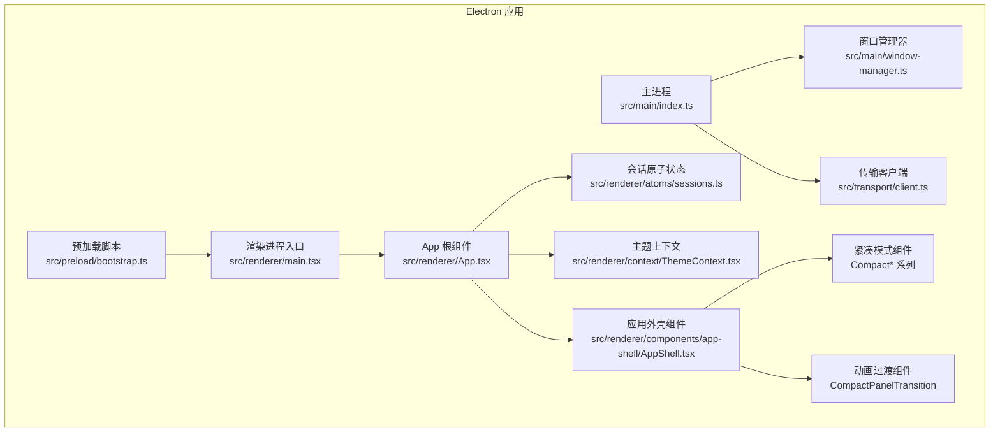
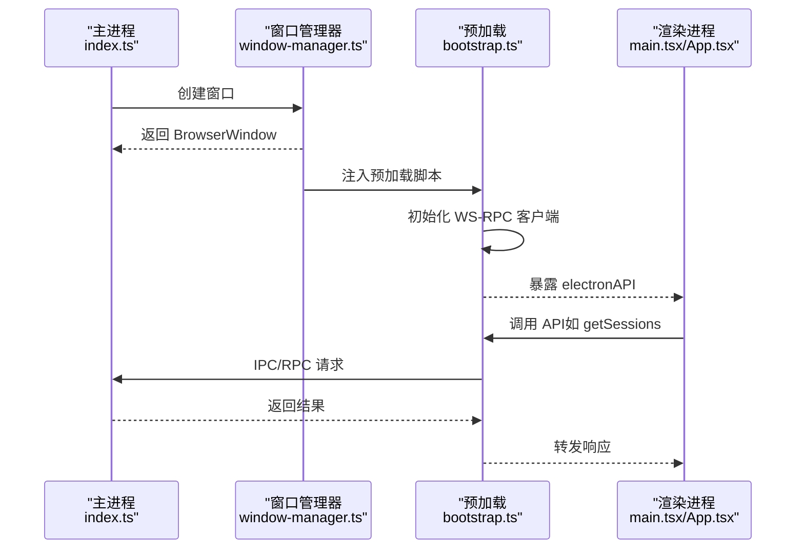
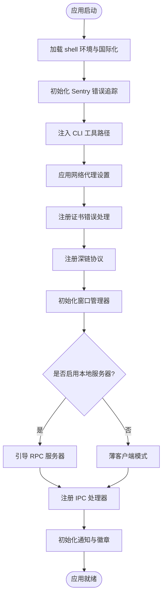
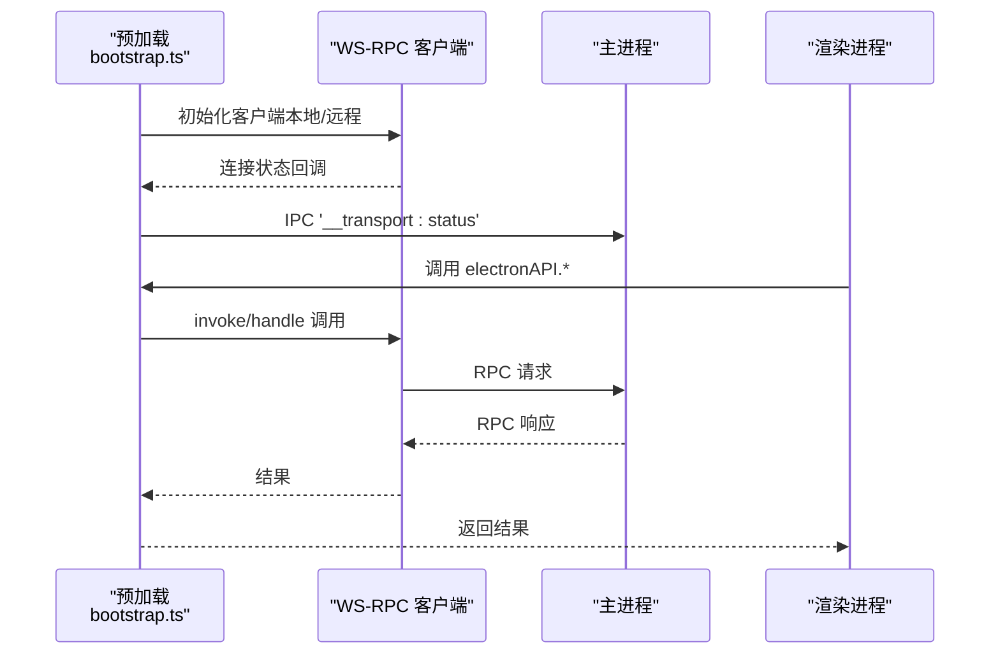
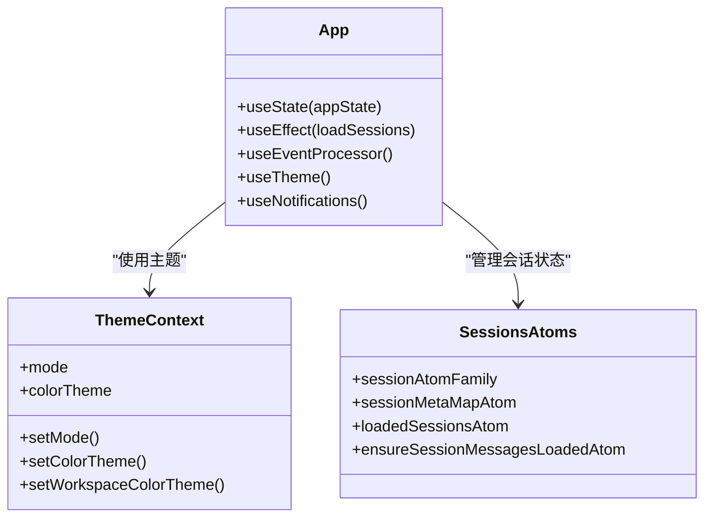
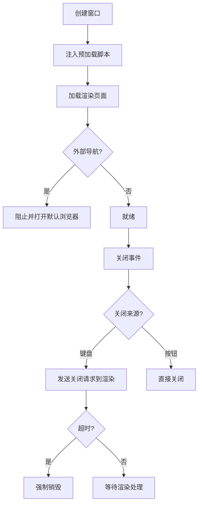
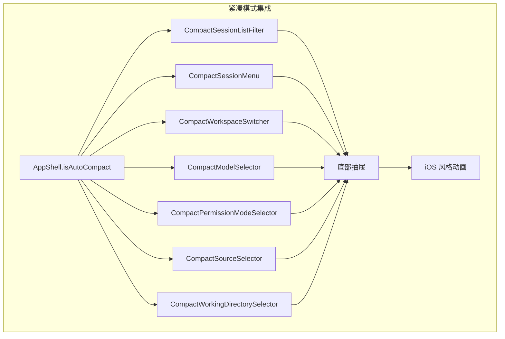
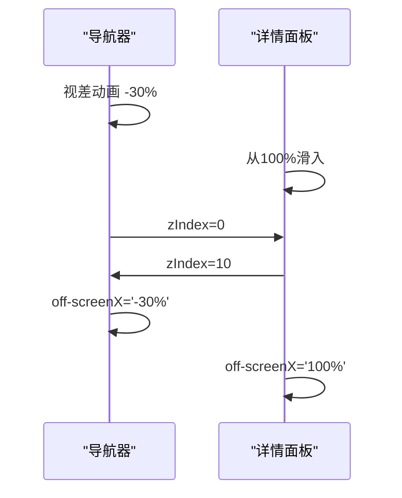
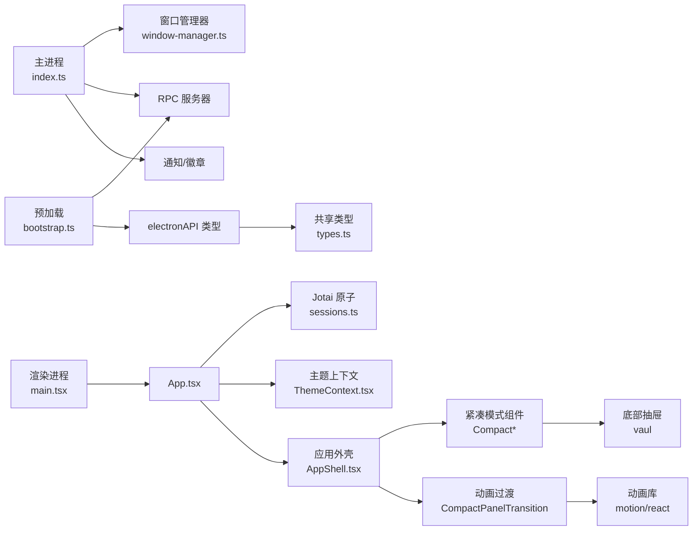

# 桌面应用开发

<cite>
**本文档引用的文件**
- [apps/electron/package.json](file://apps/electron/package.json)
- [apps/electron/src/main/index.ts](file://apps/electron/src/main/index.ts)
- [apps/electron/src/preload/bootstrap.ts](file://apps/electron/src/preload/bootstrap.ts)
- [apps/electron/src/renderer/main.tsx](file://apps/electron/src/renderer/main.tsx)
- [apps/electron/vite.config.ts](file://apps/electron/vite.config.ts)
- [apps/electron/src/renderer/App.tsx](file://apps/electron/src/renderer/App.tsx)
- [apps/electron/src/renderer/components/app-shell/AppShell.tsx](file://apps/electron/src/renderer/components/app-shell/AppShell.tsx)
- [apps/electron/src/renderer/atoms/sessions.ts](file://apps/electron/src/renderer/atoms/sessions.ts)
- [apps/electron/src/main/window-manager.ts](file://apps/electron/src/main/window-manager.ts)
- [apps/electron/src/shared/types.ts](file://apps/electron/src/shared/types.ts)
- [apps/electron/src/renderer/context/ThemeContext.tsx](file://apps/electron/src/renderer/context/ThemeContext.tsx)
- [apps/electron/src/transport/client.ts](file://apps/electron/src/transport/client.ts)
- [apps/electron/components.json](file://apps/electron/components.json)
- [apps/electron/tsconfig.json](file://apps/electron/tsconfig.json)
- [apps/electron/src/renderer/components/app-shell/CompactPanelTransition.tsx](file://apps/electron/src/renderer/components/app-shell/CompactPanelTransition.tsx)
- [apps/electron/src/renderer/components/app-shell/CompactSessionListFilter.tsx](file://apps/electron/src/renderer/components/app-shell/CompactSessionListFilter.tsx)
- [apps/electron/src/renderer/components/app-shell/CompactSessionMenu.tsx](file://apps/electron/src/renderer/components/app-shell/CompactSessionMenu.tsx)
- [apps/electron/src/renderer/components/app-shell/CompactWorkspaceSwitcher.tsx](file://apps/electron/src/renderer/components/app-shell/CompactWorkspaceSwitcher.tsx)
- [apps/electron/src/renderer/components/app-shell/input/CompactModelSelector.tsx](file://apps/electron/src/renderer/components/app-shell/input/CompactModelSelector.tsx)
- [apps/electron/src/renderer/components/app-shell/input/CompactPermissionModeSelector.tsx](file://apps/electron/src/renderer/components/app-shell/input/CompactPermissionModeSelector.tsx)
- [apps/electron/src/renderer/components/ui/CompactSourceSelector.tsx](file://apps/electron/src/renderer/components/ui/CompactSourceSelector.tsx)
- [apps/electron/src/renderer/components/ui/CompactWorkingDirectorySelector.tsx](file://apps/electron/src/renderer/components/ui/CompactWorkingDirectorySelector.tsx)
- [apps/electron/src/renderer/components/app-shell/ChatDisplay.tsx](file://apps/electron/src/renderer/components/app-shell/ChatDisplay.tsx)
</cite>

## 更新摘要
**所做更改**
- 新增紧凑模式组件章节，详细介绍新增的紧凑模式组件及其用户体验改进
- 更新应用外壳组件章节，增加紧凑模式下的组件使用说明
- 新增动画过渡组件章节，介绍 iOS 风格的面板切换动画
- 更新用户体验优化部分，强调紧凑模式带来的交互改进

## 目录
1. [简介](#简介)
2. [项目结构](#项目结构)
3. [核心组件](#核心组件)
4. [架构总览](#架构总览)
5. [详细组件分析](#详细组件分析)
6. [紧凑模式组件](#紧凑模式组件)
7. [动画过渡系统](#动画过渡系统)
8. [依赖关系分析](#依赖关系分析)
9. [性能考虑](#性能考虑)
10. [故障排除指南](#故障排除指南)
11. [结论](#结论)
12. [附录](#附录)

## 简介
本文件为 Craft Agents 桌面应用的开发文档，面向希望扩展或修改该应用的开发者。内容涵盖 Electron 主进程架构、渲染进程开发、预加载脚本的安全上下文；React 组件架构、状态管理（Jotai）、UI 组件库（shadcn/ui + Tailwind CSS）的使用；以及窗口管理、IPC 通信、平台集成的具体实现细节。文档同时提供组件开发指南、事件处理模式、性能优化技巧，并以可视化图表帮助理解系统交互。

**更新** 新增紧凑模式组件和动画过渡系统的详细说明，反映最新的用户体验改进。

## 项目结构
应用采用多包工作区结构，核心位于 apps/electron，包含主进程、预加载、渲染进程、传输层与共享类型等模块。构建工具链使用 Vite（渲染进程）与 esbuild（主进程/预加载），并通过自定义脚本完成资源打包与分发。

**图表来源**
- [apps/electron/src/main/index.ts:1-120](file://apps/electron/src/main/index.ts#L1-L120)
- [apps/electron/src/preload/bootstrap.ts:1-60](file://apps/electron/src/preload/bootstrap.ts#L1-L60)
- [apps/electron/src/renderer/main.tsx:1-40](file://apps/electron/src/renderer/main.tsx#L1-L40)
- [apps/electron/src/renderer/App.tsx:1-60](file://apps/electron/src/renderer/App.tsx#L1-L60)
- [apps/electron/src/main/window-manager.ts:1-60](file://apps/electron/src/main/window-manager.ts#L1-L60)
- [apps/electron/src/transport/client.ts:1-18](file://apps/electron/src/transport/client.ts#L1-L18)
- [apps/electron/src/renderer/context/ThemeContext.tsx:1-60](file://apps/electron/src/renderer/context/ThemeContext.tsx#L1-L60)
- [apps/electron/src/renderer/atoms/sessions.ts:1-40](file://apps/electron/src/renderer/atoms/sessions.ts#L1-L40)
- [apps/electron/src/renderer/components/app-shell/AppShell.tsx:1-60](file://apps/electron/src/renderer/components/app-shell/AppShell.tsx#L1-L60)

**章节来源**
- [apps/electron/package.json:1-83](file://apps/electron/package.json#L1-L83)
- [apps/electron/vite.config.ts:1-75](file://apps/electron/vite.config.ts#L1-L75)
- [apps/electron/tsconfig.json:1-33](file://apps/electron/tsconfig.json#L1-L33)

## 核心组件
- 主进程：负责应用生命周期、窗口管理、RPC 服务器启动、系统级能力（对话框、证书校验、自动更新、通知）与深链处理。
- 预加载脚本：在安全隔离上下文中暴露有限的 Electron 能力给渲染进程，建立 WS-RPC 客户端并桥接传输状态日志。
- 渲染进程：基于 React + Jotai 的单页应用，负责 UI 呈现、主题系统、会话状态管理与事件处理。
- 窗口管理器：统一创建/聚焦/关闭窗口，维护窗口与工作区映射，处理关闭拦截与回退超时。
- 传输层：抽象 WS-RPC 客户端，支持本地/远程双栈路由与重连策略。
- 共享类型：集中定义 RPC 通道、事件、数据模型与 ElectronAPI 接口，确保主/预/渲染三侧契约一致。

**章节来源**
- [apps/electron/src/main/index.ts:361-750](file://apps/electron/src/main/index.ts#L361-L750)
- [apps/electron/src/preload/bootstrap.ts:1-120](file://apps/electron/src/preload/bootstrap.ts#L1-L120)
- [apps/electron/src/renderer/main.tsx:1-80](file://apps/electron/src/renderer/main.tsx#L1-L80)
- [apps/electron/src/main/window-manager.ts:53-120](file://apps/electron/src/main/window-manager.ts#L53-L120)
- [apps/electron/src/transport/client.ts:1-18](file://apps/electron/src/transport/client.ts#L1-L18)
- [apps/electron/src/shared/types.ts:172-676](file://apps/electron/src/shared/types.ts#L172-L676)

## 架构总览
应用采用"主进程 + 预加载 + 渲染进程"的经典 Electron 架构。主进程通过 RPC 服务器承载业务逻辑，预加载脚本负责建立 WS-RPC 客户端并注入安全的 API，渲染进程通过 Jotai 管理状态并与主进程通过 IPC/RPC 交互。

**图表来源**
- [apps/electron/src/main/index.ts:435-520](file://apps/electron/src/main/index.ts#L435-L520)
- [apps/electron/src/main/window-manager.ts:104-172](file://apps/electron/src/main/window-manager.ts#L104-L172)
- [apps/electron/src/preload/bootstrap.ts:55-154](file://apps/electron/src/preload/bootstrap.ts#L55-L154)
- [apps/electron/src/renderer/main.tsx:100-119](file://apps/electron/src/renderer/main.tsx#L100-L119)

## 详细组件分析

### 主进程架构
- 应用初始化：加载 shell 环境、国际化、Sentry 错误追踪、日志初始化、CLI 工具路径注入、Pi 模型解析器注册、深链协议注册、网络代理设置、证书绕过策略等。
- 服务器引导：根据配置决定是否启用本地 RPC 服务器，注入平台服务、会话管理器、消息网关、模型刷新服务与运行时钩子。
- IPC 处理：提供窗口本地查询、传输状态日志桥接、对话框调用等能力；在非客户端模式下提供工作区移除、跨服务器调用、会话迁移等操作。
- 通知与徽章：初始化通知服务、Dock 图标与徽章绘制回调。
- 窗口与深链：注册应用菜单、窗口创建与恢复、深链处理（macOS open-url 与 Windows/Linux 第二实例）。

**图表来源**
- [apps/electron/src/main/index.ts:1-120](file://apps/electron/src/main/index.ts#L1-L120)
- [apps/electron/src/main/index.ts:361-450](file://apps/electron/src/main/index.ts#L361-L450)
- [apps/electron/src/main/index.ts:531-750](file://apps/electron/src/main/index.ts#L531-L750)

**章节来源**
- [apps/electron/src/main/index.ts:1-200](file://apps/electron/src/main/index.ts#L1-L200)
- [apps/electron/src/main/index.ts:221-306](file://apps/electron/src/main/index.ts#L221-L306)
- [apps/electron/src/main/index.ts:435-520](file://apps/electron/src/main/index.ts#L435-L520)
- [apps/electron/src/main/index.ts:531-750](file://apps/electron/src/main/index.ts#L531-L750)

### 预加载脚本与安全上下文
- 安全设计：通过 contextBridge.exposeInMainWorld 暴露受控 API，禁用 nodeIntegration，启用 contextIsolation。
- 连接建立：根据环境变量判断薄客户端或本地模式，创建 WsRpcClient 或 RoutedClient；支持本地/远程工作区切换。
- 能力处理：注册客户端能力（打开外部链接、打开路径、显示文件夹、确认对话框、文件对话框）供服务器端调用。
- 传输状态：监听连接状态变化并通过 IPC 发送到主进程日志，便于终端与日志文件排查。
- OAuth 流程：封装 performOAuth、startClaudeOAuth、startChatGptOAuth 等多步骤流程，确保回调服务器在本地接收重定向。

**图表来源**
- [apps/electron/src/preload/bootstrap.ts:55-154](file://apps/electron/src/preload/bootstrap.ts#L55-L154)
- [apps/electron/src/preload/bootstrap.ts:183-256](file://apps/electron/src/preload/bootstrap.ts#L183-L256)
- [apps/electron/src/preload/bootstrap.ts:258-402](file://apps/electron/src/preload/bootstrap.ts#L258-L402)

**章节来源**
- [apps/electron/src/preload/bootstrap.ts:1-60](file://apps/electron/src/preload/bootstrap.ts#L1-L60)
- [apps/electron/src/preload/bootstrap.ts:183-256](file://apps/electron/src/preload/bootstrap.ts#L183-L256)
- [apps/electron/src/preload/bootstrap.ts:258-402](file://apps/electron/src/preload/bootstrap.ts#L258-L402)

### 渲染进程与 React 架构
- 启动流程：初始化 Sentry（双层集成）、i18n、主题提供者、Jotai Provider，挂载根组件。
- 应用状态：App.tsx 负责应用状态机（加载/引导/就绪）、会话列表加载、LLM 连接状态、通知与主题同步、深链导航等。
- 事件处理：集中式事件处理器 useEventProcessor，将 Agent 事件转换为状态变更，避免流式渲染中的状态撕裂。
- 性能优化：使用 Jotai 家族原子按会话隔离状态，避免数组持有导致内存泄漏；懒加载会话消息；Promise 去重加载。

**图表来源**
- [apps/electron/src/renderer/App.tsx:196-320](file://apps/electron/src/renderer/App.tsx#L196-L320)
- [apps/electron/src/renderer/context/ThemeContext.tsx:115-180](file://apps/electron/src/renderer/context/ThemeContext.tsx#L115-L180)
- [apps/electron/src/renderer/atoms/sessions.ts:122-295](file://apps/electron/src/renderer/atoms/sessions.ts#L122-L295)

**章节来源**
- [apps/electron/src/renderer/main.tsx:1-119](file://apps/electron/src/renderer/main.tsx#L1-L119)
- [apps/electron/src/renderer/App.tsx:196-320](file://apps/electron/src/renderer/App.tsx#L196-L320)
- [apps/electron/src/renderer/atoms/sessions.ts:1-120](file://apps/electron/src/renderer/atoms/sessions.ts#L1-L120)

### 窗口管理与 IPC 通信
- 窗口创建：根据平台选择透明效果、图标、尺寸；注入预加载脚本；支持聚焦模式（无侧边栏小窗）。
- 导航拦截：阻止外部导航，仅允许内部 URL；开发模式支持 Vite dev server。
- 关闭拦截：区分键盘快捷键与窗口按钮关闭，发送关闭请求到渲染进程；若 IPC 失败，3 秒后强制销毁。
- 事件广播：系统主题变化、窗口焦点变化、RPC 事件推送至对应窗口。

**图表来源**
- [apps/electron/src/main/window-manager.ts:104-172](file://apps/electron/src/main/window-manager.ts#L104-L172)
- [apps/electron/src/main/window-manager.ts:185-218](file://apps/electron/src/main/window-manager.ts#L185-L218)
- [apps/electron/src/main/window-manager.ts:343-381](file://apps/electron/src/main/window-manager.ts#L343-L381)

**章节来源**
- [apps/electron/src/main/window-manager.ts:104-172](file://apps/electron/src/main/window-manager.ts#L104-L172)
- [apps/electron/src/main/window-manager.ts:343-381](file://apps/electron/src/main/window-manager.ts#L343-L381)

### 传输层与 RPC 通道
- 客户端抽象：导出 WsRpcClient 及其连接状态类型，供预加载与渲染进程使用。
- 通道契约：通过共享协议定义 RPC 通道、事件与数据结构，确保主/预/渲染一致性。
- 路由策略：在本地/远程工作区之间动态切换客户端，保持对上层透明。

**章节来源**
- [apps/electron/src/transport/client.ts:1-18](file://apps/electron/src/transport/client.ts#L1-L18)
- [apps/electron/src/shared/types.ts:172-676](file://apps/electron/src/shared/types.ts#L172-L676)

### UI 组件库与主题系统
- 组件库：使用 shadcn/ui，Tailwind CSS 提供样式基础，组件别名配置于 components.json。
- 主题上下文：集中管理应用/工作区主题、字体、深浅模式与场景主题（背景图玻璃面板），支持跨窗口同步与预览。
- 语法高亮：基于 Shiki 的主题配置，适配深浅模式与主题限制。

**章节来源**
- [apps/electron/components.json:1-20](file://apps/electron/components.json#L1-L20)
- [apps/electron/src/renderer/context/ThemeContext.tsx:115-180](file://apps/electron/src/renderer/context/ThemeContext.tsx#L115-L180)
- [apps/electron/src/renderer/context/ThemeContext.tsx:248-282](file://apps/electron/src/renderer/context/ThemeContext.tsx#L248-L282)

## 紧凑模式组件

### 紧凑模式概述
Craft Agents 引入了完整的紧凑模式（Compact Mode）组件体系，专为移动设备、小屏幕和嵌入式场景优化用户体验。紧凑模式通过底部抽屉（Drawer）替代传统的桌面下拉菜单和弹出层，提供更好的触摸交互体验。

### 紧凑模式组件体系

#### 1. 会话筛选器
`CompactSessionListFilter` 是紧凑模式的核心组件，替代桌面版的会话列表筛选下拉菜单：

- **行为镜像**：完全复制桌面版筛选器的功能，包括状态筛选、标签筛选、搜索功能
- **交互优化**：使用底部抽屉，避免窄屏视口下的锚定问题
- **扁平化设计**：将层级子菜单折叠为单一平面列表
- **搜索整合**：状态和标签搜索结果合并显示

#### 2. 会话菜单
`CompactSessionMenu` 提供紧凑模式下的会话操作菜单：

- **iOS 风格**：采用 iOS 风格的钻取式导航
- **视图栈**：通过内部视图栈替代嵌套 Radix 弹出层
- **触控友好**：每个选项都有 44px+ 的点击目标
- **状态管理**：支持状态切换、标签管理、分享等功能

#### 3. 工作区切换器
`CompactWorkspaceSwitcher` 为紧凑模式提供工作区选择功能：

- **健康检查**：远程工作区断线检测
- **重新连接**：断线工作区的重新连接流程
- **新建工作区**：内联工作区创建界面
- **未读标记**：其他工作区的未读状态指示

#### 4. 输入组件
紧凑模式下的输入组件提供了专门的紧凑版本：

- **模型选择器**：`CompactModelSelector` 支持连接切换和视觉能力
- **权限模式选择器**：`CompactPermissionModeSelector` 提供权限模式切换
- **源选择器**：`CompactSourceSelector` 支持多选源
- **工作目录选择器**：`CompactWorkingDirectorySelector` 提供工作目录选择

### 紧凑模式集成

紧凑模式组件通过 `AppShell` 组件智能集成：

**图表来源**
- [apps/electron/src/renderer/components/app-shell/AppShell.tsx:2530-2546](file://apps/electron/src/renderer/components/app-shell/AppShell.tsx#L2530-L2546)
- [apps/electron/src/renderer/components/app-shell/AppShell.tsx:3250-3262](file://apps/electron/src/renderer/components/app-shell/AppShell.tsx#L3250-L3262)

**章节来源**
- [apps/electron/src/renderer/components/app-shell/CompactSessionListFilter.tsx:1-497](file://apps/electron/src/renderer/components/app-shell/CompactSessionListFilter.tsx#L1-L497)
- [apps/electron/src/renderer/components/app-shell/CompactSessionMenu.tsx:1-677](file://apps/electron/src/renderer/components/app-shell/CompactSessionMenu.tsx#L1-L677)
- [apps/electron/src/renderer/components/app-shell/CompactWorkspaceSwitcher.tsx:1-303](file://apps/electron/src/renderer/components/app-shell/CompactWorkspaceSwitcher.tsx#L1-L303)
- [apps/electron/src/renderer/components/app-shell/input/CompactModelSelector.tsx:1-522](file://apps/electron/src/renderer/components/app-shell/input/CompactModelSelector.tsx#L1-L522)
- [apps/electron/src/renderer/components/app-shell/input/CompactPermissionModeSelector.tsx:1-143](file://apps/electron/src/renderer/components/app-shell/input/CompactPermissionModeSelector.tsx#L1-L143)
- [apps/electron/src/renderer/components/ui/CompactSourceSelector.tsx:1-123](file://apps/electron/src/renderer/components/ui/CompactSourceSelector.tsx#L1-L123)
- [apps/electron/src/renderer/components/ui/CompactWorkingDirectorySelector.tsx:1-243](file://apps/electron/src/renderer/components/ui/CompactWorkingDirectorySelector.tsx#L1-L243)

## 动画过渡系统

### CompactPanelTransition 组件
`CompactPanelTransition` 是紧凑模式动画系统的核心组件，提供 iOS 风格的面板切换动画：

#### 动画特性
- **GPU 加速**：使用 transform 和 opacity 属性，确保流畅的硬件加速
- **对称切换**：导航器向左平行视差 -30%，详情面板从 100% 滑入
- **还原运动**：支持 prefers-reduced-motion 的 120ms 补间回退
- **层级管理**：详情面板在切换过程中位于导航器之上

#### 技术实现
- **弹簧动画**：使用 stiffness: 400, damping: 36, mass: 0.8 的 snappy spring
- **无障碍支持**：off-screen 元素设置 aria-hidden，避免焦点陷阱
- **指针事件**：离屏元素禁用指针事件，防止触摸干扰

**图表来源**
- [apps/electron/src/renderer/components/app-shell/CompactPanelTransition.tsx:12-18](file://apps/electron/src/renderer/components/app-shell/CompactPanelTransition.tsx#L12-L18)
- [apps/electron/src/renderer/components/app-shell/CompactPanelTransition.tsx:47-74](file://apps/electron/src/renderer/components/app-shell/CompactPanelTransition.tsx#L47-L74)

**章节来源**
- [apps/electron/src/renderer/components/app-shell/CompactPanelTransition.tsx:1-76](file://apps/electron/src/renderer/components/app-shell/CompactPanelTransition.tsx#L1-L76)

## 依赖关系分析

**图表来源**
- [apps/electron/src/main/index.ts:435-520](file://apps/electron/src/main/index.ts#L435-L520)
- [apps/electron/src/main/window-manager.ts:53-120](file://apps/electron/src/main/window-manager.ts#L53-L120)
- [apps/electron/src/preload/bootstrap.ts:183-256](file://apps/electron/src/preload/bootstrap.ts#L183-L256)
- [apps/electron/src/renderer/main.tsx:100-119](file://apps/electron/src/renderer/main.tsx#L100-L119)
- [apps/electron/src/renderer/App.tsx:196-320](file://apps/electron/src/renderer/App.tsx#L196-L320)
- [apps/electron/src/renderer/atoms/sessions.ts:122-295](file://apps/electron/src/renderer/atoms/sessions.ts#L122-L295)
- [apps/electron/src/renderer/context/ThemeContext.tsx:115-180](file://apps/electron/src/renderer/context/ThemeContext.tsx#L115-L180)
- [apps/electron/src/renderer/components/app-shell/AppShell.tsx:480-520](file://apps/electron/src/renderer/components/app-shell/AppShell.tsx#L480-L520)
- [apps/electron/src/shared/types.ts:172-676](file://apps/electron/src/shared/types.ts#L172-L676)

**章节来源**
- [apps/electron/src/shared/types.ts:172-676](file://apps/electron/src/shared/types.ts#L172-L676)

## 性能考虑
- 状态隔离：使用 Jotai 家族原子按会话隔离，避免数组持有导致内存泄漏；仅在必要时合并消息，保留流式渲染期间的中间态。
- 懒加载：会话消息初始为空，按需加载；Promise 去重防止并发重复请求。
- 渲染优化：使用 React.StrictMode 与 Jotai HMR 插件；避免不必要的重渲染，利用原子引用稳定性。
- 构建优化：Vite 与 esbuild 并行构建，生产环境禁用源码上传，减少 Sentry 负担。
- 窗口体验：延迟显示窗口，提升感知速度；聚焦模式减小窗口尺寸。
- **紧凑模式优化**：抽屉组件使用 will-change: transform 提示合成器，off-screen 元素禁用指针事件避免性能开销。

[本节为通用指导，不直接分析具体文件]

## 故障排除指南
- 传输连接失败：检查预加载脚本的传输状态日志桥接，查看主进程日志；确认 ws/wss 协议与 TLS 设置。
- 窗口无法关闭：确认关闭来源识别（键盘/按钮），检查渲染进程是否正确处理关闭请求；若 IPC 失败，等待 3 秒回退销毁。
- OAuth 流程异常：确认回调服务器端口与路径、服务器端 flow 存储、浏览器打开授权页与回调处理。
- 主题不生效：检查主题预设加载、跨窗口同步与系统偏好监听；确认 CSS 变量注入顺序。
- **紧凑模式问题**：检查 Drawer 组件的 open 状态管理，确认动画库依赖正常加载，验证移动端触摸事件处理。

**章节来源**
- [apps/electron/src/preload/bootstrap.ts:206-244](file://apps/electron/src/preload/bootstrap.ts#L206-L244)
- [apps/electron/src/main/window-manager.ts:343-381](file://apps/electron/src/main/window-manager.ts#L343-L381)
- [apps/electron/src/renderer/context/ThemeContext.tsx:382-434](file://apps/electron/src/renderer/context/ThemeContext.tsx#L382-L434)

## 结论
Craft Agents 桌面应用通过清晰的职责分离与强契约约束，实现了稳定、可扩展的 Electron 应用架构。主进程负责系统与业务边界，预加载脚本提供安全的桥接，渲染进程以 React + Jotai 实现高性能 UI。配合完善的窗口管理、IPC/RPC 通信与主题系统，开发者可以在此基础上快速迭代功能与界面。

**更新** 新增的紧凑模式组件和动画过渡系统显著提升了移动设备和小屏幕的用户体验，通过底部抽屉和 iOS 风格动画提供了更加直观和流畅的交互体验。

[本节为总结性内容，不直接分析具体文件]

## 附录
- 开发命令与脚本：参考应用包配置 scripts 字段，包含构建主进程、预加载、渲染进程、复制资源与验证等任务。
- 构建配置：Vite 配置启用 React 与 Tailwind，Jotai HMR 插件；tsconfig 使用 bundler 解析与严格模式。
- 组件别名：shadcn/ui 别名映射至 @/components 与 @/lib/utils，便于统一导入。
- **紧凑模式组件**：Compact* 系列组件提供完整的移动端体验，包括会话筛选、菜单操作、工作区切换等核心功能。

**章节来源**
- [apps/electron/package.json:17-36](file://apps/electron/package.json#L17-L36)
- [apps/electron/vite.config.ts:11-35](file://apps/electron/vite.config.ts#L11-L35)
- [apps/electron/tsconfig.json:23-28](file://apps/electron/tsconfig.json#L23-L28)
- [apps/electron/components.json:12-18](file://apps/electron/components.json#L12-L18)