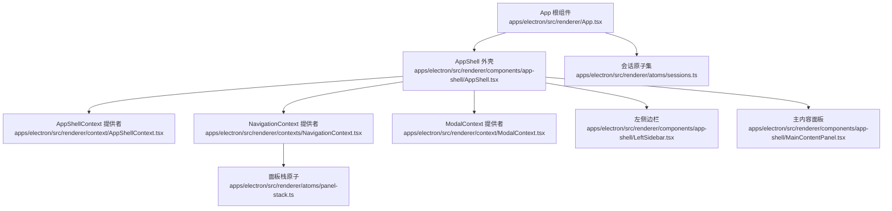
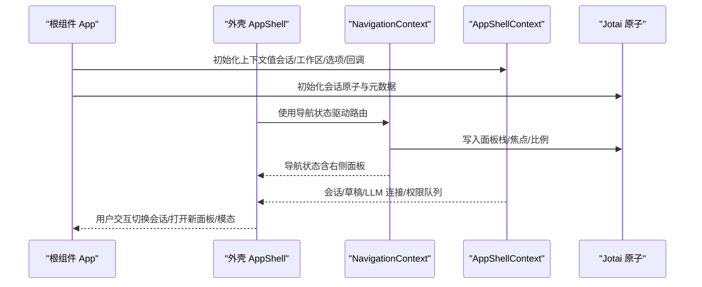
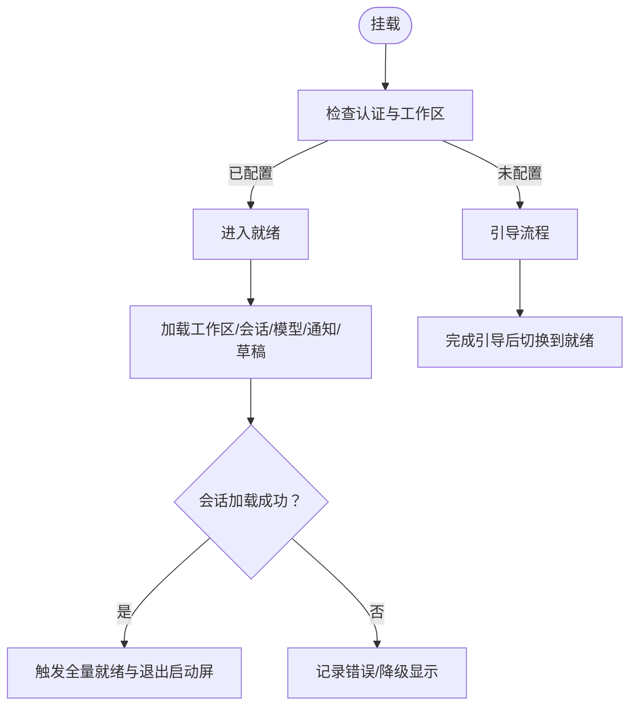
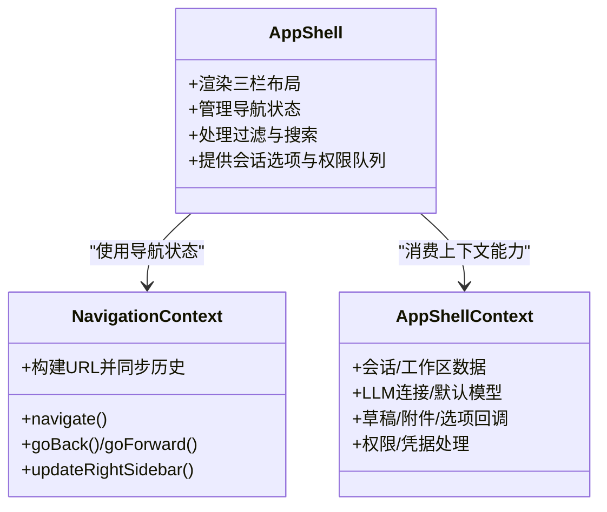
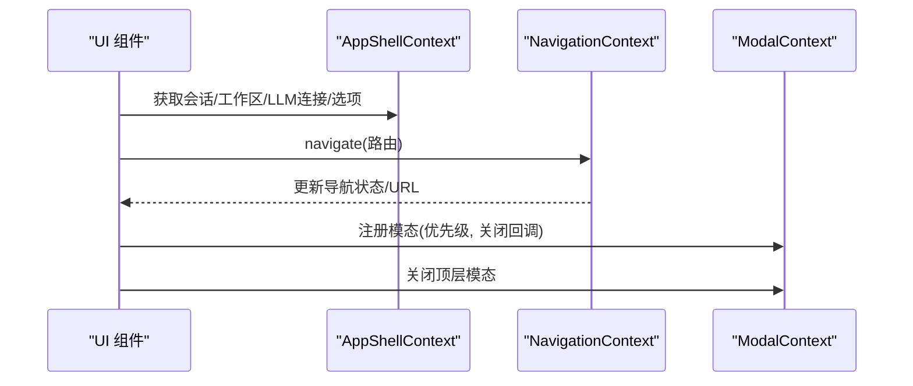
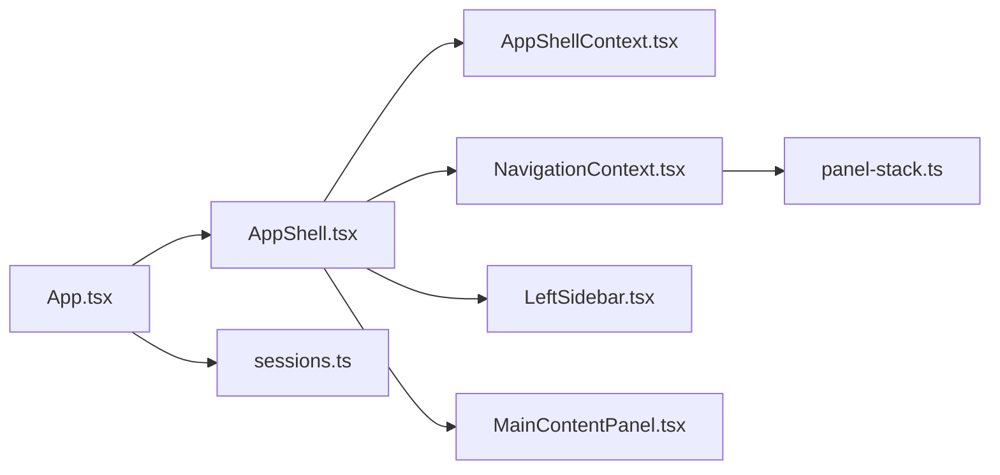

# React 组件架构

<cite>
**本文引用的文件**
- [apps/electron/src/renderer/App.tsx](file://apps/electron/src/renderer/App.tsx)
- [apps/electron/src/renderer/components/app-shell/AppShell.tsx](file://apps/electron/src/renderer/components/app-shell/AppShell.tsx)
- [apps/electron/src/renderer/context/AppShellContext.tsx](file://apps/electron/src/renderer/context/AppShellContext.tsx)
- [apps/electron/src/renderer/contexts/NavigationContext.tsx](file://apps/electron/src/renderer/contexts/NavigationContext.tsx)
- [apps/electron/src/renderer/context/ModalContext.tsx](file://apps/electron/src/renderer/context/ModalContext.tsx)
- [apps/electron/src/renderer/components/app-shell/LeftSidebar.tsx](file://apps/electron/src/renderer/components/app-shell/LeftSidebar.tsx)
- [apps/electron/src/renderer/components/app-shell/MainContentPanel.tsx](file://apps/electron/src/renderer/components/app-shell/MainContentPanel.tsx)
- [apps/electron/src/renderer/hooks/useSession.ts](file://apps/electron/src/renderer/hooks/useSession.ts)
- [apps/electron/src/renderer/atoms/sessions.ts](file://apps/electron/src/renderer/atoms/sessions.ts)
- [apps/electron/src/renderer/atoms/panel-stack.ts](file://apps/electron/src/renderer/atoms/panel-stack.ts)
- [apps/electron/src/renderer/lib/perf.ts](file://apps/electron/src/renderer/lib/perf.ts)
- [apps/electron/src/renderer/hooks/useMultiSelect.ts](file://apps/electron/src/renderer/hooks/useMultiSelect.ts)
- [apps/electron/src/renderer/components/app-shell/TransportConnectionBanner.tsx](file://apps/electron/src/renderer/components/app-shell/TransportConnectionBanner.tsx)
</cite>

## 目录
1. [简介](#简介)
2. [项目结构](#项目结构)
3. [核心组件](#核心组件)
4. [架构总览](#架构总览)
5. [组件详细分析](#组件详细分析)
6. [依赖关系分析](#依赖关系分析)
7. [性能考量](#性能考量)
8. [故障排查指南](#故障排查指南)
9. [结论](#结论)
10. [附录](#附录)

## 简介
本文件系统性梳理了基于 React 的应用组件架构，重点围绕 Electron 渲染进程中的根组件 App.tsx、应用外壳 AppShell 及其上下文体系（AppShellContext、NavigationContext、ModalContext 等），阐述组件层次结构、组件树组织、父子关系与数据流；解释状态提升策略、上下文共享机制、组件拆分原则、性能优化与懒加载模式，并给出错误处理与内存泄漏防护的最佳实践。

## 项目结构
该渲染器采用“原子化状态 + 上下文 + 面板栈”的组合架构：
- 根组件负责应用生命周期、全局状态初始化与事件处理中枢
- 应用外壳 AppShell 负责布局与导航状态的统一入口
- 上下文层提供跨组件状态共享：会话、工作区、导航、模态等
- 原子层（Jotai）提供细粒度、隔离化的状态更新，避免全量重渲染
- 面板栈管理多面板并行展示与 URL 同步

图表来源
- [apps/electron/src/renderer/App.tsx:1-2205](file://apps/electron/src/renderer/App.tsx#L1-L2205)
- [apps/electron/src/renderer/components/app-shell/AppShell.tsx:1-3566](file://apps/electron/src/renderer/components/app-shell/AppShell.tsx#L1-L3566)
- [apps/electron/src/renderer/context/AppShellContext.tsx:1-282](file://apps/electron/src/renderer/context/AppShellContext.tsx#L1-L282)
- [apps/electron/src/renderer/contexts/NavigationContext.tsx:1-1283](file://apps/electron/src/renderer/contexts/NavigationContext.tsx#L1-L1283)
- [apps/electron/src/renderer/context/ModalContext.tsx:1-112](file://apps/electron/src/renderer/context/ModalContext.tsx#L1-L112)
- [apps/electron/src/renderer/components/app-shell/LeftSidebar.tsx:1-200](file://apps/electron/src/renderer/components/app-shell/LeftSidebar.tsx#L1-L200)
- [apps/electron/src/renderer/components/app-shell/MainContentPanel.tsx:1-405](file://apps/electron/src/renderer/components/app-shell/MainContentPanel.tsx#L1-L405)
- [apps/electron/src/renderer/atoms/panel-stack.ts:1-306](file://apps/electron/src/renderer/atoms/panel-stack.ts#L1-L306)
- [apps/electron/src/renderer/atoms/sessions.ts:1-715](file://apps/electron/src/renderer/atoms/sessions.ts#L1-L715)

章节来源
- [apps/electron/src/renderer/App.tsx:1-2205](file://apps/electron/src/renderer/App.tsx#L1-L2205)
- [apps/electron/src/renderer/components/app-shell/AppShell.tsx:1-3566](file://apps/electron/src/renderer/components/app-shell/AppShell.tsx#L1-L3566)

## 核心组件
- App 根组件：负责应用状态机（加载/引导/认证/工作区选择/就绪）、全局事件处理器、会话列表与单个会话的状态同步、主题与通知、启动性能埋点等。
- AppShell 外壳：承载三栏布局（侧边栏/导航器/主内容），统一导航状态、过滤器、搜索与键盘交互。
- 上下文层：
  - AppShellContext：向面板提供会话、工作区、权限/凭据队列、草稿、LLM 连接、选项回调等。
  - NavigationContext：统一导航路由、浏览器历史、右侧面板、自动选择、URL 同步与恢复。
  - ModalContext：模态注册与关闭优先级管理。
- 原子层（Jotai）：
  - 会话原子：按会话隔离存储，避免消息数组导致的闭包持有与内存泄漏。
  - 面板栈原子：管理多面板、焦点、比例与 URL 同步。

章节来源
- [apps/electron/src/renderer/App.tsx:224-740](file://apps/electron/src/renderer/App.tsx#L224-L740)
- [apps/electron/src/renderer/context/AppShellContext.tsx:176-282](file://apps/electron/src/renderer/context/AppShellContext.tsx#L176-L282)
- [apps/electron/src/renderer/contexts/NavigationContext.tsx:150-320](file://apps/electron/src/renderer/contexts/NavigationContext.tsx#L150-L320)
- [apps/electron/src/renderer/context/ModalContext.tsx:32-83](file://apps/electron/src/renderer/context/ModalContext.tsx#L32-L83)
- [apps/electron/src/renderer/atoms/sessions.ts:122-200](file://apps/electron/src/renderer/atoms/sessions.ts#L122-L200)
- [apps/electron/src/renderer/atoms/panel-stack.ts:46-122](file://apps/electron/src/renderer/atoms/panel-stack.ts#L46-L122)

## 架构总览
整体采用“根组件 + 外壳 + 上下文 + 原子”的分层设计：
- 根组件集中处理应用生命周期与全局副作用，通过上下文向下传递能力
- 外壳负责布局与导航，将导航状态与会话状态解耦
- 上下文提供细粒度能力（导航、模态、会话选项等）
- 原子层确保状态更新最小化、可预测且可序列化

图表来源
- [apps/electron/src/renderer/App.tsx:224-740](file://apps/electron/src/renderer/App.tsx#L224-L740)
- [apps/electron/src/renderer/components/app-shell/AppShell.tsx:483-520](file://apps/electron/src/renderer/components/app-shell/AppShell.tsx#L483-L520)
- [apps/electron/src/renderer/contexts/NavigationContext.tsx:150-320](file://apps/electron/src/renderer/contexts/NavigationContext.tsx#L150-L320)
- [apps/electron/src/renderer/context/AppShellContext.tsx:176-282](file://apps/electron/src/renderer/context/AppShellContext.tsx#L176-L282)
- [apps/electron/src/renderer/atoms/panel-stack.ts:123-166](file://apps/electron/src/renderer/atoms/panel-stack.ts#L123-L166)

## 组件详细分析

### App.tsx：根组件设计与生命周期
- 应用状态机：loading → 检查认证 → 引导/重新认证/工作区选择 → 就绪
- 全局事件与副作用：
  - 启动性能埋点初始化
  - 主题变更监听与应用级主题注入
  - LLM 连接变更监听与默认连接推导
  - 会话加载、刷新与元数据同步
  - 通知系统与系统警告提示
- 事件处理中枢：统一通过事件处理器处理来自后端的 Agent 事件，区分“流式中”与“非流式”两种写回路径，保证流式数据不丢失
- 会话状态隔离：使用 per-session 原子家族与会话元数据映射，避免消息数组闭包持有导致内存泄漏

图表来源
- [apps/electron/src/renderer/App.tsx:654-740](file://apps/electron/src/renderer/App.tsx#L654-L740)
- [apps/electron/src/renderer/App.tsx:465-515](file://apps/electron/src/renderer/App.tsx#L465-L515)
- [apps/electron/src/renderer/App.tsx:767-800](file://apps/electron/src/renderer/App.tsx#L767-L800)

章节来源
- [apps/electron/src/renderer/App.tsx:224-740](file://apps/electron/src/renderer/App.tsx#L224-L740)
- [apps/electron/src/renderer/App.tsx:767-800](file://apps/electron/src/renderer/App.tsx#L767-L800)

### AppShell.tsx：外壳与导航统一入口
- 布局与交互：
  - 三栏布局（侧边栏/导航器/主内容），支持折叠、紧凑模式与自动适配
  - 统一导航状态（NavigationState）驱动当前聚焦面板与右侧面板
  - 支持标签页式多面板并行展示，焦点切换与比例分配
- 过滤与搜索：
  - 视图级状态/标签过滤（三态 include/exclude/remove）
  - 会话列表搜索与高亮匹配计数
- 会话选项与权限：
  - 会话级选项（权限模式/思考层级）统一管理
  - 权限请求与凭据请求队列，支持逐条处理与持久化草稿

图表来源
- [apps/electron/src/renderer/components/app-shell/AppShell.tsx:483-520](file://apps/electron/src/renderer/components/app-shell/AppShell.tsx#L483-L520)
- [apps/electron/src/renderer/contexts/NavigationContext.tsx:150-320](file://apps/electron/src/renderer/contexts/NavigationContext.tsx#L150-L320)
- [apps/electron/src/renderer/context/AppShellContext.tsx:176-282](file://apps/electron/src/renderer/context/AppShellContext.tsx#L176-L282)

章节来源
- [apps/electron/src/renderer/components/app-shell/AppShell.tsx:483-520](file://apps/electron/src/renderer/components/app-shell/AppShell.tsx#L483-L520)
- [apps/electron/src/renderer/contexts/NavigationContext.tsx:150-320](file://apps/electron/src/renderer/contexts/NavigationContext.tsx#L150-L320)
- [apps/electron/src/renderer/context/AppShellContext.tsx:176-282](file://apps/electron/src/renderer/context/AppShellContext.tsx#L176-L282)

### 上下文系统：AppShellContext、NavigationContext、ModalContext
- AppShellContext：提供会话、工作区、LLM 连接、草稿、权限/凭据队列、统一会话选项、回调函数等，避免深层属性传递
- NavigationContext：以 URL 为“真源”，所有导航均转换为路由并 pushState/replaceState，支持浏览器前进后退与面板栈一致性重建
- ModalContext：维护模态注册表，支持优先级关闭，Cmd+W 时优先关闭顶层模态

图表来源
- [apps/electron/src/renderer/context/AppShellContext.tsx:176-282](file://apps/electron/src/renderer/context/AppShellContext.tsx#L176-L282)
- [apps/electron/src/renderer/contexts/NavigationContext.tsx:256-320](file://apps/electron/src/renderer/contexts/NavigationContext.tsx#L256-L320)
- [apps/electron/src/renderer/context/ModalContext.tsx:32-83](file://apps/electron/src/renderer/context/ModalContext.tsx#L32-L83)

章节来源
- [apps/electron/src/renderer/context/AppShellContext.tsx:176-282](file://apps/electron/src/renderer/context/AppShellContext.tsx#L176-L282)
- [apps/electron/src/renderer/contexts/NavigationContext.tsx:256-320](file://apps/electron/src/renderer/contexts/NavigationContext.tsx#L256-L320)
- [apps/electron/src/renderer/context/ModalContext.tsx:32-83](file://apps/electron/src/renderer/context/ModalContext.tsx#L32-L83)

### 组件拆分原则与父子关系
- 单一职责：外壳负责布局与导航；导航上下文负责 URL 同步与历史；会话上下文负责会话数据与选项；原子层负责细粒度状态
- 属性透传最小化：通过上下文与钩子暴露能力，避免跨层级 props 下钻
- 子组件组织：
  - 左侧边栏：统一菜单项、上下文菜单、拖拽排序、教程标记
  - 主内容面板：根据导航状态渲染聊天/设置/资源/技能/自动化页面，支持多选批处理

章节来源
- [apps/electron/src/renderer/components/app-shell/LeftSidebar.tsx:168-200](file://apps/electron/src/renderer/components/app-shell/LeftSidebar.tsx#L168-L200)
- [apps/electron/src/renderer/components/app-shell/MainContentPanel.tsx:60-120](file://apps/electron/src/renderer/components/app-shell/MainContentPanel.tsx#L60-L120)

### 状态提升策略与数据流
- 状态提升：App.tsx 作为全局状态提升中心，负责：
  - 会话列表初始化与刷新
  - 会话选项与权限模式的统一管理
  - 主题、通知、系统警告等应用级状态
- 数据流：
  - 导航事件 → NavigationContext → 面板栈原子 → URL 同步
  - 会话事件 → App.tsx 事件处理器 → Jotai 原子 → UI 更新
  - 会话选项/权限 → AppShellContext 回调 → App.tsx 同步

章节来源
- [apps/electron/src/renderer/App.tsx:465-583](file://apps/electron/src/renderer/App.tsx#L465-L583)
- [apps/electron/src/renderer/contexts/NavigationContext.tsx:345-387](file://apps/electron/src/renderer/contexts/NavigationContext.tsx#L345-L387)
- [apps/electron/src/renderer/context/AppShellContext.tsx:244-281](file://apps/electron/src/renderer/context/AppShellContext.tsx#L244-L281)

### 性能优化与懒加载
- 会话隔离与内存防护：
  - 使用 per-session 原子家族与会话元数据映射，避免消息数组闭包持有
  - 会话消息惰性加载，仅在需要时拉取
- 渲染性能：
  - 事件处理区分“流式中/非流式”，保证流式数据不丢失的同时减少重渲染
  - 多面板并行渲染，面板栈原子写入事务化，避免中间态
- 性能监控：
  - 启动时启用渲染器性能埋点，记录会话切换关键节点耗时

章节来源
- [apps/electron/src/renderer/atoms/sessions.ts:122-200](file://apps/electron/src/renderer/atoms/sessions.ts#L122-L200)
- [apps/electron/src/renderer/App.tsx:767-800](file://apps/electron/src/renderer/App.tsx#L767-L800)
- [apps/electron/src/renderer/lib/perf.ts:44-126](file://apps/electron/src/renderer/lib/perf.ts#L44-L126)

### 错误边界与健壮性
- 传输连接状态提示：当连接处于 connecting/reconnecting/failed/disconnected 时显示横幅，提供重试按钮
- 事件处理容错：事件处理器对不同事件类型进行分支处理，避免异常中断
- 模态关闭拦截：Cmd+W 时优先关闭顶层模态，防止误关重要对话框

章节来源
- [apps/electron/src/renderer/components/app-shell/TransportConnectionBanner.tsx:64-114](file://apps/electron/src/renderer/components/app-shell/TransportConnectionBanner.tsx#L64-L114)
- [apps/electron/src/renderer/App.tsx:767-800](file://apps/electron/src/renderer/App.tsx#L767-L800)
- [apps/electron/src/renderer/context/ModalContext.tsx:50-83](file://apps/electron/src/renderer/context/ModalContext.tsx#L50-L83)

## 依赖关系分析
- 组件耦合：
  - AppShell 依赖 NavigationContext 与 AppShellContext，但不直接依赖 App.tsx 的内部逻辑
  - NavigationContext 依赖 Jotai 面板栈原子，同时与 URL 同步强耦合
- 外部依赖：
  - Jotai 原子用于细粒度状态管理
  - 路由解析与构建工具链（routes/route-parser）

图表来源
- [apps/electron/src/renderer/App.tsx:224-740](file://apps/electron/src/renderer/App.tsx#L224-L740)
- [apps/electron/src/renderer/components/app-shell/AppShell.tsx:483-520](file://apps/electron/src/renderer/components/app-shell/AppShell.tsx#L483-L520)
- [apps/electron/src/renderer/contexts/NavigationContext.tsx:150-320](file://apps/electron/src/renderer/contexts/NavigationContext.tsx#L150-L320)
- [apps/electron/src/renderer/atoms/panel-stack.ts:46-122](file://apps/electron/src/renderer/atoms/panel-stack.ts#L46-L122)
- [apps/electron/src/renderer/atoms/sessions.ts:122-200](file://apps/electron/src/renderer/atoms/sessions.ts#L122-L200)

章节来源
- [apps/electron/src/renderer/atoms/panel-stack.ts:46-122](file://apps/electron/src/renderer/atoms/panel-stack.ts#L46-L122)
- [apps/electron/src/renderer/atoms/sessions.ts:122-200](file://apps/electron/src/renderer/atoms/sessions.ts#L122-L200)

## 性能考量
- 最小化重渲染：通过 per-session 原子家族与会话元数据映射，仅在目标会话变化时触发订阅组件更新
- 事件处理优化：在流式阶段，事件直接写入原子；结束阶段再同步回 React 状态，避免中间态抖动
- URL 同步去抖：对面板栈与焦点变化进行微任务合并，减少不必要的 pushState
- 启动性能：启动时开启性能埋点，记录关键时间点，便于定位瓶颈

章节来源
- [apps/electron/src/renderer/atoms/sessions.ts:122-200](file://apps/electron/src/renderer/atoms/sessions.ts#L122-L200)
- [apps/electron/src/renderer/App.tsx:767-800](file://apps/electron/src/renderer/App.tsx#L767-L800)
- [apps/electron/src/renderer/lib/perf.ts:44-126](file://apps/electron/src/renderer/lib/perf.ts#L44-L126)

## 故障排查指南
- 会话加载失败：
  - 检查传输连接状态，必要时降级显示并提示重试
  - 记录错误原因并输出到日志
- 导航异常：
  - 确认 URL 参数是否正确，面板栈是否与 URL 匹配
  - 检查右侧面板参数与语义键是否一致
- 模态无法关闭：
  - 确认模态注册表是否为空，优先级是否正确
  - 检查 Cmd+W 是否被拦截

章节来源
- [apps/electron/src/renderer/components/app-shell/TransportConnectionBanner.tsx:64-114](file://apps/electron/src/renderer/components/app-shell/TransportConnectionBanner.tsx#L64-L114)
- [apps/electron/src/renderer/contexts/NavigationContext.tsx:397-466](file://apps/electron/src/renderer/contexts/NavigationContext.tsx#L397-L466)
- [apps/electron/src/renderer/context/ModalContext.tsx:50-83](file://apps/electron/src/renderer/context/ModalContext.tsx#L50-L83)

## 结论
该架构通过“根组件集中治理 + 外壳统一布局 + 上下文能力下沉 + 原子细粒度状态”的组合，实现了清晰的组件层次、稳定的导航与状态流、良好的性能与可维护性。建议在扩展新功能时遵循：
- 优先通过上下文或钩子暴露能力，避免深层属性透传
- 使用 per-session 原子家族与元数据映射，避免消息数组闭包持有
- 保持导航状态与 URL 的一致性，利用语义键避免冗余历史
- 对关键路径启用性能埋点，持续优化启动与切换体验

## 附录
- 组件拆分最佳实践：
  - 单一职责：外壳只负责布局与导航；导航上下文只负责 URL 同步；会话上下文只负责会话数据
  - 钩子抽象：将通用逻辑抽取为自定义钩子（如 useSession、useMultiSelect）
- 懒加载模式：
  - 会话消息惰性加载，仅在打开会话时拉取
  - 面板内容按需渲染，避免一次性加载全部面板
- 内存泄漏防护：
  - 不在全局状态中保存完整消息数组，改用 per-session 原子与元数据映射
  - 在组件卸载时清理定时器、订阅与缓存

章节来源
- [apps/electron/src/renderer/hooks/useSession.ts:25-45](file://apps/electron/src/renderer/hooks/useSession.ts#L25-L45)
- [apps/electron/src/renderer/hooks/useMultiSelect.ts:1-232](file://apps/electron/src/renderer/hooks/useMultiSelect.ts#L1-L232)
- [apps/electron/src/renderer/atoms/sessions.ts:122-200](file://apps/electron/src/renderer/atoms/sessions.ts#L122-L200)