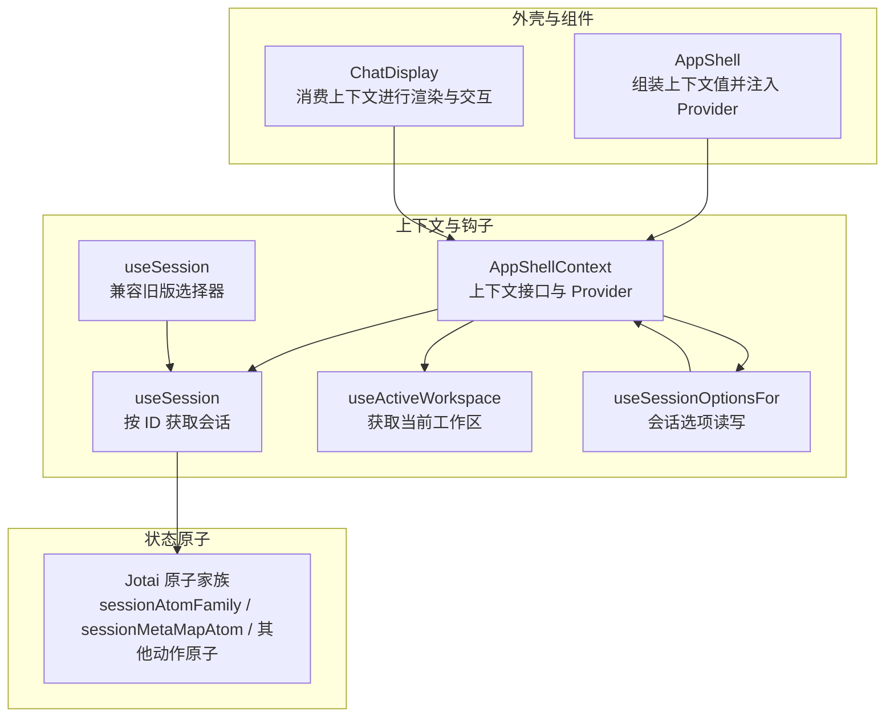
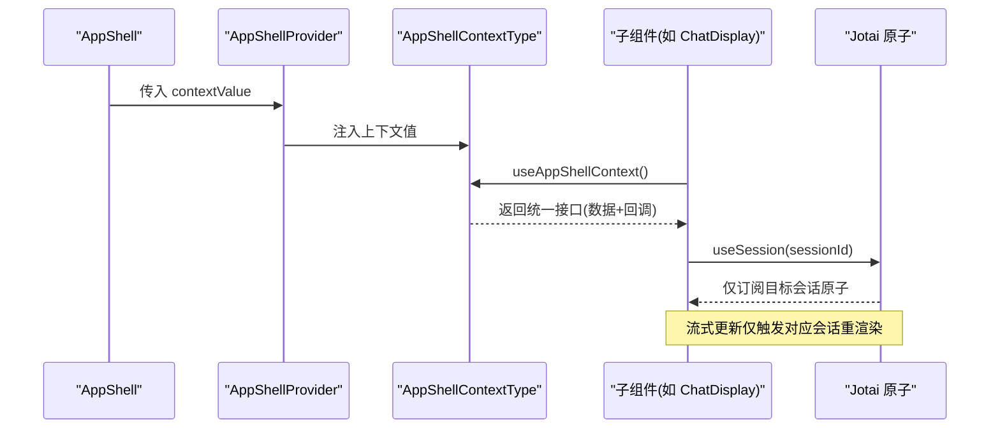
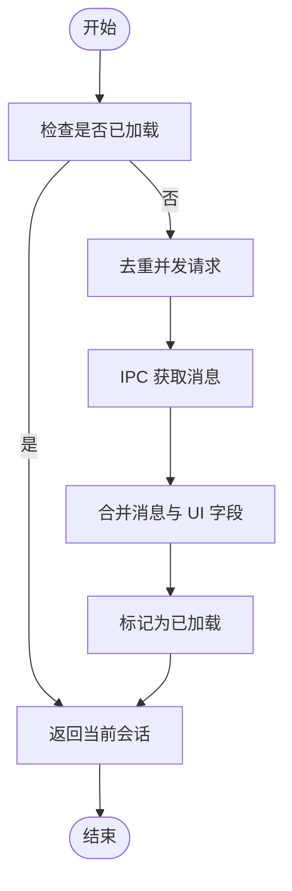
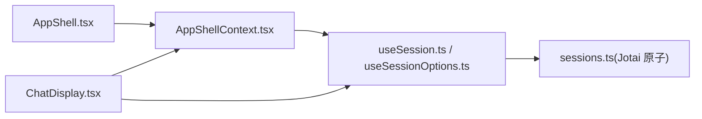

# AppShell 上下文

<cite>
**本文引用的文件**
- [AppShellContext.tsx](file://apps/electron/src/renderer/context/AppShellContext.tsx)
- [useSession.ts](file://apps/electron/src/renderer/hooks/useSession.ts)
- [useSessionOptions.ts](file://apps/electron/src/renderer/hooks/useSessionOptions.ts)
- [sessions.ts](file://apps/electron/src/renderer/atoms/sessions.ts)
- [AppShell.tsx](file://apps/electron/src/renderer/components/app-shell/AppShell.tsx)
- [ChatDisplay.tsx](file://apps/electron/src/renderer/components/app-shell/ChatDisplay.tsx)
</cite>

## 目录
1. [简介](#简介)
2. [项目结构](#项目结构)
3. [核心组件](#核心组件)
4. [架构总览](#架构总览)
5. [详细组件分析](#详细组件分析)
6. [依赖关系分析](#依赖关系分析)
7. [性能考量](#性能考量)
8. [故障排查指南](#故障排查指南)
9. [结论](#结论)
10. [附录](#附录)

## 简介
AppShellContext 是应用外壳层的核心上下文，用于在标签页面板与聊天界面等组件之间共享会话与工作区数据，避免跨层级的属性传递（prop drilling）。它统一管理以下能力：
- 会话管理：创建、发送消息、重命名、归档、标记未读/已读、删除等
- 工作区数据：当前工作区、工作区切换、动态状态与标签配置
- 权限与凭证：权限请求队列与响应、凭据请求队列与响应
- 凭证与 LLM 连接：LLM 连接列表、默认连接、刷新逻辑
- 输入草稿与附件：草稿文本、持久化附件引用、按需加载完整附件
- 会话选项：权限模式、思考层级等会话级设置
- 搜索高亮与导航：会话列表搜索查询、匹配信息回调、ChatDisplay 引用
- 自动化管理：测试、启用/禁用、复制、删除、历史与回放

该上下文通过一组钩子函数（如 useSession、useActiveWorkspace、useSessionOptionsFor）提供类型安全、可组合且高性能的数据访问。

## 项目结构
AppShellContext 所在目录与相关模块如下：
- 上下文定义：apps/electron/src/renderer/context/AppShellContext.tsx
- 钩子与原子：apps/electron/src/renderer/hooks/useSession.ts、apps/electron/src/renderer/hooks/useSessionOptions.ts、apps/electron/src/renderer/atoms/sessions.ts
- 外壳容器：apps/electron/src/renderer/components/app-shell/AppShell.tsx
- 聊天显示组件：apps/electron/src/renderer/components/app-shell/ChatDisplay.tsx

图表来源
- [AppShellContext.tsx:33-174](file://apps/electron/src/renderer/context/AppShellContext.tsx#L33-L174)
- [useSession.ts:25-36](file://apps/electron/src/renderer/hooks/useSession.ts#L25-L36)
- [useSessionOptions.ts:20-33](file://apps/electron/src/renderer/hooks/useSessionOptions.ts#L20-L33)
- [sessions.ts:122-165](file://apps/electron/src/renderer/atoms/sessions.ts#L122-L165)
- [AppShell.tsx:1574-1599](file://apps/electron/src/renderer/components/app-shell/AppShell.tsx#L1574-L1599)
- [ChatDisplay.tsx:71-71](file://apps/electron/src/renderer/components/app-shell/ChatDisplay.tsx#L71-L71)

章节来源
- [AppShellContext.tsx:1-282](file://apps/electron/src/renderer/context/AppShellContext.tsx#L1-L282)
- [useSession.ts:1-45](file://apps/electron/src/renderer/hooks/useSession.ts#L1-L45)
- [useSessionOptions.ts:1-50](file://apps/electron/src/renderer/hooks/useSessionOptions.ts#L1-L50)
- [sessions.ts:1-715](file://apps/electron/src/renderer/atoms/sessions.ts#L1-L715)
- [AppShell.tsx:483-1599](file://apps/electron/src/renderer/components/app-shell/AppShell.tsx#L483-L1599)
- [ChatDisplay.tsx:1-200](file://apps/electron/src/renderer/components/app-shell/ChatDisplay.tsx#L1-L200)

## 核心组件
- AppShellContextType：上下文数据与回调的统一契约，涵盖会话、工作区、权限、凭证、输入草稿、LLM 连接、自动化管理、搜索高亮等。
- AppShellProvider：将上下文值注入到子树。
- useAppShellContext/useOptionalAppShellContext：安全获取上下文，前者在未包裹时抛错，后者返回 null。
- useSession：基于 per-session 原子的隔离订阅，仅当指定会话变化时触发重渲染，解决流式更新导致的重渲染风暴。
- useActiveWorkspace：从上下文中解析当前工作区。
- useSessionOptionsFor：读取与更新单个会话的选项（权限模式、思考层级等），提供类型安全的 setOption/setOptions/setPermissionMode/isSafeModeActive。

章节来源
- [AppShellContext.tsx:33-174](file://apps/electron/src/renderer/context/AppShellContext.tsx#L33-L174)
- [AppShellContext.tsx:176-199](file://apps/electron/src/renderer/context/AppShellContext.tsx#L176-L199)
- [AppShellContext.tsx:206-218](file://apps/electron/src/renderer/context/AppShellContext.tsx#L206-L218)
- [AppShellContext.tsx:236-281](file://apps/electron/src/renderer/context/AppShellContext.tsx#L236-L281)

## 架构总览
AppShell 将来自主进程与本地状态的数据整合为上下文值，并通过 AppShellProvider 注入。组件通过 useAppShellContext 访问统一接口；同时，会话数据通过 Jotai 的 per-session 原子家族实现隔离更新，避免全量重渲染。

图表来源
- [AppShell.tsx:1574-1599](file://apps/electron/src/renderer/components/app-shell/AppShell.tsx#L1574-L1599)
- [AppShellContext.tsx:176-199](file://apps/electron/src/renderer/context/AppShellContext.tsx#L176-L199)
- [sessions.ts:122-165](file://apps/electron/src/renderer/atoms/sessions.ts#L122-L165)

## 详细组件分析

### AppShellContext 数据与回调
- 数据字段
  - 工作区与 LLM：workspaces、activeWorkspaceId、activeWorkspaceSlug、llmConnections、workspaceDefaultLlmConnection、refreshLlmConnections
  - 权限与凭证：pendingPermissions、pendingCredentials
  - 草稿与附件：getDraft、getDraftAttachmentRefs、hydrateDraftAttachments
  - 源与技能：enabledSources、skills、activeSessionWorkingDirectory
  - 标签与状态：labels、sessionStatuses
  - 会话选项：sessionOptions（Map）
  - 会话回调：onCreateSession、onSendMessage、onRenameSession、onFlagSession、onArchiveSession、onMarkSessionRead、onMarkSessionUnread、onDeleteSession、onSessionStatusChange、onSetActiveViewingSession
  - 权限/凭证响应：onRespondToPermission、onRespondToCredential
  - 文件/链接打开：onOpenFile、onOpenUrl
  - 工作区：onSelectWorkspace、onRefreshWorkspaces
  - 应用动作：onOpenSettings、onOpenKeyboardShortcuts、onOpenStoredUserPreferences、onReset
  - 会话选项变更：onSessionOptionsChange
  - 输入草稿：onInputChange、onAttachmentsChange
  - 源选择：onSessionSourcesChange
  - 新建聊天：openNewChat
  - UI 控件：rightSidebarButton、leadingAction、isFocusedPanel、isCompactMode
  - 搜索高亮：sessionListSearchQuery、isSearchModeActive、setSessionListSearchQuery、chatDisplayRef、onChatMatchInfoChange
  - 自动化：onTestAutomation、onToggleAutomation、onDuplicateAutomation、onDeleteAutomation、automationTestResults、getAutomationHistory、onReplayAutomation

- 钩子函数
  - useSession(sessionId)：按 ID 获取会话，使用 per-session 原子，避免无关会话重渲染
  - useActiveWorkspace()：根据 activeWorkspaceId 从 workspaces 中解析当前工作区
  - usePendingPermission(sessionId)/usePendingCredential(sessionId)：获取会话首个待处理请求
  - useSessionOptionsFor(sessionId)：读取与更新会话选项，提供 setOption/setOptions/setPermissionMode/isSafeModeActive

章节来源
- [AppShellContext.tsx:33-174](file://apps/electron/src/renderer/context/AppShellContext.tsx#L33-L174)
- [AppShellContext.tsx:206-281](file://apps/electron/src/renderer/context/AppShellContext.tsx#L206-L281)

### 会话原子家族与性能隔离
- sessionAtomFamily：为每个会话创建独立原子，更新隔离，避免消息数组闭包导致内存泄漏与重渲染风暴
- sessionMetaMapAtom：仅存储轻量元数据，用于列表渲染与快速筛选
- updateSessionAtom/replaceLoadedSessionAtom/appendMessageAtom/updateStreamingContentAtom：细粒度更新，避免全量替换
- ensureSessionMessagesLoadedAtom/forceSessionMessagesReloadAtom：懒加载与强制刷新，带 Promise 去重与 UI 字段保护
- backgroundTasksAtomFamily：每会话后台任务跟踪，配合 ActiveTasksBar 展示

图表来源
- [sessions.ts:550-674](file://apps/electron/src/renderer/atoms/sessions.ts#L550-L674)

章节来源
- [sessions.ts:122-165](file://apps/electron/src/renderer/atoms/sessions.ts#L122-L165)
- [sessions.ts:170-230](file://apps/electron/src/renderer/atoms/sessions.ts#L170-L230)
- [sessions.ts:550-674](file://apps/electron/src/renderer/atoms/sessions.ts#L550-L674)

### AppShell 如何构建上下文值
- AppShell 将工作区、会话选项、权限/凭证队列、动态状态与标签、源与技能、自动化管理等数据与回调，通过 useAppShellContext 组装为上下文值
- 在多面板场景中，通过 focusedSessionId 与 useSession 选择目标会话，确保键盘快捷键与焦点行为一致
- 提供搜索高亮与 ChatDisplay 引用，支持在会话列表与聊天界面间联动

章节来源
- [AppShell.tsx:1574-1599](file://apps/electron/src/renderer/components/app-shell/AppShell.tsx#L1574-L1599)
- [AppShell.tsx:1081-1103](file://apps/electron/src/renderer/components/app-shell/AppShell.tsx#L1081-L1103)
- [AppShell.tsx:1282-1289](file://apps/electron/src/renderer/components/app-shell/AppShell.tsx#L1282-L1289)

### ChatDisplay 如何消费上下文
- ChatDisplay 通过 useAppShellContext 获取搜索高亮、标签、状态、源、技能、LLM 连接等上下文数据
- 结合自身 props（如 session、onSendMessage、onOpenFile、onOpenUrl 等）完成渲染与交互
- 支持权限/凭证弹窗、输入草稿、附件、思考层级、模型选择等

章节来源
- [ChatDisplay.tsx:71-71](file://apps/electron/src/renderer/components/app-shell/ChatDisplay.tsx#L71-L71)
- [ChatDisplay.tsx:131-235](file://apps/electron/src/renderer/components/app-shell/ChatDisplay.tsx#L131-L235)

### 会话选择与多选工厂
- useSession 保留向后兼容的旧版接口，内部委托给通用的 useEntitySelection 工厂
- sessionSelection 提供 useSelection/useSelectionStore/useIsMultiSelectActive/useSelectedIds/useSelectionCount 等钩子，支持单选/多选/范围选择/清空等操作

章节来源
- [useSession.ts:25-36](file://apps/electron/src/renderer/hooks/useSession.ts#L25-L36)
- [useSession.ts:40-45](file://apps/electron/src/renderer/hooks/useSession.ts#L40-L45)
- [useEntitySelection.ts:31-96](file://apps/electron/src/renderer/hooks/useEntitySelection.ts#L31-L96)

### 会话选项类型与默认值
- SessionOptions：包含 permissionMode、permissionModeVersion、thinkingLevel
- defaultSessionOptions：定义新会话默认值
- mergeSessionOptions：合并当前与更新项，保证默认值与当前值的正确性

章节来源
- [useSessionOptions.ts:20-33](file://apps/electron/src/renderer/hooks/useSessionOptions.ts#L20-L33)
- [useSessionOptions.ts:39-48](file://apps/electron/src/renderer/hooks/useSessionOptions.ts#L39-L48)

## 依赖关系分析
- AppShellContext 依赖 Jotai 原子族（sessionAtomFamily、sessionMetaMapAtom 等）以实现会话数据的隔离与高效更新
- AppShell 作为上下文值的装配者，负责将主进程数据与本地状态整合为统一接口
- ChatDisplay 通过 useAppShellContext 与 useSession 获取所需数据，避免直接依赖主进程 IPC

图表来源
- [AppShell.tsx:1574-1599](file://apps/electron/src/renderer/components/app-shell/AppShell.tsx#L1574-L1599)
- [AppShellContext.tsx:33-174](file://apps/electron/src/renderer/context/AppShellContext.tsx#L33-L174)
- [useSession.ts:25-36](file://apps/electron/src/renderer/hooks/useSession.ts#L25-L36)
- [useSessionOptions.ts:20-33](file://apps/electron/src/renderer/hooks/useSessionOptions.ts#L20-L33)
- [sessions.ts:122-165](file://apps/electron/src/renderer/atoms/sessions.ts#L122-L165)
- [ChatDisplay.tsx:71-71](file://apps/electron/src/renderer/components/app-shell/ChatDisplay.tsx#L71-L71)

章节来源
- [AppShell.tsx:483-1599](file://apps/electron/src/renderer/components/app-shell/AppShell.tsx#L483-L1599)
- [AppShellContext.tsx:1-282](file://apps/electron/src/renderer/context/AppShellContext.tsx#L1-L282)
- [sessions.ts:1-715](file://apps/electron/src/renderer/atoms/sessions.ts#L1-L715)

## 性能考量
- 流式更新隔离：通过 sessionAtomFamily 与 updateStreamingContentAtom 等原子，确保工具调用与文本增量更新只影响目标会话，避免全量重渲染
- 懒加载与去重：ensureSessionMessagesLoadedAtom 使用 Promise 去重，防止并发请求重复发起；forceSessionMessagesReloadAtom 用于恢复卡住的加载状态
- 元数据优先：sessionMetaMapAtom 仅保存轻量元数据，列表渲染不依赖完整消息数组，降低内存占用与重排成本
- 参照相等：Jotai 的 referential equality 保障只有实际变化的对象才会触发订阅组件重渲染
- 多面板焦点：通过 focusedSessionId 与 dispatchFocusInputEvent，确保键盘快捷键与焦点行为在多面板场景中稳定一致

章节来源
- [sessions.ts:238-277](file://apps/electron/src/renderer/atoms/sessions.ts#L238-L277)
- [sessions.ts:550-674](file://apps/electron/src/renderer/atoms/sessions.ts#L550-L674)
- [sessions.ts:122-165](file://apps/electron/src/renderer/atoms/sessions.ts#L122-L165)
- [AppShell.tsx:1081-1103](file://apps/electron/src/renderer/components/app-shell/AppShell.tsx#L1081-L1103)

## 故障排查指南
- 未包裹 Provider 报错
  - 症状：useAppShellContext 在未包裹 AppShellProvider 时抛出错误
  - 解决：确保在 AppShell 内部使用 AppShellProvider 包裹子树
  - 参考：[AppShellContext.tsx:193-199](file://apps/electron/src/renderer/context/AppShellContext.tsx#L193-L199)

- 会话未加载或为空
  - 症状：ChatDisplay 显示加载中或无消息
  - 排查：确认 ensureSessionMessagesLoadedAtom 是否被调用；检查 loadedSessionsAtom 标记；必要时使用 forceSessionMessagesReloadAtom
  - 参考：[sessions.ts:658-674](file://apps/electron/src/renderer/atoms/sessions.ts#L658-L674)

- 流式更新丢失
  - 症状：工具调用或中间结果丢失
  - 排查：检查 updateStreamingContentAtom 的调用时机；确认同步策略（syncSessionsToAtomsAtom）不会覆盖正在处理中的会话
  - 参考：[sessions.ts:479-534](file://apps/electron/src/renderer/atoms/sessions.ts#L479-L534)

- 多面板焦点异常
  - 症状：Shift+Tab 或其他快捷键作用于错误会话
  - 排查：确认 effectiveSessionId 来源（focusedSessionId 或 useSession 的 selected）；核对 dispatchFocusInputEvent 的目标会话
  - 参考：[AppShell.tsx:1081-1103](file://apps/electron/src/renderer/components/app-shell/AppShell.tsx#L1081-L1103)

- 搜索高亮不同步
  - 症状：会话列表搜索与 ChatDisplay 高亮不一致
  - 排查：确认 sessionListSearchQuery、isSearchModeActive、chatDisplayRef 与 onChatMatchInfoChange 的传递链路
  - 参考：[AppShell.tsx:1574-1599](file://apps/electron/src/renderer/components/app-shell/AppShell.tsx#L1574-L1599)

## 结论
AppShellContext 通过统一的数据契约与钩子体系，将会话、工作区、权限、凭证、LLM 连接、草稿与附件、搜索高亮、自动化管理等功能整合为可组合、可扩展的上下文。结合 Jotai 的 per-session 原子家族与懒加载策略，实现了高性能、低耦合的会话数据管理。推荐在所有需要访问会话与工作区数据的组件中统一使用 useAppShellContext 与相关钩子，遵循类型安全与最小化重渲染的原则。

## 附录

### 最佳实践清单
- 类型安全
  - 使用 useSessionOptionsFor 获取与更新会话选项，避免直接操作 Map
  - 使用 useActiveWorkspace 获取当前工作区，避免手动遍历 workspaces
- 错误处理
  - 对外部 IPC 调用（如刷新 LLM 连接、设置标签、源）添加 try/catch 并记录日志
  - 对会话删除、消息加载失败等场景提供用户反馈与重试入口
- 性能优化
  - 仅在需要时加载会话消息，使用 ensureSessionMessagesLoadedAtom
  - 避免在渲染路径中创建闭包持有完整消息数组
  - 利用 Jotai 的 referential equality，减少不必要的重渲染
- 使用示例（路径指引）
  - 在组件中使用 useAppShellContext 获取上下文接口
    - [AppShellContext.tsx:193-199](file://apps/electron/src/renderer/context/AppShellContext.tsx#L193-L199)
  - 通过 useSession 获取指定会话
    - [AppShellContext.tsx:206-218](file://apps/electron/src/renderer/context/AppShellContext.tsx#L206-L218)
  - 通过 useSessionOptionsFor 设置权限模式
    - [AppShellContext.tsx:236-281](file://apps/electron/src/renderer/context/AppShellContext.tsx#L236-L281)
  - 在 AppShell 中组装上下文值
    - [AppShell.tsx:1574-1599](file://apps/electron/src/renderer/components/app-shell/AppShell.tsx#L1574-L1599)
  - 在 ChatDisplay 中消费上下文
    - [ChatDisplay.tsx:71-71](file://apps/electron/src/renderer/components/app-shell/ChatDisplay.tsx#L71-L71)