# 上下文系统

<cite>
**本文引用的文件**
- [AppShellContext.tsx](file://apps/electron/src/renderer/context/AppShellContext.tsx)
- [NavigationContext.tsx](file://apps/electron/src/renderer/contexts/NavigationContext.tsx)
- [ModalContext.tsx](file://apps/electron/src/renderer/context/ModalContext.tsx)
- [FocusContext.tsx](file://apps/electron/src/renderer/context/FocusContext.tsx)
- [DismissibleLayerContext.tsx](file://apps/electron/src/renderer/context/DismissibleLayerContext.tsx)
- [EscapeInterruptContext.tsx](file://apps/electron/src/renderer/context/EscapeInterruptContext.tsx)
- [SessionListContext.tsx](file://apps/electron/src/renderer/context/SessionListContext.tsx)
- [StoplightContext.tsx](file://apps/electron/src/renderer/context/StoplightContext.tsx)
- [ThemeContext.tsx](file://apps/electron/src/renderer/context/ThemeContext.tsx)
- [navigation-history.ts](file://apps/electron/src/renderer/contexts/navigation-history.ts)
- [navigation-reconcile.ts](file://apps/electron/src/renderer/contexts/navigation-reconcile.ts)
- [AppShell.tsx](file://apps/electron/src/renderer/components/app-shell/AppShell.tsx)
- [MainContentPanel.tsx](file://apps/electron/src/renderer/components/app-shell/MainContentPanel.tsx)
</cite>

## 目录
1. [引言](#引言)
2. [项目结构](#项目结构)
3. [核心组件](#核心组件)
4. [架构总览](#架构总览)
5. [详细组件分析](#详细组件分析)
6. [依赖关系分析](#依赖关系分析)
7. [性能考量](#性能考量)
8. [故障排查指南](#故障排查指南)
9. [结论](#结论)
10. [附录](#附录)

## 引言
本文件系统性梳理并阐述本项目的上下文系统设计与实现，重点覆盖以下上下文与提供者：
- AppShellContext：为面板与会话相关组件提供统一数据与回调，避免跨层级属性传递
- NavigationContext：全局导航中枢，驱动 URL 同步、历史管理、自动选择与面板栈协调
- ModalContext：模态注册表，支持键盘关闭拦截与优先级关闭
- FocusContext：焦点区域管理，支持键盘/点击/程序化切换与 DOM 聚焦控制
- DismissibleLayerContext：可消解层（如抽屉、侧弹）注册与 ESC 处理
- EscapeInterruptContext：双击 Esc 中断流程的警告与中断机制
- SessionListContext：会话列表共享动作与配置
- StoplightContext：macOS Traffic Lights 补偿
- ThemeContext：主题偏好、工作区覆盖、预设主题解析与注入

文档将从创建方式、提供者包装、消费者使用、值传递机制入手，深入讲解跨组件状态共享策略、性能优化（useMemo、useCallback、useRef）、避免不必要重渲染，并总结最佳实践与常见陷阱。

## 项目结构
上下文系统主要分布在以下位置：
- 渲染器上下文定义：apps/electron/src/renderer/context/*.tsx
- 导航上下文与辅助模块：apps/electron/src/renderer/contexts/*.ts
- 应用壳层组件：apps/electron/src/renderer/components/app-shell/*.tsx
- 提供者在 AppShell.tsx 中集中装配，MainContentPanel.tsx 使用 NavigationState 驱动内容渲染

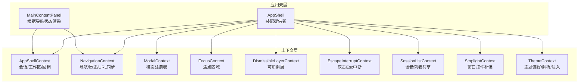

图表来源
- [AppShell.tsx](file://apps/electron/src/renderer/components/app-shell/AppShell.tsx)
- [MainContentPanel.tsx](file://apps/electron/src/renderer/components/app-shell/MainContentPanel.tsx)
- [AppShellContext.tsx](file://apps/electron/src/renderer/context/AppShellContext.tsx)
- [NavigationContext.tsx](file://apps/electron/src/renderer/contexts/NavigationContext.tsx)
- [ModalContext.tsx](file://apps/electron/src/renderer/context/ModalContext.tsx)
- [FocusContext.tsx](file://apps/electron/src/renderer/context/FocusContext.tsx)
- [DismissibleLayerContext.tsx](file://apps/electron/src/renderer/context/DismissibleLayerContext.tsx)
- [EscapeInterruptContext.tsx](file://apps/electron/src/renderer/context/EscapeInterruptContext.tsx)
- [SessionListContext.tsx](file://apps/electron/src/renderer/context/SessionListContext.tsx)
- [StoplightContext.tsx](file://apps/electron/src/renderer/context/StoplightContext.tsx)
- [ThemeContext.tsx](file://apps/electron/src/renderer/context/ThemeContext.tsx)

章节来源
- [AppShell.tsx](file://apps/electron/src/renderer/components/app-shell/AppShell.tsx)
- [MainContentPanel.tsx](file://apps/electron/src/renderer/components/app-shell/MainContentPanel.tsx)

## 核心组件
本节对各上下文进行概览式说明，涵盖职责、提供者、消费者钩子与典型使用场景。

- AppShellContext
  - 职责：向面板与聊天等组件提供会话、工作区、权限/凭据、LLM 连接、输入草稿、标签、搜索与自动化管理等统一接口
  - 提供者：AppShellProvider
  - 消费者：useAppShellContext、useOptionalAppShellContext、useSession、useActiveWorkspace、useSessionOptionsFor 等
  - 关键点：通过 per-session 原子隔离更新，避免闭包持有完整消息数组导致内存泄漏；提供会话选项统一入口

- NavigationContext
  - 职责：全局导航中枢，维护聚焦面板路由、右侧侧栏、浏览器历史、URL 同步、面板栈协调与自动选择
  - 提供者：NavigationProvider
  - 消费者：useNavigation、useNavigationState、navigate、goBack/goForward、updateRightSidebar 等
  - 关键点：URL 是唯一真相；语义化历史键去重；多面板布局与比例；空会话清理；工作区切换时的 URL 恢复

- ModalContext
  - 职责：记录打开的模态，按优先级关闭；Cmd+W 时优先关闭顶层模态
  - 提供者：ModalProvider
  - 消费者：useModalRegistry、useRegisterModal
  - 关键点：内部使用 ref 存储，避免状态变更引发重渲染；注册返回卸载函数

- FocusContext
  - 职责：管理焦点区域（侧边栏/导航器/聊天），支持键盘/点击/程序化切换与 DOM 聚焦
  - 提供者：FocusProvider
  - 消费者：useFocusContext
  - 关键点：移除自动 focusin 监听以避免级联重渲染；显式调用 focusZone 控制 DOM 聚焦

- DismissibleLayerContext
  - 职责：可消解层（抽屉/侧弹）注册、ESC 回退或关闭
  - 提供者：DismissibleLayerProvider
  - 消费者：useDismissibleLayerRegistry、useRegisterDismissibleLayer
  - 关键点：基于优先级与注册顺序排序；ESC 事件冒泡阶段拦截

- EscapeInterruptContext
  - 职责：双击 Esc 显示警告，第二次 Esc 内部中断
  - 提供者：EscapeInterruptProvider
  - 消费者：useEscapeInterrupt
  - 关键点：超时控制；overlay 状态与 dismiss

- SessionListContext
  - 职责：会话列表项共享动作与配置（重命名、状态变更、归档、标签、选择、搜索结果）
  - 提供者：SessionListProvider
  - 消费者：useSessionListContext
  - 关键点：集中动作回调，避免重复声明

- StoplightContext
  - 职责：在 macOS 窗口聚焦模式下为页面头部自动增加左侧留白，避免与红黄绿控件重叠
  - 提供者：StoplightProvider
  - 消费者：useCompensateForStoplight
  - 关键点：布尔值传播，无状态逻辑

- ThemeContext
  - 职责：主题偏好（系统/浅色/深色）、颜色主题、字体、工作区覆盖、预设主题加载与 CSS 变量注入
  - 提供者：ThemeProvider
  - 消费者：useTheme
  - 关键点：持久化与跨窗口广播；系统主题监听；预设主题回退；Shiki 主题配置

章节来源
- [AppShellContext.tsx](file://apps/electron/src/renderer/context/AppShellContext.tsx)
- [NavigationContext.tsx](file://apps/electron/src/renderer/contexts/NavigationContext.tsx)
- [ModalContext.tsx](file://apps/electron/src/renderer/context/ModalContext.tsx)
- [FocusContext.tsx](file://apps/electron/src/renderer/context/FocusContext.tsx)
- [DismissibleLayerContext.tsx](file://apps/electron/src/renderer/context/DismissibleLayerContext.tsx)
- [EscapeInterruptContext.tsx](file://apps/electron/src/renderer/context/EscapeInterruptContext.tsx)
- [SessionListContext.tsx](file://apps/electron/src/renderer/context/SessionListContext.tsx)
- [StoplightContext.tsx](file://apps/electron/src/renderer/context/StoplightContext.tsx)
- [ThemeContext.tsx](file://apps/electron/src/renderer/context/ThemeContext.tsx)

## 架构总览
上下文系统围绕“单一真相”原则构建：
- NavigationContext 的 NavigationState 作为全局状态源，驱动 AppShell 与 MainContentPanel 的渲染
- AppShellContext 将会话、工作区、权限/凭据、LLM 连接、草稿与自动化等能力下沉到面板
- Modal/Focus/Dismissible/EscapeInterrupt 等上下文提供交互层的通用能力
- ThemeContext 与 StoplightContext 提供外观与平台适配

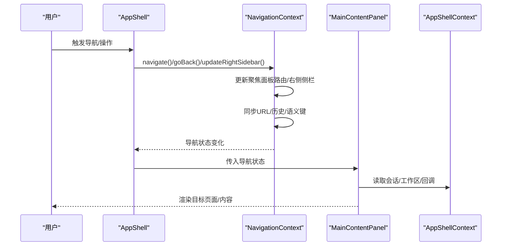

图表来源
- [AppShell.tsx](file://apps/electron/src/renderer/components/app-shell/AppShell.tsx)
- [MainContentPanel.tsx](file://apps/electron/src/renderer/components/app-shell/MainContentPanel.tsx)
- [NavigationContext.tsx](file://apps/electron/src/renderer/contexts/NavigationContext.tsx)
- [AppShellContext.tsx](file://apps/electron/src/renderer/context/AppShellContext.tsx)

## 详细组件分析

### AppShellContext 分析
- 设计要点
  - 将“会话列表”改为通过 per-session 原子访问，避免闭包持有完整消息数组
  - 统一会话选项 Map 与回调，提供 useSessionOptionsFor 以最小化重渲染
  - 提供草稿读取、附件引用与异步水合、权限/凭据队列、LLM 连接刷新等
- 性能优化
  - 使用 useCallback 包裹回调，确保稳定引用
  - 使用 useMemo 计算派生状态（如活动工作区、待处理权限/凭据）
- 典型使用
  - 在面板组件中通过 useAppShellContext 获取统一上下文，再用 useSessionOptionsFor 获取当前会话选项

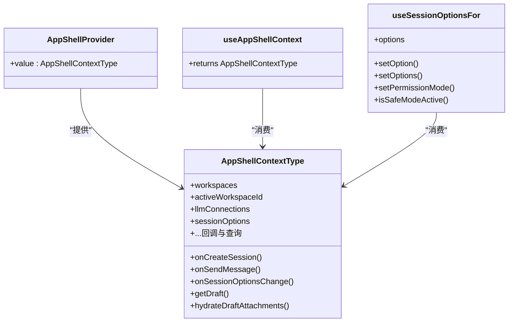

图表来源
- [AppShellContext.tsx](file://apps/electron/src/renderer/context/AppShellContext.tsx)

章节来源
- [AppShellContext.tsx](file://apps/electron/src/renderer/context/AppShellContext.tsx)

### NavigationContext 分析
- 设计要点
  - 单一真相：URL 是导航状态的唯一来源；聚焦面板路由决定导航状态
  - URL 同步：pushState/replaceState 与语义键去重；持久化工作区 URL
  - 面板栈协调：reconcilePanelStackAtom 保证 React key 不变，保留滚动/流式状态
  - 自动选择：当导航到过滤视图但未指定详情时，按策略自动选择首个可用项
  - 空会话清理：离开面板时检测空会话并可选删除
- 性能优化
  - 微任务合并多次写入为一次 pushState
  - 仅在语义变化时 push，避免布局调整触发历史条目
  - 使用 ref 保存最新原子值，避免闭塞捕获旧值
- 辅助模块
  - navigation-history.ts：语义键构建与初始恢复门控
  - navigation-reconcile.ts：URL 重建时对过滤路由进行规范化与自动选择

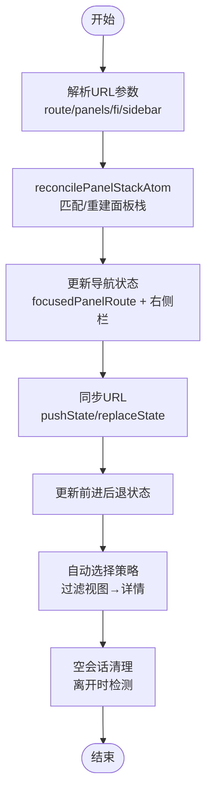

图表来源
- [NavigationContext.tsx](file://apps/electron/src/renderer/contexts/NavigationContext.tsx)
- [navigation-history.ts](file://apps/electron/src/renderer/contexts/navigation-history.ts)
- [navigation-reconcile.ts](file://apps/electron/src/renderer/contexts/navigation-reconcile.ts)

章节来源
- [NavigationContext.tsx](file://apps/electron/src/renderer/contexts/NavigationContext.tsx)
- [navigation-history.ts](file://apps/electron/src/renderer/contexts/navigation-history.ts)
- [navigation-reconcile.ts](file://apps/electron/src/renderer/contexts/navigation-reconcile.ts)

### ModalContext 分析
- 设计要点
  - 注册表使用 ref，避免状态变更导致重渲染
  - 按优先级关闭顶层模态；返回是否关闭成功
  - useRegisterModal 在 isOpen 时注册，返回卸载函数
- 典型使用
  - 对话框/抽屉组件在打开时注册，关闭时自动卸载

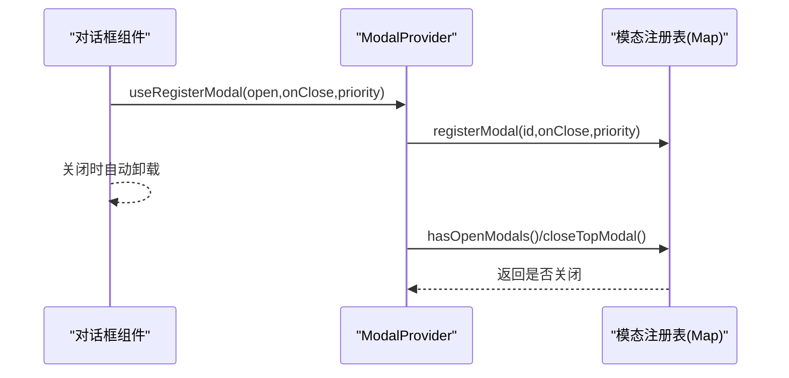

图表来源
- [ModalContext.tsx](file://apps/electron/src/renderer/context/ModalContext.tsx)

章节来源
- [ModalContext.tsx](file://apps/electron/src/renderer/context/ModalContext.tsx)

### FocusContext 分析
- 设计要点
  - 定义焦点区域与意图（键盘/点击/程序化），控制是否移动 DOM 聚焦
  - 支持 Tab/Shift+Tab 区域切换；显式 focusZone 调用
  - 移除自动 focusin 监听，避免级联重渲染
- 典型使用
  - 键盘快捷键触发区域切换；区域挂载时注册，卸载时注销

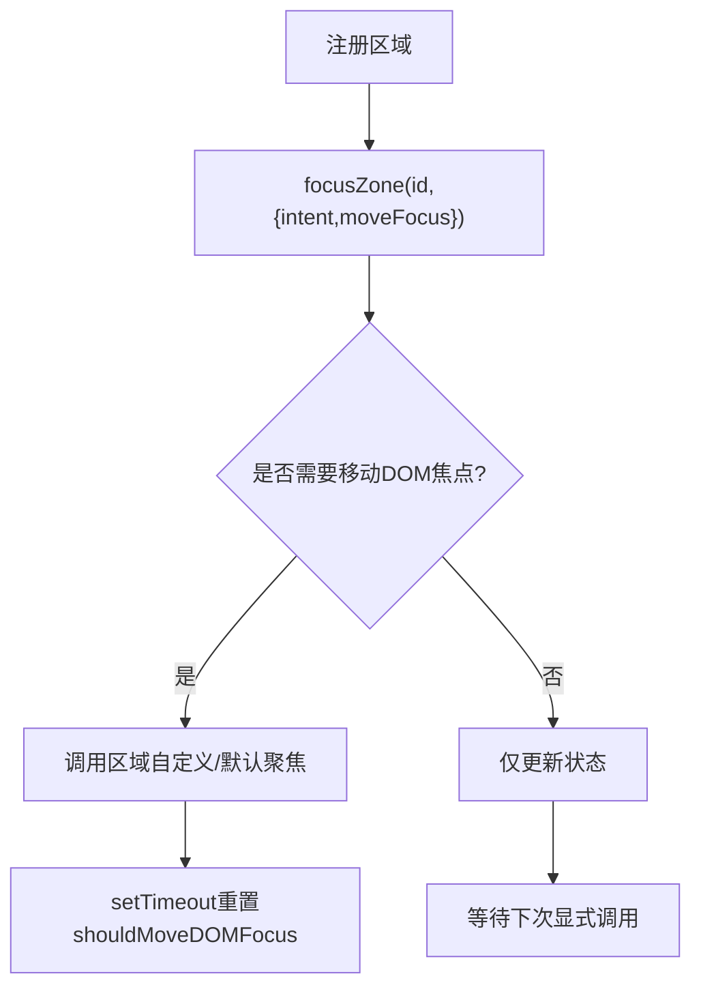

图表来源
- [FocusContext.tsx](file://apps/electron/src/renderer/context/FocusContext.tsx)

章节来源
- [FocusContext.tsx](file://apps/electron/src/renderer/context/FocusContext.tsx)

### DismissibleLayerContext 分析
- 设计要点
  - 创建注册表，按优先级与注册顺序排序
  - ESC 时优先回退（canBack/back），否则关闭顶层
  - 提供注册/获取顶层/关闭顶层/处理 ESC 的桥接能力
- 典型使用
  - 抽屉/侧弹组件注册自身，ESC 由 Provider 拦截并委托给注册表

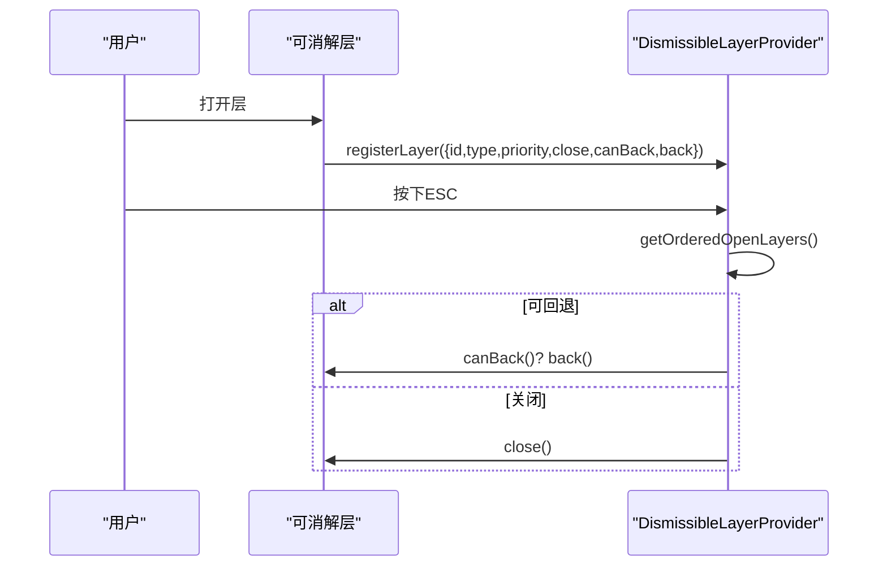

图表来源
- [DismissibleLayerContext.tsx](file://apps/electron/src/renderer/context/DismissibleLayerContext.tsx)

章节来源
- [DismissibleLayerContext.tsx](file://apps/electron/src/renderer/context/DismissibleLayerContext.tsx)

### EscapeInterruptContext 分析
- 设计要点
  - 第一次 Esc 显示警告；在超时内第二次 Esc 触发中断
  - 超时自动关闭；提供 dismissOverlay
- 典型使用
  - 流程中止/取消确认场景，避免误操作

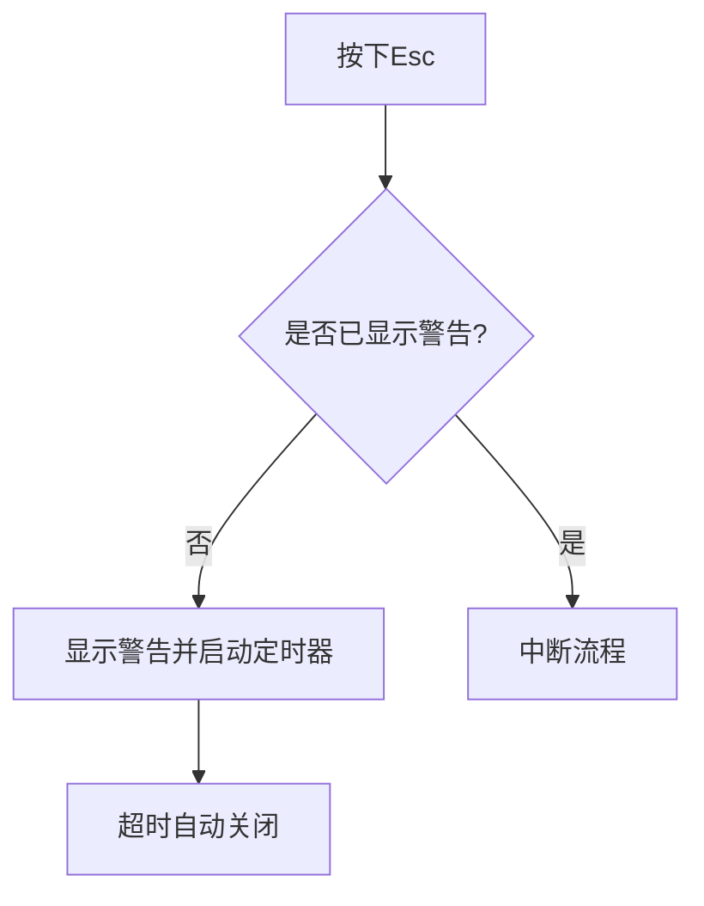

图表来源
- [EscapeInterruptContext.tsx](file://apps/electron/src/renderer/context/EscapeInterruptContext.tsx)

章节来源
- [EscapeInterruptContext.tsx](file://apps/electron/src/renderer/context/EscapeInterruptContext.tsx)

### SessionListContext 分析
- 设计要点
  - 会话列表项共享动作回调（重命名、状态变更、归档、标签、删除、选择、打开新窗口）
  - 共享配置（状态/标签树/扁平标签、搜索查询、选中会话、多选状态）
  - per-session 查找映射（选项、搜索结果、活动聊天匹配信息、待处理提示）

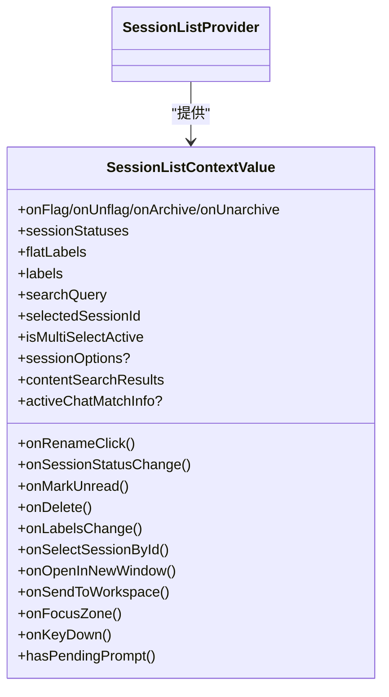

图表来源
- [SessionListContext.tsx](file://apps/electron/src/renderer/context/SessionListContext.tsx)

章节来源
- [SessionListContext.tsx](file://apps/electron/src/renderer/context/SessionListContext.tsx)

### StoplightContext 分析
- 设计要点
  - 在 macOS 聚焦模式下为页面头部增加左侧留白，避免与 Traffic Lights 重叠
  - 通过布尔值传播，简单直接

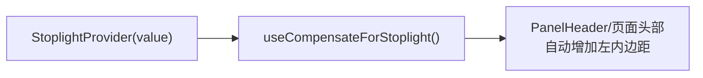

图表来源
- [StoplightContext.tsx](file://apps/electron/src/renderer/context/StoplightContext.tsx)

章节来源
- [StoplightContext.tsx](file://apps/electron/src/renderer/context/StoplightContext.tsx)

### ThemeContext 分析
- 设计要点
  - 应用级偏好（模式/颜色主题/字体）与工作区覆盖
  - 预设主题加载（IPC 回退到内置主题），合并覆盖，生成 CSS 变量注入
  - Shiki 主题配置与暗色/亮色模式适配
  - 系统主题监听与跨窗口同步广播
- 性能优化
  - useMemo 合并派生值；仅在预设主题加载完成后注入 CSS，避免闪烁
  - 仅在必要时更新 DOM 属性与类名

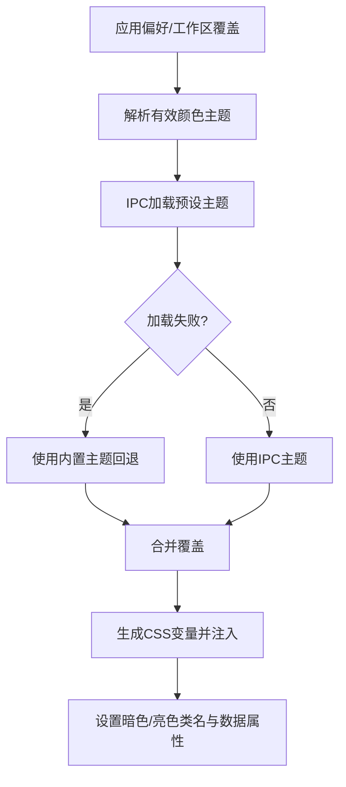

图表来源
- [ThemeContext.tsx](file://apps/electron/src/renderer/context/ThemeContext.tsx)

章节来源
- [ThemeContext.tsx](file://apps/electron/src/renderer/context/ThemeContext.tsx)

## 依赖关系分析
- AppShell.tsx 负责装配所有上下文提供者，并将 AppShellContext 的上下文值传入 AppShellProvider
- MainContentPanel.tsx 依据 NavigationState 决定渲染内容，同时读取 AppShellContext 的会话/工作区/回调
- NavigationContext 依赖 Jotai 原子（panelStack、focusedPanelRoute 等）与路由解析工具
- ThemeContext 依赖 Electron IPC 与本地存储，负责样式注入与跨窗口同步

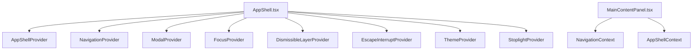

图表来源
- [AppShell.tsx](file://apps/electron/src/renderer/components/app-shell/AppShell.tsx)
- [MainContentPanel.tsx](file://apps/electron/src/renderer/components/app-shell/MainContentPanel.tsx)

章节来源
- [AppShell.tsx](file://apps/electron/src/renderer/components/app-shell/AppShell.tsx)
- [MainContentPanel.tsx](file://apps/electron/src/renderer/components/app-shell/MainContentPanel.tsx)

## 性能考量
- 避免不必要的重渲染
  - 使用 useCallback 包裹回调，确保稳定引用（如 AppShellContext 的 onSessionOptionsChange、NavigationContext 的导航/历史回调）
  - 使用 useMemo 计算派生状态（如 NavigationContext 的导航状态、会话过滤结果、主题派生值）
  - 使用 useRef 保存最新原子值与回调，避免闭塞捕获旧值（NavigationContext、ModalContext、DismissibleLayerContext）
- 数据隔离与流式隔离
  - AppShellContext 使用 per-session 原子访问，避免闭包持有完整消息数组（useSession）
- 事件与副作用
  - NavigationContext 将多次写入合并为微任务一次性 pushState，减少历史条目数量
  - FocusContext 移除自动 focusin 监听，避免级联重渲染
- 样式注入时机
  - ThemeContext 仅在预设主题加载完成后注入 CSS，避免闪烁与错误值

[本节为通用指导，无需具体文件分析]

## 故障排查指南
- 导航异常
  - 确认 URL 参数是否正确（route/panels/fi/sidebar/ws），检查语义键构建与初始恢复门控
  - 若面板栈重建后 React key 变化，检查 reconcile 逻辑与自动选择策略
- 空会话清理误判
  - 检查空会话判定条件（无最后消息、无名称、非处理中）与草稿存在性
- 模态/抽屉 ESC 不生效
  - 确认 ESC 事件冒泡阶段拦截是否被内层元素阻止；检查注册优先级与 canBack/back 实现
- 焦点错乱
  - 确保区域注册/注销时机正确；避免在键盘意图下不移动 DOM 聚焦
- 主题闪烁或样式错误
  - 检查预设主题加载与回退路径；确认 CSS 注入时机与 DOM 属性设置
- 双击 Esc 未中断
  - 检查超时与 overlay 状态；确认第二次 Esc 是否被默认行为阻止

章节来源
- [NavigationContext.tsx](file://apps/electron/src/renderer/contexts/NavigationContext.tsx)
- [DismissibleLayerContext.tsx](file://apps/electron/src/renderer/context/DismissibleLayerContext.tsx)
- [FocusContext.tsx](file://apps/electron/src/renderer/context/FocusContext.tsx)
- [ThemeContext.tsx](file://apps/electron/src/renderer/context/ThemeContext.tsx)
- [EscapeInterruptContext.tsx](file://apps/electron/src/renderer/context/EscapeInterruptContext.tsx)

## 结论
本项目的上下文系统以“单一真相”为核心，通过 NavigationContext 统一导航状态，配合 AppShellContext 下沉会话/工作区能力，辅以 Modal/Focus/Dismissible/EscapeInterrupt 等交互上下文，形成清晰、可扩展且高性能的状态共享方案。通过 useMemo/useCallback/useRef 等手段，系统在复杂交互与多面板布局下仍保持良好的性能与稳定性。建议在后续演进中持续遵循“最小提供范围、合理拆分上下文、类型安全、默认值处理”的最佳实践。

[本节为总结性内容，无需具体文件分析]

## 附录
- 最佳实践清单
  - 最小提供范围：仅在必要范围内提供上下文，避免全应用包裹
  - 合理拆分上下文：功能相近的能力聚合成上下文，避免过度聚合
  - 类型安全：为上下文值定义明确接口，结合 TypeScript 提升安全性
  - 默认值处理：提供默认值或安全消费者钩子（如 useOptionalAppShellContext）
  - 性能优化：稳定回调、派生值缓存、ref 保存最新值、微任务合并副作用
- 常见陷阱
  - 在导航/焦点/模态等高频上下文中使用状态而非 ref，导致重渲染
  - 在回调中直接使用过期的原子值，应使用 ref 或 store.get
  - 将过多数据放入单一上下文，导致不必要的重渲染
  - 忽略 ESC/键盘事件的冒泡与默认行为，导致冲突

[本节为通用指导，无需具体文件分析]