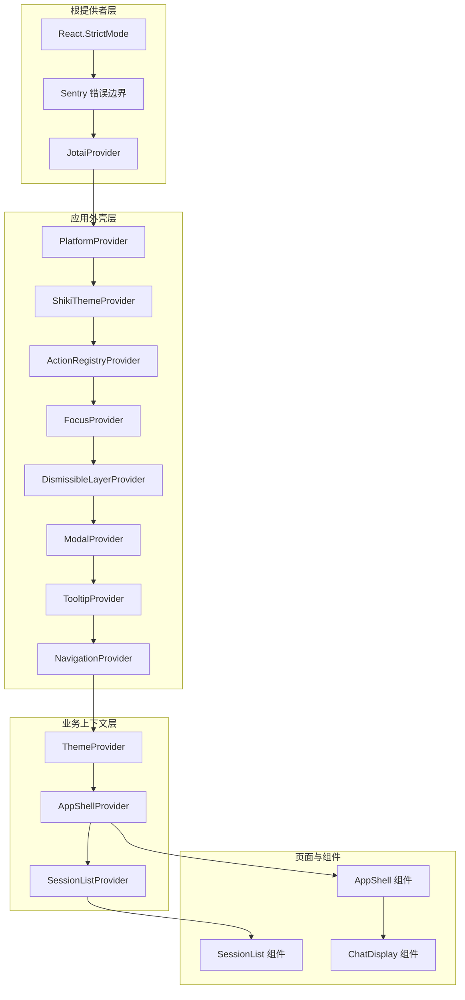
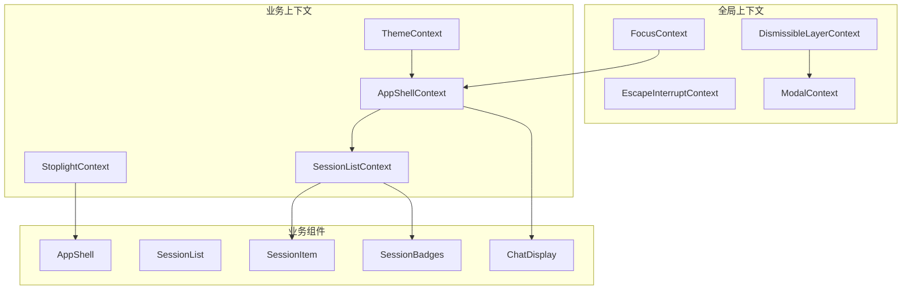
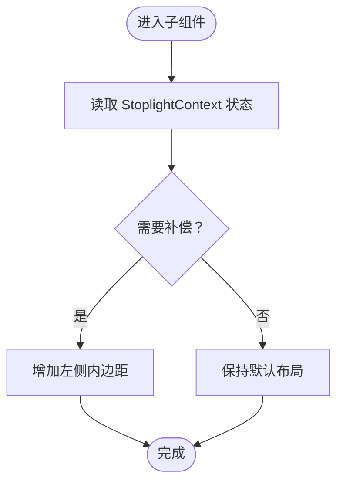
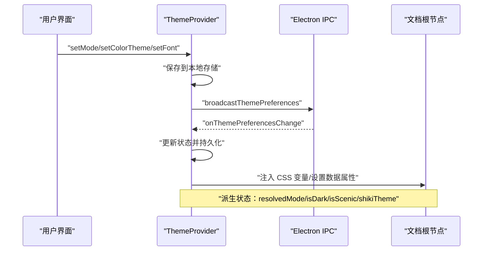
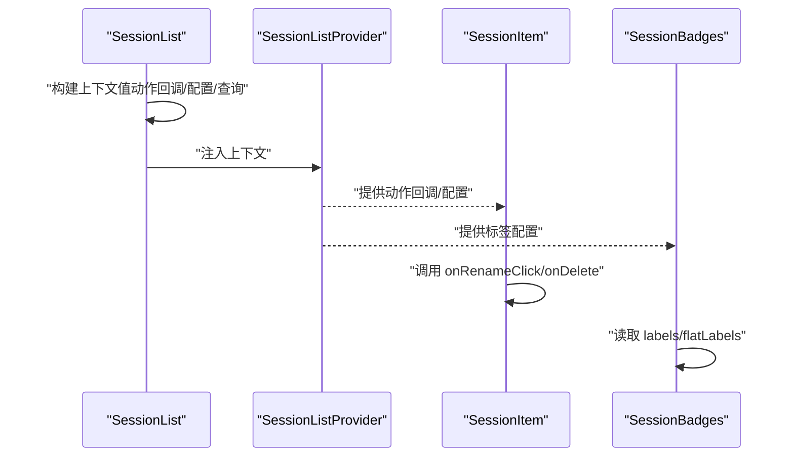
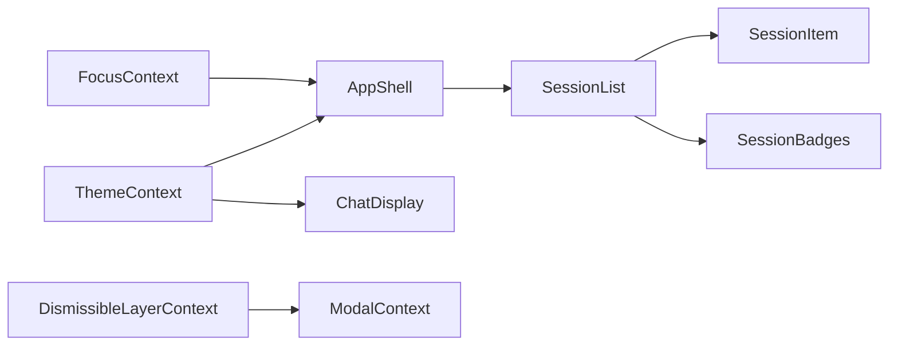

# 专用上下文

<cite>
**本文引用的文件**
- [StoplightContext.tsx](file://apps/electron/src/renderer/context/StoplightContext.tsx)
- [ThemeContext.tsx](file://apps/electron/src/renderer/context/ThemeContext.tsx)
- [SessionListContext.tsx](file://apps/electron/src/renderer/context/SessionListContext.tsx)
- [AppShellContext.tsx](file://apps/electron/src/renderer/context/AppShellContext.tsx)
- [FocusContext.tsx](file://apps/electron/src/renderer/context/FocusContext.tsx)
- [DismissibleLayerContext.tsx](file://apps/electron/src/renderer/context/DismissibleLayerContext.tsx)
- [EscapeInterruptContext.tsx](file://apps/electron/src/renderer/context/EscapeInterruptContext.tsx)
- [ModalContext.tsx](file://apps/electron/src/renderer/context/ModalContext.tsx)
- [SessionList.tsx](file://apps/electron/src/renderer/components/app-shell/SessionList.tsx)
- [App.tsx](file://apps/electron/src/renderer/App.tsx)
- [main.tsx](file://apps/electron/src/renderer/main.tsx)
</cite>

## 目录
1. [引言](#引言)
2. [项目结构](#项目结构)
3. [核心组件](#核心组件)
4. [架构总览](#架构总览)
5. [详细组件分析](#详细组件分析)
6. [依赖分析](#依赖分析)
7. [性能考虑](#性能考虑)
8. [故障排查指南](#故障排查指南)
9. [结论](#结论)
10. [附录](#附录)

## 引言
本文件聚焦于应用中“专用上下文”的设计与实现，重点覆盖以下上下文：
- StoplightContext：为 macOS 窗口控制（Traffic Lights）提供补偿状态，避免内容与窗口控件重叠。
- ThemeContext：统一管理主题模式、颜色主题、字体、预设主题解析、工作区级覆盖、系统偏好同步与跨窗口广播。
- SessionListContext：为会话列表组件树提供共享的动作回调、配置、查询状态与查找映射，避免层层传参。

同时简要介绍其他辅助上下文（FocusContext、DismissibleLayerContext、EscapeInterruptContext、ModalContext）在应用中的作用，帮助理解整体上下文生态与交互关系。

## 项目结构
专用上下文位于渲染端上下文目录，围绕 App.tsx 的根组件树进行组合式提供者装配，形成从全局到局部的上下文层级。

图表来源
- [App.tsx:1977-2058](file://apps/electron/src/renderer/App.tsx#L1977-L2058)
- [main.tsx:98-107](file://apps/electron/src/renderer/main.tsx#L98-L107)

章节来源
- [App.tsx:1977-2058](file://apps/electron/src/renderer/App.tsx#L1977-L2058)
- [main.tsx:98-107](file://apps/electron/src/renderer/main.tsx#L98-L107)

## 核心组件
本节对三个“专用上下文”进行深入剖析：StoplightContext、ThemeContext、SessionListContext，并给出它们的职责、数据流、状态同步与事件传播机制。

- StoplightContext
  - 职责：向子组件提供“是否需要为 macOS Traffic Lights 控制条留出左侧边距”的布尔状态，用于避免内容与窗口控件重叠。
  - 使用场景：主内容面板在聚焦模式下自动补偿停靠边距，无需每页单独处理。
  - 数据流：由上层提供者注入，子组件通过钩子读取；无复杂状态同步或事件传播。
  - 性能：纯布尔值，开销极低；仅在焦点模式切换时变化。
  - 生命周期：随提供者挂载/卸载，无额外清理逻辑。

- ThemeContext
  - 职责：集中管理主题模式（浅色/深色/系统）、颜色主题、字体、工作区级覆盖、预设主题解析、系统偏好监听、跨窗口同步与错误处理。
  - 使用场景：全局主题切换、工作区主题覆盖、语法高亮主题选择、场景化主题（如“风景模式”）。
  - 数据流与事件传播：
    - 首次加载：从本地存储恢复用户偏好；若未显式设置则从配置文件读取默认主题。
    - 预设主题：通过 IPC 请求加载预设主题，失败时回退到内置主题包。
    - DOM 注入：根据有效主题生成 CSS 变量并注入到文档根节点，同时设置数据属性与类名以驱动样式。
    - 系统偏好：监听媒体查询与 Electron IPC，实时更新 resolvedMode 与 isDark。
    - 跨窗口同步：通过 IPC 广播主题偏好变更，接收方写入本地存储并持久化。
    - 工作区覆盖：按工作区 ID 查询覆盖主题，支持多窗口联动。
  - 性能与内存：
    - 使用 useMemo 缓存解析后的主题与 Shiki 主题名称，减少重复计算。
    - DOM 操作集中在单个副作用中执行，避免多次重排。
    - 通过 ref 标记外部更新，防止广播回环。
  - 生命周期：提供者挂载时初始化，卸载时清理事件监听与定时器。

- SessionListContext
  - 职责：为会话列表及其子项（如 SessionItem、SessionBadges、SessionStatusIcon）提供共享的动作回调、配置与查询状态，避免逐层传递。
  - 使用场景：批量操作（重命名、标记、归档、删除）、标签变更、键盘导航、内容搜索结果映射、活动会话匹配信息。
  - 数据流：由 SessionListProvider 在渲染期间构建上下文值并注入；子组件通过 useSessionListContext 获取。
  - 性能：通过 Map 结构维护 per-session 查找表，避免全量遍历；仅在上下文值变化时触发重渲染。
  - 生命周期：随 SessionList 组件挂载/卸载，上下文值在每次渲染时重新计算（通过 useMemo/useState）。

章节来源
- [StoplightContext.tsx:1-26](file://apps/electron/src/renderer/context/StoplightContext.tsx#L1-L26)
- [ThemeContext.tsx:17-65](file://apps/electron/src/renderer/context/ThemeContext.tsx#L17-L65)
- [ThemeContext.tsx:115-527](file://apps/electron/src/renderer/context/ThemeContext.tsx#L115-L527)
- [SessionListContext.tsx:8-51](file://apps/electron/src/renderer/context/SessionListContext.tsx#L8-L51)
- [SessionList.tsx:690-773](file://apps/electron/src/renderer/components/app-shell/SessionList.tsx#L690-L773)

## 架构总览
下图展示专用上下文在应用中的位置与相互关系，以及与业务组件的交互路径。

图表来源
- [App.tsx:1977-2058](file://apps/electron/src/renderer/App.tsx#L1977-L2058)
- [SessionList.tsx:690-773](file://apps/electron/src/renderer/components/app-shell/SessionList.tsx#L690-L773)

## 详细组件分析

### StoplightContext 分析
- 设计要点
  - 单一布尔值上下文，用于补偿 macOS Traffic Lights 与内容重叠问题。
  - 提供者仅注入当前状态，子组件通过钩子读取。
- 数据流
  - 上层提供者决定是否启用补偿。
  - 子组件（如 PanelHeader）依据返回值自动增加左内边距。
- 性能与内存
  - 布尔值读取成本极低；无副作用或订阅。
- 使用示例
  - 在主内容面板中读取补偿状态，避免与窗口控件重叠。

图表来源
- [StoplightContext.tsx:23-25](file://apps/electron/src/renderer/context/StoplightContext.tsx#L23-L25)

章节来源
- [StoplightContext.tsx:1-26](file://apps/electron/src/renderer/context/StoplightContext.tsx#L1-L26)

### ThemeContext 分析
- 设计要点
  - 多层次主题体系：应用级偏好（模式/颜色/字体）、工作区覆盖、预设主题解析、派生状态（resolvedMode/isDark/isScenic/shiki 主题）。
  - 单例预设主题加载：仅在 ThemeProvider 内部加载一次，避免重复请求。
  - DOM 同步：一次性注入 CSS 变量与数据属性，确保样式一致性。
  - 跨窗口同步：通过 IPC 广播与监听，保证多窗口主题一致。
- 数据流与事件传播
  - 用户操作：setMode/setColorTheme/setFont 更新本地存储并广播。
  - 系统偏好：媒体查询与 Electron IPC 监听，动态更新 resolvedMode。
  - 预设主题：IPC 加载失败时回退到内置主题包，记录错误原因。
  - 工作区覆盖：按工作区 ID 查询覆盖主题，支持多窗口联动。
- 性能与内存
  - useMemo 缓存解析结果与派生值，减少重复计算。
  - DOM 注入集中在单个副作用，避免频繁重排。
  - 外部更新标记防止广播回环。
- 生命周期
  - 初始化：读取本地存储、注册系统偏好监听、注册跨窗口同步监听。
  - 清理：移除媒体查询监听、IPC 回调与定时器。

图表来源
- [ThemeContext.tsx:412-434](file://apps/electron/src/renderer/context/ThemeContext.tsx#L412-L434)
- [ThemeContext.tsx:436-464](file://apps/electron/src/renderer/context/ThemeContext.tsx#L436-L464)
- [ThemeContext.tsx:284-380](file://apps/electron/src/renderer/context/ThemeContext.tsx#L284-L380)

章节来源
- [ThemeContext.tsx:17-65](file://apps/electron/src/renderer/context/ThemeContext.tsx#L17-L65)
- [ThemeContext.tsx:115-527](file://apps/electron/src/renderer/context/ThemeContext.tsx#L115-L527)

### SessionListContext 分析
- 设计要点
  - 将会话列表所需的动作回调、配置与查询状态集中提供，避免逐层传递。
  - 支持 per-session 映射（选项、搜索结果、活动匹配信息），便于高效查找。
- 数据流
  - SessionList 在渲染时构造上下文值并注入。
  - 子组件通过 useSessionListContext 获取共享状态与回调。
- 性能与内存
  - 使用 Map 结构维护 per-session 查找表，避免全量遍历。
  - 仅在上下文值变化时触发重渲染。
- 使用示例
  - 在 SessionItem 中调用 onRenameClick/onDelete 等动作。
  - 在 SessionBadges 中读取 labels 与 flatLabels 进行展示。

图表来源
- [SessionList.tsx:690-773](file://apps/electron/src/renderer/components/app-shell/SessionList.tsx#L690-L773)
- [SessionListContext.tsx:8-51](file://apps/electron/src/renderer/context/SessionListContext.tsx#L8-L51)

章节来源
- [SessionListContext.tsx:8-51](file://apps/electron/src/renderer/context/SessionListContext.tsx#L8-L51)
- [SessionList.tsx:690-773](file://apps/electron/src/renderer/components/app-shell/SessionList.tsx#L690-L773)

### 辅助上下文概览
- FocusContext
  - 职责：管理焦点区域（侧边栏/导航器/聊天）与焦点意图（键盘/点击/程序化），支持 Tab/Shift+Tab 导航与 DOM 焦点移动。
  - 交互：通过 registerZone/unregisterZone 注册区域，focusZone/focusNextZone/focusPreviousZone 切换焦点。
- DismissibleLayerContext
  - 职责：可消解层（模态、抽屉等）注册与优先级管理，Esc 键处理顶层层关闭或回退。
- EscapeInterruptContext
  - 职责：双击 Esc 中断流程的警告与中断机制。
- ModalContext
  - 职责：模态注册与优先级管理，Cmd+W 时优先关闭顶层模态。

章节来源
- [FocusContext.tsx:46-164](file://apps/electron/src/renderer/context/FocusContext.tsx#L46-L164)
- [DismissibleLayerContext.tsx:15-145](file://apps/electron/src/renderer/context/DismissibleLayerContext.tsx#L15-L145)
- [EscapeInterruptContext.tsx:14-97](file://apps/electron/src/renderer/context/EscapeInterruptContext.tsx#L14-L97)
- [ModalContext.tsx:18-112](file://apps/electron/src/renderer/context/ModalContext.tsx#L18-L112)

## 依赖分析
- 上下文耦合
  - ThemeContext 作为全局主题中心，被 AppShell、ChatDisplay 等广泛消费。
  - SessionListContext 与 SessionList 组件强绑定，向下提供给 SessionItem、SessionBadges 等。
  - FocusContext 与 AppShell 的导航与键盘交互紧密相关。
- 外部依赖
  - Electron IPC：主题跨窗口同步、系统主题监听、工作区主题覆盖。
  - 本地存储：主题偏好持久化。
  - Jotai：全局状态原子（用于工作区 ID 等共享状态）。

图表来源
- [App.tsx:1977-2058](file://apps/electron/src/renderer/App.tsx#L1977-L2058)
- [SessionList.tsx:690-773](file://apps/electron/src/renderer/components/app-shell/SessionList.tsx#L690-L773)

章节来源
- [App.tsx:1977-2058](file://apps/electron/src/renderer/App.tsx#L1977-L2058)
- [SessionList.tsx:690-773](file://apps/electron/src/renderer/components/app-shell/SessionList.tsx#L690-L773)

## 性能考虑
- 计算优化
  - 使用 useMemo 缓存解析后的主题与派生值，减少重复计算。
  - 将 DOM 注入与样式更新集中在单个副作用中，避免频繁重排。
- 内存管理
  - 使用 ref 标记外部更新，防止广播回环导致的状态抖动。
  - 使用 Map 结构维护 per-session 查找表，降低查找复杂度。
- 生命周期
  - 提供者在卸载时清理事件监听与定时器，避免内存泄漏。
- 事件传播
  - 跨窗口同步通过 IPC 广播，避免在渲染树中传递复杂对象。

## 故障排查指南
- 主题加载失败
  - 现象：主题未生效或出现警告。
  - 排查：检查 themeLoadError 与 themeResolvedFrom，确认 IPC 是否可用、预设主题是否存在、是否回退到内置主题。
- 系统主题不同步
  - 现象：系统切换深浅色后界面未更新。
  - 排查：确认系统偏好监听与 IPC 监听是否注册成功，检查 getSystemTheme 返回值。
- 跨窗口主题不一致
  - 现象：多窗口主题不一致。
  - 排查：确认 broadcastThemePreferences 与 onThemePreferencesChange 是否正常触发，检查 isExternalUpdate 标记。
- 会话列表卡顿
  - 现象：滚动或交互卡顿。
  - 排查：确认 per-session 映射是否合理使用 Map，避免在渲染中创建新对象；检查上下文值是否稳定。

章节来源
- [ThemeContext.tsx:185-246](file://apps/electron/src/renderer/context/ThemeContext.tsx#L185-L246)
- [ThemeContext.tsx:382-410](file://apps/electron/src/renderer/context/ThemeContext.tsx#L382-L410)
- [ThemeContext.tsx:412-434](file://apps/electron/src/renderer/context/ThemeContext.tsx#L412-L434)

## 结论
StoplightContext、ThemeContext、SessionListContext 分别承担了“窗口补偿”、“主题治理”和“会话列表共享状态”的专用职责。它们通过最小化的状态暴露与清晰的事件传播机制，实现了高内聚、低耦合的上下文设计。配合 FocusContext、DismissibleLayerContext、EscapeInterruptContext、ModalContext 等辅助上下文，应用形成了完整的上下文生态，既满足了复杂的 UI 与交互需求，又保持了良好的性能与可维护性。

## 附录
- 集成模式建议
  - 全局主题：在 Root 组件中注入 ThemeProvider，并通过共享原子传递工作区 ID。
  - 会话列表：在 SessionList 组件内部注入 SessionListProvider，向下提供共享上下文。
  - 焦点管理：在 AppShell 或导航容器中注入 FocusProvider，结合键盘快捷键与 Tab 导航。
- 最佳实践
  - 避免在上下文中传递大型对象或函数，尽量通过原子或 Map 优化访问。
  - 对跨窗口同步使用 IPC 广播，但需注意外部更新标记，防止回环。
  - 将 DOM 注入与样式更新集中在单个副作用中，减少重排与闪烁。

章节来源
- [main.tsx:98-107](file://apps/electron/src/renderer/main.tsx#L98-L107)
- [App.tsx:1977-2058](file://apps/electron/src/renderer/App.tsx#L1977-L2058)
- [SessionList.tsx:690-773](file://apps/electron/src/renderer/components/app-shell/SessionList.tsx#L690-L773)