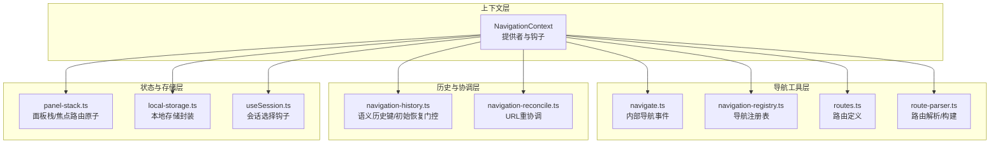
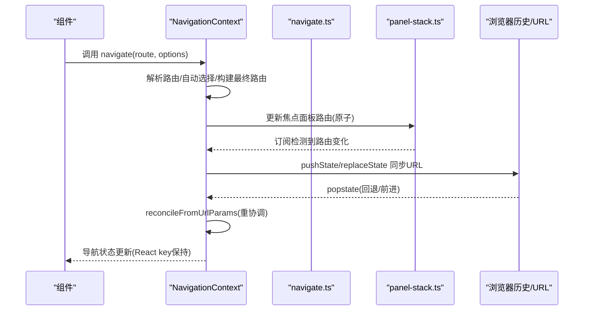
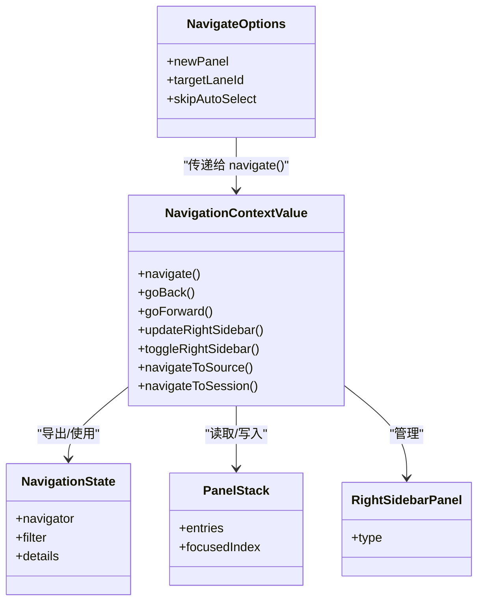
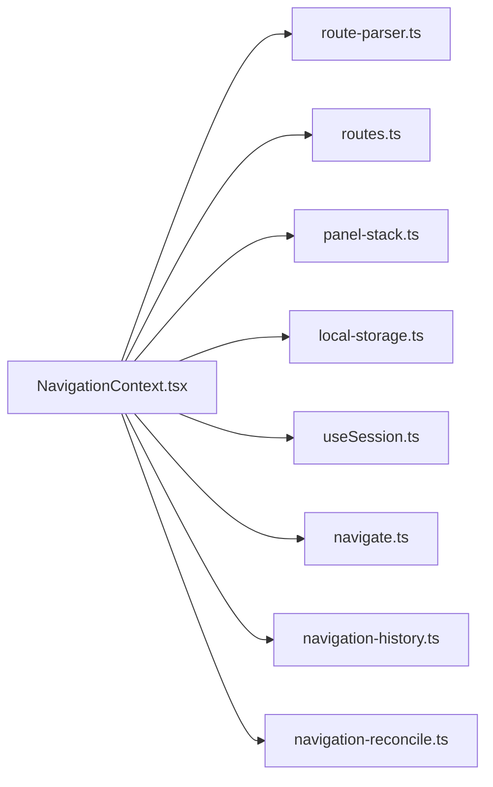

# 导航上下文

<cite>
**本文引用的文件**
- [NavigationContext.tsx](file://apps/electron/src/renderer/contexts/NavigationContext.tsx)
- [navigation-history.ts](file://apps/electron/src/renderer/contexts/navigation-history.ts)
- [navigation-reconcile.ts](file://apps/electron/src/renderer/contexts/navigation-reconcile.ts)
- [navigate.ts](file://apps/electron/src/renderer/lib/navigate.ts)
- [navigation-registry.ts](file://apps/electron/src/renderer/lib/navigation-registry.ts)
- [routes.ts](file://apps/electron/src/shared/routes.ts)
- [route-parser.ts](file://apps/electron/src/shared/route-parser.ts)
- [panel-stack.ts](file://apps/electron/src/renderer/atoms/panel-stack.ts)
- [useSession.ts](file://apps/electron/src/renderer/hooks/useSession.ts)
- [local-storage.ts](file://apps/electron/src/renderer/lib/local-storage.ts)
</cite>

## 目录
1. [简介](#简介)
2. [项目结构](#项目结构)
3. [核心组件](#核心组件)
4. [架构总览](#架构总览)
5. [详细组件分析](#详细组件分析)
6. [依赖关系分析](#依赖关系分析)
7. [性能考量](#性能考量)
8. [故障排查指南](#故障排查指南)
9. [结论](#结论)
10. [附录](#附录)

## 简介
本文件为 NavigationContext 的深度开发文档，系统阐述导航上下文在应用中的职责与实现：以“焦点面板驱动导航状态”的模型为核心，通过 URL 驱动的历史管理、路由状态同步、页面切换控制等能力，提供统一的导航入口与跨组件解耦方案。文档覆盖以下主题：
- 导航历史机制与浏览器原生回退/前进联动
- 路由状态解析与自动选择策略
- 前进后退与工作区切换的语义化处理
- 页面跳转、历史记录管理、前进后退操作
- 导航状态持久化与内存优化
- 用户体验与冲突解决策略
- 使用示例与最佳实践

## 项目结构
NavigationContext 所在的关键目录与文件如下：
- 上下文与提供者：apps/electron/src/renderer/contexts/NavigationContext.tsx
- 历史键构建与初始恢复门控：apps/electron/src/renderer/contexts/navigation-history.ts
- URL 重协调（自动选择）：apps/electron/src/renderer/contexts/navigation-reconcile.ts
- 内部导航事件与选项：apps/electron/src/renderer/lib/navigate.ts
- 导航注册表与状态类型：apps/electron/src/renderer/lib/navigation-registry.ts
- 路由与解析工具：apps/electron/src/shared/routes.ts、apps/electron/src/shared/route-parser.ts
- 面板栈与焦点路由原子：apps/electron/src/renderer/atoms/panel-stack.ts
- 会话选择钩子：apps/electron/src/renderer/hooks/useSession.ts
- 本地存储封装：apps/electron/src/renderer/lib/local-storage.ts

图表来源
- [NavigationContext.tsx:150-162](file://apps/electron/src/renderer/contexts/NavigationContext.tsx#L150-L162)
- [navigation-history.ts:15-45](file://apps/electron/src/renderer/contexts/navigation-history.ts#L15-L45)
- [navigation-reconcile.ts:7-29](file://apps/electron/src/renderer/contexts/navigation-reconcile.ts#L7-L29)
- [navigate.ts:21-50](file://apps/electron/src/renderer/lib/navigate.ts#L21-L50)
- [navigation-registry.ts:118-173](file://apps/electron/src/renderer/lib/navigation-registry.ts#L118-L173)
- [routes.ts](file://apps/electron/src/shared/routes.ts)
- [route-parser.ts](file://apps/electron/src/shared/route-parser.ts)
- [panel-stack.ts](file://apps/electron/src/renderer/atoms/panel-stack.ts)
- [useSession.ts:25-37](file://apps/electron/src/renderer/hooks/useSession.ts#L25-L37)
- [local-storage.ts](file://apps/electron/src/renderer/lib/local-storage.ts)

章节来源
- [NavigationContext.tsx:150-162](file://apps/electron/src/renderer/contexts/NavigationContext.tsx#L150-L162)
- [navigation-history.ts:1-46](file://apps/electron/src/renderer/contexts/navigation-history.ts#L1-L46)
- [navigation-reconcile.ts:1-30](file://apps/electron/src/renderer/contexts/navigation-reconcile.ts#L1-L30)
- [navigate.ts:1-51](file://apps/electron/src/renderer/lib/navigate.ts#L1-L51)
- [navigation-registry.ts:1-201](file://apps/electron/src/renderer/lib/navigation-registry.ts#L1-L201)
- [routes.ts](file://apps/electron/src/shared/routes.ts)
- [route-parser.ts](file://apps/electron/src/shared/route-parser.ts)
- [panel-stack.ts](file://apps/electron/src/renderer/atoms/panel-stack.ts)
- [useSession.ts:1-45](file://apps/electron/src/renderer/hooks/useSession.ts#L1-L45)
- [local-storage.ts](file://apps/electron/src/renderer/lib/local-storage.ts)

## 核心组件
- 导航上下文值接口：定义统一的导航 API，包括 navigate、goBack、goForward、updateRightSidebar、toggleRightSidebar、navigateToSource、navigateToSession 等。
- 提供者参数：支持工作区切换回调、会话创建、输入变更预填、草稿读取、空会话自动删除等扩展点。
- 导航状态：由“焦点面板路由 + 右侧边栏”合成，用于高亮侧边栏、驱动视图渲染。
- 历史管理：以 URL 为“事实来源”，通过 pushState/replaceState 同步历史；回退/前进由浏览器 popstate 驱动，配合智能面板重协调保持 React key 与滚动位置。

章节来源
- [NavigationContext.tsx:99-122](file://apps/electron/src/renderer/contexts/NavigationContext.tsx#L99-L122)
- [NavigationContext.tsx:126-148](file://apps/electron/src/renderer/contexts/NavigationContext.tsx#L126-L148)
- [NavigationContext.tsx:194-199](file://apps/electron/src/renderer/contexts/NavigationContext.tsx#L194-L199)
- [NavigationContext.tsx:205-234](file://apps/electron/src/renderer/contexts/NavigationContext.tsx#L205-L234)

## 架构总览
NavigationContext 将“路由定义、解析、构建”与“面板栈、焦点路由、右侧边栏”结合，形成“URL 驱动的历史 + 智能面板重协调”的导航体系。其关键流程：
- 组件调用 navigate 或内部事件触发，解析路由并执行动作或更新焦点面板路由。
- 焦点面板路由变化经订阅检测，按语义变化决定 pushState 或 replaceState，并持久化工作区 URL。
- 浏览器回退/前进触发 popstate，从 URL 重协调面板栈与右侧边栏，保持 React key 与状态。
- 工作区切换时，根据是否由 popstate 触发采用不同路径，确保 URL 与状态一致。

图表来源
- [NavigationContext.tsx:839-905](file://apps/electron/src/renderer/contexts/NavigationContext.tsx#L839-L905)
- [NavigationContext.tsx:346-387](file://apps/electron/src/renderer/contexts/NavigationContext.tsx#L346-L387)
- [NavigationContext.tsx:923-960](file://apps/electron/src/renderer/contexts/NavigationContext.tsx#L923-L960)
- [NavigationContext.tsx:397-466](file://apps/electron/src/renderer/contexts/NavigationContext.tsx#L397-L466)
- [navigate.ts:44-50](file://apps/electron/src/renderer/lib/navigate.ts#L44-L50)
- [panel-stack.ts](file://apps/electron/src/renderer/atoms/panel-stack.ts)

## 详细组件分析

### 导航上下文与提供者
- 导航 API：navigate、goBack、goForward、updateRightSidebar、toggleRightSidebar、navigateToSource、navigateToSession。
- 导航状态：由焦点面板路由解析出 NavigationState，并合并右侧边栏状态。
- 历史序列：维护当前/最大序列号，计算可回退/前进。
- URL 同步：根据面板栈、焦点索引、右侧边栏生成查询参数，pushState/replaceState 并持久化工作区 URL。
- 初始恢复：在应用就绪且会话元数据可用时，从当前 URL 重协调；若无 URL，则默认导航至会话列表。
- 工作区切换：区分 popstate 触发与 UI 触发，分别采用“仅重协调”和“替换 URL 并 pushState”。

章节来源
- [NavigationContext.tsx:99-122](file://apps/electron/src/renderer/contexts/NavigationContext.tsx#L99-L122)
- [NavigationContext.tsx:194-200](file://apps/electron/src/renderer/contexts/NavigationContext.tsx#L194-L200)
- [NavigationContext.tsx:256-320](file://apps/electron/src/renderer/contexts/NavigationContext.tsx#L256-L320)
- [NavigationContext.tsx:1029-1061](file://apps/electron/src/renderer/contexts/NavigationContext.tsx#L1029-L1061)
- [NavigationContext.tsx:968-1023](file://apps/electron/src/renderer/contexts/NavigationContext.tsx#L968-L1023)

### 导航历史与语义键
- 语义历史键：由工作区 slug、所有面板路由、焦点索引、右侧边栏参数组成，避免布局类变化（如比例）产生多余历史条目。
- 初始恢复门控：要求应用就绪、会话就绪、存在工作区 ID 且未执行过初始恢复，才允许执行。

章节来源
- [navigation-history.ts:21-33](file://apps/electron/src/renderer/contexts/navigation-history.ts#L21-L33)
- [navigation-history.ts:38-45](file://apps/electron/src/renderer/contexts/navigation-history.ts#L38-L45)

### URL 重协调与自动选择
- normalizePanelRouteForReconcile：对 URL 中的面板路由进行规范化，过滤列表路由时按自动选择策略升级为详情路由。
- reconcileFromUrlParams：解析 URL 参数，重建面板栈与右侧边栏，支持多面板与焦点索引，自动归一化比例。

章节来源
- [navigation-reconcile.ts:14-29](file://apps/electron/src/renderer/contexts/navigation-reconcile.ts#L14-L29)
- [NavigationContext.tsx:397-466](file://apps/electron/src/renderer/contexts/NavigationContext.tsx#L397-L466)

### 内部导航事件与选项
- navigate：派发自定义事件，统一内部导航入口，支持新面板打开与目标舱位指定。
- NavigateOptions：newPanel/targetLaneId/skipAutoSelect 等选项，影响面板打开策略与自动选择行为。

章节来源
- [navigate.ts:24-36](file://apps/electron/src/renderer/lib/navigate.ts#L24-L36)
- [navigate.ts:44-50](file://apps/electron/src/renderer/lib/navigate.ts#L44-L50)

### 路由解析与构建
- parseRoute/parseRouteToNavigationState/buildRouteFromNavigationState：将字符串路由转换为 NavigationState，再还原为路由字符串。
- routes：集中定义视图与动作路由，配合类型系统保证编译期安全。

章节来源
- [NavigationContext.tsx:43-49](file://apps/electron/src/renderer/contexts/NavigationContext.tsx#L43-L49)
- [routes.ts](file://apps/electron/src/shared/routes.ts)
- [route-parser.ts](file://apps/electron/src/shared/route-parser.ts)

### 面板栈与焦点路由
- panelStackAtom/focusedPanelRouteAtom：驱动导航状态与 URL 同步。
- reconcilePanelStackAtom：用于智能匹配与重协调，保留 React key，避免重复挂载。

章节来源
- [NavigationContext.tsx:77-85](file://apps/electron/src/renderer/contexts/NavigationContext.tsx#L77-L85)
- [NavigationContext.tsx:461-463](file://apps/electron/src/renderer/contexts/NavigationContext.tsx#L461-L463)

### 会话选择与持久化
- 会话选择同步：当导航进入会话详情时，同步全局会话选择，并持久化最近选中会话 ID。
- 自动清理空会话：离开可见面板时，若会话为空且无草稿则自动删除。

章节来源
- [NavigationContext.tsx:511-524](file://apps/electron/src/renderer/contexts/NavigationContext.tsx#L511-L524)
- [NavigationContext.tsx:481-504](file://apps/electron/src/renderer/contexts/NavigationContext.tsx#L481-L504)
- [useSession.ts:25-37](file://apps/electron/src/renderer/hooks/useSession.ts#L25-L37)

### 深度链接与内部事件监听
- deep link：接收来自 Electron 的深度链接导航，解析并调用 navigate。
- 内部导航事件：监听自定义事件，统一处理内部导航请求。

章节来源
- [NavigationContext.tsx:1091-1125](file://apps/electron/src/renderer/contexts/NavigationContext.tsx#L1091-L1125)
- [NavigationContext.tsx:1131-1144](file://apps/electron/src/renderer/contexts/NavigationContext.tsx#L1131-L1144)

### 类图：导航相关类型与关系

图表来源
- [navigation-registry.ts:196-201](file://apps/electron/src/renderer/lib/navigation-registry.ts#L196-L201)
- [NavigationContext.tsx:99-122](file://apps/electron/src/renderer/contexts/NavigationContext.tsx#L99-L122)
- [NavigationContext.tsx:24-38](file://apps/electron/src/renderer/contexts/NavigationContext.tsx#L24-L38)
- [navigate.ts:24-36](file://apps/electron/src/renderer/lib/navigate.ts#L24-L36)

## 依赖关系分析
- 上下文对解析器与路由的依赖：parseRoute、parseRouteToNavigationState、buildRouteFromNavigationState。
- 对面板栈原子的依赖：panelStackAtom、focusedPanelRouteAtom、reconcilePanelStackAtom。
- 对本地存储的依赖：工作区 URL 保存与最近选中会话 ID。
- 对会话选择钩子的依赖：全局会话选择同步。
- 对内部导航事件的依赖：统一的导航入口。

图表来源
- [NavigationContext.tsx:43-55](file://apps/electron/src/renderer/contexts/NavigationContext.tsx#L43-L55)
- [NavigationContext.tsx:77-85](file://apps/electron/src/renderer/contexts/NavigationContext.tsx#L77-L85)
- [NavigationContext.tsx:55-55](file://apps/electron/src/renderer/contexts/NavigationContext.tsx#L55-L55)
- [NavigationContext.tsx:167-169](file://apps/electron/src/renderer/contexts/NavigationContext.tsx#L167-L169)
- [NavigationContext.tsx:52-52](file://apps/electron/src/renderer/contexts/NavigationContext.tsx#L52-L52)
- [NavigationContext.tsx:21-21](file://apps/electron/src/renderer/contexts/NavigationContext.tsx#L21-L21)
- [NavigationContext.tsx:24-24](file://apps/electron/src/renderer/contexts/NavigationContext.tsx#L24-L24)
- [NavigationContext.tsx:241-251](file://apps/electron/src/renderer/contexts/NavigationContext.tsx#L241-L251)
- [NavigationContext.tsx:325-331](file://apps/electron/src/renderer/contexts/NavigationContext.tsx#L325-L331)

章节来源
- [NavigationContext.tsx:43-85](file://apps/electron/src/renderer/contexts/NavigationContext.tsx#L43-L85)
- [NavigationContext.tsx:55-55](file://apps/electron/src/renderer/contexts/NavigationContext.tsx#L55-L55)
- [NavigationContext.tsx:167-169](file://apps/electron/src/renderer/contexts/NavigationContext.tsx#L167-L169)
- [NavigationContext.tsx:21-24](file://apps/electron/src/renderer/contexts/NavigationContext.tsx#L21-L24)
- [NavigationContext.tsx:241-251](file://apps/electron/src/renderer/contexts/NavigationContext.tsx#L241-L251)
- [NavigationContext.tsx:325-331](file://apps/electron/src/renderer/contexts/NavigationContext.tsx#L325-L331)

## 性能考量
- 历史去重：通过语义历史键避免布局类变化导致的冗余历史条目，减少历史膨胀。
- 微任务合并：对面板栈与焦点变化的 pushState 进行微任务合并，降低频繁 pushState 的开销。
- 智能重协调：popstate 时抑制 pushState，使用 reconcilePanelStackAtom 保持 React key，避免重复挂载带来的性能损耗。
- 本地存储：仅持久化工作区 URL 与最近选中会话 ID，避免大对象存储。
- 自动选择抑制：在关闭面板等场景使用 skipAutoSelect，避免不必要的导航与渲染。

章节来源
- [navigation-history.ts:21-33](file://apps/electron/src/renderer/contexts/navigation-history.ts#L21-L33)
- [NavigationContext.tsx:218-218](file://apps/electron/src/renderer/contexts/NavigationContext.tsx#L218-L218)
- [NavigationContext.tsx:346-387](file://apps/electron/src/renderer/contexts/NavigationContext.tsx#L346-L387)
- [NavigationContext.tsx:950-955](file://apps/electron/src/renderer/contexts/NavigationContext.tsx#L950-L955)
- [NavigationContext.tsx:885-887](file://apps/electron/src/renderer/contexts/NavigationContext.tsx#L885-L887)

## 故障排查指南
- 导航无效或无反应
  - 检查 isReady 是否为真；未就绪时导航会被队列等待。
  - 确认路由字符串有效，解析失败会直接返回。
- 回退/前进异常
  - 确保 popstate 处理正确设置历史序列号并触发重协调。
  - 若会话元数据未就绪，popstate 会直接返回，待就绪后再重协调。
- 工作区切换问题
  - popstate 触发：URL 已正确，仅需重协调。
  - UI 触发：需要从本地存储读取工作区 URL 或默认导航到会话列表，并 pushState。
- 右侧边栏不生效
  - 确认 updateRightSidebar/toggleRightSidebar 的调用时机与参数。
  - 右侧边栏变化会触发 URL 同步，检查是否被抑制（如重协调期间）。
- 自动选择不符合预期
  - 使用 skipAutoSelect 选项避免自动选择。
  - 检查工作区与远程工作区 ID 匹配逻辑，确保会话属于当前工作区。

章节来源
- [NavigationContext.tsx:852-855](file://apps/electron/src/renderer/contexts/NavigationContext.tsx#L852-L855)
- [NavigationContext.tsx:846-850](file://apps/electron/src/renderer/contexts/NavigationContext.tsx#L846-L850)
- [NavigationContext.tsx:923-960](file://apps/electron/src/renderer/contexts/NavigationContext.tsx#L923-L960)
- [NavigationContext.tsx:943-947](file://apps/electron/src/renderer/contexts/NavigationContext.tsx#L943-L947)
- [NavigationContext.tsx:934-941](file://apps/electron/src/renderer/contexts/NavigationContext.tsx#L934-L941)
- [NavigationContext.tsx:1150-1161](file://apps/electron/src/renderer/contexts/NavigationContext.tsx#L1150-L1161)
- [NavigationContext.tsx:980-1022](file://apps/electron/src/renderer/contexts/NavigationContext.tsx#L980-L1022)
- [NavigationContext.tsx:1150-1161](file://apps/electron/src/renderer/contexts/NavigationContext.tsx#L1150-L1161)
- [NavigationContext.tsx:616-662](file://apps/electron/src/renderer/contexts/NavigationContext.tsx#L616-L662)

## 结论
NavigationContext 通过“URL 驱动的历史 + 智能面板重协调”实现了稳定、可恢复、可扩展的导航体系。它将路由解析、面板栈管理、右侧边栏控制、工作区切换与历史同步整合为统一入口，既保证了用户体验（前进后退、状态恢复、滚动位置保持），又兼顾了性能与可维护性。建议在新增导航功能时遵循现有模式：使用统一的路由定义与解析、通过 navigate 发起导航、利用自动选择与重协调策略提升一致性。

## 附录

### 使用示例与最佳实践
- 统一导航入口
  - 使用内部导航函数 navigate 发起跳转，避免直接操作路由或面板栈。
  - 示例路径：[navigate 调用:839-905](file://apps/electron/src/renderer/contexts/NavigationContext.tsx#L839-L905)
- 新面板打开
  - 使用 newPanel 选项在新面板中打开目标路由，必要时指定 targetLaneId。
  - 示例路径：[新面板打开:869-876](file://apps/electron/src/renderer/contexts/NavigationContext.tsx#L869-L876)
- 保持过滤条件
  - 使用 navigateToSession/navigateToSource 在当前过滤条件下跳转到指定项。
  - 示例路径：[保持过滤条件跳转:1184-1213](file://apps/electron/src/renderer/contexts/NavigationContext.tsx#L1184-L1213)
- 自动选择与抑制
  - 关闭面板等场景使用 skipAutoSelect 抑制自动选择，避免误触。
  - 示例路径：[自动选择抑制:885-887](file://apps/electron/src/renderer/contexts/NavigationContext.tsx#L885-L887)
- 历史与状态恢复
  - 刷新页面或重新加载时，初始恢复会从 URL 重协调；若无 URL 则默认导航到会话列表。
  - 示例路径：[初始恢复:1029-1061](file://apps/electron/src/renderer/contexts/NavigationContext.tsx#L1029-L1061)
- 工作区切换
  - popstate 触发：仅重协调；UI 触发：读取本地存储或默认导航并 pushState。
  - 示例路径：[工作区切换:968-1023](file://apps/electron/src/renderer/contexts/NavigationContext.tsx#L968-L1023)