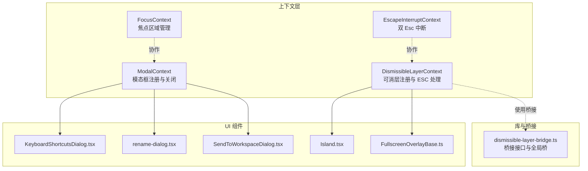
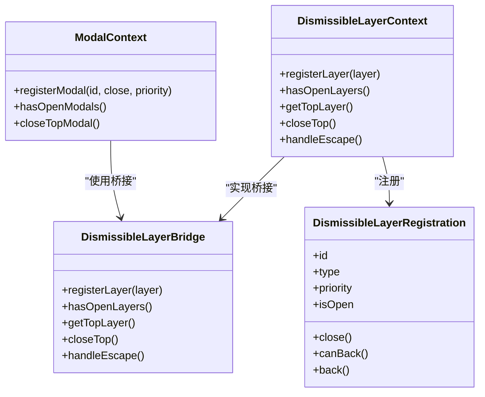
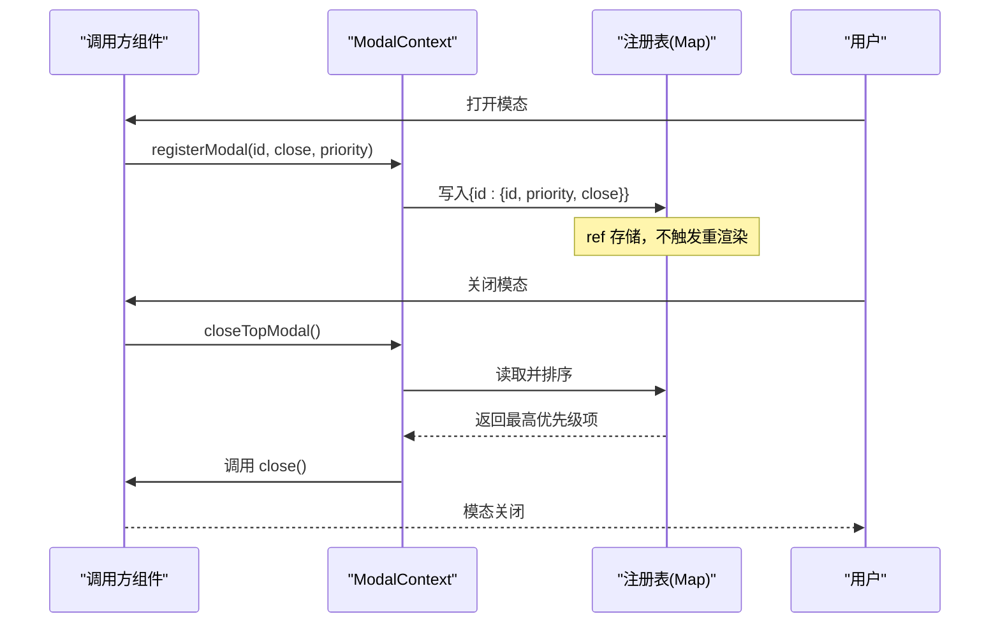
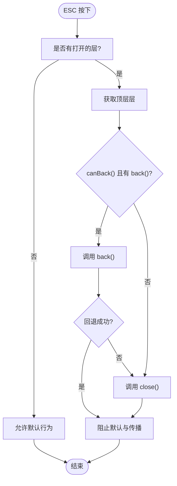
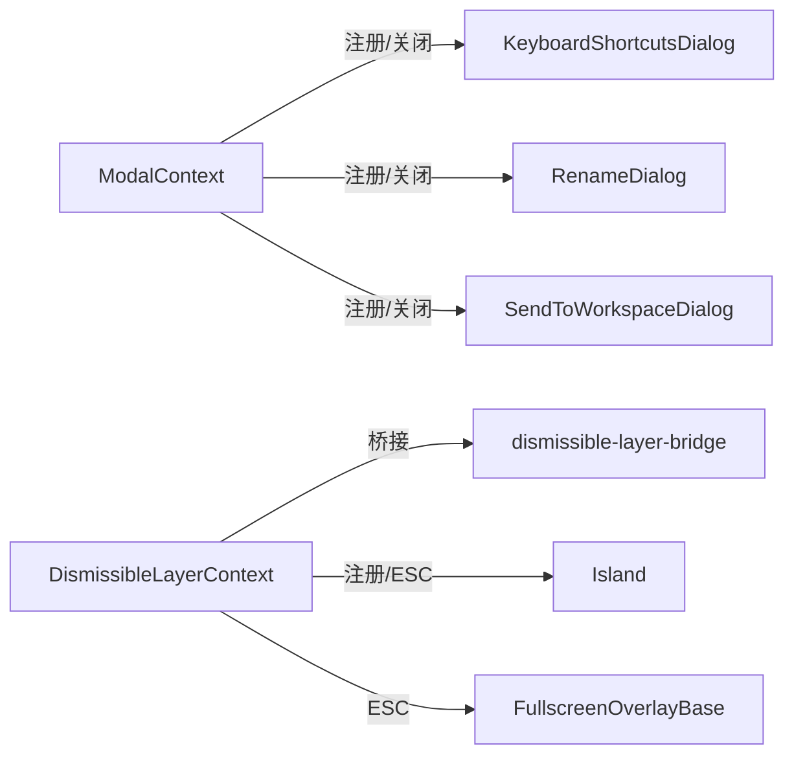

# 模态框上下文

<cite>
**本文引用的文件**
- [ModalContext.tsx](file://apps/electron/src/renderer/context/ModalContext.tsx)
- [DismissibleLayerContext.tsx](file://apps/electron/src/renderer/context/DismissibleLayerContext.tsx)
- [dismissible-layer-bridge.ts](file://apps/electron/src/renderer/lib/dismissible-layer-bridge.ts)
- [FocusContext.tsx](file://apps/electron/src/renderer/context/FocusContext.tsx)
- [EscapeInterruptContext.tsx](file://apps/electron/src/renderer/context/EscapeInterruptContext.tsx)
- [KeyboardShortcutsDialog.tsx](file://apps/electron/src/renderer/components/KeyboardShortcutsDialog.tsx)
- [rename-dialog.tsx](file://apps/electron/src/renderer/components/ui/rename-dialog.tsx)
- [SendToWorkspaceDialog.tsx](file://apps/electron/src/renderer/components/app-shell/SendToWorkspaceDialog.tsx)
- [Island.tsx](file://packages/ui/src/components/ui/Island.tsx)
- [FullscreenOverlayBase.ts](file://packages/ui/src/components/overlay/FullscreenOverlayBase.ts)
- [AppShell.tsx](file://apps/electron/src/renderer/components/app-shell/AppShell.tsx)
</cite>

## 目录
1. [简介](#简介)
2. [项目结构](#项目结构)
3. [核心组件](#核心组件)
4. [架构总览](#架构总览)
5. [详细组件分析](#详细组件分析)
6. [依赖关系分析](#依赖关系分析)
7. [性能考量](#性能考量)
8. [故障排查指南](#故障排查指南)
9. [结论](#结论)
10. [附录：使用示例与设计模式](#附录使用示例与设计模式)

## 简介
本文件围绕 ModalContext（模态框上下文）进行系统化技术文档编写，重点阐述以下方面：
- 模态框状态管理：注册、注销、查询、关闭顶层模态
- 层级控制与优先级：通过优先级排序决定关闭顺序
- 焦点管理：与全局焦点上下文协作，确保键盘导航与可访问性
- 键盘事件处理：Esc 关闭、双 Esc 中断等
- 背景遮罩与点击外部关闭：结合 DismissibleLayerContext 的通用层叠体系
- 可访问性与性能优化：避免不必要的重渲染、合理聚焦与事件冒泡
- 嵌套模态框处理：通过统一的“可消层”桥接机制协调多层 UI

## 项目结构
ModalContext 位于渲染器端上下文目录，配合 DismissibleLayerContext 提供跨组件的“可消层”抽象；同时与 FocusContext、EscapeInterruptContext 协同，保证键盘交互与可访问性。

图表来源
- [ModalContext.tsx:1-112](file://apps/electron/src/renderer/context/ModalContext.tsx#L1-L112)
- [DismissibleLayerContext.tsx:1-145](file://apps/electron/src/renderer/context/DismissibleLayerContext.tsx#L1-L145)
- [dismissible-layer-bridge.ts:1-44](file://apps/electron/src/renderer/lib/dismissible-layer-bridge.ts#L1-L44)
- [FocusContext.tsx:1-165](file://apps/electron/src/renderer/context/FocusContext.tsx#L1-L165)
- [EscapeInterruptContext.tsx:1-97](file://apps/electron/src/renderer/context/EscapeInterruptContext.tsx#L1-L97)
- [KeyboardShortcutsDialog.tsx:146-178](file://apps/electron/src/renderer/components/KeyboardShortcutsDialog.tsx#L146-L178)
- [rename-dialog.tsx:24-87](file://apps/electron/src/renderer/components/ui/rename-dialog.tsx#L24-L87)
- [SendToWorkspaceDialog.tsx:45-178](file://apps/electron/src/renderer/components/app-shell/SendToWorkspaceDialog.tsx#L45-L178)
- [Island.tsx:507-570](file://packages/ui/src/components/ui/Island.tsx#L507-L570)
- [FullscreenOverlayBase.ts](file://packages/ui/src/components/overlay/FullscreenOverlayBase.ts)

章节来源
- [ModalContext.tsx:1-112](file://apps/electron/src/renderer/context/ModalContext.tsx#L1-L112)
- [DismissibleLayerContext.tsx:1-145](file://apps/electron/src/renderer/context/DismissibleLayerContext.tsx#L1-L145)
- [dismissible-layer-bridge.ts:1-44](file://apps/electron/src/renderer/lib/dismissible-layer-bridge.ts#L1-L44)

## 核心组件
- ModalContext：提供模态框注册、查询与关闭顶层的能力，内部以 ref 存储注册表，避免状态变更导致的无谓重渲染。
- DismissibleLayerContext：提供“可消层”注册与 ESC 处理，支持优先级与回退逻辑，统一桥接至全局桥。
- dismissible-layer-bridge：定义可消层桥接接口与全局桥设置/获取方法。
- FocusContext：管理焦点区域与意图，与模态框交互时保持可访问性。
- EscapeInterruptContext：提供双 Esc 中断流程，避免误操作。

章节来源
- [ModalContext.tsx:18-83](file://apps/electron/src/renderer/context/ModalContext.tsx#L18-L83)
- [DismissibleLayerContext.tsx:15-134](file://apps/electron/src/renderer/context/DismissibleLayerContext.tsx#L15-L134)
- [dismissible-layer-bridge.ts:19-43](file://apps/electron/src/renderer/lib/dismissible-layer-bridge.ts#L19-L43)
- [FocusContext.tsx:46-164](file://apps/electron/src/renderer/context/FocusContext.tsx#L46-L164)
- [EscapeInterruptContext.tsx:14-96](file://apps/electron/src/renderer/context/EscapeInterruptContext.tsx#L14-L96)

## 架构总览
ModalContext 与 DismissibleLayerContext 共同构成“可消层”体系：
- ModalContext 面向“模态对话框”，提供最小必要 API（注册、查询、关闭顶层）
- DismissibleLayerContext 面向更广泛的“可消层”（如弹出层、气泡、全屏覆盖），统一 ESC 行为与层级管理
- 两者均通过 dismissible-layer-bridge 进行桥接，确保跨包复用与一致性

图表来源
- [ModalContext.tsx:18-83](file://apps/electron/src/renderer/context/ModalContext.tsx#L18-L83)
- [DismissibleLayerContext.tsx:15-94](file://apps/electron/src/renderer/context/DismissibleLayerContext.tsx#L15-L94)
- [dismissible-layer-bridge.ts:19-25](file://apps/electron/src/renderer/lib/dismissible-layer-bridge.ts#L19-L25)

## 详细组件分析

### ModalContext：模态框注册与关闭
- 注册机制：组件在打开时调用注册函数，返回清理函数用于卸载时注销
- 查询与关闭：提供查询是否仍有打开的模态与关闭顶层模态的方法
- 性能策略：使用 ref 存储注册表，避免状态变化引发的重渲染
- 优先级：关闭时按优先级降序选择顶层模态

图表来源
- [ModalContext.tsx:32-72](file://apps/electron/src/renderer/context/ModalContext.tsx#L32-L72)

章节来源
- [ModalContext.tsx:18-112](file://apps/electron/src/renderer/context/ModalContext.tsx#L18-L112)

### DismissibleLayerContext：可消层注册与 ESC 处理
- 注册：接收层注册对象，生成唯一顺序号，存入映射表
- 排序与关闭：按优先级与顺序排序，关闭顶层层
- ESC 处理：优先尝试回退，否则直接关闭；未处理时允许默认行为
- 键盘监听：在提供者挂载时注册 ESC 监听，阻止默认行为并停止传播

图表来源
- [DismissibleLayerContext.tsx:74-85](file://apps/electron/src/renderer/context/DismissibleLayerContext.tsx#L74-L85)

章节来源
- [DismissibleLayerContext.tsx:15-145](file://apps/electron/src/renderer/context/DismissibleLayerContext.tsx#L15-L145)

### dismissible-layer-bridge：桥接接口与全局桥
- 定义可消层注册、查询、关闭与 ESC 处理的统一接口
- 提供全局桥设置/获取方法，便于跨包共享同一桥接实例

章节来源
- [dismissible-layer-bridge.ts:1-44](file://apps/electron/src/renderer/lib/dismissible-layer-bridge.ts#L1-L44)

### 与焦点管理的协作
- FocusContext 提供区域注册、切换与 DOM 焦点移动能力
- 在模态框打开时，可通过焦点上下文确保键盘导航与自动聚焦符合预期
- 避免自动聚焦带来的级联重渲染，仅在显式意图时移动 DOM 焦点

章节来源
- [FocusContext.tsx:46-165](file://apps/electron/src/renderer/context/FocusContext.tsx#L46-L165)

### 双 Esc 中断流程
- EscapeInterruptContext 提供首次 Esc 显示覆盖层、二次 Esc 在时间窗内中断的功能
- 与 ESC 处理协同，避免误关重要对话框

章节来源
- [EscapeInterruptContext.tsx:14-96](file://apps/electron/src/renderer/context/EscapeInterruptContext.tsx#L14-L96)

## 依赖关系分析
- ModalContext 依赖 React 上下文与 ref，内部不依赖外部桥接
- DismissibleLayerContext 依赖 dismissible-layer-bridge，并在提供者生命周期中设置全局桥
- UI 组件通过 useRegisterModal 或 useRegisterDismissibleLayer 与上下文交互
- Island 作为 UI 组件，通过桥接注册为可消层，参与 ESC 与层级管理

图表来源
- [ModalContext.tsx:101-112](file://apps/electron/src/renderer/context/ModalContext.tsx#L101-L112)
- [DismissibleLayerContext.tsx:96-126](file://apps/electron/src/renderer/context/DismissibleLayerContext.tsx#L96-L126)
- [dismissible-layer-bridge.ts:37-43](file://apps/electron/src/renderer/lib/dismissible-layer-bridge.ts#L37-L43)
- [KeyboardShortcutsDialog.tsx:146-178](file://apps/electron/src/renderer/components/KeyboardShortcutsDialog.tsx#L146-L178)
- [rename-dialog.tsx:24-87](file://apps/electron/src/renderer/components/ui/rename-dialog.tsx#L24-L87)
- [SendToWorkspaceDialog.tsx:45-178](file://apps/electron/src/renderer/components/app-shell/SendToWorkspaceDialog.tsx#L45-L178)
- [Island.tsx:507-570](file://packages/ui/src/components/ui/Island.tsx#L507-L570)
- [FullscreenOverlayBase.ts](file://packages/ui/src/components/overlay/FullscreenOverlayBase.ts)

章节来源
- [AppShell.tsx:80-87](file://apps/electron/src/renderer/components/app-shell/AppShell.tsx#L80-L87)

## 性能考量
- 使用 ref 存储注册表，避免状态变更导致的重渲染
- ESC 监听仅在提供者挂载时注册，卸载时移除，减少全局事件开销
- 顶层关闭采用一次排序与取首元素，复杂度 O(n log n)，n 为打开层数
- 自动聚焦仅在明确意图时执行，避免不必要的 DOM 操作

## 故障排查指南
- useModalRegistry 必须在 ModalProvider 内部使用，否则会抛出错误
- useDismissibleLayerRegistry 同理，必须在 DismissibleLayerProvider 内部使用
- ESC 不生效：检查是否正确设置了全局桥，以及是否被上层控件拦截
- 焦点异常：确认焦点区域已注册，且仅在键盘意图时移动 DOM 焦点

章节来源
- [ModalContext.tsx:77-83](file://apps/electron/src/renderer/context/ModalContext.tsx#L77-L83)
- [DismissibleLayerContext.tsx:128-134](file://apps/electron/src/renderer/context/DismissibleLayerContext.tsx#L128-L134)

## 结论
ModalContext 与 DismissibleLayerContext 共同构建了统一的“可消层”体系，既满足模态框的最小需求，又为更复杂的弹出层提供一致的 ESC 与层级管理。通过桥接与上下文协作，系统在可访问性、性能与扩展性之间取得平衡。

## 附录：使用示例与设计模式

### 使用示例
- 在对话框组件中注册模态框，使其支持 X 按钮与 Cmd+W 关闭：
  - [KeyboardShortcutsDialog.tsx:146-178](file://apps/electron/src/renderer/components/KeyboardShortcutsDialog.tsx#L146-L178)
  - [rename-dialog.tsx:24-87](file://apps/electron/src/renderer/components/ui/rename-dialog.tsx#L24-L87)
  - [SendToWorkspaceDialog.tsx:45-178](file://apps/electron/src/renderer/components/app-shell/SendToWorkspaceDialog.tsx#L45-L178)

- 将 UI 组件注册为可消层（如 Island），参与 ESC 与层级管理：
  - [Island.tsx:507-570](file://packages/ui/src/components/ui/Island.tsx#L507-L570)

### 设计模式
- 注册/注销模式：组件在打开时注册，卸载时自动注销，避免泄漏
- 优先级策略：高层级优先关闭，适用于嵌套模态与覆盖层
- ESC 分发模式：顶层提供者集中处理 ESC，子层可回退或直接关闭
- 桥接模式：通过全局桥实现跨包共享，降低耦合