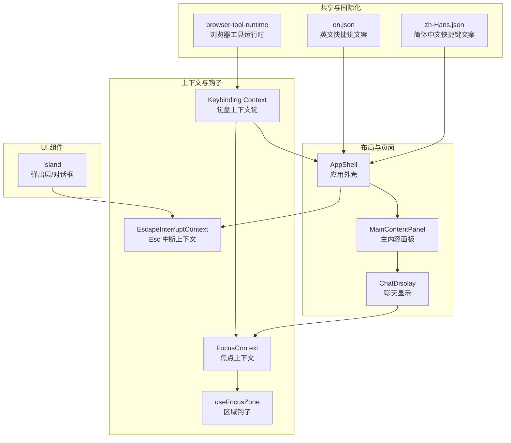
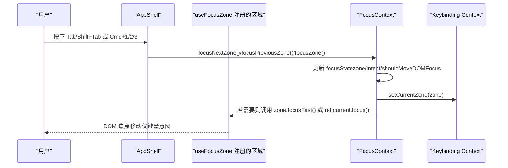
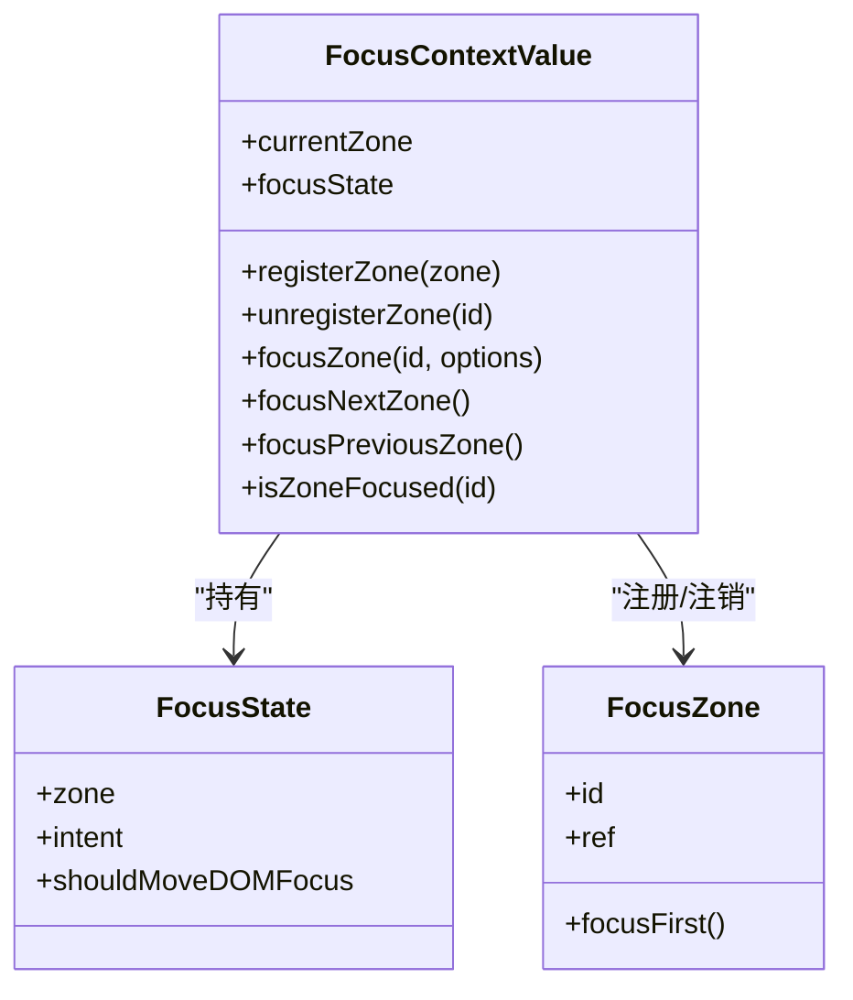
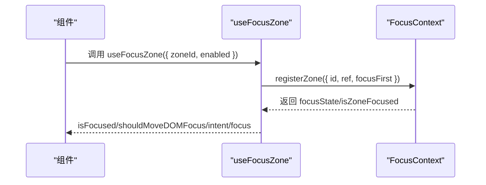
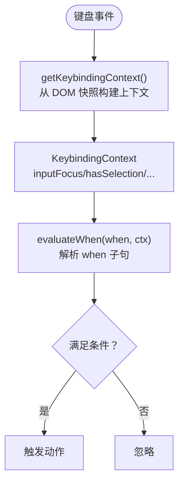
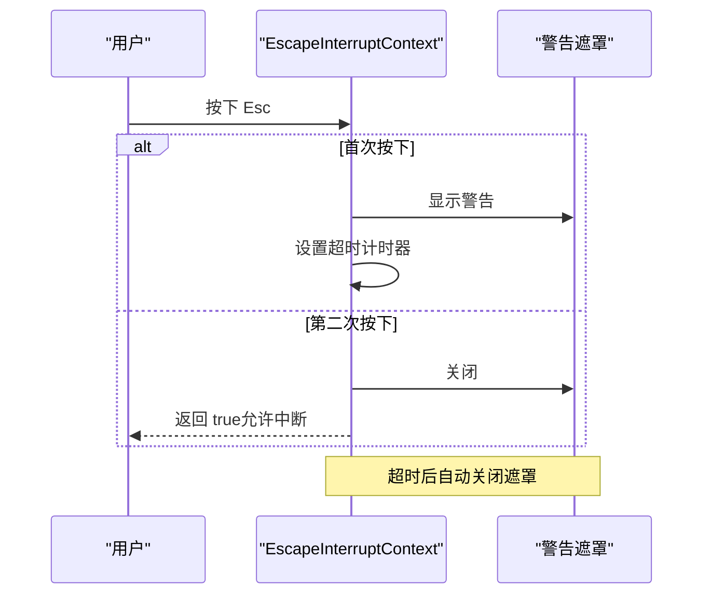
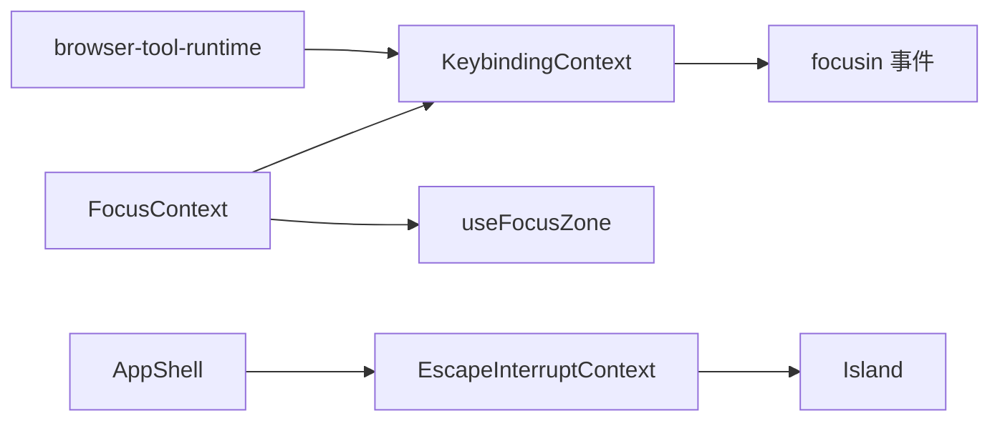

# 焦点上下文

<cite>
**本文引用的文件**
- [FocusContext.tsx](file://apps/electron/src/renderer/context/FocusContext.tsx)
- [EscapeInterruptContext.tsx](file://apps/electron/src/renderer/context/EscapeInterruptContext.tsx)
- [keybinding-context.ts](file://apps/electron/src/renderer/actions/keybinding-context.ts)
- [useFocusZone.ts](file://apps/electron/src/renderer/hooks/keyboard/useFocusZone.ts)
- [AppShell.tsx](file://apps/electron/src/renderer/components/app-shell/AppShell.tsx)
- [MainContentPanel.tsx](file://apps/electron/src/renderer/components/app-shell/MainContentPanel.tsx)
- [ChatDisplay.tsx](file://apps/electron/src/renderer/components/app-shell/ChatDisplay.tsx)
- [Island.tsx](file://packages/ui/src/components/ui/Island.tsx)
- [browser-tool-runtime.ts](file://packages/shared/src/agent/browser-tool-runtime.ts)
- [zh-Hans.json](file://packages/shared/src/i18n/locales/zh-Hans.json)
- [en.json](file://packages/shared/src/i18n/locales/en.json)
</cite>

## 目录
1. [简介](#简介)
2. [项目结构](#项目结构)
3. [核心组件](#核心组件)
4. [架构总览](#架构总览)
5. [详细组件分析](#详细组件分析)
6. [依赖关系分析](#依赖关系分析)
7. [性能考量](#性能考量)
8. [故障排查指南](#故障排查指南)
9. [结论](#结论)
10. [附录：实现示例与无障碍最佳实践](#附录实现示例与无障碍最佳实践)

## 简介
本文件围绕 FocusContext（焦点上下文）与 EscapeInterruptContext（Esc 中断上下文）进行系统化技术文档编写，覆盖以下主题：
- 焦点管理：区域化焦点分区、键盘导航、焦点意图传递、DOM 焦点移动策略
- 可访问性支持：键盘上下文键（Keybinding Context）、当子句评估、输入选择检测
- Esc 中断流程：双击 Esc 警告与中断、超时自动关闭、焦点恢复
- 实现示例与无障碍最佳实践：如何在组件中注册/聚焦区域、如何结合键盘快捷键、如何与屏幕阅读器协同

## 项目结构
FocusContext 与相关能力位于渲染进程的上下文与钩子层，配合键盘绑定上下文与 AppShell 布局共同构成焦点体系。

图表来源
- [FocusContext.tsx:67-156](file://apps/electron/src/renderer/context/FocusContext.tsx#L67-L156)
- [EscapeInterruptContext.tsx:28-88](file://apps/electron/src/renderer/context/EscapeInterruptContext.tsx#L28-L88)
- [keybinding-context.ts:68-104](file://apps/electron/src/renderer/actions/keybinding-context.ts#L68-L104)
- [useFocusZone.ts:34-96](file://apps/electron/src/renderer/hooks/keyboard/useFocusZone.ts#L34-L96)
- [AppShell.tsx:483-490](file://apps/electron/src/renderer/components/app-shell/AppShell.tsx#L483-L490)
- [MainContentPanel.tsx:358-394](file://apps/electron/src/renderer/components/app-shell/MainContentPanel.tsx#L358-L394)
- [ChatDisplay.tsx:42-66](file://apps/electron/src/renderer/components/app-shell/ChatDisplay.tsx#L42-L66)
- [Island.tsx:119-133](file://packages/ui/src/components/ui/Island.tsx#L119-L133)
- [browser-tool-runtime.ts:222-239](file://packages/shared/src/agent/browser-tool-runtime.ts#L222-L239)
- [zh-Hans.json:1060-1086](file://packages/shared/src/i18n/locales/zh-Hans.json#L1060-L1086)
- [en.json:1062-1089](file://packages/shared/src/i18n/locales/en.json#L1062-L1089)

章节来源
- [FocusContext.tsx:1-165](file://apps/electron/src/renderer/context/FocusContext.tsx#L1-L165)
- [EscapeInterruptContext.tsx:1-97](file://apps/electron/src/renderer/context/EscapeInterruptContext.tsx#L1-L97)
- [keybinding-context.ts:1-145](file://apps/electron/src/renderer/actions/keybinding-context.ts#L1-L145)
- [useFocusZone.ts:1-97](file://apps/electron/src/renderer/hooks/keyboard/useFocusZone.ts#L1-L97)
- [AppShell.tsx:483-490](file://apps/electron/src/renderer/components/app-shell/AppShell.tsx#L483-L490)
- [MainContentPanel.tsx:358-394](file://apps/electron/src/renderer/components/app-shell/MainContentPanel.tsx#L358-L394)
- [ChatDisplay.tsx:42-66](file://apps/electron/src/renderer/components/app-shell/ChatDisplay.tsx#L42-L66)
- [Island.tsx:119-133](file://packages/ui/src/components/ui/Island.tsx#L119-L133)
- [browser-tool-runtime.ts:222-239](file://packages/shared/src/agent/browser-tool-runtime.ts#L222-L239)
- [zh-Hans.json:1060-1086](file://packages/shared/src/i18n/locales/zh-Hans.json#L1060-L1086)
- [en.json:1062-1089](file://packages/shared/src/i18n/locales/en.json#L1062-L1089)

## 核心组件
- FocusContext：提供区域化焦点状态、注册/注销区域、显式聚焦、前后区域切换、DOM 焦点移动控制与键盘上下文同步。
- EscapeInterruptContext：提供双击 Esc 警告与中断流程、超时自动关闭、遮罩展示控制。
- Keybinding Context：从 DOM 快照生成上下文键，供 when 子句评估，联动 FocusContext 的当前区域。
- useFocusZone：在组件内注册区域、暴露 isFocused/shouldMoveDOMFocus/intent，并在挂载时为容器设置 data-focus-zone 属性。
- AppShell/MainContentPanel/ChatDisplay：布局与页面容器，承载焦点区域并消费焦点上下文与键盘上下文。

章节来源
- [FocusContext.tsx:67-156](file://apps/electron/src/renderer/context/FocusContext.tsx#L67-L156)
- [EscapeInterruptContext.tsx:28-88](file://apps/electron/src/renderer/context/EscapeInterruptContext.tsx#L28-L88)
- [keybinding-context.ts:68-104](file://apps/electron/src/renderer/actions/keybinding-context.ts#L68-L104)
- [useFocusZone.ts:34-96](file://apps/electron/src/renderer/hooks/keyboard/useFocusZone.ts#L34-L96)
- [AppShell.tsx:483-490](file://apps/electron/src/renderer/components/app-shell/AppShell.tsx#L483-L490)
- [MainContentPanel.tsx:358-394](file://apps/electron/src/renderer/components/app-shell/MainContentPanel.tsx#L358-L394)
- [ChatDisplay.tsx:42-66](file://apps/electron/src/renderer/components/app-shell/ChatDisplay.tsx#L42-L66)

## 架构总览
焦点上下文通过“区域”维度组织，结合键盘上下文键与 DOM 事件，形成可预测的键盘导航与可访问性支持。

图表来源
- [useFocusZone.ts:85-87](file://apps/electron/src/renderer/hooks/keyboard/useFocusZone.ts#L85-L87)
- [FocusContext.tsx:116-128](file://apps/electron/src/renderer/context/FocusContext.tsx#L116-L128)
- [keybinding-context.ts:43-45](file://apps/electron/src/renderer/actions/keybinding-context.ts#L43-L45)

## 详细组件分析

### FocusContext：焦点状态与区域管理
- 区域标识与顺序：sidebar → navigator → chat，Tab/Shift+Tab 循环切换。
- 焦点意图（FocusIntent）：keyboard/click/programmatic，决定是否移动 DOM 焦点。
- 默认行为：键盘与程序化聚焦移动 DOM；点击不移动 DOM，避免打断用户操作。
- DOM 焦点移动：仅在 shouldMoveDOMFocus 为真时执行，且在 setTimeout(0) 后重置，防止副作用重复触发。
- 与键盘上下文联动：setCurrentZone 同步当前区域，供 when 子句评估。

图表来源
- [FocusContext.tsx:46-63](file://apps/electron/src/renderer/context/FocusContext.tsx#L46-L63)
- [FocusContext.tsx:67-156](file://apps/electron/src/renderer/context/FocusContext.tsx#L67-L156)

章节来源
- [FocusContext.tsx:67-156](file://apps/electron/src/renderer/context/FocusContext.tsx#L67-L156)

### useFocusZone：区域注册与状态暴露
- 在挂载时向 FocusContext 注册区域，并为容器设置 data-focus-zone 属性，便于 DOM 焦点事件识别。
- 暴露 isFocused、shouldMoveDOMFocus、intent，以及 focus 方法用于程序化聚焦。
- 通过 enabled 控制是否参与注册，适合多实例共享逻辑区域的场景。

图表来源
- [useFocusZone.ts:34-96](file://apps/electron/src/renderer/hooks/keyboard/useFocusZone.ts#L34-L96)
- [FocusContext.tsx:75-81](file://apps/electron/src/renderer/context/FocusContext.tsx#L75-L81)

章节来源
- [useFocusZone.ts:34-96](file://apps/electron/src/renderer/hooks/keyboard/useFocusZone.ts#L34-L96)

### 键盘上下文与 when 子句：可访问性与快捷键
- Keybinding Context 提供 inputFocus、hasSelection、chatFocus、navigatorFocus、sidebarFocus、menuOpen 等布尔上下文键。
- getKeybindingContext 从 DOM 快照读取，模块级 _currentZone 由 FocusContext 同步。
- evaluateWhen 支持未定义（总是真）、取反、与/或组合，用于动作注册表的 when 子句评估。

图表来源
- [keybinding-context.ts:68-104](file://apps/electron/src/renderer/actions/keybinding-context.ts#L68-L104)
- [keybinding-context.ts:125-144](file://apps/electron/src/renderer/actions/keybinding-context.ts#L125-L144)
- [FocusContext.tsx:97-98](file://apps/electron/src/renderer/context/FocusContext.tsx#L97-L98)

章节来源
- [keybinding-context.ts:1-145](file://apps/electron/src/renderer/actions/keybinding-context.ts#L1-L145)

### EscapeInterruptContext：Esc 中断与焦点恢复
- 双击 Esc 流程：首次按下显示警告遮罩；在超时窗口内再次按下 Esc 触发中断；超时自动关闭遮罩。
- 提供 handleEscapePress（返回是否应继续中断）、dismissOverlay（手动关闭）等方法。
- 与 Island 对话行为协作：Island.handleIslandEscape 根据 back-or-close/close 行为决定回退或关闭。

图表来源
- [EscapeInterruptContext.tsx:54-76](file://apps/electron/src/renderer/context/EscapeInterruptContext.tsx#L54-L76)
- [EscapeInterruptContext.tsx:28-88](file://apps/electron/src/renderer/context/EscapeInterruptContext.tsx#L28-L88)
- [Island.tsx:119-133](file://packages/ui/src/components/ui/Island.tsx#L119-L133)

章节来源
- [EscapeInterruptContext.tsx:1-97](file://apps/electron/src/renderer/context/EscapeInterruptContext.tsx#L1-L97)
- [Island.tsx:119-133](file://packages/ui/src/components/ui/Island.tsx#L119-L133)

### 布局与页面中的焦点集成
- AppShell 将 EscapeInterruptProvider 包裹在内部，使子树可使用 useEscapeInterrupt。
- MainContentPanel 根据导航状态渲染不同页面，ChatDisplay 使用 useFocusZone 管理聊天输入区域。
- 通过 data-focus-zone 属性与 FocusContext 协作，确保键盘导航与快捷键 when 子句一致。

章节来源
- [AppShell.tsx:483-490](file://apps/electron/src/renderer/components/app-shell/AppShell.tsx#L483-L490)
- [MainContentPanel.tsx:358-394](file://apps/electron/src/renderer/components/app-shell/MainContentPanel.tsx#L358-L394)
- [ChatDisplay.tsx:42-66](file://apps/electron/src/renderer/components/app-shell/ChatDisplay.tsx#L42-L66)

## 依赖关系分析
- FocusContext 依赖：
  - Keybinding Context：通过 setCurrentZone 同步当前区域，供 when 子句评估。
  - useFocusZone：注册/注销区域，暴露 isFocused/shouldMoveDOMFocus/intent。
- EscapeInterruptContext 依赖：
  - Island：与对话行为协作（back-or-close/close）。
  - AppShell：作为 Provider 包裹子树。
- 键盘上下文依赖：
  - DOM focusin 事件：从最近的 [data-focus-zone] 容器推断当前区域。
  - browser-tool-runtime：辅助可访问性角色与元素描述（用于工具链场景下的焦点/可见性处理）。

图表来源
- [FocusContext.tsx:97-98](file://apps/electron/src/renderer/context/FocusContext.tsx#L97-L98)
- [keybinding-context.ts:50-58](file://apps/electron/src/renderer/actions/keybinding-context.ts#L50-L58)
- [EscapeInterruptContext.tsx:28-88](file://apps/electron/src/renderer/context/EscapeInterruptContext.tsx#L28-L88)
- [Island.tsx:119-133](file://packages/ui/src/components/ui/Island.tsx#L119-L133)
- [browser-tool-runtime.ts:222-239](file://packages/shared/src/agent/browser-tool-runtime.ts#L222-L239)

章节来源
- [FocusContext.tsx:1-165](file://apps/electron/src/renderer/context/FocusContext.tsx#L1-L165)
- [keybinding-context.ts:1-145](file://apps/electron/src/renderer/actions/keybinding-context.ts#L1-L145)
- [EscapeInterruptContext.tsx:1-97](file://apps/electron/src/renderer/context/EscapeInterruptContext.tsx#L1-L97)
- [Island.tsx:119-133](file://packages/ui/src/components/ui/Island.tsx#L119-L133)
- [browser-tool-runtime.ts:222-239](file://packages/shared/src/agent/browser-tool-runtime.ts#L222-L239)

## 性能考量
- 自动 focusin 跟踪被移除，避免跨标签页的级联重渲染（250–780ms 每次焦点变化），改为仅通过显式 focusZone() 更新焦点状态，降低开销。
- DOM 焦点移动仅在键盘意图或程序化意图时发生，点击不移动 DOM 焦点，减少不必要的布局抖动。
- setTimeout(0) 重置 shouldMoveDOMFocus，确保订阅者先看到 true 再看到 false，避免副作用重复触发。

章节来源
- [FocusContext.tsx:134-138](file://apps/electron/src/renderer/context/FocusContext.tsx#L134-L138)
- [FocusContext.tsx:109-113](file://apps/electron/src/renderer/context/FocusContext.tsx#L109-L113)

## 故障排查指南
- 焦点未移动到期望区域
  - 检查是否以键盘意图调用 focusZone，或是否设置了 moveFocus。
  - 确认区域已通过 useFocusZone 注册，容器存在 data-focus-zone 属性。
- 键盘快捷键未生效
  - 检查 Keybinding Context 的 chatFocus/navigatorFocus/sidebarFocus 是否符合预期。
  - 确认 when 子句语法正确（支持未定义、取反、与/或）。
- Esc 中断无效
  - 确认 EscapeInterruptProvider 已包裹子树。
  - 检查 handleEscapePress 返回值与遮罩显示状态。
- 屏幕阅读器与可访问性
  - 确保可交互元素具备合适的 ARIA 角色与标签。
  - 结合 browser-tool-runtime 的可访问性角色集合与 active 元素描述，提升工具链场景下的可访问性。

章节来源
- [useFocusZone.ts:60-62](file://apps/electron/src/renderer/hooks/keyboard/useFocusZone.ts#L60-L62)
- [keybinding-context.ts:125-144](file://apps/electron/src/renderer/actions/keybinding-context.ts#L125-L144)
- [EscapeInterruptContext.tsx:54-76](file://apps/electron/src/renderer/context/EscapeInterruptContext.tsx#L54-L76)
- [browser-tool-runtime.ts:222-239](file://packages/shared/src/agent/browser-tool-runtime.ts#L222-L239)

## 结论
FocusContext 与 EscapeInterruptContext 共同构建了可预测、可访问、可扩展的键盘焦点体系：区域化管理、意图驱动的 DOM 焦点移动、双击 Esc 中断流程、以及与键盘上下文的深度集成。通过合理的默认行为与超时控制，既保证了高效的人机交互，也兼顾了可访问性与可维护性。

## 附录：实现示例与无障碍最佳实践
- 在组件中注册区域
  - 使用 useFocusZone 注册 zoneId，启用时容器将带有 data-focus-zone 属性。
  - 可自定义 focusFirst 以指定区域内的首个可聚焦元素。
- 程序化聚焦
  - 调用 focusZone(id, { intent, moveFocus? })，intent 为 keyboard/click/programmatic。
  - 键盘意图默认移动 DOM 焦点；点击意图默认不移动 DOM 焦点。
- 键盘快捷键与 when 子句
  - 利用 Keybinding Context 的 chatFocus/navigatorFocus/sidebarFocus 等键，编写 when 子句表达式。
  - 示例：在聊天区域且无选择时才触发某些动作。
- Esc 中断与焦点恢复
  - 在需要确认关闭/中断的场景使用 EscapeInterruptContext。
  - 与 Island 的 back-or-close/close 行为配合，确保用户可回退或直接关闭。
- 无障碍最佳实践
  - 为可交互元素提供语义化角色与标签，参考 browser-tool-runtime 的可访问性角色集合。
  - 保持键盘导航一致性，Tab/Shift+Tab 顺序与视觉布局一致。
  - 对于弹出层/对话框，阻断背景滚动并阻止外部交互，参考 Island 的滚动锁定与遮罩策略。
- 国际化与快捷键文案
  - 查看 zh-Hans.json 与 en.json 中的快捷键文案，确保多语言环境下一致的键盘提示。

章节来源
- [useFocusZone.ts:34-96](file://apps/electron/src/renderer/hooks/keyboard/useFocusZone.ts#L34-L96)
- [FocusContext.tsx:83-114](file://apps/electron/src/renderer/context/FocusContext.tsx#L83-L114)
- [keybinding-context.ts:68-104](file://apps/electron/src/renderer/actions/keybinding-context.ts#L68-L104)
- [EscapeInterruptContext.tsx:54-76](file://apps/electron/src/renderer/context/EscapeInterruptContext.tsx#L54-L76)
- [Island.tsx:119-133](file://packages/ui/src/components/ui/Island.tsx#L119-L133)
- [browser-tool-runtime.ts:222-239](file://packages/shared/src/agent/browser-tool-runtime.ts#L222-L239)
- [zh-Hans.json:1060-1086](file://packages/shared/src/i18n/locales/zh-Hans.json#L1060-L1086)
- [en.json:1062-1089](file://packages/shared/src/i18n/locales/en.json#L1062-L1089)