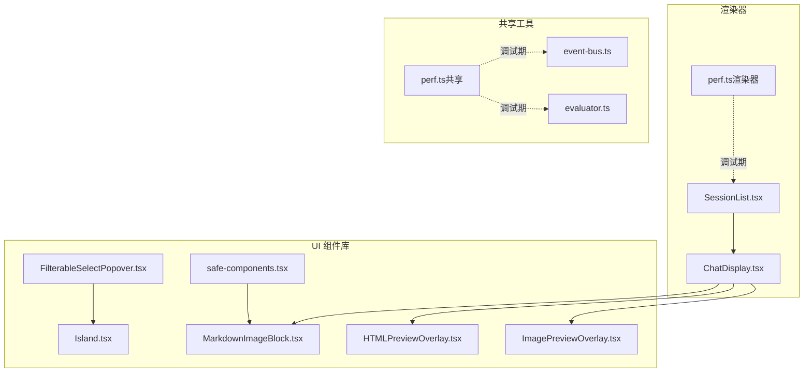
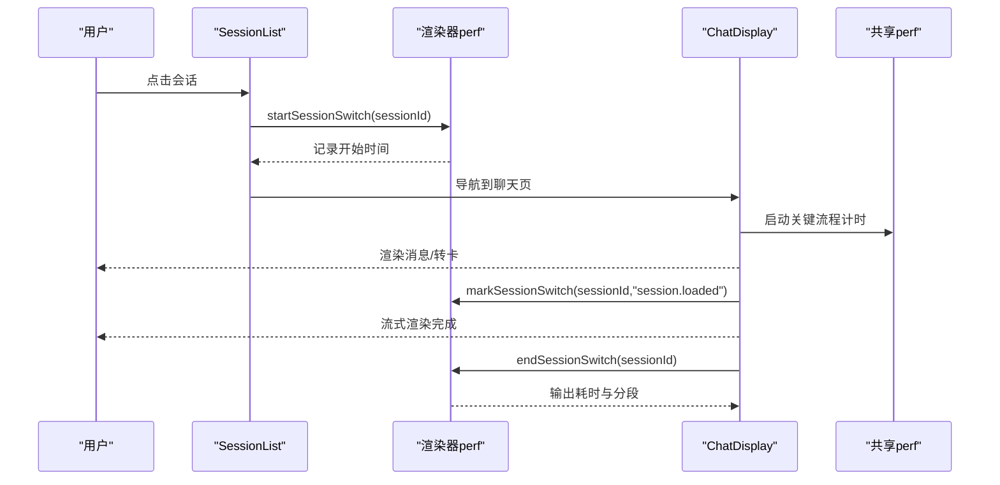
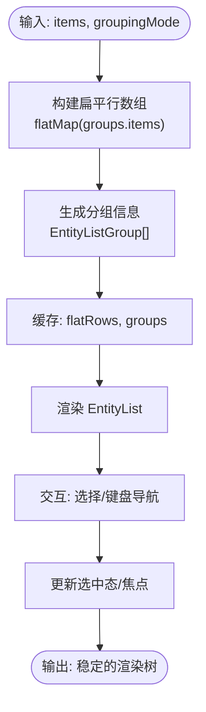
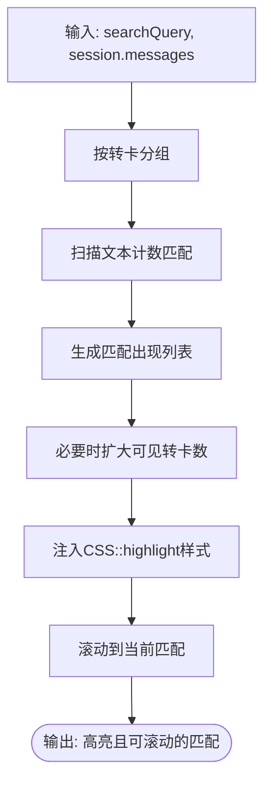
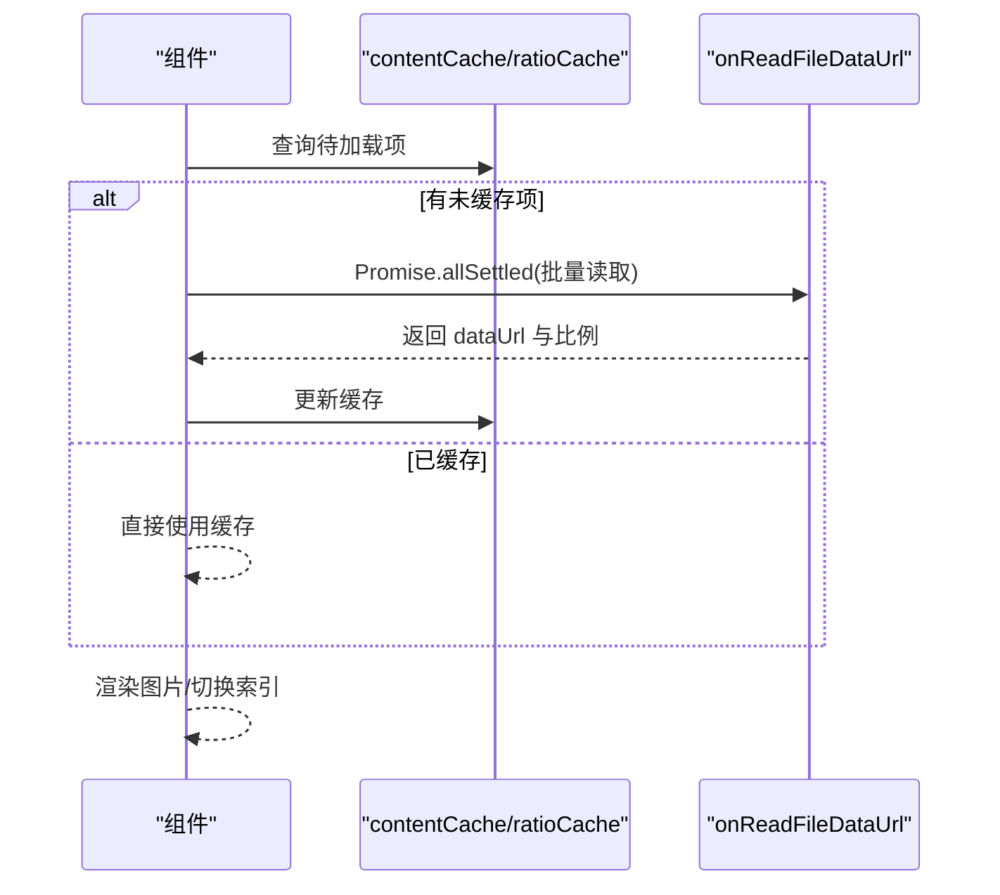
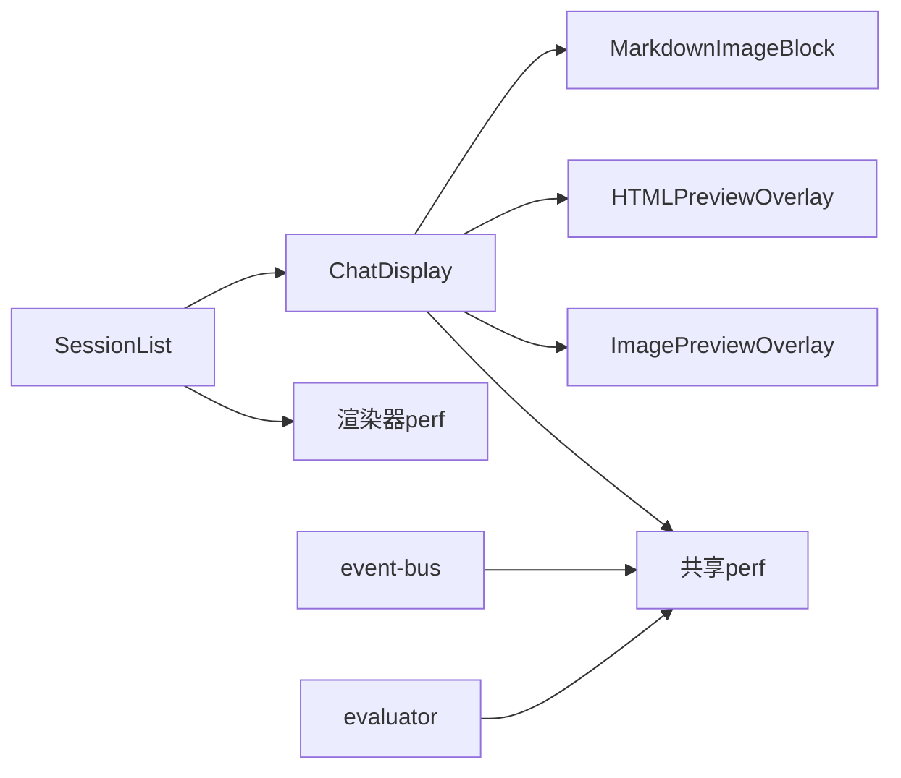

# 性能优化策略

<cite>
**本文引用的文件**
- [perf.ts（渲染器）](file://apps/electron/src/renderer/lib/perf.ts)
- [perf.ts（共享工具）](file://packages/shared/src/utils/perf.ts)
- [SessionList.tsx](file://apps/electron/src/renderer/components/app-shell/SessionList.tsx)
- [ChatDisplay.tsx](file://apps/electron/src/renderer/components/app-shell/ChatDisplay.tsx)
- [MarkdownImageBlock.tsx](file://packages/ui/src/components/markdown/MarkdownImageBlock.tsx)
- [HTMLPreviewOverlay.tsx](file://packages/ui/src/components/overlay/HTMLPreviewOverlay.tsx)
- [ImagePreviewOverlay.tsx](file://packages/ui/src/components/overlay/ImagePreviewOverlay.tsx)
- [FilterableSelectPopover.tsx](file://packages/ui/src/components/ui/FilterableSelectPopover.tsx)
- [Island.tsx](file://packages/ui/src/components/ui/Island.tsx)
- [safe-components.tsx](file://packages/ui/src/components/markdown/safe-components.tsx)
- [event-bus.ts](file://packages/shared/src/automations/event-bus.ts)
- [evaluator.ts](file://packages/shared/src/views/evaluator.ts)
</cite>

## 目录
1. [简介](#简介)
2. [项目结构与性能相关模块](#项目结构与性能相关模块)
3. [核心组件与优化点概览](#核心组件与优化点概览)
4. [架构总览](#架构总览)
5. [详细组件分析与优化策略](#详细组件分析与优化策略)
6. [依赖关系与耦合分析](#依赖关系与耦合分析)
7. [性能监控与度量](#性能监控与度量)
8. [性能考虑与最佳实践](#性能考虑与最佳实践)
9. [故障排查与常见问题](#故障排查与常见问题)
10. [结论](#结论)

## 简介
本文件面向性能优化策略，系统梳理并实证分析以下内容：
- React 组件级性能优化：memoization（React.memo、useMemo、useCallback）、懒加载（Suspense、动态导入）、虚拟化列表、防抖节流
- 应用级性能监控：渲染器侧与共享侧的性能追踪、渲染时间测量、内存使用监控
- 组件生命周期清理：事件监听器移除、定时器清理、副作用收尾
- 性能分析工具使用、瓶颈识别、优化策略实施
- 提供可落地的代码示例路径、最佳实践与常见问题解决方案

## 项目结构与性能相关模块
- 渲染器侧性能监控：apps/electron/src/renderer/lib/perf.ts
- 共享侧性能监控：packages/shared/src/utils/perf.ts
- 关键业务组件：SessionList、ChatDisplay、MarkdownImageBlock、HTMLPreviewOverlay、ImagePreviewOverlay、FilterableSelectPopover、Island、safe-components
- 事件总线与视图评估：packages/shared/src/automations/event-bus.ts、packages/shared/src/views/evaluator.ts

**图表来源**
- [perf.ts（渲染器）:1-188](file://apps/electron/src/renderer/lib/perf.ts#L1-L188)
- [perf.ts（共享工具）:1-418](file://packages/shared/src/utils/perf.ts#L1-L418)
- [SessionList.tsx:1-788](file://apps/electron/src/renderer/components/app-shell/SessionList.tsx#L1-L788)
- [ChatDisplay.tsx:1-800](file://apps/electron/src/renderer/components/app-shell/ChatDisplay.tsx#L1-L800)
- [MarkdownImageBlock.tsx:84-166](file://packages/ui/src/components/markdown/MarkdownImageBlock.tsx#L84-L166)
- [HTMLPreviewOverlay.tsx:75-147](file://packages/ui/src/components/overlay/HTMLPreviewOverlay.tsx#L75-L147)
- [ImagePreviewOverlay.tsx:87-131](file://packages/ui/src/components/overlay/ImagePreviewOverlay.tsx#L87-L131)
- [FilterableSelectPopover.tsx:76-116](file://packages/ui/src/components/ui/FilterableSelectPopover.tsx#L76-L116)
- [Island.tsx:574-624](file://packages/ui/src/components/ui/Island.tsx#L574-L624)
- [safe-components.tsx:41-111](file://packages/ui/src/components/markdown/safe-components.tsx#L41-L111)
- [event-bus.ts:120-190](file://packages/shared/src/automations/event-bus.ts#L120-L190)
- [evaluator.ts:1-72](file://packages/shared/src/views/evaluator.ts#L1-L72)

**章节来源**
- [perf.ts（渲染器）:1-188](file://apps/electron/src/renderer/lib/perf.ts#L1-L188)
- [perf.ts（共享工具）:1-418](file://packages/shared/src/utils/perf.ts#L1-L418)

## 核心组件与优化点概览
- memoization 与计算缓存
  - 使用 useMemo 缓存复杂计算结果（如分组、过滤、高亮匹配集）
  - 使用 useCallback 包裹回调以稳定子组件依赖
- 懒加载与动态导入
  - 利用 Suspense 与动态导入进行按需加载
  - Overlay 组件在需要时才加载内容，避免一次性渲染大量内容
- 虚拟化列表
  - SessionList 将“可见项”作为扁平数组，结合分组占位与折叠元数据，减少不必要的 DOM
- 防抖节流
  - 输入类交互中使用 requestAnimationFrame 与定时器，确保在下一帧或合理时机执行
- 性能监控
  - 渲染器侧：会话切换从点击到渲染完成的端到端耗时
  - 共享侧：通用性能计时、嵌套标记、聚合统计、阈值过滤
- 生命周期清理
  - 事件监听器、定时器、RAF、窗口滚动监听等均在副作用返回函数中清理

**章节来源**
- [SessionList.tsx:261-435](file://apps/electron/src/renderer/components/app-shell/SessionList.tsx#L261-L435)
- [ChatDisplay.tsx:655-721](file://apps/electron/src/renderer/components/app-shell/ChatDisplay.tsx#L655-L721)
- [FilterableSelectPopover.tsx:84-105](file://packages/ui/src/components/ui/FilterableSelectPopover.tsx#L84-L105)
- [Island.tsx:584-622](file://packages/ui/src/components/ui/Island.tsx#L584-L622)
- [HTMLPreviewOverlay.tsx:89-130](file://packages/ui/src/components/overlay/HTMLPreviewOverlay.tsx#L89-L130)
- [MarkdownImageBlock.tsx:84-122](file://packages/ui/src/components/markdown/MarkdownImageBlock.tsx#L84-L122)

## 架构总览
渲染器侧与共享侧的性能监控协同工作：
- 渲染器侧：聚焦 UI 渲染链路（会话切换、聊天面板渲染）
- 共享侧：聚焦业务逻辑与数据处理（事件总线、视图表达式求值）

**图表来源**
- [perf.ts（渲染器）:63-126](file://apps/electron/src/renderer/lib/perf.ts#L63-L126)
- [SessionList.tsx:537-550](file://apps/electron/src/renderer/components/app-shell/SessionList.tsx#L537-L550)
- [ChatDisplay.tsx:431-490](file://apps/electron/src/renderer/components/app-shell/ChatDisplay.tsx#L431-L490)

## 详细组件分析与优化策略

### 会话列表（SessionList）：分组、过滤与虚拟化
- 优化要点
  - useMemo 缓存分组与扁平化结果，避免每次渲染重复计算
  - useCallback 包裹交互回调，降低子组件重渲染
  - 分组占位与折叠元数据用于快速插入头部占位，减少 DOM 变更
- 关键实现位置
  - 分组与排序：[SessionList.tsx:261-435](file://apps/electron/src/renderer/components/app-shell/SessionList.tsx#L261-L435)
  - 选择与键盘交互：[SessionList.tsx:482-502](file://apps/electron/src/renderer/components/app-shell/SessionList.tsx#L482-L502)
  - 回调稳定化：[SessionList.tsx:537-575](file://apps/electron/src/renderer/components/app-shell/SessionList.tsx#L537-L575)

**图表来源**
- [SessionList.tsx:261-435](file://apps/electron/src/renderer/components/app-shell/SessionList.tsx#L261-L435)

**章节来源**
- [SessionList.tsx:144-788](file://apps/electron/src/renderer/components/app-shell/SessionList.tsx#L144-L788)

### 聊天显示（ChatDisplay）：搜索高亮与分页
- 优化要点
  - useMemo 计算匹配出现位置与转卡分组，避免重复扫描
  - 基于 CSS Custom Highlight API 的非破坏性高亮，减少 DOM 改写
  - 搜索激活时自动扩展可见转卡数量，保证匹配可滚动定位
- 关键实现位置
  - 匹配集计算与去重：[ChatDisplay.tsx:655-721](file://apps/electron/src/renderer/components/app-shell/ChatDisplay.tsx#L655-L721)
  - 高亮样式注入与范围收集：[ChatDisplay.tsx:784-800](file://apps/electron/src/renderer/components/app-shell/ChatDisplay.tsx#L784-L800)
  - 自动滚动到匹配：[ChatDisplay.tsx:740-770](file://apps/electron/src/renderer/components/app-shell/ChatDisplay.tsx#L740-L770)

**图表来源**
- [ChatDisplay.tsx:655-721](file://apps/electron/src/renderer/components/app-shell/ChatDisplay.tsx#L655-L721)
- [ChatDisplay.tsx:784-800](file://apps/electron/src/renderer/components/app-shell/ChatDisplay.tsx#L784-L800)

**章节来源**
- [ChatDisplay.tsx:431-800](file://apps/electron/src/renderer/components/app-shell/ChatDisplay.tsx#L431-L800)

### 图片预览（MarkdownImageBlock）：缓存与并发加载
- 优化要点
  - 内容缓存与比例缓存，避免重复读取与测量
  - Promise.allSettled 并发加载多个图片，失败不阻塞成功项
  - 取消标志防止组件卸载后状态更新
- 关键实现位置
  - 解析与缓存初始化：[MarkdownImageBlock.tsx:84-122](file://packages/ui/src/components/markdown/MarkdownImageBlock.tsx#L84-L122)
  - 并发加载与取消：[MarkdownImageBlock.tsx:132-166](file://packages/ui/src/components/markdown/MarkdownImageBlock.tsx#L132-L166)

**图表来源**
- [MarkdownImageBlock.tsx:84-166](file://packages/ui/src/components/markdown/MarkdownImageBlock.tsx#L84-L166)

**章节来源**
- [MarkdownImageBlock.tsx:84-166](file://packages/ui/src/components/markdown/MarkdownImageBlock.tsx#L84-L166)

### HTML 预览（HTMLPreviewOverlay）：外部缓存合并与惰性加载
- 优化要点
  - 合并外部与内部缓存，优先使用外部缓存，避免重复下载
  - useMemo 合并缓存，减少无效渲染
  - useCallback 处理 iframe 加载完成后的尺寸读取
- 关键实现位置
  - 缓存合并与处理：[HTMLPreviewOverlay.tsx:89-136](file://packages/ui/src/components/overlay/HTMLPreviewOverlay.tsx#L89-L136)
  - 惰性加载与错误处理：[HTMLPreviewOverlay.tsx:115-130](file://packages/ui/src/components/overlay/HTMLPreviewOverlay.tsx#L115-L130)

**章节来源**
- [HTMLPreviewOverlay.tsx:75-147](file://packages/ui/src/components/overlay/HTMLPreviewOverlay.tsx#L75-L147)

### 图像预览（ImagePreviewOverlay）：单图加载与尺寸缓存
- 优化要点
  - 单图加载时使用 Image 对象测量自然宽高，缓存到维度缓存
  - 卸载时清理取消标志，避免内存泄漏
- 关键实现位置
  - 加载与缓存：[ImagePreviewOverlay.tsx:87-126](file://packages/ui/src/components/overlay/ImagePreviewOverlay.tsx#L87-L126)

**章节来源**
- [ImagePreviewOverlay.tsx:87-131](file://packages/ui/src/components/overlay/ImagePreviewOverlay.tsx#L87-L131)

### 下拉选择（FilterableSelectPopover）：事件监听与清理
- 优化要点
  - 使用 requestAnimationFrame 与 setTimeout 确保输入聚焦时机
  - 监听窗口 resize 与 scroll，使用返回函数统一移除
- 关键实现位置
  - 位置更新与清理：[FilterableSelectPopover.tsx:84-105](file://packages/ui/src/components/ui/FilterableSelectPopover.tsx#L84-L105)

**章节来源**
- [FilterableSelectPopover.tsx:76-116](file://packages/ui/src/components/ui/FilterableSelectPopover.tsx#L76-L116)

### 弹层容器（Island）：过渡与退出清理
- 优化要点
  - 过渡结束后清理定时器，避免悬挂定时器导致内存泄漏
- 关键实现位置
  - 过渡与退出定时器清理：[Island.tsx:590-622](file://packages/ui/src/components/ui/Island.tsx#L590-L622)

**章节来源**
- [Island.tsx:574-624](file://packages/ui/src/components/ui/Island.tsx#L574-L624)

### Markdown 安全组件（safe-components）：代理与回退
- 优化要点
  - 使用 Proxy 对未知标签名进行安全回退，避免无效渲染
  - hasOwnProperty 行为通过 getOwnPropertyDescriptor 适配第三方库
- 关键实现位置
  - 代理与回退缓存：[safe-components.tsx:76-111](file://packages/ui/src/components/markdown/safe-components.tsx#L76-L111)

**章节来源**
- [safe-components.tsx:41-111](file://packages/ui/src/components/markdown/safe-components.tsx#L41-L111)

### 事件总线（event-bus）：速率限制与清理
- 优化要点
  - 每分钟速率限制，防止事件风暴
  - dispose 与 off 支持清理所有处理器
- 关键实现位置
  - 速率限制与发射：[event-bus.ts:178-229](file://packages/shared/src/automations/event-bus.ts#L178-L229)
  - 注册/注销/清理：[event-bus.ts:234-256](file://packages/shared/src/automations/event-bus.ts#L234-L256)

**章节来源**
- [event-bus.ts:120-190](file://packages/shared/src/automations/event-bus.ts#L120-L190)
- [event-bus.ts:222-264](file://packages/shared/src/automations/event-bus.ts#L222-L264)

### 视图表达式求值（evaluator）：编译一次、运行多次
- 优化要点
  - 表达式编译缓存，运行时仅做上下文求值
  - 错误隔离，单个表达式异常不影响其他匹配
- 关键实现位置
  - 编译与缓存：[evaluator.ts:50-62](file://packages/shared/src/views/evaluator.ts#L50-L62)
  - 求值与容错：[evaluator.ts:72-72](file://packages/shared/src/views/evaluator.ts#L72-L72)

**章节来源**
- [evaluator.ts:1-72](file://packages/shared/src/views/evaluator.ts#L1-L72)

## 依赖关系与耦合分析
- 组件间耦合
  - SessionList 与 ChatDisplay 通过导航与状态共享连接
  - ChatDisplay 依赖 UI 组件库中的 Markdown、Overlay、TurnCard 等
- 性能监控耦合
  - 渲染器 perf 与 UI 渲染链路强耦合（会话切换起止）
  - 共享 perf 与业务逻辑强耦合（事件总线、视图求值）
- 清理与资源管理
  - 事件监听器、定时器、RAF、窗口滚动监听均在副作用返回函数中清理，降低泄漏风险

**图表来源**
- [SessionList.tsx:144-788](file://apps/electron/src/renderer/components/app-shell/SessionList.tsx#L144-L788)
- [ChatDisplay.tsx:431-800](file://apps/electron/src/renderer/components/app-shell/ChatDisplay.tsx#L431-L800)
- [perf.ts（渲染器）:63-126](file://apps/electron/src/renderer/lib/perf.ts#L63-L126)
- [perf.ts（共享工具）:193-301](file://packages/shared/src/utils/perf.ts#L193-L301)
- [event-bus.ts:178-229](file://packages/shared/src/automations/event-bus.ts#L178-L229)
- [evaluator.ts:50-72](file://packages/shared/src/views/evaluator.ts#L50-L72)

**章节来源**
- [SessionList.tsx:144-788](file://apps/electron/src/renderer/components/app-shell/SessionList.tsx#L144-L788)
- [ChatDisplay.tsx:431-800](file://apps/electron/src/renderer/components/app-shell/ChatDisplay.tsx#L431-L800)
- [perf.ts（渲染器）:63-126](file://apps/electron/src/renderer/lib/perf.ts#L63-L126)
- [perf.ts（共享工具）:193-301](file://packages/shared/src/utils/perf.ts#L193-L301)
- [event-bus.ts:178-229](file://packages/shared/src/automations/event-bus.ts#L178-L229)
- [evaluator.ts:50-72](file://packages/shared/src/views/evaluator.ts#L50-L72)

## 性能监控与度量
- 渲染器侧（会话切换）
  - startSessionSwitch：记录点击到开始渲染
  - markSessionSwitch：中间节点（如“会话已加载”）
  - endSessionSwitch：记录总耗时与分段
  - getRecentMetrics/getStats：获取最近指标与统计
- 共享侧（通用计时）
  - start/measure/measureSync/span：基础计时与嵌套标记
  - getStats/getRecentMetrics：聚合统计与最近指标
  - configure/setEnabled/isEnabled：配置与开关
- 使用建议
  - 在关键路径（会话切换、消息加载、转卡展开）打点
  - 设置最小阈值，避免噪声日志
  - 结合浏览器开发者工具与性能面板进行交叉验证

**章节来源**
- [perf.ts（渲染器）:63-165](file://apps/electron/src/renderer/lib/perf.ts#L63-L165)
- [perf.ts（共享工具）:193-400](file://packages/shared/src/utils/perf.ts#L193-L400)

## 性能考虑与最佳实践
- 组件级优化
  - 优先使用 useMemo/useCallback 缓存昂贵计算与回调
  - 将大组件拆分为独立模块，配合动态导入与 Suspense
  - 对长列表使用虚拟化或分页，控制一次性渲染元素数量
- 渲染与交互
  - 使用 requestAnimationFrame 与合理的定时器间隔，避免阻塞主线程
  - 对高频输入（搜索、筛选）采用防抖/节流
- 资源与缓存
  - 合理利用缓存（内容、尺寸、分组），避免重复 IO 与计算
  - 对并发任务使用 Promise.allSettled，失败不影响成功项
- 生命周期与清理
  - 所有事件监听器、定时器、RAF、窗口监听均在副作用返回函数中清理
  - 对外部资源（Overlay、图像）在卸载时设置取消标志
- 监控与分析
  - 在调试模式下启用性能监控，定期导出统计并识别热点
  - 结合浏览器性能面板（CPU/内存/布局抖动）定位瓶颈

[本节为通用指导，无需特定文件引用]

## 故障排查与常见问题
- 会话切换卡顿
  - 检查是否在渲染器 perf 中启用了调试模式，并确认 start/mark/end 是否成对调用
  - 关注 ChatDisplay 的搜索高亮与分页扩展逻辑，避免不必要的可见项增长
- 图片/HTML 预览加载慢
  - 检查缓存命中率与并发加载策略
  - 确认 Overlay 的惰性加载与错误处理是否生效
- 下拉选择弹层位置异常
  - 确认窗口 resize/scroll 监听是否正确注册与清理
- 内存占用上升
  - 检查 Island 的过渡定时器、FilterableSelectPopover 的 RAF/timeout 是否清理
  - 确认 Overlay 卸载时的取消标志是否设置
- 事件风暴导致卡顿
  - 检查 event-bus 的速率限制是否触发，必要时调整限流参数

**章节来源**
- [perf.ts（渲染器）:63-126](file://apps/electron/src/renderer/lib/perf.ts#L63-L126)
- [ChatDisplay.tsx:704-721](file://apps/electron/src/renderer/components/app-shell/ChatDisplay.tsx#L704-L721)
- [MarkdownImageBlock.tsx:132-166](file://packages/ui/src/components/markdown/MarkdownImageBlock.tsx#L132-L166)
- [HTMLPreviewOverlay.tsx:115-130](file://packages/ui/src/components/overlay/HTMLPreviewOverlay.tsx#L115-L130)
- [FilterableSelectPopover.tsx:84-105](file://packages/ui/src/components/ui/FilterableSelectPopover.tsx#L84-L105)
- [Island.tsx:590-622](file://packages/ui/src/components/ui/Island.tsx#L590-L622)
- [event-bus.ts:184-190](file://packages/shared/src/automations/event-bus.ts#L184-L190)

## 结论
本项目在组件级与应用级层面提供了完善的性能优化与监控能力：
- 通过 useMemo/useCallback、虚拟化与缓存显著降低渲染成本
- 通过 Suspense 与动态导入实现按需加载
- 通过渲染器与共享侧的性能监控，形成从 UI 到业务的全链路可观测
- 严格的副作用清理与速率限制，保障长期运行稳定性
建议在日常开发中持续使用性能监控工具，结合本指南的优化策略，逐步消除热点与瓶颈。