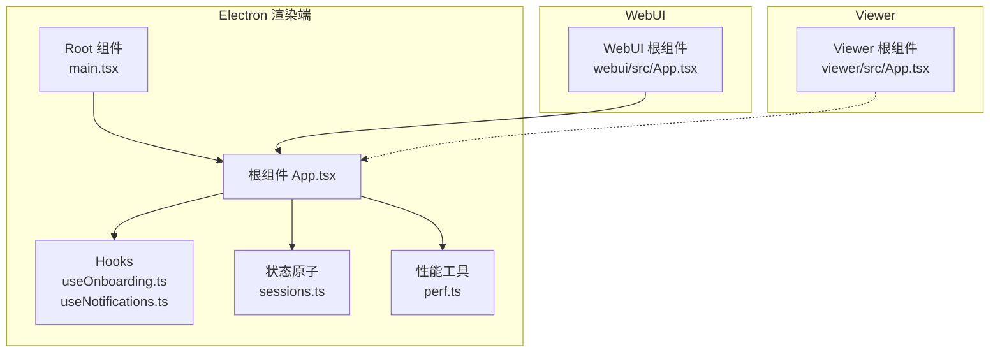
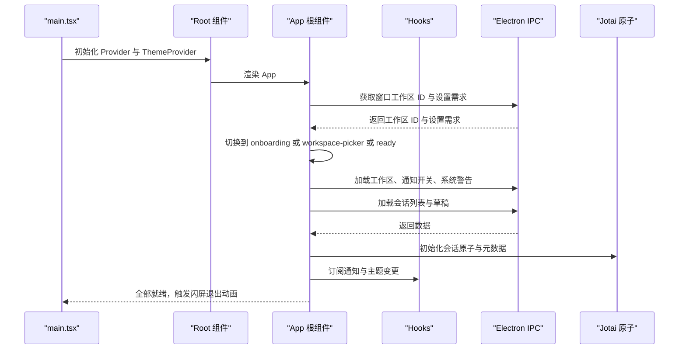
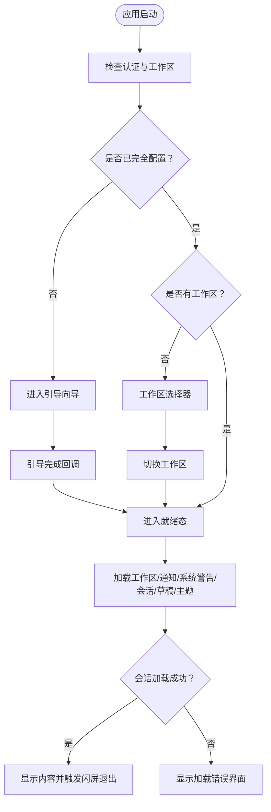
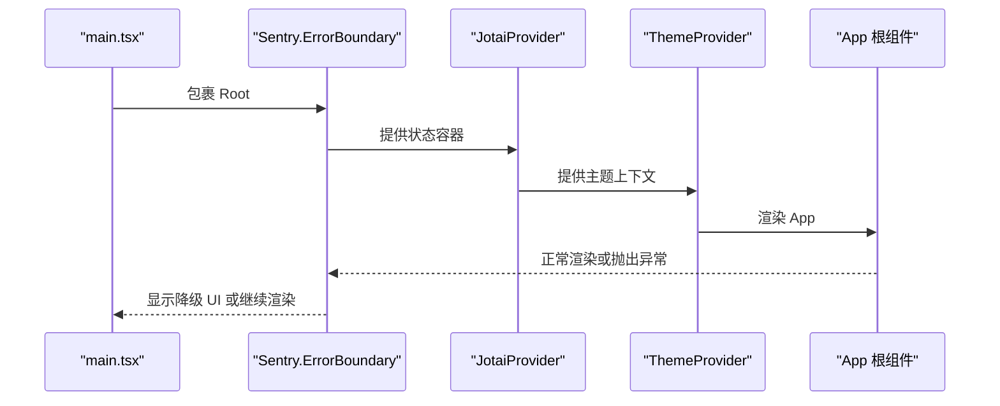
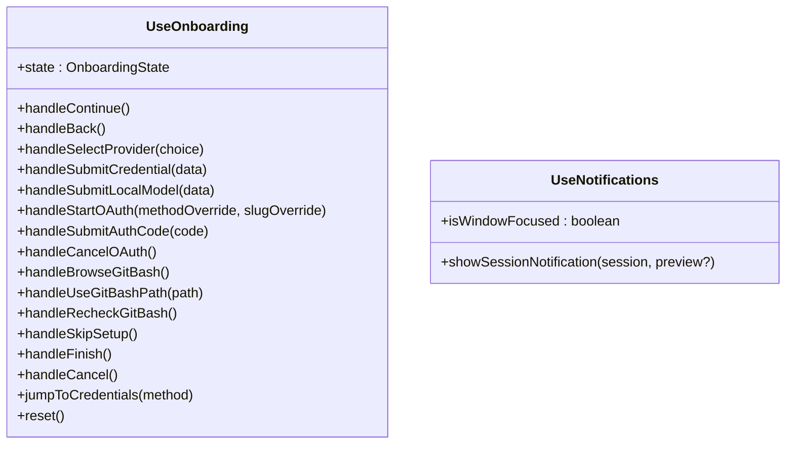
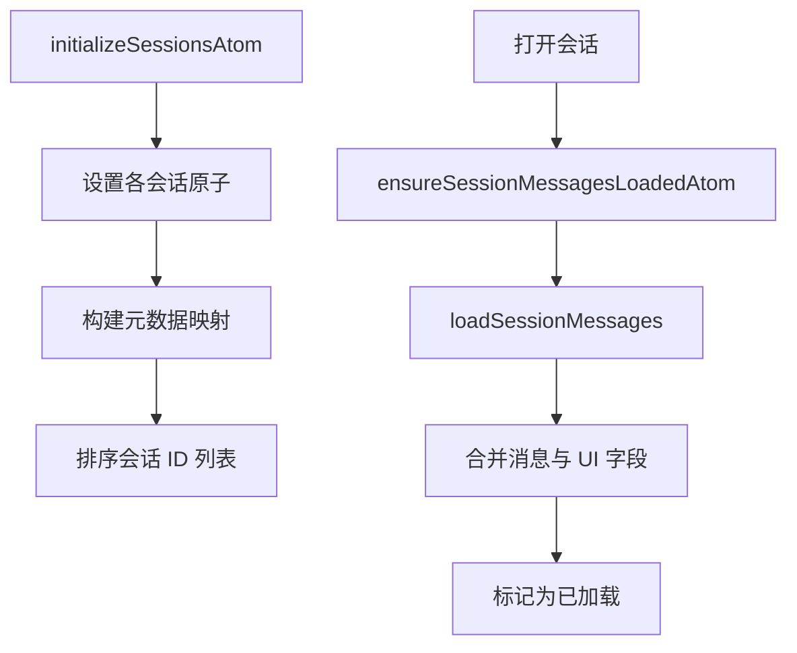
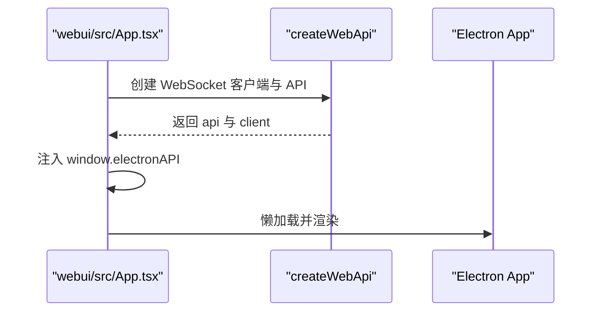
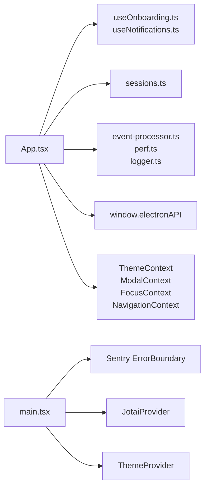

# 根组件设计模式

<cite>
**本文档引用的文件**
- [apps/electron/src/renderer/App.tsx](file://apps/electron/src/renderer/App.tsx)
- [apps/electron/src/renderer/main.tsx](file://apps/electron/src/renderer/main.tsx)
- [apps/electron/src/renderer/hooks/useOnboarding.ts](file://apps/electron/src/renderer/hooks/useOnboarding.ts)
- [apps/electron/src/renderer/hooks/useNotifications.ts](file://apps/electron/src/renderer/hooks/useNotifications.ts)
- [apps/electron/src/renderer/atoms/sessions.ts](file://apps/electron/src/renderer/atoms/sessions.ts)
- [apps/electron/src/renderer/lib/perf.ts](file://apps/electron/src/renderer/lib/perf.ts)
- [apps/webui/src/App.tsx](file://apps/webui/src/App.tsx)
- [apps/viewer/src/App.tsx](file://apps/viewer/src/App.tsx)
</cite>

## 目录
1. [简介](#简介)
2. [项目结构](#项目结构)
3. [核心组件](#核心组件)
4. [架构总览](#架构总览)
5. [详细组件分析](#详细组件分析)
6. [依赖关系分析](#依赖关系分析)
7. [性能考量](#性能考量)
8. [故障排查指南](#故障排查指南)
9. [结论](#结论)
10. [附录](#附录)

## 简介
本文件围绕应用根组件设计模式，系统阐述 Electron 渲染进程中的根组件 App.tsx 的架构与实现细节，涵盖应用状态机、组件初始化流程、生命周期管理、启动序列、状态机模式、条件渲染策略、错误边界处理、性能优化与内存管理等主题，并提供调试技巧与最佳实践建议。目标读者既包括需要快速上手的开发者，也包括希望深入理解架构设计的高级用户。

## 项目结构
本项目采用多应用架构：
- Electron 渲染端：根组件位于渲染进程，负责应用状态管理、数据加载、主题与通知、事件处理与性能监控。
- WebUI 应用：通过 WebSocket 适配器桥接后委托给 Electron 渲染端的根组件。
- Viewer 应用：最小化会话查看器，独立于主应用运行。

图表来源
- [apps/electron/src/renderer/main.tsx:98-118](file://apps/electron/src/renderer/main.tsx#L98-L118)
- [apps/electron/src/renderer/App.tsx:224-740](file://apps/electron/src/renderer/App.tsx#L224-L740)
- [apps/webui/src/App.tsx:63-149](file://apps/webui/src/App.tsx#L63-L149)
- [apps/viewer/src/App.tsx:54-331](file://apps/viewer/src/App.tsx#L54-L331)

章节来源
- [apps/electron/src/renderer/main.tsx:1-119](file://apps/electron/src/renderer/main.tsx#L1-L119)
- [apps/electron/src/renderer/App.tsx:1-2205](file://apps/electron/src/renderer/App.tsx#L1-L2205)
- [apps/webui/src/App.tsx:1-150](file://apps/webui/src/App.tsx#L1-L150)
- [apps/viewer/src/App.tsx:1-332](file://apps/viewer/src/App.tsx#L1-L332)

## 核心组件
- 根组件 App.tsx：应用状态机驱动、数据加载与刷新、事件处理、主题与通知、性能监控、错误边界外层包裹。
- Root 组件 main.tsx：Sentry 错误边界包裹、Jotai Provider、主题提供者、全局 Toaster。
- Hooks：useOnboarding（引导向导状态机）、useNotifications（系统通知与徽章）。
- 状态原子 sessions.ts：基于 Jotai 的会话状态管理，避免数组持有导致的内存泄漏，支持懒加载与消息合并。
- 性能工具 perf.ts：会话切换性能指标采集与统计。

章节来源
- [apps/electron/src/renderer/App.tsx:224-740](file://apps/electron/src/renderer/App.tsx#L224-L740)
- [apps/electron/src/renderer/main.tsx:75-118](file://apps/electron/src/renderer/main.tsx#L75-L118)
- [apps/electron/src/renderer/hooks/useOnboarding.ts:1-853](file://apps/electron/src/renderer/hooks/useOnboarding.ts#L1-L853)
- [apps/electron/src/renderer/hooks/useNotifications.ts:1-245](file://apps/electron/src/renderer/hooks/useNotifications.ts#L1-L245)
- [apps/electron/src/renderer/atoms/sessions.ts:1-715](file://apps/electron/src/renderer/atoms/sessions.ts#L1-L715)
- [apps/electron/src/renderer/lib/perf.ts:1-188](file://apps/electron/src/renderer/lib/perf.ts#L1-L188)

## 架构总览
根组件采用“状态机 + 原子化状态 + 事件驱动”的架构模式：
- 状态机：loading → 检查认证 → onboarding 或 workspace-picker → ready；ready 后再加载工作区、会话、模型、通知与草稿。
- 原子化状态：使用 Jotai 家族原子，按会话隔离更新，避免全量重渲染。
- 事件驱动：集中事件处理器，区分流式与非流式场景，确保数据一致性与性能。
- 错误边界：Sentry ErrorBoundary 包裹根组件，崩溃时显示降级 UI 并上报。

图表来源
- [apps/electron/src/renderer/main.tsx:98-118](file://apps/electron/src/renderer/main.tsx#L98-L118)
- [apps/electron/src/renderer/App.tsx:654-740](file://apps/electron/src/renderer/App.tsx#L654-L740)

## 详细组件分析

### 根组件 App.tsx：状态机与启动序列
- 应用状态机
  - 状态类型：loading、onboarding、reauth、workspace-picker、ready。
  - 初始检查：在挂载时读取窗口工作区 ID 与设置需求，决定下一步状态。
  - 引导完成：handleOnboardingComplete 切换到 workspace-picker 或 ready，并刷新 LLM 连接。
  - 重新认证：handleReauthLogin 检查设置需求，必要时回到 onboarding。
- 启动序列
  - 认证检查：getWindowWorkspace、getSetupNeeds。
  - 工作区加载：getWorkspaces。
  - 会话初始化：getSessions、initializeSessionsAtom、setSessionsLoaded。
  - 会话刷新：refreshSessionListMetadataFromServer 支持权威与非权威刷新。
  - 主题设置：useTheme 钩子与 onAppThemeChange 监听。
  - 通知系统：useNotifications 订阅焦点变化、导航与徽章绘制。
  - 性能监控：initRendererPerf 在挂载时启用。
- 事件处理
  - 使用 useEventProcessor 处理代理事件，区分流式与非流式路径，保证数据一致性。
  - 背景任务事件处理：handleBackgroundTaskEvent 更新 backgroundTasksAtomFamily。
- 条件渲染策略
  - 基于 appState 的 switch 渲染：onboarding、workspace-picker、ready。
  - ready 下根据 sessionsLoaded 控制闪屏退出与内容展示。
  - 会话加载失败时渲染 SessionLoadErrorScreen。
- 错误边界
  - Root 组件由 Sentry.ErrorBoundary 包裹，崩溃时显示降级 UI 并提示重启。

图表来源
- [apps/electron/src/renderer/App.tsx:654-740](file://apps/electron/src/renderer/App.tsx#L654-L740)
- [apps/electron/src/renderer/App.tsx:193-222](file://apps/electron/src/renderer/App.tsx#L193-L222)

章节来源
- [apps/electron/src/renderer/App.tsx:224-740](file://apps/electron/src/renderer/App.tsx#L224-L740)

### Root 组件 main.tsx：错误边界与全局上下文
- Sentry 错误边界：捕获根组件崩溃，显示降级 UI 并提示重启。
- Jotai Provider：为整个应用提供状态容器。
- ThemeProvider：基于 windowWorkspaceIdAtom 提供主题上下文。
- Toaster：全局通知气泡。

图表来源
- [apps/electron/src/renderer/main.tsx:98-118](file://apps/electron/src/renderer/main.tsx#L98-L118)

章节来源
- [apps/electron/src/renderer/main.tsx:1-119](file://apps/electron/src/renderer/main.tsx#L1-L119)

### Hooks：引导向导与通知系统
- useOnboarding：引导向导状态机，覆盖欢迎、Git Bash、API 设置、凭据、本地模型、OAuth 流程、完成等步骤，支持直接编辑连接与 slug 冲突处理。
- useNotifications：订阅窗口焦点变化、通知导航、徽章绘制（macOS/Windows），支持 Canvas 徽章生成与任务栏覆盖徽章。

图表来源
- [apps/electron/src/renderer/hooks/useOnboarding.ts:194-853](file://apps/electron/src/renderer/hooks/useOnboarding.ts#L194-L853)
- [apps/electron/src/renderer/hooks/useNotifications.ts:136-245](file://apps/electron/src/renderer/hooks/useNotifications.ts#L136-L245)

章节来源
- [apps/electron/src/renderer/hooks/useOnboarding.ts:1-853](file://apps/electron/src/renderer/hooks/useOnboarding.ts#L1-L853)
- [apps/electron/src/renderer/hooks/useNotifications.ts:1-245](file://apps/electron/src/renderer/hooks/useNotifications.ts#L1-L245)

### 状态原子：会话状态与懒加载
- 会话原子家族：sessionAtomFamily，按会话 ID 隔离状态，避免跨会话重渲染。
- 元数据映射：sessionMetaMapAtom，仅存储轻量元数据用于列表展示。
- 懒加载机制：loadedSessionsAtom 标记已加载会话；ensureSessionMessagesLoadedAtom 仅在打开时加载消息；Promise 缓存去重并发请求。
- 消息合并策略：loadSessionMessages 保留流式过程中的最新消息，避免磁盘写入覆盖乐观更新。
- 内存管理：removeSessionAtom 清理原子家族条目，允许垃圾回收；initializeSessionsAtom 切换工作区时清理旧原子。

图表来源
- [apps/electron/src/renderer/atoms/sessions.ts:282-322](file://apps/electron/src/renderer/atoms/sessions.ts#L282-L322)
- [apps/electron/src/renderer/atoms/sessions.ts:550-674](file://apps/electron/src/renderer/atoms/sessions.ts#L550-L674)

章节来源
- [apps/electron/src/renderer/atoms/sessions.ts:1-715](file://apps/electron/src/renderer/atoms/sessions.ts#L1-L715)

### WebUI 根组件：桥接与懒加载
- WebUI 根组件在挂载时通过 createWebApi 创建 WebSocket 适配器，注入 window.electronAPI，随后懒加载 Electron App。
- 该设计确保任何 Electron 组件不会在适配器就绪前访问 window.electronAPI。

图表来源
- [apps/webui/src/App.tsx:63-149](file://apps/webui/src/App.tsx#L63-L149)

章节来源
- [apps/webui/src/App.tsx:1-150](file://apps/webui/src/App.tsx#L1-L150)

### Viewer 根组件：最小化会话查看器
- 支持上传 JSON 文件或通过 URL 查看共享会话。
- 内置主题切换、活动点击预览、多差异对比、终端输出预览、JSON 数据预览等能力。
- 无 Electron IPC 依赖，纯前端实现。

章节来源
- [apps/viewer/src/App.tsx:1-332](file://apps/viewer/src/App.tsx#L1-L332)

## 依赖关系分析
- 根组件依赖
  - Hooks：useOnboarding、useNotifications、useSession、useUpdateChecker、useTransportConnectionState、useStaleSessionRecovery。
  - 原子：sessions.ts 中的 initializeSessionsAtom、sessionAtomFamily、sessionMetaMapAtom、loadedSessionsAtom、backgroundTasksAtomFamily 等。
  - 工具：useEventProcessor、rendererPerf、logger、navigate、drafts、session-load、reconnect-recovery。
  - 上下文：ThemeContext、ModalContext、FocusContext、DismissibleLayerContext、NavigationContext。
- 外部依赖
  - Electron IPC：window.electronAPI 提供工作区、会话、通知、主题、系统警告、LLM 连接等接口。
  - Sentry：错误边界与日志脱敏。
  - Jotai：原子化状态管理。
  - Sonner：全局通知气泡。

图表来源
- [apps/electron/src/renderer/App.tsx:1-100](file://apps/electron/src/renderer/App.tsx#L1-L100)
- [apps/electron/src/renderer/main.tsx:1-119](file://apps/electron/src/renderer/main.tsx#L1-L119)

章节来源
- [apps/electron/src/renderer/App.tsx:1-100](file://apps/electron/src/renderer/App.tsx#L1-L100)
- [apps/electron/src/renderer/main.tsx:1-119](file://apps/electron/src/renderer/main.tsx#L1-L119)

## 性能考量
- 懒加载与代码分割
  - WebUI 使用 React.lazy 与 Suspense，确保 Electron App 在适配器就绪后再加载。
  - 会话消息懒加载：ensureSessionMessagesLoadedAtom 仅在打开会话时加载，避免一次性加载大量消息。
- 原子化状态与隔离更新
  - sessionAtomFamily 按会话隔离，避免全量重渲染；loadedSessionsAtom 控制懒加载状态。
  - 合并策略：loadSessionMessages 保留流式过程中的最新消息，避免磁盘写入覆盖乐观更新。
- 性能监控
  - initRendererPerf 启用后记录会话切换从点击到渲染完成的耗时，支持统计分析。
- 内存管理
  - removeSessionAtom 清理原子家族条目，防止内存泄漏。
  - initializeSessionsAtom 切换工作区时清理旧原子，避免残留。
- 事件处理一致性
  - 流式与非流式场景分别以“原子/React”为源，通过 handoff 事件同步，避免丢失数据。

章节来源
- [apps/electron/src/renderer/App.tsx:465-515](file://apps/electron/src/renderer/App.tsx#L465-L515)
- [apps/electron/src/renderer/atoms/sessions.ts:550-674](file://apps/electron/src/renderer/atoms/sessions.ts#L550-L674)
- [apps/electron/src/renderer/lib/perf.ts:1-188](file://apps/electron/src/renderer/lib/perf.ts#L1-L188)
- [apps/webui/src/App.tsx:16-19](file://apps/webui/src/App.tsx#L16-L19)

## 故障排查指南
- 引导向导相关
  - 若引导完成后仍停留在 onboarding，检查 handleOnboardingComplete 是否正确调用并切换状态。
  - OAuth 流程中若出现“授权码无效”，确认 handleStartOAuth 与 handleSubmitAuthCode 的调用顺序与参数传递。
- 会话加载失败
  - 若出现 SessionLoadErrorScreen，检查 sessionLoadError 的具体信息与 shouldTreatSessionLoadFailureAsTransportFallback 的判断逻辑。
  - 使用 refreshSessionListMetadataFromServer 执行权威或非权威刷新，观察日志与返回值。
- 通知与徽章
  - 若通知未显示，检查 hasGuiChannels 与 enabled 标志位；确认窗口焦点状态与工作区 ID。
  - 徽章绘制失败时，检查 drawBadgeOnIcon 与 drawWindowsBadgeOverlay 的 Canvas 渲染结果。
- 错误边界
  - 根组件崩溃时，Sentry.ErrorBoundary 会显示降级 UI；检查控制台与 Sentry 日志，关注被忽略的 console 模式与敏感数据脱敏。
- 性能问题
  - 使用 rendererPerf.startSessionSwitch/markSessionSwitch/endSessionSwitch 记录会话切换耗时，结合 getStats 分析瓶颈。

章节来源
- [apps/electron/src/renderer/App.tsx:193-222](file://apps/electron/src/renderer/App.tsx#L193-L222)
- [apps/electron/src/renderer/hooks/useOnboarding.ts:518-630](file://apps/electron/src/renderer/hooks/useOnboarding.ts#L518-L630)
- [apps/electron/src/renderer/hooks/useNotifications.ts:217-238](file://apps/electron/src/renderer/hooks/useNotifications.ts#L217-L238)
- [apps/electron/src/renderer/main.tsx:75-92](file://apps/electron/src/renderer/main.tsx#L75-L92)
- [apps/electron/src/renderer/lib/perf.ts:63-126](file://apps/electron/src/renderer/lib/perf.ts#L63-L126)

## 结论
根组件 App.tsx 通过明确的状态机、原子化状态管理、事件驱动与性能监控，构建了稳定、可扩展且高性能的应用入口。配合 WebUI 的桥接与 Viewer 的最小化实现，形成了统一但灵活的多端架构。遵循本文的最佳实践与调试方法，可有效提升开发效率与用户体验。

## 附录
- 开发最佳实践
  - 使用 Jotai 家族原子进行细粒度状态管理，避免全量重渲染。
  - 在流式场景中，优先以原子为源，非流式场景再回退到 React 状态，通过 handoff 事件同步。
  - 对会话消息采用懒加载与合并策略，保留流式过程中的最新消息。
  - 使用 Sentry 错误边界与日志脱敏，确保崩溃可追踪且不泄露敏感信息。
  - 启用 rendererPerf 进行性能观测，定期分析会话切换耗时。
- 调试技巧
  - 在 App.tsx 挂载时调用 initRendererPerf，开启性能日志。
  - 使用 useOnboarding 的回调与 onConfigSaved 触发即时 UI 更新。
  - 在 useNotifications 中检查 hasGuiChannels 与窗口焦点状态，验证通知与徽章行为。
  - 在 WebUI 中确认 createWebApi 成功注入 window.electronAPI 后再懒加载 Electron App。