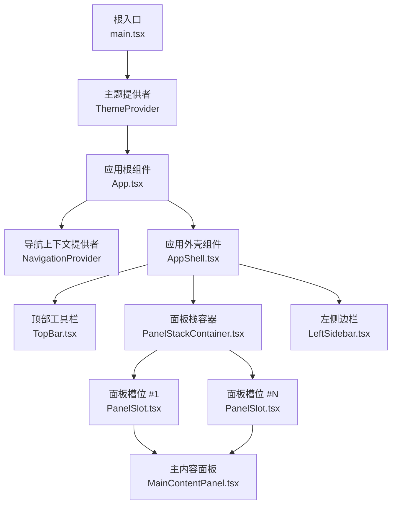
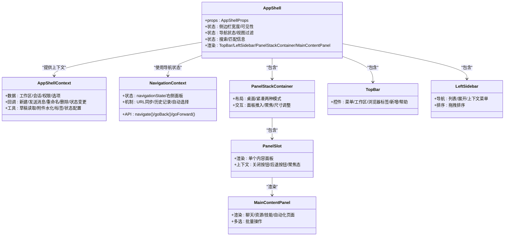
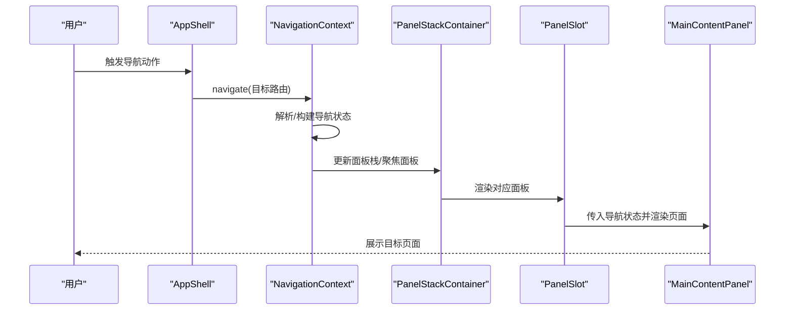
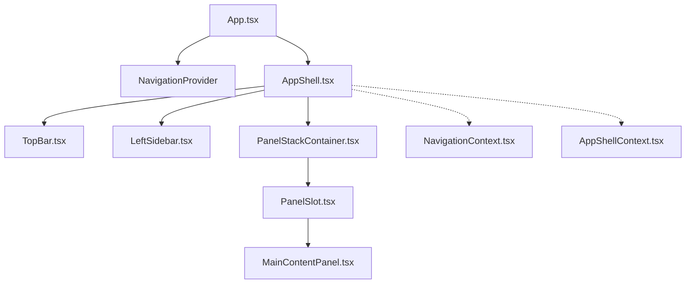
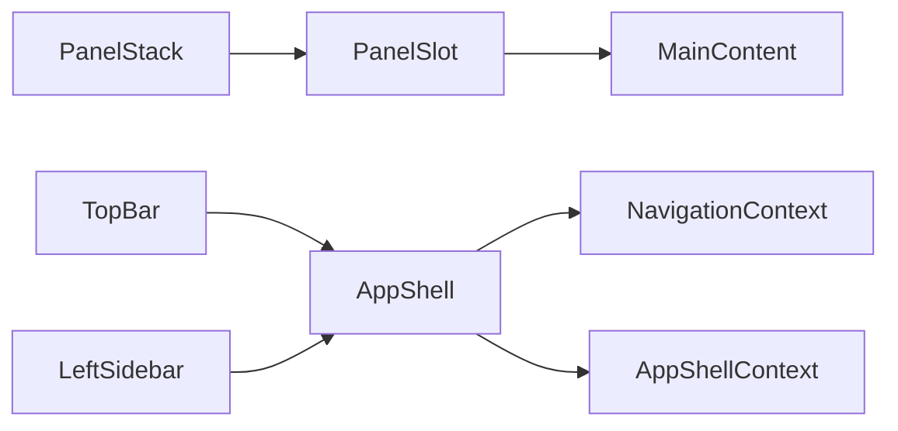

# 组件层次结构

<cite>
**本文档引用的文件**
- [AppShell.tsx](file://apps/electron/src/renderer/components/app-shell/AppShell.tsx)
- [App.tsx](file://apps/electron/src/renderer/App.tsx)
- [main.tsx](file://apps/electron/src/renderer/main.tsx)
- [AppShellContext.tsx](file://apps/electron/src/renderer/context/AppShellContext.tsx)
- [LeftSidebar.tsx](file://apps/electron/src/renderer/components/app-shell/LeftSidebar.tsx)
- [MainContentPanel.tsx](file://apps/electron/src/renderer/components/app-shell/MainContentPanel.tsx)
- [PanelStackContainer.tsx](file://apps/electron/src/renderer/components/app-shell/PanelStackContainer.tsx)
- [TopBar.tsx](file://apps/electron/src/renderer/components/app-shell/TopBar.tsx)
- [PanelSlot.tsx](file://apps/electron/src/renderer/components/app-shell/PanelSlot.tsx)
- [Panel.tsx](file://apps/electron/src/renderer/components/app-shell/Panel.tsx)
- [NavigationContext.tsx](file://apps/electron/src/renderer/contexts/NavigationContext.tsx)
- [useSession.ts](file://apps/electron/src/renderer/hooks/useSession.ts)
</cite>

## 目录
1. [引言](#引言)
2. [项目结构](#项目结构)
3. [核心组件](#核心组件)
4. [架构总览](#架构总览)
5. [详细组件分析](#详细组件分析)
6. [依赖分析](#依赖分析)
7. [性能考虑](#性能考虑)
8. [故障排除指南](#故障排除指南)
9. [结论](#结论)
10. [附录](#附录)

## 引言
本文件系统化梳理应用的组件层次结构，重点围绕 AppShell 作为应用外壳组件的设计理念与实现，解释其在多面板布局中的角色、子组件挂载点以及与导航体系的协作方式。文档同时总结组件拆分原则（关注点分离、单一职责、可复用性）、组件通信模式（props 传递、事件冒泡、回调函数、状态提升），并给出设计模式、命名约定与文件组织规范，帮助开发者快速理解整体架构。

## 项目结构
应用采用“根组件 → 应用外壳 → 多面板内容”的层次化组织方式：
- 根入口负责初始化国际化、主题、错误边界与全局 Provider，并渲染应用根组件。
- 应用根组件负责应用级状态管理、数据加载、事件处理与导航上下文提供。
- 应用外壳组件（AppShell）承载顶部工具栏、左侧边栏、导航器与内容面板栈，统一协调各子组件。
- 内容面板通过 PanelStackContainer 管理多面板布局与尺寸，PanelSlot 负责单个面板的渲染与上下文注入。
- 导航上下文（NavigationContext）提供统一的路由解析、历史同步与自动选择逻辑，确保所有面板等价且聚焦一致。

图表来源
- [main.tsx:98-108](file://apps/electron/src/renderer/main.tsx#L98-L108)
- [App.tsx:224-740](file://apps/electron/src/renderer/App.tsx#L224-L740)
- [AppShell.tsx:483-502](file://apps/electron/src/renderer/components/app-shell/AppShell.tsx#L483-L502)
- [TopBar.tsx:133-297](file://apps/electron/src/renderer/components/app-shell/TopBar.tsx#L133-L297)
- [PanelStackContainer.tsx:61-274](file://apps/electron/src/renderer/components/app-shell/PanelStackContainer.tsx#L61-L274)
- [PanelSlot.tsx:46-152](file://apps/electron/src/renderer/components/app-shell/PanelSlot.tsx#L46-L152)
- [MainContentPanel.tsx:60-404](file://apps/electron/src/renderer/components/app-shell/MainContentPanel.tsx#L60-L404)
- [LeftSidebar.tsx:168-292](file://apps/electron/src/renderer/components/app-shell/LeftSidebar.tsx#L168-L292)

章节来源
- [main.tsx:1-119](file://apps/electron/src/renderer/main.tsx#L1-L119)
- [App.tsx:1-800](file://apps/electron/src/renderer/App.tsx#L1-L800)
- [AppShell.tsx:1-800](file://apps/electron/src/renderer/components/app-shell/AppShell.tsx#L1-L800)

## 核心组件
- 根入口与主题提供者：负责初始化国际化、错误边界、全局 Provider 与主题上下文，渲染应用根组件。
- 应用根组件（App）：集中管理应用状态、工作区与会话数据、通知、更新检查、事件处理器与导航准备状态；向 AppShell 提供上下文值。
- 应用外壳组件（AppShell）：作为布局容器，协调 TopBar、LeftSidebar、PanelStackContainer 与 MainContentPanel 的渲染与交互。
- 面板栈容器（PanelStackContainer）：管理多个内容面板的布局、尺寸与过渡动画，支持桌面端与移动端两种模式。
- 面板槽位（PanelSlot）：渲染单个内容面板，注入按面板定制的上下文（如关闭按钮、后退按钮、聚焦态）。
- 主内容面板（MainContentPanel）：根据导航状态渲染聊天页、资源页、技能页或自动化页，支持多选批处理。
- 左侧边栏（LeftSidebar）：提供导航项列表、展开/折叠、上下文菜单与拖拽排序能力。
- 顶部工具栏（TopBar）：提供菜单、工作区切换、浏览器标签条、新增面板与帮助入口。
- 导航上下文（NavigationContext）：提供统一的导航 API、历史同步、URL 同步与自动选择逻辑。
- 会话选择钩子（useSession）：提供会话选择与多选状态管理的工厂方法。

章节来源
- [main.tsx:98-108](file://apps/electron/src/renderer/main.tsx#L98-L108)
- [App.tsx:224-740](file://apps/electron/src/renderer/App.tsx#L224-L740)
- [AppShell.tsx:483-502](file://apps/electron/src/renderer/components/app-shell/AppShell.tsx#L483-L502)
- [PanelStackContainer.tsx:61-274](file://apps/electron/src/renderer/components/app-shell/PanelStackContainer.tsx#L61-L274)
- [PanelSlot.tsx:46-152](file://apps/electron/src/renderer/components/app-shell/PanelSlot.tsx#L46-L152)
- [MainContentPanel.tsx:60-404](file://apps/electron/src/renderer/components/app-shell/MainContentPanel.tsx#L60-L404)
- [LeftSidebar.tsx:168-292](file://apps/electron/src/renderer/components/app-shell/LeftSidebar.tsx#L168-L292)
- [TopBar.tsx:133-297](file://apps/electron/src/renderer/components/app-shell/TopBar.tsx#L133-L297)
- [NavigationContext.tsx:150-162](file://apps/electron/src/renderer/contexts/NavigationContext.tsx#L150-L162)
- [useSession.ts:25-45](file://apps/electron/src/renderer/hooks/useSession.ts#L25-L45)

## 架构总览
AppShell 作为应用外壳组件，承担以下职责：
- 布局容器：定义三段式布局（左侧边栏、导航器、内容面板）与多面板堆叠布局。
- 上下文提供：通过 AppShellContext 汇聚工作区、会话、权限、选项等数据与回调，避免跨层 props 下钻。
- 导航协调：与 NavigationContext 协作，确保焦点面板驱动导航状态，URL 成为唯一真相源。
- 交互控制：管理侧边栏可见性、紧凑模式、搜索与过滤、键盘导航与焦点管理。

图表来源
- [AppShell.tsx:483-502](file://apps/electron/src/renderer/components/app-shell/AppShell.tsx#L483-L502)
- [AppShellContext.tsx:33-174](file://apps/electron/src/renderer/context/AppShellContext.tsx#L33-L174)
- [NavigationContext.tsx:194-199](file://apps/electron/src/renderer/contexts/NavigationContext.tsx#L194-L199)
- [PanelStackContainer.tsx:61-274](file://apps/electron/src/renderer/components/app-shell/PanelStackContainer.tsx#L61-L274)
- [PanelSlot.tsx:46-152](file://apps/electron/src/renderer/components/app-shell/PanelSlot.tsx#L46-L152)
- [MainContentPanel.tsx:60-404](file://apps/electron/src/renderer/components/app-shell/MainContentPanel.tsx#L60-L404)
- [TopBar.tsx:133-297](file://apps/electron/src/renderer/components/app-shell/TopBar.tsx#L133-L297)
- [LeftSidebar.tsx:168-292](file://apps/electron/src/renderer/components/app-shell/LeftSidebar.tsx#L168-L292)

## 详细组件分析

### AppShell 作为应用外壳组件
- 设计理念
  - 以“布局容器 + 上下文提供者”为核心，统一管理侧边栏、导航器与内容面板的协同。
  - 将导航状态与 UI 状态解耦，通过 NavigationContext 与 AppShellContext 实现数据与行为的集中管理。
  - 支持桌面端与移动端两种布局模式，紧凑模式下采用 iOS 风格的转场动画。
- 子组件挂载点
  - 顶部工具栏：用于菜单、工作区切换、浏览器标签与新增入口。
  - 左侧边栏：用于会话列表、资源、技能、自动化等导航项。
  - 面板栈容器：用于承载一个或多个内容面板，支持拖拽调整大小与切换。
  - 主内容面板：根据导航状态渲染具体页面（聊天、资源、技能、自动化）。
- 通信模式
  - Props 传递：AppShell 接收来自 App 的上下文值与 UI 状态参数。
  - 事件冒泡：通过 NavigationContext 的 navigate API 触发路由变化，进而影响所有面板。
  - 回调函数：通过 AppShellContext 注入的回调处理新建会话、发送消息、状态变更等。
  - 状态提升：导航状态与面板焦点由 NavigationContext 与 PanelStack 管理，AppShell 仅负责呈现。

图表来源
- [AppShell.tsx:483-502](file://apps/electron/src/renderer/components/app-shell/AppShell.tsx#L483-L502)
- [NavigationContext.tsx:194-199](file://apps/electron/src/renderer/contexts/NavigationContext.tsx#L194-L199)
- [PanelStackContainer.tsx:61-274](file://apps/electron/src/renderer/components/app-shell/PanelStackContainer.tsx#L61-L274)
- [PanelSlot.tsx:46-152](file://apps/electron/src/renderer/components/app-shell/PanelSlot.tsx#L46-L152)
- [MainContentPanel.tsx:60-404](file://apps/electron/src/renderer/components/app-shell/MainContentPanel.tsx#L60-L404)

章节来源
- [AppShell.tsx:473-502](file://apps/electron/src/renderer/components/app-shell/AppShell.tsx#L473-L502)
- [AppShellContext.tsx:33-174](file://apps/electron/src/renderer/context/AppShellContext.tsx#L33-L174)
- [NavigationContext.tsx:194-199](file://apps/electron/src/renderer/contexts/NavigationContext.tsx#L194-L199)

### 组件拆分原则与设计模式
- 关注点分离
  - 导航逻辑集中在 NavigationContext，不与 UI 组件耦合。
  - 数据与回调通过 AppShellContext 提供，避免跨层 props。
  - 面板布局与动画集中在 PanelStackContainer/PanelSlot，保持渲染一致性。
- 单一职责
  - TopBar 仅负责顶部控件与工作区切换。
  - LeftSidebar 仅负责导航项与上下文菜单。
  - MainContentPanel 仅根据导航状态渲染页面。
- 可复用性
  - PanelSlot 抽象出单面板渲染与上下文注入，可在不同场景复用。
  - Panel 提供基础容器样式，便于扩展。
- 命名约定
  - 容器组件以名词（如 Panel、PanelStackContainer）命名，功能组件以动词短语（如 TopBar、LeftSidebar）命名。
  - 文件夹按功能域划分（如 app-shell、ui、automations），便于查找与维护。
- 文件组织规范
  - 组件文件以 PascalCase 命名，导出默认组件与辅助类型。
  - 上下文与钩子独立文件，便于测试与复用。

章节来源
- [Panel.tsx:24-68](file://apps/electron/src/renderer/components/app-shell/Panel.tsx#L24-L68)
- [PanelSlot.tsx:46-152](file://apps/electron/src/renderer/components/app-shell/PanelSlot.tsx#L46-L152)
- [PanelStackContainer.tsx:61-274](file://apps/electron/src/renderer/components/app-shell/PanelStackContainer.tsx#L61-L274)
- [TopBar.tsx:133-297](file://apps/electron/src/renderer/components/app-shell/TopBar.tsx#L133-L297)
- [LeftSidebar.tsx:168-292](file://apps/electron/src/renderer/components/app-shell/LeftSidebar.tsx#L168-L292)
- [MainContentPanel.tsx:60-404](file://apps/electron/src/renderer/components/app-shell/MainContentPanel.tsx#L60-L404)

### 组件通信模式详解
- Props 传递
  - AppShell 接收来自 App 的上下文值与 UI 状态（如默认布局、聚焦模式）。
  - PanelSlot 通过 AppShellContext 注入关闭按钮、后退按钮与聚焦态。
- 事件冒泡
  - NavigationContext 的 navigate API 在原子层触发面板栈与聚焦面板的更新，URL 同步至浏览器历史。
- 回调函数
  - AppShellContext 提供会话相关回调（新建、发送消息、重命名、删除、状态变更），由子组件直接调用。
- 状态提升
  - 导航状态与面板焦点由 NavigationContext 与 PanelStack 管理，AppShell 仅负责呈现与交互。

章节来源
- [AppShell.tsx:503-528](file://apps/electron/src/renderer/components/app-shell/AppShell.tsx#L503-L528)
- [PanelSlot.tsx:93-98](file://apps/electron/src/renderer/components/app-shell/PanelSlot.tsx#L93-L98)
- [NavigationContext.tsx:194-199](file://apps/electron/src/renderer/contexts/NavigationContext.tsx#L194-L199)
- [AppShellContext.tsx:76-128](file://apps/electron/src/renderer/context/AppShellContext.tsx#L76-L128)

### 组件树示例与依赖关系
- 根组件树
  - main.tsx → ThemeProvider → App → NavigationProvider → AppShell → TopBar/LeftSidebar/PanelStackContainer → PanelSlot → MainContentPanel
- 依赖关系
  - AppShell 依赖 NavigationContext 获取导航状态，依赖 AppShellContext 提供数据与回调。
  - PanelStackContainer 依赖 PanelSlot 渲染单面板，依赖 PanelSlot 注入的上下文。
  - MainContentPanel 依赖 NavigationContext 的导航状态与 AppShellContext 的数据与回调。

图表来源
- [App.tsx:224-740](file://apps/electron/src/renderer/App.tsx#L224-L740)
- [AppShell.tsx:483-502](file://apps/electron/src/renderer/components/app-shell/AppShell.tsx#L483-L502)
- [PanelStackContainer.tsx:61-274](file://apps/electron/src/renderer/components/app-shell/PanelStackContainer.tsx#L61-L274)
- [PanelSlot.tsx:46-152](file://apps/electron/src/renderer/components/app-shell/PanelSlot.tsx#L46-L152)
- [MainContentPanel.tsx:60-404](file://apps/electron/src/renderer/components/app-shell/MainContentPanel.tsx#L60-L404)
- [NavigationContext.tsx:150-162](file://apps/electron/src/renderer/contexts/NavigationContext.tsx#L150-L162)
- [AppShellContext.tsx:33-174](file://apps/electron/src/renderer/context/AppShellContext.tsx#L33-L174)

章节来源
- [App.tsx:224-740](file://apps/electron/src/renderer/App.tsx#L224-L740)
- [AppShell.tsx:483-502](file://apps/electron/src/renderer/components/app-shell/AppShell.tsx#L483-L502)
- [PanelStackContainer.tsx:61-274](file://apps/electron/src/renderer/components/app-shell/PanelStackContainer.tsx#L61-L274)
- [PanelSlot.tsx:46-152](file://apps/electron/src/renderer/components/app-shell/PanelSlot.tsx#L46-L152)
- [MainContentPanel.tsx:60-404](file://apps/electron/src/renderer/components/app-shell/MainContentPanel.tsx#L60-L404)
- [NavigationContext.tsx:150-162](file://apps/electron/src/renderer/contexts/NavigationContext.tsx#L150-L162)
- [AppShellContext.tsx:33-174](file://apps/electron/src/renderer/context/AppShellContext.tsx#L33-L174)

## 依赖分析
- 组件耦合
  - AppShell 与 NavigationContext、AppShellContext 高内聚，但不直接依赖具体页面组件，降低耦合度。
  - PanelStackContainer 与 PanelSlot 通过上下文注入实现松耦合。
- 外部依赖
  - 导航与路由解析依赖 NavigationContext 与路由工具。
  - 状态管理依赖 Jotai 原子与钩子。
- 潜在循环依赖
  - 未发现直接循环依赖；上下文与容器组件遵循自顶向下依赖。

图表来源
- [AppShell.tsx:483-502](file://apps/electron/src/renderer/components/app-shell/AppShell.tsx#L483-L502)
- [NavigationContext.tsx:194-199](file://apps/electron/src/renderer/contexts/NavigationContext.tsx#L194-L199)
- [AppShellContext.tsx:33-174](file://apps/electron/src/renderer/context/AppShellContext.tsx#L33-L174)
- [PanelStackContainer.tsx:61-274](file://apps/electron/src/renderer/components/app-shell/PanelStackContainer.tsx#L61-L274)
- [PanelSlot.tsx:46-152](file://apps/electron/src/renderer/components/app-shell/PanelSlot.tsx#L46-L152)
- [MainContentPanel.tsx:60-404](file://apps/electron/src/renderer/components/app-shell/MainContentPanel.tsx#L60-L404)
- [TopBar.tsx:133-297](file://apps/electron/src/renderer/components/app-shell/TopBar.tsx#L133-L297)
- [LeftSidebar.tsx:168-292](file://apps/electron/src/renderer/components/app-shell/LeftSidebar.tsx#L168-L292)

章节来源
- [AppShell.tsx:483-502](file://apps/electron/src/renderer/components/app-shell/AppShell.tsx#L483-L502)
- [NavigationContext.tsx:194-199](file://apps/electron/src/renderer/contexts/NavigationContext.tsx#L194-L199)
- [AppShellContext.tsx:33-174](file://apps/electron/src/renderer/context/AppShellContext.tsx#L33-L174)
- [PanelStackContainer.tsx:61-274](file://apps/electron/src/renderer/components/app-shell/PanelStackContainer.tsx#L61-L274)
- [PanelSlot.tsx:46-152](file://apps/electron/src/renderer/components/app-shell/PanelSlot.tsx#L46-L152)
- [MainContentPanel.tsx:60-404](file://apps/electron/src/renderer/components/app-shell/MainContentPanel.tsx#L60-L404)
- [TopBar.tsx:133-297](file://apps/electron/src/renderer/components/app-shell/TopBar.tsx#L133-L297)
- [LeftSidebar.tsx:168-292](file://apps/electron/src/renderer/components/app-shell/LeftSidebar.tsx#L168-L292)

## 性能考虑
- 渲染优化
  - 使用 Motion 动画与条件渲染减少不必要的重排。
  - PanelStackContainer 在紧凑模式下采用 transform 动画，避免布局抖动。
- 状态管理
  - 使用 Jotai 原子隔离会话数据，避免全量状态更新导致的重渲染。
  - AppShellContext 将会话列表与会话详情分离，降低闭包持有大数组的风险。
- 导航与历史
  - NavigationContext 通过语义键与微任务合并 pushState，减少历史条目数量与重绘次数。
- 搜索与过滤
  - 过滤状态存储在本地，避免每次渲染都重新计算。

## 故障排除指南
- 导航异常
  - 检查 NavigationContext 的 navigate 是否正确解析路由与自动选择逻辑。
  - 确认 URL 参数是否正确同步至历史状态。
- 面板焦点问题
  - 确认 PanelStackContainer 中聚焦面板的更新是否触发 URL 同步。
  - 检查 PanelSlot 的点击聚焦逻辑是否生效。
- 上下文缺失
  - 确保 AppShell 与 PanelSlot 正确包裹 AppShellProvider。
  - 检查 AppShellContext 的值是否完整传入。

章节来源
- [NavigationContext.tsx:325-332](file://apps/electron/src/renderer/contexts/NavigationContext.tsx#L325-L332)
- [PanelStackContainer.tsx:99-111](file://apps/electron/src/renderer/components/app-shell/PanelStackContainer.tsx#L99-L111)
- [PanelSlot.tsx:100-104](file://apps/electron/src/renderer/components/app-shell/PanelSlot.tsx#L100-L104)
- [AppShellContext.tsx:178-186](file://apps/electron/src/renderer/context/AppShellContext.tsx#L178-L186)

## 结论
AppShell 通过清晰的布局容器职责、完善的上下文提供与导航协调机制，实现了多面板应用的高内聚低耦合架构。配合 NavigationContext 的 URL 驱动模型与 PanelStackContainer 的灵活布局，系统在桌面端与移动端均具备良好的可用性与扩展性。遵循关注点分离、单一职责与可复用性的设计原则，有助于团队长期维护与演进。

## 附录
- 组件命名与文件组织建议
  - 容器组件：Panel、PanelStackContainer、PanelSlot
  - 功能组件：TopBar、LeftSidebar、MainContentPanel
  - 上下文与钩子：NavigationContext、AppShellContext、useSession
- 常见问题定位清单
  - 导航状态未更新：检查 NavigationContext 的 URL 同步与历史状态。
  - 面板未聚焦：检查 PanelStackContainer 的聚焦逻辑与 PanelSlot 的点击处理。
  - 上下文不可用：确认 AppShellProvider 的包裹范围与上下文值完整性。