# 组件通信模式

<cite>
**本文引用的文件**
- [useSession.ts](file://apps/electron/src/renderer/hooks/useSession.ts)
- [useNotifications.ts](file://apps/electron/src/renderer/hooks/useNotifications.ts)
- [useTheme.ts](file://apps/electron/src/renderer/hooks/useTheme.ts)
- [ThemeContext.tsx](file://apps/electron/src/renderer/context/ThemeContext.tsx)
- [sessions.ts](file://apps/electron/src/renderer/atoms/sessions.ts)
- [useEntitySelection.ts](file://apps/electron/src/renderer/hooks/useEntitySelection.ts)
- [AppShellContext.tsx](file://apps/electron/src/renderer/context/AppShellContext.tsx)
- [index.ts](file://apps/electron/src/renderer/event-processor/index.ts)
- [useEventProcessor.ts](file://apps/electron/src/renderer/event-processor/useEventProcessor.ts)
- [useMultiSelect.ts](file://apps/electron/src/renderer/hooks/useMultiSelect.ts)
- [SessionList.tsx](file://apps/electron/src/renderer/components/app-shell/SessionList.tsx)
- [ChatDisplay.tsx](file://apps/electron/src/renderer/components/app-shell/ChatDisplay.tsx)
- [useSessionActions.ts](file://apps/electron/src/renderer/hooks/useSessionActions.ts)
- [useEntityListInteractions.ts](file://apps/electron/src/renderer/hooks/useEntityListInteractions.ts)
- [SessionListContext.tsx](file://apps/electron/src/renderer/context/SessionListContext.tsx)
- [session-load.ts](file://apps/electron/src/renderer/lib/session-load.ts)
</cite>

## 目录
1. [引言](#引言)
2. [项目结构](#项目结构)
3. [核心组件](#核心组件)
4. [架构总览](#架构总览)
5. [详细组件分析](#详细组件分析)
6. [依赖关系分析](#依赖关系分析)
7. [性能考量](#性能考量)
8. [故障排查指南](#故障排查指南)
9. [结论](#结论)
10. [附录](#附录)

## 引言
本文件系统化梳理应用中的组件通信模式，覆盖父子组件通信（props/回调）、兄弟组件通信（通过父组件）、跨层级通信（Context）、以及全局状态通信（Jotai atoms）。同时深入解析自定义 Hook 的设计模式与使用场景，包括 useSession、useNotifications、useTheme 等，并解释事件系统、消息传递与状态同步机制。最后给出通信模式选择原则、性能考量与可维护性建议，并提供具体示例、错误处理与调试技巧。

## 项目结构
应用采用“渲染层（Renderer）+ 主进程（Main）”架构，渲染层以 React + Jotai 为核心，结合 Context 提供跨层级数据共享，围绕会话（Session）构建完整的聊天界面与交互链路。关键模块分布如下：
- hooks：封装通用通信与状态逻辑（如 useSession、useNotifications、useTheme）
- context：提供主题、会话上下文等跨层级共享
- atoms：基于 Jotai 的原子化状态，支持按会话隔离更新
- event-processor：集中式事件处理与副作用管理
- components：UI 组件与业务容器（如 AppShell、SessionList、ChatDisplay）

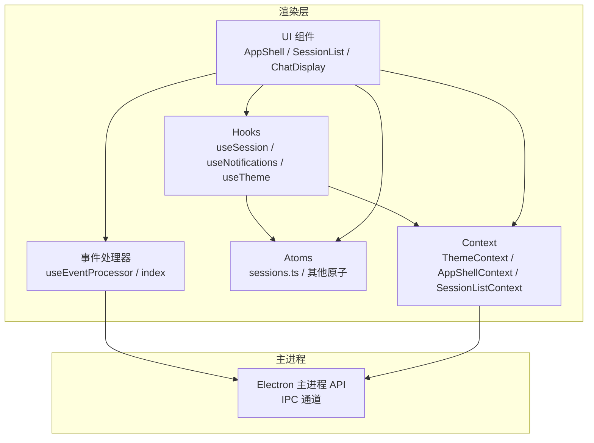

图表来源
- [useSession.ts:1-45](file://apps/electron/src/renderer/hooks/useSession.ts#L1-L45)
- [useNotifications.ts:1-245](file://apps/electron/src/renderer/hooks/useNotifications.ts#L1-L245)
- [useTheme.ts:1-77](file://apps/electron/src/renderer/hooks/useTheme.ts#L1-L77)
- [ThemeContext.tsx:1-536](file://apps/electron/src/renderer/context/ThemeContext.tsx#L1-L536)
- [sessions.ts:1-715](file://apps/electron/src/renderer/atoms/sessions.ts#L1-L715)
- [index.ts:1-40](file://apps/electron/src/renderer/event-processor/index.ts#L1-L40)
- [useEventProcessor.ts:1-131](file://apps/electron/src/renderer/event-processor/useEventProcessor.ts#L1-L131)

章节来源
- [useSession.ts:1-45](file://apps/electron/src/renderer/hooks/useSession.ts#L1-L45)
- [useNotifications.ts:1-245](file://apps/electron/src/renderer/hooks/useNotifications.ts#L1-L245)
- [useTheme.ts:1-77](file://apps/electron/src/renderer/hooks/useTheme.ts#L1-L77)
- [ThemeContext.tsx:1-536](file://apps/electron/src/renderer/context/ThemeContext.tsx#L1-L536)
- [sessions.ts:1-715](file://apps/electron/src/renderer/atoms/sessions.ts#L1-L715)
- [index.ts:1-40](file://apps/electron/src/renderer/event-processor/index.ts#L1-L40)
- [useEventProcessor.ts:1-131](file://apps/electron/src/renderer/event-processor/useEventProcessor.ts#L1-L131)

## 核心组件
- 自定义 Hook
  - useSession：会话选择与状态读取（基于 Jotai 原子族）
  - useNotifications：系统通知与徽章绘制（跨平台 Canvas 集成）
  - useTheme：主题读取与合并（与 ThemeProvider 协作）
- Context
  - ThemeContext：主题偏好、工作区覆盖、预览主题、DOM 注入与跨窗口同步
  - AppShellContext：会话与工作区数据、回调函数、统一选项映射
  - SessionListContext：会话列表共享动作与配置
- 全局状态（Jotai）
  - sessions.ts：按会话隔离的原子族、元数据映射、加载状态、批量操作原子
- 事件系统
  - useEventProcessor：纯函数事件处理 + 流水线状态管理 + 副作用上报
  - index：导出事件处理入口与工具

章节来源
- [useSession.ts:1-45](file://apps/electron/src/renderer/hooks/useSession.ts#L1-L45)
- [useNotifications.ts:1-245](file://apps/electron/src/renderer/hooks/useNotifications.ts#L1-L245)
- [useTheme.ts:1-77](file://apps/electron/src/renderer/hooks/useTheme.ts#L1-L77)
- [ThemeContext.tsx:1-536](file://apps/electron/src/renderer/context/ThemeContext.tsx#L1-L536)
- [AppShellContext.tsx:1-282](file://apps/electron/src/renderer/context/AppShellContext.tsx#L1-L282)
- [SessionListContext.tsx:1-51](file://apps/electron/src/renderer/context/SessionListContext.tsx#L1-L51)
- [sessions.ts:1-715](file://apps/electron/src/renderer/atoms/sessions.ts#L1-L715)
- [index.ts:1-40](file://apps/electron/src/renderer/event-processor/index.ts#L1-L40)
- [useEventProcessor.ts:1-131](file://apps/electron/src/renderer/event-processor/useEventProcessor.ts#L1-L131)

## 架构总览
渲染层通过 Jotai 实现细粒度的全局状态管理，每个会话拥有独立原子，避免全量重渲染；通过 Context 在多层级间共享配置与回调；事件系统以纯函数处理 Agent 事件，配合副作用钩子完成错误上报与状态清理。

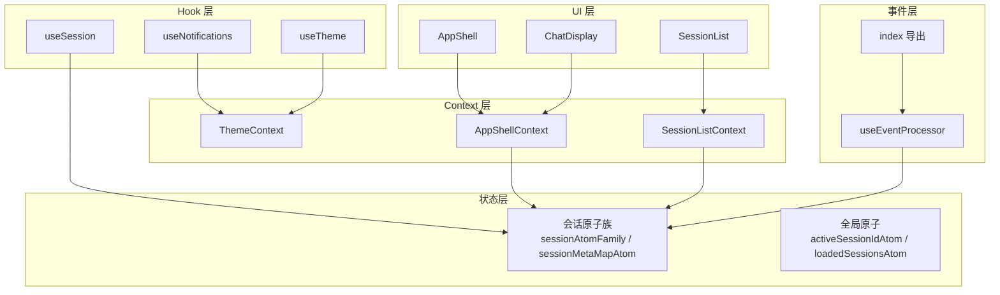

图表来源
- [sessions.ts:122-165](file://apps/electron/src/renderer/atoms/sessions.ts#L122-L165)
- [useSession.ts:25-45](file://apps/electron/src/renderer/hooks/useSession.ts#L25-L45)
- [useNotifications.ts:136-245](file://apps/electron/src/renderer/hooks/useNotifications.ts#L136-L245)
- [useTheme.ts:49-77](file://apps/electron/src/renderer/hooks/useTheme.ts#L49-L77)
- [ThemeContext.tsx:489-527](file://apps/electron/src/renderer/context/ThemeContext.tsx#L489-L527)
- [AppShellContext.tsx:178-282](file://apps/electron/src/renderer/context/AppShellContext.tsx#L178-L282)
- [SessionListContext.tsx:8-51](file://apps/electron/src/renderer/context/SessionListContext.tsx#L8-L51)
- [useEventProcessor.ts:78-131](file://apps/electron/src/renderer/event-processor/useEventProcessor.ts#L78-L131)
- [index.ts:8-40](file://apps/electron/src/renderer/event-processor/index.ts#L8-L40)

## 详细组件分析

### 自定义 Hook 设计模式与实现要点

#### useSession：会话选择与状态读取
- 设计要点
  - 通过工厂函数 createEntitySelection 生成独立的多选状态原子与 Hook，确保不同实体类型（会话/源/技能）互不干扰
  - useSessionSelection 返回完整动作集合（单选、切换、范围选择、清空、重置），useSessionSelectionStore 暴露 { state, setState } 供交互层复用
  - useSession 读取指定会话的原子值，实现按会话隔离更新
- 使用场景
  - SessionList 的键盘与鼠标交互（单选/多选/范围选择）
  - ChatDisplay 的输入框聚焦与权限提示联动
- 性能与可维护性
  - 通过 useAtomValue 仅订阅目标会话，避免无关重渲染
  - 保留兼容的 useSession 回调式返回，平滑过渡到新接口

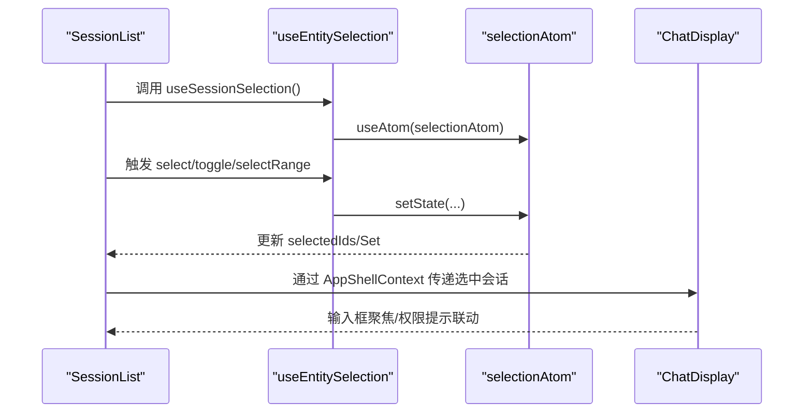

图表来源
- [useEntitySelection.ts:31-97](file://apps/electron/src/renderer/hooks/useEntitySelection.ts#L31-L97)
- [SessionList.tsx:148-160](file://apps/electron/src/renderer/components/app-shell/SessionList.tsx#L148-L160)
- [AppShellContext.tsx:206-210](file://apps/electron/src/renderer/context/AppShellContext.tsx#L206-L210)

章节来源
- [useSession.ts:1-45](file://apps/electron/src/renderer/hooks/useSession.ts#L1-L45)
- [useEntitySelection.ts:1-107](file://apps/electron/src/renderer/hooks/useEntitySelection.ts#L1-L107)
- [SessionList.tsx:148-160](file://apps/electron/src/renderer/components/app-shell/SessionList.tsx#L148-L160)
- [AppShellContext.tsx:206-210](file://apps/electron/src/renderer/context/AppShellContext.tsx#L206-L210)

#### useNotifications：系统通知与徽章绘制
- 设计要点
  - 通过 window.electronAPI 订阅窗口焦点变化、通知导航、徽章绘制请求
  - Canvas API 动态绘制徽章图（macOS dock 与 Windows 任务栏覆盖层），并在失败时记录日志
  - 条件展示策略：禁用设置、窗口聚焦、无工作区、无 GUI 通道时不弹出
- 使用场景
  - 新消息到达时在后台显示通知并更新徽章
  - 多窗口主题偏好变更的跨窗口广播与持久化
- 性能与可维护性
  - 仅在具备 GUI 通道时启用监听，避免在无界面环境报错
  - 徽章绘制异步执行，失败不影响主流程

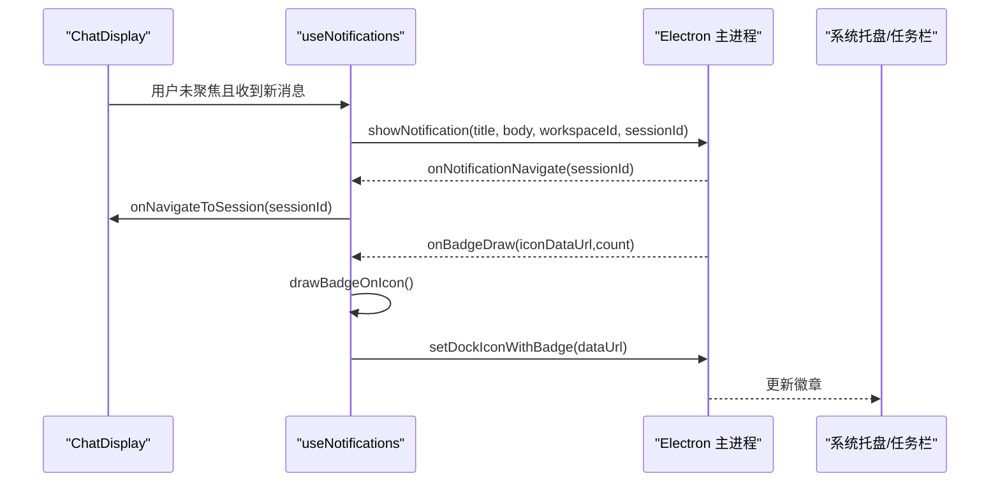

图表来源
- [useNotifications.ts:136-245](file://apps/electron/src/renderer/hooks/useNotifications.ts#L136-L245)
- [ChatDisplay.tsx:599-603](file://apps/electron/src/renderer/components/app-shell/ChatDisplay.tsx#L599-L603)

章节来源
- [useNotifications.ts:1-245](file://apps/electron/src/renderer/hooks/useNotifications.ts#L1-L245)
- [ChatDisplay.tsx:599-603](file://apps/electron/src/renderer/components/app-shell/ChatDisplay.tsx#L599-L603)

#### useTheme：主题读取与合并
- 设计要点
  - 从 ThemeContext 读取已解析的主题与配置，支持应用级覆盖（appTheme）与预设主题合并
  - 返回主题对象、是否深色、是否风景模式、Shiki 语法高亮配置等只读信息
- 使用场景
  - UI 组件根据 isDark/isScenic 切换视觉风格
  - Markdown 渲染器根据 shikiTheme 选择配色
- 性能与可维护性
  - 仅做浅合并与 useMemo 缓存，避免重复计算
  - 将 DOM 注入与主题加载交由 ThemeProvider 完成，Hook 专注读取

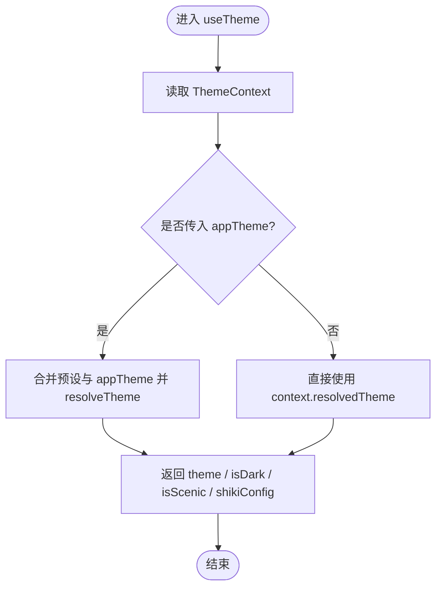

图表来源
- [useTheme.ts:49-77](file://apps/electron/src/renderer/hooks/useTheme.ts#L49-L77)
- [ThemeContext.tsx:490-527](file://apps/electron/src/renderer/context/ThemeContext.tsx#L490-L527)

章节来源
- [useTheme.ts:1-77](file://apps/electron/src/renderer/hooks/useTheme.ts#L1-L77)
- [ThemeContext.tsx:1-536](file://apps/electron/src/renderer/context/ThemeContext.tsx#L1-L536)

### Context：跨层级通信

#### ThemeContext：主题偏好与跨窗口同步
- 职责
  - 管理主题模式、颜色主题、字体、工作区覆盖、预览主题
  - 加载预设主题、注入 CSS 变量、处理系统偏好变化
  - 广播主题偏好到其他窗口，持久化用户覆盖
- 通信路径
  - 子组件通过 useTheme 读取状态
  - 设置器通过 window.electronAPI 广播与持久化
  - DOM 效果在 ThemeProvider 内部一次性注入，避免重复渲染

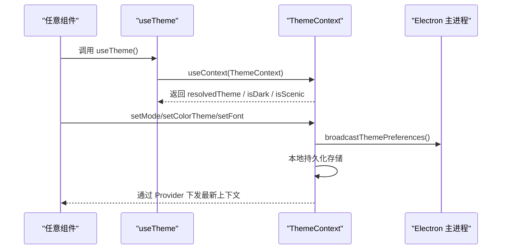

图表来源
- [ThemeContext.tsx:436-474](file://apps/electron/src/renderer/context/ThemeContext.tsx#L436-L474)
- [useTheme.ts:49-77](file://apps/electron/src/renderer/hooks/useTheme.ts#L49-L77)

章节来源
- [ThemeContext.tsx:1-536](file://apps/electron/src/renderer/context/ThemeContext.tsx#L1-L536)
- [useTheme.ts:1-77](file://apps/electron/src/renderer/hooks/useTheme.ts#L1-L77)

#### AppShellContext：会话与工作区数据共享
- 职责
  - 提供会话列表、工作区、LLM 连接、草稿、标签、权限/凭据请求等数据
  - 暴露统一的会话操作回调（新建/发送/重命名/归档/删除等）
  - 提供 per-session 选项映射与回调
- 通信路径
  - AppShell 作为 Provider，向子树注入上下文
  - 子组件通过 useAppShellContext 获取数据与回调
  - 通过 useSession 读取指定会话原子

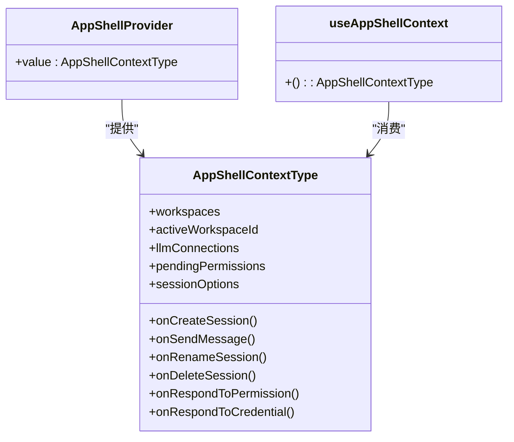

图表来源
- [AppShellContext.tsx:33-174](file://apps/electron/src/renderer/context/AppShellContext.tsx#L33-L174)
- [AppShellContext.tsx:178-282](file://apps/electron/src/renderer/context/AppShellContext.tsx#L178-L282)

章节来源
- [AppShellContext.tsx:1-282](file://apps/electron/src/renderer/context/AppShellContext.tsx#L1-L282)

#### SessionListContext：会话列表共享动作
- 职责
  - 将 SessionList 的动作（重命名、标记、删除、标签切换、打开新窗口等）与配置（状态/标签/搜索/匹配信息）向下透传
  - 通过 Provider 包裹 SessionItem，减少 props 传递层级

章节来源
- [SessionListContext.tsx:1-51](file://apps/electron/src/renderer/context/SessionListContext.tsx#L1-L51)
- [SessionList.tsx:616-651](file://apps/electron/src/renderer/components/app-shell/SessionList.tsx#L616-L651)

### 全局状态：Jotai 原子与会话隔离

#### sessions.ts：按会话隔离的状态管理
- 设计要点
  - sessionAtomFamily：每个会话一个原子，更新隔离，避免互相影响
  - sessionMetaMapAtom：轻量元数据映射，用于列表渲染
  - loadedSessionsAtom：懒加载跟踪，避免重复请求
  - 批量操作原子：initializeSessionsAtom、refreshSessionsMetadataAtom、addSessionAtom、removeSessionAtom
  - 同步原子：syncSessionsToAtomsAtom，保证 React 状态与原子状态一致性
- 使用场景
  - SessionList 仅订阅元数据，避免消息数组导致的重渲染
  - ChatDisplay 通过 useSession 读取指定会话原子，实现流式更新隔离
- 性能与可维护性
  - 通过 atomFamily 与 Map 结构实现内存友好与可 GC
  - 懒加载与去重并发请求，降低初始内存占用

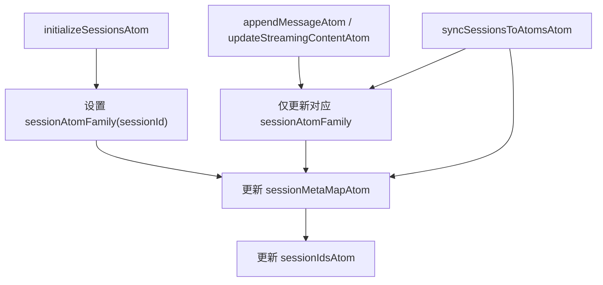

图表来源
- [sessions.ts:282-322](file://apps/electron/src/renderer/atoms/sessions.ts#L282-L322)
- [sessions.ts:479-534](file://apps/electron/src/renderer/atoms/sessions.ts#L479-L534)

章节来源
- [sessions.ts:1-715](file://apps/electron/src/renderer/atoms/sessions.ts#L1-L715)

### 事件系统与消息传递

#### useEventProcessor：纯函数事件处理与流水线状态
- 设计要点
  - 将 Agent 事件转换为会话状态变更与副作用（effects）
  - 使用 ref 维护每会话的 streamingState，避免将临时状态放入 React
  - 对 error/typed_error 事件进行 Sentry 上报
- 使用场景
  - ChatDisplay 接收事件，调用 processAgentEvent，得到更新后的会话与副作用
  - 失败或完成时清理 streamingState

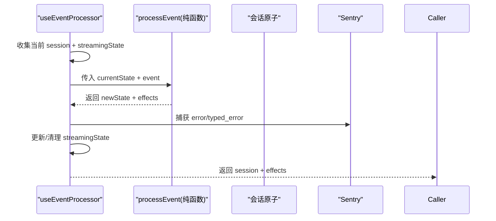

图表来源
- [useEventProcessor.ts:78-131](file://apps/electron/src/renderer/event-processor/useEventProcessor.ts#L78-L131)
- [index.ts:8-40](file://apps/electron/src/renderer/event-processor/index.ts#L8-L40)

章节来源
- [useEventProcessor.ts:1-131](file://apps/electron/src/renderer/event-processor/useEventProcessor.ts#L1-L131)
- [index.ts:1-40](file://apps/electron/src/renderer/event-processor/index.ts#L1-L40)

### 多选与交互：键盘导航与选择同步

#### useMultiSelect 与 useEntityListInteractions
- 设计要点
  - useMultiSelect：纯函数多选状态机（单选、切换、范围、全选、清除）
  - useEntityListInteractions：整合 roving tabindex、键盘导航、鼠标交互、搜索过滤与外部选择存储（如 Jotai）
- 使用场景
  - SessionList 的键盘与鼠标交互，支持 Ctrl/Cmd/Shift 组合键
  - 通过 selectionStore 与 useSessionSelection 共享选择状态

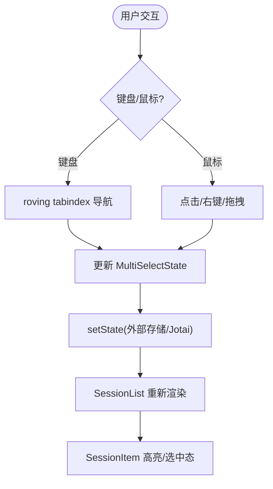

图表来源
- [useMultiSelect.ts:36-129](file://apps/electron/src/renderer/hooks/useMultiSelect.ts#L36-L129)
- [useEntityListInteractions.ts:118-339](file://apps/electron/src/renderer/hooks/useEntityListInteractions.ts#L118-L339)
- [SessionList.tsx:482-502](file://apps/electron/src/renderer/components/app-shell/SessionList.tsx#L482-L502)

章节来源
- [useMultiSelect.ts:1-232](file://apps/electron/src/renderer/hooks/useMultiSelect.ts#L1-L232)
- [useEntityListInteractions.ts:1-339](file://apps/electron/src/renderer/hooks/useEntityListInteractions.ts#L1-L339)
- [SessionList.tsx:482-502](file://apps/electron/src/renderer/components/app-shell/SessionList.tsx#L482-L502)

### 状态同步与 UI 行为

#### 会话消息加载状态推导
- 设计要点
  - deriveSessionMessagesLoadState：综合 loadedFlag、内存消息、预期持久化消息、空会话判定与过期标志，推导 messagesReady/messagesLoading/error
  - shouldTreatSessionLoadFailureAsTransportFallback：远程连接异常时的降级判断
- 使用场景
  - ChatDisplay 根据状态决定显示加载、空状态或错误提示

章节来源
- [session-load.ts:1-87](file://apps/electron/src/renderer/lib/session-load.ts#L1-L87)
- [ChatDisplay.tsx:474-478](file://apps/electron/src/renderer/components/app-shell/ChatDisplay.tsx#L474-L478)

## 依赖关系分析

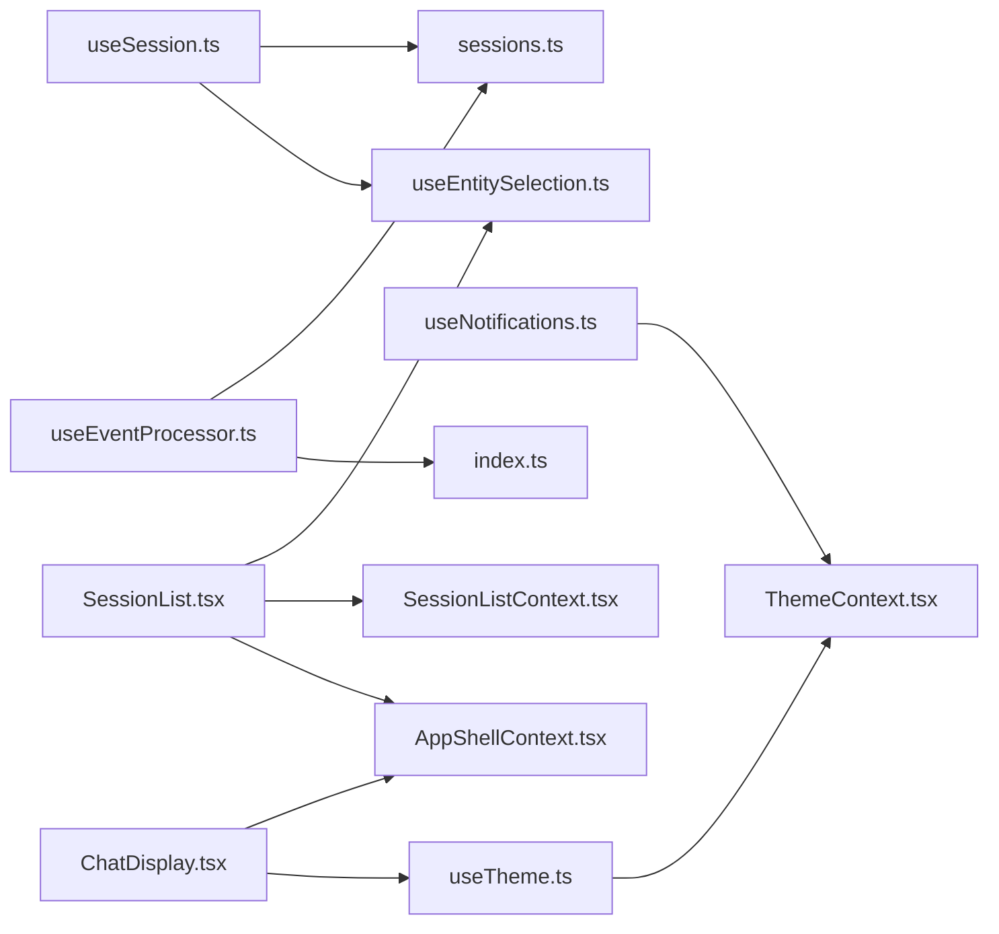

图表来源
- [useSession.ts:1-45](file://apps/electron/src/renderer/hooks/useSession.ts#L1-L45)
- [useNotifications.ts:1-245](file://apps/electron/src/renderer/hooks/useNotifications.ts#L1-L245)
- [useTheme.ts:1-77](file://apps/electron/src/renderer/hooks/useTheme.ts#L1-L77)
- [ThemeContext.tsx:1-536](file://apps/electron/src/renderer/context/ThemeContext.tsx#L1-L536)
- [sessions.ts:1-715](file://apps/electron/src/renderer/atoms/sessions.ts#L1-L715)
- [useEntitySelection.ts:1-107](file://apps/electron/src/renderer/hooks/useEntitySelection.ts#L1-L107)
- [SessionList.tsx:1-788](file://apps/electron/src/renderer/components/app-shell/SessionList.tsx#L1-L788)
- [SessionListContext.tsx:1-51](file://apps/electron/src/renderer/context/SessionListContext.tsx#L1-L51)
- [AppShellContext.tsx:1-282](file://apps/electron/src/renderer/context/AppShellContext.tsx#L1-L282)
- [useEventProcessor.ts:1-131](file://apps/electron/src/renderer/event-processor/useEventProcessor.ts#L1-L131)
- [index.ts:1-40](file://apps/electron/src/renderer/event-processor/index.ts#L1-L40)

章节来源
- [useSession.ts:1-45](file://apps/electron/src/renderer/hooks/useSession.ts#L1-L45)
- [useNotifications.ts:1-245](file://apps/electron/src/renderer/hooks/useNotifications.ts#L1-L245)
- [useTheme.ts:1-77](file://apps/electron/src/renderer/hooks/useTheme.ts#L1-L77)
- [ThemeContext.tsx:1-536](file://apps/electron/src/renderer/context/ThemeContext.tsx#L1-L536)
- [sessions.ts:1-715](file://apps/electron/src/renderer/atoms/sessions.ts#L1-L715)
- [useEntitySelection.ts:1-107](file://apps/electron/src/renderer/hooks/useEntitySelection.ts#L1-L107)
- [SessionList.tsx:1-788](file://apps/electron/src/renderer/components/app-shell/SessionList.tsx#L1-L788)
- [SessionListContext.tsx:1-51](file://apps/electron/src/renderer/context/SessionListContext.tsx#L1-L51)
- [AppShellContext.tsx:1-282](file://apps/electron/src/renderer/context/AppShellContext.tsx#L1-L282)
- [useEventProcessor.ts:1-131](file://apps/electron/src/renderer/event-processor/useEventProcessor.ts#L1-L131)
- [index.ts:1-40](file://apps/electron/src/renderer/event-processor/index.ts#L1-L40)

## 性能考量
- 会话隔离更新
  - 使用 sessionAtomFamily 与 useSession，仅订阅目标会话，避免全量重渲染
  - 通过 loadedSessionsAtom 与懒加载，减少初始内存占用
- 纯函数事件处理
  - processEvent 保持无副作用，副作用在 useEventProcessor 中处理，便于测试与回溯
- DOM 注入与主题同步
  - ThemeProvider 一次性注入 CSS 变量与类名，避免频繁重排
- 选择状态共享
  - useEntitySelection + useEntityListInteractions 将选择状态与交互解耦，减少重复计算

## 故障排查指南
- 通知未显示或徽章未更新
  - 检查 hasGuiChannels 与 window.electronAPI 可用性
  - 确认窗口聚焦状态与工作区 ID
  - Canvas 绘制失败会在控制台输出错误，检查图标数据与尺寸
- 主题不生效或跨窗口不同步
  - 确认 ThemeProvider 已正确注入，且广播主题偏好成功
  - 检查系统主题监听与持久化存储
- 会话消息加载卡住
  - 查看 messagesLoaded 与 loadedSessionsAtom 状态
  - 使用 deriveSessionMessagesLoadState 判断 ready/loading/error
  - 如为远程连接异常，参考 shouldTreatSessionLoadFailureAsTransportFallback 的降级策略
- 事件处理异常
  - 检查 useEventProcessor 的 streamingState 是否被正确清理
  - 关注 Sentry 上报的 error/typed_error 事件详情

章节来源
- [useNotifications.ts:144-218](file://apps/electron/src/renderer/hooks/useNotifications.ts#L144-L218)
- [ThemeContext.tsx:412-434](file://apps/electron/src/renderer/context/ThemeContext.tsx#L412-L434)
- [session-load.ts:35-87](file://apps/electron/src/renderer/lib/session-load.ts#L35-L87)
- [useEventProcessor.ts:117-129](file://apps/electron/src/renderer/event-processor/useEventProcessor.ts#L117-L129)

## 结论
该应用通过“Hook + Context + Jotai + 事件处理器”的组合，实现了清晰的组件通信与状态管理：
- 父子组件通信以 props/回调为主，简单直接
- 兄弟组件通过父组件提供的 Context 进行协作
- 跨层级通信通过 Context 提供统一入口，避免深层 props 下传
- 全局状态通过 Jotai 原子族实现按需订阅与隔离更新
- 事件系统以纯函数处理，副作用集中管理，提升可维护性与可测试性

## 附录
- 通信模式选择原则
  - 父子通信：就近 props/回调，避免过度抽象
  - 兄弟通信：通过父组件协调，必要时引入 Context
  - 跨层级通信：优先 Context，仅在需要强约束时使用 Provider
  - 全局状态：优先 Jotai 原子族，按领域拆分，避免全局大对象
- 性能优化建议
  - 使用 useAtomValue 与按会话隔离原子，减少不必要的订阅
  - 事件处理保持纯函数，副作用集中处理
  - DOM 注入与主题切换在单一位置完成，避免重复渲染
- 可维护性设计
  - Hook 职责单一，暴露明确的输入/输出
  - Context 仅承载共享数据与回调，不包含业务逻辑
  - 事件处理器模块化，便于测试与扩展