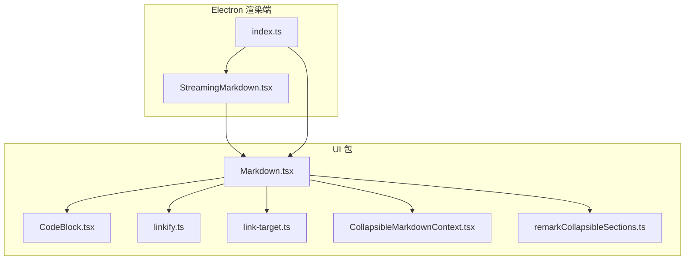
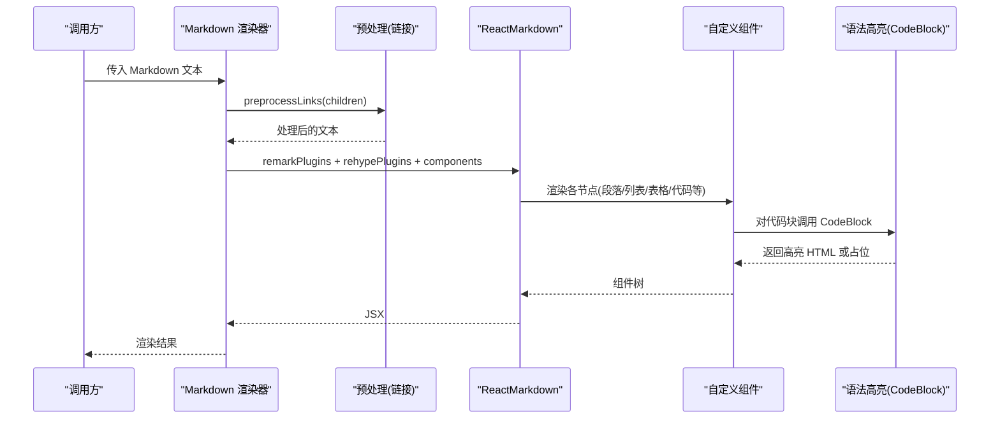
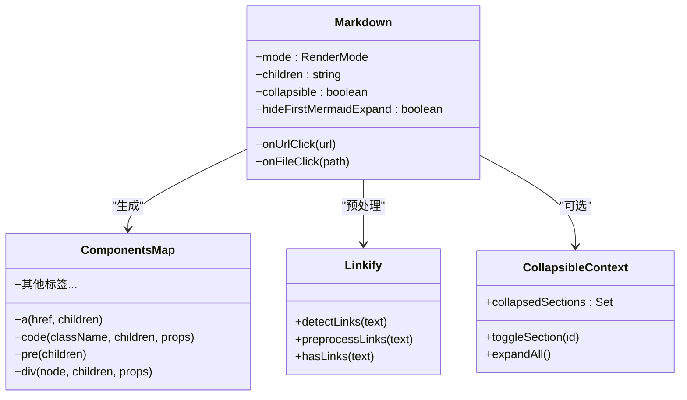
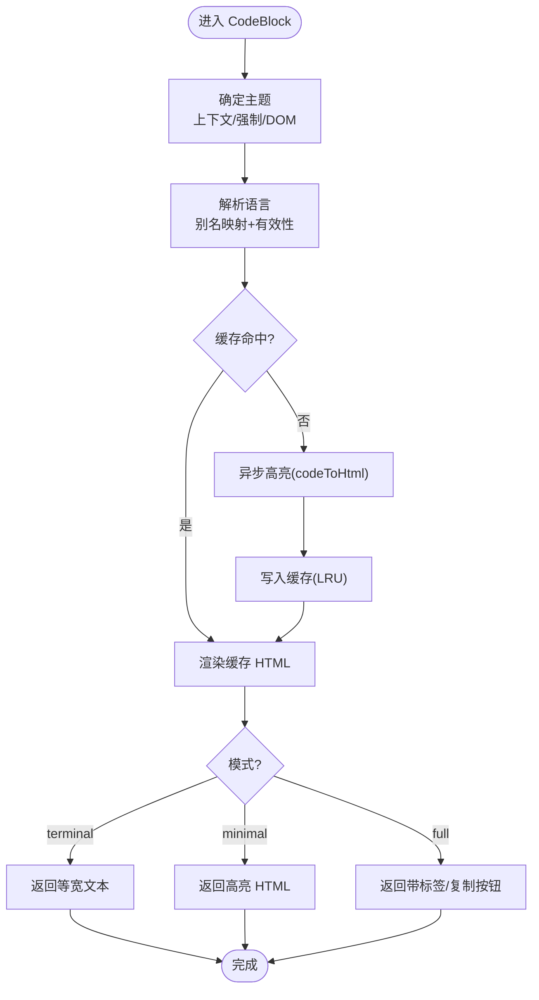
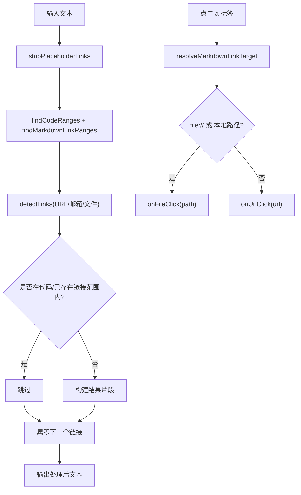
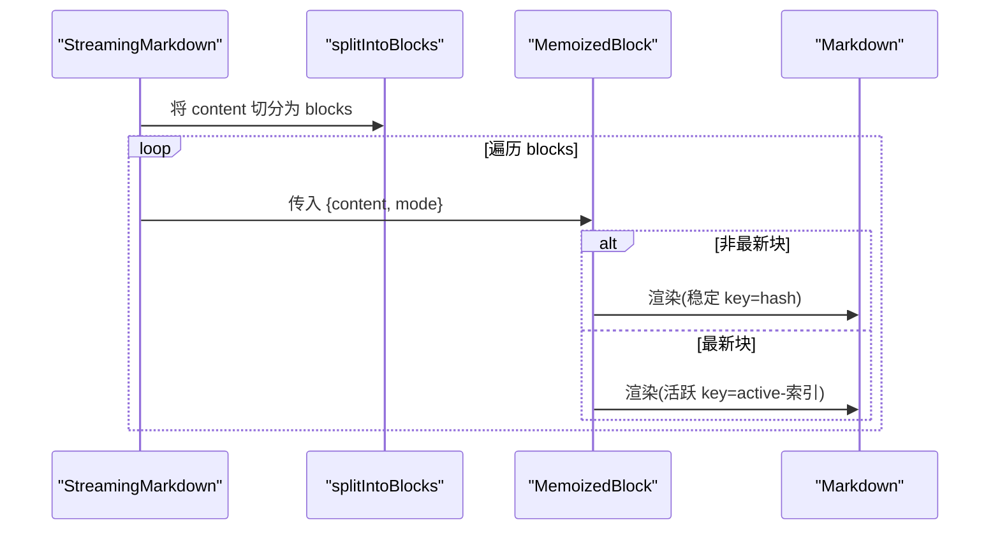
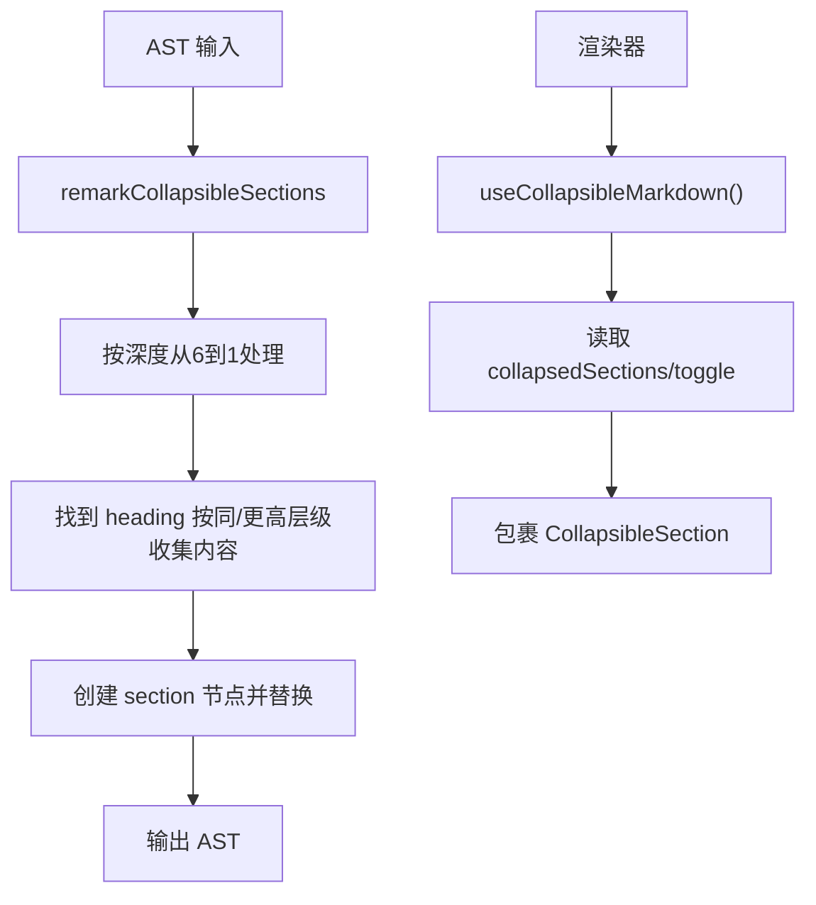
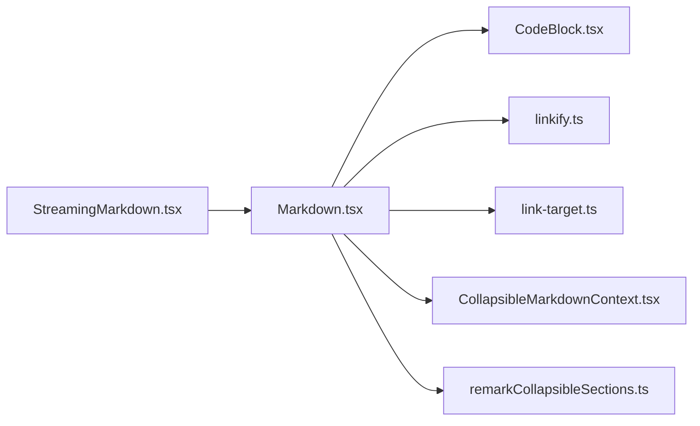

# Markdown 组件

<cite>
**本文引用的文件**
- [Markdown.tsx](file://packages/ui/src/components/markdown/Markdown.tsx)
- [CodeBlock.tsx](file://packages/ui/src/components/markdown/CodeBlock.tsx)
- [linkify.ts](file://packages/ui/src/components/markdown/linkify.ts)
- [link-target.ts](file://packages/ui/src/components/markdown/link-target.ts)
- [CollapsibleMarkdownContext.tsx](file://packages/ui/src/components/markdown/CollapsibleMarkdownContext.tsx)
- [remarkCollapsibleSections.ts](file://packages/ui/src/components/markdown/remarkCollapsibleSections.ts)
- [StreamingMarkdown.tsx](file://apps/electron/src/renderer/components/markdown/StreamingMarkdown.tsx)
- [index.ts](file://apps/electron/src/renderer/components/markdown/index.ts)
</cite>

## 目录
1. [简介](#简介)
2. [项目结构](#项目结构)
3. [核心组件](#核心组件)
4. [架构总览](#架构总览)
5. [详细组件分析](#详细组件分析)
6. [依赖关系分析](#依赖关系分析)
7. [性能考量](#性能考量)
8. [故障排查指南](#故障排查指南)
9. [结论](#结论)
10. [附录](#附录)

## 简介
本文件为 Markdown 组件的开发与使用文档，覆盖渲染器、代码编辑器（预览）、语法高亮、流式渲染与增量更新、链接解析与点击路由、可折叠章节、以及性能优化与错误处理策略。目标读者为内容编辑与展示功能的开发者，提供从架构到实现细节、从配置到定制的完整指南。

## 项目结构
Markdown 组件主要位于 packages/ui 的 markdown 子目录，并在 Electron 渲染端提供一个针对流式场景的增强组件。核心文件包括：
- 渲染器：Markdown.tsx
- 代码高亮：CodeBlock.tsx
- 链接预处理与路由：linkify.ts、link-target.ts
- 可折叠章节上下文与插件：CollapsibleMarkdownContext.tsx、remarkCollapsibleSections.ts
- 流式渲染增强：StreamingMarkdown.tsx（Electron 渲染端）



**图表来源**
- [Markdown.tsx:1-599](file://packages/ui/src/components/markdown/Markdown.tsx#L1-L599)
- [CodeBlock.tsx:1-235](file://packages/ui/src/components/markdown/CodeBlock.tsx#L1-L235)
- [linkify.ts:1-285](file://packages/ui/src/components/markdown/linkify.ts#L1-L285)
- [link-target.ts:1-60](file://packages/ui/src/components/markdown/link-target.ts#L1-L60)
- [CollapsibleMarkdownContext.tsx:1-62](file://packages/ui/src/components/markdown/CollapsibleMarkdownContext.tsx#L1-L62)
- [remarkCollapsibleSections.ts:1-130](file://packages/ui/src/components/markdown/remarkCollapsibleSections.ts#L1-L130)
- [StreamingMarkdown.tsx:1-186](file://apps/electron/src/renderer/components/markdown/StreamingMarkdown.tsx#L1-L186)
- [index.ts:1-6](file://apps/electron/src/renderer/components/markdown/index.ts#L1-L6)

**章节来源**
- [Markdown.tsx:1-599](file://packages/ui/src/components/markdown/Markdown.tsx#L1-L599)
- [StreamingMarkdown.tsx:1-186](file://apps/electron/src/renderer/components/markdown/StreamingMarkdown.tsx#L1-L186)
- [index.ts:1-6](file://apps/electron/src/renderer/components/markdown/index.ts#L1-L6)

## 核心组件
- Markdown 渲染器：支持三种渲染模式（terminal/minimal/full），集成 GFM、数学公式、可折叠章节、内联/块级代码高亮、图片/PDF/HTML/表格等扩展块。
- 代码高亮组件：基于 Shiki 的语法高亮，支持缓存、主题优先级、复制按钮、多语言别名映射。
- 链接预处理与路由：自动识别 URL、邮箱、本地路径，避免误连；点击时区分文件路径与 URL 并路由到回调。
- 流式渲染增强：按段落与代码块切分，仅对最新块重渲染，提升大文本流式体验。
- 可折叠章节：通过 remark 插件与上下文管理，实现标题+内容组的可折叠区块。

**章节来源**
- [Markdown.tsx:27-74](file://packages/ui/src/components/markdown/Markdown.tsx#L27-L74)
- [CodeBlock.tsx:6-21](file://packages/ui/src/components/markdown/CodeBlock.tsx#L6-L21)
- [linkify.ts:11-26](file://packages/ui/src/components/markdown/linkify.ts#L11-L26)
- [link-target.ts:3-6](file://packages/ui/src/components/markdown/link-target.ts#L3-L6)
- [StreamingMarkdown.tsx:123-186](file://apps/electron/src/renderer/components/markdown/StreamingMarkdown.tsx#L123-L186)
- [CollapsibleMarkdownContext.tsx:12-20](file://packages/ui/src/components/markdown/CollapsibleMarkdownContext.tsx#L12-L20)

## 架构总览
Markdown 渲染链路由“预处理 → 解析 → 自定义组件映射 → 输出”构成。渲染器根据模式选择组件集，插入代码高亮、扩展块、可折叠章节等。流式渲染通过块级拆分与稳定 key 实现增量更新。



**图表来源**
- [Markdown.tsx:535-567](file://packages/ui/src/components/markdown/Markdown.tsx#L535-L567)
- [linkify.ts:228-268](file://packages/ui/src/components/markdown/linkify.ts#L228-L268)
- [CodeBlock.tsx:77-140](file://packages/ui/src/components/markdown/CodeBlock.tsx#L77-L140)

## 详细组件分析

### Markdown 渲染器
- 渲染模式
  - terminal：极简格式，保留控制字符，适合日志/调试。
  - minimal：干净排版，内置语法高亮与交互扩展块（JSON、表格、PDF、HTML、图片、Mermaid、LaTeX）。
  - full：富排版，表格带边框、悬停态、更丰富的样式。
- 扩展语法
  - GFM（表格、任务列表、删除线）
  - 数学公式（KaTeX，禁用单美元行内数学以避免误判货币）
  - 可折叠章节（需包裹 CollapsibleMarkdownProvider）
- 自定义组件映射
  - 链接点击：统一解析为文件路径或 URL，分别触发 onFileClick/onUrlClick。
  - 代码块：根据语言与模式渲染 CodeBlock 或扩展块；内联代码使用 InlineCode。
  - 表格/列表/标题/引用/水平线/强弱/删除线等按模式定制样式。
- 性能优化
  - MemoizedMarkdown：基于 id 或 children+mode 的浅比较，避免重复解析。
  - 预处理链接：跳过代码块与已存在链接范围，减少无意义转换。



**图表来源**
- [Markdown.tsx:103-492](file://packages/ui/src/components/markdown/Markdown.tsx#L103-L492)
- [linkify.ts:123-268](file://packages/ui/src/components/markdown/linkify.ts#L123-L268)
- [CollapsibleMarkdownContext.tsx:32-61](file://packages/ui/src/components/markdown/CollapsibleMarkdownContext.tsx#L32-L61)

**章节来源**
- [Markdown.tsx:27-74](file://packages/ui/src/components/markdown/Markdown.tsx#L27-L74)
- [Markdown.tsx:504-568](file://packages/ui/src/components/markdown/Markdown.tsx#L504-L568)
- [Markdown.tsx:576-594](file://packages/ui/src/components/markdown/Markdown.tsx#L576-L594)

### 代码高亮组件（CodeBlock）
- 主题优先级：上下文主题（ShikiThemeProvider） > 强制主题（forcedTheme） > DOM 检测（暗/亮）。
- 语言解析：别名映射 + 语言有效性校验，无效语言回退为纯文本。
- 缓存策略：LRU 缓存（最大容量），键为 theme:lang:code，命中直接渲染。
- 模式差异：
  - terminal：原生等宽字体，不注入额外样式。
  - minimal：仅注入高亮 HTML，保持最小开销。
  - full：带语言标签与复制按钮，支持 hover 显隐。
- 错误处理：高亮失败时降级为原始文本并告警。



**图表来源**
- [CodeBlock.tsx:77-140](file://packages/ui/src/components/markdown/CodeBlock.tsx#L77-L140)
- [CodeBlock.tsx:152-219](file://packages/ui/src/components/markdown/CodeBlock.tsx#L152-L219)

**章节来源**
- [CodeBlock.tsx:6-21](file://packages/ui/src/components/markdown/CodeBlock.tsx#L6-L21)
- [CodeBlock.tsx:45-56](file://packages/ui/src/components/markdown/CodeBlock.tsx#L45-L56)
- [CodeBlock.tsx:77-140](file://packages/ui/src/components/markdown/CodeBlock.tsx#L77-L140)
- [CodeBlock.tsx:152-219](file://packages/ui/src/components/markdown/CodeBlock.tsx#L152-L219)

### 链接预处理与点击路由
- 预处理流程
  - 去除占位/伪造 URL 的 Markdown 链接（如 GitHub 占位），还原为纯文本。
  - 使用 linkify-it 检测 URL/邮箱；使用正则检测本地文件路径。
  - 跳过代码块与已有 Markdown 链接范围，避免重复包裹。
- 点击路由
  - file:// URL 解析为本地路径；纯路径字符串按文件规则判定；其余作为 URL。
  - 分发到 onFileClick 或 onUrlClick 回调，便于应用层打开资源或浏览器。



**图表来源**
- [linkify.ts:205-268](file://packages/ui/src/components/markdown/linkify.ts#L205-L268)
- [link-target.ts:39-52](file://packages/ui/src/components/markdown/link-target.ts#L39-L52)

**章节来源**
- [linkify.ts:228-268](file://packages/ui/src/components/markdown/linkify.ts#L228-L268)
- [link-target.ts:3-6](file://packages/ui/src/components/markdown/link-target.ts#L3-L6)
- [link-target.ts:39-52](file://packages/ui/src/components/markdown/link-target.ts#L39-L52)

### 流式渲染机制与增量更新（StreamingMarkdown）
- 切分策略
  - 按双换行符与代码围栏（```）划分块；未闭合代码块视为“正在流式中”。
  - 已完成块使用内容哈希作为 React key，保证稳定身份，避免重渲染。
  - 最新块使用“active-索引”作为 key，确保每次变更都重新渲染。
- 渲染策略
  - 非流式：直接交给 Markdown 渲染。
  - 流式：逐块渲染，MemoizedBlock 仅在内容变化时更新。
- 性能收益
  - 大文本增量更新，避免整段重解析与重绘；块级 memo 提升滚动与长文本体验。



**图表来源**
- [StreamingMarkdown.tsx](file://apps/electron/src/renderer/components/markdown/StreamingMarkdown.tsx#L38-L92)
- [StreamingMarkdown.tsx](file://apps/electron/src/renderer/components/markdown/StreamingMarkdown.tsx#L101-L121)
- [StreamingMarkdown.tsx](file://apps/electron/src/renderer/components/markdown/StreamingMarkdown.tsx#L139-L186)

**章节来源**
- [StreamingMarkdown.tsx](file://apps/electron/src/renderer/components/markdown/StreamingMarkdown.tsx#L12-L27)
- [StreamingMarkdown.tsx](file://apps/electron/src/renderer/components/markdown/StreamingMarkdown.tsx#L38-L92)
- [StreamingMarkdown.tsx](file://apps/electron/src/renderer/components/markdown/StreamingMarkdown.tsx#L101-L121)
- [StreamingMarkdown.tsx](file://apps/electron/src/renderer/components/markdown/StreamingMarkdown.tsx#L139-L186)

### 可折叠章节（Collapsible Sections）
- 插件逻辑
  - remark 插件遍历 AST，按标题层级收集内容，包装为自定义 section 节点。
  - 从最深到最浅处理，确保嵌套正确。
- 上下文管理
  - Provider 维护 collapsedSections 集合，暴露 toggle 与 expandAll。
  - 渲染器在创建组件时读取上下文，决定是否包裹 CollapsibleSection。



**图表来源**
- [remarkCollapsibleSections.ts](file://packages/ui/src/components/markdown/remarkCollapsibleSections.ts#L43-L127)
- [CollapsibleMarkdownContext.tsx](file://packages/ui/src/components/markdown/CollapsibleMarkdownContext.tsx#L32-L61)

**章节来源**
- [remarkCollapsibleSections.ts](file://packages/ui/src/components/markdown/remarkCollapsibleSections.ts#L1-L130)
- [CollapsibleMarkdownContext.tsx](file://packages/ui/src/components/markdown/CollapsibleMarkdownContext.tsx#L1-L62)
- [Markdown.tsx](file://packages/ui/src/components/markdown/Markdown.tsx#L137-L159)

### 代码编辑器与实时预览（概念性说明）
- 该仓库未提供专用“代码编辑器”组件；但可通过以下方式实现“编辑 + 预览”：
  - 使用受控 textarea 或编辑器（如 Monaco/CodeMirror）绑定 onChange。
  - 将输入文本传入 Markdown/MemoizedMarkdown 进行实时预览。
  - 若需语法验证，可在 onChange 后进行轻量校验（如检查代码块闭合、链接格式）。
  - 若需主题适配，通过 ShikiThemeProvider 设置主题，或在 CodeBlock 上使用 forcedTheme 覆盖。
- 注意事项
  - 预览组件已内置链接识别与路由；若编辑器支持粘贴文件路径，建议在 onFileClick 中统一处理。
  - 对于长文本，建议结合 MemoizedMarkdown 与节流策略，避免频繁重渲染。

[本节为概念性指导，不直接分析具体源码文件]

## 依赖关系分析
- 内部依赖
  - Markdown.tsx 依赖 CodeBlock、linkify、link-target、CollapsibleMarkdownContext、remarkCollapsibleSections。
  - StreamingMarkdown.tsx 依赖 Markdown.tsx 与简单块切分算法。
- 外部依赖
  - react-markdown、remark-GFM、remark-math、rehype-KaTeX、rehype-raw、unified、unist-util-visit、Shiki（codeToHtml）。
- 关系图



**图表来源**
- [Markdown.tsx:1-26](file://packages/ui/src/components/markdown/Markdown.tsx#L1-L26)
- [StreamingMarkdown.tsx:1-2](file://apps/electron/src/renderer/components/markdown/StreamingMarkdown.tsx#L1-L2)

**章节来源**
- [Markdown.tsx:1-26](file://packages/ui/src/components/markdown/Markdown.tsx#L1-L26)
- [StreamingMarkdown.tsx:1-2](file://apps/electron/src/renderer/components/markdown/StreamingMarkdown.tsx#L1-L2)

## 性能考量
- 渲染性能
  - MemoizedMarkdown：基于 id 或 children+mode 的浅比较，避免重复解析。
  - 预处理链接：hasLinks 快速判断，避免不必要的扫描。
  - 代码高亮缓存：LRU 缓存减少重复高亮开销。
- 流式渲染
  - 块级拆分 + 稳定 key：仅最新块重渲染，大幅降低滚动与长文本更新成本。
- 内存管理
  - LRU 缓存上限固定，超出时淘汰最旧项，避免无限增长。
  - 组件卸载时清理取消标志，防止竞态与内存泄漏。
- 其他
  - 模式切换：terminal/minimal/full 选择不同组件集，按需渲染，减少 DOM 结构复杂度。

**章节来源**
- [Markdown.tsx:576-594](file://packages/ui/src/components/markdown/Markdown.tsx#L576-L594)
- [linkify.ts:274-276](file://packages/ui/src/components/markdown/linkify.ts#L274-L276)
- [CodeBlock.tsx:45-51](file://packages/ui/src/components/markdown/CodeBlock.tsx#L45-L51)
- [CodeBlock.tsx:114-119](file://packages/ui/src/components/markdown/CodeBlock.tsx#L114-L119)
- [StreamingMarkdown.tsx:146-151](file://apps/electron/src/renderer/components/markdown/StreamingMarkdown.tsx#L146-L151)

## 故障排查指南
- 代码高亮失败
  - 现象：代码块显示为原始文本。
  - 排查：确认语言名称是否有效；查看控制台警告；尝试 forcedTheme 或切换上下文主题。
  - 参考
    - [CodeBlock.tsx:125-132](file://packages/ui/src/components/markdown/CodeBlock.tsx#L125-L132)
- 链接未被识别或误识别
  - 现象：URL/文件路径未转为链接，或被错误包裹。
  - 排查：确认文本中是否包含代码块或已存在链接；检查 linkify-it 配置与文件扩展匹配。
  - 参考
    - [linkify.ts:228-268](file://packages/ui/src/components/markdown/linkify.ts#L228-L268)
- 点击无响应或路由错误
  - 现象：点击链接无动作或打开错误目标。
  - 排查：onFileClick/onUrlClick 是否实现；file:// URL 是否正确解析；本地路径是否符合 isFilePathTarget 规则。
  - 参考
    - [Markdown.tsx:160-192](file://packages/ui/src/components/markdown/Markdown.tsx#L160-L192)
    - [link-target.ts:39-52](file://packages/ui/src/components/markdown/link-target.ts#L39-L52)
- 流式渲染卡顿
  - 现象：长文本滚动或增量更新卡顿。
  - 排查：确认 isStreaming=true 且内容确实被切分为多个块；避免在 children 中频繁改变 id 导致整体重渲染。
  - 参考
    - [StreamingMarkdown.tsx:139-186](file://apps/electron/src/renderer/components/markdown/StreamingMarkdown.tsx#L139-L186)
    - [Markdown.tsx:576-594](file://packages/ui/src/components/markdown/Markdown.tsx#L576-L594)

**章节来源**
- [CodeBlock.tsx:125-132](file://packages/ui/src/components/markdown/CodeBlock.tsx#L125-L132)
- [linkify.ts:228-268](file://packages/ui/src/components/markdown/linkify.ts#L228-L268)
- [link-target.ts:39-52](file://packages/ui/src/components/markdown/link-target.ts#L39-L52)
- [StreamingMarkdown.tsx:139-186](file://apps/electron/src/renderer/components/markdown/StreamingMarkdown.tsx#L139-L186)
- [Markdown.tsx:576-594](file://packages/ui/src/components/markdown/Markdown.tsx#L576-L594)

## 结论
本组件体系以“可配置渲染模式 + 代码高亮 + 链接路由 + 可折叠章节 + 流式增量渲染”为核心，兼顾可读性、可扩展性与性能。通过 MemoizedMarkdown、LRU 缓存与块级拆分，显著优化了长文本与实时预览场景下的用户体验。开发者可在此基础上快速扩展自定义渲染器、主题与交互能力。

## 附录
- 使用示例与定制指南（路径指引）
  - 基础渲染与模式切换
    - [Markdown.tsx:504-568](file://packages/ui/src/components/markdown/Markdown.tsx#L504-L568)
  - 代码高亮与主题
    - [CodeBlock.tsx:64-140](file://packages/ui/src/components/markdown/CodeBlock.tsx#L64-L140)
  - 链接预处理与点击路由
    - [linkify.ts:228-268](file://packages/ui/src/components/markdown/linkify.ts#L228-L268)
    - [link-target.ts:39-52](file://packages/ui/src/components/markdown/link-target.ts#L39-L52)
  - 流式渲染与增量更新
    - [StreamingMarkdown.tsx:139-186](file://apps/electron/src/renderer/components/markdown/StreamingMarkdown.tsx#L139-L186)
  - 可折叠章节
    - [remarkCollapsibleSections.ts:43-127](file://packages/ui/src/components/markdown/remarkCollapsibleSections.ts#L43-L127)
    - [CollapsibleMarkdownContext.tsx:32-61](file://packages/ui/src/components/markdown/CollapsibleMarkdownContext.tsx#L32-L61)
  - Electron 渲染端导出入口
    - [index.ts:1-6](file://apps/electron/src/renderer/components/markdown/index.ts#L1-L6)