# UI 组件库

<cite>
**本文引用的文件**   
- [packages/ui/package.json](file://packages/ui/package.json)
- [packages/ui/src/index.ts](file://packages/ui/src/index.ts)
- [packages/ui/src/styles/index.css](file://packages/ui/src/styles/index.css)
- [packages/ui/src/components/ui/index.ts](file://packages/ui/src/components/ui/index.ts)
- [packages/ui/src/components/chat/index.ts](file://packages/ui/src/components/chat/index.ts)
- [packages/ui/src/components/markdown/index.ts](file://packages/ui/src/components/markdown/index.ts)
- [packages/ui/src/lib/utils.ts](file://packages/ui/src/lib/utils.ts)
- [packages/ui/src/components/ui/drawer.tsx](file://packages/ui/src/components/ui/drawer.tsx)
- [apps/electron/src/renderer/components/app-shell/input/CompactModelSelector.tsx](file://apps/electron/src/renderer/components/app-shell/input/CompactModelSelector.tsx)
- [apps/electron/src/renderer/components/app-shell/input/CompactPermissionModeSelector.tsx](file://apps/electron/src/renderer/components/app-shell/input/CompactPermissionModeSelector.tsx)
- [apps/electron/src/renderer/components/app-shell/CompactWorkspaceSwitcher.tsx](file://apps/electron/src/renderer/components/app-shell/CompactWorkspaceSwitcher.tsx)
- [apps/electron/src/renderer/components/app-shell/input/ChatInputZone.tsx](file://apps/electron/src/renderer/components/app-shell/input/ChatInputZone.tsx)
- [apps/electron/src/renderer/components/app-shell/input/InputContainer.tsx](file://apps/electron/src/renderer/components/app-shell/input/InputContainer.tsx)
- [apps/electron/src/renderer/components/app-shell/input/picker-mode.ts](file://apps/electron/src/renderer/components/app-shell/input/picker-mode.ts)
- [apps/electron/src/renderer/components/app-shell/input/model-picker-helpers.ts](file://apps/electron/src/renderer/components/app-shell/input/model-picker-helpers.ts)
- [apps/electron/src/renderer/components/app-shell/input/useModelVisionToggle.ts](file://apps/electron/src/renderer/components/app-shell/input/useModelVisionToggle.ts)
</cite>

## 目录
1. [简介](#简介)
2. [项目结构](#项目结构)
3. [核心组件](#核心组件)
4. [架构总览](#架构总览)
5. [组件详解](#组件详解)
6. [紧凑模式系统](#紧凑模式系统)
7. [依赖关系分析](#依赖关系分析)
8. [性能考量](#性能考量)
9. [故障排查指南](#故障排查指南)
10. [结论](#结论)
11. [附录](#附录)

## 简介
本文件为 UI 组件库的开发与使用文档，聚焦于基于 shadcn/ui 与 Tailwind CSS v4 的组合使用模式，系统阐述组件设计原则、样式系统架构与工程化实践。文档覆盖基础组件（如按钮、输入、对话框等）在本仓库中的对应能力与扩展点，解释组件复用策略、主题适配、响应式设计、无障碍性支持与性能优化方法，并提供组件开发规范、样式定制指南与第三方集成模式，帮助 UI 开发者与设计师高效构建一致、可维护的设计系统。

**更新** 新增紧凑模式抽屉系统、紧凑模型选择器、紧凑工作目录选择器等新组件，以及改进的聊天输入功能和紧凑接受计划抽屉。

## 项目结构
该 UI 包位于 packages/ui，采用"按功能域导出"的组织方式：通过根入口统一导出上下文、聊天组件、Markdown 渲染、UI 原语、提示工具、代码查看器、终端输出、覆盖层组件、文件分类、工具函数与布局常量等模块；样式系统以 Tailwind CSS v4 主题变量为核心，提供明暗两套色值与阴影、字体、间距等设计令牌。

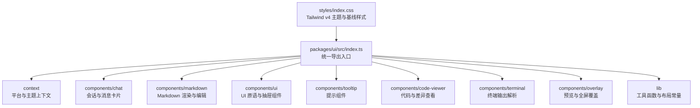

图表来源
- [packages/ui/src/index.ts:1-288](file://packages/ui/src/index.ts#L1-L288)
- [packages/ui/src/styles/index.css:1-550](file://packages/ui/src/styles/index.css#L1-L550)

章节来源
- [packages/ui/src/index.ts:1-288](file://packages/ui/src/index.ts#L1-L288)
- [packages/ui/src/styles/index.css:1-550](file://packages/ui/src/styles/index.css#L1-L550)

## 核心组件
- 上下文与平台抽象：提供平台注入与主题切换能力，支撑跨平台渲染一致性。
- 聊天组件：会话查看器、消息卡片、操作菜单、内联执行等，用于展示与交互会话内容。
- Markdown 组件：渲染器、代码块、可折叠段落、富文本编辑器等，满足多形态内容呈现。
- UI 原语：加载指示器、简单下拉、预览头部、样式化下拉菜单、可过滤选择弹窗、岛屿式容器等。
- 抽屉组件：基于 vaul 的抽屉系统，提供紧凑模式下的底部抽屉界面。
- 提示工具：Tooltip 及其 Provider，提供轻量信息提示。
- 代码与终端：代码查看器、差异对比、ANSI 解析与高亮。
- 覆盖层：通用预览覆盖、代码/JSON/表格/PDF/图片等专用覆盖层。
- 工具与布局：类名合并工具、布局常量与钩子、文件类型识别等。

章节来源
- [packages/ui/src/index.ts:17-288](file://packages/ui/src/index.ts#L17-L288)

## 架构总览
本组件库遵循"主题驱动 + 组合优先"的架构：以 Tailwind CSS v4 的设计令牌作为视觉语言，结合 shadcn/ui 风格的样式化组件，形成统一的 UI 原语与复合组件体系。组件通过 props 与上下文进行行为与外观控制，同时提供可插拔的第三方扩展点（如 Markdown 引擎、代码高亮、数学公式渲染等）。

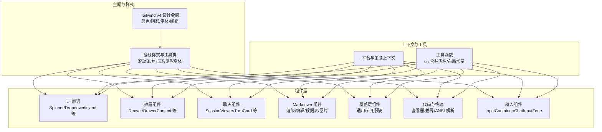

图表来源
- [packages/ui/src/styles/index.css:223-276](file://packages/ui/src/styles/index.css#L223-L276)
- [packages/ui/src/index.ts:17-288](file://packages/ui/src/index.ts#L17-L288)

## 组件详解

### 样式系统与主题架构
- 设计令牌：采用六色系统（背景、前景、强调色、信息、成功、破坏），并提供透明度与混合变体，确保明暗模式下的对比度与层次感。
- 阴影系统：内置多种阴影变体（最小、中间、中型、英雄、带色阴影、模态小阴影等），通过 CSS 变量与 @layer 机制统一管理。
- 字体与字号：系统字体与等宽字体分离，支持 Inter 字体选项与光学尺寸特性。
- z-index 规范：为面板、下拉、提示、模态、覆盖层、浮动菜单等建立清晰层级，避免层级冲突。
- 组件令牌：为特定组件（如用户消息气泡）定义专用令牌，便于主题化与一致性。

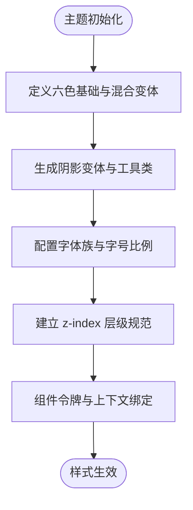

图表来源
- [packages/ui/src/styles/index.css:33-208](file://packages/ui/src/styles/index.css#L33-L208)
- [packages/ui/src/styles/index.css:223-276](file://packages/ui/src/styles/index.css#L223-L276)

章节来源
- [packages/ui/src/styles/index.css:1-550](file://packages/ui/src/styles/index.css#L1-L550)

### UI 原语（UI Primitives）
- 加载指示器：网格动画加载器，继承字体大小与颜色，适合细粒度状态反馈。
- 简单下拉与菜单：提供基础下拉与样式化菜单项、分隔符、快捷键显示，配合上下文菜单与下拉菜单组件使用。
- 预览头部与徽章：用于卡片或面板头部展示，支持多种徽章变体。
- 可过滤选择弹窗：支持筛选与渲染状态，适用于多选项场景。
- 岛屿式容器：提供视图切换、锚点定位、过渡配置等能力，用于复杂交互的局部容器。

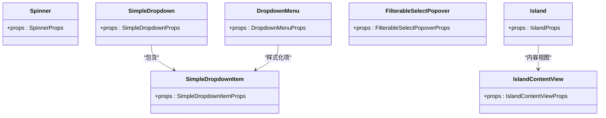

图表来源
- [packages/ui/src/components/ui/index.ts:5-64](file://packages/ui/src/components/ui/index.ts#L5-L64)

章节来源
- [packages/ui/src/components/ui/index.ts:1-64](file://packages/ui/src/components/ui/index.ts#L1-L64)

### 抽屉组件（Drawer）
- 抽屉系统：基于 vaul 实现的抽屉组件，支持顶部、底部、左侧、右侧四种方向，提供平滑的动画过渡效果。
- 抽屉触发器：可作为任何元素的触发器，点击后展开对应的抽屉内容。
- 抽屉内容：支持自定义覆盖层和内容区域，提供标题、描述等标准结构。
- 紧凑模式适配：专为移动端和窄屏设计，提供触控友好的交互体验。

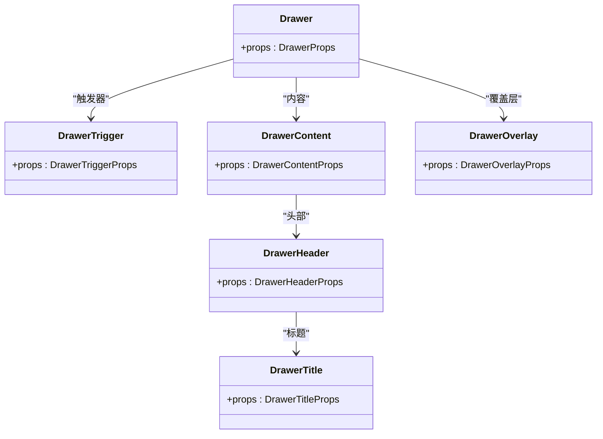

图表来源
- [packages/ui/src/components/ui/drawer.tsx:1-137](file://packages/ui/src/components/ui/drawer.tsx#L1-L137)

章节来源
- [packages/ui/src/components/ui/drawer.tsx:1-137](file://packages/ui/src/components/ui/drawer.tsx#L1-L137)

### 聊天组件（Chat）
- 会话查看器：用于只读会话转录浏览，支持不同模式与布局。
- 消息卡片：邮件式布局的消息展示，包含响应卡片、用户消息气泡、系统消息等。
- 内联执行：用于展示工具调用与活动状态，支持映射工具事件到活动项。
- 操作菜单：针对消息卡片的操作集合，支持上下文菜单风格。

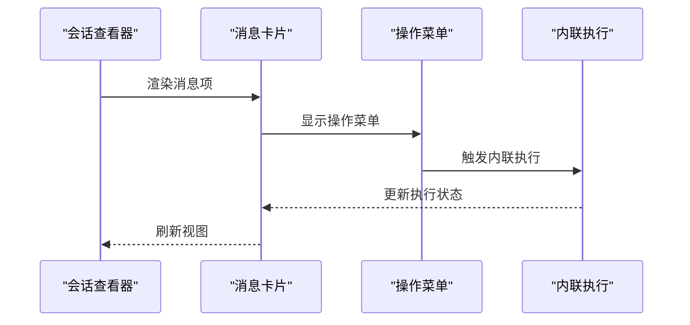

图表来源
- [packages/ui/src/components/chat/index.ts:9-22](file://packages/ui/src/components/chat/index.ts#L9-L22)

章节来源
- [packages/ui/src/components/chat/index.ts:1-22](file://packages/ui/src/components/chat/index.ts#L1-L22)

### Markdown 组件（Markdown）
- 渲染器：支持多种渲染模式，结合语法高亮与数学公式渲染。
- 代码块与行内代码：提供高亮与复制能力。
- 可折叠段落：支持折叠/展开，提升长文档可读性。
- 数据表与电子表格：表格与电子表格块，支持交互与格式化。
- 图片块与图片堆栈：图片展示与堆叠布局。
- 富文本编辑器：基于 Tiptap 的 Markdown 编辑器，支持引擎选择与扩展。

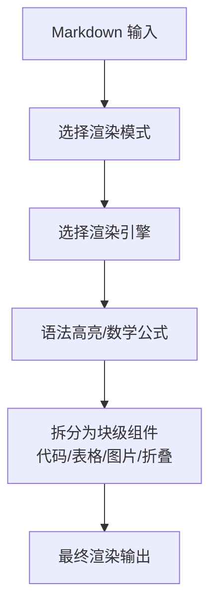

图表来源
- [packages/ui/src/components/markdown/index.ts:1-15](file://packages/ui/src/components/markdown/index.ts#L1-L15)

章节来源
- [packages/ui/src/components/markdown/index.ts:1-15](file://packages/ui/src/components/markdown/index.ts#L1-L15)

### 覆盖层组件（Overlay）
- 通用覆盖层：提供标题栏、内容框架、复制按钮等基础能力。
- 专用覆盖层：代码、多差异、终端、JSON、数据表、Markdown 文档、图片、PDF 等。
- 活动卡片覆盖层：用于展示工具活动卡片与状态。

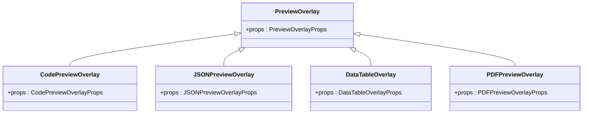

图表来源
- [packages/ui/src/index.ts:184-224](file://packages/ui/src/index.ts#L184-L224)

章节来源
- [packages/ui/src/index.ts:184-224](file://packages/ui/src/index.ts#L184-L224)

### 代码与终端组件
- 代码查看器：基于 Shiki 的语法高亮与主题支持。
- 差异查看器：支持统一与分割两种差异视图，提供统计与控制。
- 终端输出：ANSI 颜色解析与高亮，支持 grep 输出解析。

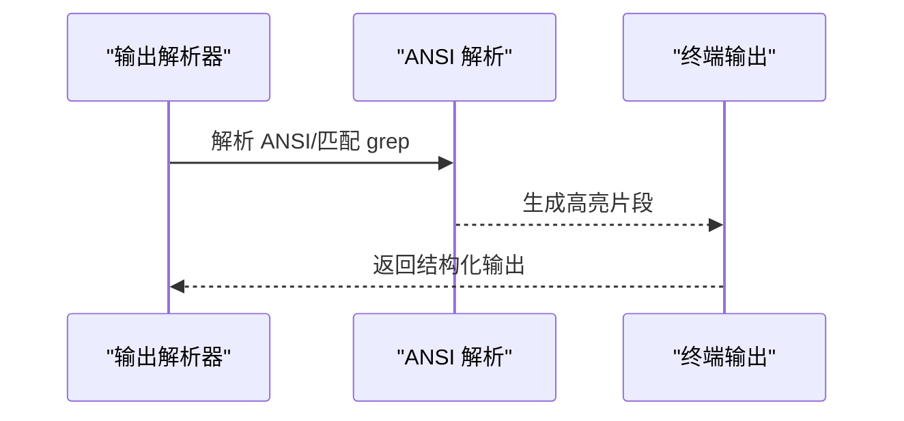

图表来源
- [packages/ui/src/index.ts:170-182](file://packages/ui/src/index.ts#L170-L182)

章节来源
- [packages/ui/src/index.ts:170-182](file://packages/ui/src/index.ts#L170-L182)

## 紧凑模式系统

### 紧凑模式概述
紧凑模式是专门为移动设备和窄屏环境设计的 UI 适配方案，通过抽屉组件、紧凑选择器和优化的布局来提供更好的用户体验。该系统包括紧凑模型选择器、紧凑权限模式选择器、紧凑工作空间切换器等核心组件。

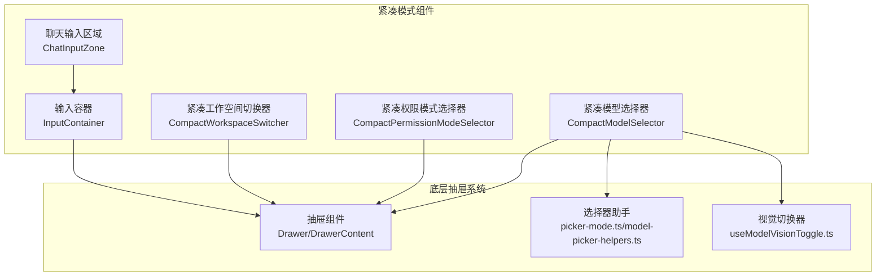

图表来源
- [apps/electron/src/renderer/components/app-shell/input/CompactModelSelector.tsx:1-522](file://apps/electron/src/renderer/components/app-shell/input/CompactModelSelector.tsx#L1-L522)
- [apps/electron/src/renderer/components/app-shell/input/CompactPermissionModeSelector.tsx:1-143](file://apps/electron/src/renderer/components/app-shell/input/CompactPermissionModeSelector.tsx#L1-L143)
- [apps/electron/src/renderer/components/app-shell/CompactWorkspaceSwitcher.tsx:1-303](file://apps/electron/src/renderer/components/app-shell/CompactWorkspaceSwitcher.tsx#L1-L303)
- [apps/electron/src/renderer/components/app-shell/input/ChatInputZone.tsx:1-124](file://apps/electron/src/renderer/components/app-shell/input/ChatInputZone.tsx#L1-L124)
- [apps/electron/src/renderer/components/app-shell/input/InputContainer.tsx:1-290](file://apps/electron/src/renderer/components/app-shell/input/InputContainer.tsx#L1-L290)

### 紧凑模型选择器
紧凑模型选择器是紧凑模式的核心组件之一，提供智能的模型选择界面。它根据当前连接状态、会话状态和可用连接数量自动决定显示模式。

#### 选择器模式决策
选择器有四种显示模式，按照优先级顺序：

1. **不可用模式**：当前连接丢失或处于错误状态
2. **切换器模式**：空会话且配置了多个连接（允许在第一条消息前切换连接）
3. **锁定单一模式**：`pi_compat` 连接且 ≤1 个模型，无法切换
4. **平面模式**：默认模式，列出当前连接的所有模型

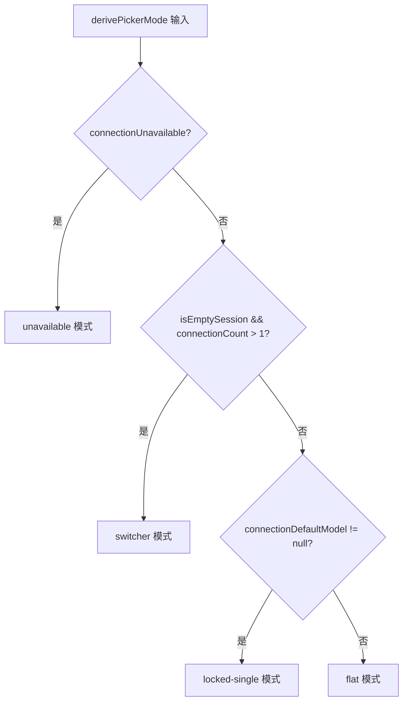

图表来源
- [apps/electron/src/renderer/components/app-shell/input/picker-mode.ts:36-41](file://apps/electron/src/renderer/components/app-shell/input/picker-mode.ts#L36-L41)

#### 视觉切换功能
紧凑模型选择器支持 per-model 图像支持切换，通过 `useModelVisionToggle` 钩子实现。该功能仅对兼容的提供商（如 Anthropic）有效。

章节来源
- [apps/electron/src/renderer/components/app-shell/input/CompactModelSelector.tsx:1-522](file://apps/electron/src/renderer/components/app-shell/input/CompactModelSelector.tsx#L1-L522)
- [apps/electron/src/renderer/components/app-shell/input/useModelVisionToggle.ts:1-50](file://apps/electron/src/renderer/components/app-shell/input/useModelVisionToggle.ts#L1-L50)
- [apps/electron/src/renderer/components/app-shell/input/picker-mode.ts:1-42](file://apps/electron/src/renderer/components/app-shell/input/picker-mode.ts#L1-L42)
- [apps/electron/src/renderer/components/app-shell/input/model-picker-helpers.ts:1-56](file://apps/electron/src/renderer/components/app-shell/input/model-picker-helpers.ts#L1-L56)

### 紧凑权限模式选择器
紧凑权限模式选择器提供三种权限模式的选择：安全模式（safe）、询问模式（ask）、全部允许模式（allow-all）。每个模式都有独特的视觉标识和颜色方案。

#### 权限模式配置
- **安全模式**：默认模式，最严格的权限控制
- **询问模式**：需要用户确认每次权限请求
- **全部允许模式**：自动批准所有权限请求

章节来源
- [apps/electron/src/renderer/components/app-shell/input/CompactPermissionModeSelector.tsx:1-143](file://apps/electron/src/renderer/components/app-shell/input/CompactPermissionModeSelector.tsx#L1-L143)

### 紧凑工作空间切换器
紧凑工作空间切换器是工作空间管理的紧凑版本，专为触摸设备优化。它提供工作空间列表、健康检查、远程连接管理和工作空间创建功能。

#### 远程连接健康检查
切换器会定期检查远程工作空间的连接状态，显示连接状态图标和错误信息。对于断开连接的工作空间，提供重新连接功能。

章节来源
- [apps/electron/src/renderer/components/app-shell/CompactWorkspaceSwitcher.tsx:1-303](file://apps/electron/src/renderer/components/app-shell/CompactWorkspaceSwitcher.tsx#L1-L303)

### 聊天输入系统
紧凑模式下的聊天输入系统经过全面重构，提供更流畅的用户体验。主要改进包括：

#### 输入容器优化
- **动画系统**：使用 motion/react 实现平滑的高度动画和内容切换
- **紧凑模式支持**：在处理过程中自动折叠输入框，节省空间
- **高度测量**：支持自由形式和结构化输入的高度动态调整
- **焦点管理**：智能处理输入焦点和面板状态

#### 聊天输入区域
- **选项徽章**：在非紧凑模式下显示活跃选项徽章
- **错误边界**：提供输入错误处理和恢复机制
- **标签集成**：支持会话标签的添加和移除

章节来源
- [apps/electron/src/renderer/components/app-shell/input/InputContainer.tsx:1-290](file://apps/electron/src/renderer/components/app-shell/input/InputContainer.tsx#L1-L290)
- [apps/electron/src/renderer/components/app-shell/input/ChatInputZone.tsx:1-124](file://apps/electron/src/renderer/components/app-shell/input/ChatInputZone.tsx#L1-L124)

## 依赖关系分析
- 主题与样式：依赖 Tailwind CSS v4 与 typography 插件，通过设计令牌与 @theme inline 定义全局变量，确保组件样式一致性。
- 组件生态：依赖 shadcn/ui 生态（如上下文菜单、对话框、下拉菜单）以实现可访问性与交互一致性。
- 抽屉系统：依赖 vaul 库实现抽屉动画和手势交互，提供流畅的移动端体验。
- 渲染与编辑：依赖 react-markdown、remark、rehype 等生态实现 Markdown 渲染与扩展。
- 代码高亮：依赖 shiki 与 diff 库实现语法高亮与差异对比。
- 动画系统：依赖 motion/react 实现高性能的动画效果。
- 类名合并：依赖 clsx 与 tailwind-merge 实现安全的类名合并与冲突解决。

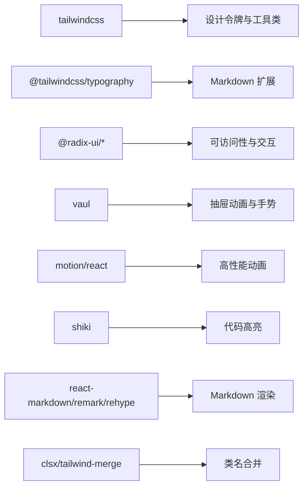

图表来源
- [packages/ui/package.json:20-57](file://packages/ui/package.json#L20-L57)

章节来源
- [packages/ui/package.json:1-73](file://packages/ui/package.json#L1-L73)

## 性能考量
- 渲染优化
  - 使用记忆化渲染组件（如 MemoizedMarkdown）降低重复渲染成本。
  - 将大型列表与复杂块级组件拆分为独立单元，按需渲染。
  - 抽屉组件使用虚拟化和惰性加载策略，减少初始渲染负担。
- 样式优化
  - 通过设计令牌集中管理样式，减少重复定义与冲突。
  - 使用工具类与 CSS 变量，避免运行时样式计算。
  - 抽屉动画使用硬件加速，确保流畅的用户体验。
- 交互优化
  - 下拉与覆盖层采用惰性渲染与卸载策略，减少 DOM 占用。
  - 提示组件使用轻量层叠与最小阴影，避免过度绘制。
  - 紧凑模式组件优化触摸目标大小，提升移动端可用性。
- 第三方库
  - 对高开销库（如 shiki、diff）进行按需加载与缓存，避免重复初始化。
  - 在编辑器场景中启用增量更新与懒加载。
  - 动画系统使用帧同步和性能监控，确保流畅度。

## 故障排查指南
- 样式不生效
  - 确认已导入主题入口样式，并在应用主样式中添加源目录指令以便 Tailwind v4 收集。
  - 检查是否正确设置明/暗模式类名，确保 CSS 变量被正确覆盖。
- 类名冲突
  - 使用类名合并工具函数，避免重复或冲突的样式类。
- 可访问性问题
  - 确保下拉菜单、对话框、提示等组件具备正确的角色与键盘导航。
  - 为交互元素提供焦点可见性与屏幕阅读器友好的标签。
- 性能问题
  - 大型 Markdown 文档建议启用记忆化与分页渲染。
  - 代码高亮与差异对比在大数据量时应启用虚拟化或分块处理。
  - 抽屉组件在大量数据时应考虑虚拟化列表。
- 紧凑模式问题
  - 确保触摸目标大小符合移动端最佳实践。
  - 检查动画性能，必要时调整动画持续时间和缓动函数。
  - 验证不同屏幕尺寸下的布局适配。

## 结论
本 UI 组件库以 Tailwind CSS v4 与 shadcn/ui 为基础，构建了从原语到复合组件的完整体系。通过统一的设计令牌、明确的层级规范与可插拔的第三方扩展，实现了跨平台的一致体验与良好的可维护性。

**更新亮点** 新增的紧凑模式抽屉系统显著提升了移动端和窄屏设备的用户体验。紧凑模型选择器、紧凑权限模式选择器、紧凑工作空间切换器等组件提供了智能化的界面适配，而改进的聊天输入功能则确保了流畅的交互体验。

建议在实际项目中遵循本文档的开发规范与最佳实践，结合主题与布局常量，快速搭建高质量的 UI 设计系统。

## 附录

### 组件开发规范
- 命名与导出
  - 组件命名采用 PascalCase，导出统一在各功能域的 index 文件中集中管理。
  - 属性接口以 Props 结尾，枚举与类型导出至根入口，便于消费方使用。
  - 紧凑模式组件统一使用 Compact 前缀命名。
- 样式与主题
  - 优先使用设计令牌与工具类，避免硬编码颜色与尺寸。
  - 明/暗模式通过 CSS 变量与 .dark 类名协同实现，确保一致性。
  - 抽屉组件使用 z-modal 层级，确保正确的堆叠顺序。
- 可访问性
  - 为交互元素提供 aria-* 属性与键盘可达性。
  - 下拉菜单与对话框使用 Provider/Context 管理状态，避免焦点丢失。
  - 紧凑模式组件提供足够的触摸目标和清晰的视觉反馈。
- 测试与验证
  - 为关键组件编写单元测试与快照测试，覆盖不同模式与尺寸。
  - 在多浏览器与多分辨率环境下验证响应式表现。
  - 特别关注移动端和触摸设备的交互测试。

### 样式定制指南
- 自定义主题
  - 在应用侧覆盖设计令牌变量，保持与组件库一致的命名与层级。
  - 如需扩展字体或阴影，建议在主题入口中统一声明。
  - 抽屉组件的颜色和阴影应与整体主题保持一致。
- 组件定制
  - 通过 className 与变体属性进行局部覆盖，避免破坏全局样式。
  - 使用 CSS 变量为组件提供动态主题支持。
  - 紧凑模式组件的尺寸和间距应遵循移动端设计规范。

### 第三方集成模式
- Markdown 生态
  - 通过引擎参数选择渲染链路，按需启用数学公式、表格、代码高亮等扩展。
- 代码高亮
  - 与 shiki 主题联动，支持多语言与自定义主题。
- 动画系统
  - 与 motion/react 集成，提供高性能的动画效果。
  - 抽屉动画使用硬件加速，确保流畅度。
- 工具与解析
  - 终端输出解析与 grep 结果解析可按需启用，减少包体积。
  - 选择器助手函数提供可重用的逻辑，便于扩展新的选择器模式。

### 紧凑模式开发指南
- 设计原则
  - 以用户任务为中心，简化界面复杂度。
  - 提供清晰的视觉层次和操作反馈。
  - 确保在各种屏幕尺寸下的可用性。
- 抽屉设计
  - 使用合适的抽屉方向和尺寸。
  - 提供明确的关闭和确认操作。
  - 优化触摸交互和手势支持。
- 性能优化
  - 使用虚拟化技术处理大量数据。
  - 实现懒加载和按需渲染。
  - 监控动画性能和内存使用。