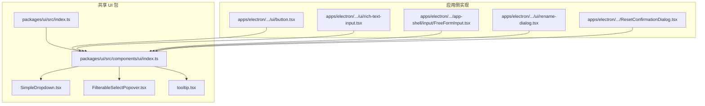
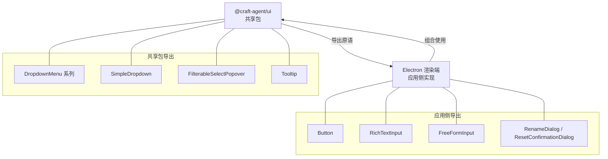
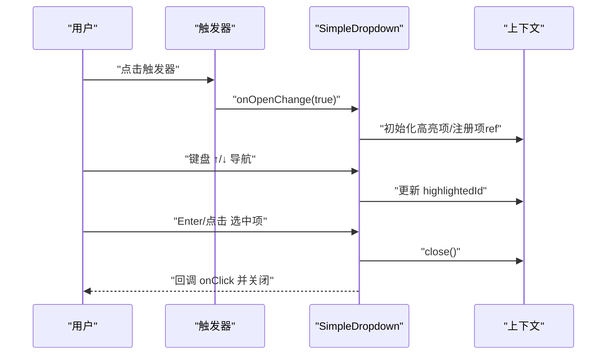
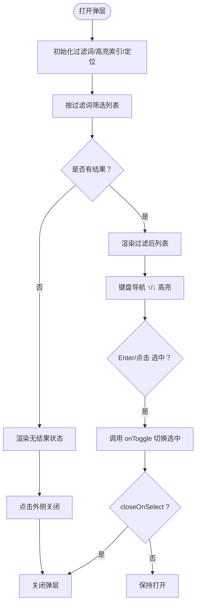
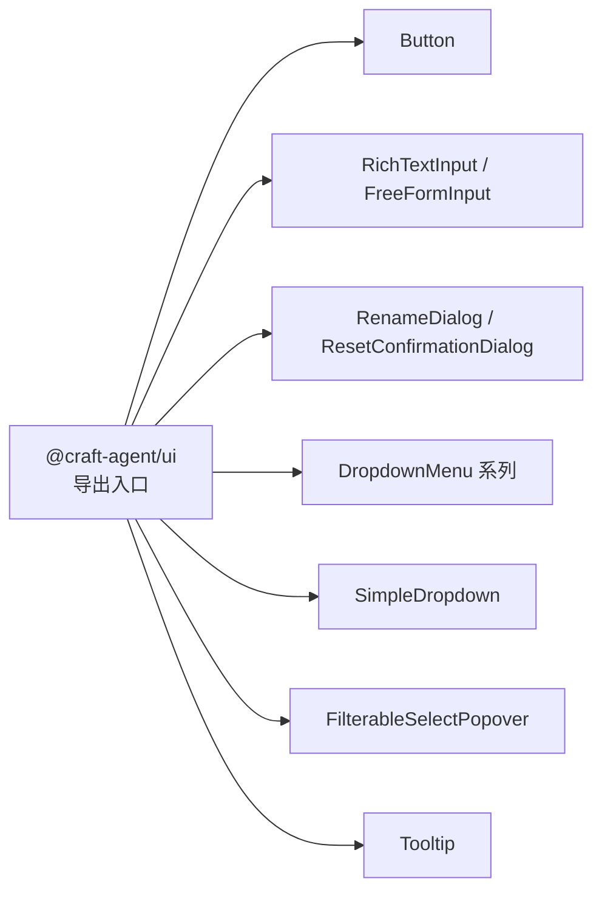

# 基础组件

<cite>
**本文引用的文件**
- [packages/ui/src/index.ts](file://packages/ui/src/index.ts)
- [packages/ui/src/components/ui/index.ts](file://packages/ui/src/components/ui/index.ts)
- [packages/ui/src/components/ui/SimpleDropdown.tsx](file://packages/ui/src/components/ui/SimpleDropdown.tsx)
- [packages/ui/src/components/ui/FilterableSelectPopover.tsx](file://packages/ui/src/components/ui/FilterableSelectPopover.tsx)
- [packages/ui/src/components/tooltip.tsx](file://packages/ui/src/components/tooltip.tsx)
- [apps/electron/src/renderer/components/ui/button.tsx](file://apps/electron/src/renderer/components/ui/button.tsx)
- [apps/electron/src/renderer/components/ui/rich-text-input.tsx](file://apps/electron/src/renderer/components/ui/rich-text-input.tsx)
- [apps/electron/src/renderer/components/app-shell/input/FreeFormInput.tsx](file://apps/electron/src/renderer/components/app-shell/input/FreeFormInput.tsx)
- [apps/electron/src/renderer/components/ui/rename-dialog.tsx](file://apps/electron/src/renderer/components/ui/rename-dialog.tsx)
- [apps/electron/src/renderer/components/ResetConfirmationDialog.tsx](file://apps/electron/src/renderer/components/ResetConfirmationDialog.tsx)
- [apps/electron/src/renderer/playground/registry/turn-card.tsx](file://apps/electron/src/renderer/playground/registry/turn-card.tsx)
</cite>

## 目录
1. [简介](#简介)
2. [项目结构](#项目结构)
3. [核心组件](#核心组件)
4. [架构总览](#架构总览)
5. [详细组件分析](#详细组件分析)
6. [依赖分析](#依赖分析)
7. [性能考虑](#性能考虑)
8. [故障排查指南](#故障排查指南)
9. [结论](#结论)
10. [附录](#附录)

## 简介
本文件为“基础组件”的开发文档，聚焦于按钮、输入框、对话框、弹出菜单（下拉菜单）、下拉菜单、提示框等通用 UI 组件的实现原理、属性接口、事件处理机制与可访问性支持。文档同时覆盖样式变体、尺寸规格、状态管理、组件组合模式、互操作性设计以及性能优化策略，并提供使用示例与最佳实践，帮助 UI 开发者快速理解与集成。

## 项目结构
本仓库包含一个共享 UI 包与多个应用（如 Electron 渲染端）中的具体实现。基础组件主要分布在以下位置：
- 共享 UI 包：packages/ui/src/components/ui（轻量级原语，如简单下拉、可过滤选择弹层、提示框等）
- 应用侧实现：apps/electron/src/renderer/components/ui（按钮、富文本输入等）
- 输入相关：apps/electron/src/renderer/components/app-shell/input（自由输入、结构化输入等）
- 对话框：apps/electron/src/renderer/components 下的各类对话框组件

图表来源
- [packages/ui/src/index.ts:1-288](file://packages/ui/src/index.ts#L1-L288)
- [packages/ui/src/components/ui/index.ts:1-64](file://packages/ui/src/components/ui/index.ts#L1-L64)
- [packages/ui/src/components/ui/SimpleDropdown.tsx:1-124](file://packages/ui/src/components/ui/SimpleDropdown.tsx#L1-L124)
- [packages/ui/src/components/ui/FilterableSelectPopover.tsx:1-79](file://packages/ui/src/components/ui/FilterableSelectPopover.tsx#L1-L79)
- [packages/ui/src/components/tooltip.tsx:1-44](file://packages/ui/src/components/tooltip.tsx#L1-L44)
- [apps/electron/src/renderer/components/ui/button.tsx](file://apps/electron/src/renderer/components/ui/button.tsx)
- [apps/electron/src/renderer/components/ui/rich-text-input.tsx](file://apps/electron/src/renderer/components/ui/rich-text-input.tsx)
- [apps/electron/src/renderer/components/app-shell/input/FreeFormInput.tsx](file://apps/electron/src/renderer/components/app-shell/input/FreeFormInput.tsx)
- [apps/electron/src/renderer/components/ui/rename-dialog.tsx](file://apps/electron/src/renderer/components/ui/rename-dialog.tsx)
- [apps/electron/src/renderer/components/ResetConfirmationDialog.tsx](file://apps/electron/src/renderer/components/ResetConfirmationDialog.tsx)

章节来源
- [packages/ui/src/index.ts:1-288](file://packages/ui/src/index.ts#L1-L288)
- [packages/ui/src/components/ui/index.ts:1-64](file://packages/ui/src/components/ui/index.ts#L1-L64)

## 核心组件
本节概述基础组件族及其职责边界：
- 按钮 Button：用于触发动作，支持主次样式、禁用态、图标等变体
- 输入框 Input：包括富文本输入与自由输入，支持校验、占位符、多行、只读等
- 对话框 Dialog：用于确认、重命名、设置等交互场景，支持 ESC 关闭、点击外部关闭等
- 弹出菜单（下拉菜单）DropdownMenu：基于 Radix UI 的标准菜单，支持子菜单、快捷键、分隔线
- 下拉菜单 SimpleDropdown：轻量实现，无外部依赖，支持点击外侧关闭、键盘导航、翻转定位
- 可过滤选择弹层 FilterableSelectPopover：带过滤的扁平列表选择器，支持键盘导航、点击外侧关闭、锚点定位
- 提示框 Tooltip：基于 Radix UI 的工具提示，支持延迟、方向偏移、动画

章节来源
- [packages/ui/src/index.ts:91-139](file://packages/ui/src/index.ts#L91-L139)
- [packages/ui/src/components/ui/index.ts:1-64](file://packages/ui/src/components/ui/index.ts#L1-L64)
- [packages/ui/src/components/tooltip.tsx:1-44](file://packages/ui/src/components/tooltip.tsx#L1-L44)
- [packages/ui/src/components/ui/SimpleDropdown.tsx:1-124](file://packages/ui/src/components/ui/SimpleDropdown.tsx#L1-L124)
- [packages/ui/src/components/ui/FilterableSelectPopover.tsx:1-79](file://packages/ui/src/components/ui/FilterableSelectPopover.tsx#L1-L79)
- [apps/electron/src/renderer/components/ui/button.tsx](file://apps/electron/src/renderer/components/ui/button.tsx)
- [apps/electron/src/renderer/components/ui/rich-text-input.tsx](file://apps/electron/src/renderer/components/ui/rich-text-input.tsx)
- [apps/electron/src/renderer/components/app-shell/input/FreeFormInput.tsx](file://apps/electron/src/renderer/components/app-shell/input/FreeFormInput.tsx)
- [apps/electron/src/renderer/components/ui/rename-dialog.tsx](file://apps/electron/src/renderer/components/ui/rename-dialog.tsx)
- [apps/electron/src/renderer/components/ResetConfirmationDialog.tsx](file://apps/electron/src/renderer/components/ResetConfirmationDialog.tsx)

## 架构总览
基础组件采用“共享包 + 应用侧实现”的分层设计：
- 共享包提供跨平台的 UI 原语与通用能力（如 SimpleDropdown、FilterableSelectPopover、Tooltip）
- 应用侧在 Electron 渲染进程中扩展具体业务组件（如按钮、输入框、对话框），并与共享包协同
- 组件间通过上下文、Portal、事件与状态管理实现解耦与复用

图表来源
- [packages/ui/src/index.ts:91-139](file://packages/ui/src/index.ts#L91-L139)
- [packages/ui/src/components/ui/index.ts:1-64](file://packages/ui/src/components/ui/index.ts#L1-L64)
- [apps/electron/src/renderer/components/ui/button.tsx](file://apps/electron/src/renderer/components/ui/button.tsx)
- [apps/electron/src/renderer/components/ui/rich-text-input.tsx](file://apps/electron/src/renderer/components/ui/rich-text-input.tsx)
- [apps/electron/src/renderer/components/app-shell/input/FreeFormInput.tsx](file://apps/electron/src/renderer/components/app-shell/input/FreeFormInput.tsx)
- [apps/electron/src/renderer/components/ui/rename-dialog.tsx](file://apps/electron/src/renderer/components/ui/rename-dialog.tsx)
- [apps/electron/src/renderer/components/ResetConfirmationDialog.tsx](file://apps/electron/src/renderer/components/ResetConfirmationDialog.tsx)

## 详细组件分析

### 按钮 Button
- 职责：触发用户操作，承载文案、图标、禁用态、主次样式等
- 接口要点：支持 onClick、disabled、variant（主/次）、图标、className 等
- 可访问性：具备默认的可聚焦性与键盘激活行为；建议在复杂场景中显式设置 aria-* 属性
- 样式与尺寸：通过变体与类名控制外观；尺寸由内容与容器布局决定
- 事件处理：统一委托到 onClick；避免在按钮上绑定过多副作用
- 最佳实践：优先使用语义化文案；在关键危险操作使用“destructive”变体；保持一致的间距与对齐

章节来源
- [apps/electron/src/renderer/components/ui/button.tsx](file://apps/electron/src/renderer/components/ui/button.tsx)
- [apps/electron/src/renderer/playground/registry/turn-card.tsx:1500-1507](file://apps/electron/src/renderer/playground/registry/turn-card.tsx#L1500-L1507)

### 输入框 RichTextInput
- 职责：富文本输入，支持编辑态、粘贴处理、格式化与校验
- 接口要点：继承 HTMLDivElement 的部分属性，暴露 onChange/onInput/onPaste 等回调
- 可访问性：应确保可读性与可聚焦性；在需要时提供 aria-label 或 aria-describedby
- 样式与尺寸：通过容器约束高度与宽度；支持只读与禁用态
- 事件处理：监听输入与粘贴事件，必要时进行内容清洗或格式化
- 最佳实践：在表单中配合校验与错误提示；避免在输入框内放置不可编辑元素

章节来源
- [apps/electron/src/renderer/components/ui/rich-text-input.tsx](file://apps/electron/src/renderer/components/ui/rich-text-input.tsx)

### 输入框 FreeFormInput
- 职责：自由输入，支持多行、占位符、自动高度、错误边界等
- 接口要点：支持 state、onResponse、unstyled 等参数；内部封装了高度计算与错误处理
- 可访问性：提供输入事件守卫与作用域判断，避免误触；建议在错误场景提供可读提示
- 样式与尺寸：根据视口高度动态调整最大高度；支持无样式模式
- 事件处理：封装输入事件守卫与焦点事件派发，便于全局处理
- 最佳实践：在复杂输入场景中结合结构化输入；为必填项提供明确的视觉与语义提示

章节来源
- [apps/electron/src/renderer/components/app-shell/input/FreeFormInput.tsx](file://apps/electron/src/renderer/components/app-shell/input/FreeFormInput.tsx)

### 对话框 RenameDialog / ResetConfirmationDialog
- 职责：用于重命名与重置确认等交互，支持 ESC 关闭、点击外部关闭、确认/取消
- 接口要点：接收 open、onOpenChange、标题、描述、确认文案等；内部维护状态与键盘事件
- 可访问性：确保首次聚焦到确认/取消按钮；提供无障碍标签与描述
- 样式与尺寸：自适应内容尺寸；在移动端需考虑安全区域与滚动
- 事件处理：ESC 关闭、点击外部关闭、回车确认；避免在打开时重复触发
- 最佳实践：在危险操作前先展示预览或说明；提供撤销路径或二次确认

章节来源
- [apps/electron/src/renderer/components/ui/rename-dialog.tsx](file://apps/electron/src/renderer/components/ui/rename-dialog.tsx)
- [apps/electron/src/renderer/components/ResetConfirmationDialog.tsx](file://apps/electron/src/renderer/components/ResetConfirmationDialog.tsx)

### 弹出菜单（下拉菜单）DropdownMenu
- 职责：标准下拉菜单，支持子菜单、快捷键、分隔线与触发器
- 接口要点：Trigger、Content、Item、Separator、Sub、SubTrigger、SubContent 等
- 可访问性：遵循 Radix UI 的可访问性约定；支持键盘导航与焦点管理
- 样式与尺寸：通过主题与类名控制外观；内容自适应
- 事件处理：点击触发、键盘导航、子菜单展开/收起
- 最佳实践：避免在菜单中放置不可交互元素；为重要操作提供快捷键提示

章节来源
- [packages/ui/src/index.ts:99-107](file://packages/ui/src/index.ts#L99-L107)
- [packages/ui/src/components/ui/index.ts:21-30](file://packages/ui/src/components/ui/index.ts#L21-L30)

### 下拉菜单 SimpleDropdown
- 职责：轻量下拉菜单，无外部依赖，支持点击外侧关闭、键盘导航、翻转定位
- 接口要点：trigger、children、align、disabled、onOpenChange、keyboardNavigation
- 可访问性：内置焦点高亮与键盘导航（Esc/↑/↓/Enter）；支持子项按钮 ref 注入
- 样式与尺寸：紧凑布局，支持变体（默认/破坏性）
- 事件处理：点击触发、点击外侧关闭、键盘导航、鼠标悬停高亮
- 最佳实践：在复杂菜单场景优先使用 DropdownMenu；为破坏性操作提供警示

图表来源
- [packages/ui/src/components/ui/SimpleDropdown.tsx:16-21](file://packages/ui/src/components/ui/SimpleDropdown.tsx#L16-L21)
- [packages/ui/src/components/ui/SimpleDropdown.tsx:116-124](file://packages/ui/src/components/ui/SimpleDropdown.tsx#L116-L124)
- [packages/ui/src/components/ui/SimpleDropdown.tsx:42-97](file://packages/ui/src/components/ui/SimpleDropdown.tsx#L42-L97)

章节来源
- [packages/ui/src/components/ui/SimpleDropdown.tsx:1-124](file://packages/ui/src/components/ui/SimpleDropdown.tsx#L1-L124)

### 可过滤选择弹层 FilterableSelectPopover
- 职责：带过滤的扁平列表选择器，支持键盘导航、点击外侧关闭、锚点定位
- 接口要点：open、onOpenChange、anchorRef、items、getKey/getLabel、isSelected/onToggle、renderItem、filterPlaceholder、emptyState/noResultsState、closeOnSelect、minWidth/maxWidth
- 可访问性：支持 ↑/↓、Enter、Esc 键；自动高亮首个匹配项；点击外侧关闭
- 样式与尺寸：根据锚点计算位置，支持最小/最大宽度；自适应内容高度
- 事件处理：输入过滤、键盘导航、点击项切换、Portal 定位
- 最佳实践：为大量选项提供虚拟化或分页；在空状态提供引导文案

图表来源
- [packages/ui/src/components/ui/FilterableSelectPopover.tsx:36-79](file://packages/ui/src/components/ui/FilterableSelectPopover.tsx#L36-L79)

章节来源
- [packages/ui/src/components/ui/FilterableSelectPopover.tsx:1-79](file://packages/ui/src/components/ui/FilterableSelectPopover.tsx#L1-L79)

### 提示框 Tooltip
- 职责：轻量提示，支持延迟、方向偏移、动画
- 接口要点：TooltipProvider（delayDuration）、Tooltip、TooltipTrigger、TooltipContent（sideOffset）
- 可访问性：基于 Radix UI，遵循可访问性约定；支持键盘与触屏手势
- 样式与尺寸：紧凑卡片，支持暗色主题与背景模糊
- 事件处理：悬停显示、延迟隐藏、可配置 hoverableContent
- 最佳实践：避免长篇幅内容；为图标类控件提供简短说明

章节来源
- [packages/ui/src/components/tooltip.tsx:1-44](file://packages/ui/src/components/tooltip.tsx#L1-L44)

## 依赖分析
- 共享 UI 包导出：按钮、输入框、对话框、下拉菜单、提示框等均通过统一入口导出，便于集中管理与版本升级
- 应用侧实现：在 Electron 渲染端以具体组件形式出现，复用共享包的原语与能力
- 外部依赖：共享包依赖 Radix UI（可选）与 React 生态，应用侧组件依赖共享包与平台能力

图表来源
- [packages/ui/src/index.ts:91-139](file://packages/ui/src/index.ts#L91-L139)
- [packages/ui/src/components/ui/index.ts:1-64](file://packages/ui/src/components/ui/index.ts#L1-L64)

章节来源
- [packages/ui/src/index.ts:91-139](file://packages/ui/src/index.ts#L91-L139)
- [packages/ui/src/components/ui/index.ts:1-64](file://packages/ui/src/components/ui/index.ts#L1-L64)

## 性能考虑
- 虚拟化与分页：对于大列表（如 FilterableSelectPopover），建议采用虚拟化或分页策略，减少 DOM 节点数量
- 计算优化：过滤逻辑使用 useMemo 缓存中间结果；键盘导航仅在打开状态下启用
- 渲染优化：Portal 渲染避免层级嵌套过深；Tooltip 使用 Portal 减少重排
- 事件去抖：输入过滤建议加入防抖，避免高频重算
- 主题与样式：通过类名与主题变量控制外观，避免运行时样式计算开销

## 故障排查指南
- 点击外侧未关闭：检查 SimpleDropdown/FilterableSelectPopover 的点击外侧检测是否正确绑定；确认 Portal 定位与 z-index
- 键盘导航异常：确认 keyboardNavigation 开关与事件监听；在 SimpleDropdown 中检查上下文高亮状态
- 焦点丢失：在对话框中确保首次聚焦到确认/取消按钮；在 Tooltip 中检查触发器与内容的关联
- 样式错乱：核对类名拼接与主题变量；检查最小/最大宽度与视口边界计算
- 外部依赖缺失：若使用 DropdownMenu 系列，请确保 Radix UI 已安装且版本满足要求

章节来源
- [packages/ui/src/components/ui/SimpleDropdown.tsx:116-124](file://packages/ui/src/components/ui/SimpleDropdown.tsx#L116-L124)
- [packages/ui/src/components/ui/FilterableSelectPopover.tsx:36-79](file://packages/ui/src/components/ui/FilterableSelectPopover.tsx#L36-L79)
- [packages/ui/src/components/tooltip.tsx:1-44](file://packages/ui/src/components/tooltip.tsx#L1-L44)

## 结论
基础组件通过共享包与应用侧实现的协作，提供了从按钮、输入框、对话框到下拉菜单与提示框的一整套通用能力。它们在可访问性、键盘导航、焦点管理、样式变体与尺寸规范方面均有清晰的设计与实现。建议在实际项目中遵循本文档的最佳实践，结合具体业务场景进行组合与扩展。

## 附录
- 使用示例与集成指导
  - 按钮：在需要触发动作的地方引入 Button，设置 onClick 与 variant；在危险操作使用 destructive 变体
  - 输入框：在表单中使用 RichTextInput 或 FreeFormInput，结合校验与错误提示
  - 对话框：在需要确认或重命名的场景使用 RenameDialog/ResetConfirmationDialog，确保可访问性
  - 下拉菜单：简单场景使用 SimpleDropdown，复杂场景使用 DropdownMenu 系列
  - 提示框：为图标类控件或简短说明使用 Tooltip，注意延迟与方向偏移
- 最佳实践
  - 明确语义与文案；为关键操作提供视觉与语义双重提示
  - 在复杂交互中提供键盘导航与可访问性支持
  - 控制组件尺寸与布局，避免过度嵌套与重排
  - 对大列表与高频输入进行性能优化（虚拟化、防抖、缓存）