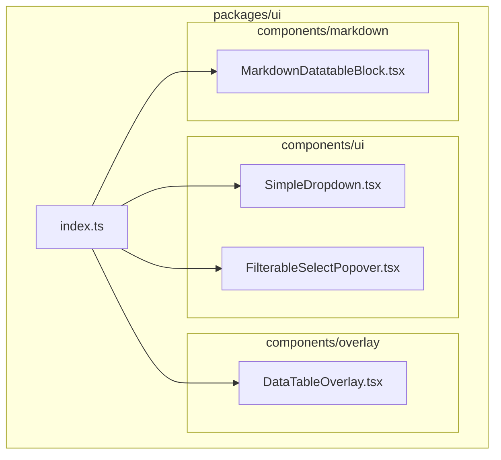
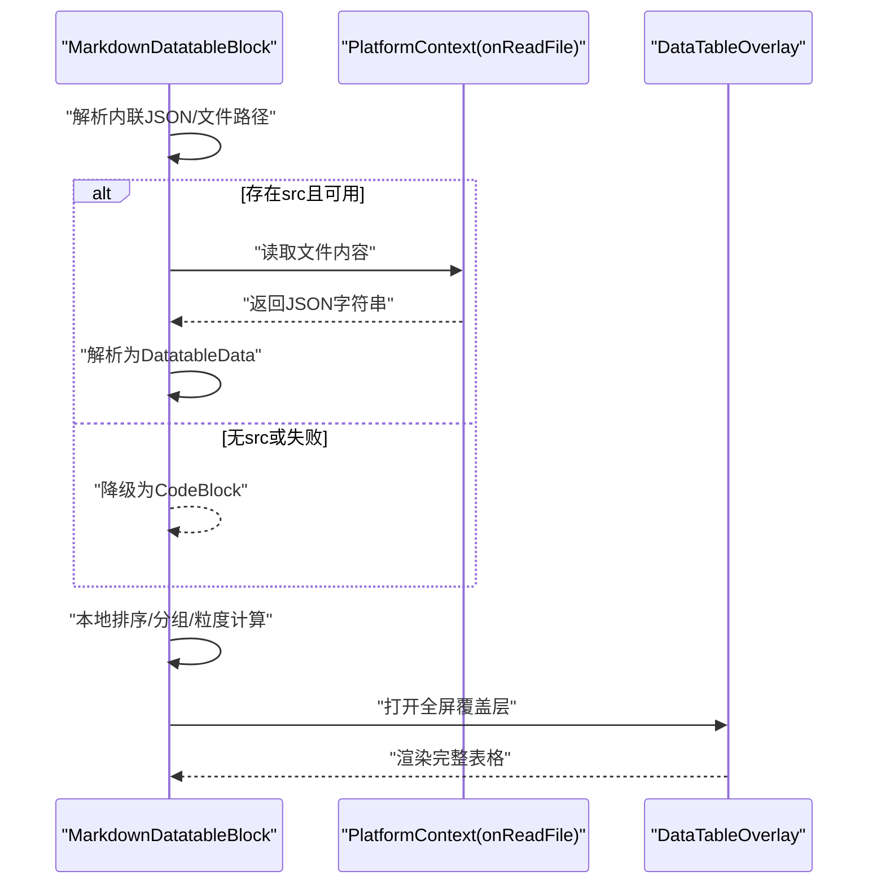
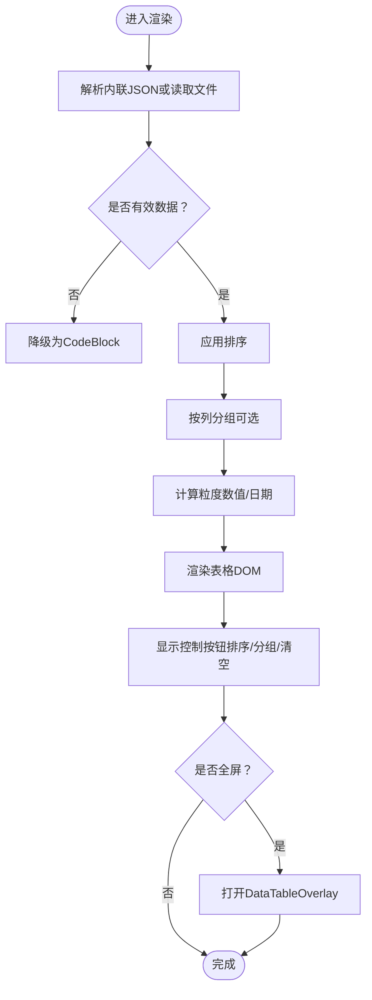
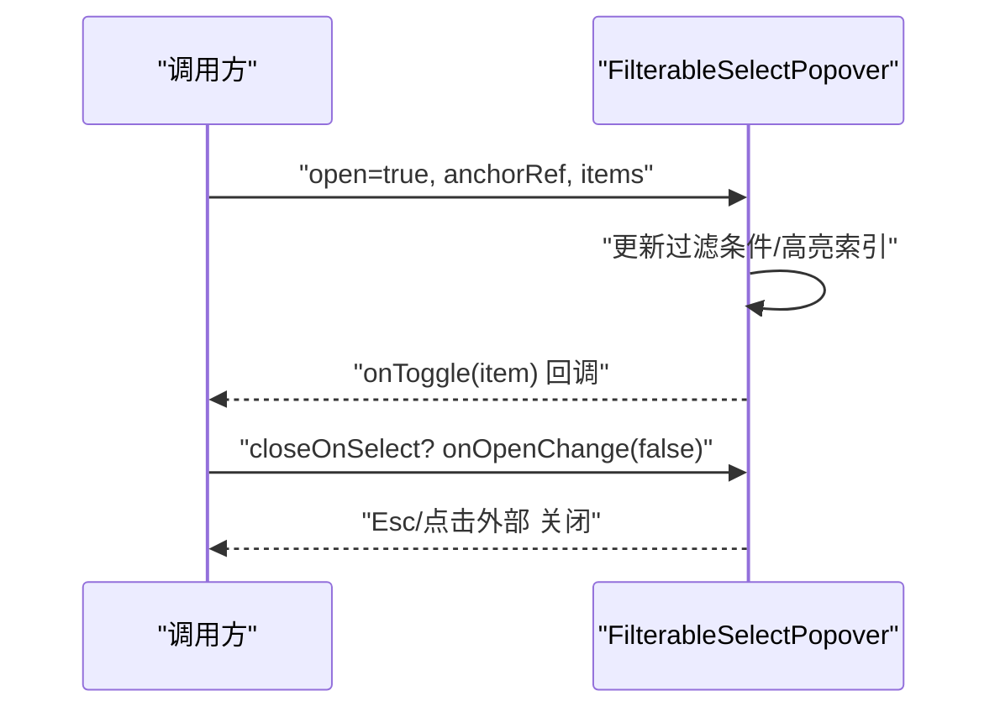
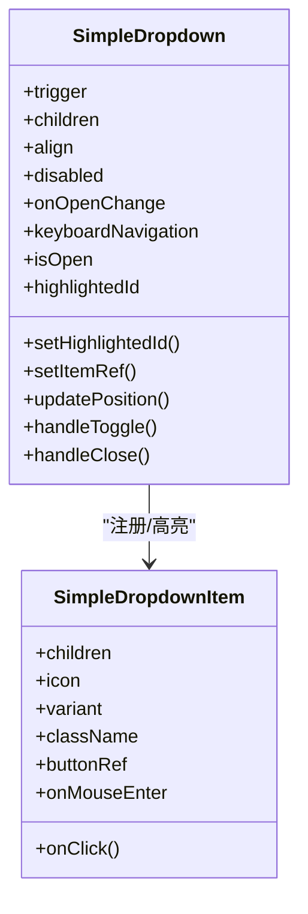
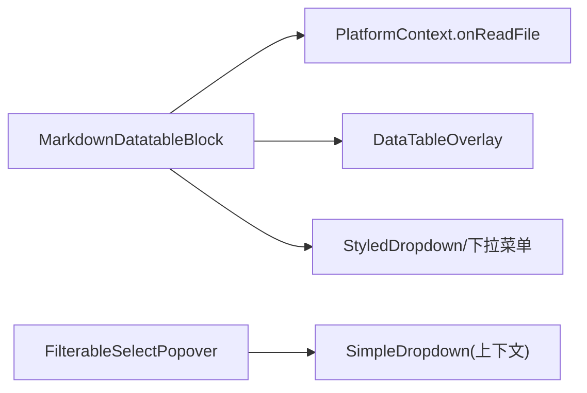

# 工具组件

<cite>
**本文引用的文件**
- [packages/ui/src/index.ts](file://packages/ui/src/index.ts)
- [packages/ui/src/components/ui/index.ts](file://packages/ui/src/components/ui/index.ts)
- [packages/ui/src/components/ui/SimpleDropdown.tsx](file://packages/ui/src/components/ui/SimpleDropdown.tsx)
- [packages/ui/src/components/ui/FilterableSelectPopover.tsx](file://packages/ui/src/components/ui/FilterableSelectPopover.tsx)
- [packages/ui/src/components/overlay/DataTableOverlay.tsx](file://packages/ui/src/components/overlay/DataTableOverlay.tsx)
- [packages/ui/src/components/markdown/MarkdownDatatableBlock.tsx](file://packages/ui/src/components/markdown/MarkdownDatatableBlock.tsx)
</cite>

## 目录
1. [简介](#简介)
2. [项目结构](#项目结构)
3. [核心组件](#核心组件)
4. [架构总览](#架构总览)
5. [组件详解](#组件详解)
6. [依赖关系分析](#依赖关系分析)
7. [性能考量](#性能考量)
8. [故障排查指南](#故障排查指南)
9. [结论](#结论)
10. [附录](#附录)

## 简介
本文件聚焦于工具类组件的实现与使用，涵盖数据表格、选择器、命令面板（通过选择器实现）、日历（通过选择器与日期列类型结合）等通用能力。内容包括：
- 数据绑定机制：行/列定义、平台读取文件回退、渲染态管理
- 筛选与排序：本地排序、分组聚合、粒度控制
- 分页处理：当前实现以滚动分页为主，建议在大数据量场景下采用虚拟化或服务端分页
- 表单集成：与表单库的联动策略（受控值、校验状态、错误提示）
- 验证与错误处理：解析失败降级、加载中/错误态展示
- 可访问性：键盘导航、焦点管理、屏幕阅读器友好
- 定制化：主题/样式覆盖、行为扩展点、平台能力注入

## 项目结构
UI 组件集中在 packages/ui 包中，按功能域拆分为：
- components/ui：基础交互组件（下拉、可筛选弹出选择器等）
- components/overlay：覆盖层容器与专用预览
- components/markdown：Markdown 扩展块（含数据表格）

**图表来源**
- [packages/ui/src/index.ts:91-139](file://packages/ui/src/index.ts#L91-L139)
- [packages/ui/src/components/ui/index.ts:1-64](file://packages/ui/src/components/ui/index.ts#L1-L64)
- [packages/ui/src/components/overlay/index.ts:1-25](file://packages/ui/src/components/overlay/index.ts#L1-L25)

**章节来源**
- [packages/ui/src/index.ts:1-288](file://packages/ui/src/index.ts#L1-L288)
- [packages/ui/src/components/ui/index.ts:1-64](file://packages/ui/src/components/ui/index.ts#L1-L64)
- [packages/ui/src/components/overlay/index.ts:1-25](file://packages/ui/src/components/overlay/index.ts#L1-L25)

## 核心组件
- SimpleDropdown：轻量无依赖下拉菜单，支持点击外部关闭、键盘导航、位置自适应、Portal 渲染
- FilterableSelectPopover：带过滤的弹出式选择器，支持 ↑/↓、Enter、Esc 键盘操作，锚定定位
- MarkdownDatatableBlock：Markdown 内容块渲染器，支持 JSON 规范的表格、排序、分组、导出、全屏预览
- DataTableOverlay：数据表全屏/模态覆盖层，承载表格内容并提供头部操作区

**章节来源**
- [packages/ui/src/components/ui/SimpleDropdown.tsx:1-335](file://packages/ui/src/components/ui/SimpleDropdown.tsx#L1-L335)
- [packages/ui/src/components/ui/FilterableSelectPopover.tsx:1-226](file://packages/ui/src/components/ui/FilterableSelectPopover.tsx#L1-L226)
- [packages/ui/src/components/markdown/MarkdownDatatableBlock.tsx:1-721](file://packages/ui/src/components/markdown/MarkdownDatatableBlock.tsx#L1-L721)
- [packages/ui/src/components/overlay/DataTableOverlay.tsx:1-64](file://packages/ui/src/components/overlay/DataTableOverlay.tsx#L1-L64)

## 架构总览
Markdown 数据表格由“解析层 + 渲染层 + 覆盖层”构成：
- 解析层：从内联 JSON 或平台读取文件获取数据
- 渲染层：本地排序/分组/粒度计算，生成表格 DOM
- 覆盖层：全屏模式下将表格放入统一的预览容器

**图表来源**
- [packages/ui/src/components/markdown/MarkdownDatatableBlock.tsx:296-363](file://packages/ui/src/components/markdown/MarkdownDatatableBlock.tsx#L296-L363)
- [packages/ui/src/components/overlay/DataTableOverlay.tsx:33-63](file://packages/ui/src/components/overlay/DataTableOverlay.tsx#L33-L63)

## 组件详解

### 数据表格（MarkdownDatatableBlock）
- 数据绑定机制
  - 支持内联 JSON 与文件引用两种来源；文件可通过平台上下文读取
  - 合并策略：内联字段优先，文件提供 rows
  - 加载/错误态：文件加载中显示占位，解析失败或读取异常显示错误信息
- 排序与分组
  - 单列排序：点击表头切换升/降/不排序
  - 分组：按列分组，数值/日期列支持粒度（如小时/天/月/年、区间）
  - 折叠：分组项可折叠/展开
- 导出与全屏
  - 提供导出下拉菜单；全屏模式下展示完整表格并保留控制按钮
- 可访问性
  - 表格标题、排序图标语义明确；键盘可直达控制菜单
- 定制化
  - 列类型：文本/数字/货币/百分比/布尔/日期/徽标
  - 对齐：根据类型自动左/右对齐，支持显式对齐
  - 主题：通过容器背景/边框/阴影等样式变量控制外观

**图表来源**
- [packages/ui/src/components/markdown/MarkdownDatatableBlock.tsx:373-439](file://packages/ui/src/components/markdown/MarkdownDatatableBlock.tsx#L373-L439)
- [packages/ui/src/components/markdown/MarkdownDatatableBlock.tsx:540-663](file://packages/ui/src/components/markdown/MarkdownDatatableBlock.tsx#L540-L663)
- [packages/ui/src/components/overlay/DataTableOverlay.tsx:33-63](file://packages/ui/src/components/overlay/DataTableOverlay.tsx#L33-L63)

**章节来源**
- [packages/ui/src/components/markdown/MarkdownDatatableBlock.tsx:1-721](file://packages/ui/src/components/markdown/MarkdownDatatableBlock.tsx#L1-L721)
- [packages/ui/src/components/overlay/DataTableOverlay.tsx:1-64](file://packages/ui/src/components/overlay/DataTableOverlay.tsx#L1-L64)

### 选择器（FilterableSelectPopover）
- 功能特性
  - 文本过滤、键盘导航（↑/↓/Enter/Esc）、点击外部关闭
  - 锚定定位、最小/最大宽度约束、视口安全边界
  - 支持自定义渲染项、选中态高亮态
- 使用场景
  - 快速选择列表项（如标签、状态、权限）
  - 作为命令面板的底层选择器（通过 open/onOpenChange 控制）
- 可访问性
  - 输入框获得焦点；高亮项自动可视；Esc 关闭
- 定制化
  - 通过回调函数注入键值/标签/选中判断逻辑
  - 自定义渲染项以适配复杂列表项

**图表来源**
- [packages/ui/src/components/ui/FilterableSelectPopover.tsx:36-147](file://packages/ui/src/components/ui/FilterableSelectPopover.tsx#L36-L147)

**章节来源**
- [packages/ui/src/components/ui/FilterableSelectPopover.tsx:1-226](file://packages/ui/src/components/ui/FilterableSelectPopover.tsx#L1-L226)

### 下拉菜单（SimpleDropdown）
- 功能特性
  - 触发元素点击切换、Portal 渲染、边缘自适应
  - 键盘导航（Esc/↑/↓/Enter）、点击外部关闭
  - 项目注册与高亮同步、动画入场
- 使用场景
  - 头部操作菜单、设置项、危险操作确认
- 可访问性
  - 按钮具备可访问属性；键盘高亮项自动滚动到可视区域
- 定制化
  - 通过 SimpleDropdownItem 的 variant/icon 扩展视觉与交互

**图表来源**
- [packages/ui/src/components/ui/SimpleDropdown.tsx:99-335](file://packages/ui/src/components/ui/SimpleDropdown.tsx#L99-L335)

**章节来源**
- [packages/ui/src/components/ui/SimpleDropdown.tsx:1-335](file://packages/ui/src/components/ui/SimpleDropdown.tsx#L1-L335)

### 命令面板（基于选择器）
- 实现思路
  - 使用 FilterableSelectPopover 作为基础容器，通过 open/onOpenChange 控制面板开关
  - 通过 items/getKey/getLabel/isSelected/onToggle 注入命令项与交互逻辑
  - 可选：closeOnSelect 控制选择后自动收起
- 适用场景
  - 全局快捷命令、工具切换、快速跳转
- 可访问性
  - 保持键盘导航一致性，Esc 关闭，Enter 执行

**章节来源**
- [packages/ui/src/components/ui/FilterableSelectPopover.tsx:11-52](file://packages/ui/src/components/ui/FilterableSelectPopover.tsx#L11-L52)

### 日历（通过日期列类型与选择器组合）
- 实现思路
  - 在数据表格中将某列类型设为日期；利用分组粒度（年/月/日/时）实现“日历”效果
  - 也可结合 FilterableSelectPopover 提供日期范围选择（需自定义项渲染与过滤）
- 适用场景
  - 时间线浏览、按日统计、快速筛选时间段
- 可访问性
  - 日期列支持排序与分组；键盘可遍历分组项

**章节来源**
- [packages/ui/src/components/markdown/MarkdownDatatableBlock.tsx:211-270](file://packages/ui/src/components/markdown/MarkdownDatatableBlock.tsx#L211-L270)
- [packages/ui/src/components/ui/FilterableSelectPopover.tsx:11-52](file://packages/ui/src/components/ui/FilterableSelectPopover.tsx#L11-L52)

## 依赖关系分析
- MarkdownDatatableBlock 依赖：
  - 平台上下文用于读取文件
  - 覆盖层组件用于全屏展示
  - 下拉菜单组件用于控制面板
- FilterableSelectPopover 与 SimpleDropdown 的共同点：
  - 键盘导航、点击外部关闭、Portal 定位
  - 二者均可作为命令面板与菜单的基础

**图表来源**
- [packages/ui/src/components/markdown/MarkdownDatatableBlock.tsx:34-47](file://packages/ui/src/components/markdown/MarkdownDatatableBlock.tsx#L34-L47)
- [packages/ui/src/components/overlay/DataTableOverlay.tsx:11-12](file://packages/ui/src/components/overlay/DataTableOverlay.tsx#L11-L12)
- [packages/ui/src/components/ui/FilterableSelectPopover.tsx:1-226](file://packages/ui/src/components/ui/FilterableSelectPopover.tsx#L1-L226)
- [packages/ui/src/components/ui/SimpleDropdown.tsx:16-31](file://packages/ui/src/components/ui/SimpleDropdown.tsx#L16-L31)

**章节来源**
- [packages/ui/src/components/markdown/MarkdownDatatableBlock.tsx:1-721](file://packages/ui/src/components/markdown/MarkdownDatatableBlock.tsx#L1-L721)
- [packages/ui/src/components/ui/FilterableSelectPopover.tsx:1-226](file://packages/ui/src/components/ui/FilterableSelectPopover.tsx#L1-L226)
- [packages/ui/src/components/ui/SimpleDropdown.tsx:1-335](file://packages/ui/src/components/ui/SimpleDropdown.tsx#L1-L335)

## 性能考量
- 渲染性能
  - 当前表格为纯前端渲染，适合中小规模数据；大规模数据建议采用虚拟滚动或服务端分页
- 计算开销
  - 排序/分组/粒度计算在渲染阶段进行，建议对静态数据做缓存或懒执行
- 交互流畅度
  - Portal 渲染避免层级问题；键盘事件监听仅在打开时生效

[本节为通用指导，无需特定文件来源]

## 故障排查指南
- 文件读取失败
  - 现象：文件来源的数据表格显示错误信息
  - 排查：检查文件路径与内容格式；确认平台读取接口可用
- JSON 解析失败
  - 现象：内联 JSON 不合法时降级为代码块
  - 排查：核对 JSON 结构与字段
- 键盘导航无效
  - 现象：下拉/选择器无法通过键盘操作
  - 排查：确认菜单处于打开状态、目标元素在 DOM 中、未被其他层拦截
- 位置错位
  - 现象：弹出菜单/覆盖层位置异常
  - 排查：检查锚点元素可见性、窗口尺寸变化监听是否生效

**章节来源**
- [packages/ui/src/components/markdown/MarkdownDatatableBlock.tsx:319-347](file://packages/ui/src/components/markdown/MarkdownDatatableBlock.tsx#L319-L347)
- [packages/ui/src/components/ui/SimpleDropdown.tsx:242-296](file://packages/ui/src/components/ui/SimpleDropdown.tsx#L242-L296)
- [packages/ui/src/components/ui/FilterableSelectPopover.tsx:67-105](file://packages/ui/src/components/ui/FilterableSelectPopover.tsx#L67-L105)

## 结论
- 数据表格组件提供了从解析到渲染再到全屏预览的完整链路，具备排序、分组、导出与可访问性支持
- 选择器与下拉菜单为命令面板与菜单系统提供一致的交互体验
- 在大数据量场景下，建议引入虚拟化或服务端分页以提升性能
- 通过平台上下文与覆盖层组件，可灵活扩展至更多预览与编辑场景

[本节为总结，无需特定文件来源]

## 附录

### 表单集成与验证建议
- 受控模式：将选择器/下拉菜单的值与表单状态绑定，onChange/onToggle 更新表单字段
- 校验规则：在提交时校验必填/范围/格式；错误状态通过边框/颜色/提示文案反馈
- 错误处理：选择器/下拉菜单内部错误通过回调或状态暴露给表单层统一处理

[本节为通用指导，无需特定文件来源]

### 可访问性清单
- 键盘可达：所有可交互元素支持 Tab/Shift+Tab、Enter、Esc
- 屏幕阅读器：按钮/菜单项具备语义化标签与状态提示
- 焦点管理：打开时自动聚焦输入/菜单；关闭时恢复原焦点

[本节为通用指导，无需特定文件来源]

### 定制化与样式覆盖
- 主题变量：通过容器背景/边框/阴影等变量控制外观
- 行为扩展：通过回调注入键值/标签/渲染逻辑；通过 Portal 容器扩展覆盖层内容
- 组件组合：下拉菜单与选择器可组合实现更复杂的交互（如带过滤的菜单）

**章节来源**
- [packages/ui/src/components/ui/SimpleDropdown.tsx:315-334](file://packages/ui/src/components/ui/SimpleDropdown.tsx#L315-L334)
- [packages/ui/src/components/ui/FilterableSelectPopover.tsx:154-224](file://packages/ui/src/components/ui/FilterableSelectPopover.tsx#L154-L224)