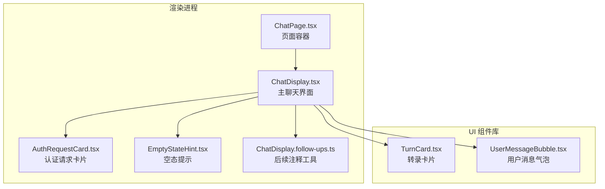
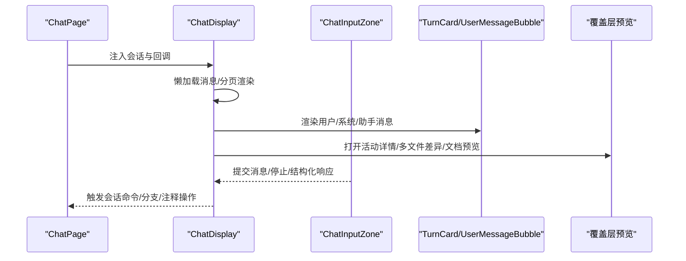
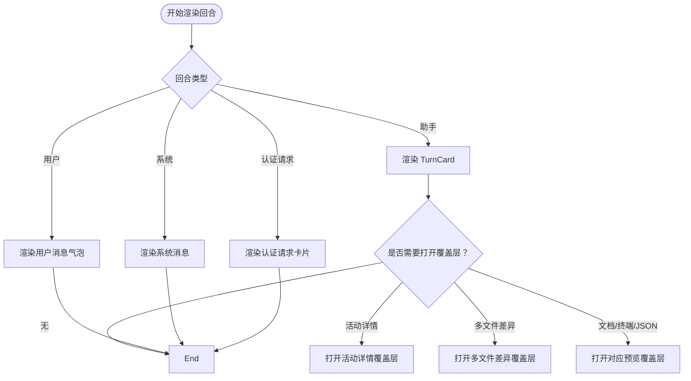
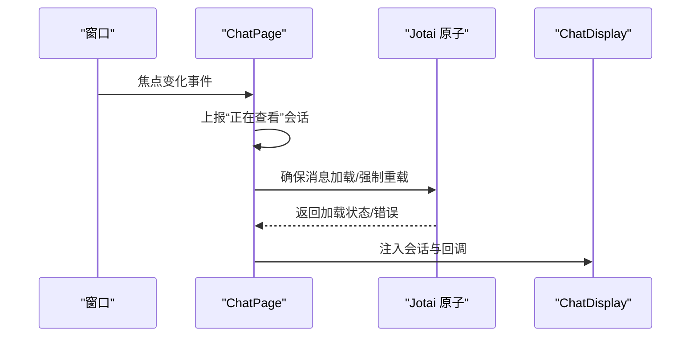
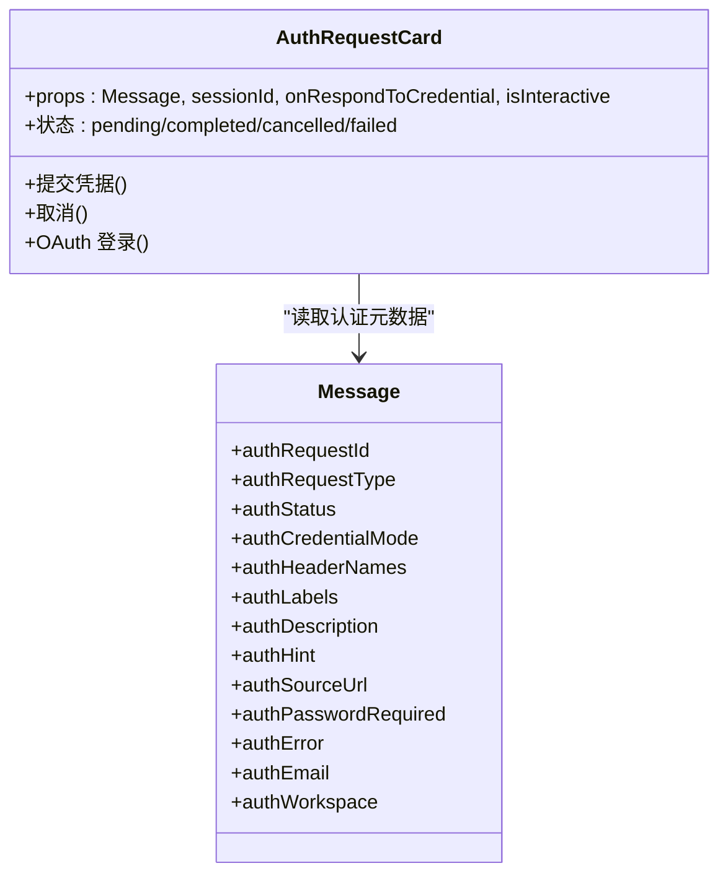
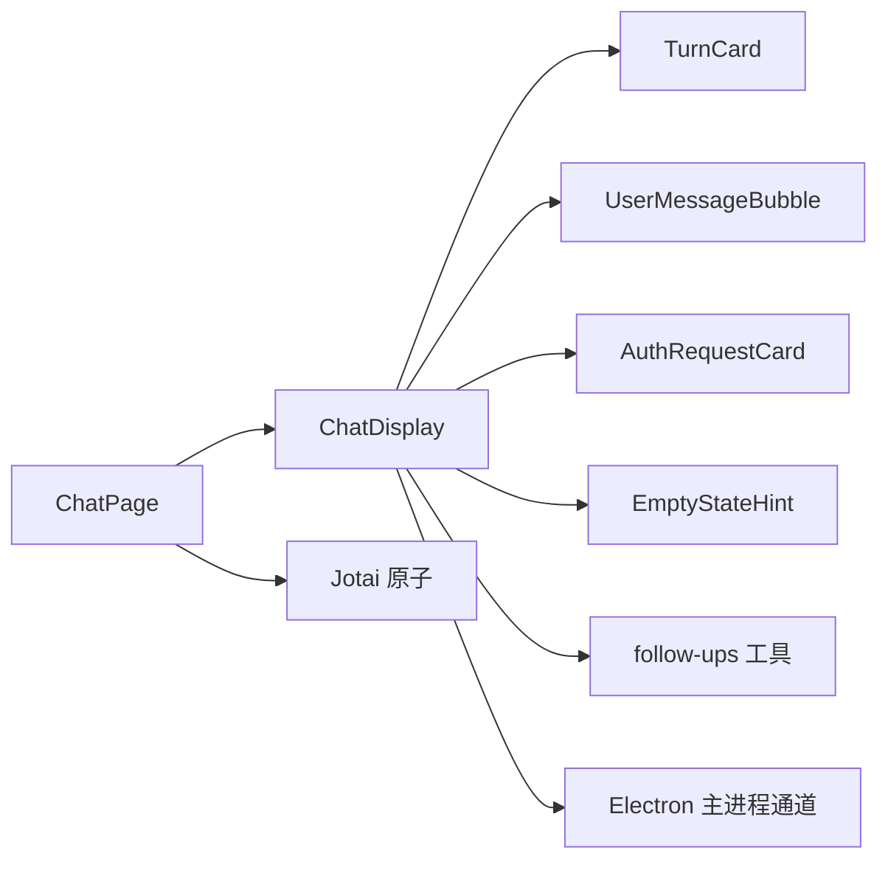

# 聊天组件

<cite>
**本文档引用的文件**
- [ChatDisplay.tsx](file://apps/electron/src/renderer/components/app-shell/ChatDisplay.tsx)
- [ChatPage.tsx](file://apps/electron/src/renderer/pages/ChatPage.tsx)
- [AuthRequestCard.tsx](file://apps/electron/src/renderer/components/chat/AuthRequestCard.tsx)
- [EmptyStateHint.tsx](file://apps/electron/src/renderer/components/chat/EmptyStateHint.tsx)
- [ChatDisplay.follow-ups.ts](file://apps/electron/src/renderer/components/app-shell/ChatDisplay.follow-ups.ts)
</cite>

## 目录
1. [简介](#简介)
2. [项目结构](#项目结构)
3. [核心组件](#核心组件)
4. [架构总览](#架构总览)
5. [详细组件分析](#详细组件分析)
6. [依赖关系分析](#依赖关系分析)
7. [性能考量](#性能考量)
8. [故障排查指南](#故障排查指南)
9. [结论](#结论)
10. [附录](#附录)

## 简介
本文件为聊天组件的专业技术文档，聚焦于会话显示、消息气泡、转录卡片（TurnCard）、输入与权限认证、搜索高亮、覆盖层预览等核心能力。文档从架构设计、数据流、状态同步、事件处理到扩展与性能优化进行全面阐述，帮助开发者快速理解并高效集成与定制聊天功能。

## 项目结构
聊天相关代码主要位于 Electron 渲染进程的 app-shell 与 chat 子目录中：
- ChatDisplay：主聊天界面，负责消息分页、滚动、搜索高亮、覆盖层预览、输入区桥接等
- ChatPage：页面容器，负责会话加载、消息懒加载、窗口焦点与未读标记、标题菜单等
- AuthRequestCard：认证请求内联卡片，支持多种凭据模式与 OAuth 流程
- EmptyStateHint：空态提示，用于引导用户进行首次对话
- ChatDisplay.follow-ups.ts：关注“后续注释”（follow-ups）的纯函数工具集

图表来源
- [ChatPage.tsx:1-837](file://apps/electron/src/renderer/pages/ChatPage.tsx#L1-L837)
- [ChatDisplay.tsx:1-2362](file://apps/electron/src/renderer/components/app-shell/ChatDisplay.tsx#L1-L2362)
- [AuthRequestCard.tsx:1-676](file://apps/electron/src/renderer/components/chat/AuthRequestCard.tsx#L1-L676)
- [EmptyStateHint.tsx:1-230](file://apps/electron/src/renderer/components/chat/EmptyStateHint.tsx#L1-L230)
- [ChatDisplay.follow-ups.ts:1-120](file://apps/electron/src/renderer/components/app-shell/ChatDisplay.follow-ups.ts#L1-L120)

章节来源
- [ChatPage.tsx:1-837](file://apps/electron/src/renderer/pages/ChatPage.tsx#L1-L837)
- [ChatDisplay.tsx:1-2362](file://apps/electron/src/renderer/components/app-shell/ChatDisplay.tsx#L1-L2362)

## 核心组件
- ChatDisplay：聊天主界面，负责消息分页渲染、滚动行为、搜索高亮、覆盖层预览、输入区桥接、权限/凭据响应、分支会话创建、注释与后续注释交互等
- ChatPage：页面级容器，负责会话数据加载与重载、未读标记、标题菜单、分享与归档、工作目录与模型解析等
- AuthRequestCard：内联认证卡片，支持基本认证、多头、单值凭据与 OAuth 流程
- EmptyStateHint：空态提示，提供可解析的实体令牌模板，用于生成工作流建议
- ChatDisplay.follow-ups：后续注释的格式化与规范化工具

章节来源
- [ChatDisplay.tsx:131-236](file://apps/electron/src/renderer/components/app-shell/ChatDisplay.tsx#L131-L236)
- [ChatPage.tsx:32-34](file://apps/electron/src/renderer/pages/ChatPage.tsx#L32-L34)
- [AuthRequestCard.tsx:142-150](file://apps/electron/src/renderer/components/chat/AuthRequestCard.tsx#L142-L150)
- [EmptyStateHint.tsx:160-165](file://apps/electron/src/renderer/components/chat/EmptyStateHint.tsx#L160-L165)
- [ChatDisplay.follow-ups.ts:21-29](file://apps/electron/src/renderer/components/app-shell/ChatDisplay.follow-ups.ts#L21-L29)

## 架构总览
聊天系统采用“页面容器 + 主界面 + 多种子组件”的分层架构：
- 页面容器（ChatPage）负责会话数据生命周期、消息懒加载、窗口焦点与未读状态、标题菜单与分享等
- 主界面（ChatDisplay）负责消息渲染、滚动与粘底、搜索高亮、覆盖层预览、输入区桥接、权限/凭据响应、注释与后续注释、分支会话创建等
- 子组件（TurnCard、UserMessageBubble、AuthRequestCard、EmptyStateHint、follow-ups 工具）分别承担转录卡片、消息气泡、认证卡片、空态提示与后续注释逻辑

图表来源
- [ChatPage.tsx:774-800](file://apps/electron/src/renderer/pages/ChatPage.tsx#L774-L800)
- [ChatDisplay.tsx:1895-1950](file://apps/electron/src/renderer/components/app-shell/ChatDisplay.tsx#L1895-L1950)
- [ChatDisplay.tsx:1689-1869](file://apps/electron/src/renderer/components/app-shell/ChatDisplay.tsx#L1689-L1869)

## 详细组件分析

### ChatDisplay 组件
职责与特性
- 消息分页与懒加载：按固定数量翻页，滚动至顶部时增量加载
- 自动滚动与粘底：根据用户滚动位置与面板焦点决定是否自动滚动到底部
- 搜索高亮：使用 CSS Custom Highlight API 对匹配文本进行非破坏性高亮与导航
- 覆盖层预览：支持活动详情、多文件差异、文档/终端/JSON/通用内容预览
- 输入区桥接：将输入区提交、停止、结构化响应、任务控制等事件转发给上层
- 权限/凭据响应：处理权限请求与凭据请求，支持管理员批准与多头凭据
- 分支会话：基于消息创建子会话，保持连接与配置一致性
- 注释与后续注释：支持在响应中添加/编辑/删除注释，以及将注释转换为发送前的“后续注释”段落

关键数据结构
- OverlayState：覆盖层状态联合类型，支持活动详情、多文件差异、Markdown 文档三种形态
- ProcessingIndicator：处理状态指示器，随机循环提示语与计时
- 结构化输入状态：权限请求优先，其次凭据请求，支持管理员批准与多头凭据

消息渲染流程
- 将消息按回合分组，区分用户、系统、助手、认证请求四种类型
- 用户消息使用用户气泡组件；系统消息使用系统消息组件；助手消息使用 TurnCard
- 认证请求使用 AuthRequestCard 内联卡片

实时更新机制
- 使用 ResizeObserver 在流式渲染时进行防抖滚动，避免布局抖动
- 使用 requestAnimationFrame 进行滚动补偿与滚动后平滑过渡
- 使用 Refs 与本地状态跟踪滚动边界与可见范围，确保新消息插入后的粘底行为

状态同步策略
- 通过 Jotai 原子派生的消息加载状态与错误信息，驱动加载/错误/重试 UI
- 通过本地 Ref 与状态组合，维持滚动位置、粘底开关、可见回合数等 UI 状态
- 通过 Electron 主进程命令与回调，同步会话状态、分支、注释、凭据等

事件处理
- 提交消息：合并“后续注释”段落，规范化后调用上层发送
- 停止处理：向主进程发送取消指令
- 结构化响应：权限/凭据响应直接转发给上层处理
- 分支会话：创建子会话并导航到新面板

图表来源
- [ChatDisplay.tsx:1586-1870](file://apps/electron/src/renderer/components/app-shell/ChatDisplay.tsx#L1586-L1870)
- [ChatDisplay.tsx:1960-2087](file://apps/electron/src/renderer/components/app-shell/ChatDisplay.tsx#L1960-L2087)

章节来源
- [ChatDisplay.tsx:421-520](file://apps/electron/src/renderer/components/app-shell/ChatDisplay.tsx#L421-L520)
- [ChatDisplay.tsx:1088-1212](file://apps/electron/src/renderer/components/app-shell/ChatDisplay.tsx#L1088-L1212)
- [ChatDisplay.tsx:1214-1265](file://apps/electron/src/renderer/components/app-shell/ChatDisplay.tsx#L1214-L1265)
- [ChatDisplay.tsx:1310-1339](file://apps/electron/src/renderer/components/app-shell/ChatDisplay.tsx#L1310-L1339)
- [ChatDisplay.tsx:1709-1736](file://apps/electron/src/renderer/components/app-shell/ChatDisplay.tsx#L1709-L1736)

### ChatPage 组件
职责与特性
- 会话数据生命周期：确保消息加载、强制重载、错误处理与重试
- 窗口焦点与未读状态：当应用获得焦点且当前面板处于焦点时，上报“正在查看”以清除未读
- 标题菜单与分享：提供会话重命名、加锁/解锁、归档/取消归档、分享/撤销分享等
- 工作目录与模型解析：解析会话有效模型与工作目录，支持路径智能展开
- Draft 输入恢复：监听外部事件恢复输入草稿，支持轮询同步

图表来源
- [ChatPage.tsx:116-152](file://apps/electron/src/renderer/pages/ChatPage.tsx#L116-L152)
- [ChatPage.tsx:186-204](file://apps/electron/src/renderer/pages/ChatPage.tsx#L186-L204)
- [ChatPage.tsx:321-330](file://apps/electron/src/renderer/pages/ChatPage.tsx#L321-L330)

章节来源
- [ChatPage.tsx:36-82](file://apps/electron/src/renderer/pages/ChatPage.tsx#L36-L82)
- [ChatPage.tsx:102-152](file://apps/electron/src/renderer/pages/ChatPage.tsx#L102-L152)
- [ChatPage.tsx:186-204](file://apps/electron/src/renderer/pages/ChatPage.tsx#L186-L204)
- [ChatPage.tsx:321-330](file://apps/electron/src/renderer/pages/ChatPage.tsx#L321-L330)

### AuthRequestCard 组件
职责与特性
- 支持多种凭据模式：基本认证、多头凭据、单值凭据（API Key/Bearer）
- 支持 OAuth 流程：本地回调服务器，浏览器完成授权后返回
- 状态管理：待定、成功、取消、失败四种状态，不同状态呈现不同 UI
- 安全与可用性：密码字段可切换明文/密文，表单支持键盘快捷键（回车保存、Esc 取消）

图表来源
- [AuthRequestCard.tsx:142-150](file://apps/electron/src/renderer/components/chat/AuthRequestCard.tsx#L142-L150)
- [AuthRequestCard.tsx:172-189](file://apps/electron/src/renderer/components/chat/AuthRequestCard.tsx#L172-L189)

章节来源
- [AuthRequestCard.tsx:165-243](file://apps/electron/src/renderer/components/chat/AuthRequestCard.tsx#L165-L243)
- [AuthRequestCard.tsx:263-288](file://apps/electron/src/renderer/components/chat/AuthRequestCard.tsx#L263-L288)
- [AuthRequestCard.tsx:317-362](file://apps/electron/src/renderer/components/chat/AuthRequestCard.tsx#L317-L362)

### EmptyStateHint 组件
职责与特性
- 提供工作流提示，支持实体令牌解析（来源、文件、文件夹、技能）
- 随机选择提示，支持指定索引用于测试
- 实体令牌格式：{source:Gmail}、{file:screenshot}、{folder}、{skill}

章节来源
- [EmptyStateHint.tsx:173-214](file://apps/electron/src/renderer/components/chat/EmptyStateHint.tsx#L173-L214)

### ChatDisplay.follow-ups 工具
职责与特性
- 将注释中的“后续注释”规范化为 Markdown 段落，支持去空白与重新编号
- 提供截断工具用于气泡索引徽章的悬停提示
- 提供消息重解析工具，保证编辑消息时的往返一致性

章节来源
- [ChatDisplay.follow-ups.ts:48-79](file://apps/electron/src/renderer/components/app-shell/ChatDisplay.follow-ups.ts#L48-L79)
- [ChatDisplay.follow-ups.ts:36-40](file://apps/electron/src/renderer/components/app-shell/ChatDisplay.follow-ups.ts#L36-L40)

## 依赖关系分析
- ChatDisplay 依赖 UI 组件库中的 TurnCard、UserMessageBubble、Markdown、滚动区域等
- ChatDisplay 依赖 Electron 主进程通道进行消息发送、取消处理、分支创建、注释增删改等
- ChatPage 依赖 Jotai 原子进行消息加载状态管理与会话选项派生
- AuthRequestCard 依赖验证工具与 Electron 主进程进行 OAuth 流程

图表来源
- [ChatDisplay.tsx:1689-1869](file://apps/electron/src/renderer/components/app-shell/ChatDisplay.tsx#L1689-L1869)
- [ChatPage.tsx:774-800](file://apps/electron/src/renderer/pages/ChatPage.tsx#L774-L800)

章节来源
- [ChatDisplay.tsx:1-75](file://apps/electron/src/renderer/components/app-shell/ChatDisplay.tsx#L1-L75)
- [ChatPage.tsx:27-28](file://apps/electron/src/renderer/pages/ChatPage.tsx#L27-L28)

## 性能考量
- 消息分页：按固定回合数翻页，减少初始渲染压力
- 滚动粘底：仅在面板焦点且用户未手动滚动时自动粘底，避免频繁滚动
- 流式渲染：使用 ResizeObserver 与 requestAnimationFrame 防抖滚动，提升长对话体验
- 消息气泡记忆化：对非流式消息使用记忆化组件，避免重复渲染
- 搜索高亮：使用 CSS Custom Highlight API，避免 DOM 修改带来的重排
- 覆盖层预览：仅在触发时渲染，避免常驻节点占用内存

## 故障排查指南
常见问题与定位
- 消息加载失败：检查 ChatPage 的消息加载状态与错误信息，确认是否需要重试
- 滚动异常：确认粘底开关与滚动阈值，检查面板焦点状态
- 搜索高亮无效：确认查询长度与 CSS Highlight API 支持情况
- 认证失败：检查 AuthRequestCard 的状态与错误信息，确认凭据格式与 OAuth 回调
- 分支会话不可用：确认连接提供商一致性，必要时切换连接后重试

章节来源
- [ChatPage.tsx:102-152](file://apps/electron/src/renderer/pages/ChatPage.tsx#L102-L152)
- [ChatDisplay.tsx:780-897](file://apps/electron/src/renderer/components/app-shell/ChatDisplay.tsx#L780-L897)
- [AuthRequestCard.tsx:388-396](file://apps/electron/src/renderer/components/chat/AuthRequestCard.tsx#L388-L396)

## 结论
该聊天组件体系以 ChatDisplay 为核心，结合 ChatPage 的数据生命周期管理、AuthRequestCard 的认证能力、EmptyStateHint 的引导提示与 follow-ups 工具的注释增强，形成了完整而健壮的聊天体验。其分页渲染、流式滚动、搜索高亮与覆盖层预览等特性，既保证了性能，又提升了交互质量。开发者可在此基础上扩展输入区、主题与样式、附件展示等能力。

## 附录
- 扩展指南
  - 新增消息类型：在 ChatDisplay 中新增类型分支并接入对应渲染组件
  - 自定义样式：通过主题变量与容器类名覆盖默认样式，注意与暗色/亮色主题适配
  - 附件展示：在 UserMessageBubble 中扩展附件预览组件，支持图片、文档、视频等
  - 搜索高亮：可调整匹配算法与高亮范围上限，平衡性能与准确性
- 集成方案
  - 与主进程通信：通过 Electron 主进程通道发送消息、取消处理、创建分支、更新注释
  - 与 Jotai 协作：利用原子派生消息加载状态与会话选项，确保状态一致
  - 与 UI 组件库协作：复用 TurnCard、UserMessageBubble 等组件，保持一致性