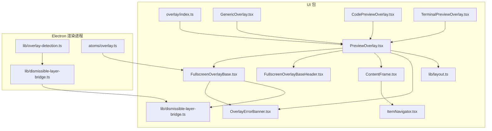
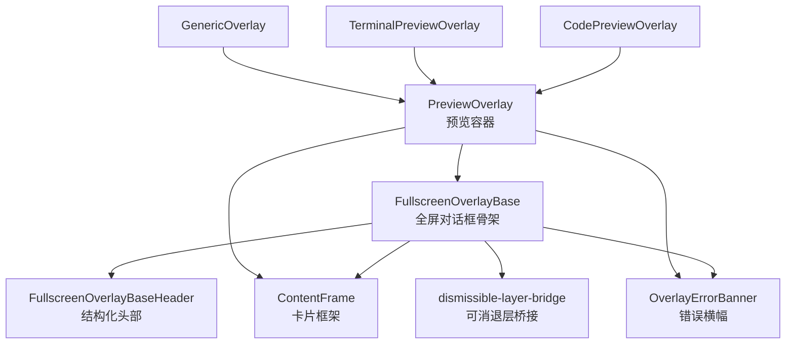
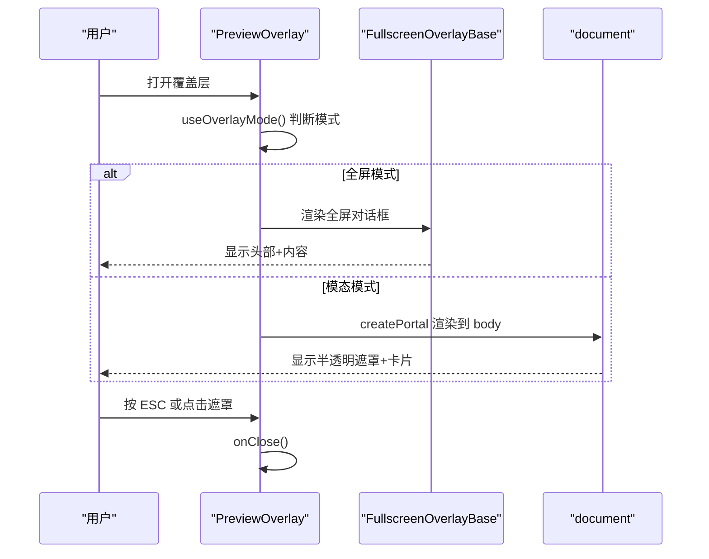
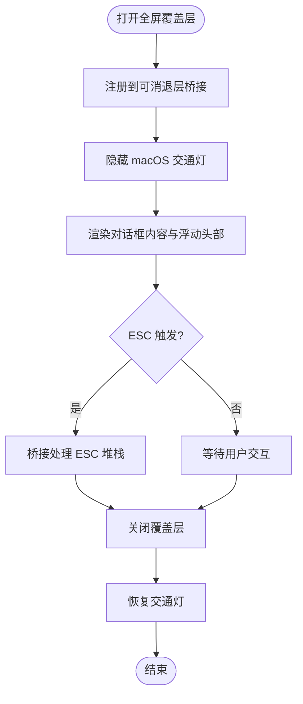
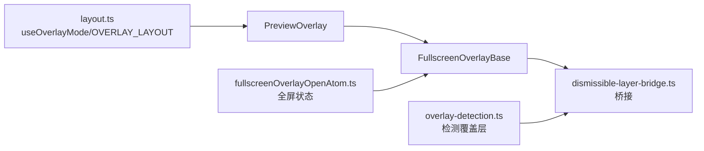

# 覆盖层组件

<cite>
**本文引用的文件**
- [packages/ui/src/components/overlay/index.ts](file://packages/ui/src/components/overlay/index.ts)
- [packages/ui/src/components/overlay/PreviewOverlay.tsx](file://packages/ui/src/components/overlay/PreviewOverlay.tsx)
- [packages/ui/src/components/overlay/FullscreenOverlayBase.tsx](file://packages/ui/src/components/overlay/FullscreenOverlayBase.tsx)
- [packages/ui/src/components/overlay/FullscreenOverlayBaseHeader.tsx](file://packages/ui/src/components/overlay/FullscreenOverlayBaseHeader.tsx)
- [packages/ui/src/components/overlay/ContentFrame.tsx](file://packages/ui/src/components/overlay/ContentFrame.tsx)
- [packages/ui/src/components/overlay/GenericOverlay.tsx](file://packages/ui/src/components/overlay/GenericOverlay.tsx)
- [packages/ui/src/components/overlay/CodePreviewOverlay.tsx](file://packages/ui/src/components/overlay/CodePreviewOverlay.tsx)
- [packages/ui/src/components/overlay/TerminalPreviewOverlay.tsx](file://packages/ui/src/components/overlay/TerminalPreviewOverlay.tsx)
- [packages/ui/src/lib/layout.ts](file://packages/ui/src/lib/layout.ts)
- [packages/ui/src/components/overlay/OverlayErrorBanner.tsx](file://packages/ui/src/components/overlay/OverlayErrorBanner.tsx)
- [packages/ui/src/components/overlay/ItemNavigator.tsx](file://packages/ui/src/components/overlay/ItemNavigator.tsx)
- [packages/ui/src/lib/dismissible-layer-bridge.ts](file://packages/ui/src/lib/dismissible-layer-bridge.ts)
- [apps/electron/src/renderer/lib/dismissible-layer-bridge.ts](file://apps/electron/src/renderer/lib/dismissible-layer-bridge.ts)
- [apps/electron/src/renderer/lib/overlay-detection.ts](file://apps/electron/src/renderer/lib/overlay-detection.ts)
- [apps/electron/src/renderer/atoms/overlay.ts](file://apps/electron/src/renderer/atoms/overlay.ts)
</cite>

## 目录
1. [简介](#简介)
2. [项目结构](#项目结构)
3. [核心组件](#核心组件)
4. [架构总览](#架构总览)
5. [组件详解](#组件详解)
6. [依赖关系分析](#依赖关系分析)
7. [性能与可访问性](#性能与可访问性)
8. [故障排查指南](#故障排查指南)
9. [结论](#结论)
10. [附录：扩展与最佳实践](#附录扩展与最佳实践)

## 简介
本文件系统性地梳理了覆盖层组件体系，涵盖预览覆盖层、代码预览、终端预览、通用覆盖层等组件的架构设计与实现细节。重点解释覆盖层的生命周期管理、动画过渡效果、内容适配机制；文档化不同内容类型的渲染策略、尺寸调整与交互控制；阐述层级管理、遮罩处理与键盘快捷键支持；并提供扩展方法、自定义内容类型与性能优化建议，帮助复杂内容展示功能开发者快速上手与深度定制。

## 项目结构
覆盖层相关代码主要位于 UI 包的 overlay 目录，并在 Electron 渲染进程中提供桥接与检测能力：
- UI 包（packages/ui）：覆盖层基础与专用组件、布局与样式常量、错误横幅、导航器等
- Electron 渲染进程（apps/electron/src/renderer）：覆盖层桥接、检测工具、全屏状态原子

图表来源
- [packages/ui/src/components/overlay/index.ts:1-25](file://packages/ui/src/components/overlay/index.ts#L1-L25)
- [packages/ui/src/components/overlay/PreviewOverlay.tsx:1-211](file://packages/ui/src/components/overlay/PreviewOverlay.tsx#L1-L211)
- [packages/ui/src/components/overlay/FullscreenOverlayBase.tsx:1-211](file://packages/ui/src/components/overlay/FullscreenOverlayBase.tsx#L1-L211)
- [packages/ui/src/components/overlay/FullscreenOverlayBaseHeader.tsx:1-257](file://packages/ui/src/components/overlay/FullscreenOverlayBaseHeader.tsx#L1-L257)
- [packages/ui/src/components/overlay/ContentFrame.tsx:1-116](file://packages/ui/src/components/overlay/ContentFrame.tsx#L1-L116)
- [packages/ui/src/components/overlay/GenericOverlay.tsx:1-186](file://packages/ui/src/components/overlay/GenericOverlay.tsx#L1-L186)
- [packages/ui/src/components/overlay/CodePreviewOverlay.tsx:1-112](file://packages/ui/src/components/overlay/CodePreviewOverlay.tsx#L1-L112)
- [packages/ui/src/components/overlay/TerminalPreviewOverlay.tsx:1-97](file://packages/ui/src/components/overlay/TerminalPreviewOverlay.tsx#L1-L97)
- [packages/ui/src/lib/layout.ts:1-98](file://packages/ui/src/lib/layout.ts#L1-L98)
- [packages/ui/src/components/overlay/OverlayErrorBanner.tsx:1-34](file://packages/ui/src/components/overlay/OverlayErrorBanner.tsx#L1-L34)
- [packages/ui/src/components/overlay/ItemNavigator.tsx:1-110](file://packages/ui/src/components/overlay/ItemNavigator.tsx#L1-L110)
- [packages/ui/src/lib/dismissible-layer-bridge.ts:1-44](file://packages/ui/src/lib/dismissible-layer-bridge.ts#L1-L44)
- [apps/electron/src/renderer/lib/dismissible-layer-bridge.ts:1-44](file://apps/electron/src/renderer/lib/dismissible-layer-bridge.ts#L1-L44)
- [apps/electron/src/renderer/lib/overlay-detection.ts:1-62](file://apps/electron/src/renderer/lib/overlay-detection.ts#L1-L62)
- [apps/electron/src/renderer/atoms/overlay.ts:1-8](file://apps/electron/src/renderer/atoms/overlay.ts#L1-L8)

章节来源
- [packages/ui/src/components/overlay/index.ts:1-25](file://packages/ui/src/components/overlay/index.ts#L1-L25)
- [packages/ui/src/lib/layout.ts:1-98](file://packages/ui/src/lib/layout.ts#L1-L98)

## 核心组件
- 预览覆盖层（PreviewOverlay）
  - 统一的预览容器，负责响应式模式（模态/全屏）、键盘事件、错误横幅、渐变遮罩与内容区域布局
- 全屏覆盖层基座（FullscreenOverlayBase）
  - 基于 Radix Dialog 的全屏覆盖层，提供焦点管理、ESC 处理、macOS 交通灯隐藏、浮动头部、边缘渐变遮罩滚动区
- 全屏覆盖层头部（FullscreenOverlayBaseHeader）
  - 结构化头部，支持类型徽章、文件路径徽章（双触发菜单）、标题徽章、副标题、右侧操作区与复制按钮
- 内容卡片框架（ContentFrame）
  - 提供“应用窗口”风格的卡片框架，支持左右侧栏、标题栏、宽度自适应与最大/最小宽度约束
- 通用覆盖层（GenericOverlay）
  - 针对未知工具内容的回退方案，自动语言检测、单视图/对比视图（diff）
- 代码预览覆盖层（CodePreviewOverlay）
  - 代码文件预览，支持只读/编辑模式、行号范围、命令展示、语法高亮
- 终端预览覆盖层（TerminalPreviewOverlay）
  - 终端输出展示，支持 Bash/Grep/Glob 工具类型、退出码、描述文本
- 错误横幅（OverlayErrorBanner）
  - 与转场卡片一致的破坏色阴影样式错误提示
- 项导航器（ItemNavigator）
  - 左右箭头与下拉选择的通用导航控件
- 布局常量与响应式钩子（layout.ts）
  - 模态断点、最大宽高、遮罩类名、响应式模式判断
- 可消退层桥接（dismissible-layer-bridge）
  - 全局可关闭层注册与 ESC 处理栈，用于多层覆盖协调

章节来源
- [packages/ui/src/components/overlay/PreviewOverlay.tsx:1-211](file://packages/ui/src/components/overlay/PreviewOverlay.tsx#L1-L211)
- [packages/ui/src/components/overlay/FullscreenOverlayBase.tsx:1-211](file://packages/ui/src/components/overlay/FullscreenOverlayBase.tsx#L1-L211)
- [packages/ui/src/components/overlay/FullscreenOverlayBaseHeader.tsx:1-257](file://packages/ui/src/components/overlay/FullscreenOverlayBaseHeader.tsx#L1-L257)
- [packages/ui/src/components/overlay/ContentFrame.tsx:1-116](file://packages/ui/src/components/overlay/ContentFrame.tsx#L1-L116)
- [packages/ui/src/components/overlay/GenericOverlay.tsx:1-186](file://packages/ui/src/components/overlay/GenericOverlay.tsx#L1-L186)
- [packages/ui/src/components/overlay/CodePreviewOverlay.tsx:1-112](file://packages/ui/src/components/overlay/CodePreviewOverlay.tsx#L1-L112)
- [packages/ui/src/components/overlay/TerminalPreviewOverlay.tsx:1-97](file://packages/ui/src/components/overlay/TerminalPreviewOverlay.tsx#L1-L97)
- [packages/ui/src/components/overlay/OverlayErrorBanner.tsx:1-34](file://packages/ui/src/components/overlay/OverlayErrorBanner.tsx#L1-L34)
- [packages/ui/src/components/overlay/ItemNavigator.tsx:1-110](file://packages/ui/src/components/overlay/ItemNavigator.tsx#L1-L110)
- [packages/ui/src/lib/layout.ts:1-98](file://packages/ui/src/lib/layout.ts#L1-L98)
- [packages/ui/src/lib/dismissible-layer-bridge.ts:1-44](file://packages/ui/src/lib/dismissible-layer-bridge.ts#L1-L44)
- [apps/electron/src/renderer/lib/dismissible-layer-bridge.ts:1-44](file://apps/electron/src/renderer/lib/dismissible-layer-bridge.ts#L1-L44)

## 架构总览
覆盖层体系采用“组合优先”的分层设计：
- 基础层：FullscreenOverlayBase 提供全屏对话框骨架与无障碍特性
- 展示层：PreviewOverlay 提供统一的预览容器与响应式行为
- 内容层：ContentFrame 提供卡片框架与侧栏布局
- 专用层：CodePreviewOverlay、TerminalPreviewOverlay、GenericOverlay 等针对特定内容类型
- 支撑层：布局常量、错误横幅、导航器、可消退层桥接与检测工具

图表来源
- [packages/ui/src/components/overlay/FullscreenOverlayBase.tsx:1-211](file://packages/ui/src/components/overlay/FullscreenOverlayBase.tsx#L1-L211)
- [packages/ui/src/components/overlay/FullscreenOverlayBaseHeader.tsx:1-257](file://packages/ui/src/components/overlay/FullscreenOverlayBaseHeader.tsx#L1-L257)
- [packages/ui/src/components/overlay/ContentFrame.tsx:1-116](file://packages/ui/src/components/overlay/ContentFrame.tsx#L1-L116)
- [packages/ui/src/components/overlay/OverlayErrorBanner.tsx:1-34](file://packages/ui/src/components/overlay/OverlayErrorBanner.tsx#L1-L34)
- [packages/ui/src/lib/dismissible-layer-bridge.ts:1-44](file://packages/ui/src/lib/dismissible-layer-bridge.ts#L1-L44)
- [packages/ui/src/components/overlay/PreviewOverlay.tsx:1-211](file://packages/ui/src/components/overlay/PreviewOverlay.tsx#L1-L211)
- [packages/ui/src/components/overlay/CodePreviewOverlay.tsx:1-112](file://packages/ui/src/components/overlay/CodePreviewOverlay.tsx#L1-L112)
- [packages/ui/src/components/overlay/TerminalPreviewOverlay.tsx:1-97](file://packages/ui/src/components/overlay/TerminalPreviewOverlay.tsx#L1-L97)
- [packages/ui/src/components/overlay/GenericOverlay.tsx:1-186](file://packages/ui/src/components/overlay/GenericOverlay.tsx#L1-L186)

## 组件详解

### 预览覆盖层（PreviewOverlay）
- 职责
  - 统一预览容器，封装模态/全屏切换、ESC 关闭、点击遮罩关闭、错误横幅、渐变遮罩与内容区域布局
- 关键特性
  - 响应式模式：通过 useOverlayMode 判断是否为模态或全屏
  - ESC 处理：模态模式下监听键盘事件；全屏模式由 FullscreenOverlayBase 处理
  - 渐变遮罩：顶部与底部边缘渐隐，提升滚动体验
  - 内嵌模式：embedded 参数支持在设计系统中直接渲染
- 生命周期
  - 打开时根据模式渲染全屏对话框或模态弹窗；关闭时清理事件监听
- 交互
  - 点击模态背景关闭；错误状态时显示错误横幅

图表来源
- [packages/ui/src/components/overlay/PreviewOverlay.tsx:76-211](file://packages/ui/src/components/overlay/PreviewOverlay.tsx#L76-L211)
- [packages/ui/src/components/overlay/FullscreenOverlayBase.tsx:94-211](file://packages/ui/src/components/overlay/FullscreenOverlayBase.tsx#L94-L211)
- [packages/ui/src/lib/layout.ts:80-97](file://packages/ui/src/lib/layout.ts#L80-L97)

章节来源
- [packages/ui/src/components/overlay/PreviewOverlay.tsx:1-211](file://packages/ui/src/components/overlay/PreviewOverlay.tsx#L1-L211)
- [packages/ui/src/lib/layout.ts:1-98](file://packages/ui/src/lib/layout.ts#L1-L98)

### 全屏覆盖层基座（FullscreenOverlayBase）
- 职责
  - 基于 Radix Dialog 的全屏覆盖层骨架，提供焦点管理、ESC 协调、macOS 交通灯隐藏、浮动头部与边缘遮罩滚动区
- 关键特性
  - z-index 固定值，确保覆盖层层级高于应用 Chrome
  - 浮动头部覆盖滚动内容，内容区使用 CSS 掩膜实现顶部/底部渐隐
  - 可选结构化头部（类型徽章、文件路径徽章、标题徽章、副标题、右侧操作）
  - ESC 事件通过可消退层桥接进行堆栈式处理
- 生命周期
  - 打开时注册到可消退层桥接，关闭时移除；同时隐藏/恢复 macOS 交通灯

图表来源
- [packages/ui/src/components/overlay/FullscreenOverlayBase.tsx:94-211](file://packages/ui/src/components/overlay/FullscreenOverlayBase.tsx#L94-L211)
- [packages/ui/src/lib/dismissible-layer-bridge.ts:19-44](file://packages/ui/src/lib/dismissible-layer-bridge.ts#L19-L44)

章节来源
- [packages/ui/src/components/overlay/FullscreenOverlayBase.tsx:1-211](file://packages/ui/src/components/overlay/FullscreenOverlayBase.tsx#L1-L211)
- [packages/ui/src/lib/dismissible-layer-bridge.ts:1-44](file://packages/ui/src/lib/dismissible-layer-bridge.ts#L1-L44)

### 全屏覆盖层头部（FullscreenOverlayBaseHeader）
- 职责
  - 构建头部徽章行，支持类型徽章、文件路径徽章（双触发菜单）、标题徽章、副标题与右侧操作
- 文件路径徽章
  - 左键：Radix 下拉菜单；右键：上下文菜单；共享同一菜单项
  - 通过 PlatformContext 提供的外部打开与资源定位能力
- 复制按钮
  - 右侧操作区内置复制全部内容按钮，支持复制成功反馈

章节来源
- [packages/ui/src/components/overlay/FullscreenOverlayBaseHeader.tsx:1-257](file://packages/ui/src/components/overlay/FullscreenOverlayBaseHeader.tsx#L1-L257)

### 内容卡片框架（ContentFrame）
- 职责
  - “应用窗口”风格卡片，居中布局，支持左右侧栏、标题栏、内容区自然增长
- 宽度策略
  - 默认：最大宽度约束（如 850px），填充可用宽度
  - fitContent：使用 max-content 自然增长，适合可变宽度内容（如对比表格），受外层容器限制
- 布局
  - 绝对定位侧栏不改变卡片中心位置，卡片无内部滚动，父级滚动容器实现“纸张滚动”

章节来源
- [packages/ui/src/components/overlay/ContentFrame.tsx:1-116](file://packages/ui/src/components/overlay/ContentFrame.tsx#L1-L116)

### 通用覆盖层（GenericOverlay）
- 职责
  - 针对未知工具内容的回退覆盖层，自动语言检测、单视图/对比视图（diff）
- 语言检测
  - 从标题路径推断扩展名；否则基于内容特征（JSON、代码块标记）推断
- 渲染策略
  - 使用 CodeBlock 进行语法高亮；对比视图左右两列并排展示

章节来源
- [packages/ui/src/components/overlay/GenericOverlay.tsx:1-186](file://packages/ui/src/components/overlay/GenericOverlay.tsx#L1-L186)

### 代码预览覆盖层（CodePreviewOverlay）
- 职责
  - 代码文件预览，支持只读/编辑模式、起始行、总行数、显示行数、命令展示、主题切换
- 渲染策略
  - 通过 ShikiCodeViewer 实现语法高亮；标题徽章根据模式变化颜色与图标

章节来源
- [packages/ui/src/components/overlay/CodePreviewOverlay.tsx:1-112](file://packages/ui/src/components/overlay/CodePreviewOverlay.tsx#L1-L112)

### 终端预览覆盖层（TerminalPreviewOverlay）
- 职责
  - 终端输出展示，支持 Bash/Grep/Glob 工具类型、退出码、描述文本、主题切换
- 渲染策略
  - 通过 TerminalOutput 组件渲染命令、输出与退出码

章节来源
- [packages/ui/src/components/overlay/TerminalPreviewOverlay.tsx:1-97](file://packages/ui/src/components/overlay/TerminalPreviewOverlay.tsx#L1-L97)

### 错误横幅（OverlayErrorBanner）
- 职责
  - 统一的错误提示横幅，采用破坏色混合背景与阴影色，最大宽度与卡片一致
- 使用场景
  - 在全屏与预览容器中作为内容上方的错误提示

章节来源
- [packages/ui/src/components/overlay/OverlayErrorBanner.tsx:1-34](file://packages/ui/src/components/overlay/OverlayErrorBanner.tsx#L1-L34)

### 项导航器（ItemNavigator）
- 职责
  - 左右箭头与下拉选择的通用导航控件，支持 sm/md 尺寸变体
- 交互
  - 点击箭头切换；点击标签打开下拉列表进行直接跳转；当前项显示勾选图标

章节来源
- [packages/ui/src/components/overlay/ItemNavigator.tsx:1-110](file://packages/ui/src/components/overlay/ItemNavigator.tsx#L1-L110)

## 依赖关系分析
- 模式与布局
  - useOverlayMode 依据 OVERLAY_LAYOUT 的断点决定模态/全屏
- ESC 协调
  - FullscreenOverlayBase 通过 handleFullscreenEscapeWithStack 调用可消退层桥接处理 ESC
  - Electron 端 overlay-detection 提供全局覆盖层检测，避免 ESC 干扰聊天中断
- 全屏状态联动
  - fullscreenOverlayOpenAtom 用于 AppShell 对主内容进行缩放回退效果

图表来源
- [packages/ui/src/lib/layout.ts:80-97](file://packages/ui/src/lib/layout.ts#L80-L97)
- [packages/ui/src/components/overlay/PreviewOverlay.tsx:90-108](file://packages/ui/src/components/overlay/PreviewOverlay.tsx#L90-L108)
- [packages/ui/src/components/overlay/FullscreenOverlayBase.tsx:88-128](file://packages/ui/src/components/overlay/FullscreenOverlayBase.tsx#L88-L128)
- [packages/ui/src/lib/dismissible-layer-bridge.ts:19-44](file://packages/ui/src/lib/dismissible-layer-bridge.ts#L19-L44)
- [apps/electron/src/renderer/lib/overlay-detection.ts:53-61](file://apps/electron/src/renderer/lib/overlay-detection.ts#L53-L61)
- [apps/electron/src/renderer/atoms/overlay.ts:1-8](file://apps/electron/src/renderer/atoms/overlay.ts#L1-L8)

章节来源
- [packages/ui/src/lib/layout.ts:1-98](file://packages/ui/src/lib/layout.ts#L1-L98)
- [packages/ui/src/lib/dismissible-layer-bridge.ts:1-44](file://packages/ui/src/lib/dismissible-layer-bridge.ts#L1-L44)
- [apps/electron/src/renderer/lib/overlay-detection.ts:1-62](file://apps/electron/src/renderer/lib/overlay-detection.ts#L1-L62)
- [apps/electron/src/renderer/atoms/overlay.ts:1-8](file://apps/electron/src/renderer/atoms/overlay.ts#L1-L8)

## 性能与可访问性
- 性能
  - 预览容器与全屏容器均采用 Portal/固定定位，减少重排与重绘
  - 内容卡片使用 max-content 与外层滚动容器实现“纸张滚动”，避免内部滚动带来的复杂布局计算
  - 语言检测与主题切换在组件内缓存，避免重复计算
- 可访问性
  - 全屏覆盖层使用 Radix Dialog，具备焦点管理、ESC 处理与 aria-modal
  - 浮动头部与内容区通过 CSS 掩膜实现边缘渐隐，改善滚动体验
  - 错误横幅采用破坏色混合背景与阴影色，确保视觉层次清晰

[本节为通用指导，无需列出具体文件来源]

## 故障排查指南
- ESC 未生效
  - 检查是否处于全屏模式（FullscreenOverlayBase 负责 ESC），或是否被可消退层桥接接管
  - 确认 Electron 端 overlay-detection 是否误判存在其他覆盖层
- 点击遮罩无法关闭
  - 模态模式下点击遮罩会关闭；全屏模式需确认是否正确渲染到 FullscreenOverlayBase
- 交通灯遮挡
  - 全屏打开时已自动隐藏，关闭后恢复；若异常，检查平台上下文回调是否正确设置
- 错误横幅不显示
  - 确认传入 error 对象格式正确，且容器内存在内容区以容纳横幅

章节来源
- [packages/ui/src/components/overlay/FullscreenOverlayBase.tsx:130-137](file://packages/ui/src/components/overlay/FullscreenOverlayBase.tsx#L130-L137)
- [packages/ui/src/components/overlay/PreviewOverlay.tsx:187-209](file://packages/ui/src/components/overlay/PreviewOverlay.tsx#L187-L209)
- [apps/electron/src/renderer/lib/overlay-detection.ts:53-61](file://apps/electron/src/renderer/lib/overlay-detection.ts#L53-L61)

## 结论
覆盖层组件体系通过清晰的分层与职责划分，实现了统一的预览容器、灵活的内容适配与一致的交互体验。借助可消退层桥接与 ESC 协调、响应式布局与遮罩滚动区、以及结构化头部与错误横幅，开发者可以快速构建复杂内容展示功能，并在需要时进行扩展与定制。

[本节为总结，无需列出具体文件来源]

## 附录：扩展与最佳实践
- 扩展新的覆盖层
  - 新建组件继承 PreviewOverlay 或直接使用 FullscreenOverlayBase，按需引入 ContentFrame、错误横幅与导航器
  - 若为全屏场景，确保提供结构化头部参数（类型徽章、文件路径徽章、标题徽章、副标题、右侧操作）
- 自定义内容类型
  - 通用覆盖层提供语言检测与对比视图；代码/终端覆盖层分别集成语法高亮与终端输出组件
  - 对于特殊格式，可在通用覆盖层基础上增加扩展检测逻辑
- 性能优化
  - 使用 ContentFrame 的 fitContent 模式以适配可变宽度内容，避免 JS 计算导致的抖动
  - 合理使用 Portal 与固定定位，减少不必要的重排
  - 对语言检测与主题切换结果进行缓存，避免重复计算
- 交互与可访问性
  - 保持 ESC 行为一致性，优先交由可消退层桥接处理
  - 为错误状态提供明确的标签与消息，确保可读性与可访问性
  - 为浮动头部与内容区提供合适的遮罩与滚动体验

[本节为通用指导，无需列出具体文件来源]