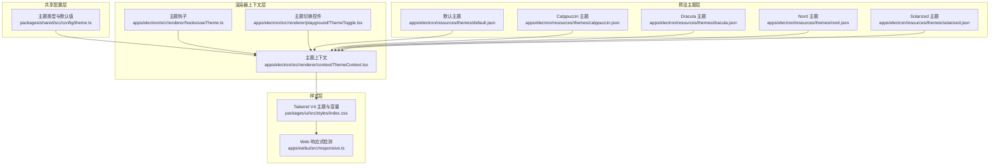
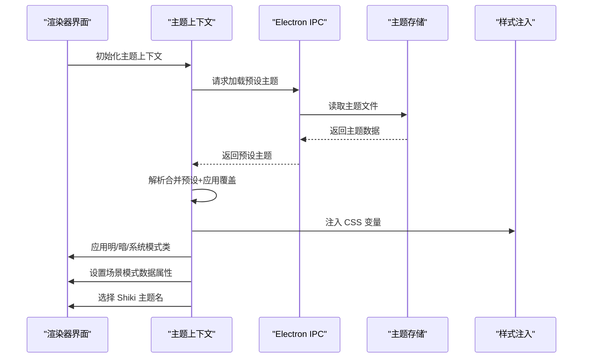
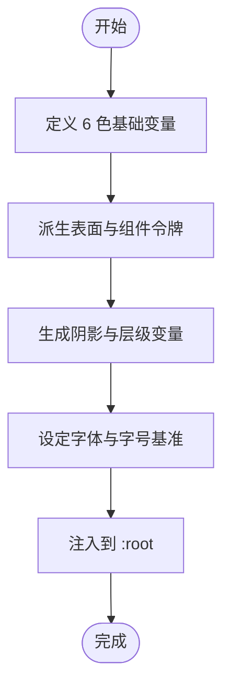
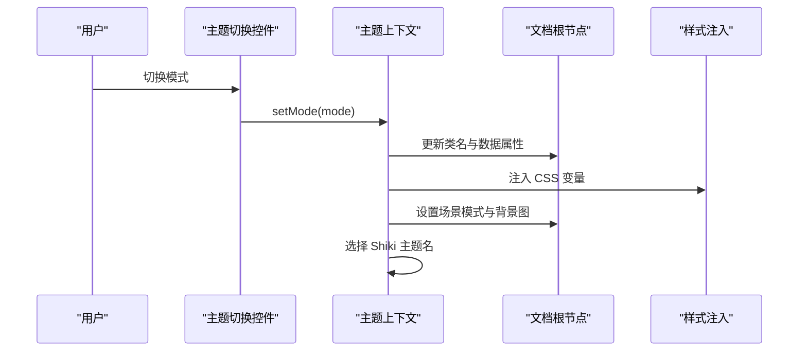
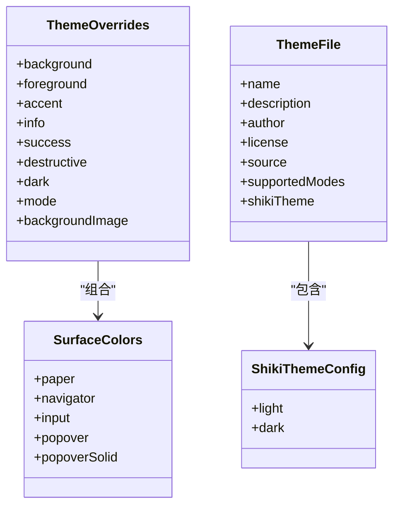
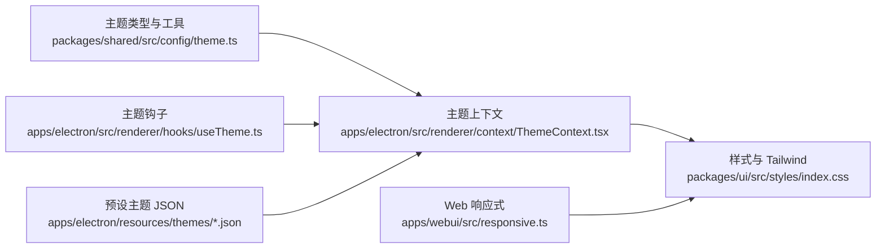

# 设计系统

<cite>
**本文引用的文件**
- [packages/ui/src/styles/index.css](file://packages/ui/src/styles/index.css)
- [packages/shared/src/config/theme.ts](file://packages/shared/src/config/theme.ts)
- [apps/electron/src/renderer/context/ThemeContext.tsx](file://apps/electron/src/renderer/context/ThemeContext.tsx)
- [apps/electron/src/renderer/hooks/useTheme.ts](file://apps/electron/src/renderer/hooks/useTheme.ts)
- [apps/electron/resources/themes/default.json](file://apps/electron/resources/themes/default.json)
- [apps/electron/resources/themes/catppuccin.json](file://apps/electron/resources/themes/catppuccin.json)
- [apps/electron/resources/themes/dracula.json](file://apps/electron/resources/themes/dracula.json)
- [apps/electron/resources/themes/nord.json](file://apps/electron/resources/themes/nord.json)
- [apps/electron/resources/themes/solarized.json](file://apps/electron/resources/themes/solarized.json)
- [apps/webui/src/responsive.ts](file://apps/webui/src/responsive.ts)
- [packages/shared/src/colors/types.ts](file://packages/shared/src/colors/types.ts)
- [apps/electron/src/renderer/playground/ThemeToggle.tsx](file://apps/electron/src/renderer/playground/ThemeToggle.tsx)
</cite>

## 目录
1. [简介](#简介)
2. [项目结构](#项目结构)
3. [核心组件](#核心组件)
4. [架构总览](#架构总览)
5. [详细组件分析](#详细组件分析)
6. [依赖关系分析](#依赖关系分析)
7. [性能考量](#性能考量)
8. [故障排查指南](#故障排查指南)
9. [结论](#结论)
10. [附录](#附录)

## 简介
本设计系统围绕 Craft Agents 的统一视觉语言与交互体验构建，覆盖主题系统、颜色体系、字体规范、间距系统、阴影与层级、响应式策略以及无障碍设计原则。系统采用以 CSS 变量为核心的动态主题适配机制，结合预设主题与可扩展的自定义主题，确保在桌面端与 Web 端的一致性与可维护性。

## 项目结构
设计系统主要由以下层次构成：
- 共享配置层：主题类型、合并逻辑、默认值与导出工具
- 渲染器上下文层：主题状态管理、模式切换、DOM 注入与跨窗口同步
- 样式层：Tailwind V4 主题集成、CSS 变量、阴影与层级、滚动条与焦点环
- 预设主题层：多套主题 JSON 文件，支持明暗模式与语法高亮映射
- 响应式层：移动端检测与容器查询配合的布局策略

**图表来源**
- [packages/shared/src/config/theme.ts:1-318](file://packages/shared/src/config/theme.ts#L1-L318)
- [apps/electron/src/renderer/context/ThemeContext.tsx:1-536](file://apps/electron/src/renderer/context/ThemeContext.tsx#L1-L536)
- [apps/electron/src/renderer/hooks/useTheme.ts:1-77](file://apps/electron/src/renderer/hooks/useTheme.ts#L1-L77)
- [apps/electron/src/renderer/playground/ThemeToggle.tsx:1-37](file://apps/electron/src/renderer/playground/ThemeToggle.tsx#L1-L37)
- [packages/ui/src/styles/index.css:1-550](file://packages/ui/src/styles/index.css#L1-L550)
- [apps/webui/src/responsive.ts:1-36](file://apps/webui/src/responsive.ts#L1-L36)
- [apps/electron/resources/themes/default.json:1-26](file://apps/electron/resources/themes/default.json#L1-L26)
- [apps/electron/resources/themes/catppuccin.json:1-27](file://apps/electron/resources/themes/catppuccin.json#L1-L27)
- [apps/electron/resources/themes/dracula.json:1-27](file://apps/electron/resources/themes/dracula.json#L1-L27)
- [apps/electron/resources/themes/nord.json:1-27](file://apps/electron/resources/themes/nord.json#L1-L27)
- [apps/electron/resources/themes/solarized.json:1-27](file://apps/electron/resources/themes/solarized.json#L1-L27)

**章节来源**
- [packages/ui/src/styles/index.css:1-550](file://packages/ui/src/styles/index.css#L1-L550)
- [packages/shared/src/config/theme.ts:1-318](file://packages/shared/src/config/theme.ts#L1-L318)
- [apps/electron/src/renderer/context/ThemeContext.tsx:1-536](file://apps/electron/src/renderer/context/ThemeContext.tsx#L1-L536)
- [apps/electron/src/renderer/hooks/useTheme.ts:1-77](file://apps/electron/src/renderer/hooks/useTheme.ts#L1-L77)
- [apps/electron/resources/themes/default.json:1-26](file://apps/electron/resources/themes/default.json#L1-L26)
- [apps/electron/resources/themes/catppuccin.json:1-27](file://apps/electron/resources/themes/catppuccin.json#L1-L27)
- [apps/electron/resources/themes/dracula.json:1-27](file://apps/electron/resources/themes/dracula.json#L1-L27)
- [apps/electron/resources/themes/nord.json:1-27](file://apps/electron/resources/themes/nord.json#L1-L27)
- [apps/electron/resources/themes/solarized.json:1-27](file://apps/electron/resources/themes/solarized.json#L1-L27)
- [apps/webui/src/responsive.ts:1-36](file://apps/webui/src/responsive.ts#L1-L36)

## 核心组件
- 主题类型与默认值：定义语义色、表面色、深色覆盖、模式与背景图等字段，并提供默认主题与 Shiki 映射。
- 主题上下文：负责加载预设主题、解析合并、注入 CSS 变量、应用明/暗/系统模式、处理场景模式（scenic）、跨窗口偏好同步与错误回退。
- 主题钩子：在组件中读取已解析的主题状态，支持应用级覆盖合并。
- 样式层：通过 Tailwind V4 将 CSS 变量映射为主题令牌，提供阴影、层级、滚动条、焦点环、字体与基础排版。
- 预设主题：多套主题 JSON，包含名称、描述、作者、许可证、支持模式、Shiki 映射与颜色值。
- 响应式：移动端检测用于少数场景，整体布局以容器查询为主。

**章节来源**
- [packages/shared/src/config/theme.ts:22-72](file://packages/shared/src/config/theme.ts#L22-L72)
- [apps/electron/src/renderer/context/ThemeContext.tsx:17-65](file://apps/electron/src/renderer/context/ThemeContext.tsx#L17-L65)
- [apps/electron/src/renderer/hooks/useTheme.ts:11-28](file://apps/electron/src/renderer/hooks/useTheme.ts#L11-L28)
- [packages/ui/src/styles/index.css:223-276](file://packages/ui/src/styles/index.css#L223-L276)
- [apps/electron/resources/themes/default.json:1-26](file://apps/electron/resources/themes/default.json#L1-L26)

## 架构总览
设计系统的运行时流程如下：渲染器启动后，从本地或 IPC 加载预设主题，解析合并后生成 CSS 变量并注入到文档根节点；根据用户选择与系统偏好设置明/暗/系统模式，并在必要时强制深色（如仅深色主题或场景模式）。同时，Shiki 语法高亮主题按当前模式选择对应变体。

**图表来源**
- [apps/electron/src/renderer/context/ThemeContext.tsx:185-246](file://apps/electron/src/renderer/context/ThemeContext.tsx#L185-L246)
- [apps/electron/src/renderer/context/ThemeContext.tsx:349-380](file://apps/electron/src/renderer/context/ThemeContext.tsx#L349-L380)
- [apps/electron/src/renderer/context/ThemeContext.tsx:310-347](file://apps/electron/src/renderer/context/ThemeContext.tsx#L310-L347)
- [packages/shared/src/config/theme.ts:178-225](file://packages/shared/src/config/theme.ts#L178-L225)

**章节来源**
- [apps/electron/src/renderer/context/ThemeContext.tsx:185-246](file://apps/electron/src/renderer/context/ThemeContext.tsx#L185-L246)
- [apps/electron/src/renderer/context/ThemeContext.tsx:349-380](file://apps/electron/src/renderer/context/ThemeContext.tsx#L349-L380)
- [apps/electron/src/renderer/context/ThemeContext.tsx:310-347](file://apps/electron/src/renderer/context/ThemeContext.tsx#L310-L347)
- [packages/shared/src/config/theme.ts:178-225](file://packages/shared/src/config/theme.ts#L178-L225)

## 详细组件分析

### 主题系统与 CSS 变量管理
- 6 色语义系统：背景、前景、强调色（品牌紫）、信息（警告/询问）、成功、破坏（错误/失败），并派生文本对比色与半透明变体。
- 派生令牌：卡片、弹出层、边框、输入、环形高亮等，均基于语义色与前景色按比例混合或透明度计算。
- 阴影与层级：提供最小、中等、模态小等多种阴影组合，以及完整的 z-index 分级，满足不同浮层需求。
- 字体与排版：系统字体与等宽代码字体分离，支持 Inter 字体选项与光学尺寸特性。
- 暗色模式：在根元素上切换类名，自动调整阴影透明度与派生色，确保对比度与层次清晰。

**图表来源**
- [packages/ui/src/styles/index.css:33-145](file://packages/ui/src/styles/index.css#L33-L145)
- [packages/ui/src/styles/index.css:151-208](file://packages/ui/src/styles/index.css#L151-L208)
- [packages/ui/src/styles/index.css:223-276](file://packages/ui/src/styles/index.css#L223-L276)

**章节来源**
- [packages/ui/src/styles/index.css:33-208](file://packages/ui/src/styles/index.css#L33-L208)
- [packages/ui/src/styles/index.css:223-276](file://packages/ui/src/styles/index.css#L223-L276)

### 主题切换机制与动态适配
- 模式选择：支持 light、dark、system 三种模式，system 模式下监听系统偏好变化。
- 预设主题加载：优先通过 IPC 获取用户主题，失败则回退到内置主题；支持预览主题（悬停预览不持久化）。
- 场景模式（Scenic）：当主题声明为 scenic 且存在背景图时启用，强制深色并设置背景图像变量。
- Shiki 语法高亮：根据当前模式选择浅/深主题，若主题声明了受限模式，则优先使用其支持的模式。
- 跨窗口同步：通过 IPC 广播主题偏好，避免重复更新与闪烁。

**图表来源**
- [apps/electron/src/renderer/playground/ThemeToggle.tsx:13-36](file://apps/electron/src/renderer/playground/ThemeToggle.tsx#L13-L36)
- [apps/electron/src/renderer/context/ThemeContext.tsx:437-464](file://apps/electron/src/renderer/context/ThemeContext.tsx#L437-L464)
- [apps/electron/src/renderer/context/ThemeContext.tsx:310-347](file://apps/electron/src/renderer/context/ThemeContext.tsx#L310-L347)
- [apps/electron/src/renderer/context/ThemeContext.tsx:349-380](file://apps/electron/src/renderer/context/ThemeContext.tsx#L349-L380)

**章节来源**
- [apps/electron/src/renderer/playground/ThemeToggle.tsx:13-36](file://apps/electron/src/renderer/playground/ThemeToggle.tsx#L13-L36)
- [apps/electron/src/renderer/context/ThemeContext.tsx:437-464](file://apps/electron/src/renderer/context/ThemeContext.tsx#L437-L464)
- [apps/electron/src/renderer/context/ThemeContext.tsx:310-347](file://apps/electron/src/renderer/context/ThemeContext.tsx#L310-L347)
- [apps/electron/src/renderer/context/ThemeContext.tsx:349-380](file://apps/electron/src/renderer/context/ThemeContext.tsx#L349-L380)

### 颜色体系与设计令牌
- 设计令牌：以 CSS 变量形式暴露，组件通过变量引用而非硬编码颜色，确保主题一致与易于替换。
- 实体颜色：支持系统颜色（引用设计系统变量）与自定义颜色（明/暗双色），后者可省略暗色以自动推导。
- 颜色验证：对实体颜色进行格式校验，确保合法的 CSS 颜色字符串与可选的暗色变体。

**图表来源**
- [packages/shared/src/config/theme.ts:55-72](file://packages/shared/src/config/theme.ts#L55-L72)
- [packages/shared/src/config/theme.ts:38-44](file://packages/shared/src/config/theme.ts#L38-L44)
- [packages/shared/src/config/theme.ts:281-289](file://packages/shared/src/config/theme.ts#L281-L289)
- [packages/shared/src/config/theme.ts:272-275](file://packages/shared/src/config/theme.ts#L272-L275)

**章节来源**
- [packages/shared/src/config/theme.ts:22-72](file://packages/shared/src/config/theme.ts#L22-L72)
- [packages/shared/src/colors/types.ts:18-64](file://packages/shared/src/colors/types.ts#L18-L64)

### 字体规范与排版
- 字体族：系统无衬线字体作为默认 UI 字体，等宽代码字体用于代码块与终端风格内容。
- Inter 字体：可通过数据属性启用 Inter，并开启光学尺寸与字形特性优化。
- 排版基准：以 CSS 变量控制基础字号、圆角、间距与字距，确保全局一致性。

**章节来源**
- [packages/ui/src/styles/index.css:134-144](file://packages/ui/src/styles/index.css#L134-L144)
- [packages/ui/src/styles/index.css:212-217](file://packages/ui/src/styles/index.css#L212-L217)

### 间距系统与阴影层级
- 间距：以 CSS 变量定义基础间距单位，配合容器查询与相对单位实现弹性布局。
- 阴影：提供多种阴影组合，适配按钮、卡片、弹出层与模态等场景。
- 层级：z-index 分级明确，覆盖标题栏、面板、下拉、提示、模态、全屏等常见层级。

**章节来源**
- [packages/ui/src/styles/index.css:140-144](file://packages/ui/src/styles/index.css#L140-L144)
- [packages/ui/src/styles/index.css:56-95](file://packages/ui/src/styles/index.css#L56-L95)
- [packages/ui/src/styles/index.css:360-465](file://packages/ui/src/styles/index.css#L360-L465)

### 响应式断点系统
- 容器查询为主：整体布局以容器查询驱动，减少对媒体查询的依赖。
- 移动端检测：在需要的少数场景（触摸事件、虚拟键盘、安全区域）使用移动端检测钩子。
- WebUI 响应式：提供移动端断点检测，便于在 Web 端做针对性处理。

**章节来源**
- [apps/webui/src/responsive.ts:10-35](file://apps/webui/src/responsive.ts#L10-L35)

### 组件样式继承规则
- Tailwind V4 集成：将 CSS 变量映射为 Tailwind 主题令牌，组件可直接使用工具类。
- 基础样式：全局重置与基础元素样式统一，确保组件在不同主题下具有一致外观。
- 弹出层与阴影：统一的弹出层样式类与阴影类，减少重复定义。

**章节来源**
- [packages/ui/src/styles/index.css:223-276](file://packages/ui/src/styles/index.css#L223-L276)
- [packages/ui/src/styles/index.css:282-326](file://packages/ui/src/styles/index.css#L282-L326)
- [packages/ui/src/styles/index.css:450-465](file://packages/ui/src/styles/index.css#L450-L465)

### 主题定制指南
- 使用预设主题：在资源目录中选择合适的主题 JSON，或通过 IPC 加载用户主题。
- 自定义颜色：通过应用级覆盖合并，设置语义色与表面色，或指定深色覆盖。
- 场景模式：在主题中声明 scenic 与背景图，即可启用玻璃面板与全窗背景。
- Shiki 映射：为浅/深模式分别指定语法高亮主题，或使用默认映射。

**章节来源**
- [apps/electron/resources/themes/default.json:1-26](file://apps/electron/resources/themes/default.json#L1-L26)
- [apps/electron/resources/themes/catppuccin.json:1-27](file://apps/electron/resources/themes/catppuccin.json#L1-L27)
- [apps/electron/resources/themes/dracula.json:1-27](file://apps/electron/resources/themes/dracula.json#L1-L27)
- [apps/electron/resources/themes/nord.json:1-27](file://apps/electron/resources/themes/nord.json#L1-L27)
- [apps/electron/resources/themes/solarized.json:1-27](file://apps/electron/resources/themes/solarized.json#L1-L27)
- [packages/shared/src/config/theme.ts:248-263](file://packages/shared/src/config/theme.ts#L248-L263)
- [packages/shared/src/config/theme.ts:311-317](file://packages/shared/src/config/theme.ts#L311-L317)

### 品牌色彩规范
- 品牌强调色：使用强调色作为品牌主色，贯穿交互高亮与关键动作。
- 语义色：信息色用于警告与提示，成功色用于确认与完成，破坏色用于错误与危险。
- 对比度：通过文本对比色与半透明混合，确保在明/暗模式下具备良好可读性。

**章节来源**
- [packages/ui/src/styles/index.css:35-50](file://packages/ui/src/styles/index.css#L35-L50)
- [packages/ui/src/styles/index.css:153-168](file://packages/ui/src/styles/index.css#L153-L168)

### 无障碍性设计原则
- 焦点环：统一的环形高亮与宽度，确保键盘导航可见性。
- 对比度：文本对比色与半透明混合提升可读性，阴影在暗色模式下增强边界感。
- 触达目标：在移动端检测场景下，确保触达目标尺寸与间距符合可访问性要求。

**章节来源**
- [packages/ui/src/styles/index.css:320-325](file://packages/ui/src/styles/index.css#L320-L325)
- [packages/ui/src/styles/index.css:165-168](file://packages/ui/src/styles/index.css#L165-L168)
- [apps/webui/src/responsive.ts:10-35](file://apps/webui/src/responsive.ts#L10-L35)

## 依赖关系分析
- 上下文依赖：主题上下文依赖共享配置模块生成 CSS 变量，并通过 IPC 与文件系统获取预设主题。
- 样式依赖：样式层依赖上下文注入的 CSS 变量，Tailwind V4 通过 @theme 将变量映射为主题令牌。
- 预设主题依赖：预设主题文件位于资源目录，上下文通过 IPC 或内置映射加载。
- 响应式依赖：WebUI 的移动端检测与容器查询共同决定布局行为。

**图表来源**
- [packages/shared/src/config/theme.ts:1-318](file://packages/shared/src/config/theme.ts#L1-L318)
- [apps/electron/src/renderer/context/ThemeContext.tsx:1-536](file://apps/electron/src/renderer/context/ThemeContext.tsx#L1-L536)
- [apps/electron/src/renderer/hooks/useTheme.ts:1-77](file://apps/electron/src/renderer/hooks/useTheme.ts#L1-L77)
- [packages/ui/src/styles/index.css:1-550](file://packages/ui/src/styles/index.css#L1-L550)
- [apps/webui/src/responsive.ts:1-36](file://apps/webui/src/responsive.ts#L1-L36)

**章节来源**
- [packages/shared/src/config/theme.ts:1-318](file://packages/shared/src/config/theme.ts#L1-L318)
- [apps/electron/src/renderer/context/ThemeContext.tsx:1-536](file://apps/electron/src/renderer/context/ThemeContext.tsx#L1-L536)
- [apps/electron/src/renderer/hooks/useTheme.ts:1-77](file://apps/electron/src/renderer/hooks/useTheme.ts#L1-L77)
- [packages/ui/src/styles/index.css:1-550](file://packages/ui/src/styles/index.css#L1-L550)
- [apps/webui/src/responsive.ts:1-36](file://apps/webui/src/responsive.ts#L1-L36)

## 性能考量
- CSS 变量注入：仅在预设主题加载完成后注入，避免闪烁与空变量导致的回流。
- 合并与去抖：主题解析与 DOM 更新集中在上下文层，组件侧通过钩子读取已解析结果，避免重复计算。
- 场景模式：背景图通过内联样式设置，避免大体积数据 URL 影响样式表大小。
- 响应式：优先使用容器查询，减少媒体查询带来的重绘与回流。

[本节为通用指导，无需特定文件来源]

## 故障排查指南
- 主题加载失败：检查 IPC 是否可用与预设主题路径是否存在；查看回退日志与错误状态。
- 模式不匹配：若主题声明受限模式或与系统偏好不一致，根节点会设置不匹配数据属性，需检查主题支持模式与系统偏好。
- Shiki 主题异常：确认主题是否提供当前模式的映射，否则回退到默认映射。
- 颜色无效：实体颜色需符合 CSS 颜色格式，且暗色变体可省略但需合法。

**章节来源**
- [apps/electron/src/renderer/context/ThemeContext.tsx:189-207](file://apps/electron/src/renderer/context/ThemeContext.tsx#L189-L207)
- [apps/electron/src/renderer/context/ThemeContext.tsx:325-334](file://apps/electron/src/renderer/context/ThemeContext.tsx#L325-L334)
- [packages/shared/src/config/theme.ts:311-317](file://packages/shared/src/config/theme.ts#L311-L317)
- [packages/shared/src/colors/types.ts:38-48](file://packages/shared/src/colors/types.ts#L38-L48)

## 结论
Craft Agents 的设计系统以 CSS 变量为核心，结合预设主题与应用级覆盖，实现了跨平台、可扩展且易维护的视觉体系。通过 Tailwind V4 的主题映射与容器查询布局，系统在桌面端与 Web 端保持一致的体验与性能表现。建议在团队协作中遵循设计令牌命名与颜色验证规范，确保主题一致性与可访问性。

[本节为总结，无需特定文件来源]

## 附录
- 设计令牌清单（摘录）
  - 语义色：背景、前景、强调、信息、成功、破坏
  - 表面色：纸张、导航栏、输入区、弹出层、保证不透明弹出层
  - 模式与背景图：solid/scenic 模式与背景图 URL
  - 字体与字号：sans、serif、mono、默认字体与基础字号
  - 阴影与层级：多种阴影组合与 z-index 分级
- 预设主题列表（摘录）
  - 默认、Catppuccin、Dracula、Nord、Solarized 等

**章节来源**
- [packages/ui/src/styles/index.css:33-208](file://packages/ui/src/styles/index.css#L33-L208)
- [packages/shared/src/config/theme.ts:248-263](file://packages/shared/src/config/theme.ts#L248-L263)
- [apps/electron/resources/themes/default.json:1-26](file://apps/electron/resources/themes/default.json#L1-L26)
- [apps/electron/resources/themes/catppuccin.json:1-27](file://apps/electron/resources/themes/catppuccin.json#L1-L27)
- [apps/electron/resources/themes/dracula.json:1-27](file://apps/electron/resources/themes/dracula.json#L1-L27)
- [apps/electron/resources/themes/nord.json:1-27](file://apps/electron/resources/themes/nord.json#L1-L27)
- [apps/electron/resources/themes/solarized.json:1-27](file://apps/electron/resources/themes/solarized.json#L1-L27)