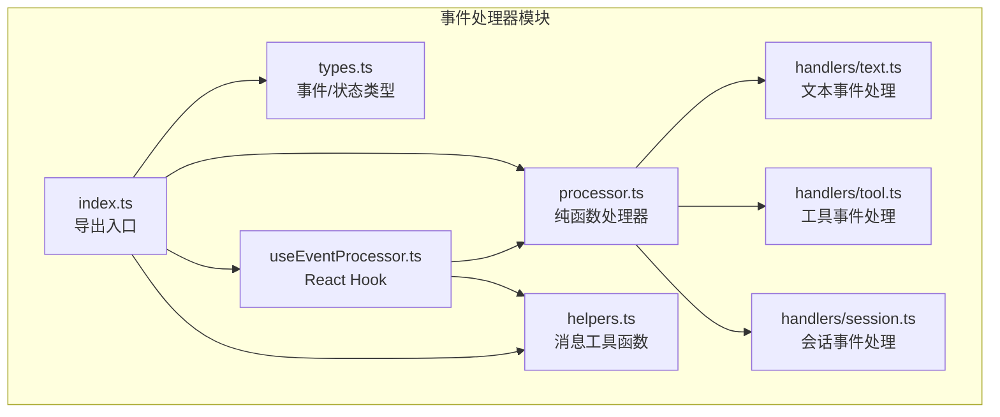
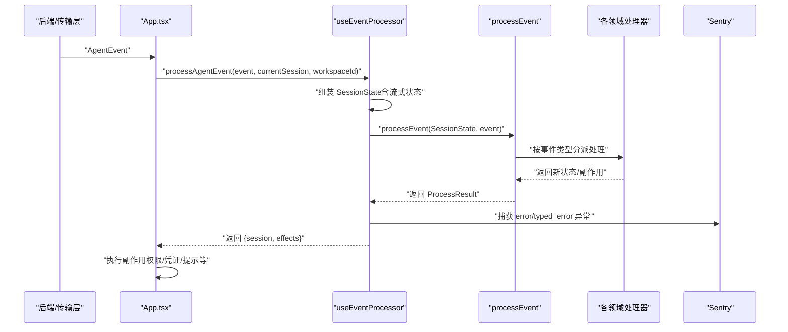
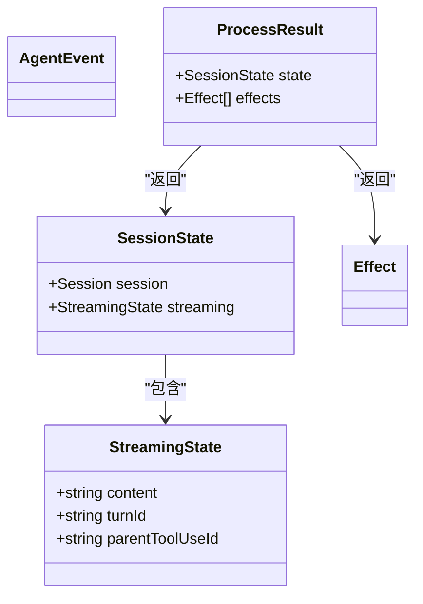
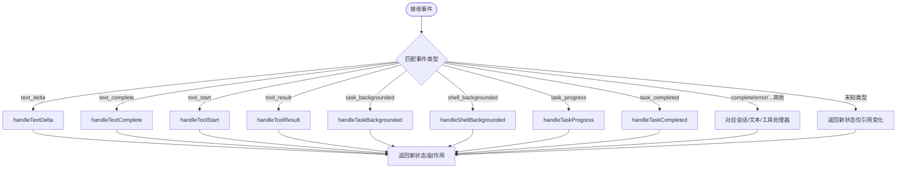
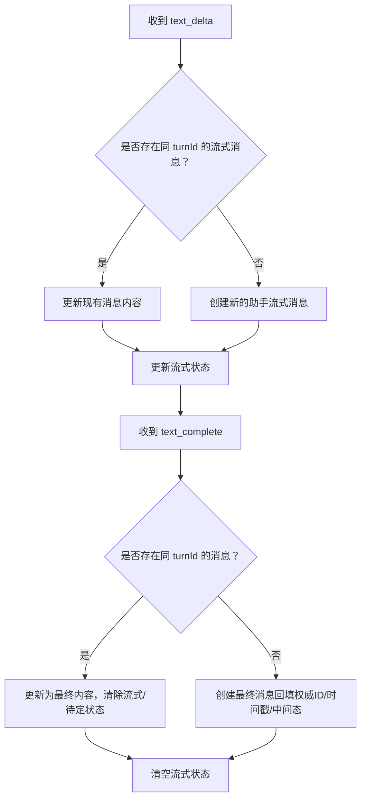
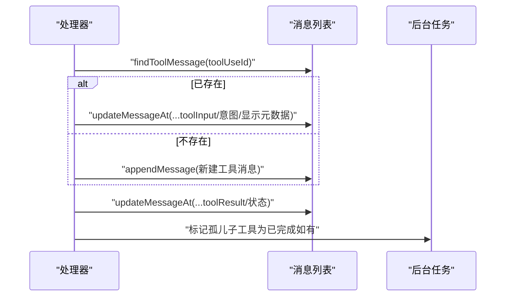
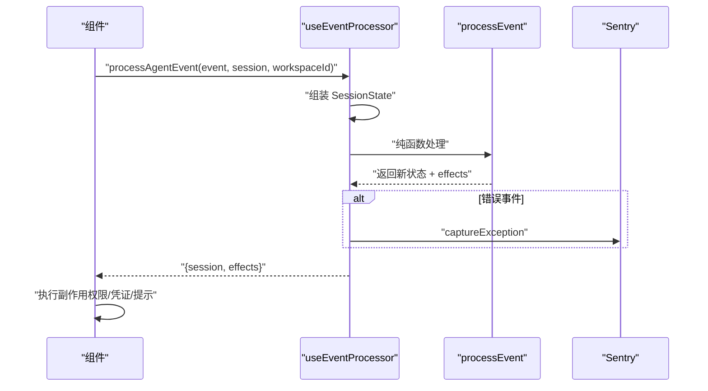
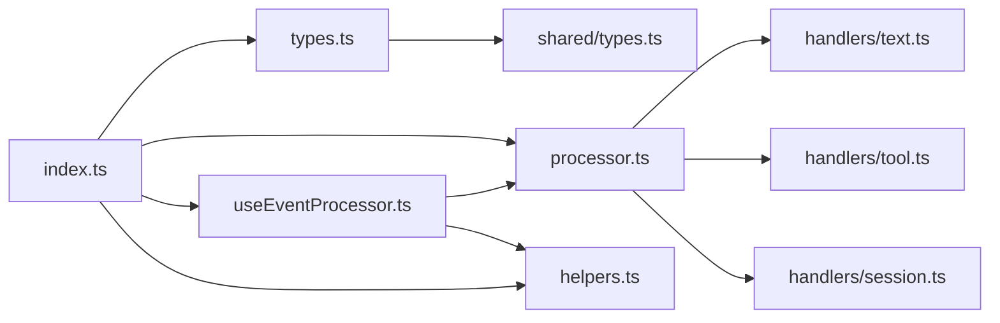

# 事件处理系统

<cite>
**本文引用的文件**
- [apps/electron/src/renderer/event-processor/index.ts](file://apps/electron/src/renderer/event-processor/index.ts)
- [apps/electron/src/renderer/event-processor/types.ts](file://apps/electron/src/renderer/event-processor/types.ts)
- [apps/electron/src/renderer/event-processor/processor.ts](file://apps/electron/src/renderer/event-processor/processor.ts)
- [apps/electron/src/renderer/event-processor/useEventProcessor.ts](file://apps/electron/src/renderer/event-processor/useEventProcessor.ts)
- [apps/electron/src/renderer/event-processor/helpers.ts](file://apps/electron/src/renderer/event-processor/helpers.ts)
- [apps/electron/src/renderer/event-processor/handlers/text.ts](file://apps/electron/src/renderer/event-processor/handlers/text.ts)
- [apps/electron/src/renderer/event-processor/handlers/tool.ts](file://apps/electron/src/renderer/event-processor/handlers/tool.ts)
- [apps/electron/src/renderer/event-processor/handlers/session.ts](file://apps/electron/src/renderer/event-processor/handlers/session.ts)
- [apps/electron/src/renderer/App.tsx](file://apps/electron/src/renderer/App.tsx)
- [apps/electron/src/shared/types.ts](file://apps/electron/src/shared/types.ts)
- [packages/shared/src/utils/perf.ts](file://packages/shared/src/utils/perf.ts)
- [packages/shared/src/automations/event-bus.ts](file://packages/shared/src/automations/event-bus.ts)
</cite>

## 目录
1. [简介](#简介)
2. [项目结构](#项目结构)
3. [核心组件](#核心组件)
4. [架构总览](#架构总览)
5. [详细组件分析](#详细组件分析)
6. [依赖关系分析](#依赖关系分析)
7. [性能考量](#性能考量)
8. [故障排除指南](#故障排除指南)
9. [结论](#结论)
10. [附录](#附录)

## 简介
本文件为事件处理系统的开发与使用指南，聚焦于“集中式纯函数事件处理器”的架构设计与实现细节。该系统通过单一入口的纯函数对各类代理事件进行处理，确保状态转换的一致性、可测试性与无竞态更新；同时提供副作用分离（Effect）与会话级流式状态管理，支持文本流、工具调用、权限请求、认证流程、后台任务等复杂场景。

系统特性包括：
- 单一纯函数处理入口，保证状态不可变更新与引用新化，避免原子同步问题
- 基于事件类型的分支处理，覆盖文本流、工具执行、会话元数据变更、权限与认证等
- 流式状态按会话隔离，避免跨会话干扰
- 副作用（如权限弹窗、凭证输入、标题生成触发、错误上报）在纯函数之外执行，保持处理器纯净
- 提供消息查找与更新的纯工具函数，基于消息 ID 而非位置索引，增强鲁棒性

## 项目结构
事件处理系统位于渲染端应用的事件处理器模块中，核心文件组织如下：
- types.ts：事件与状态类型定义
- processor.ts：纯函数事件处理器
- useEventProcessor.ts：React Hook，封装流式状态与副作用
- helpers.ts：消息查找与更新的纯工具函数
- handlers/text.ts、handlers/tool.ts、handlers/session.ts：按领域划分的事件处理函数
- index.ts：对外导出入口

图表来源
- [apps/electron/src/renderer/event-processor/index.ts:1-40](file://apps/electron/src/renderer/event-processor/index.ts#L1-L40)
- [apps/electron/src/renderer/event-processor/types.ts:1-538](file://apps/electron/src/renderer/event-processor/types.ts#L1-L538)
- [apps/electron/src/renderer/event-processor/processor.ts:1-230](file://apps/electron/src/renderer/event-processor/processor.ts#L1-L230)
- [apps/electron/src/renderer/event-processor/useEventProcessor.ts:1-131](file://apps/electron/src/renderer/event-processor/useEventProcessor.ts#L1-L131)
- [apps/electron/src/renderer/event-processor/helpers.ts:1-172](file://apps/electron/src/renderer/event-processor/helpers.ts#L1-L172)
- [apps/electron/src/renderer/event-processor/handlers/text.ts:1-149](file://apps/electron/src/renderer/event-processor/handlers/text.ts#L1-L149)
- [apps/electron/src/renderer/event-processor/handlers/tool.ts:1-281](file://apps/electron/src/renderer/event-processor/handlers/tool.ts#L1-L281)
- [apps/electron/src/renderer/event-processor/handlers/session.ts:1-950](file://apps/electron/src/renderer/event-processor/handlers/session.ts#L1-L950)

章节来源
- [apps/electron/src/renderer/event-processor/index.ts:1-40](file://apps/electron/src/renderer/event-processor/index.ts#L1-L40)
- [apps/electron/src/renderer/event-processor/types.ts:1-538](file://apps/electron/src/renderer/event-processor/types.ts#L1-L538)

## 核心组件
- 事件类型与状态模型
  - 会话状态：包含会话对象与当前流式状态
  - 文本事件：增量文本与完成事件
  - 工具事件：开始、结果、后台任务、进度、完成
  - 会话事件：完成、错误、状态/信息、中断、标题生成、异步操作、工作目录变更、权限模式变更、模型变更、连接变更、用户消息、标注更新、分享状态、认证请求/完成、使用量更新等
- 处理器
  - processEvent：根据事件类型分派到对应处理函数，返回新的状态与副作用
- Hook
  - useEventProcessor：管理每个会话的流式状态，调用纯函数处理器，并在纯函数外执行副作用（如错误上报）
- 消息工具
  - 基于消息 ID 的查找与更新，保证幂等与一致性

章节来源
- [apps/electron/src/renderer/event-processor/types.ts:1-538](file://apps/electron/src/renderer/event-processor/types.ts#L1-L538)
- [apps/electron/src/renderer/event-processor/processor.ts:62-229](file://apps/electron/src/renderer/event-processor/processor.ts#L62-L229)
- [apps/electron/src/renderer/event-processor/useEventProcessor.ts:78-130](file://apps/electron/src/renderer/event-processor/useEventProcessor.ts#L78-L130)
- [apps/electron/src/renderer/event-processor/helpers.ts:1-172](file://apps/electron/src/renderer/event-processor/helpers.ts#L1-L172)

## 架构总览
事件从后端或传输层到达前端，统一进入 useEventProcessor 的处理流程：
- 若会话不存在则创建空会话
- 组装当前 SessionState（含流式状态）
- 调用纯函数 processEvent 获取新状态与副作用
- 在纯函数外部执行副作用（如错误上报、提示）
- 更新流式状态缓存

图表来源
- [apps/electron/src/renderer/App.tsx:1-200](file://apps/electron/src/renderer/App.tsx#L1-L200)
- [apps/electron/src/renderer/event-processor/useEventProcessor.ts:82-115](file://apps/electron/src/renderer/event-processor/useEventProcessor.ts#L82-L115)
- [apps/electron/src/renderer/event-processor/processor.ts:62-229](file://apps/electron/src/renderer/event-processor/processor.ts#L62-L229)

## 详细组件分析

### 类型与状态模型
- SessionState：会话与流式状态的组合
- AgentEvent：所有事件类型的联合
- Effect：需要在纯函数外执行的副作用
- ProcessResult：处理器返回的新状态与副作用集合

图表来源
- [apps/electron/src/renderer/event-processor/types.ts:13-25](file://apps/electron/src/renderer/event-processor/types.ts#L13-L25)
- [apps/electron/src/renderer/event-processor/types.ts:475-517](file://apps/electron/src/renderer/event-processor/types.ts#L475-L517)
- [apps/electron/src/renderer/event-processor/types.ts:521-537](file://apps/electron/src/renderer/event-processor/types.ts#L521-L537)

章节来源
- [apps/electron/src/renderer/event-processor/types.ts:1-538](file://apps/electron/src/renderer/event-processor/types.ts#L1-L538)

### 纯函数事件处理器
- processEvent：根据事件类型分派到具体处理器，返回新的 SessionState 与副作用数组
- 对未知事件类型：返回新引用的状态，确保原子同步检测到变化
- 对需要副作用的事件：在处理器内部返回 Effect，由 Hook 在纯函数外执行

图表来源
- [apps/electron/src/renderer/event-processor/processor.ts:62-229](file://apps/electron/src/renderer/event-processor/processor.ts#L62-L229)

章节来源
- [apps/electron/src/renderer/event-processor/processor.ts:1-230](file://apps/electron/src/renderer/event-processor/processor.ts#L1-L230)

### 文本事件处理
- handleTextDelta：累积流式内容，若无对应消息则创建新的助手消息
- handleTextComplete：完成流式消息，回填权威消息 ID、时间戳与中间态标记，必要时创建消息以修复竞态

图表来源
- [apps/electron/src/renderer/event-processor/handlers/text.ts:24-148](file://apps/electron/src/renderer/event-processor/handlers/text.ts#L24-L148)

章节来源
- [apps/electron/src/renderer/event-processor/handlers/text.ts:1-149](file://apps/electron/src/renderer/event-processor/handlers/text.ts#L1-L149)

### 工具事件处理
- handleToolStart：根据 toolUseId 查找或创建工具消息，补充输入、意图、显示元数据与父子关系
- handleToolResult：更新工具结果与状态，处理“已保存输出”类误报，自动完成孤儿子工具
- 后台任务相关：task_backgrounded、shell_backgrounded、task_progress、task_completed，维护任务状态与进度

图表来源
- [apps/electron/src/renderer/event-processor/handlers/tool.ts:24-167](file://apps/electron/src/renderer/event-processor/handlers/tool.ts#L24-L167)

章节来源
- [apps/electron/src/renderer/event-processor/handlers/tool.ts:1-281](file://apps/electron/src/renderer/event-processor/handlers/tool.ts#L1-L281)

### 会话事件处理
- 完成/错误/类型化错误：清理运行中工具、追加错误消息、重置处理状态
- 状态/信息：作为消息展示并同步到会话状态
- 中断：区分用户主动停止与静默重定向，保留或恢复输入内容
- 标题生成/异步操作：UI 震动效果与标题状态管理
- 权限模式变更/工作目录/模型/连接变更：同步到会话字段
- 用户消息确认：乐观消息匹配与状态推进
- 分享状态/认证流程：添加/更新消息并暂停处理
- 使用量更新：合并令牌用量统计

章节来源
- [apps/electron/src/renderer/event-processor/handlers/session.ts:53-202](file://apps/electron/src/renderer/event-processor/handlers/session.ts#L53-L202)
- [apps/electron/src/renderer/event-processor/handlers/session.ts:208-285](file://apps/electron/src/renderer/event-processor/handlers/session.ts#L208-L285)
- [apps/electron/src/renderer/event-processor/handlers/session.ts:301-356](file://apps/electron/src/renderer/event-processor/handlers/session.ts#L301-L356)
- [apps/electron/src/renderer/event-processor/handlers/session.ts:361-423](file://apps/electron/src/renderer/event-processor/handlers/session.ts#L361-L423)
- [apps/electron/src/renderer/event-processor/handlers/session.ts:446-503](file://apps/electron/src/renderer/event-processor/handlers/session.ts#L446-L503)
- [apps/electron/src/renderer/event-processor/handlers/session.ts:513-587](file://apps/electron/src/renderer/event-processor/handlers/session.ts#L513-L587)
- [apps/electron/src/renderer/event-processor/handlers/session.ts:809-914](file://apps/electron/src/renderer/event-processor/handlers/session.ts#L809-L914)
- [apps/electron/src/renderer/event-processor/handlers/session.ts:920-948](file://apps/electron/src/renderer/event-processor/handlers/session.ts#L920-L948)

### React Hook 与副作用
- useEventProcessor：维护每个会话的流式状态映射，调用纯函数处理器，捕获错误事件上报 Sentry，暴露清理与查询接口
- 副作用类型：权限请求、凭证请求、标题生成触发、权限模式变更通知、自动重试、恢复输入、错误提示

图表来源
- [apps/electron/src/renderer/event-processor/useEventProcessor.ts:82-115](file://apps/electron/src/renderer/event-processor/useEventProcessor.ts#L82-L115)

章节来源
- [apps/electron/src/renderer/event-processor/useEventProcessor.ts:1-131](file://apps/electron/src/renderer/event-processor/useEventProcessor.ts#L1-L131)

### 消息工具函数
- 基于消息 ID 的查找：turnId、toolUseId、最后流式助手消息
- 不可变更新：复制数组与对象，返回新会话引用
- 创建空会话：初始化会话元数据

章节来源
- [apps/electron/src/renderer/event-processor/helpers.ts:1-172](file://apps/electron/src/renderer/event-processor/helpers.ts#L1-L172)

### 事件订阅与自动化事件总线（扩展能力）
- 自动化事件总线：支持事件注册/注销、任意事件监听、速率限制与并发执行
- 可与事件处理器联动：在自动化中订阅特定事件并触发相应动作

章节来源
- [packages/shared/src/automations/event-bus.ts:187-320](file://packages/shared/src/automations/event-bus.ts#L187-L320)

## 依赖关系分析
- 入口导出
  - index.ts 导出处理器与 Hook，并重新导出类型与工具函数
- 处理器依赖
  - processor.ts 依赖各领域处理器与类型定义
  - useEventProcessor.ts 依赖 processor.ts 与 helpers.ts，并集成 Sentry
- 类型依赖
  - types.ts 依赖共享类型定义（会话、消息、错误、权限模式等）

图表来源
- [apps/electron/src/renderer/event-processor/index.ts:1-40](file://apps/electron/src/renderer/event-processor/index.ts#L1-L40)
- [apps/electron/src/renderer/event-processor/processor.ts:15-50](file://apps/electron/src/renderer/event-processor/processor.ts#L15-L50)
- [apps/electron/src/renderer/event-processor/useEventProcessor.ts:8-13](file://apps/electron/src/renderer/event-processor/useEventProcessor.ts#L8-L13)
- [apps/electron/src/shared/types.ts:1-200](file://apps/electron/src/shared/types.ts#L1-L200)

章节来源
- [apps/electron/src/renderer/event-processor/index.ts:1-40](file://apps/electron/src/renderer/event-processor/index.ts#L1-L40)
- [apps/electron/src/renderer/event-processor/processor.ts:1-230](file://apps/electron/src/renderer/event-processor/processor.ts#L1-L230)
- [apps/electron/src/renderer/event-processor/useEventProcessor.ts:1-131](file://apps/electron/src/renderer/event-processor/useEventProcessor.ts#L1-L131)
- [apps/electron/src/shared/types.ts:1-200](file://apps/electron/src/shared/types.ts#L1-L200)

## 性能考量
- 纯函数与不可变更新：每次处理返回新引用，有利于状态管理库的原子同步与最小化重渲染
- 流式状态按会话存储：避免全局状态污染，降低不必要的重渲染
- 副作用分离：错误上报等外部副作用在纯函数之外执行，减少处理器开销
- 性能监控工具：提供轻量级性能跟踪（perf），支持计时、测量与聚合统计，便于定位瓶颈

章节来源
- [packages/shared/src/utils/perf.ts:1-417](file://packages/shared/src/utils/perf.ts#L1-L417)

## 故障排除指南
- 文本完成但无对应消息
  - 现象：text_complete 到达时找不到消息
  - 处理：处理器会创建最终消息，确保权威消息 ID 与时间戳正确
  - 参考路径：[apps/electron/src/renderer/event-processor/handlers/text.ts:126-148](file://apps/electron/src/renderer/event-processor/handlers/text.ts#L126-L148)
- 工具结果先于开始到达
  - 现象：tool_result 先于 tool_start
  - 处理：处理器会创建工具消息并回填结果，后续 tool_start 到达时再补全输入/意图/显示元数据
  - 参考路径：[apps/electron/src/renderer/event-processor/handlers/tool.ts:135-167](file://apps/electron/src/renderer/event-processor/handlers/tool.ts#L135-L167)
- 后台任务未见完成
  - 现象：父任务完成后仍有子工具未完成
  - 处理：处理器会自动将孤儿子工具标记为完成
  - 参考路径：[apps/electron/src/renderer/event-processor/handlers/tool.ts:108-130](file://apps/electron/src/renderer/event-processor/handlers/tool.ts#L108-L130)
- 中断后输入丢失
  - 现象：用户主动停止后输入内容未恢复
  - 处理：中断处理器会在用户主动停止时将队列中的消息恢复到输入框
  - 参考路径：[apps/electron/src/renderer/event-processor/handlers/session.ts:334-342](file://apps/electron/src/renderer/event-processor/handlers/session.ts#L334-L342)
- 错误未上报
  - 现象：错误事件未在错误面板出现
  - 处理：useEventProcessor 会在纯函数外捕获 error/typed_error 并上报 Sentry
  - 参考路径：[apps/electron/src/renderer/event-processor/useEventProcessor.ts:21-44](file://apps/electron/src/renderer/event-processor/useEventProcessor.ts#L21-L44)

## 结论
该事件处理系统通过“纯函数 + 副作用分离 + 会话级流式状态”的设计，在保证状态一致性与可测试性的同时，覆盖了文本流、工具执行、会话元数据变更、权限与认证、后台任务等复杂场景。结合性能监控与自动化事件总线，可进一步提升可观测性与扩展性。建议在新增事件类型时遵循既有模式：定义类型、编写纯函数处理器、在处理器内返回 Effect、在 Hook 外部执行副作用。

## 附录

### 开发指南：新增事件类型
- 定义事件类型
  - 在 types.ts 中新增事件接口与联合类型成员
  - 参考路径：[apps/electron/src/renderer/event-processor/types.ts:475-517](file://apps/electron/src/renderer/event-processor/types.ts#L475-L517)
- 编写处理器
  - 在对应领域文件（text/tool/session）新增处理函数
  - 返回新的 SessionState 与副作用数组
  - 参考路径：[apps/electron/src/renderer/event-processor/handlers/text.ts:1-149](file://apps/electron/src/renderer/event-processor/handlers/text.ts#L1-L149)
- 注册处理器
  - 在 processor.ts 的 switch 分支中加入新事件类型
  - 参考路径：[apps/electron/src/renderer/event-processor/processor.ts:66-229](file://apps/electron/src/renderer/event-processor/processor.ts#L66-L229)
- 执行副作用
  - 如需副作用，返回 Effect 并在 useEventProcessor.ts 中处理
  - 参考路径：[apps/electron/src/renderer/event-processor/useEventProcessor.ts:78-130](file://apps/electron/src/renderer/event-processor/useEventProcessor.ts#L78-L130)

### 事件链式处理与优先级
- 事件顺序：处理器严格按事件到达顺序执行，不引入额外排序
- 优先级：通过事件类型与处理器顺序体现，未设置显式优先级
- 并发：自动化事件总线支持并发执行多个处理器，注意幂等与去重

章节来源
- [packages/shared/src/automations/event-bus.ts:187-320](file://packages/shared/src/automations/event-bus.ts#L187-L320)