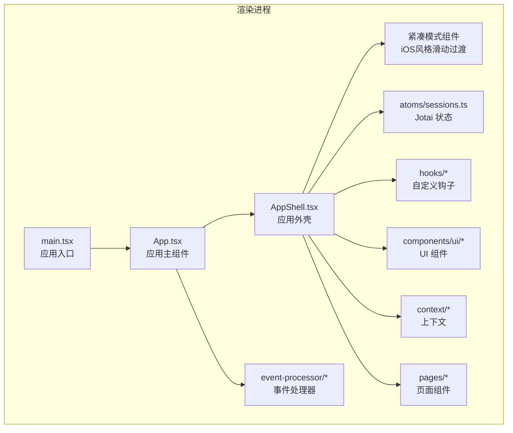
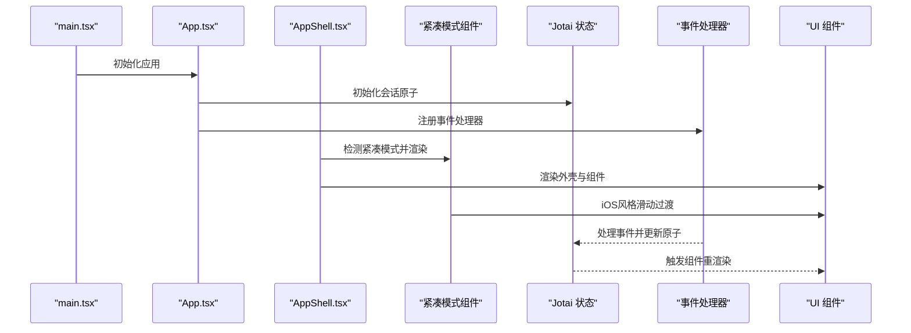
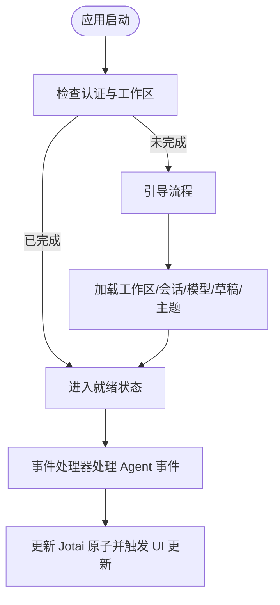
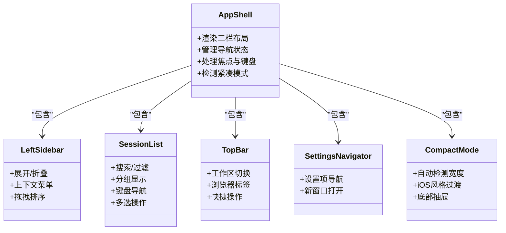
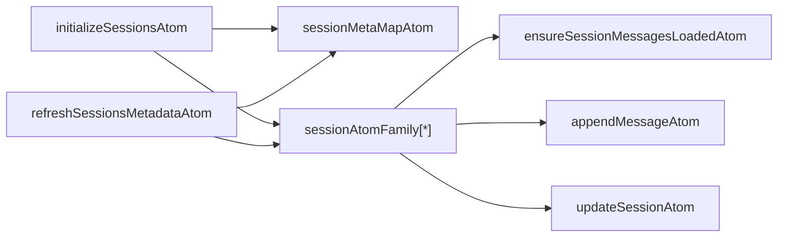
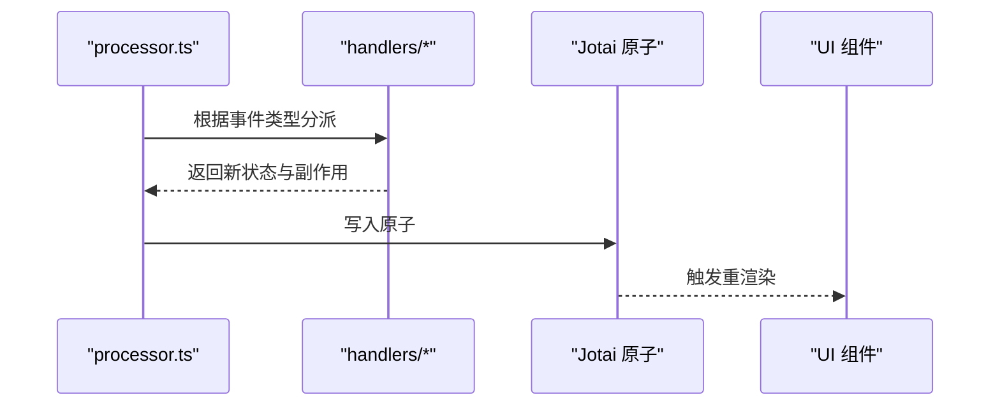
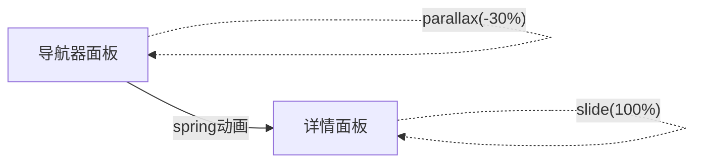
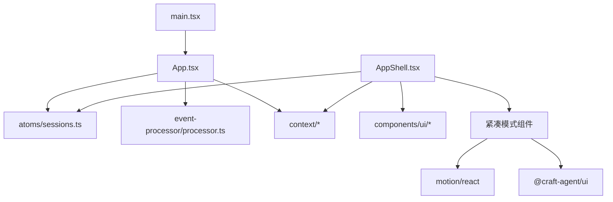

# 渲染进程开发

<cite>
**本文档引用的文件**
- [App.tsx](file://apps/electron/src/renderer/App.tsx)
- [main.tsx](file://apps/electron/src/renderer/main.tsx)
- [AppShell.tsx](file://apps/electron/src/renderer/components/app-shell/AppShell.tsx)
- [sessions.ts](file://apps/electron/src/renderer/atoms/sessions.ts)
- [useSession.ts](file://apps/electron/src/renderer/hooks/useSession.ts)
- [LeftSidebar.tsx](file://apps/electron/src/renderer/components/app-shell/LeftSidebar.tsx)
- [SessionList.tsx](file://apps/electron/src/renderer/components/app-shell/SessionList.tsx)
- [SettingsNavigator.tsx](file://apps/electron/src/renderer/pages/settings/SettingsNavigator.tsx)
- [processor.ts](file://apps/electron/src/renderer/event-processor/processor.ts)
- [utils.ts](file://apps/electron/src/renderer/lib/utils.ts)
- [button.tsx](file://apps/electron/src/renderer/components/ui/button.tsx)
- [AppShellContext.tsx](file://apps/electron/src/renderer/context/AppShellContext.tsx)
- [useSessionOptions.ts](file://apps/electron/src/renderer/hooks/useSessionOptions.ts)
- [ThemeContext.tsx](file://apps/electron/src/renderer/context/ThemeContext.tsx)
- [TopBar.tsx](file://apps/electron/src/renderer/components/app-shell/TopBar.tsx)
- [CompactPanelTransition.tsx](file://apps/electron/src/renderer/components/app-shell/CompactPanelTransition.tsx)
- [CompactSessionListFilter.tsx](file://apps/electron/src/renderer/components/app-shell/CompactSessionListFilter.tsx)
- [CompactSessionMenu.tsx](file://apps/electron/src/renderer/components/app-shell/CompactSessionMenu.tsx)
- [CompactWorkspaceSwitcher.tsx](file://apps/electron/src/renderer/components/app-shell/CompactWorkspaceSwitcher.tsx)
- [CompactModelSelector.tsx](file://apps/electron/src/renderer/components/app-shell/input/CompactModelSelector.tsx)
- [CompactPermissionModeSelector.tsx](file://apps/electron/src/renderer/components/app-shell/input/CompactPermissionModeSelector.tsx)
- [CompactSourceSelector.tsx](file://apps/electron/src/renderer/components/ui/CompactSourceSelector.tsx)
- [CompactWorkingDirectorySelector.tsx](file://apps/electron/src/renderer/components/ui/CompactWorkingDirectorySelector.tsx)
- [ChatDisplay.tsx](file://apps/electron/src/renderer/components/app-shell/ChatDisplay.tsx)
- [drawer.tsx](file://apps/electron/src/renderer/components/ui/drawer.tsx)
</cite>

## 更新摘要
**所做更改**
- 新增紧凑模式组件架构分析，包括 iOS 风格滑动过渡、底部抽屉交互模式
- 更新应用外壳组件分析，增加自动紧凑模式检测机制
- 新增紧凑模式输入组件详解，包括模型选择器、权限模式选择器等
- 更新 UI 组件库章节，增加紧凑模式专用组件
- 新增紧凑模式性能优化策略和最佳实践

## 目录
1. [简介](#简介)
2. [项目结构](#项目结构)
3. [核心组件](#核心组件)
4. [架构总览](#架构总览)
5. [详细组件分析](#详细组件分析)
6. [紧凑模式组件架构](#紧凑模式组件架构)
7. [依赖关系分析](#依赖关系分析)
8. [性能考虑](#性能考虑)
9. [故障排除指南](#故障排除指南)
10. [结论](#结论)
11. [附录](#附录)

## 简介
本文件面向需要开发或修改渲染进程 UI 组件的前端开发者，系统性阐述渲染进程的 React 组件架构、Jotai 状态管理模式、shadcn/ui + Tailwind CSS 的使用方式与设计模式。文档覆盖会话管理、消息显示、侧边栏组件、设置页面等关键功能，并提供组件开发指南、性能优化技巧与内存管理最佳实践。

**更新** 新增紧凑模式组件架构分析，涵盖 iOS 风格滑动过渡、底部抽屉交互模式、紧凑模式输入组件等现代化移动端适配方案。

## 项目结构
渲染进程位于 Electron 应用的 `apps/electron/src/renderer` 目录下，采用按功能域分层的组织方式：
- 根入口：main.tsx 负责初始化国际化、错误边界、主题提供者与 Jotai Provider，挂载根组件。
- 应用主组件：App.tsx 负责应用生命周期、认证检查、工作区加载、会话列表初始化、通知与主题同步等。
- 应用外壳：AppShell.tsx 提供三栏布局（左侧导航、会话列表、主内容），并承载导航上下文、焦点上下文等。
- 紧凑模式组件：新增一系列专门针对移动端和窄屏设备的组件，包括滑动过渡、底部抽屉、紧凑输入等。
- 状态管理：atoms/sessions.ts 使用 Jotai atomFamily 实现每个会话的隔离状态，避免跨会话重渲染。
- UI 组件：components/app-shell 下的各子组件构成外壳界面；components/ui 提供可复用的 UI 原子组件。
- 事件处理：event-processor 提供统一的事件处理器，保证状态变更的一致性与可测试性。
- 主题与样式：context/ThemeContext.tsx 提供主题解析与注入；lib/utils.ts 提供类名合并工具。

**图表来源**
- [main.tsx:1-119](file://apps/electron/src/renderer/main.tsx#L1-L119)
- [App.tsx:1-2205](file://apps/electron/src/renderer/App.tsx#L1-L2205)
- [AppShell.tsx:1-3566](file://apps/electron/src/renderer/components/app-shell/AppShell.tsx#L1-L3566)
- [CompactPanelTransition.tsx:1-76](file://apps/electron/src/renderer/components/app-shell/CompactPanelTransition.tsx#L1-L76)

**章节来源**
- [main.tsx:1-119](file://apps/electron/src/renderer/main.tsx#L1-L119)
- [App.tsx:1-2205](file://apps/electron/src/renderer/App.tsx#L1-L2205)
- [AppShell.tsx:1-3566](file://apps/electron/src/renderer/components/app-shell/AppShell.tsx#L1-L3566)
- [sessions.ts:1-715](file://apps/electron/src/renderer/atoms/sessions.ts#L1-L715)

## 核心组件
- 应用主组件 App：负责应用状态机（加载/引导/就绪）、工作区与会话数据加载、权限与凭据队列、通知系统、主题同步、事件处理器集成等。
- 应用外壳 AppShell：提供三栏布局、侧边栏导航、会话列表、主内容面板、键盘导航与焦点管理。
- 紧凑模式组件：包括 CompactPanelTransition、CompactSessionListFilter、CompactSessionMenu 等，专为移动端和窄屏设备优化。
- Jotai 状态层：通过 atomFamily 为每个会话维护独立原子，避免跨会话重渲染；同时提供批量初始化、元数据映射、懒加载消息等功能。
- 事件处理器：统一处理来自后端的各类 Agent 事件，保证状态变更的确定性与可测试性。
- UI 组件库：基于 shadcn/ui 与 Tailwind CSS，提供按钮、输入框、对话框、滚动区域等基础组件。
- 主题上下文：解析与应用主题配置，支持预设主题、工作区覆盖、深浅模式与字体设置。

**更新** 紧凑模式组件提供 iOS 风格的滑动过渡效果和底部抽屉交互，显著提升移动端用户体验。

**章节来源**
- [App.tsx:224-750](file://apps/electron/src/renderer/App.tsx#L224-L750)
- [AppShell.tsx:483-800](file://apps/electron/src/renderer/components/app-shell/AppShell.tsx#L483-L800)
- [CompactPanelTransition.tsx:1-76](file://apps/electron/src/renderer/components/app-shell/CompactPanelTransition.tsx#L1-L76)
- [CompactSessionListFilter.tsx:1-497](file://apps/electron/src/renderer/components/app-shell/CompactSessionListFilter.tsx#L1-L497)
- [CompactSessionMenu.tsx:1-677](file://apps/electron/src/renderer/components/app-shell/CompactSessionMenu.tsx#L1-L677)

## 架构总览
渲染进程采用"应用外壳 + 隔离状态 + 事件驱动 + 紧凑模式适配"的架构模式：
- 应用外壳负责布局与交互编排，通过上下文向子组件提供数据与回调。
- 紧凑模式组件提供移动端专用的交互模式，包括 iOS 风格滑动过渡和底部抽屉。
- Jotai 的 atomFamily 将会话状态隔离到单个会话原子，避免全局数组导致的内存泄漏与不必要重渲染。
- 事件处理器以纯函数形式集中处理所有 Agent 事件，确保状态变更的确定性与可测试性。
- 主题上下文在 DOM 层注入 CSS 变量，实现主题切换与工作区覆盖。

**图表来源**
- [main.tsx:98-118](file://apps/electron/src/renderer/main.tsx#L98-L118)
- [App.tsx:465-515](file://apps/electron/src/renderer/App.tsx#L465-L515)
- [AppShell.tsx:551-558](file://apps/electron/src/renderer/components/app-shell/AppShell.tsx#L551-L558)
- [CompactPanelTransition.tsx:12-17](file://apps/electron/src/renderer/components/app-shell/CompactPanelTransition.tsx#L12-L17)

## 详细组件分析

### 应用主组件 App 分析
- 应用状态机：loading → 检查认证 → 引导/工作区选择 → 就绪。
- 数据加载：工作区、会话列表、LLM 连接、草稿、主题等。
- 权限与凭据：使用 Map 存储每会话的请求队列，支持多并发请求。
- 通知系统：基于原生系统通知与徽章计数。
- 事件处理：集中式事件处理器，区分流式与非流式路径，保证数据一致性。
- 主题同步：监听主题变更事件，实时更新 CSS 变量。

**图表来源**
- [App.tsx:224-750](file://apps/electron/src/renderer/App.tsx#L224-L750)

**章节来源**
- [App.tsx:224-750](file://apps/electron/src/renderer/App.tsx#L224-L750)

### 应用外壳 AppShell 分析
- 布局：左侧面板（导航）、中间会话列表、右侧主内容面板。
- 导航：统一导航上下文，支持多面板与路由状态。
- 侧边栏：LeftSidebar 支持展开/折叠、上下文菜单、拖拽排序等。
- 会话列表：SessionList 支持搜索、过滤、分组（日期/状态/未读）、键盘导航与多选。
- 顶部栏：TopBar 提供工作区切换、浏览器标签、快捷操作等。
- 设置页：SettingsNavigator 提供设置项导航与新窗口打开能力。
- 紧凑模式检测：自动检测屏幕宽度，当小于 768px 时启用紧凑模式。

**图表来源**
- [AppShell.tsx:483-800](file://apps/electron/src/renderer/components/app-shell/AppShell.tsx#L483-L800)
- [AppShell.tsx:551-558](file://apps/electron/src/renderer/components/app-shell/AppShell.tsx#L551-L558)
- [LeftSidebar.tsx:168-292](file://apps/electron/src/renderer/components/app-shell/LeftSidebar.tsx#L168-L292)
- [SessionList.tsx:115-788](file://apps/electron/src/renderer/components/app-shell/SessionList.tsx#L115-L788)
- [TopBar.tsx:64-299](file://apps/electron/src/renderer/components/app-shell/TopBar.tsx#L64-L299)
- [SettingsNavigator.tsx:151-185](file://apps/electron/src/renderer/pages/settings/SettingsNavigator.tsx#L151-L185)

**章节来源**
- [AppShell.tsx:483-800](file://apps/electron/src/renderer/components/app-shell/AppShell.tsx#L483-L800)
- [AppShell.tsx:551-558](file://apps/electron/src/renderer/components/app-shell/AppShell.tsx#L551-L558)
- [LeftSidebar.tsx:168-292](file://apps/electron/src/renderer/components/app-shell/LeftSidebar.tsx#L168-L292)
- [SessionList.tsx:115-788](file://apps/electron/src/renderer/components/app-shell/SessionList.tsx#L115-L788)
- [TopBar.tsx:64-299](file://apps/electron/src/renderer/components/app-shell/TopBar.tsx#L64-L299)
- [SettingsNavigator.tsx:151-185](file://apps/electron/src/renderer/pages/settings/SettingsNavigator.tsx#L151-L185)

### Jotai 状态管理分析
- 隔离状态：sessionAtomFamily 为每个会话创建独立原子，避免跨会话重渲染。
- 元数据映射：sessionMetaMapAtom 仅存储轻量级元数据，用于列表渲染。
- 批量操作：initializeSessionsAtom、refreshSessionsMetadataAtom、addSessionAtom、removeSessionAtom 等提供高效的状态更新。
- 懒加载：ensureSessionMessagesLoadedAtom 与 forceSessionMessagesReloadAtom 控制消息加载与刷新。
- 背景任务：backgroundTasksAtomFamily 用于显示后台任务进度。

**图表来源**
- [sessions.ts:282-401](file://apps/electron/src/renderer/atoms/sessions.ts#L282-L401)
- [sessions.ts:550-674](file://apps/electron/src/renderer/atoms/sessions.ts#L550-L674)

**章节来源**
- [sessions.ts:122-230](file://apps/electron/src/renderer/atoms/sessions.ts#L122-L230)
- [sessions.ts:282-401](file://apps/electron/src/renderer/atoms/sessions.ts#L282-L401)
- [sessions.ts:550-674](file://apps/electron/src/renderer/atoms/sessions.ts#L550-L674)

### 事件处理机制分析
- 事件处理器：processor.ts 将所有 Agent 事件分派到对应的处理函数，返回新的状态与副作用。
- 文本事件：handleTextDelta、handleTextComplete 处理流式文本增量与完成。
- 工具事件：handleToolStart、handleToolResult、handleTaskBackgrounded、handleShellBackgrounded、handleTaskProgress、handleTaskCompleted 处理工具调用与后台任务。
- 会话事件：handleComplete、handleError、handleInterrupted、handleSessionStatusChanged、handlePermissionRequest、handleCredentialRequest 等处理会话生命周期与权限控制。

**图表来源**
- [processor.ts:62-230](file://apps/electron/src/renderer/event-processor/processor.ts#L62-L230)

**章节来源**
- [processor.ts:62-230](file://apps/electron/src/renderer/event-processor/processor.ts#L62-L230)

### 会话管理与消息显示
- 会话选择：useSession 钩子基于 useEntitySelection 提供单选/多选能力。
- 会话选项：useSessionOptionsFor 提供权限模式与思考层级等会话级配置。
- 消息显示：SessionList 作为会话列表容器，支持搜索、过滤、分组与键盘导航；具体消息渲染由 ChatDisplay 等组件负责。
- 草稿与附件：App.tsx 中使用 sessionDraftsRef 保存输入草稿与附件引用，避免不必要的重渲染。
- 紧凑模式支持：ChatDisplay 支持 compactMode 参数，启用时隐藏非必要 UI 元素。

**章节来源**
- [useSession.ts:25-45](file://apps/electron/src/renderer/hooks/useSession.ts#L25-L45)
- [AppShellContext.tsx:244-282](file://apps/electron/src/renderer/context/AppShellContext.tsx#L244-L282)
- [SessionList.tsx:115-788](file://apps/electron/src/renderer/components/app-shell/SessionList.tsx#L115-L788)
- [App.tsx:309-312](file://apps/electron/src/renderer/App.tsx#L309-L312)
- [ChatDisplay.tsx:226-238](file://apps/electron/src/renderer/components/app-shell/ChatDisplay.tsx#L226-L238)

### 侧边栏组件设计
- LeftSidebar：支持展开/折叠、上下文菜单、拖拽排序；通过动画与可访问性增强用户体验。
- 上下文菜单：通过 ContextMenuProvider 与 SidebarMenu 组合，支持状态配置、标签管理、视图编辑等操作。
- 排序：SortableList 与 SortableStatusList 提供扁平与树形拖拽排序能力。

**章节来源**
- [LeftSidebar.tsx:168-292](file://apps/electron/src/renderer/components/app-shell/LeftSidebar.tsx#L168-L292)

### 设置页面实现
- SettingsNavigator：提供设置项导航列表，支持在新窗口中打开设置页。
- 设计风格：遵循会话列表/源列表面板的视觉一致性，使用图标与描述信息展示设置项。

**章节来源**
- [SettingsNavigator.tsx:151-185](file://apps/electron/src/renderer/pages/settings/SettingsNavigator.tsx#L151-L185)

### UI 组件库与样式
- 组件库：基于 shadcn/ui，提供 Button、Dialog、DropdownMenu、ScrollArea 等组件。
- 紧凑模式组件：新增 CompactSourceSelector、CompactWorkingDirectorySelector 等移动端专用组件。
- 样式工具：cn 函数结合 clsx 与 tailwind-merge 实现类名合并与冲突修复。
- 主题集成：ThemeContext 在 DOM 注入 CSS 变量，支持预设主题、工作区覆盖与深浅模式。

**章节来源**
- [button.tsx:1-58](file://apps/electron/src/renderer/components/ui/button.tsx#L1-L58)
- [CompactSourceSelector.tsx:1-123](file://apps/electron/src/renderer/components/ui/CompactSourceSelector.tsx#L1-L123)
- [CompactWorkingDirectorySelector.tsx:1-243](file://apps/electron/src/renderer/components/ui/CompactWorkingDirectorySelector.tsx#L1-L243)
- [utils.ts:1-7](file://apps/electron/src/renderer/lib/utils.ts#L1-L7)
- [ThemeContext.tsx:284-381](file://apps/electron/src/renderer/context/ThemeContext.tsx#L284-L381)

## 紧凑模式组件架构

### iOS 风格滑动过渡
CompactPanelTransition 提供 iOS 风格的滑动过渡效果，支持导航器和详情面板之间的切换：
- **动画规则**：使用弹簧物理引擎（stiffness: 400, damping: 36, mass: 0.8）实现自然的滑动效果
- **GPU 优化**：仅使用 transform 和 opacity 属性，确保硬件加速
- **无障碍支持**：离屏面板设置 pointer-events: none 和 aria-hidden 属性
- **响应式设计**：根据 prefers-reduced-motion 自动调整动画时长

**图表来源**
- [CompactPanelTransition.tsx:12-17](file://apps/electron/src/renderer/components/app-shell/CompactPanelTransition.tsx#L12-L17)
- [CompactPanelTransition.tsx:47-70](file://apps/electron/src/renderer/components/app-shell/CompactPanelTransition.tsx#L47-L70)

### 底部抽屉交互模式
紧凑模式组件广泛采用底部抽屉（Drawer）模式替代传统的上拉菜单：
- **CompactSessionListFilter**：会话列表过滤器的底部抽屉版本，支持状态和标签的组合筛选
- **CompactSessionMenu**：会话菜单的底部抽屉版本，提供 iOS 风格的钻取导航
- **CompactWorkspaceSwitcher**：工作区切换器的底部抽屉版本，支持远程连接健康检查
- **CompactModelSelector**：模型选择器的底部抽屉版本，支持连接切换和视觉能力配置
- **CompactPermissionModeSelector**：权限模式选择器的底部抽屉版本
- **CompactSourceSelector**：源选择器的底部抽屉版本
- **CompactWorkingDirectorySelector**：工作目录选择器的底部抽屉版本

### 紧凑模式输入组件
紧凑模式下的输入组件提供优化的移动端体验：
- **模型选择器**：支持连接切换、视觉能力配置、思考层级设置
- **权限模式选择器**：提供安全、询问、允许全部三种权限模式
- **工作区切换器**：支持本地和远程工作区的无缝切换
- **源选择器**：支持多源选择和搜索过滤
- **工作目录选择器**：提供最近目录、Git 分支、服务器浏览等功能

### 紧凑模式检测与适配
AppShell 实现了智能的紧凑模式检测机制：
- **阈值设定**：当壳层宽度小于 768px 时自动启用紧凑模式
- **动态切换**：支持窗口大小变化时的动态模式切换
- **状态同步**：isCompactMode 状态通过 AppShellContext 传递给子组件
- **性能优化**：紧凑模式下隐藏侧边栏和导航器，减少渲染开销

**章节来源**
- [CompactPanelTransition.tsx:1-76](file://apps/electron/src/renderer/components/app-shell/CompactPanelTransition.tsx#L1-L76)
- [CompactSessionListFilter.tsx:1-497](file://apps/electron/src/renderer/components/app-shell/CompactSessionListFilter.tsx#L1-L497)
- [CompactSessionMenu.tsx:1-677](file://apps/electron/src/renderer/components/app-shell/CompactSessionMenu.tsx#L1-L677)
- [CompactWorkspaceSwitcher.tsx:1-303](file://apps/electron/src/renderer/components/app-shell/CompactWorkspaceSwitcher.tsx#L1-L303)
- [CompactModelSelector.tsx:1-522](file://apps/electron/src/renderer/components/app-shell/input/CompactModelSelector.tsx#L1-L522)
- [CompactPermissionModeSelector.tsx:1-143](file://apps/electron/src/renderer/components/app-shell/input/CompactPermissionModeSelector.tsx#L1-L143)
- [CompactSourceSelector.tsx:1-123](file://apps/electron/src/renderer/components/ui/CompactSourceSelector.tsx#L1-L123)
- [CompactWorkingDirectorySelector.tsx:1-243](file://apps/electron/src/renderer/components/ui/CompactWorkingDirectorySelector.tsx#L1-L243)
- [AppShell.tsx:551-558](file://apps/electron/src/renderer/components/app-shell/AppShell.tsx#L551-L558)
- [AppShellContext.tsx:144-145](file://apps/electron/src/renderer/context/AppShellContext.tsx#L144-L145)

## 依赖关系分析
渲染进程的关键依赖关系如下：
- main.tsx 依赖 App.tsx、ThemeContext、Jotai Provider、Toaster。
- App.tsx 依赖 Jotai 原子、事件处理器、导航上下文、通知钩子、主题钩子。
- AppShell.tsx 依赖导航上下文、焦点上下文、会话选择钩子、UI 组件。
- 紧凑模式组件依赖 motion/react、@craft-agent/ui 等第三方库。
- atoms/sessions.ts 为 App.tsx 与 AppShell.tsx 提供状态支撑。
- event-processor/processor.ts 为 App.tsx 提供事件处理能力。
- components/ui/* 为 AppShell.tsx 与各页面提供基础 UI 组件。

**图表来源**
- [main.tsx:98-118](file://apps/electron/src/renderer/main.tsx#L98-L118)
- [App.tsx:465-515](file://apps/electron/src/renderer/App.tsx#L465-L515)
- [AppShell.tsx:496-502](file://apps/electron/src/renderer/components/app-shell/AppShell.tsx#L496-L502)
- [CompactPanelTransition.tsx:20-21](file://apps/electron/src/renderer/components/app-shell/CompactPanelTransition.tsx#L20-L21)
- [drawer.tsx:8-19](file://apps/electron/src/renderer/components/ui/drawer.tsx#L8-L19)

**章节来源**
- [main.tsx:98-118](file://apps/electron/src/renderer/main.tsx#L98-L118)
- [App.tsx:465-515](file://apps/electron/src/renderer/App.tsx#L465-L515)
- [AppShell.tsx:496-502](file://apps/electron/src/renderer/components/app-shell/AppShell.tsx#L496-L502)

## 性能考虑
- 隔离状态：使用 atomFamily 为每个会话维护独立原子，避免全局数组导致的内存泄漏与不必要重渲染。
- 懒加载：ensureSessionMessagesLoadedAtom 与 loadedSessionsAtom 配合，仅在打开会话时加载消息，减少初始内存占用。
- 事件处理：集中式事件处理器保证状态变更的确定性，避免竞态条件与重复渲染。
- 紧凑模式优化：iOS 风格滑动过渡使用 GPU 加速属性（transform + opacity），减少重绘开销。
- 动画性能：使用 useReducedMotion 自动适配系统偏好，避免不必要的动画消耗。
- 类名合并：使用 cn 函数避免重复类名与样式冲突，提升渲染效率。
- 组件卸载：紧凑模式组件在离屏时禁用交互，减少不必要的事件处理。

**更新** 紧凑模式组件特别注重移动端性能优化，采用硬件加速动画和智能的组件卸载策略。

## 故障排除指南
- 事件处理异常：检查事件类型是否在 processor.ts 中正确分派，确认副作用最小化与状态引用更新。
- 会话消息丢失：确认 ensureSessionMessagesLoadedAtom 的调用时机与 forceSessionMessagesReloadAtom 的使用场景。
- 主题不生效：检查 ThemeContext 的 CSS 变量注入与预设主题加载逻辑，确认系统主题变化监听是否正常。
- 侧边栏交互异常：验证 LeftSidebar 的展开/折叠逻辑与上下文菜单状态，确保拖拽排序的回调正确执行。
- 紧凑模式失效：检查 AppShell 的宽度检测逻辑，确认 isCompactMode 状态正确传递到子组件。
- 滑动过渡异常：验证 CompactPanelTransition 的动画配置，确保 GPU 加速属性正确应用。
- 底部抽屉无法关闭：检查 Drawer 组件的 open/onOpenChange 属性绑定，确认状态同步正确。

**章节来源**
- [processor.ts:62-230](file://apps/electron/src/renderer/event-processor/processor.ts#L62-L230)
- [sessions.ts:550-674](file://apps/electron/src/renderer/atoms/sessions.ts#L550-L674)
- [ThemeContext.tsx:382-434](file://apps/electron/src/renderer/context/ThemeContext.tsx#L382-L434)
- [LeftSidebar.tsx:299-450](file://apps/electron/src/renderer/components/app-shell/LeftSidebar.tsx#L299-L450)
- [AppShell.tsx:551-558](file://apps/electron/src/renderer/components/app-shell/AppShell.tsx#L551-L558)
- [CompactPanelTransition.tsx:47-70](file://apps/electron/src/renderer/components/app-shell/CompactPanelTransition.tsx#L47-L70)

## 结论
渲染进程通过"应用外壳 + 隔离状态 + 事件驱动 + 紧凑模式适配"的架构，实现了高性能、可扩展且易于维护的 UI 系统。新增的紧凑模式组件进一步提升了移动端用户体验，采用 iOS 风格的滑动过渡和底部抽屉交互，配合智能的模式检测机制，为不同设备和屏幕尺寸提供了最优的界面适配。Jotai 的 atomFamily 解决了跨会话重渲染问题，事件处理器保证了状态一致性，UI 组件库与主题系统提供了良好的开发体验与视觉表现。建议在新增功能时遵循现有模式，优先使用上下文与原子进行数据传递与状态管理，充分利用紧凑模式组件提供的移动端优化方案。

**更新** 紧凑模式组件架构代表了现代前端开发的最佳实践，通过硬件加速动画、智能状态管理和响应式设计，为用户提供了流畅一致的跨平台体验。

## 附录
- 组件开发最佳实践
  - 优先使用上下文与原子进行数据传递，避免深层属性传递。
  - 对于会话相关状态，使用 per-session atom，避免全局数组。
  - 事件处理应保持纯函数特性，副作用最小化。
  - UI 组件尽量复用 shadcn/ui 组件，保持一致的视觉与交互体验。
  - 紧凑模式组件应遵循 iOS 人机界面指南，提供自然的滑动过渡效果。
  - 底部抽屉组件应提供清晰的标题和操作反馈，确保触控可达性。
- 性能优化建议
  - 使用 memo 与 useMemo 缓存计算结果，减少不必要的渲染。
  - 合理使用懒加载与虚拟化，避免一次性渲染大量节点。
  - 避免在渲染过程中进行昂贵的计算或 IO 操作。
  - 紧凑模式组件应使用 GPU 加速属性，减少重绘开销。
  - 利用 useReducedMotion 适配系统偏好，提供无障碍体验。
- 内存管理
  - 切换工作区时清理过期原子，防止内存泄漏。
  - 使用 ref 存储临时状态，避免触发不必要的重渲染。
  - 紧凑模式组件在离屏时应释放资源，避免内存占用。
  - 合理使用 React.lazy 和 Suspense，实现组件级别的懒加载。

**更新** 紧凑模式组件开发需要特别关注移动端性能和用户体验，遵循硬件加速原则和触控设计规范。