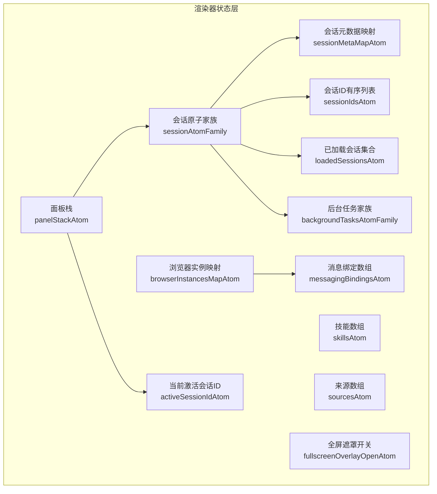
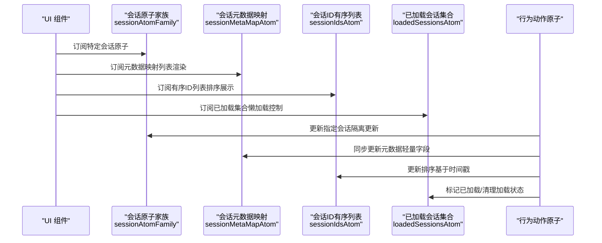
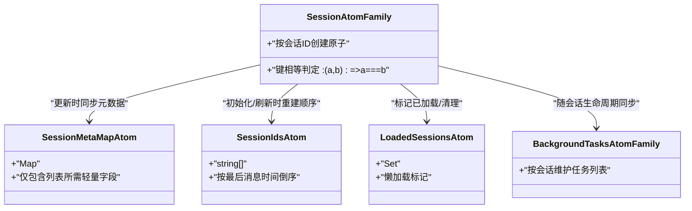
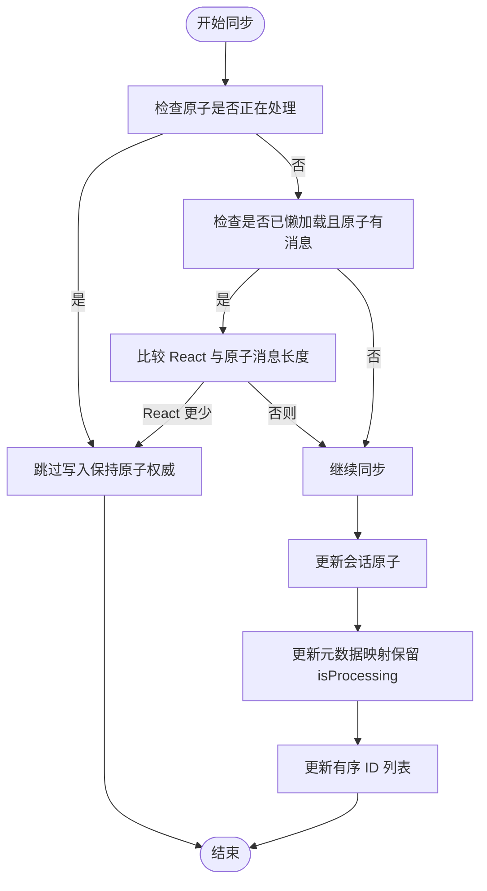
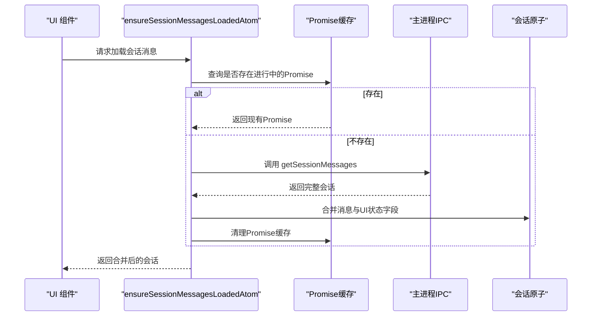
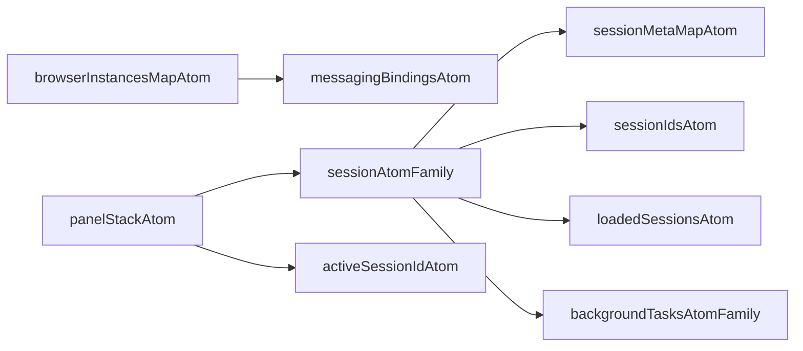

# Jotai 原子设计

<cite>
**本文引用的文件**
- [apps/electron/src/renderer/atoms/sessions.ts](file://apps/electron/src/renderer/atoms/sessions.ts)
- [apps/electron/src/renderer/atoms/browser-pane.ts](file://apps/electron/src/renderer/atoms/browser-pane.ts)
- [apps/electron/src/renderer/atoms/messaging.ts](file://apps/electron/src/renderer/atoms/messaging.ts)
- [apps/electron/src/renderer/atoms/skills.ts](file://apps/electron/src/renderer/atoms/skills.ts)
- [apps/electron/src/renderer/atoms/sources.ts](file://apps/electron/src/renderer/atoms/sources.ts)
- [apps/electron/src/renderer/atoms/overlay.ts](file://apps/electron/src/renderer/atoms/overlay.ts)
- [apps/electron/src/renderer/atoms/panel-stack.ts](file://apps/electron/src/renderer/atoms/panel-stack.ts)
- [apps/electron/src/renderer/hooks/useSession.ts](file://apps/electron/src/renderer/hooks/useSession.ts)
- [apps/electron/src/renderer/hooks/useSessionActions.ts](file://apps/electron/src/renderer/hooks/useSessionActions.ts)
- [apps/electron/src/renderer/hooks/useSessionOptions.ts](file://apps/electron/src/renderer/hooks/useSessionOptions.ts)
</cite>

## 目录
1. [简介](#简介)
2. [项目结构](#项目结构)
3. [核心组件](#核心组件)
4. [架构总览](#架构总览)
5. [详细组件分析](#详细组件分析)
6. [依赖分析](#依赖分析)
7. [性能考量](#性能考量)
8. [故障排查指南](#故障排查指南)
9. [结论](#结论)
10. [附录](#附录)

## 简介
本文件面向需要深入理解状态管理架构的开发者，系统化阐述本仓库中基于 Jotai 的原子设计与实现，重点覆盖：
- atomFamily 的使用模式与原子隔离机制
- 派生状态的设计原则与计算属性
- 会话原子家族（sessionAtomFamily）的实现原理：按会话 ID 创建独立原子、内存优化策略、垃圾回收机制
- 原子之间的依赖关系、状态同步机制
- 原子组合模式、条件原子、动态原子的使用场景
- 原子调试技巧、性能监控方法与最佳实践

## 项目结构
本项目的渲染器侧状态管理主要集中在 atoms 目录，围绕“每会话一个原子”的家族化设计展开，并辅以派生状态与动作原子，形成高内聚、低耦合的状态层。

图表来源
- [apps/electron/src/renderer/atoms/sessions.ts:122-125](file://apps/electron/src/renderer/atoms/sessions.ts#L122-L125)
- [apps/electron/src/renderer/atoms/sessions.ts:131-136](file://apps/electron/src/renderer/atoms/sessions.ts#L131-L136)
- [apps/electron/src/renderer/atoms/sessions.ts](file://apps/electron/src/renderer/atoms/sessions.ts#L142)
- [apps/electron/src/renderer/atoms/sessions.ts](file://apps/electron/src/renderer/atoms/sessions.ts#L156)
- [apps/electron/src/renderer/atoms/sessions.ts:699-702](file://apps/electron/src/renderer/atoms/sessions.ts#L699-L702)
- [apps/electron/src/renderer/atoms/browser-pane.ts:12-22](file://apps/electron/src/renderer/atoms/browser-pane.ts#L12-L22)
- [apps/electron/src/renderer/atoms/messaging.ts:30-31](file://apps/electron/src/renderer/atoms/messaging.ts#L30-L31)
- [apps/electron/src/renderer/atoms/skills.ts](file://apps/electron/src/renderer/atoms/skills.ts#L16)
- [apps/electron/src/renderer/atoms/sources.ts](file://apps/electron/src/renderer/atoms/sources.ts#L16)
- [apps/electron/src/renderer/atoms/overlay.ts](file://apps/electron/src/renderer/atoms/overlay.ts#L7)
- [apps/electron/src/renderer/atoms/panel-stack.ts:46-47](file://apps/electron/src/renderer/atoms/panel-stack.ts#L46-L47)

章节来源
- [apps/electron/src/renderer/atoms/sessions.ts:1-715](file://apps/electron/src/renderer/atoms/sessions.ts#L1-L715)
- [apps/electron/src/renderer/atoms/browser-pane.ts:1-83](file://apps/electron/src/renderer/atoms/browser-pane.ts#L1-L83)
- [apps/electron/src/renderer/atoms/messaging.ts:1-76](file://apps/electron/src/renderer/atoms/messaging.ts#L1-L76)
- [apps/electron/src/renderer/atoms/skills.ts:1-17](file://apps/electron/src/renderer/atoms/skills.ts#L1-L17)
- [apps/electron/src/renderer/atoms/sources.ts:1-17](file://apps/electron/src/renderer/atoms/sources.ts#L1-L17)
- [apps/electron/src/renderer/atoms/overlay.ts:1-8](file://apps/electron/src/renderer/atoms/overlay.ts#L1-L8)
- [apps/electron/src/renderer/atoms/panel-stack.ts:1-306](file://apps/electron/src/renderer/atoms/panel-stack.ts#L1-L306)

## 核心组件
- 会话原子家族：每个会话拥有独立的原子，确保更新隔离，避免跨会话重渲染。
- 会话元数据映射：仅存储列表展示所需的轻量字段，避免消息数据参与列表渲染。
- 已加载会话集合：用于懒加载控制，减少初始内存占用。
- 当前激活会话ID：主内容区显示的会话标识。
- 后台任务家族：按会话维护后台任务列表，支持工具执行等异步状态跟踪。
- 行为动作原子：封装对单个会话或元数据的更新操作，保证一致性与可追踪性。
- 派生状态原子：从基础原子派生出的只读视图，如有序会话ID、活跃实例信息等。

章节来源
- [apps/electron/src/renderer/atoms/sessions.ts:122-125](file://apps/electron/src/renderer/atoms/sessions.ts#L122-L125)
- [apps/electron/src/renderer/atoms/sessions.ts:131-136](file://apps/electron/src/renderer/atoms/sessions.ts#L131-L136)
- [apps/electron/src/renderer/atoms/sessions.ts](file://apps/electron/src/renderer/atoms/sessions.ts#L142)
- [apps/electron/src/renderer/atoms/sessions.ts](file://apps/electron/src/renderer/atoms/sessions.ts#L156)
- [apps/electron/src/renderer/atoms/sessions.ts:699-702](file://apps/electron/src/renderer/atoms/sessions.ts#L699-L702)

## 架构总览
下图展示了会话家族原子与派生状态、动作原子之间的交互关系，以及与 UI 层的订阅方式。

图表来源
- [apps/electron/src/renderer/atoms/sessions.ts:122-125](file://apps/electron/src/renderer/atoms/sessions.ts#L122-L125)
- [apps/electron/src/renderer/atoms/sessions.ts:131-136](file://apps/electron/src/renderer/atoms/sessions.ts#L131-L136)
- [apps/electron/src/renderer/atoms/sessions.ts](file://apps/electron/src/renderer/atoms/sessions.ts#L142)
- [apps/electron/src/renderer/atoms/sessions.ts:170-186](file://apps/electron/src/renderer/atoms/sessions.ts#L170-L186)
- [apps/electron/src/renderer/atoms/sessions.ts:213-230](file://apps/electron/src/renderer/atoms/sessions.ts#L213-L230)

## 详细组件分析

### 会话原子家族（sessionAtomFamily）与派生状态
- 设计目标
  - 每个会话拥有独立原子，避免跨会话更新引发的全局重渲染。
  - 列表渲染不依赖完整消息数据，仅使用元数据映射，降低渲染成本。
  - 通过有序 ID 列表与已加载集合实现懒加载与内存优化。
- 关键实现点
  - 使用 atomFamily 为每个会话 ID 创建原子，键相等判定函数确保同一 ID 复用同一原子实例。
  - 元数据提取函数将完整会话对象转换为轻量元数据，供列表展示使用。
  - 初始化与刷新流程在单次写事务中完成，保证订阅者看到一致状态。
- 依赖关系
  - 会话原子家族是核心，被元数据映射、有序 ID 列表、已加载集合所依赖。
  - 后台任务家族与会话家族一一对应，随会话生命周期清理。

图表来源
- [apps/electron/src/renderer/atoms/sessions.ts:122-125](file://apps/electron/src/renderer/atoms/sessions.ts#L122-L125)
- [apps/electron/src/renderer/atoms/sessions.ts:131-136](file://apps/electron/src/renderer/atoms/sessions.ts#L131-L136)
- [apps/electron/src/renderer/atoms/sessions.ts](file://apps/electron/src/renderer/atoms/sessions.ts#L142)
- [apps/electron/src/renderer/atoms/sessions.ts:699-702](file://apps/electron/src/renderer/atoms/sessions.ts#L699-L702)

章节来源
- [apps/electron/src/renderer/atoms/sessions.ts:118-126](file://apps/electron/src/renderer/atoms/sessions.ts#L118-L126)
- [apps/electron/src/renderer/atoms/sessions.ts:97-116](file://apps/electron/src/renderer/atoms/sessions.ts#L97-L116)
- [apps/electron/src/renderer/atoms/sessions.ts:282-322](file://apps/electron/src/renderer/atoms/sessions.ts#L282-L322)
- [apps/electron/src/renderer/atoms/sessions.ts:334-401](file://apps/electron/src/renderer/atoms/sessions.ts#L334-L401)

### 状态同步机制与流式更新
- 同步策略
  - 在非流式阶段，React 状态作为权威源；当存在流式更新时，原子成为权威源，避免覆盖正在生成的消息。
  - 对于懒加载且原子已有消息的情况，仅在 React 消息更少时才跳过同步，防止丢失数据。
- 流式更新保护
  - 追踪 isProcessing 字段，确保在处理中的会话不被覆盖。
  - 合并磁盘返回的消息时，保留原子中的 UI 状态字段，避免乐观更新被磁盘写入覆盖。
- 元数据一致性
  - 元数据映射从 React 状态更新，但会保留原子中的 isProcessing 状态，确保 UI 正确反映流式状态。

图表来源
- [apps/electron/src/renderer/atoms/sessions.ts:479-534](file://apps/electron/src/renderer/atoms/sessions.ts#L479-L534)
- [apps/electron/src/renderer/atoms/sessions.ts:588-623](file://apps/electron/src/renderer/atoms/sessions.ts#L588-L623)

章节来源
- [apps/electron/src/renderer/atoms/sessions.ts:479-534](file://apps/electron/src/renderer/atoms/sessions.ts#L479-L534)
- [apps/electron/src/renderer/atoms/sessions.ts:588-623](file://apps/electron/src/renderer/atoms/sessions.ts#L588-L623)

### 懒加载与内存优化
- 懒加载策略
  - getSessions() 返回空消息以节省内存；仅在打开会话时通过 ensureSessionMessagesLoadedAtom 加载完整历史。
  - 已加载集合用于去重并发请求，模块级 Map 缓存进行中的 Promise，避免重复 IPC 调用。
- 内存优化
  - 移除全局 sessions 数组原子，改用家族原子与元数据映射，减少大对象持有。
  - 切换工作区时清理过期家族条目，防止内存泄漏。
- 强制刷新
  - forceSessionMessagesReloadAtom 支持在会话卡在空但已加载状态时强制重新加载。

图表来源
- [apps/electron/src/renderer/atoms/sessions.ts:658-663](file://apps/electron/src/renderer/atoms/sessions.ts#L658-L663)
- [apps/electron/src/renderer/atoms/sessions.ts](file://apps/electron/src/renderer/atoms/sessions.ts#L150)
- [apps/electron/src/renderer/atoms/sessions.ts:550-656](file://apps/electron/src/renderer/atoms/sessions.ts#L550-L656)
- [apps/electron/src/renderer/atoms/sessions.ts:669-674](file://apps/electron/src/renderer/atoms/sessions.ts#L669-L674)

章节来源
- [apps/electron/src/renderer/atoms/sessions.ts](file://apps/electron/src/renderer/atoms/sessions.ts#L150)
- [apps/electron/src/renderer/atoms/sessions.ts:550-656](file://apps/electron/src/renderer/atoms/sessions.ts#L550-L656)
- [apps/electron/src/renderer/atoms/sessions.ts:658-674](file://apps/electron/src/renderer/atoms/sessions.ts#L658-L674)

### 原子组合模式与条件/动态原子
- 组合模式
  - 会话原子家族与元数据映射、有序 ID 列表、已加载集合组合，形成“家族原子 + 派生状态 + 动作原子”的闭环。
  - 后台任务家族与会话家族一一对应，体现“同构家族”的组合思想。
- 条件原子
  - 活跃实例映射与移除墓碑集合配合，避免来自主进程的延迟更新覆盖已删除实例。
- 动态原子
  - 面板栈原子根据路由动态创建/销毁面板条目，比例归一化确保布局稳定。

章节来源
- [apps/electron/src/renderer/atoms/browser-pane.ts:27-28](file://apps/electron/src/renderer/atoms/browser-pane.ts#L27-L28)
- [apps/electron/src/renderer/atoms/browser-pane.ts:52-64](file://apps/electron/src/renderer/atoms/browser-pane.ts#L52-L64)
- [apps/electron/src/renderer/atoms/panel-stack.ts:98-106](file://apps/electron/src/renderer/atoms/panel-stack.ts#L98-L106)
- [apps/electron/src/renderer/atoms/panel-stack.ts:167-238](file://apps/electron/src/renderer/atoms/panel-stack.ts#L167-L238)

### 会话选项与动作钩子
- 会话选项
  - 提供权限模式与思考层级等会话级配置的默认值与合并逻辑，便于 UI 控件统一管理。
- 动作钩子
  - 将业务动作与用户反馈（Toast）结合，提供撤销链路，提升交互可靠性。

章节来源
- [apps/electron/src/renderer/hooks/useSessionOptions.ts:17-48](file://apps/electron/src/renderer/hooks/useSessionOptions.ts#L17-L48)
- [apps/electron/src/renderer/hooks/useSessionActions.ts:13-87](file://apps/electron/src/renderer/hooks/useSessionActions.ts#L13-L87)

## 依赖分析
- 组件内聚与耦合
  - 会话家族原子为核心，与其他派生状态与动作原子保持松耦合，遵循单一职责。
  - 后台任务家族与会话家族解耦，通过 ID 关联，便于独立扩展。
- 外部依赖
  - 使用 atomFamily 实现家族化原子，提高可扩展性与可维护性。
  - 与主进程 IPC 协作，通过 ensureSessionMessagesLoadedAtom 完成懒加载与合并。

图表来源
- [apps/electron/src/renderer/atoms/sessions.ts:122-125](file://apps/electron/src/renderer/atoms/sessions.ts#L122-L125)
- [apps/electron/src/renderer/atoms/sessions.ts:131-136](file://apps/electron/src/renderer/atoms/sessions.ts#L131-L136)
- [apps/electron/src/renderer/atoms/sessions.ts](file://apps/electron/src/renderer/atoms/sessions.ts#L142)
- [apps/electron/src/renderer/atoms/sessions.ts:699-702](file://apps/electron/src/renderer/atoms/sessions.ts#L699-L702)
- [apps/electron/src/renderer/atoms/browser-pane.ts:12-22](file://apps/electron/src/renderer/atoms/browser-pane.ts#L12-L22)
- [apps/electron/src/renderer/atoms/messaging.ts:30-31](file://apps/electron/src/renderer/atoms/messaging.ts#L30-L31)
- [apps/electron/src/renderer/atoms/panel-stack.ts:46-47](file://apps/electron/src/renderer/atoms/panel-stack.ts#L46-L47)

## 性能考量
- 渲染性能
  - 使用元数据映射替代完整会话对象参与列表渲染，显著降低重渲染频率与开销。
  - 通过家族原子实现按需订阅，避免全局状态变更触发无关组件更新。
- 内存占用
  - 懒加载策略将消息数组延迟到打开会话时再加载，大幅降低初始内存占用。
  - 工作区切换时清理过期家族条目，防止孤儿原子驻留内存。
- 并发与去重
  - 模块级 Promise 缓存避免并发加载请求重复发起，减少 IPC 压力。
- 流式更新稳定性
  - 在处理中的会话优先采用原子权威源，避免覆盖正在生成的内容；合并磁盘数据时保留 UI 状态字段，防止乐观更新被覆盖。

章节来源
- [apps/electron/src/renderer/atoms/sessions.ts:317-321](file://apps/electron/src/renderer/atoms/sessions.ts#L317-L321)
- [apps/electron/src/renderer/atoms/sessions.ts:285-295](file://apps/electron/src/renderer/atoms/sessions.ts#L285-L295)
- [apps/electron/src/renderer/atoms/sessions.ts:550-656](file://apps/electron/src/renderer/atoms/sessions.ts#L550-L656)

## 故障排查指南
- 会话列表闪烁或跳变
  - 检查是否在中间/工具消息期间更新了 lastMessageAt 导致排序变化；应仅在用户消息与最终响应时更新时间戳。
- 流式内容丢失
  - 确认 isProcessing 字段正确设置；在处理中不要覆盖原子中的消息与 UI 状态。
- 懒加载后消息被清空
  - 检查 ensureSessionMessagesLoadedAtom 的合并逻辑，确保在原子已有消息且正在处理时保留原子内容。
- 工作区切换后出现旧数据
  - 确认 initializeSessionsAtom 是否清理了过期家族条目；必要时调用 remove 方法释放内存。
- 后台任务未清理
  - 确认 removeSessionAtom 是否同时清理 backgroundTasksAtomFamily 中的对应条目。

章节来源
- [apps/electron/src/renderer/atoms/sessions.ts:232-251](file://apps/electron/src/renderer/atoms/sessions.ts#L232-L251)
- [apps/electron/src/renderer/atoms/sessions.ts:253-277](file://apps/electron/src/renderer/atoms/sessions.ts#L253-L277)
- [apps/electron/src/renderer/atoms/sessions.ts:588-623](file://apps/electron/src/renderer/atoms/sessions.ts#L588-L623)
- [apps/electron/src/renderer/atoms/sessions.ts:285-295](file://apps/electron/src/renderer/atoms/sessions.ts#L285-L295)
- [apps/electron/src/renderer/atoms/sessions.ts:457-460](file://apps/electron/src/renderer/atoms/sessions.ts#L457-L460)

## 结论
本设计以 atomFamily 为核心，结合派生状态与动作原子，构建了高隔离、低耦合、可扩展的状态层。通过懒加载、内存清理与流式更新保护等策略，有效平衡了性能与可用性。建议在后续扩展中继续遵循“家族原子 + 轻量派生 + 动作原子”的模式，确保状态管理的一致性与可维护性。

## 附录
- 相关原子与派生状态一览
  - 会话家族原子：按会话 ID 创建独立原子，键相等判定函数确保复用。
  - 会话元数据映射：仅包含列表所需轻量字段。
  - 有序会话 ID 列表：按最后消息时间倒序。
  - 已加载会话集合：懒加载标记。
  - 后台任务家族：按会话维护任务列表。
  - 浏览器实例映射：主进程推送的浏览器实例状态。
  - 消息绑定数组：启用的消息平台绑定。
  - 技能/来源数组：工作区资源快照。
  - 全屏遮罩开关：顶层 UI 效果控制。
  - 面板栈：单列面板模型，支持动态增删与比例归一化。

章节来源
- [apps/electron/src/renderer/atoms/sessions.ts:122-125](file://apps/electron/src/renderer/atoms/sessions.ts#L122-L125)
- [apps/electron/src/renderer/atoms/sessions.ts:131-136](file://apps/electron/src/renderer/atoms/sessions.ts#L131-L136)
- [apps/electron/src/renderer/atoms/sessions.ts](file://apps/electron/src/renderer/atoms/sessions.ts#L142)
- [apps/electron/src/renderer/atoms/sessions.ts:699-702](file://apps/electron/src/renderer/atoms/sessions.ts#L699-L702)
- [apps/electron/src/renderer/atoms/browser-pane.ts:12-22](file://apps/electron/src/renderer/atoms/browser-pane.ts#L12-L22)
- [apps/electron/src/renderer/atoms/messaging.ts:30-31](file://apps/electron/src/renderer/atoms/messaging.ts#L30-L31)
- [apps/electron/src/renderer/atoms/skills.ts](file://apps/electron/src/renderer/atoms/skills.ts#L16)
- [apps/electron/src/renderer/atoms/sources.ts](file://apps/electron/src/renderer/atoms/sources.ts#L16)
- [apps/electron/src/renderer/atoms/overlay.ts](file://apps/electron/src/renderer/atoms/overlay.ts#L7)
- [apps/electron/src/renderer/atoms/panel-stack.ts:46-47](file://apps/electron/src/renderer/atoms/panel-stack.ts#L46-L47)