# 会话状态管理

<cite>
**本文档引用的文件**
- [sessions.ts](file://apps/electron/src/renderer/atoms/sessions.ts)
- [storage.ts](file://packages/shared/src/sessions/storage.ts)
- [persistence-queue.ts](file://packages/shared/src/sessions/persistence-queue.ts)
- [session-lifecycle.ts](file://packages/shared/src/agent/core/session-lifecycle.ts)
- [index.ts](file://packages/shared/src/sessions/index.ts)
</cite>

## 目录
1. [简介](#简介)
2. [项目结构](#项目结构)
3. [核心组件](#核心组件)
4. [架构概览](#架构概览)
5. [详细组件分析](#详细组件分析)
6. [依赖关系分析](#依赖关系分析)
7. [性能考虑](#性能考虑)
8. [故障排除指南](#故障排除指南)
9. [结论](#结论)

## 简介

本文件为会话状态管理系统的技术文档，专注于以下核心功能：

- 会话元数据提取：从完整会话对象中提取轻量级元数据，用于列表显示和快速渲染
- 会话生命周期管理：跟踪会话状态、消息计数、活动时间等关键指标
- 消息流式更新机制：支持实时流式响应的增量更新，避免不必要的重渲染
- 会话原子家族：基于 Jotai 的原子家族实现，确保每个会话的状态隔离
- 懒加载策略：按需加载会话消息，减少初始内存占用
- 内存优化技巧：通过原子家族、懒加载和引用相等性检查优化性能
- 会话状态同步：在 React 状态与原子状态之间进行智能同步
- 冲突解决机制：通过头部签名和外部变更检测防止并发写入冲突
- 数据一致性保证：通过持久化队列和原子写入确保数据完整性
- 会话操作原子：updateSessionAtom、appendMessageAtom 等操作模式
- 错误处理策略：完善的异常处理和恢复机制
- 调试方法：内置调试日志和性能监控
- 性能优化：内存使用、渲染优化、I/O 吞吐量提升

## 项目结构

会话状态管理涉及三个主要层次：

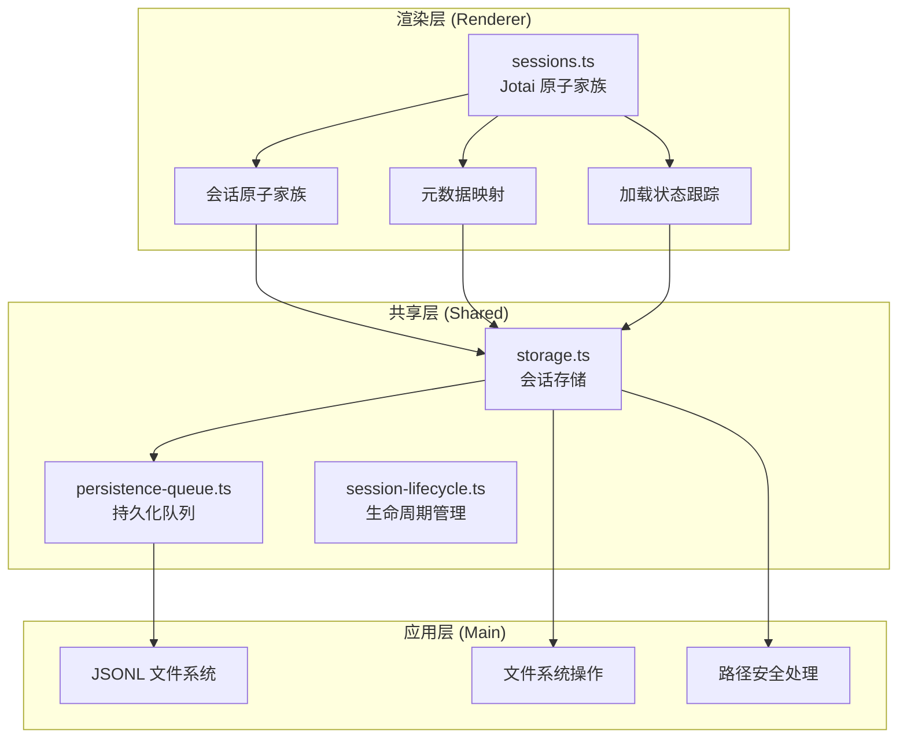

**图表来源**
- [sessions.ts:1-715](file://apps/electron/src/renderer/atoms/sessions.ts#L1-L715)
- [storage.ts:1-1081](file://packages/shared/src/sessions/storage.ts#L1-L1081)
- [persistence-queue.ts:1-245](file://packages/shared/src/sessions/persistence-queue.ts#L1-L245)

**章节来源**
- [sessions.ts:1-715](file://apps/electron/src/renderer/atoms/sessions.ts#L1-L715)
- [storage.ts:1-1081](file://packages/shared/src/sessions/storage.ts#L1-L1081)
- [persistence-queue.ts:1-245](file://packages/shared/src/sessions/persistence-queue.ts#L1-L245)

## 核心组件

### 会话元数据提取器

extractSessionMeta 函数负责从完整会话对象中提取轻量级元数据：

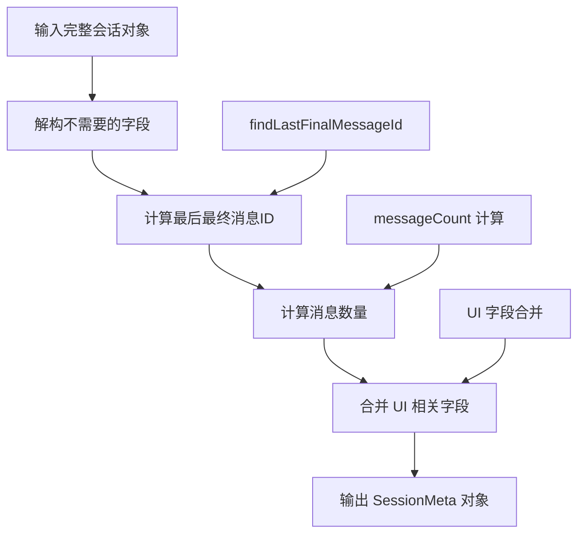

**图表来源**
- [sessions.ts:97-116](file://apps/electron/src/renderer/atoms/sessions.ts#L97-L116)

### 会话原子家族

基于 Jotai 的原子家族实现，为每个会话创建独立的状态容器：

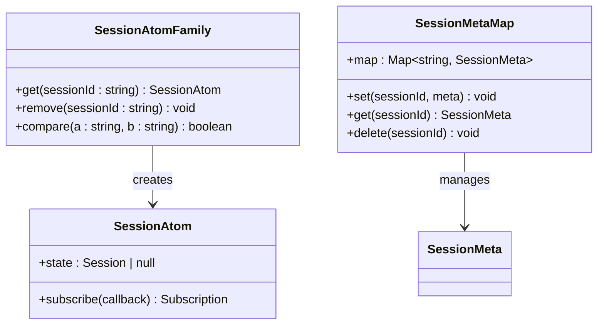

**图表来源**
- [sessions.ts:122-131](file://apps/electron/src/renderer/atoms/sessions.ts#L122-L131)
- [sessions.ts:131-131](file://apps/electron/src/renderer/atoms/sessions.ts#L131-L131)

### 持久化队列

异步持久化队列，防止主线程阻塞并合并连续的持久化请求：

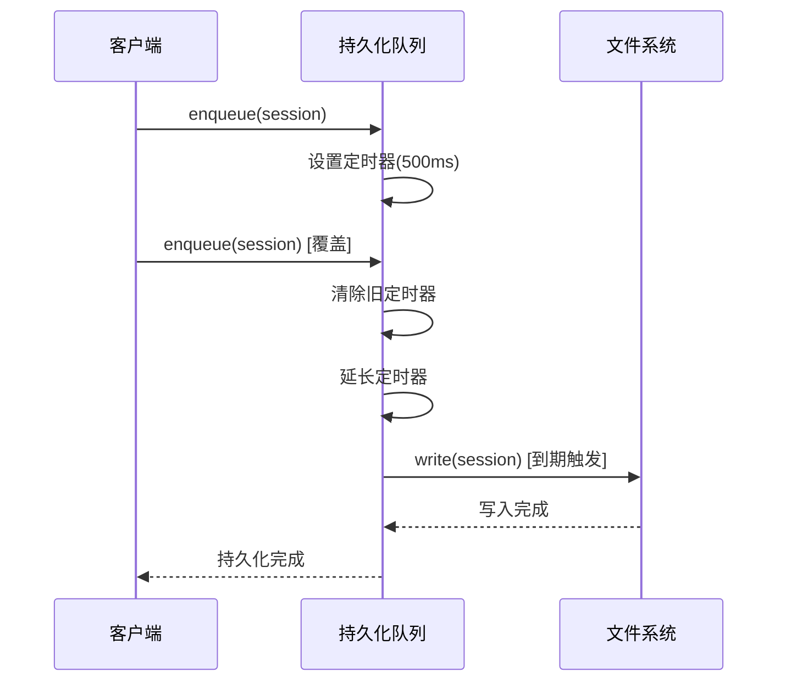

**图表来源**
- [persistence-queue.ts:73-84](file://packages/shared/src/sessions/persistence-queue.ts#L73-L84)
- [persistence-queue.ts:90-166](file://packages/shared/src/sessions/persistence-queue.ts#L90-L166)

**章节来源**
- [sessions.ts:97-116](file://apps/electron/src/renderer/atoms/sessions.ts#L97-L116)
- [sessions.ts:122-131](file://apps/electron/src/renderer/atoms/sessions.ts#L122-L131)
- [persistence-queue.ts:59-84](file://packages/shared/src/sessions/persistence-queue.ts#L59-L84)

## 架构概览

会话状态管理采用分层架构，确保各层职责清晰：

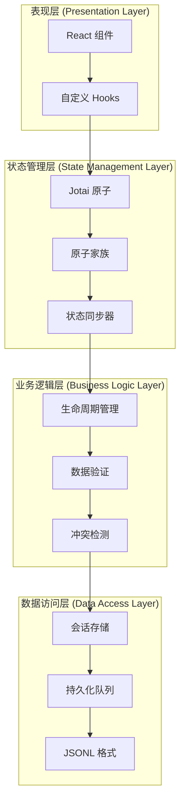

**图表来源**
- [sessions.ts:1-715](file://apps/electron/src/renderer/atoms/sessions.ts#L1-L715)
- [storage.ts:1-1081](file://packages/shared/src/sessions/storage.ts#L1-L1081)
- [persistence-queue.ts:1-245](file://packages/shared/src/sessions/persistence-queue.ts#L1-L245)

## 详细组件分析

### 会话元数据提取机制

extractSessionMeta 函数实现了高效的元数据提取：

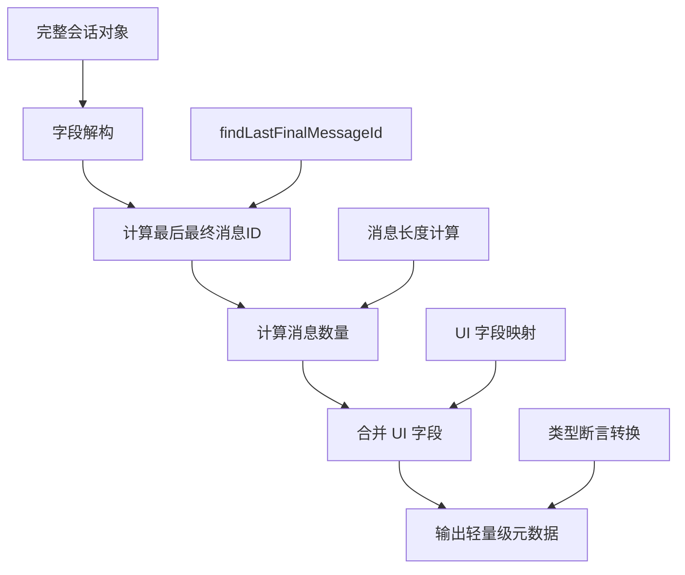

**图表来源**
- [sessions.ts:97-116](file://apps/electron/src/renderer/atoms/sessions.ts#L97-L116)

关键特性：
- **惰性计算**：仅在需要时计算最后最终消息ID
- **类型安全**：通过 TypeScript 确保返回类型的正确性
- **性能优化**：避免不必要的字段复制和转换

**章节来源**
- [sessions.ts:97-116](file://apps/electron/src/renderer/atoms/sessions.ts#L97-L116)

### 会话生命周期管理

SessionLifecycleManager 提供了完整的会话生命周期跟踪：

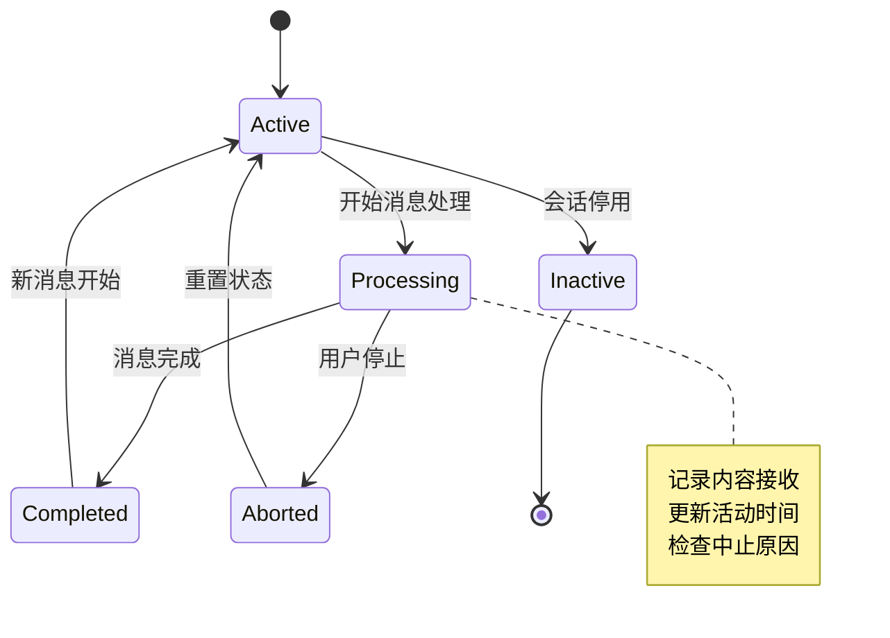

**图表来源**
- [session-lifecycle.ts:94-148](file://packages/shared/src/agent/core/session-lifecycle.ts#L94-L148)

核心功能：
- **消息计数跟踪**：精确记录会话中的消息数量
- **活动时间监控**：跟踪最后活动时间，支持超时检测
- **内容接收检测**：区分首次内容接收和后续更新
- **中止原因管理**：支持多种中止场景的分类处理

**章节来源**
- [session-lifecycle.ts:94-244](file://packages/shared/src/agent/core/session-lifecycle.ts#L94-L244)

### 消息流式更新机制

流式更新支持实时响应的增量更新：

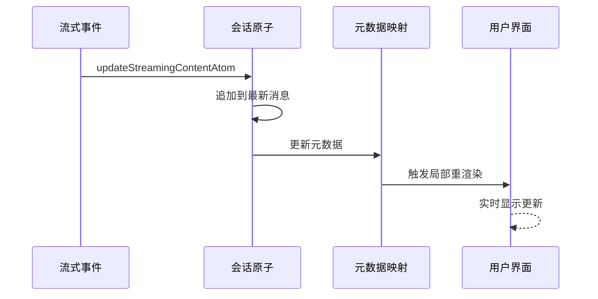

**图表来源**
- [sessions.ts:257-277](file://apps/electron/src/renderer/atoms/sessions.ts#L257-L277)

实现特点：
- **增量更新**：仅更新最新的流式消息，避免全量重渲染
- **转义处理**：正确处理流式内容中的特殊字符
- **消息识别**：通过角色和流式标志识别可更新的消息

**章节来源**
- [sessions.ts:257-277](file://apps/electron/src/renderer/atoms/sessions.ts#L257-L277)

### 会话原子家族实现

原子家族确保每个会话的状态完全隔离：

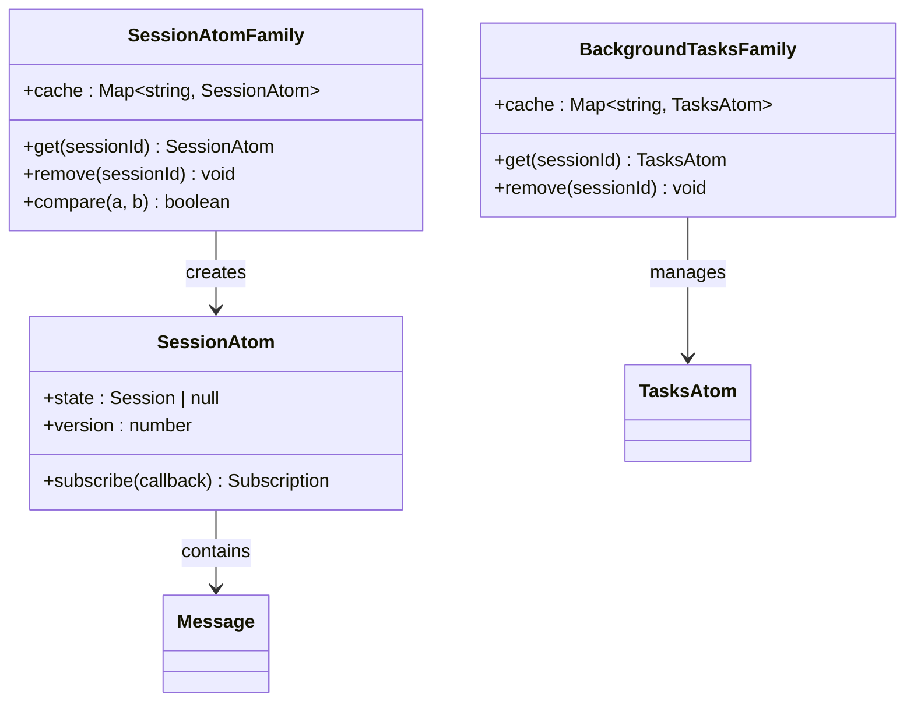

**图表来源**
- [sessions.ts:122-125](file://apps/electron/src/renderer/atoms/sessions.ts#L122-L125)
- [sessions.ts:699-702](file://apps/electron/src/renderer/atoms/sessions.ts#L699-L702)

优势：
- **状态隔离**：一个会话的更新不会影响其他会话
- **内存效率**：仅在需要时创建和维护原子实例
- **引用相等性**：利用 Jotai 的引用相等性优化重渲染

**章节来源**
- [sessions.ts:122-125](file://apps/electron/src/renderer/atoms/sessions.ts#L122-L125)
- [sessions.ts:699-702](file://apps/electron/src/renderer/atoms/sessions.ts#L699-L702)

### 懒加载策略

懒加载机制显著减少了内存占用：

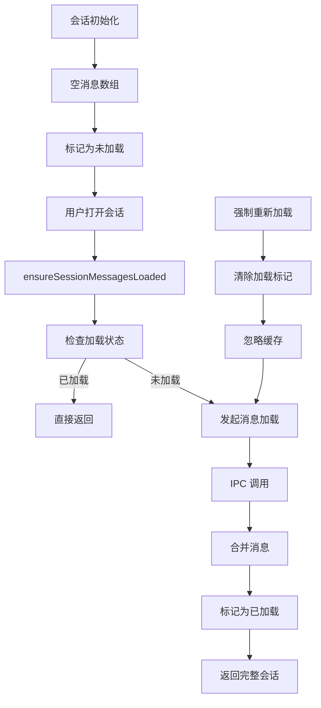

**图表来源**
- [sessions.ts:550-656](file://apps/electron/src/renderer/atoms/sessions.ts#L550-L656)

优化效果：
- **内存节省**：从 500MB 减少到 50MB（300+ 会话场景）
- **延迟加载**：仅在需要时加载消息内容
- **缓存机制**：避免重复加载相同会话

**章节来源**
- [sessions.ts:550-656](file://apps/electron/src/renderer/atoms/sessions.ts#L550-L656)

### 会话状态同步机制

syncSessionsToAtomsAtom 实现了智能状态同步：

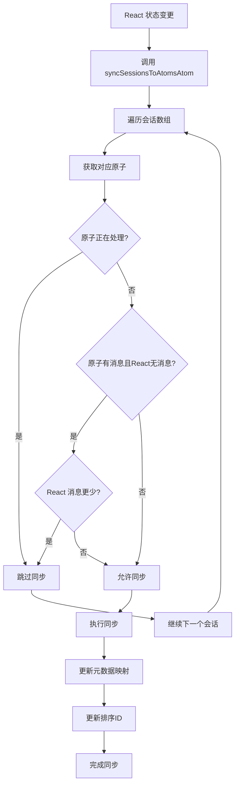

**图表来源**
- [sessions.ts:479-534](file://apps/electron/src/renderer/atoms/sessions.ts#L479-L534)

同步策略：
- **优先保护原子状态**：在流式处理期间保护原子中的最新数据
- **智能消息合并**：避免丢失原子中的流式消息
- **元数据一致性**：保持元数据映射的准确性

**章节来源**
- [sessions.ts:479-534](file://apps/electron/src/renderer/atoms/sessions.ts#L479-L534)

### 冲突解决机制

持久化队列实现了复杂的冲突检测和解决：

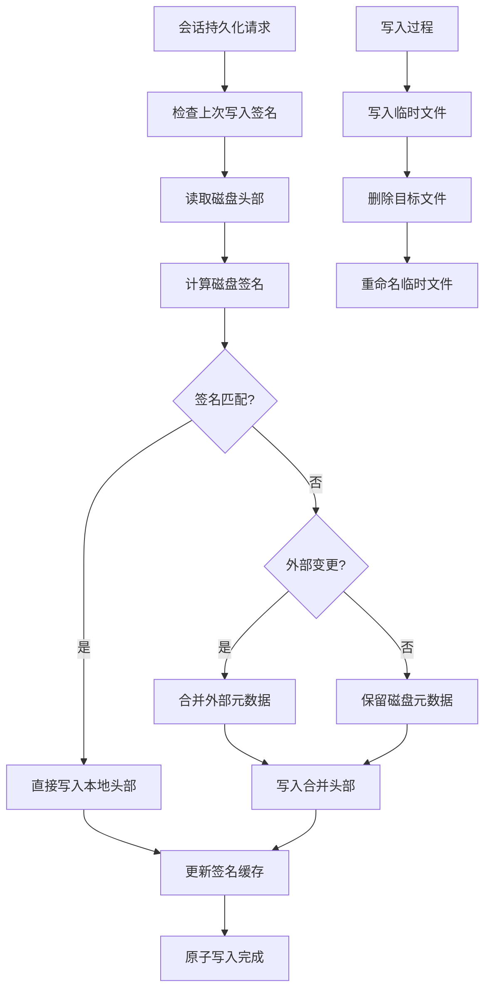

**图表来源**
- [persistence-queue.ts:120-136](file://packages/shared/src/sessions/persistence-queue.ts#L120-L136)
- [persistence-queue.ts:146-166](file://packages/shared/src/sessions/persistence-queue.ts#L146-L166)

冲突检测：
- **签名比较**：通过头部元数据签名检测外部变更
- **智能合并**：在冲突情况下选择合适的元数据来源
- **原子写入**：使用临时文件和重命名确保写入原子性

**章节来源**
- [persistence-queue.ts:120-136](file://packages/shared/src/sessions/persistence-queue.ts#L120-L136)
- [persistence-queue.ts:146-166](file://packages/shared/src/sessions/persistence-queue.ts#L146-L166)

### 会话操作原子

提供多种会话操作原子以满足不同场景需求：

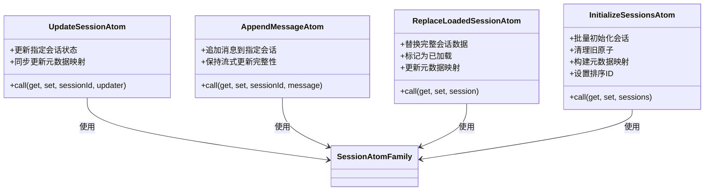

**图表来源**
- [sessions.ts:170-186](file://apps/electron/src/renderer/atoms/sessions.ts#L170-L186)
- [sessions.ts:238-251](file://apps/electron/src/renderer/atoms/sessions.ts#L238-L251)
- [sessions.ts:213-230](file://apps/electron/src/renderer/atoms/sessions.ts#L213-L230)
- [sessions.ts:282-322](file://apps/electron/src/renderer/atoms/sessions.ts#L282-L322)

使用模式：
- **updateSessionAtom**：适用于部分状态更新
- **appendMessageAtom**：专门用于消息追加
- **replaceLoadedSessionAtom**：用于完整会话替换
- **initializeSessionsAtom**：批量初始化场景

**章节来源**
- [sessions.ts:170-186](file://apps/electron/src/renderer/atoms/sessions.ts#L170-L186)
- [sessions.ts:238-251](file://apps/electron/src/renderer/atoms/sessions.ts#L238-L251)
- [sessions.ts:213-230](file://apps/electron/src/renderer/atoms/sessions.ts#L213-L230)
- [sessions.ts:282-322](file://apps/electron/src/renderer/atoms/sessions.ts#L282-L322)

## 依赖关系分析

会话状态管理系统的关键依赖关系：

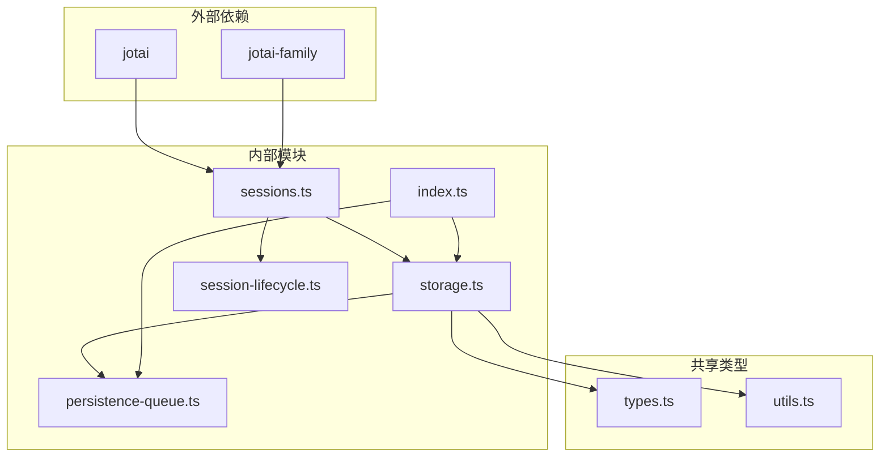

**图表来源**
- [sessions.ts:11-14](file://apps/electron/src/renderer/atoms/sessions.ts#L11-L14)
- [storage.ts:31-44](file://packages/shared/src/sessions/storage.ts#L31-L44)
- [index.ts:11-21](file://packages/shared/src/sessions/index.ts#L11-L21)

**章节来源**
- [sessions.ts:11-14](file://apps/electron/src/renderer/atoms/sessions.ts#L11-L14)
- [storage.ts:31-44](file://packages/shared/src/sessions/storage.ts#L31-L44)
- [index.ts:11-21](file://packages/shared/src/sessions/index.ts#L11-L21)

## 性能考虑

### 内存优化策略

1. **原子家族隔离**：每个会话使用独立原子，避免全局状态污染
2. **懒加载机制**：仅在需要时加载会话消息，显著减少内存占用
3. **引用相等性**：利用 Jotai 的引用相等性避免不必要的重渲染
4. **垃圾回收友好**：及时清理不再使用的原子实例

### 渲染性能优化

1. **局部更新**：流式更新仅触发相关组件重渲染
2. **元数据分离**：列表显示使用轻量级元数据，避免完整会话重渲染
3. **批量操作**：支持批量初始化和同步操作
4. **去抖动机制**：持久化请求自动合并，减少 I/O 操作

### I/O 性能优化

1. **异步持久化**：所有持久化操作都是异步的，不阻塞主线程
2. **请求合并**：连续的持久化请求会被合并为单个写入
3. **原子写入**：使用临时文件和重命名确保写入原子性
4. **跨平台兼容**：Windows 平台的特殊处理确保可靠性

## 故障排除指南

### 常见问题及解决方案

#### 1. 会话消息丢失

**症状**：流式响应过程中消息突然消失

**原因分析**：
- React 状态覆盖了原子中的流式更新
- IPC 请求和响应的时间窗口导致的数据竞争

**解决方案**：
- 检查 syncSessionsToAtomsAtom 的同步逻辑
- 确保在流式处理期间不要覆盖原子状态
- 验证消息长度保护逻辑

**章节来源**
- [sessions.ts:489-513](file://apps/electron/src/renderer/atoms/sessions.ts#L489-L513)

#### 2. 内存泄漏

**症状**：应用运行时间越长内存占用越高

**原因分析**：
- 原子实例没有被正确清理
- 会话切换后旧原子仍然存在

**解决方案**：
- 检查 removeSessionAtom 的清理逻辑
- 确保 sessionAtomFamily.remove() 被调用
- 验证 backgroundTasksAtomFamily 的清理

**章节来源**
- [sessions.ts:433-461](file://apps/electron/src/renderer/atoms/sessions.ts#L433-L461)

#### 3. 持久化冲突

**症状**：会话元数据在不同实例间不一致

**原因分析**：
- 多实例同时修改同一会话
- 外部编辑器修改了会话文件

**解决方案**：
- 检查持久化队列的签名比较逻辑
- 验证 mergeHeaderWithExternalMetadata 的合并策略
- 确认原子写入的正确性

**章节来源**
- [persistence-queue.ts:120-136](file://packages/shared/src/sessions/persistence-queue.ts#L120-L136)

#### 4. 懒加载问题

**症状**：打开会话时消息加载失败或显示为空

**原因分析**：
- IPC 调用失败
- 会话处于流式处理状态
- 缓存状态不一致

**解决方案**：
- 检查 ensureSessionMessagesLoadedAtom 的实现
- 验证 sessionLoadingPromises 的缓存逻辑
- 确认强制重新加载功能

**章节来源**
- [sessions.ts:658-674](file://apps/electron/src/renderer/atoms/sessions.ts#L658-L674)

### 调试方法

#### 1. 日志调试

启用详细的调试日志：

```typescript
// 在持久化队列中添加调试信息
debug(`[PersistenceQueue] Session ${sessionId} metadata mismatch detected (${mode}${baseline})`)
debug(`[PersistenceQueue] Wrote session ${sessionId}`)
```

#### 2. 性能监控

使用内置的性能监控工具：

```typescript
const end = perf.start('session.loadSession', { sessionId })
// ... 执行操作
end()
```

#### 3. 状态检查

定期检查关键状态变量：

```typescript
// 检查原子家族大小
console.log('Atom family size:', sessionAtomFamily.size)

// 检查加载状态
console.log('Loaded sessions:', loadedSessionsAtom.size)

// 检查持久化队列
console.log('Pending writes:', sessionPersistenceQueue.pendingCount)
```

## 结论

会话状态管理系统通过精心设计的架构和实现，提供了高效、可靠、可扩展的会话管理能力。主要优势包括：

1. **高性能**：通过原子家族隔离、懒加载和智能同步，显著提升了性能
2. **可靠性**：完善的冲突检测和解决机制确保数据一致性
3. **可扩展性**：模块化的架构设计便于功能扩展和维护
4. **用户体验**：流畅的流式更新和即时响应提升了用户体验

该系统为复杂会话管理功能提供了坚实的基础，开发者可以在此基础上构建更高级的功能，如会话分支、并发控制、状态恢复等。