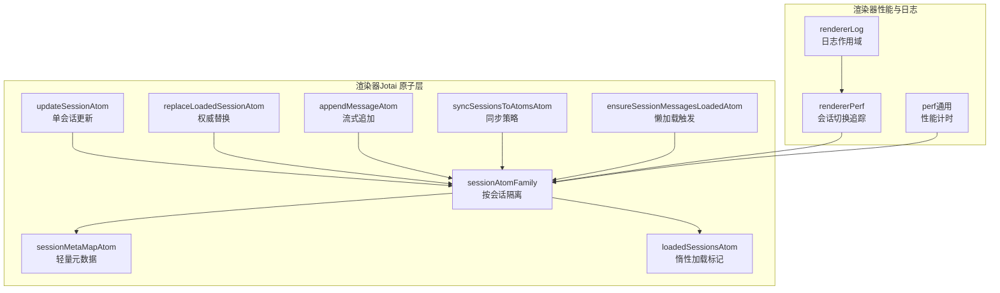
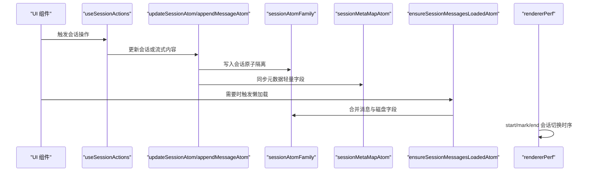
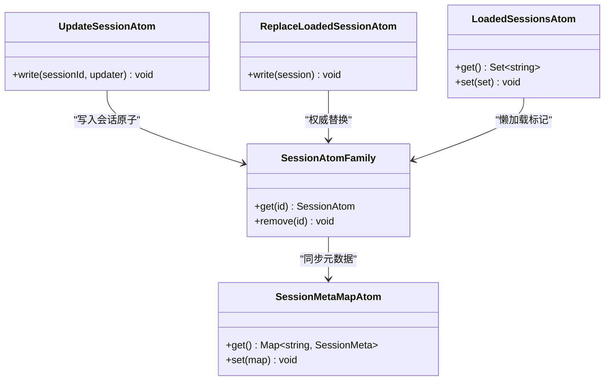
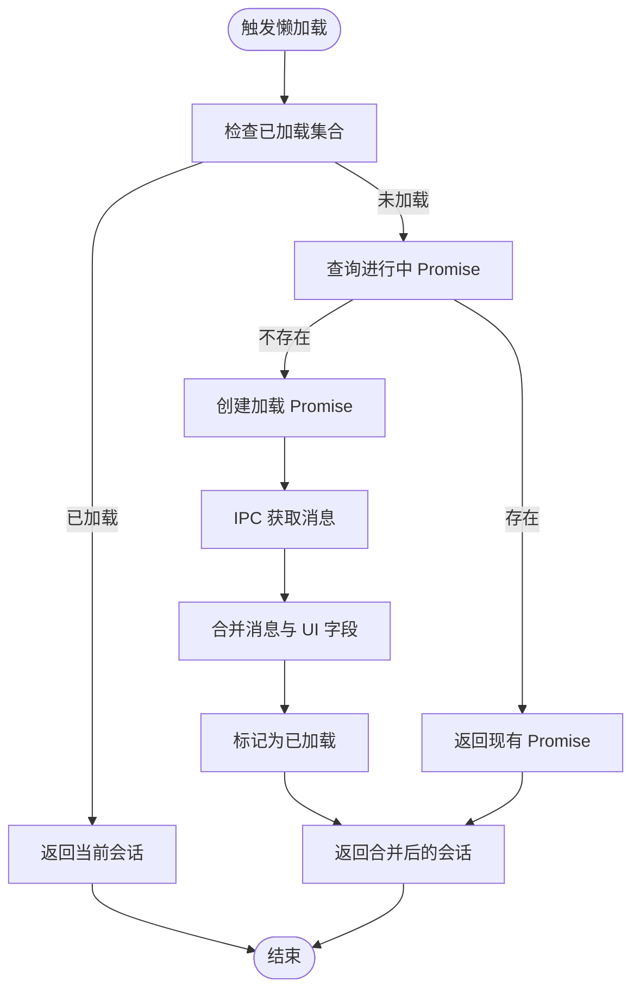
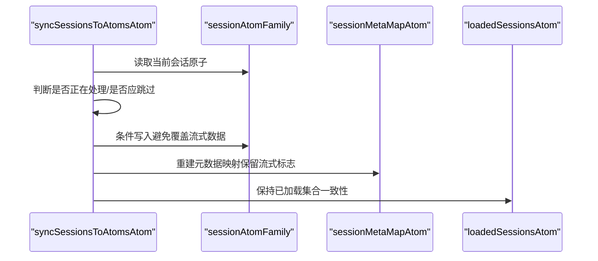
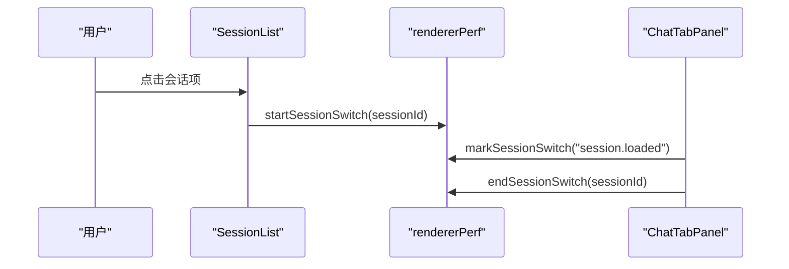
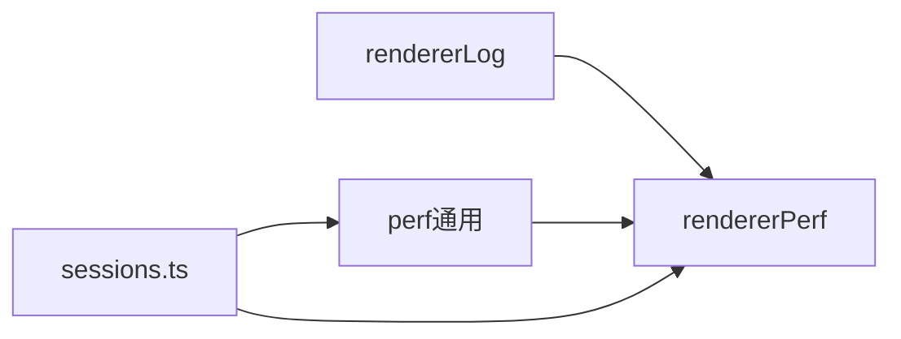

# 性能优化

<cite>
**本文引用的文件**
- [sessions.ts](file://apps/electron/src/renderer/atoms/sessions.ts)
- [browser-pane.ts](file://apps/electron/src/renderer/atoms/browser-pane.ts)
- [session-load.ts](file://apps/electron/src/renderer/lib/session-load.ts)
- [perf.ts（渲染器）](file://apps/electron/src/renderer/lib/perf.ts)
- [perf.ts（通用）](file://packages/shared/src/utils/perf.ts)
- [logger.ts](file://apps/electron/src/renderer/lib/logger.ts)
- [mode-manager.ts](file://packages/shared/src/agent/mode-manager.ts)
- [useSession.ts](file://apps/electron/src/renderer/hooks/useSession.ts)
- [useSessionActions.ts](file://apps/electron/src/renderer/hooks/useSessionActions.ts)
</cite>

## 目录
1. [简介](#简介)
2. [项目结构](#项目结构)
3. [核心组件](#核心组件)
4. [架构总览](#架构总览)
5. [详细组件分析](#详细组件分析)
6. [依赖分析](#依赖分析)
7. [性能考量](#性能考量)
8. [故障排查指南](#故障排查指南)
9. [结论](#结论)
10. [附录](#附录)

## 简介
本文件聚焦于状态管理性能优化，围绕 Jotai 在本仓库中的实践展开，系统阐述以下主题：
- 内存优化策略：原子隔离、惰性加载、Promise 缓存、清理策略
- 渲染性能提升：原子家族隔离、批量更新、状态合并、避免不必要重渲染
- 计算属性缓存：派生原子与元数据映射的协同
- 懒加载与 Promise 缓存：并发请求去重、消息加载恢复
- 内存泄漏防护：原子族清理、移除过期引用、窗口级工作区切换
- 性能监控与评估：会话切换时序、通用性能计时、统计汇总
- 调试与分析：日志作用域、渲染器性能追踪、瓶颈定位

## 项目结构
本项目的状态管理以 Jotai 为核心，采用“按会话隔离”的原子家族设计，配合渲染器侧的性能追踪与日志体系，形成从数据到渲染再到可观测性的完整闭环。

图表来源
- [sessions.ts:118-165](file://apps/electron/src/renderer/atoms/sessions.ts#L118-L165)
- [perf.ts（渲染器）:63-126](file://apps/electron/src/renderer/lib/perf.ts#L63-L126)
- [perf.ts（通用）:193-231](file://packages/shared/src/utils/perf.ts#L193-L231)
- [logger.ts:1-8](file://apps/electron/src/renderer/lib/logger.ts#L1-L8)

章节来源
- [sessions.ts:118-165](file://apps/electron/src/renderer/atoms/sessions.ts#L118-L165)
- [perf.ts（渲染器）:63-126](file://apps/electron/src/renderer/lib/perf.ts#L63-L126)
- [perf.ts（通用）:193-231](file://packages/shared/src/utils/perf.ts#L193-L231)
- [logger.ts:1-8](file://apps/electron/src/renderer/lib/logger.ts#L1-L8)

## 核心组件
- 会话原子家族：每个会话拥有独立原子，避免跨会话更新引发的全局重渲染
- 元数据映射：仅存放列表展示所需的轻量字段，降低渲染压力
- 惰性加载标记：记录已加载会话集合，配合懒加载减少初始内存占用
- 批量更新与权威替换：在一次写事务中完成多处状态变更，保证一致性
- 流式更新与同步策略：区分流式过程中的原子优先与常规同步逻辑
- 懒加载触发与 Promise 缓存：并发请求去重，避免重复 IPC 调用
- 渲染器性能追踪：从点击到渲染完成的分段计时，支持统计分析

章节来源
- [sessions.ts:118-165](file://apps/electron/src/renderer/atoms/sessions.ts#L118-L165)
- [sessions.ts:282-322](file://apps/electron/src/renderer/atoms/sessions.ts#L282-L322)
- [sessions.ts:479-534](file://apps/electron/src/renderer/atoms/sessions.ts#L479-L534)
- [sessions.ts:540-656](file://apps/electron/src/renderer/atoms/sessions.ts#L540-L656)
- [perf.ts（渲染器）:63-126](file://apps/electron/src/renderer/lib/perf.ts#L63-L126)

## 架构总览
下图展示了“会话状态”在渲染器中的关键路径：从用户交互到 Jotai 原子，再到渲染器性能追踪与日志输出。

图表来源
- [useSessionActions.ts:13-87](file://apps/electron/src/renderer/hooks/useSessionActions.ts#L13-L87)
- [sessions.ts:170-186](file://apps/electron/src/renderer/atoms/sessions.ts#L170-L186)
- [sessions.ts:238-277](file://apps/electron/src/renderer/atoms/sessions.ts#L238-L277)
- [sessions.ts:658-674](file://apps/electron/src/renderer/atoms/sessions.ts#L658-L674)
- [perf.ts（渲染器）:63-126](file://apps/electron/src/renderer/lib/perf.ts#L63-L126)

## 详细组件分析

### 会话原子家族与元数据映射
- 原子家族隔离：每个会话一个原子，更新仅影响订阅该会话的组件，避免全局重渲染
- 元数据映射：仅存储列表所需字段，不包含消息数组，显著降低渲染成本
- 初始化与刷新：批量初始化与非破坏性刷新，确保跨工作区切换时的内存安全

图表来源
- [sessions.ts:118-165](file://apps/electron/src/renderer/atoms/sessions.ts#L118-L165)
- [sessions.ts:170-186](file://apps/electron/src/renderer/atoms/sessions.ts#L170-L186)
- [sessions.ts:213-230](file://apps/electron/src/renderer/atoms/sessions.ts#L213-L230)

章节来源
- [sessions.ts:118-165](file://apps/electron/src/renderer/atoms/sessions.ts#L118-L165)
- [sessions.ts:170-186](file://apps/electron/src/renderer/atoms/sessions.ts#L170-L186)
- [sessions.ts:213-230](file://apps/electron/src/renderer/atoms/sessions.ts#L213-L230)

### 惰性加载与 Promise 缓存
- 惰性加载：会话列表仅加载空消息，打开会话时再按需拉取
- Promise 缓存：模块级 Map 缓存进行中的加载 Promise，避免并发重复请求
- 合并策略：合并磁盘字段与内存 UI 状态，防止乐观更新被覆盖

图表来源
- [sessions.ts:540-656](file://apps/electron/src/renderer/atoms/sessions.ts#L540-L656)

章节来源
- [sessions.ts:540-656](file://apps/electron/src/renderer/atoms/sessions.ts#L540-L656)

### 批量更新与状态合并
- 同步策略：在流式过程中，原子是事实来源；React 状态仅在手牌事件后同步，避免丢失中间数据
- 非破坏性刷新：保留已加载会话的消息，仅对元数据做权威更新
- 一次性写事务：初始化、刷新、删除等操作在单次写中完成，保证订阅者看到一致状态

图表来源
- [sessions.ts:479-534](file://apps/electron/src/renderer/atoms/sessions.ts#L479-L534)

章节来源
- [sessions.ts:479-534](file://apps/electron/src/renderer/atoms/sessions.ts#L479-L534)

### 渲染器性能追踪与会话切换时序
- 分段计时：从点击到加载、到渲染完成的多个里程碑
- 统计分析：支持均值、中位数、P95 等指标，便于识别异常波动
- 日志作用域：统一前缀与命名空间，便于过滤与分析

图表来源
- [perf.ts（渲染器）:63-126](file://apps/electron/src/renderer/lib/perf.ts#L63-L126)

章节来源
- [perf.ts（渲染器）:63-126](file://apps/electron/src/renderer/lib/perf.ts#L63-L126)

### 通用性能计时与统计
- 轻量计时：start/measure/span 提供简洁 API，支持嵌套标记
- 聚合统计：按操作名聚合次数、总耗时、最小/最大/平均、百分位
- 输出格式化：控制台摘要表，便于快速定位热点

章节来源
- [perf.ts（通用）:193-231](file://packages/shared/src/utils/perf.ts#L193-L231)
- [perf.ts（通用）:306-345](file://packages/shared/src/utils/perf.ts#L306-L345)
- [perf.ts（通用）:365-400](file://packages/shared/src/utils/perf.ts#L365-L400)

### 内存泄漏防护
- 原子族清理：删除会话时移除对应原子，允许垃圾回收
- 工作区切换：清理旧会话原子族条目，避免残留引用
- 移除过期引用：浏览器实例移除墓碑集合，防止延迟更新导致的误写

章节来源
- [sessions.ts:433-461](file://apps/electron/src/renderer/atoms/sessions.ts#L433-L461)
- [sessions.ts:285-295](file://apps/electron/src/renderer/atoms/sessions.ts#L285-L295)
- [browser-pane.ts:52-64](file://apps/electron/src/renderer/atoms/browser-pane.ts#L52-L64)

### 会话加载状态推导与错误处理
- 加载状态推导：结合“已加载标志”与“内存消息”、“持久化消息预期”等条件，决定 UI 展示
- 失败回退：根据传输连接状态判断是否将加载失败视为传输回退
- 错误格式化：统一错误字符串，便于日志与提示

章节来源
- [session-load.ts:35-65](file://apps/electron/src/renderer/lib/session-load.ts#L35-L65)
- [session-load.ts:67-80](file://apps/electron/src/renderer/lib/session-load.ts#L67-L80)
- [session-load.ts:82-87](file://apps/electron/src/renderer/lib/session-load.ts#L82-L87)

### 会话选择与动作钩子
- 会话选择：兼容旧版与新版选择接口，保持向后兼容
- 动作封装：将业务动作与通知、撤销等 UX 行为解耦

章节来源
- [useSession.ts:25-45](file://apps/electron/src/renderer/hooks/useSession.ts#L25-L45)
- [useSessionActions.ts:13-87](file://apps/electron/src/renderer/hooks/useSessionActions.ts#L13-L87)

## 依赖分析
- 渲染器性能追踪依赖 electron-log/renderer 进行日志输出
- 通用性能计时与渲染器计时相互独立但可互补
- 会话原子家族与元数据映射之间存在强耦合关系，共同支撑列表与详情的渲染

图表来源
- [logger.ts:1-8](file://apps/electron/src/renderer/lib/logger.ts#L1-L8)
- [perf.ts（渲染器）:18-49](file://apps/electron/src/renderer/lib/perf.ts#L18-L49)
- [perf.ts（通用）:28-94](file://packages/shared/src/utils/perf.ts#L28-L94)
- [sessions.ts:118-165](file://apps/electron/src/renderer/atoms/sessions.ts#L118-L165)

章节来源
- [logger.ts:1-8](file://apps/electron/src/renderer/lib/logger.ts#L1-L8)
- [perf.ts（渲染器）:18-49](file://apps/electron/src/renderer/lib/perf.ts#L18-L49)
- [perf.ts（通用）:28-94](file://packages/shared/src/utils/perf.ts#L28-L94)
- [sessions.ts:118-165](file://apps/electron/src/renderer/atoms/sessions.ts#L118-L165)

## 性能考量
- 原子隔离与派生原子：通过原子家族与元数据映射，将“昂贵消息数组”与“轻量元数据”分离，降低渲染范围
- 批量写事务：在一次写中完成多处状态变更，减少订阅者触发次数
- 惰性加载与并发去重：仅在需要时加载消息，并通过 Promise 缓存避免重复 IPC
- 同步策略：流式过程优先原子，手牌事件后同步，兼顾实时性与一致性
- 统计与可视化：通过通用与渲染器性能计时，建立持续观测基线

## 故障排查指南
- 会话切换卡顿
  - 使用渲染器性能追踪记录 start/mark/end，查看分段耗时
  - 关注“session.loaded”与最终 end 的差值，定位瓶颈阶段
- 消息加载异常
  - 检查“已加载标志”与“内存消息”状态，确认是否出现“陈旧已加载标志”
  - 若为传输回退场景，参考失败回退判定逻辑
- 内存占用过高
  - 确认工作区切换后是否清理了旧会话原子族
  - 检查删除会话流程是否调用了原子族清理
- 日志与统计
  - 使用 rendererLog 与 electron-log 主进程日志交叉比对
  - 通过通用 perf 的统计摘要表，识别耗时增长的操作

章节来源
- [perf.ts（渲染器）:63-126](file://apps/electron/src/renderer/lib/perf.ts#L63-L126)
- [session-load.ts:35-65](file://apps/electron/src/renderer/lib/session-load.ts#L35-L65)
- [sessions.ts:285-295](file://apps/electron/src/renderer/atoms/sessions.ts#L285-L295)
- [sessions.ts:433-461](file://apps/electron/src/renderer/atoms/sessions.ts#L433-L461)
- [logger.ts:1-8](file://apps/electron/src/renderer/lib/logger.ts#L1-L8)

## 结论
本项目通过 Jotai 的原子家族隔离、元数据映射、惰性加载与 Promise 缓存等策略，在大型应用中有效降低了内存占用与渲染压力；借助渲染器与通用性能计时体系，实现了端到端的可观测性与持续优化能力。建议在后续迭代中：
- 将通用性能计时扩展到更多关键路径
- 引入更细粒度的渲染性能分析工具（如 React DevTools Profiler）
- 对关键异步流程增加超时与重试策略，增强稳定性

## 附录
- 性能计时 API 参考
  - start/measure/measureSync/span：用于记录与统计
  - getStats/formatStatsSummary/clearMetrics：用于获取统计与清理
- 渲染器性能追踪 API 参考
  - startSessionSwitch/markSessionSwitch/endSessionSwitch：用于会话切换时序
  - getRecentMetrics/getStats/clear：用于获取统计与清理

章节来源
- [perf.ts（通用）:193-231](file://packages/shared/src/utils/perf.ts#L193-L231)
- [perf.ts（通用）:306-345](file://packages/shared/src/utils/perf.ts#L306-L345)
- [perf.ts（通用）:365-400](file://packages/shared/src/utils/perf.ts#L365-L400)
- [perf.ts（渲染器）:63-126](file://apps/electron/src/renderer/lib/perf.ts#L63-L126)
- [perf.ts（渲染器）:131-173](file://apps/electron/src/renderer/lib/perf.ts#L131-L173)