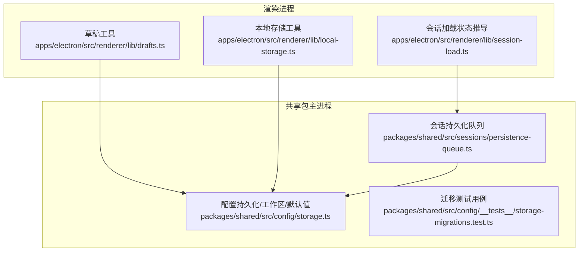
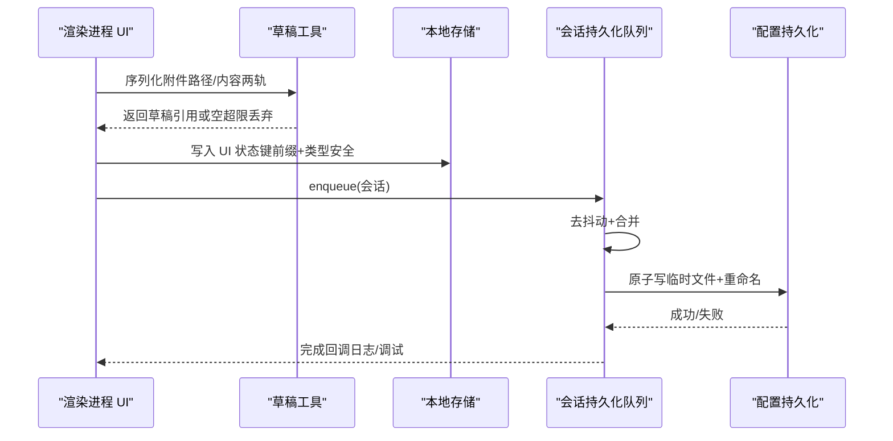
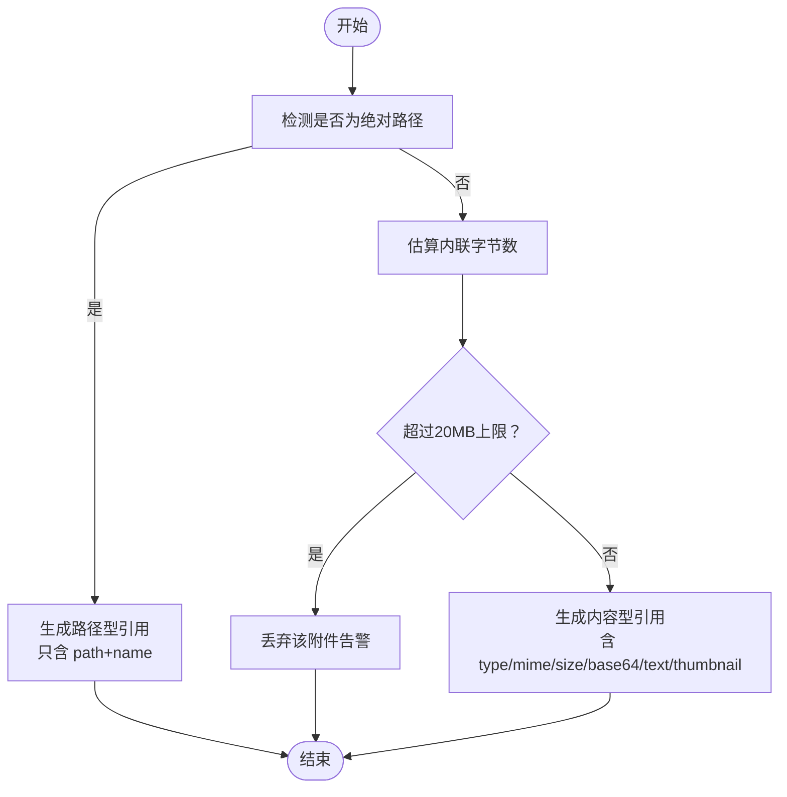
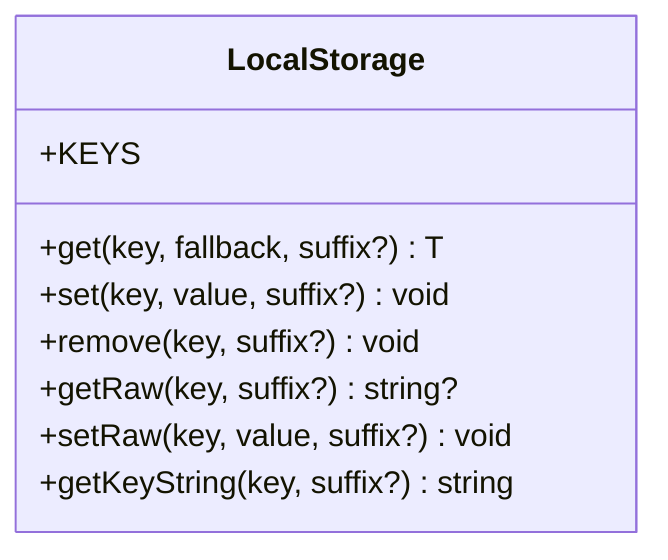
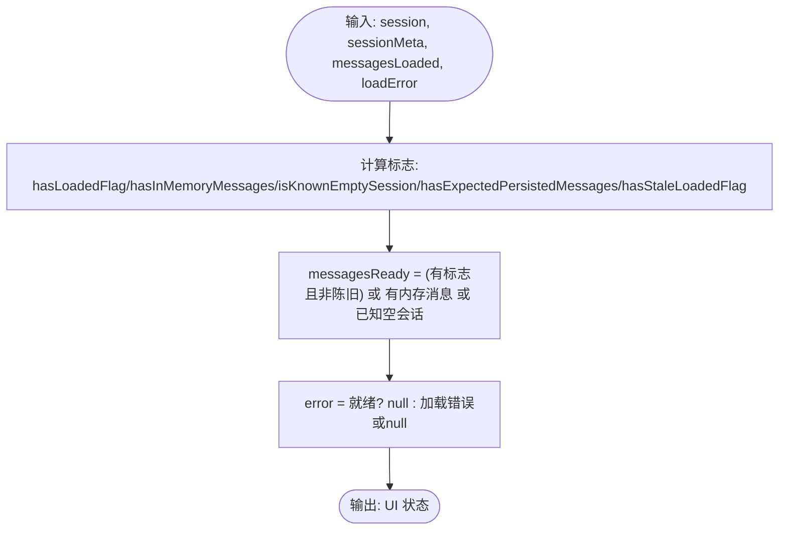
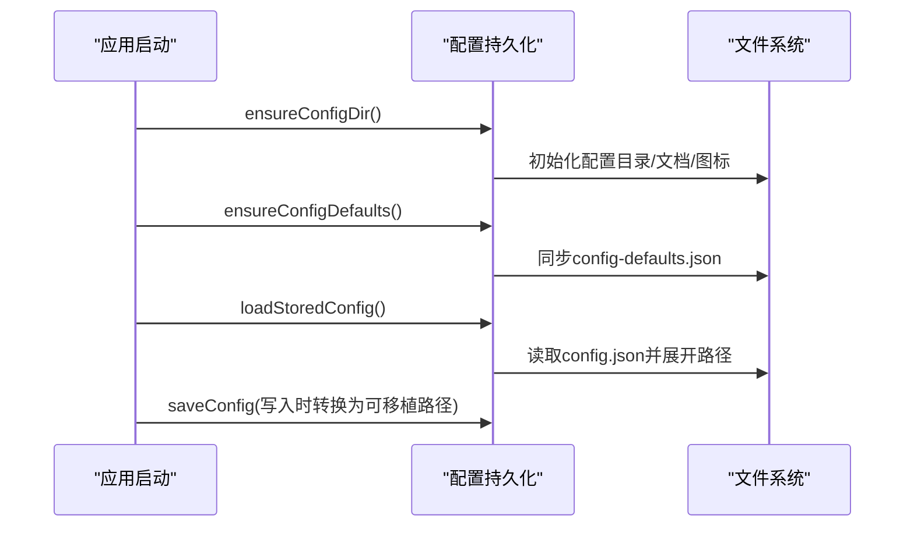
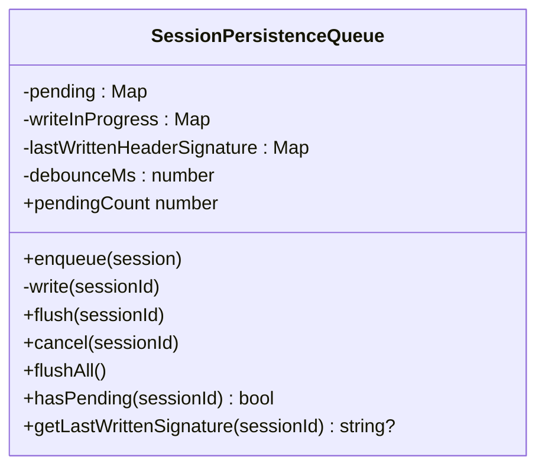
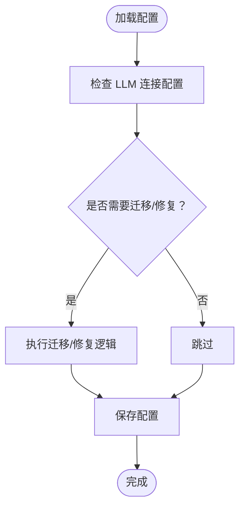
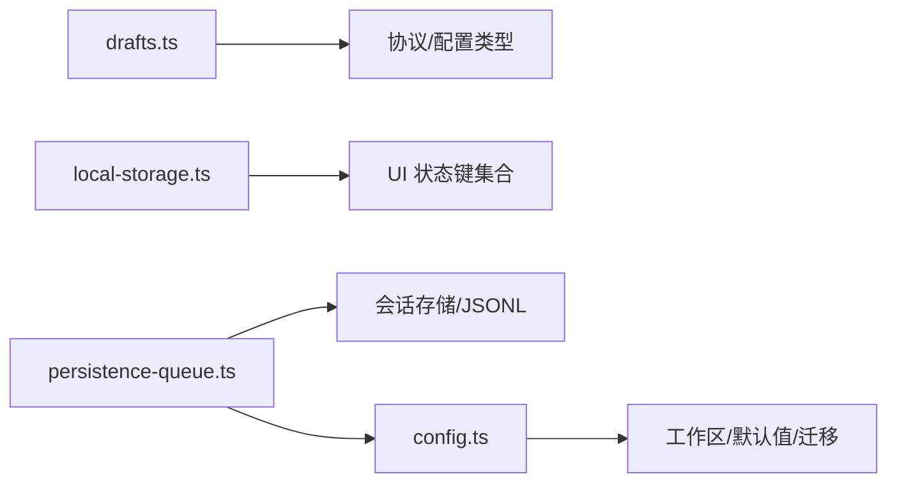

# 状态持久化

<cite>
**本文引用的文件**
- [apps/electron/src/renderer/lib/drafts.ts](file://apps/electron/src/renderer/lib/drafts.ts)
- [apps/electron/src/renderer/lib/local-storage.ts](file://apps/electron/src/renderer/lib/local-storage.ts)
- [apps/electron/src/renderer/lib/session-load.ts](file://apps/electron/src/renderer/lib/session-load.ts)
- [packages/shared/src/config/storage.ts](file://packages/shared/src/config/storage.ts)
- [packages/shared/src/sessions/persistence-queue.ts](file://packages/shared/src/sessions/persistence-queue.ts)
- [packages/shared/src/config/__tests__/storage-migrations.test.ts](file://packages/shared/src/config/__tests__/storage-migrations.test.ts)
- [apps/electron/src/renderer/lib/__tests__/drafts.test.ts](file://apps/electron/src/renderer/lib/__tests__/drafts.test.ts)
- [apps/electron/src/main/__tests__/session-persistence.test.ts](file://apps/electron/src/main/__tests__/session-persistence.test.ts)
</cite>

## 目录
1. [简介](#简介)
2. [项目结构](#项目结构)
3. [核心组件](#核心组件)
4. [架构总览](#架构总览)
5. [详细组件分析](#详细组件分析)
6. [依赖关系分析](#依赖关系分析)
7. [性能考量](#性能考量)
8. [故障排查指南](#故障排查指南)
9. [结论](#结论)
10. [附录](#附录)

## 简介
本文件面向需要实现可靠状态持久化的开发者，系统性梳理并解释本仓库的状态持久化体系：本地存储策略、数据序列化与版本兼容、草稿状态管理（含自动保存/恢复/冲突解决）、会话快照与增量更新、数据迁移与清理策略，并提供调试与备份恢复建议。内容以代码为依据，辅以图示帮助理解。

## 项目结构
围绕“状态持久化”的关键模块分布于渲染进程与共享包之间：
- 渲染进程（Electron 主线程侧）
  - 草稿状态：附件跟踪与序列化（路径/内容两轨）、容量限制与回退
  - 本地存储：键空间集中化、类型安全读写、工作区/标签页等 UI 状态
  - 会话加载状态：消息加载 UI 状态推导、错误格式化、传输失败降级判断
- 共享包（主进程侧）
  - 配置持久化：全局配置、工作区、默认值同步、跨机器路径便携化
  - 会话持久化队列：去抖动异步写入、原子重命名、元数据签名比对、并发串行化
  - 数据迁移：LLM 连接提供方修复与迁移、模型选择模式推断

图表来源
- [apps/electron/src/renderer/lib/drafts.ts:1-86](file://apps/electron/src/renderer/lib/drafts.ts#L1-L86)
- [apps/electron/src/renderer/lib/local-storage.ts:1-128](file://apps/electron/src/renderer/lib/local-storage.ts#L1-L128)
- [apps/electron/src/renderer/lib/session-load.ts:1-87](file://apps/electron/src/renderer/lib/session-load.ts#L1-L87)
- [packages/shared/src/config/storage.ts:1-2948](file://packages/shared/src/config/storage.ts#L1-L2948)
- [packages/shared/src/sessions/persistence-queue.ts:1-245](file://packages/shared/src/sessions/persistence-queue.ts#L1-L245)
- [packages/shared/src/config/__tests__/storage-migrations.test.ts:1-92](file://packages/shared/src/config/__tests__/storage-migrations.test.ts#L1-L92)

章节来源
- [apps/electron/src/renderer/lib/drafts.ts:1-86](file://apps/electron/src/renderer/lib/drafts.ts#L1-L86)
- [apps/electron/src/renderer/lib/local-storage.ts:1-128](file://apps/electron/src/renderer/lib/local-storage.ts#L1-L128)
- [apps/electron/src/renderer/lib/session-load.ts:1-87](file://apps/electron/src/renderer/lib/session-load.ts#L1-L87)
- [packages/shared/src/config/storage.ts:1-2948](file://packages/shared/src/config/storage.ts#L1-L2948)
- [packages/shared/src/sessions/persistence-queue.ts:1-245](file://packages/shared/src/sessions/persistence-queue.ts#L1-L245)
- [packages/shared/src/config/__tests__/storage-migrations.test.ts:1-92](file://packages/shared/src/config/__tests__/storage-migrations.test.ts#L1-L92)

## 核心组件
- 草稿状态管理（附件两轨策略、容量控制、序列化/反序列化）
- 本地存储工具（键前缀、类型安全、工作区/标签页状态）
- 会话加载状态推导（UI 展示与懒加载一致性）
- 配置持久化（全局配置、工作区、默认值、路径便携化）
- 会话持久化队列（去抖动、原子写、元数据签名、并发串行化）
- 数据迁移（提供方修复、模型选择模式推断）

章节来源
- [apps/electron/src/renderer/lib/drafts.ts:19-85](file://apps/electron/src/renderer/lib/drafts.ts#L19-L85)
- [apps/electron/src/renderer/lib/local-storage.ts:12-127](file://apps/electron/src/renderer/lib/local-storage.ts#L12-L127)
- [apps/electron/src/renderer/lib/session-load.ts:35-64](file://apps/electron/src/renderer/lib/session-load.ts#L35-L64)
- [packages/shared/src/config/storage.ts:226-286](file://packages/shared/src/config/storage.ts#L226-L286)
- [packages/shared/src/sessions/persistence-queue.ts:59-238](file://packages/shared/src/sessions/persistence-queue.ts#L59-L238)
- [packages/shared/src/config/__tests__/storage-migrations.test.ts:4-91](file://packages/shared/src/config/__tests__/storage-migrations.test.ts#L4-L91)

## 架构总览
整体采用“渲染进程负责 UI 状态与草稿、主进程负责会话与配置”的分层设计。渲染进程通过 IPC 与主进程交互；主进程内部使用持久化队列保证原子性与一致性。

图表来源
- [apps/electron/src/renderer/lib/drafts.ts:59-85](file://apps/electron/src/renderer/lib/drafts.ts#L59-L85)
- [apps/electron/src/renderer/lib/local-storage.ts:79-98](file://apps/electron/src/renderer/lib/local-storage.ts#L79-L98)
- [packages/shared/src/sessions/persistence-queue.ts:73-166](file://packages/shared/src/sessions/persistence-queue.ts#L73-L166)
- [packages/shared/src/config/storage.ts:273-286](file://packages/shared/src/config/storage.ts#L273-L286)

## 详细组件分析

### 草稿状态管理（drafts.ts）
- 附件两轨策略
  - Track P（路径型）：仅保存绝对路径与名称，恢复时通过 RPC 读取真实字节
  - Track C（内容型）：内联 base64/text 缩略图，恢复时直接重建 FileAttachment
- 容量控制与回退
  - 单附件内联内容按 20MB 上限估算，超限则丢弃该附件并告警
  - 绝对路径附件不计入内联成本，避免路径型被误删
- 序列化/反序列化
  - 将 FileAttachment 规范化为 DraftAttachmentRef，必要时抽取 content 字段
  - 从内容型引用重建 FileAttachment，不触发磁盘读取
- 自动保存/恢复
  - 由上层调用 setSessionDraft/getSessionDraft 完成；本模块提供转换与校验
- 冲突解决
  - 本模块不直接参与多实例冲突；路径型与内容型的区分天然降低冲突概率

图表来源
- [apps/electron/src/renderer/lib/drafts.ts:24-67](file://apps/electron/src/renderer/lib/drafts.ts#L24-L67)

章节来源
- [apps/electron/src/renderer/lib/drafts.ts:19-85](file://apps/electron/src/renderer/lib/drafts.ts#L19-L85)
- [apps/electron/src/renderer/lib/__tests__/drafts.test.ts:23-132](file://apps/electron/src/renderer/lib/__tests__/drafts.test.ts#L23-L132)

### 本地存储策略（local-storage.ts）
- 键空间集中化：统一前缀与枚举键名，避免魔法字符串与键碰撞
- 类型安全：封装 get/set/remove，支持可选后缀（如工作区/标签页）
- 原始字符串支持：兼容 atomWithStorage 等外部库
- 使用场景：侧边栏可见性、宽度、分组折叠、主题、面板布局、最近工作目录、转卡展开、最后选中会话、设置页签、外观开关、What’s New 版本、工作区 URL 等

图表来源
- [apps/electron/src/renderer/lib/local-storage.ts:12-127](file://apps/electron/src/renderer/lib/local-storage.ts#L12-L127)

章节来源
- [apps/electron/src/renderer/lib/local-storage.ts:12-127](file://apps/electron/src/renderer/lib/local-storage.ts#L12-L127)

### 会话加载状态推导（session-load.ts）
- 输入：会话对象、会话元信息、已加载标志、加载错误
- 输出：消息就绪/加载中/错误等 UI 状态，兼顾懒加载与恢复/重连场景
- 关键逻辑：当内存已有消息或预期持久消息存在但标志陈旧时，优先渲染内存消息，避免长时间加载态

图表来源
- [apps/electron/src/renderer/lib/session-load.ts:35-64](file://apps/electron/src/renderer/lib/session-load.ts#L35-L64)

章节来源
- [apps/electron/src/renderer/lib/session-load.ts:1-87](file://apps/electron/src/renderer/lib/session-load.ts#L1-L87)

### 配置持久化与工作区（storage.ts）
- 全局配置：LLM 连接、默认连接、默认思考级别、通知、主题、输入设置、电源设置、工具元数据、网络代理、Git Bash 路径、服务器模式、迁移标记等
- 工作区：发现默认位置工作区、同步到全局配置、创建缺失目录、激活工作区、切换工作区原子操作
- 默认值：启动时从资源同步 config-defaults.json，确保与当前版本一致
- 路径便携化：跨机器兼容，写入时转换为可移植路径，读取时展开

图表来源
- [packages/shared/src/config/storage.ts:208-286](file://packages/shared/src/config/storage.ts#L208-L286)

章节来源
- [packages/shared/src/config/storage.ts:226-286](file://packages/shared/src/config/storage.ts#L226-L286)
- [packages/shared/src/config/storage.ts:617-767](file://packages/shared/src/config/storage.ts#L617-L767)
- [packages/shared/src/config/storage.ts:1010-1140](file://packages/shared/src/config/storage.ts#L1010-L1140)

### 会话持久化队列（persistence-queue.ts）
- 去抖动与合并：快速连续写入合并为一次，减少 IO
- 原子写：先写 .tmp，再 rename 覆盖，崩溃不破坏原文件
- 并发串行化：同一会话写入串行，避免竞争（如清空+重建 SDK 会话 ID 的竞态）
- 元数据签名：比较本地/磁盘头签名，防止覆盖外部变更；保留磁盘端变更或本地变更，视情况而定
- 暴露 flushAll/flush/cancel 等接口，便于优雅退出与删除场景

图表来源
- [packages/shared/src/sessions/persistence-queue.ts:59-238](file://packages/shared/src/sessions/persistence-queue.ts#L59-L238)

章节来源
- [packages/shared/src/sessions/persistence-queue.ts:59-238](file://packages/shared/src/sessions/persistence-queue.ts#L59-L238)

### 数据迁移与版本兼容
- 提供方修复与迁移：针对 Pi OpenAI OAuth 迁移至 openai-codex、API Key 场景修复
- 模型选择模式推断：根据模型列表与默认集匹配，推断“自动同步/用户自定义”模式
- 测试覆盖：迁移判定与模式推断均有单元测试保障

图表来源
- [packages/shared/src/config/__tests__/storage-migrations.test.ts:4-91](file://packages/shared/src/config/__tests__/storage-migrations.test.ts#L4-L91)

章节来源
- [packages/shared/src/config/__tests__/storage-migrations.test.ts:1-92](file://packages/shared/src/config/__tests__/storage-migrations.test.ts#L1-L92)

## 依赖关系分析
- 草稿模块依赖协议类型与配置类型，用于构建/解析附件引用
- 本地存储模块独立于业务，提供键空间与类型安全
- 会话持久化队列依赖会话存储与 JSONL 头部工具，负责原子写与并发控制
- 配置持久化模块贯穿工作区、默认值、路径便携化与迁移

图表来源
- [apps/electron/src/renderer/lib/drafts.ts:16-17](file://apps/electron/src/renderer/lib/drafts.ts#L16-L17)
- [apps/electron/src/renderer/lib/local-storage.ts:12-62](file://apps/electron/src/renderer/lib/local-storage.ts#L12-L62)
- [packages/shared/src/sessions/persistence-queue.ts:4-7](file://packages/shared/src/sessions/persistence-queue.ts#L4-L7)
- [packages/shared/src/config/storage.ts:1-29](file://packages/shared/src/config/storage.ts#L1-L29)

章节来源
- [apps/electron/src/renderer/lib/drafts.ts:16-17](file://apps/electron/src/renderer/lib/drafts.ts#L16-L17)
- [apps/electron/src/renderer/lib/local-storage.ts:12-62](file://apps/electron/src/renderer/lib/local-storage.ts#L12-L62)
- [packages/shared/src/sessions/persistence-queue.ts:4-7](file://packages/shared/src/sessions/persistence-queue.ts#L4-L7)
- [packages/shared/src/config/storage.ts:1-29](file://packages/shared/src/config/storage.ts#L1-L29)

## 性能考量
- 去抖动与合并写入：降低频繁小写入带来的 IO 放大
- 原子写：rename 替代覆盖，崩溃时仅临时文件损坏，提升可靠性
- 并发串行化：避免同一会话竞态写导致的竞态条件与数据损坏
- 草稿容量控制：限制内联内容大小，避免草稿膨胀影响 IO 与内存
- 路径便携化：减少跨机器差异导致的无效重写
- UI 状态键集中化：减少键冲突与误读写，提高稳定性

## 故障排查指南
- 草稿异常
  - 症状：粘贴/拖拽附件未显示或报错
  - 排查：确认附件是否超限被丢弃；检查引用是否为内容型且包含必要字段
  - 参考
    - [apps/electron/src/renderer/lib/drafts.ts:59-67](file://apps/electron/src/renderer/lib/drafts.ts#L59-L67)
    - [apps/electron/src/renderer/lib/__tests__/drafts.test.ts:84-106](file://apps/electron/src/renderer/lib/__tests__/drafts.test.ts#L84-L106)
- 会话持久化失败
  - 症状：会话文件损坏或丢失
  - 排查：查看队列日志；确认是否存在竞态写（同一会话快速 flush）；核对 .tmp 与目标文件
  - 参考
    - [packages/shared/src/sessions/persistence-queue.ts:157-166](file://packages/shared/src/sessions/persistence-queue.ts#L157-L166)
    - [apps/electron/src/main/__tests__/session-persistence.test.ts:65-75](file://apps/electron/src/main/__tests__/session-persistence.test.ts#L65-L75)
- 配置加载异常
  - 症状：配置为空或字段缺失
  - 排查：确认 config.json 存在且可解析；检查默认值同步是否成功；展开路径是否有效
  - 参考
    - [packages/shared/src/config/storage.ts:226-267](file://packages/shared/src/config/storage.ts#L226-L267)
    - [packages/shared/src/config/storage.ts:132-159](file://packages/shared/src/config/storage.ts#L132-L159)
- 会话加载 UI 不一致
  - 症状：已加载标志与内存消息不同步
  - 排查：检查 deriveSessionMessagesLoadState 的标志计算；确保懒加载与内存消息优先级正确
  - 参考
    - [apps/electron/src/renderer/lib/session-load.ts:35-64](file://apps/electron/src/renderer/lib/session-load.ts#L35-L64)

章节来源
- [apps/electron/src/renderer/lib/drafts.ts:59-67](file://apps/electron/src/renderer/lib/drafts.ts#L59-L67)
- [apps/electron/src/renderer/lib/__tests__/drafts.test.ts:84-106](file://apps/electron/src/renderer/lib/__tests__/drafts.test.ts#L84-L106)
- [packages/shared/src/sessions/persistence-queue.ts:157-166](file://packages/shared/src/sessions/persistence-queue.ts#L157-L166)
- [apps/electron/src/main/__tests__/session-persistence.test.ts:65-75](file://apps/electron/src/main/__tests__/session-persistence.test.ts#L65-L75)
- [packages/shared/src/config/storage.ts:226-267](file://packages/shared/src/config/storage.ts#L226-L267)
- [packages/shared/src/config/storage.ts:132-159](file://packages/shared/src/config/storage.ts#L132-L159)
- [apps/electron/src/renderer/lib/session-load.ts:35-64](file://apps/electron/src/renderer/lib/session-load.ts#L35-L64)

## 结论
本系统通过“两轨草稿策略 + 去抖动原子写 + 元数据签名 + 默认值同步 + 路径便携化”的组合，实现了可靠的本地状态持久化：既能高效处理 UI 与会话状态，又能保证数据一致性与跨版本兼容。建议在生产环境配合定期备份与监控告警，以进一步提升可用性。

## 附录
- 备份与恢复建议
  - 定期备份配置目录（包含 config.json、drafts.json、工作区会话目录）
  - 恢复时先停止应用，替换对应文件后重启
- 数据完整性验证
  - 校验 JSON 结构与字段类型（草稿、会话头、配置）
  - 校验路径可访问性与便携化一致性
- 存储空间管理
  - 控制草稿内联内容上限，定期清理历史会话与无用附件
  - 对超大附件采用路径型引用，避免草稿膨胀