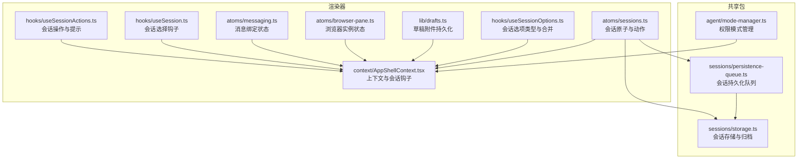
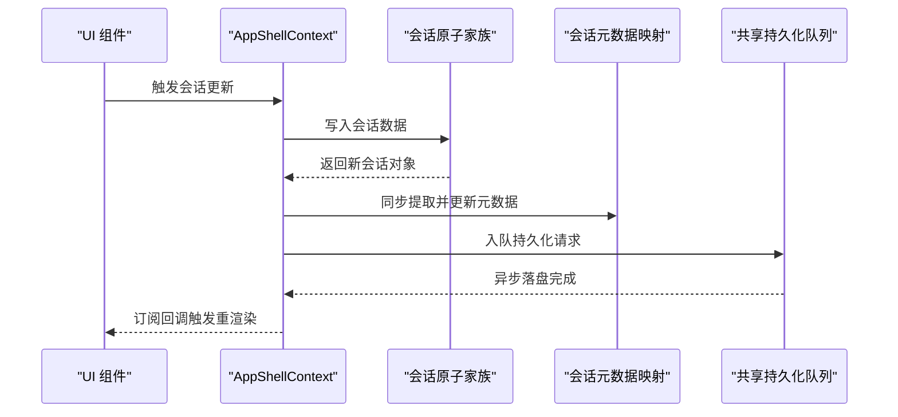
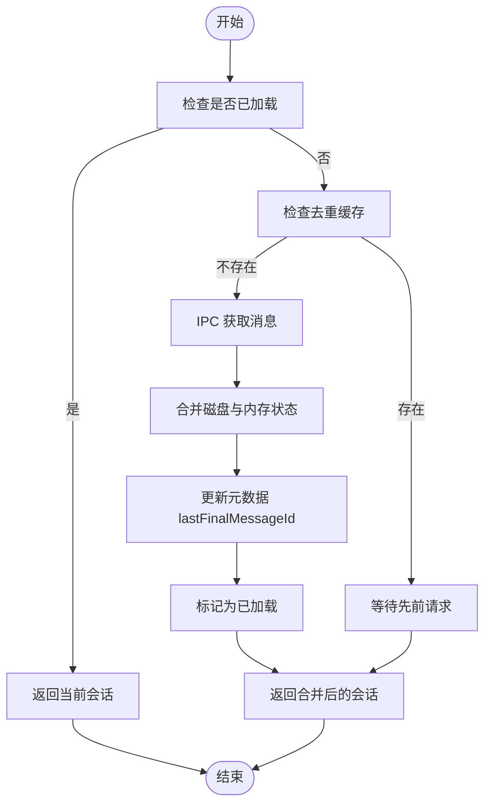
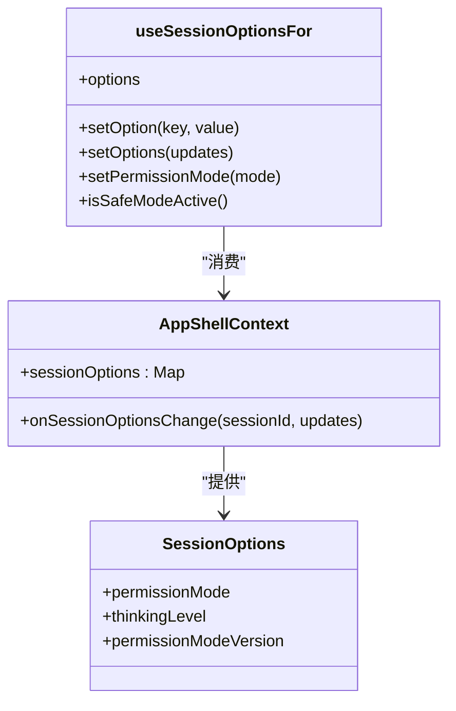
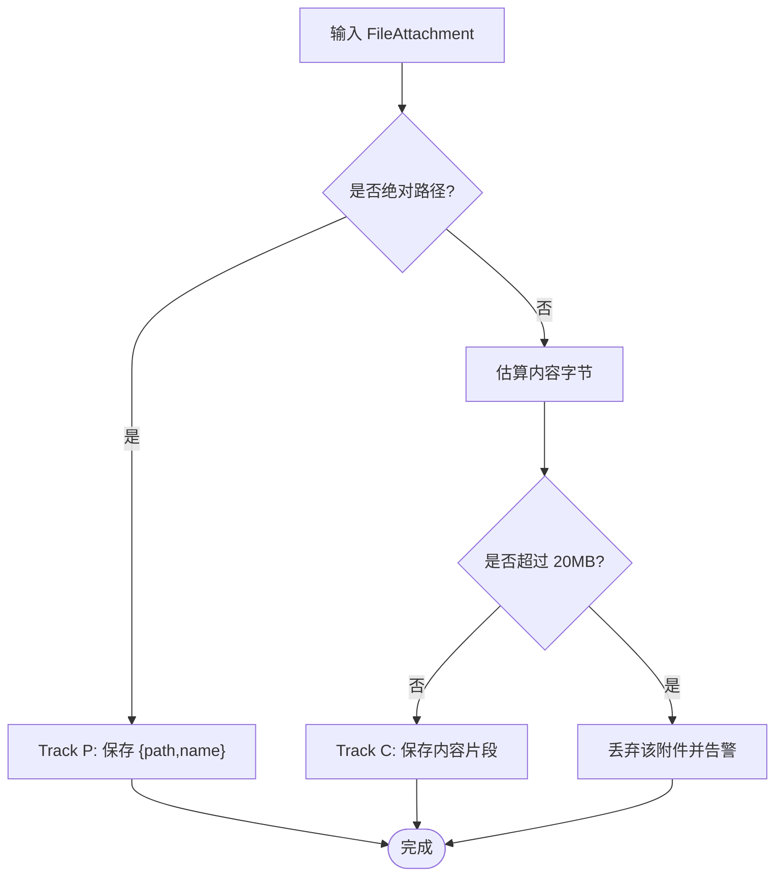
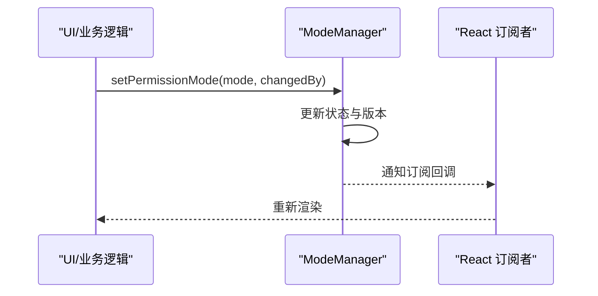
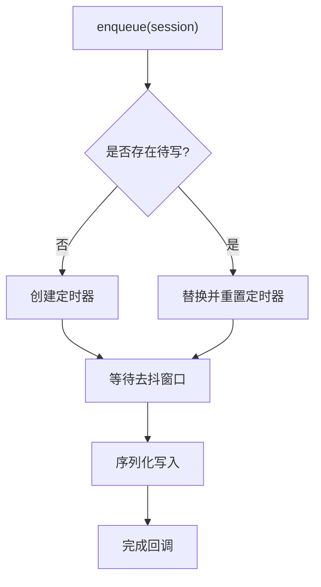
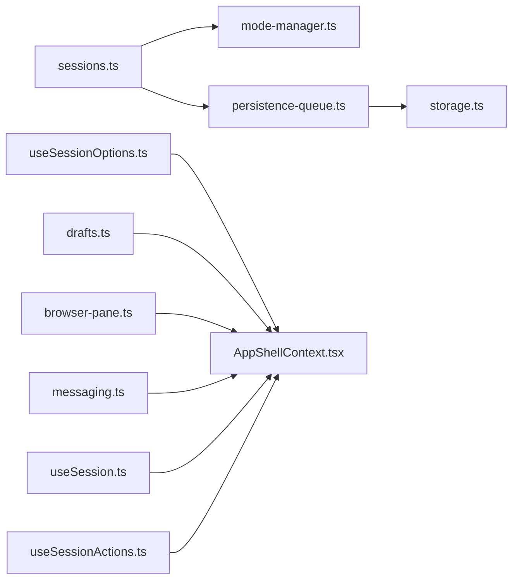

# 状态管理

<cite>
**本文引用的文件**
- [apps/electron/src/renderer/atoms/sessions.ts](file://apps/electron/src/renderer/atoms/sessions.ts)
- [apps/electron/src/renderer/hooks/useSessionOptions.ts](file://apps/electron/src/renderer/hooks/useSessionOptions.ts)
- [apps/electron/src/renderer/lib/drafts.ts](file://apps/electron/src/renderer/lib/drafts.ts)
- [apps/electron/src/renderer/context/AppShellContext.tsx](file://apps/electron/src/renderer/context/AppShellContext.tsx)
- [apps/electron/src/renderer/atoms/browser-pane.ts](file://apps/electron/src/renderer/atoms/browser-pane.ts)
- [apps/electron/src/renderer/atoms/messaging.ts](file://apps/electron/src/renderer/atoms/messaging.ts)
- [apps/electron/src/renderer/hooks/useSession.ts](file://apps/electron/src/renderer/hooks/useSession.ts)
- [apps/electron/src/renderer/hooks/useSessionActions.ts](file://apps/electron/src/renderer/hooks/useSessionActions.ts)
- [packages/shared/src/agent/mode-manager.ts](file://packages/shared/src/agent/mode-manager.ts)
- [packages/shared/src/sessions/persistence-queue.ts](file://packages/shared/src/sessions/persistence-queue.ts)
- [packages/shared/src/sessions/storage.ts](file://packages/shared/src/sessions/storage.ts)
</cite>

## 目录
1. [简介](#简介)
2. [项目结构](#项目结构)
3. [核心组件](#核心组件)
4. [架构总览](#架构总览)
5. [详细组件分析](#详细组件分析)
6. [依赖关系分析](#依赖关系分析)
7. [性能考量](#性能考量)
8. [故障排除指南](#故障排除指南)
9. [结论](#结论)
10. [附录](#附录)

## 简介
本文件系统性梳理本仓库的状态管理方案，重点围绕 Jotai 的使用模式与原子设计原则，详解会话状态管理（sessions.ts）、用户选项状态（useSessionOptions）、草稿状态管理，并深入讲解状态持久化策略、内存优化技巧、状态同步机制。文档同时覆盖状态订阅模式、批量更新、状态回滚思路、调试方法、性能监控与最佳实践，帮助开发者在复杂交互场景下构建可维护、高性能的状态层。

## 项目结构
状态管理相关代码主要分布在渲染器端的 atoms、hooks、context 与 lib 层，以及共享包中的权限模式管理与会话持久化队列。整体采用“原子家族 + 衍生原子 + 动作原子”的分层设计，确保状态隔离、可组合与可扩展。

图表来源
- [apps/electron/src/renderer/atoms/sessions.ts:122-125](file://apps/electron/src/renderer/atoms/sessions.ts#L122-L125)
- [apps/electron/src/renderer/hooks/useSessionOptions.ts:20-48](file://apps/electron/src/renderer/hooks/useSessionOptions.ts#L20-L48)
- [apps/electron/src/renderer/lib/drafts.ts:59-85](file://apps/electron/src/renderer/lib/drafts.ts#L59-L85)
- [apps/electron/src/renderer/context/AppShellContext.tsx:33-174](file://apps/electron/src/renderer/context/AppShellContext.tsx#L33-L174)
- [apps/electron/src/renderer/atoms/browser-pane.ts:11-28](file://apps/electron/src/renderer/atoms/browser-pane.ts#L11-L28)
- [apps/electron/src/renderer/atoms/messaging.ts:30-51](file://apps/electron/src/renderer/atoms/messaging.ts#L30-L51)
- [packages/shared/src/agent/mode-manager.ts:230-376](file://packages/shared/src/agent/mode-manager.ts#L230-L376)
- [packages/shared/src/sessions/persistence-queue.ts:59-78](file://packages/shared/src/sessions/persistence-queue.ts#L59-L78)
- [packages/shared/src/sessions/storage.ts:610-656](file://packages/shared/src/sessions/storage.ts#L610-L656)

章节来源
- [apps/electron/src/renderer/atoms/sessions.ts:1-715](file://apps/electron/src/renderer/atoms/sessions.ts#L1-L715)
- [apps/electron/src/renderer/context/AppShellContext.tsx:1-282](file://apps/electron/src/renderer/context/AppShellContext.tsx#L1-L282)

## 核心组件
- 会话原子家族与动作：以 atomFamily 为每个会话创建独立原子，配合动作原子实现增删改查、懒加载、流式更新与元数据同步。
- 会话选项：集中定义与合并会话级配置（如权限模式、思考层级），通过上下文暴露统一访问接口。
- 草稿附件：区分路径型与内容型附件，控制持久化成本并支持无 IO 水合。
- 权限模式：基于会话维度的权限模式管理，支持订阅与版本控制，避免陈旧事件影响。
- 会话持久化：异步、去抖、序列化的持久化队列，保证并发安全与性能。
- 浏览器实例与消息绑定：跨进程状态同步到渲染器，保持 UI 一致性。

章节来源
- [apps/electron/src/renderer/atoms/sessions.ts:122-125](file://apps/electron/src/renderer/atoms/sessions.ts#L122-L125)
- [apps/electron/src/renderer/hooks/useSessionOptions.ts:20-48](file://apps/electron/src/renderer/hooks/useSessionOptions.ts#L20-L48)
- [apps/electron/src/renderer/lib/drafts.ts:59-85](file://apps/electron/src/renderer/lib/drafts.ts#L59-L85)
- [packages/shared/src/agent/mode-manager.ts:230-376](file://packages/shared/src/agent/mode-manager.ts#L230-L376)
- [packages/shared/src/sessions/persistence-queue.ts:59-78](file://packages/shared/src/sessions/persistence-queue.ts#L59-L78)

## 架构总览
Jotai 在渲染器侧承担“状态源”角色，结合主进程推送与本地持久化，形成“原子家族 + 动作原子 + 衍生原子”的状态树。会话状态以原子家族隔离，动作原子负责幂等写入与跨原子事务性更新；元数据与列表视图分离，避免消息变更引发的全量重渲染；权限模式与持久化队列由共享包提供，确保一致性和可靠性。

图表来源
- [apps/electron/src/renderer/context/AppShellContext.tsx:206-209](file://apps/electron/src/renderer/context/AppShellContext.tsx#L206-L209)
- [apps/electron/src/renderer/atoms/sessions.ts:170-186](file://apps/electron/src/renderer/atoms/sessions.ts#L170-L186)
- [packages/shared/src/sessions/persistence-queue.ts:73-78](file://packages/shared/src/sessions/persistence-queue.ts#L73-L78)

## 详细组件分析

### 会话状态管理（sessions.ts）
- 原子家族与隔离更新
  - 使用 atomFamily 为每个会话创建独立原子，避免跨会话重渲染。
  - 提供 updateSessionAtom、replaceLoadedSessionAtom、appendMessageAtom、updateStreamingContentAtom 等动作原子，确保流式场景下的局部更新。
- 元数据与列表视图分离
  - 用 sessionMetaMapAtom 存放轻量元数据，避免消息数组参与列表渲染。
  - extractSessionMeta 将完整会话转换为元数据，减少不必要的字段拷贝。
- 懒加载与去重请求
  - loadedSessionsAtom 标记已加载会话；ensureSessionMessagesLoadedAtom 与 promise 缓存防止并发重复请求。
  - loadSessionMessages 合并磁盘与内存状态，保护流式过程中的中间态。
- 工作区切换与内存回收
  - initializeSessionsAtom 清理旧工作区遗留原子；removeSessionAtom 删除原子家族条目，允许 GC 回收。
- 同步策略
  - syncSessionsToAtomsAtom 在非处理状态下将 React 状态同步至原子；保护流式期间原子为源的事实真相，避免覆盖。

图表来源
- [apps/electron/src/renderer/atoms/sessions.ts:550-656](file://apps/electron/src/renderer/atoms/sessions.ts#L550-L656)

章节来源
- [apps/electron/src/renderer/atoms/sessions.ts:118-715](file://apps/electron/src/renderer/atoms/sessions.ts#L118-L715)

### 用户选项状态（useSessionOptions）
- 类型与默认值
  - 定义 SessionOptions 接口与 defaultSessionOptions，统一新增选项流程。
- 合并与暴露
  - mergeSessionOptions 支持部分更新合并；AppShellContext 暴露 sessionOptions 映射与 onSessionOptionsChange 回调。
- 钩子封装
  - useSessionOptionsFor 提供 setOption/setOptions/setPermissionMode/isSafeModeActive 等便捷方法，降低组件耦合。

图表来源
- [apps/electron/src/renderer/hooks/useSessionOptions.ts:20-48](file://apps/electron/src/renderer/hooks/useSessionOptions.ts#L20-L48)
- [apps/electron/src/renderer/context/AppShellContext.tsx:244-281](file://apps/electron/src/renderer/context/AppShellContext.tsx#L244-L281)

章节来源
- [apps/electron/src/renderer/hooks/useSessionOptions.ts:1-50](file://apps/electron/src/renderer/hooks/useSessionOptions.ts#L1-L50)
- [apps/electron/src/renderer/context/AppShellContext.tsx:244-281](file://apps/electron/src/renderer/context/AppShellContext.tsx#L244-L281)

### 草稿状态管理（drafts.ts）
- 附件跟踪策略
  - Track P（路径型）：仅持久化 {path, name}，水合时通过 RPC 读取。
  - Track C（内容型）：内联 base64/text，水合时直接重建 FileAttachment，无需 IO。
- 成本估算与上限
  - estimateContentBytes 估算字节大小，超过 CONTENT_PERSIST_CAP（约 20MB）则丢弃，避免草稿膨胀。
- 检测与水合
  - isAbsolutePath 判定绝对路径；toDraftRef 生成持久化引用；attachmentFromContentRef 从内容重建附件。

图表来源
- [apps/electron/src/renderer/lib/drafts.ts:24-85](file://apps/electron/src/renderer/lib/drafts.ts#L24-L85)

章节来源
- [apps/electron/src/renderer/lib/drafts.ts:1-86](file://apps/electron/src/renderer/lib/drafts.ts#L1-L86)

### 权限模式与状态同步（mode-manager.ts）
- 会话级权限模式
  - ModeManager 为每个 sessionId 维护状态，支持设置、订阅与清理；提供 consumeUserModeSignal 防止重复消费用户信号。
- 与 Jotai 的协作
  - AppShellContext 通过 useSessionOptionsFor 与 useSessionOptionsChange 与外部状态联动，结合 useSyncExternalStore 可接入 React 订阅。

图表来源
- [packages/shared/src/agent/mode-manager.ts:230-376](file://packages/shared/src/agent/mode-manager.ts#L230-L376)
- [apps/electron/src/renderer/context/AppShellContext.tsx:244-281](file://apps/electron/src/renderer/context/AppShellContext.tsx#L244-L281)

章节来源
- [packages/shared/src/agent/mode-manager.ts:224-390](file://packages/shared/src/agent/mode-manager.ts#L224-L390)
- [apps/electron/src/renderer/context/AppShellContext.tsx:244-281](file://apps/electron/src/renderer/context/AppShellContext.tsx#L244-L281)

### 会话持久化策略（persistence-queue.ts 与 storage.ts）
- 去抖与序列化
  - SessionPersistenceQueue 对同一会话的多次写入进行去抖与合并，串行化写入，避免竞态与阻塞。
- 元数据与归档
  - storage.ts 提供会话元数据更新、归档/取消归档等操作，配合持久化队列保证一致性。

图表来源
- [packages/shared/src/sessions/persistence-queue.ts:73-78](file://packages/shared/src/sessions/persistence-queue.ts#L73-L78)
- [packages/shared/src/sessions/storage.ts:610-656](file://packages/shared/src/sessions/storage.ts#L610-L656)

章节来源
- [packages/shared/src/sessions/persistence-queue.ts:59-78](file://packages/shared/src/sessions/persistence-queue.ts#L59-L78)
- [packages/shared/src/sessions/storage.ts:610-656](file://packages/shared/src/sessions/storage.ts#L610-L656)

### 其他状态原子（browser-pane.ts 与 messaging.ts）
- 浏览器实例状态
  - browserInstancesMapAtom、activeBrowserInstanceIdAtom 等，支持实例增删改与 tombstone 防止过期更新。
- 消息绑定状态
  - messagingBindingsAtom 与按会话分组的派生映射，统一启用状态与访问策略。

章节来源
- [apps/electron/src/renderer/atoms/browser-pane.ts:11-82](file://apps/electron/src/renderer/atoms/browser-pane.ts#L11-L82)
- [apps/electron/src/renderer/atoms/messaging.ts:30-75](file://apps/electron/src/renderer/atoms/messaging.ts#L30-L75)

### 会话选择与操作（useSession.ts 与 useSessionActions.ts）
- 会话选择
  - useSession 保留向后兼容；推荐使用 useSessionSelection 系列钩子进行多选与批量操作。
- 操作与提示
  - useSessionActions 封装标志、归档、删除等操作，并提供可撤销的 toast 提示。

章节来源
- [apps/electron/src/renderer/hooks/useSession.ts:25-45](file://apps/electron/src/renderer/hooks/useSession.ts#L25-L45)
- [apps/electron/src/renderer/hooks/useSessionActions.ts:13-87](file://apps/electron/src/renderer/hooks/useSessionActions.ts#L13-L87)

## 依赖关系分析
- 渲染器 atoms 与 hooks 依赖共享包的权限模式与会话存储；AppShellContext 作为统一入口协调各模块。
- 会话原子家族与动作原子之间存在强耦合：动作原子负责跨原子事务性更新，衍生原子负责派生列表与计数。
- 持久化队列与存储模块解耦：渲染器只负责入队，共享包负责落盘细节。

图表来源
- [apps/electron/src/renderer/atoms/sessions.ts:122-125](file://apps/electron/src/renderer/atoms/sessions.ts#L122-L125)
- [apps/electron/src/renderer/context/AppShellContext.tsx:33-174](file://apps/electron/src/renderer/context/AppShellContext.tsx#L33-L174)
- [packages/shared/src/agent/mode-manager.ts:230-376](file://packages/shared/src/agent/mode-manager.ts#L230-L376)
- [packages/shared/src/sessions/persistence-queue.ts:59-78](file://packages/shared/src/sessions/persistence-queue.ts#L59-L78)
- [packages/shared/src/sessions/storage.ts:610-656](file://packages/shared/src/sessions/storage.ts#L610-L656)

## 性能考量
- 原子家族隔离
  - 通过 sessionAtomFamily 与 useSession 钩子，确保单一会话更新不波及其他会话，显著降低重渲染范围。
- 懒加载与去重
  - ensureSessionMessagesLoadedAtom 与 promise 缓存避免并发重复请求；loadedSessionsAtom 控制加载边界。
- 元数据分离
  - sessionMetaMapAtom 不包含消息数组，列表渲染不依赖重型消息字段。
- 写入去抖与串行化
  - SessionPersistenceQueue 对同一会话串行化写入，去抖合并，避免频繁 IO 与竞态。
- 内存回收
  - 工作区切换时清理原子家族条目；移除会话时删除对应原子与 UI 状态族，释放内存。

章节来源
- [apps/electron/src/renderer/atoms/sessions.ts:282-322](file://apps/electron/src/renderer/atoms/sessions.ts#L282-L322)
- [apps/electron/src/renderer/atoms/sessions.ts:433-461](file://apps/electron/src/renderer/atoms/sessions.ts#L433-L461)
- [packages/shared/src/sessions/persistence-queue.ts:59-78](file://packages/shared/src/sessions/persistence-queue.ts#L59-L78)

## 故障排除指南
- 流式更新丢失或闪烁
  - 确认 syncSessionsToAtomsAtom 在流式期间不覆盖原子；必要时等待“交接事件”后再同步。
  - 检查 appendMessageAtom 与 updateStreamingContentAtom 是否正确追加到最新消息。
- 懒加载后消息被清空
  - 确保 loadSessionMessages 合并逻辑保留正在流式的内存消息；检查 preservedStaleMessages 分支。
- 列表跳变或排序异常
  - 检查 sessionIdsAtom 的排序逻辑与 lastMessageAt 更新时机；避免中间工具消息更新时间戳。
- 内存占用过高
  - 确认工作区切换后清理了原子家族条目；移除会话后删除 UI 状态族；避免在上下文中持有完整消息数组。
- 权限模式不同步
  - 检查 ModeManager 的订阅与 consumeUserModeSignal；确认 AppShellContext 的回调链路。
- 持久化未生效或冲突
  - 查看 SessionPersistenceQueue 的去抖与串行化行为；确认同一会话的写入顺序。

章节来源
- [apps/electron/src/renderer/atoms/sessions.ts:479-534](file://apps/electron/src/renderer/atoms/sessions.ts#L479-L534)
- [apps/electron/src/renderer/atoms/sessions.ts:550-656](file://apps/electron/src/renderer/atoms/sessions.ts#L550-L656)
- [packages/shared/src/agent/mode-manager.ts:318-333](file://packages/shared/src/agent/mode-manager.ts#L318-L333)
- [packages/shared/src/sessions/persistence-queue.ts:59-78](file://packages/shared/src/sessions/persistence-queue.ts#L59-L78)

## 结论
本状态管理方案以 Jotai 为核心，结合原子家族、动作原子与衍生原子，实现了高隔离、低耦合、可扩展的状态层。通过元数据分离、懒加载、去重与内存回收，有效提升性能与稳定性；借助共享包的权限模式与持久化队列，保障一致性与可靠性。建议在新增状态时遵循“家族隔离 + 动作原子 + 衍生派生”的范式，并配套完善的调试与监控手段。

## 附录
- 最佳实践清单
  - 使用 atomFamily 为每个实体创建独立原子，避免全局重渲染。
  - 所有写入通过动作原子进行，保证跨原子事务性与幂等性。
  - 列表视图仅依赖元数据，不包含重型字段。
  - 懒加载与去重缓存配合，避免并发重复请求。
  - 持久化采用去抖与串行化，避免竞态与阻塞。
  - 及时清理不再使用的原子与 UI 状态族，防止内存泄漏。
  - 对关键状态（如权限模式）提供订阅与版本控制，避免陈旧事件影响。
- 调试建议
  - 使用 Jotai Devtools 或日志追踪原子变化与派生计算。
  - 在流式场景下，优先以原子为源的事实真相为准，避免覆盖中间态。
  - 对批量更新与持久化队列增加可观测性，记录入队、去抖与写入耗时。